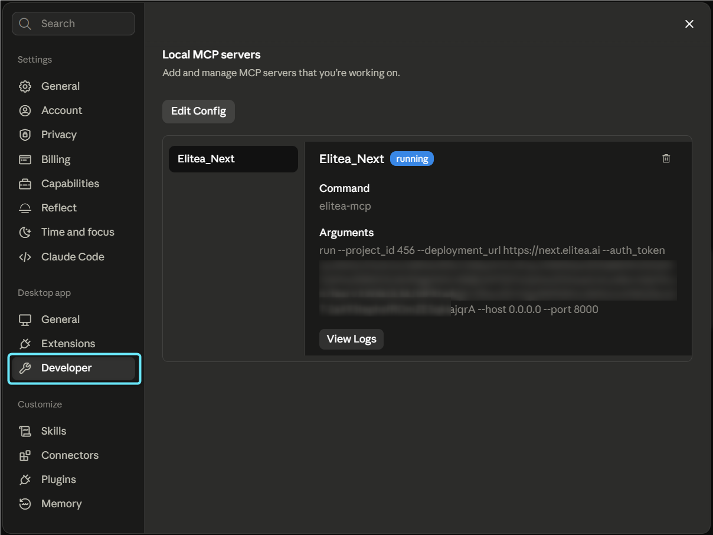
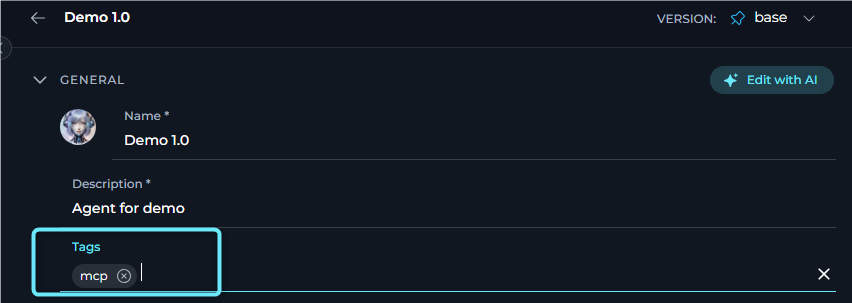
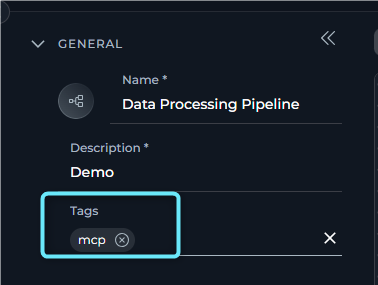
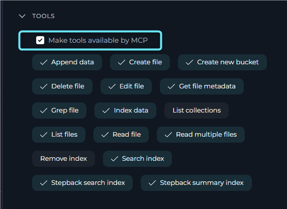

## Overview

You can connect **Claude Code** to **Elitea** through Model Context Protocol (MCP) and use:

- **Agents** tagged with `mcp`
- **Pipelines** tagged with `mcp`
- **Toolkit tools** with **Make Tools Available by MCP** enabled

This is useful when you want Claude Code to call Elitea capabilities directly from your local development workflow.

---

## Prerequisites

Before you start, verify that you have:

- **Claude Code** installed
- **Python 3.10+** installed
- **pipx** installed
- **elitea-mcp** installed with `pipx`
- **Elitea deployment URL** (example: `https://next.elitea.ai`)
- **Elitea personal access token** from [Create Personal Access Token](../../getting-started/create-personal-access-token)
- **Elitea project ID** from [AI Configuration](../../menus/settings/ai-configuration#server-configuration-fields)

---

## Install `pipx` & `elitea-mcp`

Install `pipx` and `elitea-mcp` on your operating system using one of the following methods.

### macOS

Use the following commands to install `pipx` and `elitea-mcp` on macOS:

```bash
python3 -m pip install --user pipx
python3 -m pipx ensurepath
pipx install elitea-mcp
```

### Windows

Use the following steps to install `pipx` and `elitea-mcp` on Windows:

1. **Open PowerShell**: Press `Windows key`, type "PowerShell", and press Enter.
2. **Install pipx**:
    ```powershell
    python -m pip install --user pipx
    ```
3. **Set up pipx path**:
    ```powershell
    python -m pipx ensurepath
    ```
4. **Install elitea-mcp**:
    ```powershell
    pipx install elitea-mcp
    ```

   <video controls width="100%" aria-label="Install pipx and elitea-mcp on Windows.">
     <source src="../../img/integrations/mcp/mcp-setup/install-pipx-&-elitea-mcp.mp4" type="video/mp4" />
   </video>

<Note>
Restart your terminal so `pipx` and `elitea-mcp` are available in `PATH`.
</Note>

---

## Configure Claude Code

Open the Claude Code MCP configuration and add an Elitea server entry.

1. In **Claude Code Desktop**, open **Settings**.
2. Select **Developer**.
3. In **Local MCP Servers**, select **Edit Config** to open the MCP configuration JSON file.
4. Add the Elitea MCP server parameters to the JSON file.

   

<Note>
After updating the MCP configuration, fully close and reopen **Claude Code Desktop** before the configured MCP servers appear in the UI.
</Note>

Use the following example as a template:

```json
{
  "mcpServers": {
    "Elitea_Next": {
      "command": "elitea-mcp",
      "args": [
        "run",
        "--project_id", "13",
        "--deployment_url", "https://next.elitea.ai",
        "--auth_token", "<your_elitea_token>",
        "--host", "0.0.0.0",
        "--port", "8000"
      ]
    }
  }
}
```

Replace:

- `13` with your Elitea project ID
- `https://next.elitea.ai` with your Elitea URL
- `<your_elitea_token>` with your personal access token

<Note>
Claude Code configuration location may vary by installation method and OS. Open Claude Code settings for **Local MCP Servers** and edit the generated config file there.
</Note>

---

## Make Elitea Items Available in MCP

Claude Code will only see Elitea items that are exposed through MCP. Tag agents and pipelines with `mcp`, or enable the MCP option on toolkit tools.

**Agents**

Add the tag `mcp` to the agent and save it.



**Pipelines**

Add the tag `mcp` to the pipeline and save it.



**Toolkit tools**

When creating or editing a toolkit:

1. Open the **Tools** section.
2. Select the tools you want to expose.
3. Enable **Make Tools Available by MCP**.
4. Save the toolkit.

For more information, see [Expose Elitea Tools via MCP](./make-tools-available-by-mcp).



---

## Use Elitea Tools in Claude Code

After the MCP server is running in Claude Code:

1. Open Claude Code.
2. Verify that the Elitea MCP server is shown as **running**.
3. Start a prompt that requires an Elitea agent, pipeline, or toolkit tool.
4. Claude Code will discover and use the available MCP tools.

If you add agents, pipelines, or toolkit tools, restart the Elitea MCP server in Claude Code.

<video controls width="100%" aria-label="Use Elitea in Claude Code.">
  <source src="../../img/integrations/mcp/claude-code/use-elitea-in-claude-code.mp4" type="video/mp4" />
</video>

---

## Quick Troubleshooting

<Accordion title="Elitea tools do not appear">
Check that:

- The agent or pipeline has the `mcp` tag.
- The toolkit has **Make Tools Available by MCP** enabled.
- The correct **project ID** is used.
- The personal token is valid.
- The MCP server was restarted after changes.
</Accordion>

<Accordion title="elitea-mcp command is not found">
Check that:

- `pipx` was installed successfully.
- Your terminal was restarted.
- `elitea-mcp` is available in `PATH`.
</Accordion>

<Accordion title="Server is added but not running">
Check that:

- The config JSON is valid.
- `deployment_url`, `project_id`, and `auth_token` are correct.
- `elitea-mcp` is up to date. If Claude Code cannot connect to the Elitea MCP server, upgrade it with `pipx upgrade elitea-mcp`.
- Local firewall or security tools are not blocking the process.
</Accordion>

---

## Guides & References

<Info>

- For more information, see [Set Up a Local MCP Server (STDIO)](./create-and-use-server-stdio).
- For more information, see [Elitea MCP Server (SSE)](./mcp-server-sse).
- For more information, see [Expose Elitea Tools via MCP](./make-tools-available-by-mcp).

</Info>
