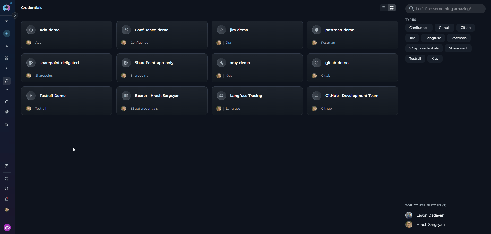
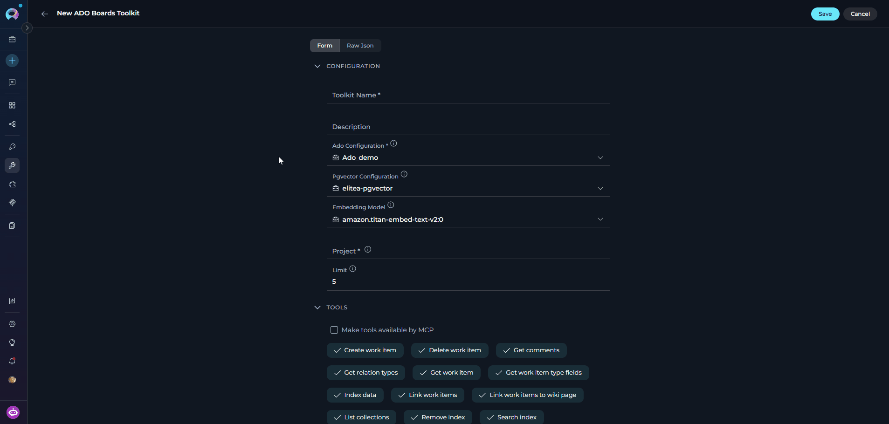
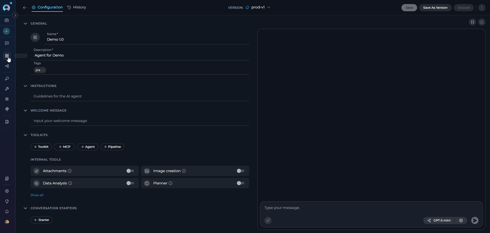
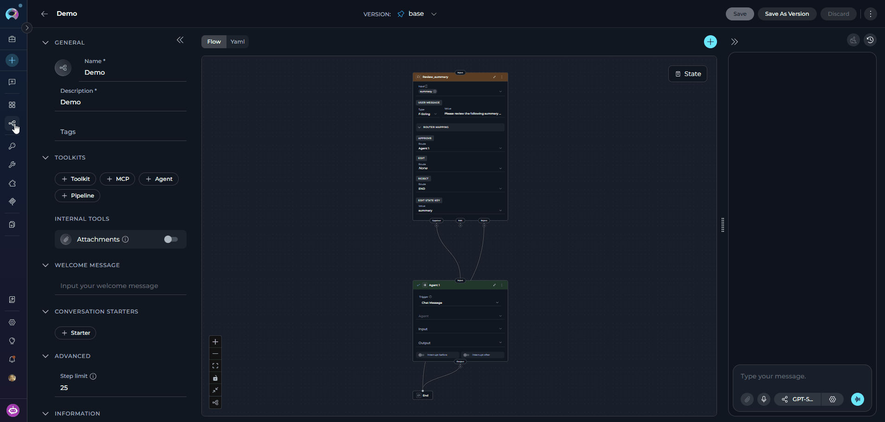
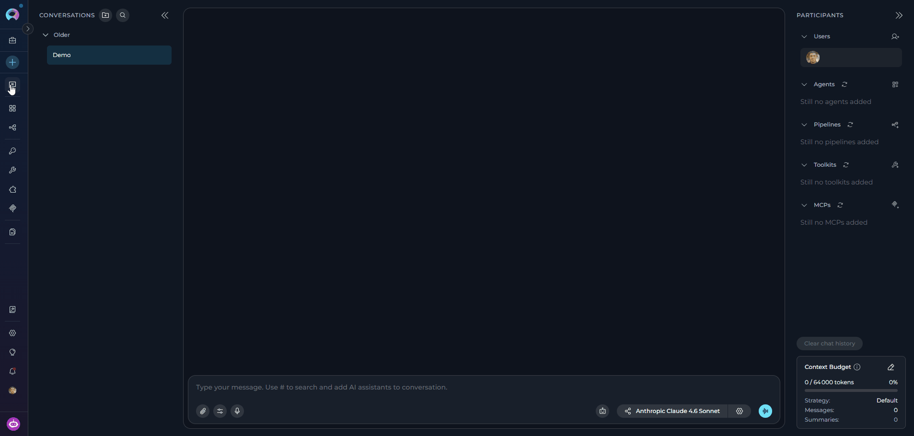

## Introduction

This guide provides step-by-step instructions for integrating and using the **Azure DevOps Boards (ADO Boards) toolkit** within ELITEA. It covers everything from setting up your Azure DevOps Personal Access Token to configuring the toolkit and using it within your Agents, Pipelines, and Chat conversations.

**Azure Boards (ADO Boards)**

Azure Boards is a work tracking and project management service for planning, organizing, and tracking tasks, user stories, bugs, features, and epics. It includes agile planning tools, customizable dashboards, and workflow automation to help teams manage their work effectively.

Integrating Azure DevOps Boards with ELITEA enables your Agents, Pipelines, and Chat conversations to intelligently interact with work items — automating bug creation, status updates, task searches, and linking as part of AI-driven workflows.

## Toolkit's Account Setup and Configuration

### Account Setup

Create an Azure DevOps account and organization to access the Boards service.

1.  **Visit Azure DevOps:** Navigate to [https://dev.azure.com/](https://dev.azure.com/)
2.  **Start Free or Sign In:** Click **"Start free"** to create a new organization, or **"Sign in to Azure DevOps"** for existing accounts
3.  **Create Organization:** Follow prompts to set up your organization (provide name, select hosting region, optionally link to Azure account)
4.  **Verify Email:** Confirm your email address if prompted
5.  **Enable Basic Subscription:** Verify **Basic subscription** is enabled (typically enabled by default)
6.  **Add Users (Optional):** Navigate to `https://dev.azure.com/{YourOrganizationName}/_settings/users`, click **"Add users"**, enter user details, select **"Basic"** access level, and click **"Add"**
    
7.  **Verify Access:** Confirm **"Boards"** appears in the left sidebar of your project

<Info title="Service Availability">
If Boards isn't visible, verify it is enabled in organization settings under General → Services.
</Info>

### Generate a Personal Access Token (PAT)

For secure integration with ELITEA, use an Azure DevOps **Personal Access Token (PAT)**.

1.  **Log in to Azure DevOps:** Navigate to `https://dev.azure.com/` and log in.
2.  **Access User Settings:** Click the **User settings** icon (top right) → select **"Personal access tokens"**.
3.  **Generate New Token:** Click **"+ New Token"**.
4.  **Configure Token Details:**
    *   **Name:** Enter a descriptive label (e.g., "ELITEA Boards Integration")
    *   **Organization:** Select your organization
    *   **Expiration:** Set an expiration date
    *   **Scopes:** Select **Custom defined**, then enable:
        *   **Work items** → **Read** (to read work item details)
        *   **Work items** → **Write** (to create or update work items — only if needed)

5.  **Create Token:** Click **"Create"**.
6.  **Copy and Store Token:** Copy the token immediately and store it securely in a password manager or ELITEA's **[Secrets](../../menus/settings/secrets)** feature.

    

<Warning title="Important Security Practices">
**Principle of Least Privilege:** Grant only the scopes essential for your ELITEA integration.

**Avoid "Full Access" Scopes:** Never grant full access unless absolutely necessary.

**Regular Token Review and Rotation:** Rotate tokens periodically as a security best practice.
</Warning>

## System Integration with ELITEA

To integrate Azure DevOps Boards with ELITEA, follow this three-step process: **Create Credentials → Create Toolkit → Use in Agents**.

### Step 1: Create Azure DevOps Credentials

1. **Navigate to Credentials Menu:** Open the sidebar and select **[Credentials](../../menus/credentials)**.
2. **Create New Credential:** Click the **`+ Create`** button.
3. **Select Azure DevOps:** Choose **Ado** as the credential type.

    

4. **Configure Credential Details:**

    | Field | Description | Example |
    |-------|-------------|---------|
    | **Display Name** | Descriptive name for the credential | `Azure DevOps - Boards Access` |
    | **ID** | Unique identifier | Auto-populated from the Display Name |
    | **Organization Url** | Your Azure DevOps organization URL | `https://dev.azure.com/MyCompany` |
    | **Token** | Your PAT or a secret containing your PAT | `ghp_1234...` |

5. **Test Connection:** Click **Test Connection** to verify credentials.
6. **Save Credential:** Click **Save**.

    

<Tip title="Security Recommendation">
Use **[Secrets](../../menus/settings/secrets)** for your PAT instead of entering values directly.
</Tip>

### Step 2: Create the Azure DevOps Boards Toolkit

1. **Navigate to Toolkits Menu:** Open the sidebar and select **[Toolkits](../../menus/toolkits)**.
2. **Create New Toolkit:** Click the **`+ Create`** button.
3. **Select Azure Boards:** Choose **Azure Boards (ADO Board)** from the available toolkit types.

    

4. **Configure Toolkit Settings:**

    | **Field** | **Description** | **Example** |
    |-----------|-----------------|-------------|
    | **Toolkit Name** | Descriptive name for your toolkit | `ADO Boards - Work Item Manager` |
    | **Description** | Optional description of the toolkit's purpose | `Toolkit for managing work items, bugs, and user stories` |
    | **Ado Configuration** | Select your Azure DevOps credential. A credential may be pre-selected — verify it is correct or change it as needed. | `Azure DevOps - Boards Access` |
    | **PgVector Configuration** | PgVector connection for vector database (required for indexing tools) | `elitea-pgvector` |
    | **Embedding Model** | Embedding model for semantic search | `text-embedding-3-small` |
    | **Project** | Your Azure DevOps project name | `ProjectAlpha` |
    | **Limit** | Default result limit for board queries (can be overridden by agent instructions) | `5` |

5. **Enable Desired Tools:** Select the checkboxes next to the specific boards tools you want to enable. Enable only the tools your agents will actually use.
    * **[Make Tools Available by MCP](../mcp/make-tools-available-by-mcp)** — (optional) Make selected tools accessible through external MCP clients.
6. **Save Toolkit:** Click **Save**.

     

#### Available Boards Tools

| **Tool Category** | **Tool Name** | **Description** | **Primary Use Case** |
|:-----------------:|---------------|-----------------|----------------------|
| **Work Item Search & Retrieval** | | | |
| | **Search work items** | Search for work items using a WIQL query and dynamically fetch fields | Find tasks, bugs, or user stories matching criteria |
| | **Get work item** | Get a single work item by ID | Retrieve detailed information about a specific work item |
| | **Get comments** | Get comments for a work item by ID | Access discussion history, optionally with embedded image descriptions |
| | **Get image by url** | Analyze an image attachment from an Azure DevOps work item attachment URL | Extract text and describe screenshots or other attached images |
| | **Get work item type fields** | Get fields for a specific work item type | Retrieve field definitions and metadata |
| **Work Item Management** | | | |
| | **Create work item** | Creates new work items | Add new tasks, bugs, or features programmatically |
| | **Update work item** | Updates existing work items | Modify work item status, fields, or properties |
| | **Delete work item** | Deletes a work item by ID | Remove obsolete or incorrect work items |
| | **Attach file to work item** | Upload a file from ELITEA artifacts and attach it to a work item | Add screenshots, documents, or Gherkin files to work items and optionally render them inline |
| **Work Item Linking** | | | |
| | **Link work items** | Add a relation to the source work item | Establish relationships between work items |
| | **Get relation types** | Returns available relation types | Discover valid link types for work items |
| | **Link work items to wiki page** | Links work items to a specific wiki page using ArtifactLink | Connect work items with wiki documentation |
| | **Unlink work items from wiki page** | Removes ArtifactLink between work items and a wiki page | Remove work item associations from wiki pages |
| **Indexing & Search** | | | |
| | **Index data** | Loads Azure DevOps work item data to index for semantic search | Enable AI-powered semantic search across work items |
| | **Search index** | Performs searches across indexed content | Find specific work item content across indexed data |
| | **Stepback search index** | Performs advanced contextual searches with broader scope | Execute sophisticated searches with expanded context |
| | **Stepback summary index** | Creates comprehensive summaries of indexed content | Generate intelligent summaries of work item information |
| | **Remove index** | Removes previously created search indexes | Clean up and manage indexed content |
| | **List indexes** | Lists available indexed indexes | View and manage indexed data |

<Info>
**Vector Search Tools**

The tools **Index data**, **List indexes**, **Remove index**, **Search index**, **Stepback search index**, and **Stepback summary index** require PgVector configuration and an embedding model.
</Info>

<Info>
**Supported Work Item Attachment Formats**

When retrieving work items with attachments, the toolkit can parse and extract content from the following file types:

- **Documents:** Word (.docx), PowerPoint (.pptx), CSV
- **Email files:** Outlook Message (.msg), MIME Email (.eml) — including email metadata (sender, recipients, subject, date, CC/BCC), body content (plain text and HTML), and nested attachments
</Info>

<Info>
**Image Processing and Caching**
- **Get comments** supports `process_images=True` to analyze images embedded in comment text. When enabled, ELITEA inserts image descriptions next to the original image references in the returned comment content.
- **Get image by url** analyzes a single Azure DevOps work item attachment image directly from its attachment URL.
- Image descriptions are cached inside the toolkit runtime, so repeated analysis of the same image during a session avoids unnecessary duplicate vision-model calls.
</Info>

<Info>
**Gherkin and Attachment Upload Support**

- You can upload `.feature` files or other Gherkin-formatted content to Azure DevOps work items using **Attach file to work item**.
- You can also store Gherkin content directly in HTML-capable work item fields such as `Microsoft.VSTS.TCM.ReproSteps` or `System.Description` by using **Create work item** or **Update work item** with the appropriate Azure DevOps field reference names.
- **Attach file to work item** supports optional inline rendering in an HTML field and can also add the uploaded file reference as a work item comment.
</Info>

#### Testing Toolkit Tools

After configuring the toolkit, test individual tools from the Toolkit detail page using the **Test Settings** panel:

1. **Select LLM Model** from the model dropdown
2. **Select a Tool** from the available boards tools
3. **Provide Input** — enter required parameters or test queries
4. **Run the Test** and review the response

<Tip title="Key benefits of testing toolkit tools:">
* Verify that credentials and connection are configured correctly
* Validate tool functionality with your Azure DevOps environment
* Test different parameter combinations before production use

> For detailed instructions, see **[How to Test Toolkit Tools](../../how-tos/credentials-toolkits/how-to-test-toolkit-tools)**.
</Tip>

---

### Step 3: Add the Boards Toolkit to Your Workflows

#### In Agents

1. **Navigate to Agents:** Open the sidebar and select **[Agents](../../menus/agents)**.
2. **Create or Edit Agent:** Create a new agent or select an existing one.
3. **Add the Toolkit:** In the **TOOLKITS** section, click **"+Toolkit"** and select your ADO Boards toolkit.



#### In Pipelines

1. **Navigate to Pipelines:** Open the sidebar and select **[Pipelines](../../menus/pipelines)**.
2. **Create or Edit Pipeline:** Create a new pipeline or select an existing one.
3. **Add the Toolkit:** In the **TOOLKITS** section, click **"+Toolkit"** and select your ADO Boards toolkit.



#### In Chat

1. **Navigate to Chat:** Open the sidebar and select **[Chat](../../menus/chat)**.
2. **Start New Conversation:** Click **+Create** or open an existing conversation.
3. **Add the Toolkit:** In the **Participants** section, click to add a toolkit and select your ADO Boards toolkit.



<Info title="Example Chat Usage">
- "Find all high-priority bugs assigned to me."
- "Create a new bug for the login issue I just found."
- "List all open tasks assigned to the current sprint."
</Info>

## Instructions and Prompts for Using the ADO Boards Toolkit

When crafting instructions for agents using the ADO Boards toolkit, clarity and precision are essential. Break down tasks into simple, actionable steps and explicitly define all parameters.

**Effective instructions are:**

- **Direct and Action-Oriented:** Use strong action verbs (e.g., "Use the 'search_work_items' tool...", "Create a work item using 'create_work_item'...")
- **Parameter-Centric:** Specify each required parameter and how the agent should obtain its value
- **Step-by-Step Structured:** Use numbered steps for complex workflows

<Info title="Example Agent Instructions">

**Searching for Work Items:**
```markdown
1. Goal: Find all high-priority tasks assigned to the current user.
2. Tool: Use the "search_work_items" tool.
3. Parameters:
    - query: "WIQL query to find Active Tasks with Priority 1 assigned to @Me"
4. Outcome: Display the list of matching work items with ID, title, state, and priority.
```

**Creating a Work Item:**
```markdown
1. Goal: Create a new work item in Azure Boards based on user requirements.
2. Tool: Use the "create_work_item" tool.
3. Parameters:
    - work_item_type: "Ask the user for the type (Task, Bug, User Story, etc.)"
    - title: "Get the work item title from the user"
    - description: "Ask the user for work item details"
    - assigned_to: "Optional — ask if the work item should be assigned to someone"
4. Outcome: Confirm creation to the user with the new work item ID.
```
</Info>

---

## Chat Usage Examples

<Accordion title="Search Work Items">
**Chat Example:**
```
User: "Find all high-priority bugs assigned to me."

Agent Response: [Agent uses search_work_items tool]

🔍 **Search Results: High-Priority Bugs** (3 items):

1. **Bug #1234**: Application crashes on file upload
   - **Priority**: High (Priority 1) | **State**: Active | **Created**: Nov 8, 2025

2. **Bug #1245**: Memory leak in background service
   - **Priority**: High (Priority 1) | **State**: Active | **Created**: Nov 10, 2025

3. **Bug #1251**: Data validation error in user registration
   - **Priority**: High (Priority 1) | **State**: Active | **Created**: Nov 11, 2025
```
</Accordion>

<Accordion title="Create Work Item">
**Chat Example:**
```
User: "Create a new task to update the API documentation."

Agent Response: [Agent uses create_work_item tool]

✅ **Work Item Created Successfully!**

- **Work Item ID**: #1256
- **Type**: Task
- **Title**: Update API documentation
- **State**: New | **Priority**: Medium
```
</Accordion>

<Accordion title="Update Work Item">
**Chat Example:**
```
User: "Change the status of work item #1234 to 'In Progress'."

Agent Response: [Agent uses update_work_item tool]

✅ **Work Item Updated Successfully!**

- **Work Item ID**: #1234
- **Updated Field**: State → **In Progress**
```
</Accordion>

<Accordion title="Get Comments with Image Processing">
**Chat Example:**
```
User: "Show the latest comments on work item #1234 and describe any screenshots."

Agent Response: [Agent uses get_comments with process_images=True]

💬 **Comments for Work Item #1234**

- "The login form still fails in Safari."
- "See attached screenshot below."
    [image-description: Screenshot of the Safari login page showing a validation error under the password field.]
```
</Accordion>

<Accordion title="Attach Screenshot or Gherkin File to Work Item">
**Chat Example:**
```
User: "Attach the generated login-failure screenshot to bug #1234 and add it to the description field."

Agent Response: [Agent uses attach_file_to_work_item]

✅ **Attachment Uploaded Successfully!**

- **Work Item ID**: #1234
- **File**: login-failure.png
- **Attachment**: Added to the work item
- **Inline Rendering**: Appended to System.Description
```
</Accordion>

---

## Best Practices

<Accordion title="Test Integration Thoroughly">
After setting up the toolkit, test each tool you intend to use to ensure connectivity, correct authentication, and accurate execution of board actions.
</Accordion>

<Accordion title="Monitor Agent Performance">
Regularly monitor agents using the ADO Boards toolkit. Track task completion, execution time, and error rates.
</Accordion>

<Accordion title="Follow Security Best Practices">
- Use Personal Access Tokens instead of your main account password
- Grant only the minimum necessary scopes (Work items: Read, Write only if needed)
- Store PATs using ELITEA's Secrets Management feature
</Accordion>

<Accordion title="Provide Clear Instructions">
Craft clear, unambiguous agent instructions. Use WIQL queries precisely and specify field names as required by the Azure DevOps API.
</Accordion>

<Accordion title="Start with Simple Use Cases">
Begin with read-only operations (searching and retrieving work items) before enabling write operations (creating or updating items).
</Accordion>

<Accordion title="Intelligent Work Item Search for Task Prioritization">
- **Scenario:** Developers use ELITEA Agents to quickly find work items assigned to them, filtered by priority or status.
- **Tools Used:** `search_work_items`
- **Example Instruction:** "Use 'search_work_items' to find all 'Task' work items assigned to me that are currently 'Active', sorted by Priority."
- **Benefit:** Improves daily task prioritization without leaving ELITEA.
</Accordion>

<Accordion title="Automated Bug Logging from ELITEA Workflows">
- **Scenario:** When automated tests detect a bug, automatically create a Bug work item pre-populated with error details.
- **Tools Used:** `create_work_item`
- **Example Instruction:** "Use 'create_work_item' to create a new 'Bug' with title 'Automated Test Failure Detected' and description containing the error logs from the failed workflow step."
- **Benefit:** Ensures timely, consistent bug reporting directly from ELITEA workflows.
</Accordion>

<Accordion title="Attach Evidence Files to Work Items">
- **Scenario:** After a failed automated test, attach a screenshot, log bundle, or Gherkin feature file to the related bug.
- **Tools Used:** `attach_file_to_work_item`
- **Example Instruction:** "Use 'attach_file_to_work_item' to upload the generated screenshot artifact to the bug work item and append it inline to System.Description."
- **Benefit:** Keeps diagnostic evidence directly on the work item for faster triage and validation.
</Accordion>

<Accordion title="Store Gherkin Scenarios in Work Items">
- **Scenario:** Teams maintain acceptance criteria or reproducible test scenarios in Gherkin format inside Azure DevOps work items.
- **Tools Used:** `create_work_item`, `update_work_item`, `attach_file_to_work_item`
- **Example Instruction:** "Use 'update_work_item' to add the Gherkin scenario to Microsoft.VSTS.TCM.ReproSteps, or attach the .feature file to the work item if the scenario is maintained as a file artifact."
- **Benefit:** Preserves executable-style test scenarios alongside bugs, tasks, or test-related work items.
</Accordion>

<Accordion title="Automated Work Item Updates Based on Workflow Progress">
- **Scenario:** As tasks progress through ELITEA workflows, automatically update the status of linked work items.
- **Tools Used:** `update_work_item`
- **Example Instruction:** "Use 'update_work_item' to set the State of work item [ID] to 'In Progress' when the workflow reaches the Development stage."
- **Benefit:** Keeps work item statuses synchronized with actual project progress automatically.
</Accordion>

<Accordion title="Automated Linking of Related Work Items">
- **Scenario:** When a new feature work item is created, automatically link it to related User Story work items.
- **Tools Used:** `link_work_items`
- **Example Instruction:** "Use 'link_work_items' to link work item [feature_id] to work item [user_story_id] using the 'Relates to' link type."
- **Benefit:** Provides clear traceability between features, user stories, and tasks.
</Accordion>

---

## Troubleshooting

<Accordion title="Connection Issues">
**Problem:** Agent fails to connect to Azure DevOps Boards.

1. Verify the organization URL is correct (e.g., `https://dev.azure.com/YourOrganizationName`)
2. Check that your PAT is accurate and not expired
3. Regenerate the PAT if needed and update your ELITEA credential
4. Verify network connectivity and firewall settings
</Accordion>

<Accordion title="Authorization Errors">
**Problem:** "Permission Denied" or "Unauthorized" errors.

1. Ensure the PAT has the `vso.work_full` scope (or at minimum `vso.work` for read-only)
2. Verify your Azure DevOps account has the necessary project permissions
3. Check that the PAT has not expired
</Accordion>

<Accordion title="Incorrect Organization or Project Names">
**Problem:** Cannot find specified organization or project.

1. Verify the organization name matches your Azure DevOps URL exactly
2. Confirm the project name is correct (case-sensitive)
3. Ensure the URL format is: `https://dev.azure.com/YourOrganizationName`
</Accordion>

<Accordion title="Work Item Access Issues">
**Problem:** Cannot access specific work items.

1. Confirm the work item ID exists in the specified project
2. Verify the PAT has appropriate work item scopes
3. Ensure Boards is enabled for the project (Project Settings → Services)
4. Check your account has permission to access the specific area path
</Accordion>

<Accordion title="Indexing and Search Tool Errors">
**Problem:** Indexing tools fail or search returns no results.

1. Verify PgVector is properly configured in toolkit settings
2. Confirm an embedding model is selected
3. Ensure the index was created successfully before searching
4. Verify there is data available to index
</Accordion>

<Accordion title="Work Item Creation or Update Fails with Field Errors">
**Problem:** The `create_work_item` or `update_work_item` tool returns an error about invalid or unrecognized field names.

**Cause:** Work item fields must be specified using their Azure DevOps **reference names** (e.g. `System.Title`), not display names.

1. Use the **Get work item type fields** tool to retrieve the correct reference names for your work item type (e.g. `Task`, `Bug`, `Epic`)
2. If the field list looks outdated after a project configuration change, instruct the agent to use `force_refresh=True` when calling the tool to reload definitions from Azure DevOps
3. Use the following common reference names as a starting point:

   | Display Name | Reference Name |
   |---|---|
   | Title | `System.Title` |
   | State | `System.State` |
   | Assigned To | `System.AssignedTo` |
   | Area Path | `System.AreaPath` |
   | Iteration Path | `System.IterationPath` |
   | Priority | `Microsoft.VSTS.Common.Priority` |
   | Tags | `System.Tags` |

4. Ensure the JSON payload uses the correct structure:
   ```json
   {"fields": {"System.Title": "My Task", "System.AreaPath": "ProjectAlpha"}}
   ```
</Accordion>

<Card title="Support Contact" icon="envelope" href="../../support/contact-support">
  If you encounter issues not covered in this guide, contact the ELITEA support team.

  **Email:** SupportAlita@epam.com
</Card>

---

## FAQ

<Accordion title="Can I use my regular Azure DevOps password instead of a Personal Access Token?">
No. You must use a Personal Access Token for secure integration. Regular passwords are not supported.
</Accordion>

<Accordion title="What scopes should I grant to the PAT for Boards?">
Grant **Work items → Read** for read-only access, and additionally **Work items → Write** if the agent needs to create or update work items. Always follow the principle of least privilege.
</Accordion>

<Accordion title="What is the correct format for the Azure DevOps Organization URL?">
`https://dev.azure.com/YourOrganizationName` — replace `YourOrganizationName` with your actual organization name. Do not include the project name in the URL.
</Accordion>

<Accordion title="Can I use the same credential for multiple ADO toolkits?">
Yes. One Azure DevOps credential can be reused across Wiki, Boards, and Test Plans toolkits as long as the PAT has the necessary scopes for all services.
</Accordion>

<Accordion title="How do I find my Azure DevOps organization and project names?">
Your organization name appears in the URL when you log in (e.g., `https://dev.azure.com/YourOrgName`). Project names are listed in the Azure DevOps interface under your organization.
</Accordion>

<Accordion title="Why am I getting 'Permission Denied' errors even with a valid token?">
Verify the PAT has the `vso.work_write` scope for write operations. Also ensure your Azure DevOps account has project-level permissions — a valid token does not automatically grant project access.
</Accordion>

<Accordion title="Do I need PgVector configuration for all boards tools?">
No. PgVector is only required for indexing and semantic search tools: **Index data**, **Search index**, **Stepback search index**, **Stepback summary index**, **Remove index**, and **List indexes**. All other boards tools work without it.
</Accordion>

<Accordion title="Can I attach screenshots or other files to a work item?">
Yes. Use **Attach file to work item** to upload a file from ELITEA artifacts to Azure DevOps. Any file type can be attached. For images, you can optionally render them inline in an HTML-capable field such as `System.Description`. For non-image files, the toolkit inserts a link instead.
</Accordion>

<Accordion title="Can I upload Gherkin scenarios to Azure DevOps work items?">
Yes. You can either:
- put the Gherkin text directly into a work item field using **Create work item** or **Update work item**, or
- upload a `.feature` file using **Attach file to work item**.

For richer rendering inside the work item, use an HTML-capable field such as `System.Description` or `Microsoft.VSTS.TCM.ReproSteps`.
</Accordion>

<Accordion title="How do image descriptions work in comments and attachments?">
For **Get comments**, set `process_images=True` to analyze images embedded in comment text. The toolkit keeps the original image reference and adds a textual description next to it. For direct analysis of a single attachment image, use **Get image by url** with the Azure DevOps attachment URL.
</Accordion>

<Accordion title="Can I use multiple ADO toolkits in the same agent?">
Yes. For example, you can add both the Boards toolkit and the Wiki toolkit to an agent that needs to update documentation and create work items.
</Accordion>

<Accordion title="How do I update my PAT when it expires?">
1. Generate a new PAT in Azure DevOps
2. Navigate to **Credentials** in ELITEA
3. Edit your Azure DevOps credential and update the **Token** field
4. Save the credential — all toolkits using it will automatically use the new token
</Accordion>

<Accordion title="What is the correct JSON format for creating or updating work items?">
Both `create_work_item` and `update_work_item` expect a JSON string with a `fields` key containing Azure DevOps field reference names:

```json
{
  "fields": {
    "System.Title": "Fix login timeout bug",
    "System.Description": "Users are logged out after 5 minutes of inactivity.",
    "System.AreaPath": "ProjectAlpha",
    "System.IterationPath": "ProjectAlpha\\Sprint 12",
    "Microsoft.VSTS.Common.Priority": 1,
    "System.AssignedTo": "user@example.com"
  }
}
```

Use the **Get work item type fields** tool to discover all available reference names for a specific work item type (e.g. `Task`, `Bug`, `Epic`).
</Accordion>

<Accordion title="Can I retrieve all work items without a result limit?">
Yes. By default, `search_work_items` returns up to the **Limit** value configured in the toolkit settings (default: 5). To retrieve all matching results, set `limit=-1` in the agent instruction:

```
Use the 'search_work_items' tool with limit=-1 to return all matching work items.
```

Use this with care on large projects, as it may return a very large number of items.
</Accordion>

<Accordion title="How do I find valid link type names for linking work items?">
Use the **Get relation types** tool to retrieve all valid link type reference names available in your Azure DevOps project. Common examples include:

- `System.LinkTypes.Dependency-forward` — forward dependency
- `System.LinkTypes.Dependency-reverse` — reverse dependency  
- `System.LinkTypes.Related` — related
- `System.LinkTypes.Hierarchy-Forward` — parent → child
- `System.LinkTypes.Hierarchy-Reverse` — child → parent

Always use the reference name (not the display name) when calling the `link_work_items` tool.
</Accordion>

---

<Info title="Useful ELITEA Resources">
- **[Agent Menu](../../menus/agents)** — Complete reference for agent management
- **[How to Use Chat Functionality](../../how-tos/chat-conversations/how-to-use-chat-functionality)** — Guide to using ELITEA Chat with toolkits
- **[Create and Edit Agents from Canvas](../../how-tos/chat-conversations/how-to-create-and-edit-agents-from-canvas)** — Quickly create agents from chat canvas
- **[Indexing Overview](../../how-tos/indexing/indexing-overview)** — Understanding ELITEA's indexing capabilities
- **[Azure Repos (ADO Repos) Toolkit Integration Guide](./ado_repos_toolkit)** — Integrate Azure Repos for version control
</Info>

<Info title="External Resources">
- **[Azure DevOps Documentation](https://learn.microsoft.com/en-us/azure/devops/)** — Official Microsoft documentation
- **[Azure Boards Documentation](https://learn.microsoft.com/en-us/azure/devops/boards/)** — Work item tracking, backlogs, sprints, and Kanban boards
- **[Personal Access Tokens Guide](https://learn.microsoft.com/en-us/azure/devops/organizations/accounts/use-personal-access-tokens-to-authenticate)** — Best practices for PAT management
</Info>
