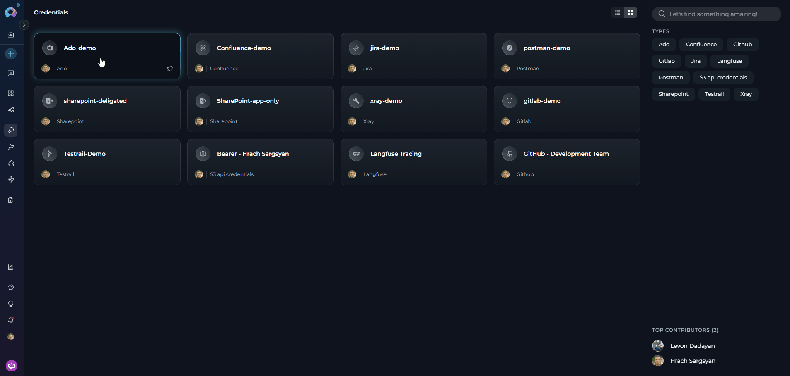
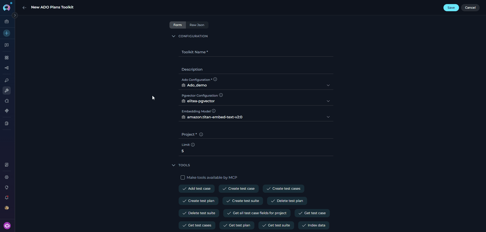
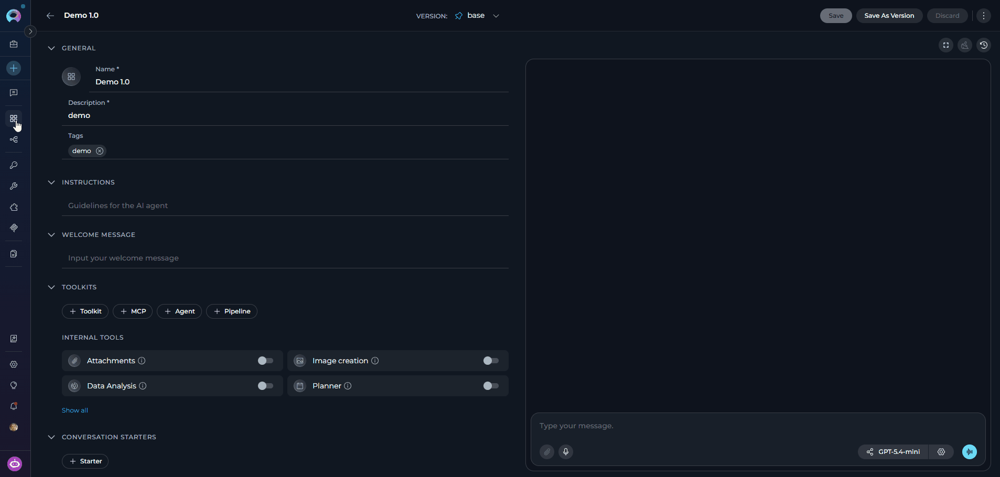
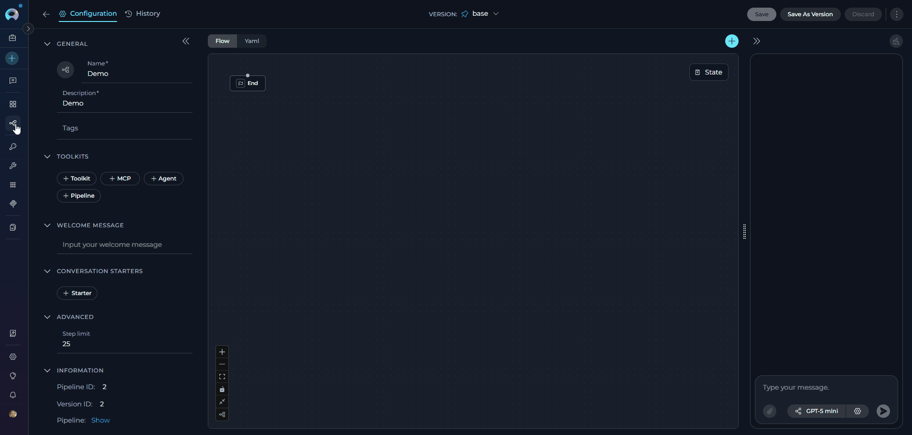
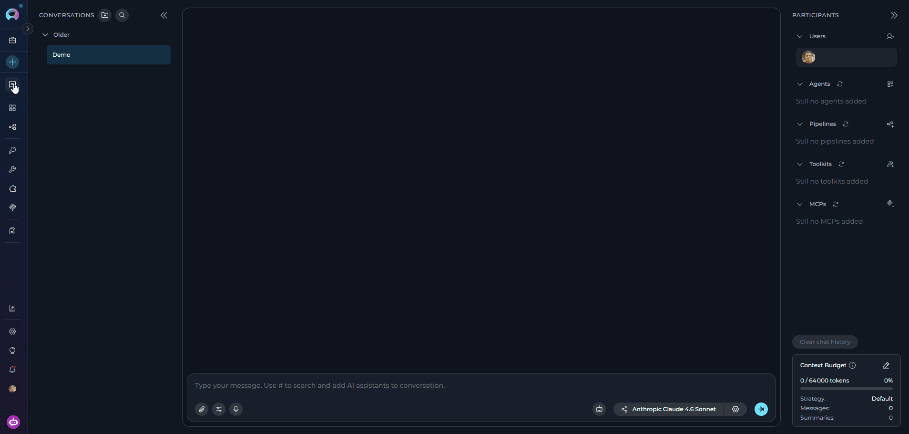

## Introduction

This guide provides step-by-step instructions for integrating and using the **Azure DevOps Test Plans (ADO Test Plans) toolkit** within ELITEA. It covers everything from setting up your Azure DevOps Personal Access Token to configuring the toolkit and using it within your Agents, Pipelines, and Chat conversations.

**Azure Test Plans (ADO Test Plans)**

Azure Test Plans is a test management service for creating, managing, and executing manual and automated tests. It provides tools for organizing test plans, test suites, and test cases, tracking test execution, and reporting on test coverage and quality metrics.

Integrating Azure DevOps Test Plans with ELITEA enables your Agents, Pipelines, and Chat conversations to intelligently interact with test artifacts — automating test plan creation, test suite management, test case generation, and status reporting as part of AI-driven QA workflows.

## Toolkit's Account Setup and Configuration

### Account Setup

Create an Azure DevOps account and organization to access the Test Plans service.

1.  **Visit Azure DevOps:** Navigate to [https://dev.azure.com/](https://dev.azure.com/)
2.  **Start Free or Sign In:** Click **"Start free"** to create a new organization, or **"Sign in to Azure DevOps"** for existing accounts
3.  **Create Organization:** Follow prompts to set up your organization (provide name, select hosting region, optionally link to Azure account)
4.  **Verify Email:** Confirm your email address if prompted
5.  **Enable Basic + Test Plans Subscription:** Verify **Basic + Test Plans** access level is enabled for users who need to manage or run test cases
6.  **Add Users (Optional):** Navigate to `https://dev.azure.com/{YourOrganizationName}/_settings/users`, click **"Add users"**, enter user details, select **"Basic + Test Plans"** access level, and click **"Add"**
    
7.  **Verify Access:** Confirm **"Test Plans"** appears in the left sidebar of your project

<Info title="Service Availability">
If Test Plans isn't visible, verify it is enabled in organization settings under General → Services. Note that Test Plans requires the **Basic + Test Plans** access level — the basic **Basic** level does not include test management features.
</Info>

### Generate a Personal Access Token (PAT)

For secure integration with ELITEA, use an Azure DevOps **Personal Access Token (PAT)**.

1.  **Log in to Azure DevOps:** Navigate to `https://dev.azure.com/` and log in.
2.  **Access User Settings:** Click the **User settings** icon (top right) → select **"Personal access tokens"**.
3.  **Generate New Token:** Click **"+ New Token"**.
4.  **Configure Token Details:**
    *   **Name:** Enter a descriptive label (e.g., "ELITEA Test Plans Integration")
    *   **Organization:** Select your organization
    *   **Expiration:** Set an expiration date
    *   **Scopes:** Select **Custom defined**, then enable:
        *   **Test Management** → **Read** (to read test plan data)
        *   **Test Management** → **Read & write** (to create or update test artifacts — only if needed)

5.  **Create Token:** Click **"Create"**.
6.  **Copy and Store Token:** Copy the token immediately and store it securely in a password manager or ELITEA's **[Secrets](../../menus/settings/secrets)** feature.

    

<Warning title="Important Security Practices">
**Principle of Least Privilege:** Grant only the scopes essential for your ELITEA integration.

**Avoid "Full Access" Scopes:** Never grant full access unless absolutely necessary.

**Regular Token Review and Rotation:** Rotate tokens periodically as a security best practice.
</Warning>

## System Integration with ELITEA

To integrate Azure DevOps Test Plans with ELITEA, follow this three-step process: **Create Credentials → Create Toolkit → Use in Agents**.

### Step 1: Create Azure DevOps Credentials

1. **Navigate to Credentials Menu:** Open the sidebar and select **[Credentials](../../menus/credentials)**.
2. **Create New Credential:** Click the **`+ Create`** button.
3. **Select Azure DevOps:** Choose **Ado** as the credential type.

    

4. **Configure Credential Details:**

    | Field | Description | Example |
    |-------|-------------|---------|
    | **Display Name** | Descriptive name for the credential | `Azure DevOps - Test Plans Access` |
    | **ID** | Unique identifier | Auto-populated from the Display Name |
    | **Organization Url** | Your Azure DevOps organization URL | `https://dev.azure.com/MyCompany` |
    | **Token** | Your PAT or a secret containing your PAT | `ghp_1234...` |

5. **Test Connection:** Click **Test Connection** to verify credentials.
6. **Save Credential:** Click **Save**.

    

<Tip title="Security Recommendation">
Use **[Secrets](../../menus/settings/secrets)** for your PAT instead of entering values directly.
</Tip>

### Step 2: Create the Azure DevOps Test Plans Toolkit

1. **Navigate to Toolkits Menu:** Open the sidebar and select **[Toolkits](../../menus/toolkits)**.
2. **Create New Toolkit:** Click the **`+ Create`** button.
3. **Select Azure Test Plans:** Choose **Azure Test Plans (ADO Test Plans)** from the available toolkit types.

    

4. **Configure Toolkit Settings:**

    | **Field** | **Description** | **Example** |
    |-----------|-----------------|-------------|
    | **Toolkit Name** | Descriptive name for your toolkit | `ADO Test Plans - QA Manager` |
    | **Description** | Optional description of the toolkit's purpose | `Toolkit for managing test plans, suites, and test cases` |
    | **Ado Configuration** | Select your Azure DevOps credential. A credential may be pre-selected — verify it is correct or change it as needed. | `Azure DevOps - Test Plans Access` |
    | **PgVector Configuration** | PgVector connection for vector database (required for indexing tools) | `elitea-pgvector` |
    | **Embedding Model** | Embedding model for semantic search | `text-embedding-3-small` |
    | **Project** | Your Azure DevOps project name | `ProjectAlpha` |
    | **Limit** | Default result limit for test plan queries (can be overridden by agent instructions) | `5` |

5. **Enable Desired Tools:** Select the checkboxes next to the specific test plans tools you want to enable. Enable only the tools your agents will actually use.
    * **[Make Tools Available by MCP](../mcp/make-tools-available-by-mcp)** — (optional) Make selected tools accessible through external MCP clients.
6. **Save Toolkit:** Click **Save**.



#### Available Test Plans Tools

| **Tool Category** | **Tool Name** | **Description** | **Primary Use Case** |
|:-----------------:|---------------|-----------------|----------------------|
| **Test Plan Management** | | | |
| | **Get test plans** | Get list of test plans in the project | List all available test plans for a project |
| | **Get test plan by id** | Get details of a specific test plan | Retrieve configuration and metadata for a test plan |
| | **Create test plan** | Creates a new test plan | Create a new top-level test plan for a release or sprint |
| | **Update test plan** | Updates an existing test plan | Modify test plan dates, iteration, or other fields |
| | **Delete test plan** | Delete a test plan by ID | Remove an obsolete or completed test plan |
| **Test Suite Management** | | | |
| | **Get test suites** | Get list of test suites in a test plan | List all suites belonging to a specific plan |
| | **Get test suite by id** | Get details of a specific test suite | Retrieve configuration and metadata for a test suite |
| | **Create test suite** | Creates a new test suite within a test plan | Organize test cases by feature area or component |
| | **Update test suite** | Updates an existing test suite | Rename or update suite details |
| | **Delete test suite** | Delete a test suite by ID | Remove an empty or obsolete test suite |
| **Test Case Management** | | | |
| | **Get test cases** | Get test cases from a suite with full work item details | List all test cases assigned to a test suite |
| | **Get test case** | Get a specific test case by ID with full work item details | Retrieve a single test case and its custom fields |
| | **Add test case** | Add an existing work item as a test case to a suite | Link test case work items to the appropriate suite |
| | **Create test case** | Create a new test case work item and add it to a suite | Create a test case with title, description, test steps, and custom fields |
| | **Create test cases** | Create multiple test cases in batch | Bulk-create test cases from a structured list |
| | **Remove test case** | Remove a test case from a test suite | Unassign a test case from a specific suite |
| | **Get all test case fields for project** | Discover all available Test Case work item fields and their requirements | Find required custom fields before creating test cases |
| **Indexing & Search** | | | |
| | **Index data** | Loads Azure DevOps test data to index for semantic search | Enable AI-powered semantic search across test artifacts |
| | **Search index** | Performs searches across indexed content | Find specific test content across indexed data |
| | **Stepback search index** | Performs advanced contextual searches with broader scope | Execute sophisticated searches with expanded context |
| | **Stepback summary index** | Creates comprehensive summaries of indexed content | Generate intelligent summaries of test information |
| | **Remove index** | Removes previously created search indexes | Clean up and manage indexed content |
| | **List collections** | Lists available indexed collections | View and manage indexed data collections |

<Tip title="Vector Search Tools">
The tools **Index data**, **List collections**, **Remove index**, **Search index**, **Stepback search index**, and **Stepback summary index** require PgVector configuration and an embedding model.
</Tip>

#### Testing Toolkit Tools

After configuring the toolkit, test individual tools from the Toolkit detail page using the **Test Settings** panel:

1. **Select LLM Model** from the model dropdown
2. **Select a Tool** from the available test plans tools
3. **Provide Input** — enter required parameters or test queries
4. **Run the Test** and review the response

<Tip title="Key benefits of testing toolkit tools:">
* Verify that credentials and connection are configured correctly
* Validate tool functionality with your Azure DevOps environment
* Test different parameter combinations before production use

> For detailed instructions, see **[How to Test Toolkit Tools](../../how-tos/credentials-toolkits/how-to-test-toolkit-tools)**.
</Tip>

---

### Step 3: Add the Test Plans Toolkit to Your Workflows

#### In Agents

1. **Navigate to Agents:** Open the sidebar and select **[Agents](../../menus/agents)**.
2. **Create or Edit Agent:** Create a new agent or select an existing one.
3. **Add the Toolkit:** In the **TOOLKITS** section, click **"+Toolkit"** and select your ADO Test Plans toolkit.



#### In Pipelines

1. **Navigate to Pipelines:** Open the sidebar and select **[Pipelines](../../menus/pipelines)**.
2. **Create or Edit Pipeline:** Create a new pipeline or select an existing one.
3. **Add the Toolkit:** In the **TOOLKITS** section, click **"+Toolkit"** and select your ADO Test Plans toolkit.



#### In Chat

1. **Navigate to Chat:** Open the sidebar and select **[Chat](../../menus/chat)**.
2. **Start New Conversation:** Click **+Create** or open an existing conversation.
3. **Add the Toolkit:** In the **Participants** section, click to add a toolkit and select your ADO Test Plans toolkit.



<Info title="Example Chat Usage">
- "Show me all test plans for the current project."
- "Create a new test plan for the 2.6.0 release."
- "List all test cases in the Login Feature test suite."
</Info>

## Instructions and Prompts for Using the ADO Test Plans Toolkit

When crafting instructions for agents using the ADO Test Plans toolkit, clarity and precision are essential. Break down tasks into simple, actionable steps and explicitly define all parameters.

**Effective instructions are:**

- **Direct and Action-Oriented:** Use strong action verbs (e.g., "Use the 'get_test_plans' tool...", "Create a test plan using 'create_test_plan'...")
- **Parameter-Centric:** Specify each required parameter and how the agent should obtain its value
- **Step-by-Step Structured:** Use numbered steps for complex workflows

<Info title="Example Agent Instructions">

**Creating a Test Plan:**
```markdown
1. Goal: Create a new test plan for an upcoming release.
2. Tool: Use the "create_test_plan" tool.
3. Parameters:
    - name: "Ask the user for the test plan name (e.g., 'Release 2.6.0 Test Plan')"
    - start_date: "Ask the user for the start date in ISO format (e.g., '2025-12-01')"
    - end_date: "Ask the user for the end date in ISO format"
    - iteration: "Ask the user for the target sprint or iteration path"
4. Outcome: Confirm creation to the user with the new test plan ID.
```

**Creating a Test Suite:**
```markdown
1. Goal: Add a new test suite to an existing test plan.
2. Tool: Use the "create_test_suite" tool.
3. Parameters:
    - plan_id: "Ask the user for the test plan ID or retrieve it using get_test_plans"
    - suite_name: "Ask the user for the suite name (e.g., 'Login Feature Tests')"
4. Outcome: Confirm the suite was created and display its ID for reference.
```

**Adding a Test Case:**
```markdown
1. Goal: Link an existing work item as a test case to a specific suite.
2. Tool: Use the "add_test_case" tool.
3. Parameters:
    - plan_id: "Use the plan ID provided by the user"
    - suite_id: "Use the suite ID provided by the user or retrieved via get_test_suites"
    - test_case_id: "Ask the user for the work item ID of the test case to add"
4. Outcome: Confirm the test case was added to the suite successfully.
```
</Info>

---

## Chat Usage Examples

<Accordion title="Create a Test Plan">
**Chat Example:**
```
User: "Create a new test plan for the 2.6.0 release starting next week."

Agent Response: [Agent uses create_test_plan tool]

✅ **Test Plan Created Successfully!**

- **Test Plan ID**: 42
- **Name**: Release 2.6.0 Test Plan
- **Start Date**: 2025-12-01
- **End Date**: 2025-12-20
- **Iteration**: ProjectAlpha\Sprint 12

Use this plan ID (42) to create test suites within it.
```
</Accordion>

<Accordion title="Get Test Cases">
**Chat Example:**
```
User: "List all test cases in the 'Login Feature Tests' suite."

Agent Response: [Agent uses get_test_cases tool]

📋 **Test Cases in 'Login Feature Tests'** (4 test cases):

1. **TC #501**: Verify valid credentials allow login
   - **State**: Ready | **Priority**: High

2. **TC #502**: Verify invalid password shows error message
   - **State**: Ready | **Priority**: High

3. **TC #503**: Verify account lockout after 5 failed attempts
   - **State**: In Progress | **Priority**: Medium

4. **TC #504**: Verify "Remember Me" functionality persists session
   - **State**: Ready | **Priority**: Low
```
</Accordion>

---

## Best Practices

<Accordion title="Test Integration Thoroughly">
After setting up the toolkit, test each tool you intend to use to ensure connectivity, correct authentication, and accurate execution of test plan actions.
</Accordion>

<Accordion title="Monitor Agent Performance">
Regularly monitor agents using the ADO Test Plans toolkit. Track task completion, execution time, and error rates.
</Accordion>

<Accordion title="Follow Security Best Practices">
- Use Personal Access Tokens instead of your main account password
- Grant only the minimum necessary scopes (Test Management: Read, Read & write only if needed)
- Store PATs using ELITEA's Secrets Management feature
</Accordion>

<Accordion title="Provide Clear Instructions">
Craft clear, unambiguous agent instructions. Specify plan IDs, suite IDs, and test case IDs explicitly to avoid ambiguity in operations.
</Accordion>

<Accordion title="Start with Simple Use Cases">
Begin with read-only operations (listing test plans and test cases) before enabling write operations (creating or modifying test artifacts).
</Accordion>

<Accordion title="Automated Test Plan Creation for New Releases">
- **Scenario:** At the start of each release cycle, an agent automatically creates a new test plan with defined start and end dates based on sprint information.
- **Tools Used:** `create_test_plan`
- **Example Instruction:** "Use 'create_test_plan' to create a new test plan named 'Release [version] Test Plan' with the start and end dates derived from the sprint schedule."
- **Benefit:** Ensures consistent, timely test plan creation at the beginning of every release cycle.
</Accordion>

<Accordion title="Dynamic Test Suite Creation from Feature Lists">
- **Scenario:** Agents generate test suites from a list of user stories or feature areas identified during sprint planning.
- **Tools Used:** `create_test_suite`
- **Example Instruction:** "For each feature area in the provided list, use 'create_test_suite' to create a corresponding suite within the current test plan."
- **Benefit:** Automates test organization structure and ensures every feature has a dedicated test suite.
</Accordion>

<Accordion title="Automated Test Case Updates Based on Requirement Changes">
- **Scenario:** When a requirement changes, agents automatically update the description or priority of linked test cases.
- **Tools Used:** `get_test_cases`, `update_work_item` (from ADO Boards toolkit for test case work items)
- **Example Instruction:** "Use 'get_test_cases' to list test cases in the affected suite, then update the Description and Priority fields of test cases linked to the changed requirement."
- **Benefit:** Keeps test cases synchronized with evolving requirements without manual maintenance.
</Accordion>

<Accordion title="Reporting on Test Plan Status">
- **Scenario:** Automatically generate a summary of test plan progress, showing test case counts by status, for stakeholder reporting.
- **Tools Used:** `get_test_plans`, `get_test_suites`, `get_test_cases`
- **Example Instruction:** "Use 'get_test_plans' to find the active release test plan, then 'get_test_suites' to list all suites, then 'get_test_cases' for each suite. Aggregate the results to produce a status table showing total/passed/failed/not-run counts."
- **Benefit:** Provides instant visibility into test execution status without manual report generation.
</Accordion>

---

## Troubleshooting

<Accordion title="Connection Issues">
**Problem:** Agent fails to connect to Azure DevOps Test Plans.

1. Verify the organization URL is correct (e.g., `https://dev.azure.com/YourOrganizationName`)
2. Check that your PAT is accurate and not expired
3. Regenerate the PAT if needed and update your ELITEA credential
4. Verify network connectivity and firewall settings
</Accordion>

<Accordion title="Authorization Errors">
**Problem:** "Permission Denied" or "Unauthorized" errors.

1. Ensure the PAT has the `vso.test_full` scope for full test management access
2. Verify your Azure DevOps account has **Basic + Test Plans** access level — the standard **Basic** level does not include test management
3. Check that the PAT has not expired
</Accordion>

<Accordion title="Incorrect Organization or Project Names">
**Problem:** Cannot find specified organization or project.

1. Verify the organization name matches your Azure DevOps URL exactly
2. Confirm the project name is correct (case-sensitive)
3. Ensure the URL format is: `https://dev.azure.com/YourOrganizationName`
</Accordion>

<Accordion title="Test Plan Access Issues">
**Problem:** Cannot access or create test plans and suites.

1. Verify the user account has **Basic + Test Plans** access level in Azure DevOps
2. Confirm the PAT has the `vso.test_write` scope for write operations
3. Ensure Test Plans is enabled for the project (Project Settings → Services)
4. Check that the plan and suite IDs provided are correct and belong to the configured project
</Accordion>

<Accordion title="Indexing and Search Tool Errors">
**Problem:** Indexing tools fail or search returns no results.

1. Verify PgVector is properly configured in toolkit settings
2. Confirm an embedding model is selected
3. Ensure the index was created successfully before searching
4. Verify there is data available to index
</Accordion>

<Accordion title="Test Case Creation Fails with Validation Error (TF401320)">
**Problem:** `create_test_case` or `create_test_cases` returns an error containing **TF401320** or a field validation message.

**Cause:** Your Azure DevOps project requires one or more custom fields (e.g., `Custom.SDLC`, `Custom.Component`) that are not part of the standard test case fields (`System.Title`, `System.Description`, `Microsoft.VSTS.TCM.Steps`).

**Resolution:**
1. Use the **Get all test case fields for project** tool to list every field available for the Test Case work item type, including which are required
2. If the field list looks outdated (e.g., a field was recently added), use `force_refresh=True` to reload definitions from Azure DevOps
3. Pass the missing required fields using the `additional_fields` parameter:
   ```json
   additional_fields: "{\"Custom.SDLC\": \"Development\", \"Custom.Component\": \"Login\"}"
   ```

<Note>
The standard fields `System.Title`, `System.Description`, and `Microsoft.VSTS.TCM.Steps` are always included automatically. You cannot override them via `additional_fields`.
</Note>
</Accordion>

<Card title="Support Contact" icon="envelope" href="../../support/contact-support">
  If you encounter issues not covered in this guide, contact the ELITEA support team.

  **Email:** SupportAlita@epam.com
</Card>

---

## FAQ

<Accordion title="Can I use my regular Azure DevOps password instead of a Personal Access Token?">
No. You must use a Personal Access Token for secure integration. Regular passwords are not supported.
</Accordion>

<Accordion title="What scopes should I grant to the PAT for Test Plans?">
Grant **Test Management → Read** for read-only access, and additionally **Test Management → Read & write** if the agent needs to create or update test artifacts. Always follow the principle of least privilege.
</Accordion>

<Accordion title="What is the correct format for the Azure DevOps Organization URL?">
`https://dev.azure.com/YourOrganizationName` — replace `YourOrganizationName` with your actual organization name. Do not include the project name in the URL.
</Accordion>

<Accordion title="Can I use the same credential for multiple ADO toolkits?">
Yes. One Azure DevOps credential can be reused across Wiki, Boards, and Test Plans toolkits as long as the PAT has the necessary scopes for all services.
</Accordion>

<Accordion title="How do I find my Azure DevOps organization and project names?">
Your organization name appears in the URL when you log in (e.g., `https://dev.azure.com/YourOrgName`). Project names are listed in the Azure DevOps interface under your organization.
</Accordion>

<Accordion title="Why am I getting 'Permission Denied' errors even with a valid token?">
Verify the PAT has the `vso.test_write` scope for write operations. Also ensure your Azure DevOps account has the **Basic + Test Plans** access level — standard Basic access does not include test management permissions.
</Accordion>

<Accordion title="Do I need PgVector configuration for all test plans tools?">
No. PgVector is only required for indexing and semantic search tools: **Index data**, **Search index**, **Stepback search index**, **Stepback summary index**, **Remove index**, and **List collections**. All other test plans tools work without it.
</Accordion>

<Accordion title="Can I use multiple ADO toolkits in the same agent?">
Yes. For example, you can add both the Test Plans toolkit and the Boards toolkit to an agent that creates work items and links them as test cases.
</Accordion>

<Accordion title="How do I update my PAT when it expires?">
1. Generate a new PAT in Azure DevOps
2. Navigate to **Credentials** in ELITEA
3. Edit your Azure DevOps credential and update the **Token** field
4. Save the credential — all toolkits using it will automatically use the new token
</Accordion>

<Accordion title="What is the correct format for creating a test plan or test suite?">
Both `create_test_plan` and `create_test_suite` expect a **JSON string** for their parameters.

**Test plan example:**
```json
{
  "name": "Release 2.6.0 Test Plan",
  "start_date": "2025-12-01T00:00:00Z",
  "end_date": "2025-12-20T00:00:00Z",
  "iteration": "ProjectAlpha\\Sprint 12"
}
```

**Test suite example** (requires `plan_id` separately):
```json
{
  "name": "Login Feature Tests",
  "suite_type": "staticTestSuite",
  "parent_suite": {"id": 1, "name": "Root Suite"}
}
```
</Accordion>

<Accordion title="What formats are supported for test steps in create_test_case?">
Test steps can be provided in either **JSON** (default) or **XML** format using the `test_steps_format` parameter.

**JSON format (default):**
```json
[
  {"stepNumber": 1, "action": "Navigate to the login page", "expectedResult": "Login page is displayed"},
  {"stepNumber": 2, "action": "Enter valid credentials", "expectedResult": "User is logged in successfully"}
]
```

**XML format:**
```xml
<Steps>
  <Step>
    <StepNumber>1</StepNumber>
    <Action>Navigate to the login page</Action>
    <ExpectedResult>Login page is displayed</ExpectedResult>
  </Step>
</Steps>
```
</Accordion>

<Accordion title="How do I find what custom fields are required for test cases in my project?">
Use the **Get all test case fields for project** tool. It returns the full list of available Test Case work item fields including their types and whether they are required.

If fields appear outdated (for example, a field was added after you last configured the toolkit), instruct the agent to call the tool with `force_refresh=True` to reload definitions directly from Azure DevOps.

Once you know the required field reference names, pass them to `create_test_case` or `create_test_cases` via the `additional_fields` parameter:
```json
additional_fields: "{\"Custom.SDLC\": \"Development\", \"Microsoft.VSTS.Common.Priority\": 1}"
```
</Accordion>

<Accordion title="Can I index only specific test suites instead of an entire test plan?">
Yes. The **Index data** tool accepts an optional `suite_ids` parameter. Provide a list of suite IDs to limit indexing to those suites:

```
Index only suites [12, 23] from test plan 7.
```

If `suite_ids` is left empty, all test suites within the specified `plan_id` are indexed.
</Accordion>

---

<Info title="Useful ELITEA Resources">
- **[Agent Menu](../../menus/agents)** — Complete reference for agent management
- **[How to Use Chat Functionality](../../how-tos/chat-conversations/how-to-use-chat-functionality)** — Guide to using ELITEA Chat with toolkits
- **[Create and Edit Agents from Canvas](../../how-tos/chat-conversations/how-to-create-and-edit-agents-from-canvas)** — Quickly create agents from chat canvas
- **[Indexing Overview](../../how-tos/indexing/indexing-overview)** — Understanding ELITEA's indexing capabilities
- **[Azure Repos (ADO Repos) Toolkit Integration Guide](./ado_repos_toolkit)** — Integrate Azure Repos for version control
- **[ADO Boards Toolkit Integration Guide](./ado_boards_toolkit)** — Manage work items and track tasks
</Info>

<Info title="External Resources">
- **[Azure DevOps Documentation](https://learn.microsoft.com/en-us/azure/devops/)** — Official Microsoft documentation
- **[Azure Test Plans Documentation](https://learn.microsoft.com/en-us/azure/devops/test/overview)** — Creating and managing test plans, suites, and test cases
- **[Personal Access Tokens Guide](https://learn.microsoft.com/en-us/azure/devops/organizations/accounts/use-personal-access-tokens-to-authenticate)** — Best practices for PAT management
</Info>
