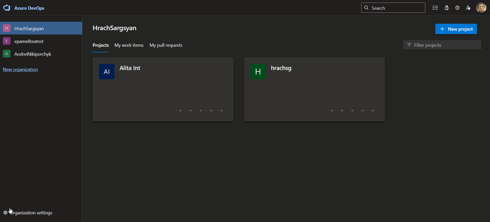
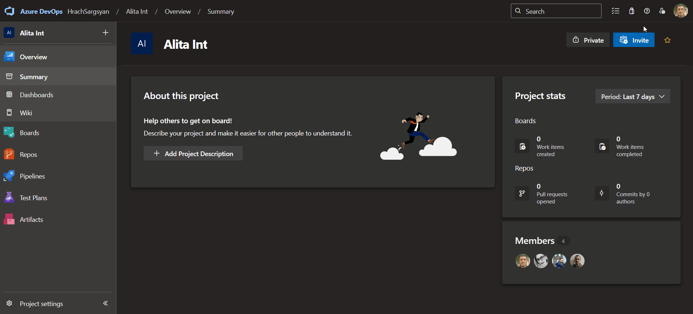
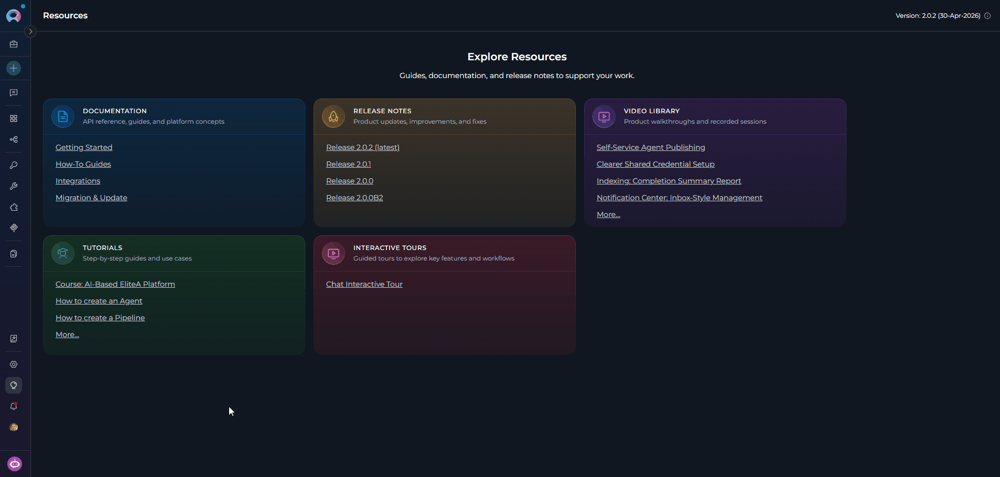
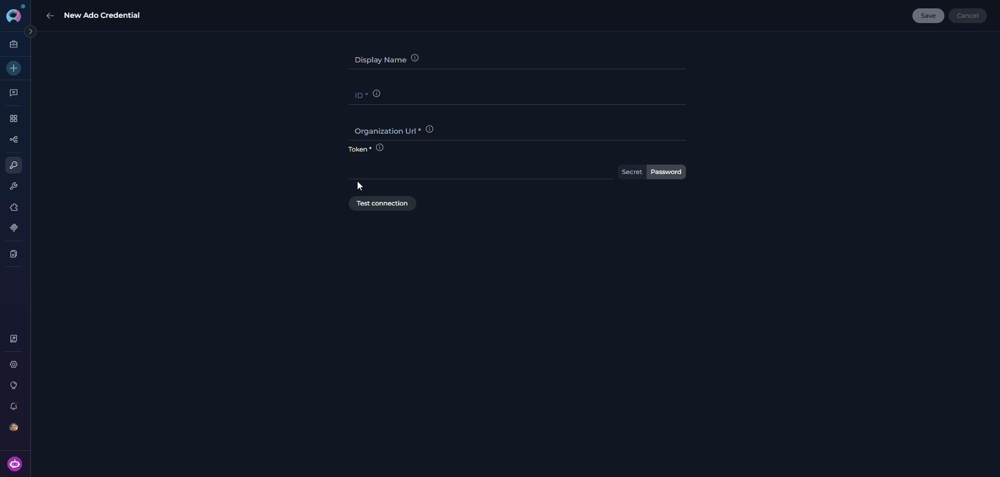
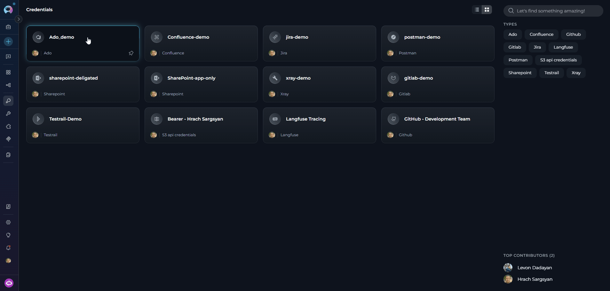
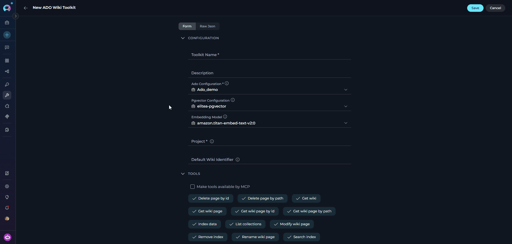
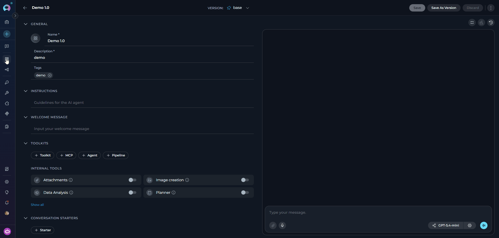
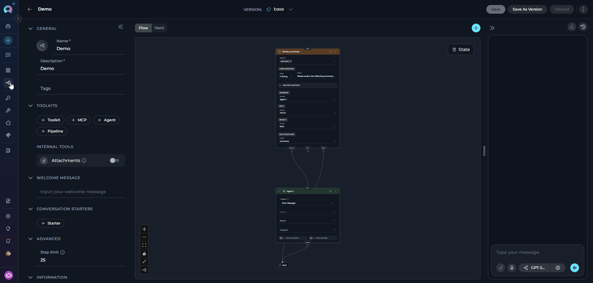
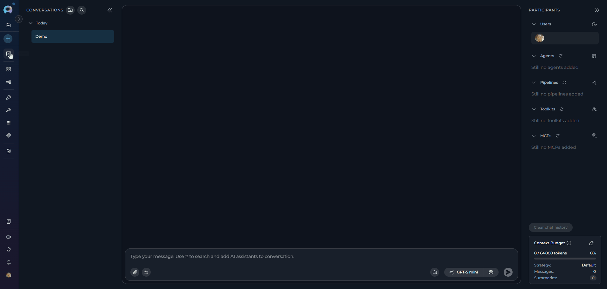

## Introduction

This guide provides step-by-step instructions for integrating and using the **Azure DevOps Wiki (ADO Wiki) toolkit** within ELITEA. It covers everything from setting up your Azure DevOps Personal Access Token to configuring the toolkit and using it within your Agents, Pipelines, and Chat conversations.

**Azure Wiki (ADO Wiki)**

Azure Wiki is a collaborative documentation service for creating and managing project documentation, knowledge bases, release notes, and meeting minutes. It provides a version-controlled repository for team documentation directly within your Azure DevOps organization.

Integrating Azure DevOps Wiki with ELITEA enables your Agents, Pipelines, and Chat conversations to intelligently interact with wiki pages — automating documentation creation, updates, and retrieval as part of AI-driven workflows.

## Toolkit's Account Setup and Configuration

### Account Setup

Create an Azure DevOps account and organization to access the Wiki service.

1.  **Visit Azure DevOps:** Navigate to [https://dev.azure.com/](https://dev.azure.com/)
2.  **Start Free or Sign In:** Click **"Start free"** to create a new organization, or **"Sign in to Azure DevOps"** for existing accounts
3.  **Create Organization:** Follow prompts to set up your organization (provide name, select hosting region, optionally link to Azure account)
4.  **Verify Email:** Confirm your email address if prompted by clicking the verification link
5.  **Enable Basic Subscription:** Verify **Basic subscription** is enabled (typically enabled by default for new organizations)
6.  **Add Users (Optional):** Navigate to `https://dev.azure.com/{YourOrganizationName}/_settings/users`, click **"Add users"**, enter user details, select **"Basic"** access level, and click **"Add"**
    
7.  **Verify Access:** Confirm **"Wiki"** appears in the left sidebar of your project

<Info title="Service Availability">
If Wiki isn't visible, verify it is enabled in organization settings under General → Services.
</Info>

### Generate a Personal Access Token (PAT)

For secure integration with ELITEA, use an Azure DevOps **Personal Access Token (PAT)**.

1.  **Log in to Azure DevOps:** Navigate to `https://dev.azure.com/` and log in.
2.  **Access User Settings:** Click the **User settings** icon (top right) → select **"Personal access tokens"**.
3.  **Generate New Token:** Click **"+ New Token"**.
4.  **Configure Token Details:**
    *   **Name:** Enter a descriptive label (e.g., "ELITEA Wiki Integration")
    *   **Organization:** Select your organization
    *   **Expiration:** Set an expiration date
    *   **Scopes:** Select **Custom defined**, then enable:
        *   **Wiki** → **Read & write** (or **Read** if the agent only reads wiki content)

5.  **Create Token:** Click **"Create"**.
6.  **Copy and Store Token:** Copy the token immediately and store it securely in a password manager or ELITEA's **[Secrets](../../menus/settings/secrets)** feature.

    

<Warning title="Important Security Practices">
**Principle of Least Privilege:** Grant only the scopes essential for your ELITEA integration.

**Avoid "Full Access" Scopes:** Never grant full access unless absolutely necessary.

**Regular Token Review and Rotation:** Rotate tokens periodically as a security best practice.
</Warning>

## System Integration with ELITEA

To integrate Azure DevOps Wiki with ELITEA, follow this three-step process: **Create Credentials → Create Toolkit → Use in Agents**.

### Step 1: Create Azure DevOps Credentials

1. **Navigate to Credentials Menu:** Open the sidebar and select **[Credentials](../../menus/credentials)**.
2. **Create New Credential:** Click the **`+ Create`** button.
3. **Select Azure DevOps:** Choose **Ado** as the credential type.

    

4. **Configure Credential Details:**

    | Field | Description | Example |
    |-------|-------------|---------|
    | **Display Name** | Descriptive name for the credential | `Azure DevOps - Wiki Access` |
    | **ID** | Unique identifier | Auto-populated from the Display Name |
    | **Organization Url** | Your Azure DevOps organization URL | `https://dev.azure.com/MyCompany` |
    | **Token** | Your PAT or a secret containing your PAT | `ghp_1234...` |

5. **Test Connection:** Click **Test Connection** to verify credentials.
6. **Save Credential:** Click **Save**.

    

<Tip title="Security Recommendation">
Use **[Secrets](../../menus/settings/secrets)** for your PAT instead of entering values directly.
</Tip>

### Step 2: Create the Azure DevOps Wiki Toolkit

1. **Navigate to Toolkits Menu:** Open the sidebar and select **[Toolkits](../../menus/toolkits)**.
2. **Create New Toolkit:** Click the **`+ Create`** button.
3. **Select Azure Wiki:** Choose **Azure Wiki (ADO Wiki)** from the available toolkit types.

    

4. **Configure Toolkit Settings:**

    | **Field** | **Description** | **Example** |
    |-----------|-----------------|-------------|
    | **Toolkit Name** | Descriptive name for your toolkit | `ADO Wiki - Documentation Manager` |
    | **Description** | Optional description of the toolkit's purpose | `Toolkit for managing project wiki pages and knowledge base` |
    | **Ado Configuration** | Select your Azure DevOps credential. A credential may be pre-selected — verify it is correct or change it as needed. | `Azure DevOps - Wiki Access` |
    | **PgVector Configuration** | PgVector connection for vector database (required for indexing tools) | `elitea-pgvector` |
    | **Embedding Model** | Embedding model for semantic search | `text-embedding-3-small` |
    | **Project** | Your Azure DevOps project name | `ProjectAlpha` |
    | **Default Wiki Identifier** | Default Wiki ID or wiki name used when no wiki is specified in tool calls | `ProjectWiki` |

5. **Enable Desired Tools:** Select the checkboxes next to the specific wiki tools you want to enable. Enable only the tools your agents will actually use.
    * **[Make Tools Available by MCP](../mcp/make-tools-available-by-mcp)** — (optional) Make selected tools accessible through external MCP clients.
6. **Save Toolkit:** Click **Save**.



#### Available Wiki Tools

| **Tool Category** | **Tool Name** | **Description** | **Primary Use Case** |
|:-----------------:|---------------|-----------------|----------------------|
| **Wiki Access** | | | |
| | **Get wiki** | Extract ADO wiki information | Retrieve the list of all wikis available in the project |
| **Wiki Page Retrieval** | | | |
| | **Get wiki page** | Extract ADO wiki page content | Fetch a wiki page with general parameters |
| | **Get wiki page by path** | Extract ADO wiki page content | Fetch a specific wiki page using its hierarchical path |
| | **Get wiki page by id** | Extract ADO wiki page content | Fetch a specific wiki page using its unique ID |
| **Wiki Page Management** | | | |
| | **Modify wiki page** | Create or update ADO wiki page content | Create new or update existing wiki page content |
| | **Rename wiki page** | Rename page | Rename an existing wiki page |
| | **Delete page by path** | Delete ADO wiki page | Delete a specific wiki page using its path |
| | **Delete page by id** | Delete ADO wiki page | Delete a specific wiki page using its unique ID |
| **Indexing & Search** | | | |
| | **Index data** | Loads Azure DevOps wiki data to index for semantic search | Enable AI-powered semantic search across wiki pages |
| | **Search index** | Performs searches across indexed content | Find specific wiki content across indexed data |
| | **Stepback search index** | Performs advanced contextual searches with broader scope | Execute sophisticated searches with expanded context |
| | **Stepback summary index** | Creates comprehensive summaries of indexed content | Generate intelligent summaries of wiki information |
| | **Remove index** | Removes previously created search indexes | Clean up and manage indexed content |
| | **List indexes** | Lists available indexed indexes | View and manage indexed data |

<Tip title="Vector Search Tools">
The tools **Index data**, **List indexes**, **Remove index**, **Search index**, **Stepback search index**, and **Stepback summary index** require PgVector configuration and an embedding model.
</Tip>

<Info>
**Image Processing and Caching**

- **Get wiki page**, **Get wiki page by path**, and **Get wiki page by id** support `process_images=True` to replace embedded image references with textual descriptions generated by the configured LLM.
- Image descriptions are cached inside the toolkit runtime, so repeated processing of the same image during a session avoids unnecessary duplicate vision-model calls.
- For wiki pages, only real image attachments are processed as images. Non-image files referenced under `/.attachments/` are left untouched in page content and can be handled through indexing attachment support.
</Info>

<Info>
**Attachment-Aware Indexing**

The ADO Wiki indexer supports two independent image and attachment options:

- **process_images** — injects image descriptions directly into the indexed wiki page content.
- **include_attachments** — indexes each referenced `/.attachments/` file as its own dependent document.

When `include_attachments` is enabled, you can further control which files are indexed with `include_extensions` and `skip_extensions` patterns.
</Info>

#### Testing Toolkit Tools

After configuring the toolkit, test individual tools from the Toolkit detail page using the **Test Settings** panel:

1. **Select LLM Model** from the model dropdown
2. **Select a Tool** from the available wiki tools
3. **Provide Input** — enter required parameters or test queries
4. **Run the Test** and review the response

<Tip title="Key benefits of testing toolkit tools:">
* Verify that credentials and connection are configured correctly
* Validate tool functionality with your Azure DevOps environment
* Test different parameter combinations before production use

> For detailed instructions, see **[How to Test Toolkit Tools](../../how-tos/credentials-toolkits/how-to-test-toolkit-tools)**.
</Tip>

---

### Step 3: Add the Wiki Toolkit to Your Workflows

#### In Agents

1. **Navigate to Agents:** Open the sidebar and select **[Agents](../../menus/agents)**.
2. **Create or Edit Agent:** Create a new agent or select an existing one.
3. **Add the Toolkit:** In the **TOOLKITS** section, click **"+Toolkit"** and select your ADO Wiki toolkit.



#### In Pipelines

1. **Navigate to Pipelines:** Open the sidebar and select **[Pipelines](../../menus/pipelines)**.
2. **Create or Edit Pipeline:** Create a new pipeline or select an existing one.
3. **Add the Toolkit:** In the **TOOLKITS** section, click **"+Toolkit"** and select your ADO Wiki toolkit.



#### In Chat

1. **Navigate to Chat:** Open the sidebar and select **[Chat](../../menus/chat)**.
2. **Start New Conversation:** Click **+Create** or open an existing conversation.
3. **Add the Toolkit:** In the **Participants** section, click to add a toolkit and select your ADO Wiki toolkit.



<Info title="Example Chat Usage">
- "Show me the latest release notes from the project wiki."
- "Update the Team Meetings page with today's meeting notes."
- "What does the Getting Started wiki page say?"
</Info>

## Instructions and Prompts for Using the ADO Wiki Toolkit

When crafting instructions for agents using the ADO Wiki toolkit, clarity and precision are essential. Break down tasks into simple, actionable steps and explicitly define all parameters.

**Effective instructions are:**

- **Direct and Action-Oriented:** Use strong action verbs (e.g., "Use the 'get_wiki_page_by_path' tool...", "Update the wiki page using 'modify_wiki_page'...")
- **Parameter-Centric:** Specify each required parameter and how the agent should obtain its value
- **Step-by-Step Structured:** Use numbered steps for complex workflows

<Info title="Example Agent Instructions">

**Retrieving a Wiki Page:**
```markdown
1. Goal: Retrieve content from a specific wiki page.
2. Tool: Use the "get_wiki_page_by_path" tool.
3. Parameters:
    - wiki_path: "Get the wiki page path from the user. Example: '/Release Notes/Latest'"
    - wiki_identifier: "Use the default wiki or ask the user which wiki to access"
4. Outcome: Display the wiki page content to the user with proper formatting.
```

**Updating a Wiki Page:**
```markdown
1. Goal: Add new content to an existing wiki page.
2. Tool: Use the "modify_wiki_page" tool.
3. Parameters:
    - wiki_path: "Ask the user for the page path (e.g., '/Team Meetings')"
    - content: "Combine the existing page content with the new content provided by the user"
    - wiki_identifier: "Use the default wiki"
4. Outcome: Confirm the page was updated successfully and display the updated content.
```
</Info>

---

## Chat Usage Examples

<Accordion title="Get Wiki Page by Path">
**Chat Example:**
```
User: "Show me the latest release notes from our project wiki."

Agent Response: [Agent uses get_wiki_page_by_path tool]

📄 **Release Notes - Version 2.5.0**

**Released**: November 10, 2025

**New Features**:
- Enhanced user authentication with OAuth 2.0 support
- Real-time collaboration features in document editing
- Advanced search capabilities with AI-powered suggestions

**Bug Fixes**:
- Fixed issue with file upload timeouts
- Resolved memory leak in background processes
- Corrected timezone display in activity logs
```
</Accordion>

<Accordion title="Get Wiki Page with Image Descriptions">
**Chat Example:**
```
User: "Open the architecture wiki page and describe the embedded diagram."

Agent Response: [Agent uses get_wiki_page_by_path with process_images=True]

📄 **Architecture Overview**

The page includes a system diagram showing three services: a web frontend, an API layer, and a PostgreSQL database. The frontend sends requests to the API, and the API reads and writes data to the database.
```
</Accordion>

<Accordion title="Modify Wiki Page">
**Chat Example:**
```
User: "Add today's meeting notes to the 'Team Meetings' wiki page."

Agent Response: [Agent uses modify_wiki_page tool]

✅ **Wiki Page Updated Successfully!**

- **Page**: Team Meetings
- **Path**: /Project Documentation/Team Meetings
- **Updated**: November 12, 2025

Added content includes attendees, agenda, key decisions, and action items.
```
</Accordion>

---

## Best Practices

<Accordion title="Test Integration Thoroughly">
After setting up the toolkit, test each tool you intend to use to ensure connectivity, correct authentication, and accurate execution of wiki actions.
</Accordion>

<Accordion title="Monitor Agent Performance">
Regularly monitor agents using the ADO Wiki toolkit. Track task completion, execution time, and error rates.
</Accordion>

<Accordion title="Follow Security Best Practices">
- Use Personal Access Tokens instead of your main account password
- Grant only the minimum necessary scopes (Wiki: Read or Read & write)
- Store PATs using ELITEA's Secrets Management feature
</Accordion>

<Accordion title="Provide Clear Instructions">
Craft clear, unambiguous agent instructions. Specify wiki paths and identifiers explicitly to avoid ambiguity.
</Accordion>

<Accordion title="Start with Simple Use Cases">
Begin with read-only operations (retrieving wiki pages) before enabling write operations (creating or modifying pages).
</Accordion>

<Accordion title="Automated Retrieval of Release Notes">
- **Scenario:** An agent automatically retrieves the latest release notes from the project wiki during support interactions.
- **Tools Used:** `get_wiki_page_by_path`
- **Example Instruction:** "Use 'get_wiki_page_by_path' to read the wiki page at '/Release Notes/Latest Release' and display it to the user."
- **Benefit:** Provides agents with immediate access to current release information, improving support efficiency.
</Accordion>

<Accordion title="Index Wiki Attachments for Search">
- **Scenario:** Teams store diagrams, PDFs, and supporting files in wiki page attachments and want them searchable through ELITEA indexing.
- **Tools Used:** `index_data`
- **Example Instruction:** "Use 'index_data' with include_attachments enabled so attached wiki files are indexed as dependent documents, and enable process_images if embedded diagrams should also be described in page content."
- **Benefit:** Makes both wiki text and attached supporting files discoverable through semantic search.
</Accordion>

<Accordion title="Dynamic Content Creation for Project Dashboards">
- **Scenario:** Agents dynamically generate wiki content by aggregating data from other ELITEA workflows.
- **Tools Used:** `modify_wiki_page`
- **Example Instruction:** "Use 'modify_wiki_page' to update the 'Project Dashboard' wiki page with the latest build status and test results."
- **Benefit:** Keeps dashboards current automatically without manual updates.
</Accordion>

<Accordion title="Automated Wiki Cleanup">
- **Scenario:** Automatically delete outdated meeting minutes or temporary documentation after a set period.
- **Tools Used:** `delete_wiki_page_by_path`
- **Example Instruction:** "Use 'delete_wiki_page_by_path' to delete pages in '/Meeting Minutes/Archive' that are older than 90 days."
- **Benefit:** Keeps the project wiki organized and easy to navigate.
</Accordion>

---

## Troubleshooting

<Accordion title="Connection Issues">
**Problem:** Agent fails to connect to Azure DevOps Wiki.

1. Verify the organization URL is correct (e.g., `https://dev.azure.com/YourOrganizationName`)
2. Check that your PAT is accurate and not expired
3. Regenerate the PAT if needed and update your ELITEA credential
4. Verify network connectivity and firewall settings
</Accordion>

<Accordion title="Authorization Errors">
**Problem:** "Permission Denied" or "Unauthorized" errors.

1. Ensure the PAT has the `vso.wiki_full` scope for full wiki access
2. Verify your Azure DevOps account has the necessary project permissions
3. Check that the PAT has not expired
</Accordion>

<Accordion title="Incorrect Organization or Project Names">
**Problem:** Cannot find specified organization or project.

1. Verify the organization name matches your Azure DevOps URL exactly
2. Confirm the project name is correct (case-sensitive)
3. Ensure the URL format is: `https://dev.azure.com/YourOrganizationName`
</Accordion>

<Accordion title="Wiki Access Issues">
**Problem:** Cannot access specific wiki pages.

1. Confirm the wiki page exists at the specified path
2. Verify the PAT has appropriate wiki scopes
3. Ensure the Wiki service is enabled for the project (Project Settings → Services)
4. Check that paths use the correct hierarchical format (e.g., `/Folder/PageName`)
</Accordion>

<Accordion title="Indexing and Search Tool Errors">
**Problem:** Indexing tools fail or search returns no results.

1. Verify PgVector is properly configured in toolkit settings
2. Confirm an embedding model is selected
3. Ensure the index was created successfully before searching
4. Verify there is data available to index
5. If you expect attached wiki files to be searchable, verify `include_attachments` was enabled during indexing
</Accordion>

<Accordion title="Wiki Identifier Not Provided Error">
**Problem:** Tools fail with an error such as *"Wiki identifier must be provided either as a parameter or configured as default in toolkit settings."*

**Cause:** The tool was called without a `wiki_identified` parameter and no **Default Wiki Identifier** is set in the toolkit configuration.

**Resolution:**
- Open the toolkit settings and set the **Default Wiki Identifier** field to your wiki name (e.g., `ProjectAlpha.wiki` for the project wiki, or the custom name you assigned when creating a code wiki)
- Alternatively, instruct the agent to always pass the `wiki_identified` parameter explicitly in each tool call

**To find your wiki identifier:** In Azure DevOps, open your project and navigate to **Overview → Wiki**. The wiki name appears in the URL and in the wiki title bar.
</Accordion>

<Card title="Support Contact" icon="envelope" href="../../support/contact-support">
  If you encounter issues not covered in this guide, contact the ELITEA support team.

  **Email:** SupportAlita@epam.com
</Card>

---

## FAQ

<Accordion title="Can I use my regular Azure DevOps password instead of a Personal Access Token?">
No. You must use a Personal Access Token for secure integration. Regular passwords are not supported.
</Accordion>

<Accordion title="What scopes should I grant to the PAT for Wiki?">
Grant **Wiki → Read & write** for full access, or **Wiki → Read** if the agent only needs to read wiki content. Always follow the principle of least privilege.
</Accordion>

<Accordion title="What is the correct format for the Azure DevOps Organization URL?">
`https://dev.azure.com/YourOrganizationName` — replace `YourOrganizationName` with your actual organization name. Do not include the project name in the URL.
</Accordion>

<Accordion title="Can I use the same credential for multiple ADO toolkits?">
Yes. One Azure DevOps credential can be reused across Wiki, Boards, and Test Plans toolkits as long as the PAT has the necessary scopes for all services.
</Accordion>

<Accordion title="How do I find my Azure DevOps organization and project names?">
Your organization name appears in the URL when you log in (e.g., `https://dev.azure.com/YourOrgName`). Project names are listed in the Azure DevOps interface under your organization.
</Accordion>

<Accordion title="Why am I getting 'Permission Denied' errors even with a valid token?">
Verify the PAT has the `vso.wiki_write` scope for write operations. Also ensure your Azure DevOps account has project-level permissions — having a valid token does not automatically grant project access.
</Accordion>

<Accordion title="What value should I use for the Default Wiki Identifier field?">
The **Default Wiki Identifier** accepts either a wiki ID (a GUID) or the wiki name. For project wikis automatically created by Azure DevOps, the name is typically `{ProjectName}.wiki` (e.g., `ProjectAlpha.wiki`). For code wikis, use the name you assigned during creation.

To find the correct value: in Azure DevOps, navigate to **Overview → Wiki** and check the name in the URL or the wiki title bar.
</Accordion>

<Accordion title="What happens when I try to create a wiki page that does not exist?">
The `modify_wiki_page` tool handles missing pages gracefully:
- If the **page** does not exist at the given path, it is created automatically
- If the **wiki** itself does not exist under the given name, the toolkit creates a new wiki first, then creates the page

This means you can use `modify_wiki_page` for both creating new pages and updating existing ones without separate setup steps.
</Accordion>

<Accordion title="What branch name should I use when modifying or renaming wiki pages?">
The default branch for Azure DevOps wikis is **`wikiMaster`**. Use this value for the `version_identifier` parameter in `modify_wiki_page` and `rename_wiki_page` calls unless your wiki uses a custom branch.

If an invalid version identifier is provided to `rename_wiki_page`, the toolkit automatically retries the operation without the version constraint.
</Accordion>

<Accordion title="Can the agent describe images embedded in wiki pages?">
Yes. By default, when retrieving wiki page content, the toolkit processes embedded images and replaces them with AI-generated descriptions (requires an LLM to be configured on the agent). To retrieve raw content without image processing — which is faster — instruct the agent to use `process_images=False` when calling `get_wiki_page_by_path`, `get_wiki_page_by_id`, or `get_wiki_page`.
</Accordion>

<Accordion title="How do I retrieve a full wiki page hierarchy including all sub-pages?">
Use the `get_wiki_page` tool with `recursion_level` set to your desired depth:

| Value | Behavior |
|-------|----------|
| `none` | Returns only the requested page metadata, no sub-pages |
| `oneLevel` | Returns the page and its direct children (default) |
| `oneLevelPlusNestedEmptyFolders` | Direct children plus chains of nested single-child folders |
| `full` | Returns the entire descendant hierarchy from the page downward |

Example: to map the complete structure of a wiki section, use `recursion_level='full'`.
</Accordion>

<Accordion title="Do I need PgVector configuration for all wiki tools?">
No. PgVector is only required for indexing and semantic search tools: **Index data**, **Search index**, **Stepback search index**, **Stepback summary index**, **Remove index**, and **List indexes**. All other wiki tools work without it.
</Accordion>

<Accordion title="How do image descriptions work for wiki pages?">
When `process_images=True`, the toolkit analyzes embedded images in wiki page content and replaces the image reference with a textual description generated by the configured LLM. Repeated processing of the same image during a session uses the toolkit's image-description cache to avoid duplicate analysis.
</Accordion>

<Accordion title="Can attached wiki files be indexed separately from the page content?">
Yes. When running **Index data**, enable `include_attachments` to index each referenced `/.attachments/` file as its own dependent document. You can also use `include_extensions` and `skip_extensions` to control which attachment file types are included.
</Accordion>

<Accordion title="What's the difference between 'get_wiki_page_by_path' and 'get_wiki_page_by_id'?">
- **get_wiki_page_by_path**: Uses the hierarchical path (e.g., `/Release Notes/Latest`). More intuitive and user-friendly.
- **get_wiki_page_by_id**: Uses the unique numeric ID of the wiki page. More precise but requires knowing the ID in advance.

Use the path-based method for most cases.
</Accordion>

<Accordion title="How do I update my PAT when it expires?">
1. Generate a new PAT in Azure DevOps
2. Navigate to **Credentials** in ELITEA
3. Edit your Azure DevOps credential and update the **Token** field
4. Save the credential — all toolkits using it will automatically use the new token
</Accordion>

---

<Info title="Useful ELITEA Resources">
- **[Agent Menu](../../menus/agents)** — Complete reference for agent management
- **[How to Use Chat Functionality](../../how-tos/chat-conversations/how-to-use-chat-functionality)** — Guide to using ELITEA Chat with toolkits
- **[Create and Edit Agents from Canvas](../../how-tos/chat-conversations/how-to-create-and-edit-agents-from-canvas)** — Quickly create agents from chat canvas
- **[Indexing Overview](../../how-tos/indexing/indexing-overview)** — Understanding ELITEA's indexing capabilities
- **[Index ADO Wiki Data](../../how-tos/indexing/index-ado-wiki-data)** — Detailed instructions for indexing Azure DevOps Wiki data
- **[Azure Repos (ADO Repos) Toolkit Integration Guide](./ado_repos_toolkit)** — Integrate Azure Repos for version control
</Info>

<Info title="External Resources">
- **[Azure DevOps Documentation](https://learn.microsoft.com/en-us/azure/devops/)** — Official Microsoft documentation
- **[Azure Wiki Documentation](https://learn.microsoft.com/en-us/azure/devops/project/wiki/)** — Creating and managing project wikis
- **[Personal Access Tokens Guide](https://learn.microsoft.com/en-us/azure/devops/organizations/accounts/use-personal-access-tokens-to-authenticate)** — Best practices for PAT management
</Info>
