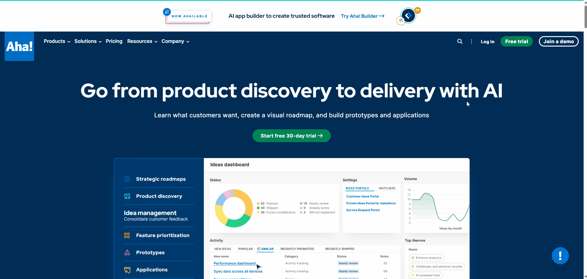
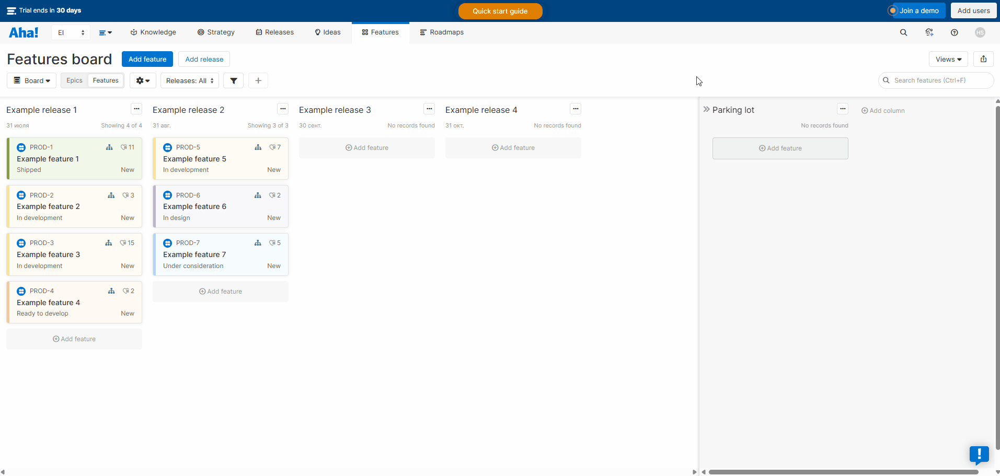
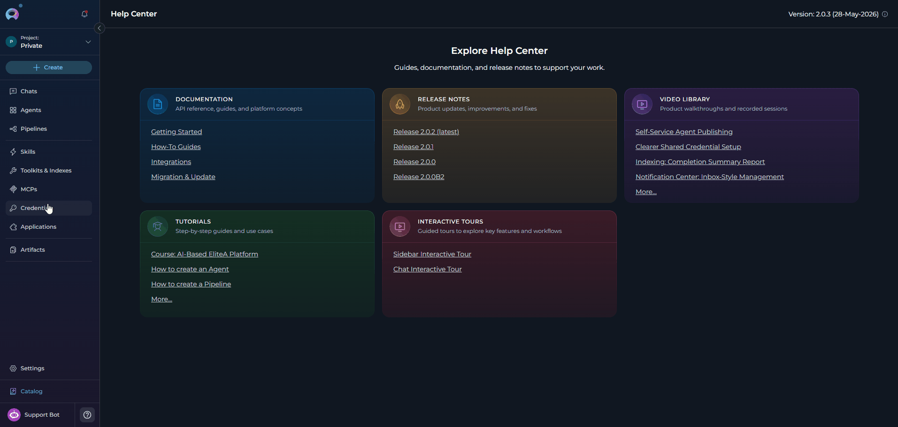
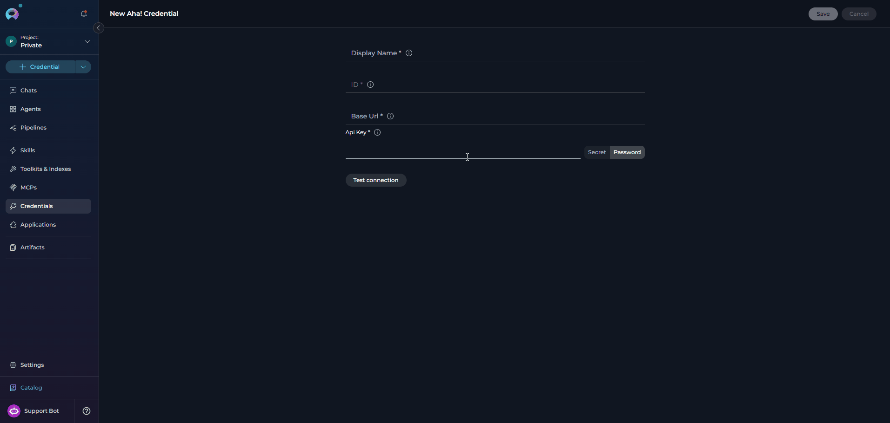
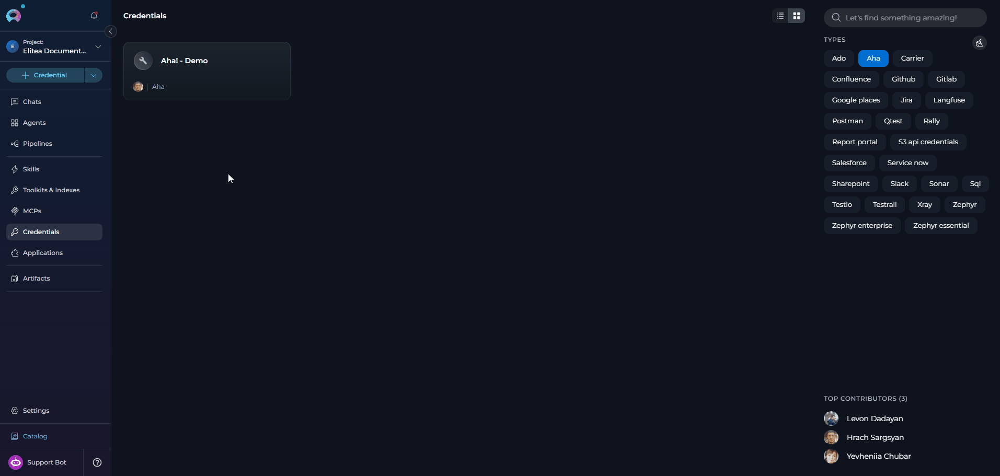
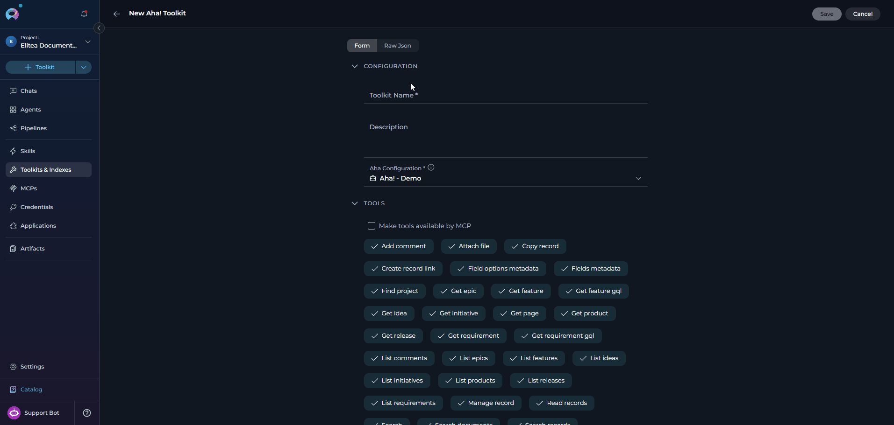
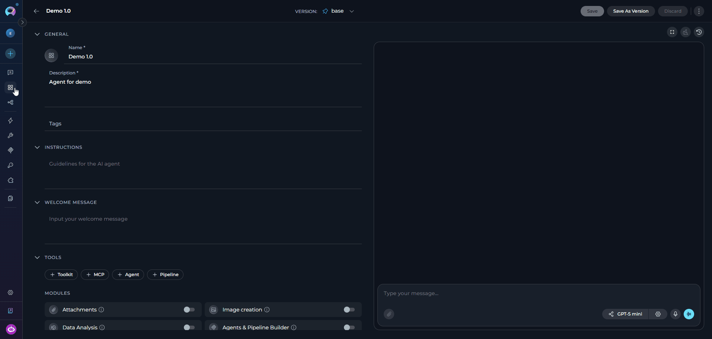
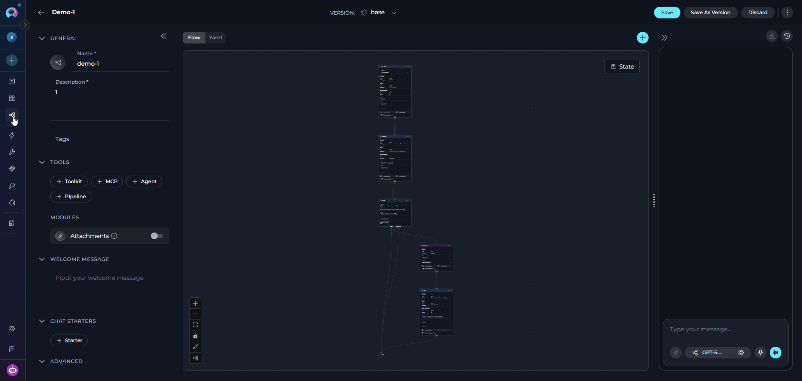
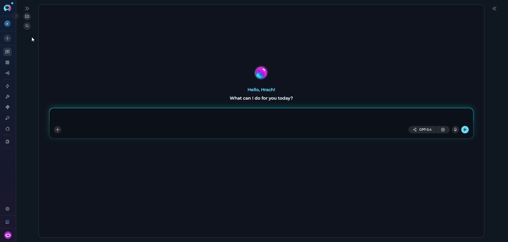

---

## Introduction

This document is your definitive resource for integrating and effectively utilizing the **Aha! toolkit** within ELITEA. It provides a detailed, step-by-step walkthrough, from generating an Aha! API key to configuring the toolkit in ELITEA and seamlessly incorporating it into your Agents, Pipelines, and Chat sessions. By following these steps, you will unlock the power of automated roadmap management, requirements tracking, idea triage, and cross-team collaboration — all directly within the ELITEA platform. This integration empowers you to leverage AI-driven automation to optimize your Aha!-driven product workflows, enhance team productivity, and improve product visibility across your organization.

**Brief Overview of Aha!**

Aha! is a leading product development suite used by product managers, engineers, and business stakeholders to build strategy, capture ideas, plan releases, and deliver features. The Aha! toolkit in ELITEA connects to two Aha! transports simultaneously — REST v1 for CRUD operations across the full record catalog, and GraphQL v2 for notes/pages and markdown-native reads — so Agents get the best of both APIs from a single toolkit. Aha! offers:

<CardGroup cols={2}>
    <Card title="Roadmapping and Strategy" icon="road">
        Aha! Roadmaps lets teams plan initiatives, epics, releases, and features against goals, giving executives and delivery teams a shared view of strategy-to-execution.
    </Card>
    <Card title="Ideas Management" icon="lightbulb">
        Aha! Ideas captures product feedback from customers, sales, and internal stakeholders, and lets product managers score and promote ideas into features.
    </Card>
    <Card title="Requirements and Notes" icon="file-lines">
        Aha! Develop and Aha! Notebooks manage requirements under features and free-form notes/pages under products, both fully addressable via reference numbers such as `DEVELOP-123`, `ADT-123-1`, and `ABC-N-213`.
    </Card>
    <Card title="Custom Fields and Workflows" icon="sliders">
        Aha! records support customizable workflow statuses, custom fields, tags, and record links so every organization can model its own delivery lifecycle.
    </Card>
    <Card title="Rich Integration Surface" icon="plug">
        Aha! exposes both REST v1 and GraphQL v2 APIs authenticated with a personal API key or OAuth app, plus a remote MCP server for AI clients.
    </Card>
</CardGroup>

Integrating Aha! with ELITEA brings these product-management capabilities directly into your AI-driven workflows. Your ELITEA Agents can then intelligently interact with Aha! records to triage ideas, draft features and requirements, keep releases up to date, post comments, attach evidence, and answer questions about roadmap state — all without leaving the ELITEA platform.

---

## Toolkit's Account Setup and Configuration in Aha!

**Account Setup**

If you do not yet have an Aha! account, please follow these steps to create one:

1.  **Visit Aha! Website:** Open your web browser and navigate to the official Aha! website: [https://www.aha.io](https://www.aha.io).
2.  **Sign Up for Aha!:** Click on the **"Try it free"** or **"Start free trial"** button to begin the sign-up process.
3.  **Create Your Aha! Account:** Follow the prompts to create an Aha! account using your email address. For professional use, use your company email so your Aha! workspace URL matches your organization (e.g. `https://yourcompany.aha.io`).
4.  **Choose a Subdomain:** During signup, you will be asked to choose a subdomain that becomes the base URL of your Aha! instance (e.g. `yourcompany.aha.io`). Keep this URL handy — you will need it later when configuring the ELITEA credential.
5.  **Set Up Your First Workspace:** Aha! will guide you through creating your first workspace (product line and product). Add a name and choose a template that matches your team's methodology.
6.  **Explore Aha! Features:** Once your workspace is ready, familiarize yourself with the core record types you will manage via the toolkit — products, releases, features, requirements, epics, initiatives, ideas, and notes/pages.

    

### Generate an API Key

For secure integration with ELITEA, it is essential to use an Aha! **API key** for authentication. Aha! calls the token a "personal API key"; it is issued per-user and inherits that user's permissions across all workspaces they can access.

**Follow these steps to generate an API key in Aha!:**

1.  **Log in to Aha!:** Navigate to your Aha! instance (e.g. `https://yourcompany.aha.io`) and log in with your credentials.
2.  **Open Personal Settings:** Click your avatar in the top-right corner of the Aha! interface and select **"Settings → Personal"** from the dropdown menu. You will land on the **Personal settings** page.
3.  **Navigate to Developer / API Keys:** In the left-hand sidebar, expand **"Developer"** (or scroll to the **"API keys"** panel). Aha! surfaces a table of any keys you have already generated with their **Name** and **Authorized at** timestamp
4.  **Generate a New API Key:** Click the **"Generate API key"** button.
5.  **Name Your Key:** In the "Generate API key" dialog, enter a descriptive **Name** for the key, such as `ELITEA Integration` or `ELITEA Agent Access`. This label helps you identify the purpose of the key later and revoke it independently.
6.  **Confirm & Copy Your API Key:** Click **"Generate API key"**. Aha! displays the newly generated token **exactly once**. **Immediately copy the API key** and store it securely — you will not be able to view the full value again after closing this dialog. If you lose the key you must revoke it and generate a new one.
7.  **Store the Key Securely:** Store the API key in a password manager or, preferably, ELITEA's built-in **Secrets** feature. You will paste this value into the ELITEA Aha! credential in the next step.

    


<Tip title="Aha! API key scope">
An Aha! personal API key inherits the permissions of the user who created it. To follow the principle of least privilege, generate the key from a dedicated service account whose workspace and record-level permissions match the automations you plan to run through ELITEA.
</Tip>

---

## System Integration with ELITEA

To integrate Aha! with ELITEA, you need to follow a three-step process: **Create Credentials → Create Toolkit → Use in Agents**. This workflow ensures secure authentication and proper configuration.

### Step 1: Create Aha! Credentials

Before creating a toolkit, you must first create Aha! credentials in ELITEA:

1. **Navigate to Credentials Menu:** Open the sidebar and select **[Credentials](../../menus/credentials)**.
2. **Create New Credential:** Click the **`+ Create`** button.
3. **Select Aha!:** Choose **Aha!** as the credential type.

     

4. **Configure Credential Details:**

   | Field | Required | Description |
   |-------|----------|-------------|
   | **Display Name** | Required | Descriptive name for this credential (e.g. *"Aha! — Product Roadmap"*) |
   | **ID** | Required | Unique identifier for the credential. Auto-populated from the Display Name |
   | **Base URL** | Required | Base URL of your Aha! instance. Format: `https://<subdomain>.aha.io`. Do **not** include a trailing slash or any path suffix — the toolkit appends `/api/v1` (REST) and `/api/v2/graphql` (GraphQL) automatically. Must start with `http://` or `https://`. |
   | **API Key** | Required | The personal API key generated in the previous section. Paste the raw key value; it is stored as a secret and sent as an `Authorization: Bearer <token>` header on every request. |

5. **Test Connection:** Click **Test Connection** to verify that your credential is valid. Behind the scenes, ELITEA calls `GET /api/v1/me` on your Aha! instance and surfaces a human-readable error if the base URL is malformed, the token is missing/invalid, or the account lacks permission.
6. **Save Credential:** Click **Save** to create the credential. It will be added to the credentials dashboard and available to use in toolkit configurations.

     

<Tip title="Security Recommendation">
It's highly recommended to use **[Secrets](../../menus/settings/secrets)** for the Aha! API key instead of pasting it directly. Create a secret first, then reference it in your credential configuration. This keeps the raw token out of the credential UI and enables key rotation without editing every credential that consumes it.
</Tip>

---

### Step 2: Create Aha! Toolkit

Once your credentials are configured, create the Aha! toolkit:

1. **Start the toolkit creation flow using either of these options:**
    - Open the sidebar and select **[Toolkits & Indexes](../../menus/toolkits)**.
    - Or, from any menu, open the dropdown next to the **`+ Create`** button.
2. **Select Create Toolkit:** From the dropdown menu, choose **Create Toolkit**.
3. **Select Aha!:** In the toolkit type selection flow, choose **Aha!** from the list of available toolkit types.

     

4. **Configure Toolkit Details:**

    | Field | Description | Examples |
    |-------|-------------|----------|
    | **Toolkit Name** | Descriptive name for the toolkit. Displayed to Agents and prepended to each tool's description. | `Aha! Product Management` |
    | **Description** | Brief description of the toolkit's purpose. | `Toolkit for roadmap planning, idea triage, and release tracking in Aha!` |
    | **Credential** | Select the Aha! credential created in Step 1. | `Aha! - Product Roadmap` |
    | **Tools** | Select which tools to expose. Enable only the tools your agents will actually use to follow the principle of least privilege and keep the tool surface small for the LLM. | `find_project`, `read_records`, `manage_record`, `add_comment` |

5. **Enable Desired Tools:** In the **"Tools"** section, tick the checkboxes next to the specific Aha! tools you want to enable.
       * **[Make Tools Available by MCP](../mcp/make-tools-available-by-mcp)** - (optional) Enable to expose selected tools to external MCP clients.
6. **Save Toolkit:** Click **Save** to create the toolkit.

    
    
#### Available Tools

The Aha! toolkit provides the following tools for interacting with Aha! records, organized by functional category. Tool names match exactly what appears in the ELITEA toolkit configuration and in Agent tool calls.

| **Tool Category** | **Tool Name** | **Description** | **Primary Use Case** |
|:-----------------:|---------------|-----------------|----------------------|
| **Discovery** | | | |
| | **Find project** | Find Aha! products (workspaces), optionally filtered by free-text query | Locate the correct product/workspace reference before running searches |
| | **Search** | Run Aha!'s generic full-text search (`/api/v1/search`), optionally filtered by record type | Free-form discovery across all record types |
| | **Search records** | Uniform search dispatcher — searches Aha! records of a given `record_type` (feature, requirement, release, idea, epic, initiative, product) | Express searches uniformly without picking a type-specific list tool |
| | **Search documents** | Search Aha! documents via GraphQL (default type: `Page`) | Find notes/pages by name and return canonical URLs |
| **Read (REST)** | | | |
| | **Read records** | Uniform read dispatcher — read any record type (`feature`, `requirement`, `release`, `initiative`, `epic`, `idea`, `product`, `page`) by reference or numeric ID | Fetch a single record without choosing a type-specific get tool |
| | **Get feature** | Read a feature by reference number (e.g. `DEVELOP-123`) or numeric ID | Look up feature details when the reference is already known |
| | **Get requirement** | Read a requirement by reference (e.g. `ADT-123-1`) or numeric ID | Fetch requirement details attached to a feature |
| | **Get release** | Read a release by reference or numeric ID | Look up release metadata and dates |
| | **Get initiative** | Read an initiative by reference or numeric ID | Trace strategic initiatives |
| | **Get epic** | Read an epic by reference or numeric ID | Fetch epic-level scope and status |
| | **Get idea** | Read an idea by reference or numeric ID | Inspect a customer/internal idea before promoting it |
| | **Get product** | Read a product (workspace) by reference or numeric ID | Fetch product metadata |
| **Read (GraphQL — markdown bodies)** | | | |
| | **Get feature gql** | Read a feature via GraphQL v2 — description is returned as **markdown** rather than HTML | Preferred when you need the markdown body for LLM consumption |
| | **Get requirement gql** | Read a requirement via GraphQL v2 — description is returned as **markdown** | Preferred when you need the markdown body for LLM consumption |
| | **Get page** | Fetch an Aha! note/page (reference `ABC-N-###`) with its markdown body and optional parent reference | Read free-form notes stored under a product |
| **List** | | | |
| | **List products** | List products (workspaces), optionally filtered by `updated_since` | Discover product references |
| | **List features** | List features, optionally scoped to a product or release, filtered by free-text `q` or `updated_since` | Populate feature backlogs |
| | **List requirements** | List requirements, optionally scoped to a feature | Enumerate acceptance criteria for a feature |
| | **List releases** | List releases, optionally scoped to a product and/or filtered by `parking_lot` | Build release dashboards |
| | **List initiatives** | List initiatives, optionally scoped to a product | Map strategy to execution |
| | **List epics** | List epics, optionally scoped to a product or release | Group features under an epic |
| | **List ideas** | List ideas, optionally scoped to a product or filtered by free-text `q` | Triage the ideas portal backlog |
| **Write** | | | |
| | **Manage record** | Create, update, or delete an Aha! record. Accepted types: `feature`, `requirement`, `idea`, `release`, `initiative`, `epic`, `page`. Parent scope is required on `create` (feature → release, requirement → feature, idea/release/initiative/page → product, epic → release). | One-tool dispatcher for the full CRUD lifecycle |
| | **Copy record** | Duplicate an Aha! record. Only `record_type='release'` is supported by Aha!'s REST API (`POST /releases/{id}/duplicate`). | Clone a release as the starting point for the next one |
| | **Create record link** | Create a link between two Aha! records. Aha! REST only supports links **originating from features** (`from_record_type='feature'`). Optional `link_type` (e.g. `blocks`, `blocked_by`, `duplicate`, `related_to`). | Model dependencies between records |
| **Comments** | | | |
| | **Add comment** | Post a comment on an Aha! record (feature, requirement, idea, release, epic, initiative, goal, or to-do). Body accepts HTML or plain text. | Automate progress updates and cross-team notifications |
| | **List comments** | List comments on an Aha! record (paginated) | Access discussion history |
| **Attachments** | | | |
| | **Attach file** | Upload an attachment to an Aha! record. Accepts a local path or an `artifact://<bucket>/<name>` URI resolved via the SDK artifact interface. | Attach evidence, screenshots, or generated documents to a record |
| **Metadata** | | | |
| | **Fields metadata** | List custom-field definitions configured in the Aha! account | Discover which custom fields exist before writing them via `manage_record` |
| | **Field options metadata** | List the option values defined for a specific custom field | Resolve the exact option name/ID to send when updating a select field |

<Tip title="Reference-number cheat sheet">
Aha! records are addressable by human-readable reference numbers. The toolkit validates the format **before** sending the request so bad input fails fast:

- **Feature:** `<PREFIX>-<N>` — e.g. `DEVELOP-123`
- **Requirement:** `<PREFIX>-<N>-<M>` — e.g. `ADT-123-1`
- **Note / Page:** `<PREFIX>-N-<N>` — e.g. `ABC-N-213`

REST endpoints also accept numeric IDs interchangeably. GraphQL endpoints (`get_feature_gql`, `get_requirement_gql`, `get_page`) require the reference-number form.
</Tip>

<Tip title="Output format & field projection">
Every list/read tool accepts two optional parameters that dramatically reduce token usage on large payloads:

- **`output_format`** — `json` (default), `csv`, or `markdown`. `csv`/`markdown` produce tabular output for list responses; JSON is returned unchanged.
- **`fields`** — an allowlist of top-level record fields to include in the response (e.g. `["id", "reference_num", "name", "workflow_status"]`).

Combine these when you only need a few columns from a long list of records.
</Tip>

#### Testing Toolkit Tools

After configuring your Aha! toolkit, you can test individual tools directly from the Toolkit detailed page using the **Test Settings** panel. This allows you to verify that your credentials are working correctly and validate tool behavior before adding the toolkit to your workflows.

**General Testing Steps:**

1. **Select LLM Model:** Choose a Large Language Model from the model dropdown in the Test Settings panel.
2. **Configure Model Settings:** Adjust model parameters like Creativity, Max Completion Tokens, and other settings as needed.
3. **Select a Tool:** Choose the specific Aha! tool you want to test (e.g. `find_project`, `read_records`, `search_records`).
4. **Provide Input:** Enter the required parameters — for example, `record_type=feature` and `reference_or_id=DEVELOP-123` for `read_records`.
5. **Run the Test:** Execute the tool and wait for the response.
6. **Review the Response:** Analyze the output to verify the tool is working correctly and returning expected results.

<Tip title="Key benefits of testing toolkit tools:">
* Verify that Aha! credentials and connection are configured correctly
* Test tool parameters and see actual responses from your Aha! instance
* Debug tool behavior and understand output formats (JSON vs. CSV vs. markdown)
* Optimize tool settings before integrating with agents or pipelines
> For detailed instructions on how to use the Test Settings panel, see **[How to Test Toolkit Tools](../../how-tos/credentials-toolkits/how-to-test-toolkit-tools)**.
</Tip>

---

### Step 3: Add Aha! Toolkit to Your Workflows

Now you can add the configured Aha! toolkit to your agents, pipelines, or use it directly in chat:

---
#### In Agents:

1. **Navigate to Agents:** Open the sidebar and select **[Agents](../../menus/agents)**.
2. **Create or Edit Agent:** Either create a new agent or select an existing agent to edit.
3. **Add Aha! Toolkit:**
     * In the **"TOOLS"** section of the agent configuration, click the **"+Toolkit"** icon
     * Select your configured Aha! toolkit from the dropdown list
     * The toolkit will be added to your agent with the previously configured tools enabled

     

Your agent can now interact with Aha! using the configured toolkit and enabled tools.

---
#### In Pipelines:

1. **Navigate to Pipelines:** Open the sidebar and select **[Pipelines](../../menus/pipelines)**.
2. **Create or Edit Pipeline:** Either create a new pipeline or select an existing pipeline to edit.
3. **Add Aha! Toolkit:**
     * In the **"TOOLS"** section of the pipeline configuration, click the **"+Toolkit"** icon
     * Select your configured Aha! toolkit from the dropdown list
     * The toolkit will be added to your pipeline with the previously configured tools enabled

     

---
#### In Chat:

1. **Navigate to Chat:** Open the sidebar and select **[Chat](../../menus/chat)**.
2. **Start New Conversation:** Click **+Create** or open an existing conversation.
3. **Add Toolkit to Conversation:**
    * In the chat input toolbar, click the **`+`** icon
    * In the popup menu, hover over **Toolkits**
    * Search for and enable your configured Aha! toolkit from the list
    * Or type `#` in the message input and choose the toolkit from the dropdown
    * The toolkit is added to the current conversation with the tools enabled in its configuration

    

4. **Use Toolkit in Chat:** You can now directly interact with your Aha! records by asking questions or requesting actions that will trigger the Aha! toolkit tools.

<Card title="Example Chat Usage" icon="messages">

- "Find the product whose name contains 'Fredwin' and list its active releases."
- "Read feature DEVELOP-123 and summarize the acceptance criteria."
- "Create a new requirement under feature DEVELOP-123 titled 'Retry on 429 responses' with a short description."
- "Post a comment on idea DEMO-I-45 saying it has been promoted to a feature."
- "Search notes for 'onboarding checklist' and give me the URL of the top hit."

</Card>

---
## Instructions and Prompts for Using the Aha! Toolkit

To effectively instruct your ELITEA Agent to use the Aha! toolkit, you need to provide clear and precise instructions within the Agent's "Instructions" field. These instructions are crucial for guiding the Agent on *when* and *how* to utilize the available Aha! tools to achieve your desired automation goals.

### Instruction Creation for Agents

When crafting instructions for the Aha! toolkit, especially for OpenAI-based Agents, clarity and precision are paramount. Break down complex tasks into a sequence of simple, actionable steps. Explicitly define all parameters required for each tool and guide the Agent on how to obtain or determine the values for these parameters. OpenAI Agents respond best to instructions that are:

<CardGroup cols={2}>
    <Card title="Direct and Action-Oriented" icon="bolt">
        Use strong action verbs and clear commands. For example, "Use the `search_records` tool with `record_type='feature'`…", "Read feature `DEVELOP-123` with `read_records`…", "Create a requirement under feature `DEVELOP-123` with `manage_record`…".
    </Card>
    <Card title="Parameter-Centric" icon="sliders">
        Clearly enumerate each parameter required by the tool. For each parameter, specify its exact name, the expected value format, and how the Agent should obtain it.
    </Card>
    <Card title="Contextually Rich" icon="circle-info">
        Provide enough context so the Agent understands the broader objective — for example, "the goal is to keep the release notes in sync with feature statuses in the current sprint".
    </Card>
    <Card title="Step-by-Step Structure" icon="list-ol">
        Organize complex workflows into a numbered sequence of steps. A common pattern is `find_project` → `search_records` → `read_records` → `manage_record`.
    </Card>
    <Card title="Add Conversation Starters" icon="comments">
        Include example prompts users can reuse, such as "Summarize feature DEVELOP-123", "Promote idea IDEA-45 to a feature", or "What's on the roadmap for next release?"
    </Card>
    <Card title="Parameter Checklist" icon="list-check">
        - Use the exact parameter name expected by the tool, such as `record_type`, `reference_or_id`, or `properties`.
        - State the expected value format, such as a reference-number string, ISO-8601 timestamp, or JSON object.
        - Explain where the Agent should get the value: user input, a previous step, an external source, or a fixed value.
     </Card>
</CardGroup>


When instructing your Agent to use an Aha! toolkit tool, adhere to this structured pattern:

1. **State the Goal:** e.g. "Goal: Find the product reference for the roadmap the user asked about."
2. **Specify the Tool:** e.g. "Tool: Use the `find_project` tool."
3. **Define Parameters:** For each parameter, name and value/source.
4. **Describe Expected Outcome (Optional but Recommended):** e.g. "Outcome: The Agent will return the product's `reference_num` and `id`, which subsequent tools reuse via `product_id`."
5. **Add Conversation Starters.**

<Info title="Example Agent Instructions">
**Agent Instructions for Reading a Feature with markdown description:**

```markdown
1. Goal: Read a feature and return its markdown-formatted description.
2. Tool: Use the "get_feature_gql" tool.
3. Parameters:
    - reference: "Ask the user for the feature reference, or use the value from a previous step. Must match `^[A-Z][A-Z0-9]*-\d+$` (e.g. DEVELOP-123)."
4. Outcome: The Agent will return the feature's `name`, `workflowStatus.name`, and `description.markdownBody`.
5. Conversation Starters: 'Summarize feature DEVELOP-123', 'What is the description of ADT-45?'
```

**Agent Instructions for Creating a Requirement under a Feature:**

```markdown
1. Goal: Create a new requirement under an existing feature.
2. Tool: Use the "manage_record" tool.
3. Parameters:
    - action: "create"
    - record_type: "requirement"
    - parent_id: "Ask the user for the parent feature reference (e.g. DEVELOP-123)"
    - properties: "Build a JSON object with at minimum `name`, optionally `description`, `workflow_status`, `assigned_to_user`, and any custom_fields the user specified"
4. Outcome: The Agent will return the newly-created requirement's `reference_num` and `id`.
5. Conversation Starters: 'Add a requirement to feature DEVELOP-123', 'Create acceptance criteria for feature ABC-45'
```

**Agent Instructions for Posting a Comment:**

```markdown
1. Goal: Post a status-update comment on an Aha! record.
2. Tool: Use the "add_comment" tool.
3. Parameters:
    - resource_type: "One of: feature, requirement, idea, release, epic, initiative, goal, to_do"
    - resource_id: "Reference number or numeric ID of the target record"
    - body: "Comment body (HTML or plain text). Use plain text unless the user specifically provides HTML."
4. Outcome: The Agent will confirm the comment was posted and echo the returned comment ID.
5. Conversation Starters: 'Comment on DEVELOP-123', 'Post an update to idea PROD-I-9'
```
</Info>

---

### Chat Usage Examples by Tool Category

The following examples demonstrate how to interact with the Aha! toolkit in ELITEA Chat, organized by functional categories. Each example shows the user request and the expected agent behavior.

<Accordion title="Discovery - Find Project">
**Chat Example:**
```
User: "Find the Aha! product for the Fredwin cycling roadmap."

Agent Response: [Agent uses find_project tool]

🔎 **Aha! Product Lookup**:

**📦 Match found**:

1. **PROD-1** — "Fredwin Cycling Product (Demo)"
   - **Product ID**: 6849021234567890
   - **Updated at**: 2026-07-18
   - **URL**: https://yourcompany.aha.io/products/PROD-1

Would you like me to list the active releases or open features for this product?
```
</Accordion>

<Accordion title="Read - Feature (markdown body)">
**Chat Example:**
```
User: "Summarize feature DEVELOP-123 and give me the workflow status."

Agent Response: [Agent uses get_feature_gql tool]

📄 **Feature DEVELOP-123 — "Retry on 429 responses"**

**Status**: In development

**Description** (markdown):
- Wrap all outbound REST calls in a shared retry helper.
- Respect the `Retry-After` header when present.
- Emit a metric `aha.rate_limited.count` on every 429.

Want me to also pull the linked requirements for this feature?
```
</Accordion>

<Accordion title="Search Records - Features by product">
**Chat Example:**
```
User: "List the top 5 open features in the Fredwin Cycling product that mention 'checkout'."

Agent Response: [Agent uses search_records tool with record_type='feature']

🔍 **Feature Search Results** (Fredwin Cycling · q=checkout · limit=5):

| Reference | Name | Status | Release |
|-----------|------|--------|---------|
| FC-142 | Guest checkout | In development | R-3 |
| FC-137 | Save cart on checkout error | Not started | R-3 |
| FC-121 | Checkout analytics | Under consideration | Parking lot |
| FC-118 | One-click checkout | Ready to ship | R-2 |
| FC-102 | Checkout email confirmation | Shipped | R-1 |

Do you want the full description of any of these?
```
</Accordion>

<Accordion title="Write - Create a Requirement">
**Chat Example:**
```
User: "Create a requirement under feature DEVELOP-123 titled 'Retry on 429 responses' with description 'Add exponential backoff'."

Agent Response: [Agent uses manage_record tool with action='create', record_type='requirement']

✅ **Requirement Created**

- **Reference**: DEVELOP-123-1
- **Name**: "Retry on 429 responses"
- **Description**: "Add exponential backoff"
- **Parent Feature**: DEVELOP-123
- **URL**: https://yourcompany.aha.io/requirements/DEVELOP-123-1

Would you like me to also add acceptance criteria as a comment?
```
</Accordion>

<Accordion title="Communication - Add Comment">
**Chat Example:**
```
User: "Post a comment on idea PROD-I-9 saying it has been promoted to a feature (DEVELOP-124)."

Agent Response: [Agent uses add_comment tool]

💬 **Comment Added**

**Resource**: idea PROD-I-9
**Comment**: "Promoted to feature DEVELOP-124. See the feature for the roadmap timeline."
**Author**: elitea-integration@yourcompany.com

You can view the updated idea at: https://yourcompany.aha.io/ideas/PROD-I-9
```
</Accordion>

<Accordion title="Relationship Management - Link Records">
**Chat Example:**
```
User: "Link feature DEVELOP-123 to requirement DEVELOP-124-1 as 'blocks'."

Agent Response: [Agent uses create_record_link tool]

🔗 **Record Link Created**

- **From**: feature DEVELOP-123
- **To**: requirement DEVELOP-124-1
- **Link Type**: blocks

Both records now show the dependency in the Aha! UI.
```
</Accordion>

<Accordion title="Documents - Search Notes / Pages">
**Chat Example:**
```
User: "Find the Aha! note containing 'onboarding checklist' and give me the URL."

Agent Response: [Agent uses search_documents tool with searchable_type='Page']

🔎 **Notes Search Results** (query=onboarding checklist):

1. **ABC-N-213** — "Customer onboarding checklist"
   - **URL**: https://yourcompany.aha.io/pages/ABC-N-213

Do you want me to read the page and summarize it?
```
</Accordion>

---

## <Icon icon="triangle-exclamation" size={24} /> Troubleshooting

<Accordion title="Credential Not Appearing in Toolkit Configuration">
**Problem:** When creating a toolkit, your Aha! credential doesn't appear in the credentials dropdown.

**Troubleshooting Steps:**

1. **Check Credential Scope:** Ensure you're working in the same workspace/project where the credential was created. Private credentials are only visible in your Private workspace, while project credentials are visible within the specific team project.
2. **Verify Credential Creation:** Go to the Credentials menu and confirm that your Aha! credential was successfully saved.
3. **Credential Type Match:** Ensure you selected **Aha!** as the credential type when creating the credential.
</Accordion>

<Accordion title="Connection Errors">
**Problem:** ELITEA Agent fails to establish a connection with Aha!, resulting in errors during toolkit execution.

**Common error messages you may see from the toolkit:**

- `Aha! base_url is required`
- `Aha! base_url must start with http:// or https://`
- `Aha! api_key is required`
- `Cannot connect to Aha! at <base_url>: connection refused`
- `Connection to Aha! at <base_url> timed out`
- `SSL certificate verification failed: …`

**Troubleshooting Steps:**

1. **Verify Base URL:** Ensure the **Base URL** in the credential is set to the root of your Aha! instance — e.g. `https://yourcompany.aha.io`. Do **not** include `/api`, `/api/v1`, or a trailing slash — the toolkit appends the correct suffix (`/api/v1` for REST, `/api/v2/graphql` for GraphQL) automatically.
2. **Verify Protocol:** The base URL must start with `http://` or `https://`. Production Aha! instances always use HTTPS.
3. **Check API Key:** Confirm the API key you pasted is valid and has not been revoked in **Personal settings → Developer → API keys**. Regenerate the key if necessary.
4. **Network Connectivity:** Confirm that both your ELITEA environment and `*.aha.io` are reachable. Corporate proxies or firewalls that intercept outbound HTTPS traffic must trust Aha!'s certificate.
</Accordion>

<Accordion title="Authorization Errors (401 / 403)">
**Problem:** Toolkit calls fail with an HTTP 401 or 403 response.

**Common error messages you may see from `check_connection`:**

- `Authentication failed: invalid Aha! API token`
- `Access forbidden: check API token permissions`

**Troubleshooting Steps:**

1. **Re-verify API Key:** Ensure the key has not been revoked in Aha! (**Personal settings → Developer → API keys**). Aha! keys inherit the permissions of the user who created them; if the user was removed from a workspace, its key loses access to that workspace's records.
2. **Aha! Account Permissions:** Confirm that the Aha! account associated with the API key has the necessary permissions in each workspace (product) your Agent is trying to read or modify. Roles are configured per-workspace under **Settings → Account → Users**.
3. **Regenerate the Key:** If the key was accidentally shared or leaked, revoke it and issue a new one from Aha!, then update the credential in ELITEA. Keys are single-use — after they leave the "Generate API key" dialog, they cannot be re-displayed.
</Accordion>

<Accordion title="Tool-Specific Parameter Errors">
**Problem:** Agent execution fails for specific Aha! tools due to invalid parameters.

**Common error messages you may see from the toolkit:**

- `'<value>' is not a valid Aha! feature reference (expected pattern: ^[A-Z][A-Z0-9]*-\d+$)`
- `'<value>' is not a valid Aha! requirement reference (expected pattern: ^[A-Z][A-Z0-9]*-\d+-\d+$)`
- `'<value>' is not a valid Aha! page reference (expected pattern: ^[A-Z][A-Z0-9]*-N-\d+$)`
- `Unsupported Aha resource type '<value>'`
- `manage_record does not support record_type '<value>'`
- `manage_record: action must be 'create', 'update', or 'delete'`
- `manage_record create <type>: parent_id is required (<parent> ref)`
- `create_record_link: Aha REST only supports links originating from features`
- `copy_record: Aha REST only supports duplicating releases`
- `Unsupported output_format '<value>'. Use 'json', 'csv', or 'markdown'.`

**Troubleshooting Steps:**

1. **Reference Format:** Aha! reference numbers are strict:
    - **Feature:** `<PREFIX>-<N>` (e.g. `DEVELOP-123`)
    - **Requirement:** `<PREFIX>-<N>-<M>` (e.g. `ADT-123-1`)
    - **Page:** `<PREFIX>-N-<N>` (e.g. `ABC-N-213`)
    Numeric IDs are accepted by REST endpoints; the GraphQL tools (`get_feature_gql`, `get_requirement_gql`, `get_page`) require the reference-number form.
2. **Supported Types for `manage_record`:** `feature`, `requirement`, `idea`, `release`, `initiative`, `epic`, `page`. Anything else is rejected.
3. **Parent Scope for `manage_record` create:** always required — feature → release, requirement → feature, idea/release/initiative/page → product, epic → release. Pass the parent reference via `parent_id`.
4. **`create_record_link`:** Aha! REST currently only exposes record-link creation from features (`from_record_type='feature'`). To link between other record types, create the link from the feature side.
5. **`copy_record`:** Aha! REST only supports duplicating releases. To "copy" another record type, read the source with `read_records` and re-create it via `manage_record(action='create', ...)` with the fields you want to carry over.
6. **Custom Fields:** When updating custom fields via `manage_record`, use the `custom_fields` sub-object in `properties`. Call `fields_metadata` to discover the field IDs and `field_options_metadata` to resolve option names/IDs for single-select fields **before** attempting the write.
</Accordion>

<Accordion title="Rate Limiting (HTTP 429)">
**Problem:** Toolkit calls fail intermittently with an HTTP 429 response.

**Symptoms:**

- Bulk list or search operations occasionally fail with `Aha! REST GET <path> failed (429): ...`
- Failures cluster during peak automation runs

**Cause:**
Aha!'s API applies per-account rate limits. The toolkit surfaces the raw 429 response as a `ToolException` rather than retrying automatically, so agents see the failure explicitly.

**Troubleshooting Steps:**

1. **Batch smaller:** Reduce `max_records` and `per_page` on list/search tools when you don't need the full page.
2. **Project fewer fields:** Pass a `fields` allowlist to reduce payload size and, indirectly, the request cost.
3. **Space out writes:** For pipelines that create many records back-to-back, add a printer/HITL node or a short delay between record-manage calls.
4. **Dedicated service account:** Very high-volume automations should use a dedicated Aha! service account so the rate-limit budget is not shared with human users.
</Accordion>

<Accordion title="Non-JSON or Empty Response Body">
**Problem:** A REST call returns a body the toolkit cannot parse.

**Error you may see:**
- `Aha! REST <METHOD> <path> returned non-JSON body`

**Troubleshooting Steps:**

1. **Verify Base URL:** A non-JSON body most often means the URL resolved to an HTML page (e.g. a login screen). Confirm your **Base URL** is the tenant root (`https://yourcompany.aha.io`) and does not accidentally point at a marketing page or an SSO redirector.
2. **Check the endpoint:** If you added a custom path suffix in the base URL, remove it — the toolkit appends `/api/v1` and `/api/v2/graphql` automatically.
3. **Inspect the response:** Enable debug logging in your Agent to see the raw 500-character body excerpt included in the exception, which usually names the offending page.
</Accordion>

<Accordion title="GraphQL Errors">
**Problem:** Tools that use GraphQL (`get_feature_gql`, `get_requirement_gql`, `get_page`, `search_documents`) fail with a GraphQL error.

**Error you may see:**
- `Aha! GraphQL errors: [{ 'message': '…', 'path': […] }]`
- `Aha! GraphQL failed (<status>): <body excerpt>`

**Troubleshooting Steps:**

1. **Verify the reference number:** GraphQL requires the reference-number form (e.g. `DEVELOP-123`) — a numeric ID will be rejected.
2. **Verify record scope:** GraphQL queries respect the same per-workspace permissions as REST — confirm the account can see the target workspace.
3. **Aha! schema drift:** The toolkit ships GraphQL queries pinned to Aha!'s current schema. If Aha! deprecates a field, upgrade `elitea-sdk` to pick up the schema fix.
</Accordion>

<Accordion title="Attachment Upload Failures">
**Problem:** `attach_file` fails to upload a file.

**Errors you may see:**
- `attach_file: filepath is required`
- `attach_file: cannot read '<path>': <os error>`
- `attach_file: artifact:// URIs require the SDK runtime artifact helper — provide a local filepath instead.`
- `Aha! attachment upload failed (<status>): <body excerpt>`

**Troubleshooting Steps:**

1. **Verify the filepath:** Local paths must be readable by the ELITEA runtime. Use absolute paths from an agent-mounted directory.
2. **Artifact URIs:** `artifact://<bucket>/<name>` requires the SDK runtime artifact helper to be available. When running outside the SDK runtime (e.g. bare REST calls), provide a local filepath instead.
3. **Filename:** If the file is served with an unusual extension, pass an explicit `filename` argument so Aha! stores the attachment with the intended name.
4. **Resource type:** Attachments live under a parent resource. `resource_type` must be one of `feature`, `requirement`, `idea`, `release`, `epic`, `initiative`, `goal`, `to_do`, `product`, `page`.
</Accordion>

### <Icon icon="envelope" size={24} /> Support Contact

If you encounter issues not covered here or need additional assistance with Aha! integration, please refer to **[Contact Support](../../support/contact-support)** for detailed information on how to reach the ELITEA Support Team.

---
##  <Icon icon="circle-question" size={24} /> FAQ

<Accordion title="Can I use my regular Aha! password for the ELITEA integration?">
**No — the Aha! toolkit only supports API-key authentication.** Aha! calls this a "personal API key"; it is generated per-user under **Personal settings → Developer → API keys** and inherits the permissions of the user who created it. API keys are strongly recommended over passwords for automation because they are scoped, revocable, and don't expose your primary account credentials.
</Accordion>

<Accordion title="What permissions are absolutely necessary for the Aha! API key to work with ELITEA?">
Aha! API keys inherit the permissions of the issuing user. The specific permissions depend on what your ELITEA Agent will be doing:

- **Read-only agents** (using `find_project`, `search_records`, `read_records`, `list_*`, `get_*`): the user must have **Reviewer** or higher access to every workspace it needs to query.
- **Write agents** (using `manage_record`, `add_comment`, `attach_file`, `create_record_link`, `copy_record`): the user must have **Contributor** or higher access to every workspace where records will be created, updated, or deleted.
- **Ideas triage agents**: the user must be an Aha! Ideas or Roadmaps user with permission to edit ideas in the target workspace.

**Always adhere to the principle of least privilege** — generate the key from a dedicated service account whose workspace-level permissions match the automations you plan to run.
</Accordion>

<Accordion title="What is the correct format for the Aha! Base URL?">
The Base URL should be the tenant root only:

- **Cloud (all Aha! instances):** `https://<subdomain>.aha.io` — e.g. `https://yourcompany.aha.io`

Do **not** append `/api`, `/api/v1`, `/api/v2/graphql`, or a trailing slash — the toolkit appends the correct suffix for REST and GraphQL calls automatically. The base URL must start with `http://` or `https://`.
</Accordion>

<Accordion title="Which record types are supported end-to-end?">
The toolkit exposes the full CRUD surface for the following record types via `manage_record`:

- `feature` (parent scope: release)
- `requirement` (parent scope: feature)
- `idea` (parent scope: product)
- `release` (parent scope: product)
- `initiative` (parent scope: product)
- `epic` (parent scope: release)
- `page` — Aha!'s note resource (parent scope: product)

Additional read-only types exposed via `read_records` / list tools: `product`, and via GraphQL: `page`, `feature` (markdown body), `requirement` (markdown body). Duplication (`copy_record`) is currently limited to `release` because that is what Aha!'s REST API supports.
</Accordion>

<Accordion title="What's the difference between get_feature and get_feature_gql?">
- **`get_feature`** uses Aha!'s REST v1 endpoint. It returns the full record but the description body is HTML.
- **`get_feature_gql`** uses Aha!'s GraphQL v2 endpoint. It returns a leaner projection (`id`, `referenceNum`, `name`, `workflowStatus.name`, `description.markdownBody`) with the description body already in **markdown** — much easier for an LLM to summarize or paraphrase.

The same distinction applies to `get_requirement` / `get_requirement_gql`. Pages are only available via GraphQL (`get_page`).
</Accordion>

<Accordion title="Can I use the same Aha! credential across multiple toolkits and agents?">
Yes. Once you create an Aha! credential, you can reuse it across multiple Aha! toolkits, and each toolkit can be used by multiple agents, pipelines, and chat sessions. This promotes credential reuse, simplifies rotation (revoke the key in Aha! and update it once in ELITEA), and enforces uniform authentication across all Aha!-touching automations in your workspace.
</Accordion>

<Accordion title="How does the toolkit reduce token usage on large payloads?">
Two mechanisms, both configurable per-call:

- **`output_format`** — pass `csv` or `markdown` to render list responses as tables instead of nested JSON. Great for LLMs that reason better over tabular data.
- **`fields`** — pass an allowlist of top-level fields (e.g. `["id", "reference_num", "name", "workflow_status"]`) to strip everything else out of the response before it reaches the model.

For list tools, also lower `per_page` and `max_records` when you only need the first handful of records. The toolkit's pagination helper stops fetching as soon as `max_records` is satisfied.
</Accordion>

<Accordion title="How do I discover the correct Aha! product/workspace to query?">
Use the **`find_project`** tool (a thin wrapper over Aha!'s `/products` endpoint) or **`list_products`** to enumerate the workspaces the API key can see. Both tools return each product's `reference_num` and `id` — either can be passed as `product_id` to the type-specific list tools (`list_features`, `list_releases`, `list_epics`, `list_ideas`) or to `search_records`.
</Accordion>

<Accordion title="What are common use cases for the Aha! toolkit?">
**Roadmap Q&A:**
- Answer "what's shipping this quarter" by combining `list_releases` (filtered by date/product) with `list_features` scoped by release.

**Idea triage:**
- Search the ideas backlog with `search_records(record_type='idea', q=…)`, read the top matches with `read_records`, and promote high-value ideas by creating features via `manage_record(action='create', record_type='feature', parent_id=<release>)`.

**Automated release notes:**
- Enumerate shipped features with `list_features(release_id=…)`, fetch their markdown descriptions via `get_feature_gql`, and post the compiled notes back with `add_comment` on the release.

**Cross-tool sync:**
- Bridge Aha! to Jira / GitHub / Confluence toolkits — e.g. create a Jira ticket from a new Aha! requirement, or post a Confluence page link back to Aha! via `add_comment` and `create_record_link`.

**Evidence attachment:**
- After an automated test or design review, attach the artifact to the underlying feature or requirement via `attach_file` so the record retains the full audit trail.
</Accordion>

---

**Related Documentation**

<Note>
- **[How to Use Chat Functionality](../../how-tos/chat-conversations/how-to-use-chat-functionality)** - *Complete guide to using ELITEA Chat with toolkits for interactive Aha! operations.*
- **[Create and Edit Agents from Canvas](../../how-tos/chat-conversations/how-to-create-and-edit-agents-from-canvas)** - *Learn how to quickly create and edit agents directly from chat canvas for rapid prototyping and workflow automation.*
- **[Create and Edit Toolkits from Canvas](../../how-tos/chat-conversations/how-to-create-and-edit-toolkits-from-canvas)** - *Discover how to create and configure Aha! toolkits directly from chat interface for streamlined workflow setup.*
- **[Create and Edit Pipelines from Canvas](../../how-tos/chat-conversations/how-to-create-and-edit-pipelines-from-canvas)** - *Guide to building and modifying pipelines from chat canvas for automated Aha! workflows.*
- **[Secrets Management](../../menus/settings/secrets)** - *Best practices for securely storing API tokens and sensitive credentials.*
- **[AI Configuration](../../menus/settings/ai-configuration)** - *Essential settings and configurations for optimizing AI performance with integrations.*
</Note>

**External Aha! Resources**

<Note>
- **[Aha! API Overview](https://www.aha.io/api)** - *Official Aha! API landing page — REST v1 and GraphQL v2 reference.*
- **[Aha! REST API v1](https://www.aha.io/api)** - *REST endpoint reference for all Aha! record types.*
- **[Aha! GraphQL API v2](https://www.aha.io/api/graphql-explorer)** - *GraphQL schema explorer and reference.*
- **[Aha! Personal API Keys](https://secure.aha.io/settings/api_keys)** - *Manage your Aha! API keys.*
- **[Aha! Support](https://www.aha.io/support)** - *Aha! support portal, articles, and community resources.*
</Note>
