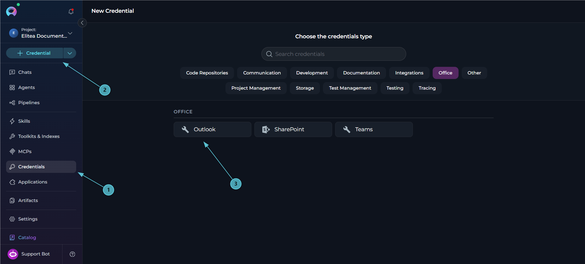
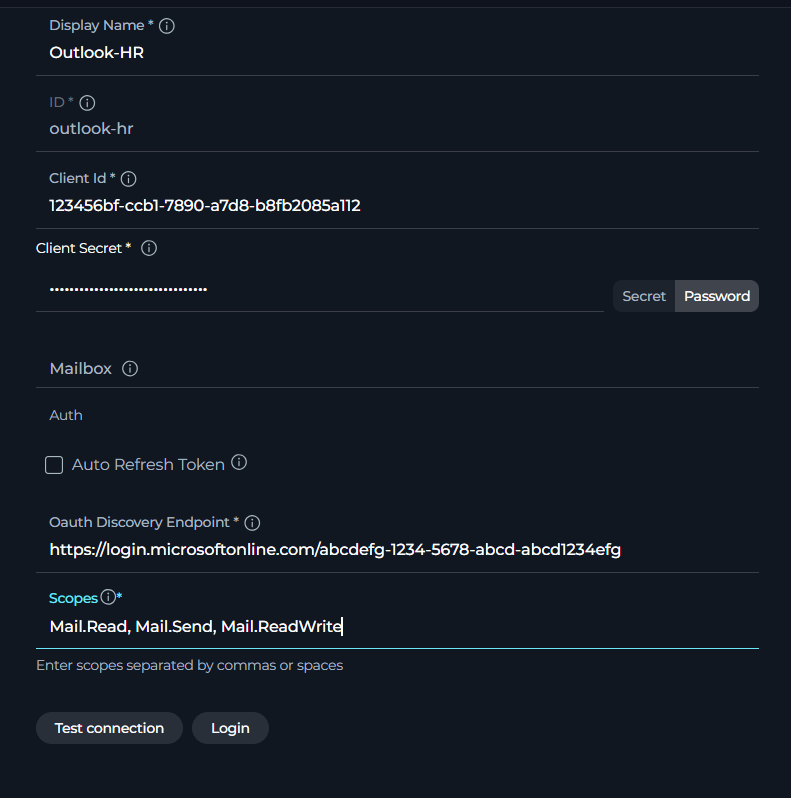
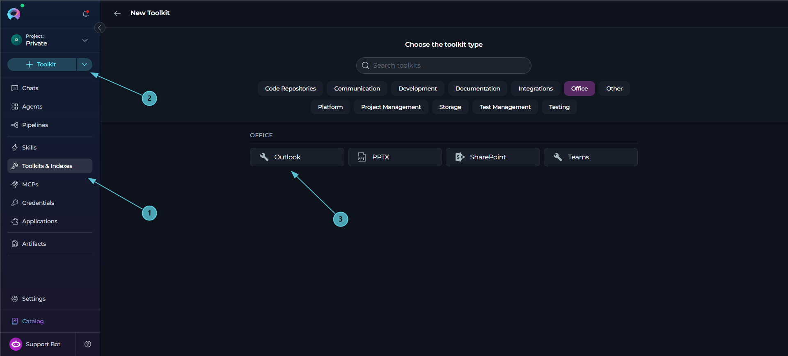
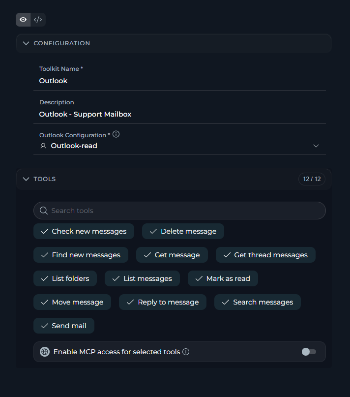
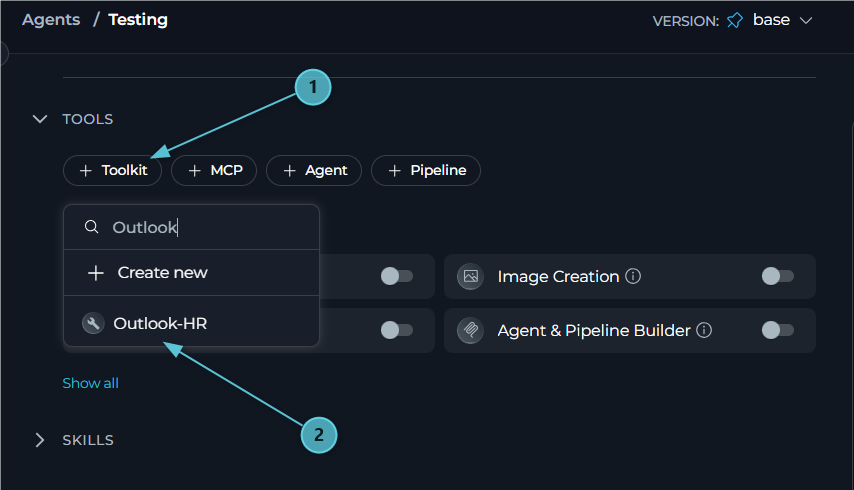
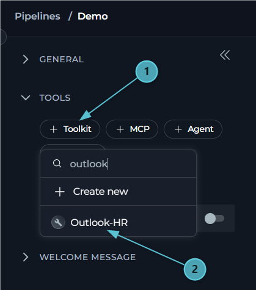
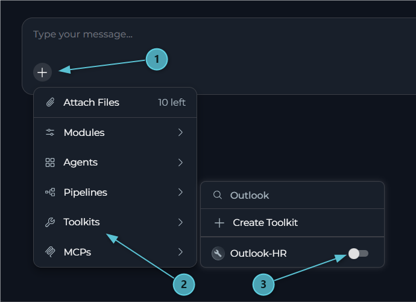

---

## Introduction

This document is your definitive resource for integrating and utilizing the **Outlook toolkit** within ELITEA. It provides a comprehensive, step-by-step walkthrough, from registering an application in Azure Active Directory to configuring the toolkit in ELITEA and effectively using it within your Agents. By following these steps, you will unlock the power of automated email management, streamlined mail workflows, and enhanced inbox intelligence, all directly within the ELITEA platform. This integration empowers you to leverage AI-driven automation to optimize your Outlook-driven workflows using the combined strengths of ELITEA and Microsoft Outlook.

**Brief Overview of Microsoft Outlook**

Microsoft Outlook is Microsoft's email and personal information management service, built on top of **Microsoft Graph** — the unified API for Microsoft 365 data. The ELITEA Outlook toolkit interacts with a mailbox through the Microsoft Graph Mail endpoints (`https://graph.microsoft.com/v1.0`), enabling Agents to:

*   **Read and Search Messages:** List messages from any mail folder, retrieve full message details, and search across a mailbox using Microsoft's KQL (Keyword Query Language) syntax.
*   **Send and Reply:** Compose and send new email messages, or reply (including reply-all) to existing messages.
*   **Manage Message State:** Mark messages as read or unread, move messages between folders, and delete messages.
*   **Organize and Discover Folders:** List all mail folders in a mailbox.
*   **Track New Activity and Threads:** Detect new or unread messages since a previous check, filter by sender or recipient, and retrieve every message in a conversation thread across folders.

Integrating Outlook with ELITEA brings mailbox automation directly into your AI-driven workflows. Your ELITEA Agents can intelligently read, triage, respond to, and monitor email on behalf of a signed-in user, making your mail-driven processes smarter and more efficient.

## Toolkit's Account Setup and Configuration in Outlook

<Info title="Integration with ELITEA">
The application you register in this section will be used when creating your Outlook credential in ELITEA (Step 1 of the integration process).
</Info>

### Registering an App in Azure Active Directory (Azure AD)

The Outlook toolkit authenticates using **Delegated (User OAuth)** access only — it acts on behalf of a signed-in user via Microsoft Entra ID (Azure AD). To enable this, you need to register an application in Azure AD that will represent ELITEA.

1.  **Access Azure Portal:** Open your web browser, navigate to the [Azure Portal](https://portal.azure.com/), and log in using an account with sufficient permissions to register applications in Azure AD.
2.  **Navigate to App Registrations:** In the Azure portal, use the search bar at the top to search for "App registrations" and select **"App registrations"** from the search results under "Services".
3.  **Create New Registration:** On the "App registrations" page, click **"+ New registration"**.

     

4.  **Configure App Registration Details:** On the "Register an application" page, provide the following information:
    *   **Name:** Enter a meaningful and descriptive name for your application registration, for example "ELITEA Outlook Integration" or "ELITEA Agent Access to Outlook".
    *   **Supported account types:** Select the appropriate account type based on your organization's requirements. In most cases, **"Accounts in this organizational directory only (\[Your Organization Name] only - Single tenant)"** is the recommended option for internal organizational use.
    *   **Redirect URI:** Since Outlook only supports Delegated (User OAuth) access, a redirect URI must always be configured:
          1. In the **"Select a platform"** dropdown, select **"Web"**.
          2. In the URI field, enter the ELITEA callback URL for your instance. The correct value depends on your deployment — refer to the info callout below.
5.  **Register Application:** Click the **"Register"** button at the bottom of the page to create the app registration.

     

<Info title="ELITEA OAuth Redirect URI">
The redirect URI to register in Azure AD depends on your ELITEA deployment:

| Deployment Type | Redirect URI |
|----------------|--------------|
| **ELITEA Cloud** | **Pattern:** `https://<your-elitea-instance-domain>/app/mcp-auth-callback` <br /> **Example:** `https://next.elitea.ai/app/mcp-auth-callback` |
| **Self-hosted / standard path** | `https://<your-domain>/mcp-auth-callback` |
| **Self-hosted / sub-path (e.g., `/app`)** | `https://<your-domain>/app/mcp-auth-callback` |

<Info>
**URL is not shown in the UI**

ELITEA does not display the redirect URI anywhere in its interface. The URL is automatically derived from the domain your ELITEA instance is deployed on. If you are unsure which value applies, contact your ELITEA administrator.
</Info>
</Info>

### Application Credentials

Once the app registration is created successfully, you will be redirected to the application's **Overview** page. Note down the following, as you will need them to configure the Outlook credential in ELITEA:

*   **Application (client) ID** — Copy and store this value securely.
*   **Directory (tenant) ID** — Copy and store this value securely.

     

### Configure API Permissions for the Registered App

To allow ELITEA to act on a signed-in user's mailbox, configure **delegated** Microsoft Graph permissions for your registered application.

1.  **Navigate to API Permissions:** In your registered app within the Azure portal, navigate to the left-hand menu and click **"API permissions"**.
2.  **Add Permissions:** On the "API permissions" page, click **"+ Add a permission"**.
     
     

3.  **Select API Type - Microsoft Graph:** In the "Request API permissions" panel, select the **"Microsoft Graph"** API tile.

     


4.  **Select Permission Type - Delegated permissions:** Choose **"Delegated permissions"** — the Outlook toolkit always acts on behalf of the signed-in user, never as the application itself.

     

5.  **Add Microsoft Graph Mail Scopes:** Search for and select the scopes your Agents require, for example:

    | **Scope** | **Description** | **When to Grant** |
    |-----------|-----------------|-------------------|
    | `Mail.Read` | Read messages in the signed-in user's mailbox | Needed for the read/search/track tools (`list_messages`, `get_message`, `search_messages`, `check_new_messages`, `find_new_messages`, `get_thread_messages`, `list_folders`) |
    | `Mail.Send` | Send mail as the signed-in user | Needed for `send_mail` and `reply_to_message` |
    | `Mail.ReadWrite` | Read and write access to the mailbox (mark read/unread, move, delete) | Needed for `mark_as_read`, `move_message`, `delete_message` |


6.  **Add Permissions:** Click **"Add permissions"** at the bottom of the panel to add the selected scopes to your application registration.
7.  **Grant Admin Consent (if required by your tenant):** On the "API permissions" page, click **"Grant admin consent for \[Your Organization Name]"** and then **"Yes"** if your organization requires admin consent for delegated permissions before users can authorize the app.

      


### Configure the Client Secret

To securely authenticate your ELITEA Outlook credential, create a Client Secret for your registered application.

1.  **Navigate to Certificates & secrets:** In your registered app within the Azure portal, click **"Certificates & secrets"**.
2.  **Create New Client Secret:** On the "Certificates & secrets" page, select the **"Client secrets"** tab and click **"+ New client secret"**.

      

3.  **Configure Client Secret Details:** In the "Add a client secret" panel, enter a **Description** and choose an appropriate **Expiration** period.

      

4.  **Add Client Secret:** Click **"Add"** to create the client secret.
5.  **Securely Copy and Store the Client Secret Value:** **Immediately copy the generated Client Secret Value** displayed in the **"Value"** column. **This is the only time you will see the full value.** Store it securely, preferably in ELITEA's **[Secrets](../../menus/settings/secrets)** feature.

      


<Warning title="Important">
Copy the **"Value"** column — not the **"Secret ID"** column. The Value is the actual credential used for authentication.
</Warning>

---

## System Integration with ELITEA

To integrate Outlook with ELITEA, you need to follow a three-step process: **Create Credentials → Create Toolkit → Use in Agents**. This workflow ensures secure authentication and proper configuration.

### Step 1: Create Outlook Credentials

Before creating a toolkit, you must first create Outlook credentials in ELITEA. The Outlook credential supports a single authentication mode — **Delegated (User OAuth)**.

1. **Navigate to Credentials Menu:** Open the sidebar and select **[Credentials](../../menus/credentials)**.
2. **Create New Credential:** Click the **`+ Credential`** button.
3. **Select Outlook:** Choose **Outlook** as the credential type.

     

4. **Configure Credential Details:**

   | Field | Required | Description |
   |-------|----------|-------------|
   | **Display Name** | Required | Descriptive name for this credential (e.g., *"Outlook - Support Mailbox"*) |
   | **ID** | Required | Unique identifier for the credential. Auto-populated from the Display Name |
   | **Client ID** | Required | Azure AD Application (client) ID from your app registration |
   | **Client Secret** | Required | Azure AD Client Secret Value generated in your app registration |
   | **Mailbox** | Optional | Mailbox email address to operate on. Leave empty to use the signed-in user's own mailbox (`/me`) |
   | **Auto Refresh Token** | Optional (default: enabled) | Automatically refresh the access token using the `offline_access` scope |
   | **OAuth Discovery Endpoint** | Optional | OAuth discovery endpoint, in the format `https://login.microsoftonline.com/{tenant_id}`, where `{tenant_id}` is the **Directory (tenant) ID** from your app registration |
   | **Scopes** | Optional | OAuth scopes to request (e.g., `Mail.Read`, `Mail.Send`) |

5. **Log in:** Once the **OAuth Discovery Endpoint** field is filled in, a **Login** button appears next to the **Test Connection** button. Click **Login** to initiate the OAuth authorization flow — ELITEA calls the Outlook check-connection endpoint, which redirects to Azure AD for user sign-in. After you authorize the application, the token is stored and the connection is verified against Microsoft Graph.

     * **Test Connection:** Click **Test Connection** to verify that your credentials are valid and ELITEA can successfully connect to the mailbox. This performs a health check against `GET /me/mailFolders` on Microsoft Graph.
6. **Save Credential:** Click **Save** to create the credential. It will be added to the credentials dashboard and available to use in toolkit configurations.

     

<Tip title="Security Recommendation">
It's highly recommended to use **[Secrets](../../menus/settings/secrets)** for the Client Secret instead of entering it directly. Create a secret first, then reference it in your credential configuration.
</Tip>

<Warning title="Re-login required after scope changes">
If you add, remove, or modify the **Scopes** field after the initial login, the existing token will not automatically include the new scopes. Click **Login** again to complete a new OAuth authorization flow and obtain a fresh token that reflects the updated scope list.
</Warning>

### Step 2: Create Outlook Toolkit

Once your credentials are configured, create the Outlook toolkit:

1. **Navigate to Toolkits Menu:** Open the sidebar and select **[Toolkits & Indexes](../../menus/toolkits)**.
2. **Create New Toolkit:** Click the **`+ Toolkit`** button.
3. **Select Outlook:** Choose **Outlook** from the list of available toolkit types.

     


4. **Configure Toolkit Details:**

   | Field | Required | Description |
   |-------|----------|-------------|
   | **Toolkit Name** | Required | Descriptive name for the toolkit (e.g., *"Outlook - Support Mailbox"*) |
   | **Description** | Optional | Brief description of the toolkit's purpose |
   | **Credential** | Required | Select the Outlook credential created in Step 1 |

5. **Enable Desired Tools:** In the **"Tools"** section, select the checkboxes next to the specific Outlook tools you want to enable. **Enable only the tools your agents will actually use** to follow the principle of least privilege.
       * **Enable MCP access for selected tools** — (optional) exposes the tools selected in this toolkit through the platform MCP server, so external MCP clients can call them.
6. **Save Toolkit:** Click **Save** to create the toolkit.

     

#### Available Tools:

The Outlook toolkit provides 12 tools for interacting with email messages, folders, and conversation threads:

| **Tool Name** | **Description** |
|---------------|-----------------|
| **List messages** | List email messages from a mail folder (inbox, sentitems, drafts, etc.) |
| **Get message** | Get a specific email message by its ID with full details |
| **Send mail** | Send a new email message. Returns `message_id` and `conversation_id` of the sent message; store them to later detect replies with `get_thread_messages` |
| **Reply to message** | Reply to an email message. Returns `message_id` and `conversation_id` of the sent reply |
| **Mark as read** | Mark an email as read or unread |
| **List folders** | List all mail folders in the mailbox |
| **Move message** | Move an email to a different folder |
| **Delete message** | Delete an email message |
| **Search messages** | Search for email messages using a KQL query (`from:`, `to:`, `subject:`, `body:`, `received:`, ...) |
| **Check new messages** | Quickly check whether new or unread emails are present, optionally only from given senders or sent to given distribution lists. Returns `has_new`, counts, a few latest messages, and a watermark / `latest_message_id` to pass as `since` / `after_message_id` next time |
| **Find new messages** | Find emails from given people and/or sent to given distribution lists and identify which are new (received after `since` / `after_message_id`, or unread when neither is given). Each message has `is_new` and `matched_by`; the result has a watermark / `latest_message_id` for the next call |
| **Get thread messages** | Get all messages of an email thread (conversation) across folders, oldest first, and identify new messages in it (after `since` / `after_message_id`, or unread). Reports `new_replies_count` (new messages not sent by the mailbox owner) |

<Note>
**Watermark-based "new message" tracking**

**Check new messages**, **Find new messages**, and **Get thread messages** are designed to be called repeatedly (e.g., on a schedule or at the start of each conversation turn). Each call returns a watermark value — pass it back as `since` or `after_message_id` on the next call to only see messages that arrived after the previous check.
</Note>

<Tip title="KQL Search Syntax">
**Search messages** uses Microsoft's KQL (Keyword Query Language). Example queries: `from:john@example.com subject:report`, `to:team-dl@example.com`, `received>=2026-09-01 budget`. Dates in KQL have day precision only — for exact "new since" checks, use **Find new messages** instead.
</Tip>

#### Testing Toolkit Tools

After configuring your Outlook toolkit, you can test individual tools directly from the Toolkit detailed page using the **Test Settings** panel. This allows you to verify that your credentials are working correctly and validate tool functionality before adding the toolkit to your workflows.

**General Testing Steps:**

1. **Select LLM Model:** Choose a Large Language Model from the model dropdown in the Test Settings panel
2. **Configure Model Settings:** Adjust model parameters like Creativity, Max Completion Tokens, and other settings as needed
3. **Select a Tool:** Choose the specific Outlook tool you want to test from the available tools
4. **Provide Input:** Enter any required parameters or test queries for the selected tool
5. **Run the Test:** Execute the tool and wait for the response
6. **Review the Response:** Analyze the output to verify the tool is working correctly and returning expected results

<Tip title="Key benefits of testing toolkit tools:">
* Verify that Outlook credentials and connection are configured correctly
* Test tool parameters and see actual responses from your mailbox
* Debug tool behavior and understand output formats
* Optimize tool settings before integrating with agents or pipelines
> For detailed instructions on how to use the Test Settings panel, see **[How to Test Toolkit Tools](../../how-tos/credentials-toolkits/how-to-test-toolkit-tools)**.
</Tip>

---

### Step 3: Add Outlook Toolkit to Your Workflows

Now you can add the configured Outlook toolkit to your agents, pipelines, or use it directly in chat:

---
#### In Agents:

1. **Navigate to Agents:** Open the sidebar and select **[Agents](../../menus/agents)**.
2. **Create or Edit Agent:** Either create a new agent or select an existing agent to edit.
3. **Add Outlook Toolkit:**
     * In the **"TOOLS"** section of the agent configuration, click the **"+Toolkit"** icon
     * Select your configured Outlook toolkit from the dropdown list
     * The toolkit will be added to your agent with the previously configured tools enabled

      


Your agent can now interact with the connected mailbox using the configured toolkit.

---
#### In Pipelines:

1. **Navigate to Pipelines:** Open the sidebar and select **[Pipelines](../../menus/pipelines)**.
2. **Create or Edit Pipeline:** Either create a new pipeline or select an existing pipeline to edit.
3. **Add Outlook Toolkit:**
     * In the **"TOOLS"** section of the pipeline configuration, click the **"+Toolkit"** icon
     * Select your configured Outlook toolkit from the dropdown list
     * The toolkit will be added to your pipeline with the previously configured tools enabled

      

---
#### In Chat:

1. **Navigate to Chat:** Open the sidebar and select **[Chat](../../menus/chat)**.
2. **Start New Conversation:** Click **+ Conversation** or open an existing conversation.
3. **Add Outlook Toolkit to Conversation:**
   - Click the **`+`** icon in the chat input toolbar (tooltip: *Add files, agents, toolkits and more…*)
   - Hover over **Toolkits** in the popup menu
   - Search for your Outlook toolkit by name
   - Enable the toolkit to add it to your conversation
4. **Verify Toolkit Added:** The Outlook toolkit appears in the **PARTICIPANTS** panel on the right side under the **Toolkits** section.
5. **Use Toolkit in Chat:** You can now directly interact with the connected mailbox by asking questions or requesting actions that will trigger the Outlook toolkit tools.

      


<Tip>
You can also add the toolkit by typing **`#`** in the chat input box and searching for your Outlook toolkit.
</Tip>

<Info title="Authorizing the toolkit from Chat">
If no valid OAuth token is available when an Outlook tool is called, ELITEA raises an authorization request for the toolkit. When this happens:

- A prompt appears asking: *"Authorization is required for toolkit "\<toolkit name>". Authorize now or skip it for this run?"*
- Selecting **Authorize** opens an OAuth dialog (titled **"Configuration OAuth"**) with **Cancel** and **Authorize** buttons.
- Completing the sign-in shows a **"Successful authentication!"** confirmation and the message **"✓ Authorization successful! Your credentials and session have been saved. Please send your message again to use the authorized MCP server."**
- Send your message again to continue with the now-authorized toolkit.
</Info>

<Info title="Example Chat Usage:">
- "Show me my last 10 unread emails."
- "Send an email to john@example.com with the subject 'Status Update'."
- "Search for messages from my manager about the budget."
- "Has anyone from the finance team emailed me since yesterday?"
</Info>

## Instructions and Prompts for Using the Outlook Toolkit

To effectively instruct your ELITEA Agent to use the Outlook toolkit, you need to provide clear and precise instructions within the Agent's "Instructions" field. These instructions are crucial for guiding the Agent on *when* and *how* to utilize the available Outlook tools to achieve your desired automation goals.

### Instruction Creation for OpenAI Agents

When crafting instructions for the Outlook toolkit, especially for OpenAI-based Agents, clarity and precision are paramount. Break down complex tasks into a sequence of simple, actionable steps. Explicitly define all parameters required for each tool and guide the Agent on how to obtain or determine the values for these parameters. OpenAI Agents respond best to instructions that are:

*   **Direct and Action-Oriented:** Employ strong action verbs and clear commands to initiate actions. For example, "Use the 'list_messages' tool...", "Send an email to...", "Search for messages containing...".

*   **Parameter-Centric:** Clearly enumerate each parameter required by the tool. For each parameter, specify:
    *   Its name (exactly as expected by the tool)
    *   The format or type of value expected
    *   How the Agent should obtain the value – whether from user input, derived from previous steps in the conversation, retrieved from an external source, or a predefined static value

*   **Contextually Rich:** Provide sufficient context so the Agent understands the overarching objective and the specific scenario in which each Outlook tool should be applied within the broader workflow. Explain the desired outcome or goal for each tool invocation.

*   **Step-by-Step Structure:** Organize instructions into a numbered or bulleted list of steps for complex workflows. This helps the Agent follow a logical sequence of actions.

*   **Add Conversation Starters:** Include example conversation starters that users can use to trigger this functionality. For example, "Conversation Starters: 'Show me my unread emails', 'Send a status update to the team', 'Any new messages from the client?'"

When instructing your Agent to use an Outlook toolkit tool, adhere to this structured pattern:

1. **State the Goal:** Begin by clearly stating the objective you want to achieve with this step. For example, "Goal: To send a status update email to the project team."

2. **Specify the Tool:** Clearly indicate the specific Outlook tool to be used for this step. For example, "Tool: Use the 'send_mail' tool."

3. **Define Parameters:** Provide a detailed list of all parameters required by the selected tool. For each parameter:
   - **Parameter Name:** `<Parameter Name as defined in tool documentation>`
   - **Value or Source:** `<Specify the value or how to obtain the value. Examples: "user input", "from previous step", "hardcoded value 'inbox'", "value of variable X">`

4. **Describe Expected Outcome (Optional but Recommended):** Briefly describe the expected result or outcome after the tool is successfully executed. For example, "Outcome: The Agent will confirm the email was sent and report the message_id."

5. **Add Conversation Starters:** Include example conversation starters that users can use to trigger this functionality.

<Info title="Example Agent Instructions">
**Inbox Monitoring and Triage Pattern:**

```markdown
You are an inbox assistant. Help the user stay on top of new email without re-reading messages they've already seen.

## Checking for New Mail
- **Tool**: check_new_messages
- **Parameters**:
    - folder: "inbox" (default, unless the user specifies another folder)
    - since or after_message_id: the watermark returned by the previous call (ask the user or use the value stored from the last check if available; omit on the very first call)
    - senders: (optional) list of sender addresses, if the user only cares about specific people
- **Process**:
    1. Call the tool and report has_new, the counts, and the latest messages
    2. Store the returned watermark / latest_message_id for the next check
    3. If has_new is false, tell the user there is nothing new

## Finding Messages From Specific People
- **Tool**: find_new_messages
- **Parameters**:
    - senders or recipients: addresses provided by the user
    - since / after_message_id: previous watermark, if any
    - unread_only: true if the user only wants unread messages
- **Process**:
    1. Present each match with is_new and matched_by so the user knows why it was included
    2. Store the new watermark for the next call

## Sending a Reply
- **Tool**: reply_to_message
- **Parameters**:
    - message_id: the message being replied to (from a previous list/search step)
    - body: reply content (ask the user, or draft one and confirm before sending)
    - reply_all: true only if the user explicitly asks to reply to everyone
- **Process**:
    1. Confirm the drafted reply with the user before sending
    2. Send and report back the new message_id and conversation_id

## Conversation Starters
- "Do I have any new emails since we last checked?"
- "Has anyone from the client team emailed me today?"
- "Reply to the last message from Sarah confirming the meeting time"
- "Search my inbox for anything about the Q3 budget"
```
</Info>

### Chat Usage Examples by Tool Category

The following examples demonstrate how to interact with the Outlook toolkit in ELITEA Chat, grouped by functional area. Each example shows the user request and the expected agent behavior.

<Accordion title="Reading & Searching - List Messages">
**Chat Example:**
```
User: "Show me my last 5 unread emails in the inbox."

Agent Response: [Agent uses list_messages tool with folder="inbox", unread_only=true, limit=5]

📧 **Unread Messages - Inbox (5)**:

1. **"Q3 Budget Review"** — from finance@company.com
   - Received: 2026-09-27 14:32
2. **"Re: Client Onboarding"** — from sarah@partner.com
   - Received: 2026-09-27 11:05
3. **"Weekly Status Update"** — from team-lead@company.com
   - Received: 2026-09-26 17:48

Would you like me to open any of these in full?
```
</Accordion>

<Accordion title="Reading & Searching - Search Messages">
**Chat Example:**
```
User: "Search my mailbox for anything about the budget approval from finance."

Agent Response: [Agent uses search_messages tool with query="from:finance@company.com budget approval"]

🔍 **Search Results for "budget approval" from finance@company.com (3 matches)**:

1. **"Q3 Budget Approval Needed"** — 2026-09-25
2. **"Re: Q3 Budget Approval Needed"** — 2026-09-26
3. **"Budget Approval - Final Sign-off"** — 2026-09-27

Would you like me to open the full content of any of these?
```
</Accordion>

<Accordion title="Sending & Replying - Send Mail">
**Chat Example:**
```
User: "Send an email to john@example.com with subject 'Status Update' and tell him the report is ready."

Agent Response: [Agent uses send_mail tool]

✅ **Email Sent Successfully!**

- **To**: john@example.com
- **Subject**: Status Update
- **Message ID**: AAMkAGI1...
- **Conversation ID**: AAQkAGI1...

I'll keep the conversation_id so I can detect if John replies.
```
</Accordion>

<Accordion title="Sending & Replying - Reply to Message">
**Chat Example:**
```
User: "Reply to the last message from Sarah and confirm the meeting is at 3pm."

Agent Response: [Agent uses reply_to_message tool]

✅ **Reply Sent!**

- **In reply to**: "Re: Client Onboarding" from sarah@partner.com
- **New Message ID**: AAMkAGI1...
- **Conversation ID**: AAQkAGI1...
```
</Accordion>

<Accordion title="Organizing - Move and Mark Messages">
**Chat Example:**
```
User: "Mark that last message as read and move it to the Archive folder."

Agent Response: [Agent uses mark_as_read tool, then move_message tool]

✅ **Done!**
- Message marked as **read**
- Moved to folder: **Archive**
```
</Accordion>

<Accordion title="Tracking New Activity - Check New Messages">
**Chat Example:**
```
User: "Anything new in my inbox since we last checked?"

Agent Response: [Agent uses check_new_messages tool with since=<stored watermark>]

📬 **New Activity Check**:

- **has_new**: true
- **New messages**: 2
- **Latest**:
  1. "Contract Renewal Reminder" — legal@company.com
  2. "Re: Project Timeline" — pm@company.com

I've updated the watermark so the next check only shows messages after these.
```
</Accordion>

<Accordion title="Tracking Threads - Get Thread Messages">
**Chat Example:**
```
User: "Show me the full thread for the 'Client Onboarding' conversation and tell me if there are any new replies."

Agent Response: [Agent uses get_thread_messages tool with conversation_id=<from previous send_mail/reply_to_message call>]

🧵 **Thread: "Re: Client Onboarding" (4 messages, oldest first)**:

1. You → sarah@partner.com — "Client Onboarding" (2026-09-24)
2. Sarah → you — "Re: Client Onboarding" (2026-09-25)
3. You → sarah@partner.com — "Re: Client Onboarding" (2026-09-26)
4. Sarah → you — "Re: Client Onboarding" (2026-09-27) — **new**

**new_replies_count**: 1 (from Sarah, not sent by the mailbox owner)
```
</Accordion>

---

## <Icon icon="triangle-exclamation" size={24} /> Troubleshooting

<Accordion title="Credential Not Appearing in Toolkit Configuration">
**Problem:** When creating a toolkit, your Outlook credential doesn't appear in the credentials dropdown.

**Troubleshooting Steps:**

1. **Check Credential Scope:** Ensure you're working in the same workspace/project where the credential was created. Private credentials are only visible in your Private workspace, while project credentials are visible within the specific team project.
2. **Verify Credential Creation:** Go to the Credentials menu and confirm that your Outlook credential was successfully saved.
3. **Credential Type Match:** Ensure you selected **"Outlook"** as the credential type when creating the credential.
</Accordion>

<Accordion title="OAuth Login Fails with 'No Reply Address Is Registered' Error">
**Problem:** When clicking **Login** during credential setup, the OAuth flow fails with an error such as:
> *AADSTS500113: No reply address is registered for the application.*

**Cause:** This error occurs when no Redirect URI has been registered in your Azure AD App Registration. Azure AD requires the redirect URI to be explicitly registered before it will send the authorization response back to ELITEA.

**Troubleshooting Steps:**

1. **Open your App Registration:** In the [Azure Portal](https://portal.azure.com), go to **Microsoft Entra ID → App registrations** and select your app.
2. **Navigate to Authentication:** In the left menu, click **"Authentication"**.
3. **Add a Redirect URI:** If no Web platform exists, click **"+ Add a platform"** → **"Web"**. If Web is already listed, click the **Edit** pencil next to it.
4. **Enter the ELITEA callback URL:** In the **"Redirect URIs"** field, enter the value matching your deployment (see the [redirect URI table](#registering-an-app-in-azure-active-directory-azure-ad) above).
5. **Save:** Click **"Configure"** (or **"Save"** if editing), then click **"Save"** at the top of the page.
6. **Retry:** Return to your ELITEA Outlook credential and click **Login** again.
</Accordion>

<Accordion title="Connection Test Fails or Tools Return Re-authorization Errors">
**Problem:** **Test Connection** fails, or Outlook tools stop working after previously working.

**Cause:** The Outlook toolkit performs its connection health check by calling `GET /me/mailFolders` on Microsoft Graph. A `401` response from this call means the access token is missing, expired, or invalid — ELITEA will raise a fresh authorization request rather than a plain error, prompting you to log in again.

**Troubleshooting Steps:**

1. **Re-authenticate:** In the credential form, click **Logout** then **Login** again to obtain a fresh token.
2. **Check Auto Refresh Token:** Ensure **Auto Refresh Token** is enabled so the toolkit can silently refresh the token using the `offline_access` scope instead of requiring a manual re-login for every expiry.
3. **Verify Client Secret Validity:** Confirm the Client Secret in Azure AD has not expired. If it has, generate a new one and update your ELITEA credential.
</Accordion>

<Accordion title="'Access Forbidden' Errors">
**Problem:** The connection test or a tool call reports: *"Access forbidden - token lacks required Microsoft Graph Mail permissions"*.

**Cause:** This is a `403` response from Microsoft Graph — the token was issued successfully, but it does not carry the delegated Mail scope(s) required for the operation.

**Troubleshooting Steps:**

1. **Review Granted Scopes:** In Azure AD, go to **API permissions** on your app registration and confirm the required Mail scopes (`Mail.Read`, `Mail.Send`, `Mail.ReadWrite`, etc.) are listed as **Delegated permissions**.
2. **Grant Admin Consent (if required):** If your tenant requires admin consent for delegated permissions, ensure it has been granted.
3. **Update the Scopes Field and Re-login:** Update the **Scopes** field in your ELITEA credential to include the missing scope(s), then click **Logout** and **Login** again — an existing token does not automatically pick up newly added scopes.
</Accordion>

<Accordion title="Search Messages Misses Recently Received Emails">
**Problem:** `search_messages` does not return a message you know arrived recently, even though a plain `list_messages` call shows it.

**Cause:** `search_messages` uses Microsoft's KQL syntax, where date-based clauses (e.g., `received>=2026-09-27`) have **day precision only** — they cannot distinguish between messages received at different times on the same day.

**Troubleshooting Steps:**

1. **Use Find New Messages for Precise Timing:** For "did anything new arrive since a specific moment" queries, use `find_new_messages` or `check_new_messages` with a `since` timestamp instead — these use exact ISO 8601 timestamp comparisons, not day-level KQL date matching.
2. **Broaden the KQL Query:** If you must use `search_messages`, broaden the date range or drop the date clause and filter results afterward.
</Accordion>

<Accordion title="Toolkit Configuration Issues">
**Problem:** The toolkit fails to load or shows configuration errors after creation.

**Troubleshooting Steps:**

1. **Credential Selection:** Ensure you have selected the correct Outlook credential from the dropdown in the toolkit configuration.
2. **Re-check Required Credential Fields:** Confirm **Client ID** and **Client Secret** are both set on the linked credential — these are required regardless of whether OAuth login has been completed.
</Accordion>

### <Icon icon="envelope" size={24} /> Support Contact

If you encounter issues not covered here or need additional assistance with Outlook integration, please refer to **[Contact Support](../../support/contact-support)** for detailed information on how to reach the ELITEA Support Team.

---

## <Icon icon="circle-question" size={24} /> FAQ

<Accordion title="Does the Outlook toolkit support App-Only (application-only) authentication?">
**No.** The Outlook toolkit's credential schema only defines a single authentication mode — **Delegated (User OAuth)**. There is no App-Only / client-credentials equivalent, unlike the SharePoint toolkit. Every Outlook credential must be authorized by a signed-in user via the **Login** button on the credential form.
</Accordion>

<Accordion title="What are the required credential fields for the Outlook toolkit?">
**Always required:**

* **Client ID** — Azure AD Application (client) ID.
* **Client Secret** — Azure AD Client Secret value.

**Required to complete the OAuth login (and therefore to actually call any tool):**

* **OAuth Discovery Endpoint** — `https://login.microsoftonline.com/{tenant_id}`.
* **Scopes** — the Microsoft Graph Mail scopes your Agents need (e.g., `Mail.Read`, `Mail.Send`).

**Optional:**

* **Mailbox** — leave empty to use the signed-in user's own mailbox (`/me`).
* **Auto Refresh Token** — enabled by default; automatically refreshes the token using `offline_access`.
</Accordion>

<Accordion title="What happens if I leave the Mailbox field empty?">
The toolkit falls back to `/me` on Microsoft Graph — i.e., the mailbox of whichever user completed the OAuth login on the credential. Set **Mailbox** explicitly only when the credential should operate on a different, specific mailbox.
</Accordion>

<Accordion title="Is the offline_access scope something I need to add myself?">
**No.** When ELITEA builds the OAuth authorization request, it automatically inserts the `offline_access` scope alongside whatever you list in the **Scopes** field, so refresh tokens are issued without any extra configuration on your part.
</Accordion>

<Accordion title="Do I need to register a Redirect URI for the Outlook credential?">
**Yes, always.** Since the Outlook toolkit only supports Delegated (User OAuth) access, a redirect URI must be registered in your Azure AD App Registration under **Authentication → Redirect URIs**. Without it, Azure AD will reject the authorization request with `AADSTS500113: No reply address is registered`.
</Accordion>

<Accordion title="How do I find my Directory (Tenant) ID?">
The **Directory (tenant) ID** is needed for the **OAuth Discovery Endpoint** field. You can find it in two places:

**Option 1 — Microsoft Entra ID Overview:**
1. In the **[Azure Portal](https://portal.azure.com)**, search for **"Microsoft Entra ID"** and select it.
2. On the **Overview** page, copy the **"Tenant ID"** value.

**Option 2 — App Registration Overview:**
1. In the Azure Portal, go to **Microsoft Entra ID → App registrations** and select your app.
2. On the **Overview** page, copy the **"Directory (tenant) ID"** value.

Use the Tenant ID in the **OAuth Discovery Endpoint** field as:
```
https://login.microsoftonline.com/{tenant_id}
```
</Accordion>

<Accordion title="Can I use the same Outlook credential across multiple toolkits and agents?">
Yes! Once you create an Outlook credential, you can reuse it across multiple Outlook toolkits, and each toolkit can be used by multiple agents, pipelines, and chat sessions. This promotes better credential management and reduces duplication.
</Accordion>

<Accordion title="How does the toolkit distinguish new messages from ones I've already seen?">
`check_new_messages`, `find_new_messages`, and `get_thread_messages` return a watermark value (a timestamp or the latest message ID). Pass that value back in on the next call as `since` or `after_message_id` to only surface messages received after the previous check. If neither is provided, these tools fall back to unread-status instead.
</Accordion>

<Accordion title="What are some best practices for using the Outlook toolkit effectively?">
**Test Integration Thoroughly:**

- After setting up the Outlook toolkit and incorporating it into your Agents, thoroughly test each tool you intend to use to ensure seamless connectivity, correct authentication, and accurate execution of mailbox actions.

**Follow Security Best Practices:**

- Store the Client Secret using ELITEA's Secrets Management feature rather than entering it directly.
- Grant only the minimum necessary Microsoft Graph Mail scopes (principle of least privilege).

**Use Watermarks for Recurring Checks:**

- When an Agent or pipeline checks a mailbox repeatedly (e.g., on a schedule), always persist and reuse the watermark returned by `check_new_messages` / `find_new_messages` / `get_thread_messages` so it doesn't re-report the same messages.

**Confirm Before Sending:**

- Have Agents draft the body of `send_mail` or `reply_to_message` and confirm it with the user before actually sending, especially for Delegated credentials acting under a real person's identity.

**Provide Clear Instructions:**

- Craft clear and unambiguous instructions within your ELITEA Agents to guide them in using the Outlook toolkit effectively. Use the prompt examples provided in this documentation as a starting point.
</Accordion>


<Note title="Microsoft documentation">
- **[Azure Portal](https://portal.azure.com)** - *Manage your Azure AD App Registrations, API permissions, and Client Secrets.*
- **[Microsoft Graph Mail API Overview](https://learn.microsoft.com/en-us/graph/api/resources/mail-api-overview)** - *Official documentation for the Microsoft Graph Mail API used by this toolkit.*
- **[Microsoft Graph Permissions Reference](https://learn.microsoft.com/en-us/graph/permissions-reference)** - *Detailed reference for Microsoft Graph API permission scopes, including Mail.Read, Mail.Send, and Mail.ReadWrite.*
- **[KQL Query Syntax Reference](https://learn.microsoft.com/en-us/microsoft-365/enterprise/keyword-queries-and-search-conditions)** - *Reference for the Keyword Query Language (KQL) syntax used by the search_messages tool.*
</Note>
