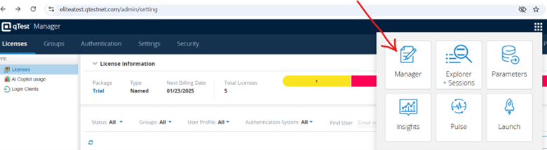
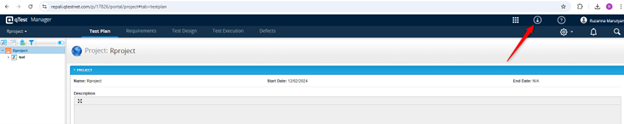
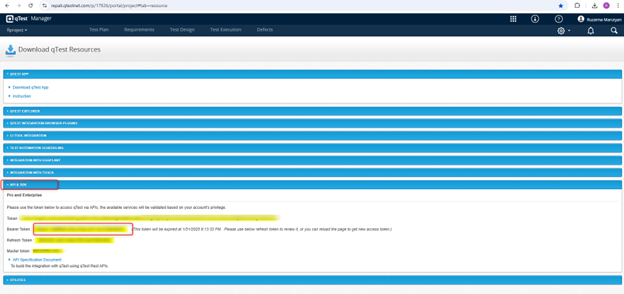
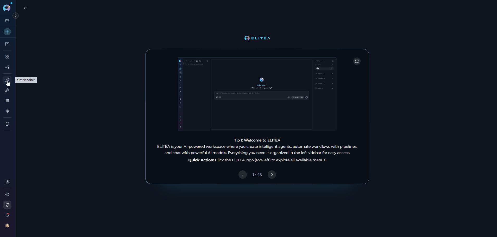
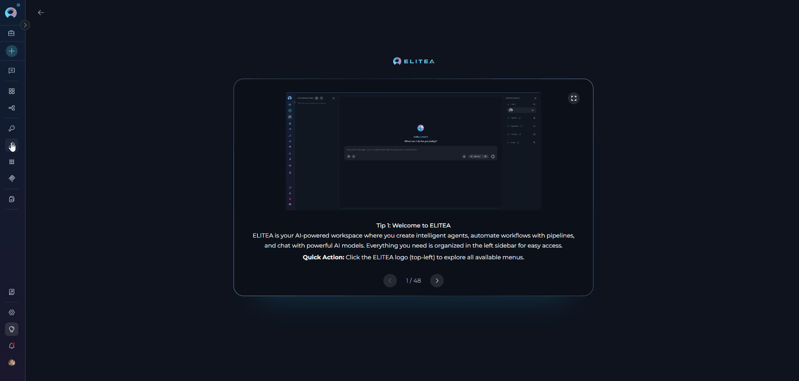
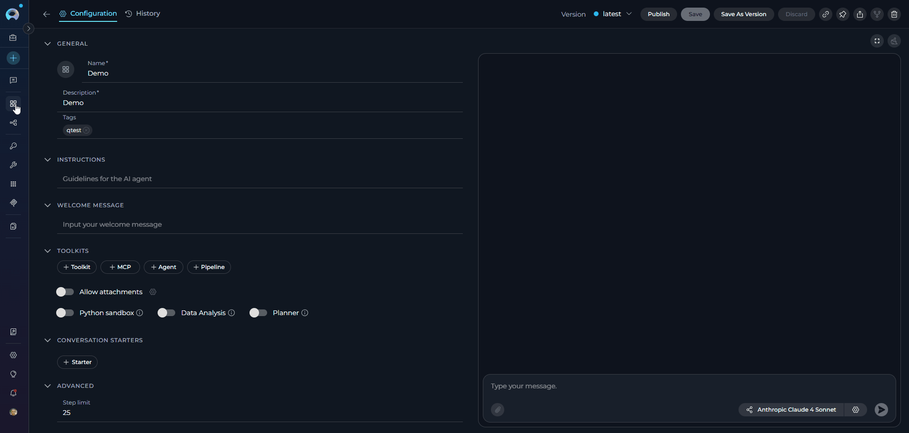
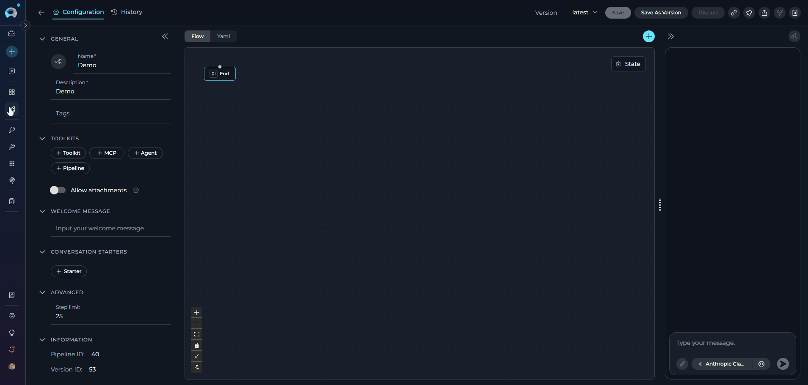
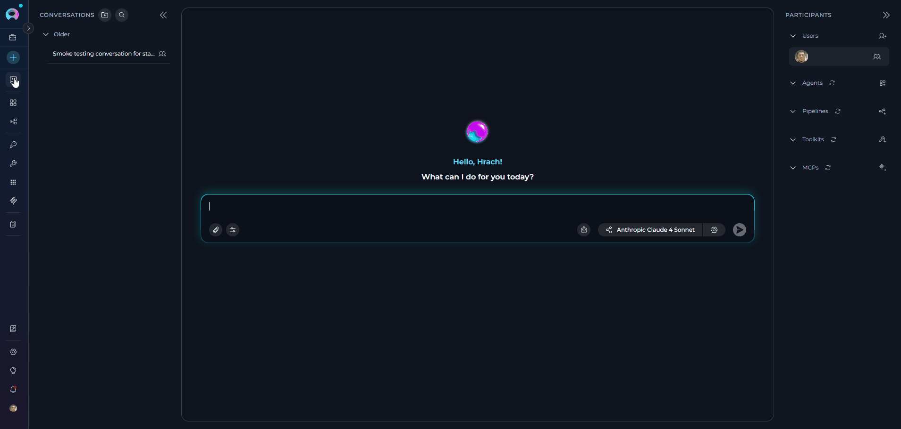
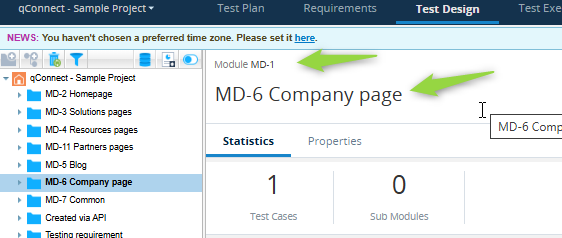

## Introduction

The document covers integrating and using the **qTest toolkit** within ELITEA. It provides a step-by-step walkthrough — from setting up your qTest API token to configuring the toolkit in ELITEA and incorporating it into your Agents. With this workflow, you can automate test management, streamline testing workflows, and enhance test coverage, all within the ELITEA platform.

**Brief overview of qTest**

qTest, by Tricentis, is a cloud-based test management platform that centralizes software testing activities and enables comprehensive quality management. It serves as a central hub for teams to manage test cases, track test execution, and ensure comprehensive test coverage. qTest offers a wide array of functionalities, including:

- **Test case management:** Create, organize, and manage test cases in a centralized repository
- **Test execution tracking:** Monitor test runs and track execution status in real-time
- **Requirements traceability:** Link test cases to requirements and defects for complete audit trails
- **Reporting & analytics:** Generate comprehensive reports on test coverage and quality metrics
- **Agile integration:** Support for iterative testing and CI/CD pipeline integration

By integrating qTest with ELITEA, your Agents can interact with your qTest projects and test assets to automate test management tasks, enhance test tracking, improve team collaboration, and optimize your entire test management lifecycle.

---

## Account Setup & Configuration in qTest

**Account setup**

If you do not yet have a qTest account, follow these steps to create one:

1. **Visit Tricentis website:** Open your web browser and navigate to the official Tricentis qTest website: [https://www.tricentis.com/](https://www.tricentis.com/).
2. **Sign up for qTest:** Go to **"Trials & demos"** and select **"Try qTest free"** to start a free 14-day trial.
3. **Create an account:** Follow the prompts to create your qTest account. Complete the registration form with your business details.
4. **Create workspace:** During the signup process, you will be asked to create your qTest web address and account credentials.
5. **Verify email:** Check your inbox for a verification email from qTest. Select the verification link in the email to activate your account.
6. **Access qTest:** Once your email is verified, log in to qTest using your newly created credentials.

### Generate an API token

For secure integration with ELITEA, use a qTest **API token** (Bearer Token) for authentication. This method is more secure than using your primary qTest account password directly and allows you to control access permissions.

Follow these steps to generate an API token in qTest:

1. **Log in to qTest:** Go to your qTest URL (e.g., `your-subdomain.qtestnet.com`) and log in with your credentials.
2. **Go to API settings:** Go to **"Manager"** > **"API & SDK"** from the main navigation menu.
3. **Copy your API token:** Find and copy your Bearer Token from the API settings page. This is your API token for authentication.
4. **Store your API token securely:** Copy the generated API token immediately. Store it in a password manager or, preferably, ELITEA built-in Secrets feature for enhanced security. You will need this token to configure the qTest toolkit in ELITEA.







---

## System Integration with ELITEA

To integrate qTest with ELITEA, follow a three-step process: **Create Credentials > Create Toolkit > Use in Agents**. This workflow ensures secure authentication and proper configuration.

### Step 1: Create qTest credentials

1. **Go to Credentials:** Open the sidebar and select **[Credentials](../../menus/credentials)**.
2. **Create new credential:** Select **`+ Create`**.
3. **Select qTest:** Choose **qTest** as the credential type.
4. **Complete the fields:**
   - **Display name:** Enter a descriptive name (e.g., "qTest - Test Management")
   - **Base URL:** Enter your qTest instance URL (e.g., `https://your-subdomain.qtestnet.com`)
   - **qTest API token:** Enter your Bearer token from qTest
5. **Test connection:** Select **Test Connection** to verify that your credentials are valid and ELITEA can connect to qTest.
6. **Save credential:** Select **Save** to create the credential. After saving, your qTest credential appears in the credentials dashboard and is ready to use in toolkit configurations. You can view, edit, or delete it from the **Credentials** menu at any time.



<Tip title="Security recommendation">
Use **[Secrets](../../menus/settings/secrets)** for API tokens instead of entering them directly. Create a secret first, then reference it in your credential configuration.
</Tip>

---

### Step 2: Create qTest toolkit

1. **Go to Toolkits:** Open the sidebar and select **[Toolkits](../../menus/toolkits)**.
2. **Create new toolkit:** Select **`+ Create`**.
3. **Select qTest:** Choose **qTest** from the list of available toolkit types.
4. **Complete the fields:**
   - **Toolkit name:** Enter a descriptive name for your toolkit (required). Example: "qTest - Project Testing"
   - **Description:** Provide an optional description to explain the toolkit purpose. Example: "Toolkit for managing test cases and test execution in qTest for Project Alpha"
5. **Configure credentials:**
   - In the **Configuration** section, select your previously created qTest credential from the **Credentials** dropdown.
6. **Configure advanced options:**
   - **PgVector configuration:** Select a PgVector connection for vector database integration.
   - **Embedding model:** Select an embedding model for text processing and semantic search capabilities.
7. **Configure qTest settings:**
   - **qTest project ID:** Enter the numerical project ID of your qTest project.
   - **No of tests shown in DQL search:** **[Required field]** Set the maximum number of test cases to retrieve in DQL queries (recommended: 100–200).

    <Warning title="Required field">
    The **No of tests shown in DQL search** field is mandatory and must be filled in. This setting controls the maximum number of test cases returned from DQL queries to prevent context overflow and improve performance.
    </Warning>

8. **Turn on desired tools:** In the **"Tools"** section, select the checkboxes next to the specific qTest tools you want to turn on. Turn on only the tools your agents will use to follow the principle of least privilege.
   - **[Make tools available by MCP](../mcp/make-tools-available-by-mcp)** — (optional) Turn on this option to make the selected tools accessible through external MCP clients.
9. **Save toolkit:** Select **Save** to create the toolkit.



#### DQL search limit configuration: "No of tests shown in DQL search"

<Warning title="Mandatory field">
The **No of tests shown in DQL search** field is a mandatory setting that controls the maximum number of test cases retrieved when using DQL queries. This field must be filled in for the toolkit to function properly.
</Warning>

**Purpose and usage:**

- **Context management:** Prevents LLM context limits from being exceeded when retrieving large datasets
- **Performance optimization:** Smaller result sets improve query response times and Agent processing speed
- **Resource control:** Manages the amount of data transferred and processed during DQL operations
- **Image handling:** Especially important when "Extract images" is turned on, as images significantly increase context size

<Warning title="Common issues">
- **Field left empty:** Queries may fail or return no results
- **Value too low:** You may miss important test cases in your search results
- **Value too high:** Risk of context overflow, especially with images turned on
</Warning>

<Tip title="DQL search limit best practices">
- **Start conservative:** Begin with 100 test cases for text-only queries, 20–50 for image extraction.
- **Monitor context usage:** Watch for context warnings in Agent responses.
- **Image considerations:**
  - Use lower limits (20–50) when extracting images.
  - Turn on image extraction only when visual analysis is essential.
  - Consider token usage when working with multiple images.
- **Query specificity:** Use precise DQL filters and module names to reduce unnecessary data.
- **Folder references:** Always use complete module names in folder queries (e.g., "MD-3 MD-11 Partners pages").
</Tip>

#### Available tools

In the table you can see tools for interacting with qTest projects and test cases, organized by functional categories:

| Tool category | Tool name | Description | Primary use case |
|---|---|---|---|
| **Search & discovery** | | | |
| | **Search by DQL** | Search for test cases using qTest Data Query Language (DQL) queries | Find test cases based on complex criteria using DQL |
| | **Search entities by DQL** | Search for various qTest entities using DQL queries | Find requirements, test runs, defects, and other entities |
| | **Get modules** | Retrieve module IDs and names from the qTest project | Discover project module structure for accurate DQL queries |
| | **Find entity by ID** | Retrieve any qTest entity by its unique identifier | Access detailed information for any entity type |
| **Test case management** | | | |
| | **Create test cases** | Create new test cases in qTest within a specified project and folder | Automate test case creation from requirements or user stories |
| | **Update test case** | Modify fields of existing test cases | Update test case steps, expected results, and attributes |
| | **Find test case by ID** | Retrieve detailed information about a specific test case | Access comprehensive test case details for analysis |
| | **Delete test case** | Delete a test case from qTest | Remove obsolete or redundant test cases |
| | **Add file to test case** | Upload a file from artifact storage to a qTest test case or specific test step | Attach files, screenshots, or documents to test cases or individual test steps |
| | **Get all test cases fields for project** | Retrieve all available custom and standard fields for test cases | Understand available fields for creating or updating test cases |
| **Test run & defect management** | | | |
| | **Find test runs by test case ID** | Retrieve all test run instances for a specific test case | Track execution history and test run results |
| | **Find defects by test run ID** | Retrieve all defects associated with a specific test run | Analyze defects found during test execution |
| | **Update test run status** | Update the execution status of a manual test run and optionally add an execution note | Record execution outcomes such as Passed, Failed, Blocked, or Incomplete |
| | **Upload attachment to test run** | Upload a file to the test run context by attaching it to the underlying test case or to the latest test log | Add evidence files, logs, or screenshots to execution records |
| **Requirements & traceability** | | | |
| | **Find requirements by test case ID** | Retrieve all requirements linked to a specific test case | Verify test coverage for requirements |
| | **Find test cases by requirement ID** | Retrieve all test cases linked to a specific requirement | Assess requirement testing completeness |
| | **Link tests to Jira requirement** | Link test cases to Jira requirements | Maintain traceability between qTest tests and Jira requirements |
| | **Link tests to qTest requirement** | Link test cases to qTest requirements | Maintain traceability between tests and qTest requirements |
| **Advanced search (vector/index)** | | | |
| | **Index data** | Index test case data into a vector database for semantic search | Turn on AI-powered semantic search across test cases |
| | **Search index** | Perform semantic search across indexed test case data | Find relevant test cases using natural language queries |
| | **Stepback search index** | Perform stepback semantic search with query refinement | Enhanced search with automatic query optimization |
| | **Stepback summary index** | Generate summaries from stepback search results | Get concise summaries of search results |
| | **List collections** | List all available vector database collections | Discover indexed data collections |
| | **Remove index** | Delete indexed data from the vector database | Remove or refresh indexed data |

<Note title="Search by DQL: lighter defaults & timeout protection">
The **Search by DQL** tool uses lighter default request behavior for more predictable performance under heavier workloads.

By default:

- `append_test_steps` is `false`, so full test-step payloads are not fetched unless you request them explicitly.
- `include_external_properties` is `false`, so external-property payloads are also excluded unless needed.

This reduces response size, lowers latency, and helps avoid unnecessary context growth for standard list and lookup scenarios.

If your workflow needs the fuller payload, opt in explicitly by turning on those parameters for the specific call.
</Note>

<Info title="qTest API timeout protection">
qTest API requests run with timeout protection. Slow or unresponsive qTest endpoints fail in a controlled way instead of waiting indefinitely. The default request timeout is 180 seconds and can be adjusted by platform configuration when needed.
</Info>

<Tip title="Vector search tools">
The tools **Index data**, **List collections**, **Remove index**, **Search index**, **Stepback search index**, and **Stepback summary index** require PgVector configuration and an embedding model. These turn on advanced semantic search capabilities across your qTest projects.
</Tip>

<Warning title="Image extraction considerations">
The **Search by DQL** tool includes an "Extract images" property:

- Images must be pasted directly into test steps (not attachments).
- Large image datasets significantly increase token usage and processing time.
- Monitor for context overflow when extracting images from multiple test cases.
- Use specific DQL queries to limit results when working with image-heavy test cases.
- Custom image analysis prompts can be configured to optimize token usage.
</Warning>

#### Test toolkit tools

After configuring your qTest toolkit, you can test individual tools directly from the toolkit detail page using the **Test settings** panel. This allows you to verify that your credentials are working correctly and validate tool functionality before adding the toolkit to your workflows.

**General testing steps:**

1. **Select LLM model:** Choose a Large Language Model from the model dropdown in the Test settings panel.
2. **Configure model settings:** Adjust model parameters like creativity, max completion tokens, and other settings as needed.
3. **Select a tool:** Choose the specific qTest tool you want to test from the available tools.
4. **Provide input:** Enter any required parameters or test queries for the selected tool.
5. **Run the test:** Run the tool and wait for the response.
6. **Review the response:** Analyze the output to verify the tool is working correctly and returning expected results.

<Tip title="Key benefits of testing toolkit tools">
- Verify that qTest credentials and connection are configured correctly.
- Test tool parameters and see actual responses from your qTest instance.
- Debug tool behavior and understand output formats.
- Optimize tool settings before integrating with agents or pipelines.

For more information, see **[How to test toolkit tools](../../how-tos/credentials-toolkits/how-to-test-toolkit-tools)**.
</Tip>

---

### Step 3: Add qTest toolkit to your workflows

You can add the configured qTest toolkit to your agents, pipelines, or use it directly in chat.

#### In Agents

1. **Go to Agents:** Open the sidebar and select **[Agents](../../menus/agents)**.
2. **Create or edit agent:** Create a new agent or select an existing agent to edit.
3. **Add qTest toolkit:**
   - In the **"TOOLKITS"** section of the agent configuration, select the **"+Toolkit"** icon.
   - Select your configured qTest toolkit from the dropdown list.
   - The toolkit will be added to your agent with the previously configured tools turned on.

Your agent can now interact with qTest using the configured toolkit and turned-on tools.



---

#### In Pipelines

1. **Go to Pipelines:** Open the sidebar and select **[Pipelines](../../menus/pipelines)**.
2. **Create or edit pipeline:** Create a new pipeline or select an existing pipeline to edit.
3. **Add qTest toolkit:**
   - In the **"TOOLKITS"** section of the pipeline configuration, select the **"+Toolkit"** icon.
   - Select your configured qTest toolkit from the dropdown list.
   - The toolkit will be added to your pipeline with the previously configured tools turned on.



---

#### In Chat

1. **Go to Chat:** Open the sidebar and select **[Chat](../../menus/chat)**.
2. **Start new conversation:** Select **+Create** or open an existing conversation.
3. **Add toolkit to conversation:**
   - In the chat Participants section, look for the **Toolkits** element.
   - Select the **"Add tools"** icon to open the tools selection dropdown.
   - Select your configured qTest toolkit from the dropdown list.
   - The toolkit will be added to your conversation with all previously configured tools turned on.
4. **Use toolkit in chat:** You can now interact with your qTest projects and test cases by asking questions or requesting actions that trigger the qTest toolkit tools.



<Info title="Example chat usage">
- "Search for all test cases in module 'Partners pages' with status 'Ready for Testing'."
- "Create a new test case for the login functionality with steps and expected results."
- "Find test case with ID TC-12345 and show me its details."
- "Link test cases TC-100, TC-101, and TC-102 to Jira requirement PROJ-456."
</Info>

---

## Instructions & Prompts for Using the qTest Toolkit

To instruct your ELITEA Agent to use the qTest toolkit, provide clear and precise instructions in the Agent **Instructions** field. These instructions guide the Agent on when and how to use the available qTest tools to achieve your automation goals.

### Instruction creation for Agents

When crafting instructions for the qTest toolkit, clarity and precision are essential. Break down complex tasks into a sequence of simple, actionable steps. Explicitly define all parameters required for each tool and guide the Agent on how to obtain or determine the values for those parameters. Agents respond best to instructions that are:

- **Direct and action-oriented:** Use strong action verbs and clear commands. For example, "Use the 'search_by_dql' tool...", "Create a test case with...", "Find test case by ID...".

- **Parameter-centric:** List each parameter required by the tool. For each parameter, specify:
  - Its name (exactly as expected by the tool)
  - The format or type of value expected
  - How the Agent should obtain the value — from user input, from previous steps, from an external source, or as a predefined static value

- **Contextually rich:** Provide enough context so the Agent understands the objective and the specific scenario in which each qTest tool should be applied.

- **Step-by-step in structure:** Organize instructions into numbered or bulleted steps for complex workflows.

- **Inclusive of conversation starters:** Include example conversation starters that users can use to trigger each workflow.

When instructing your Agent to use a qTest toolkit tool, use this structured pattern:

1. **State the goal:** Begin by clearly stating the objective for this step.
2. **Specify the tool:** Indicate the specific qTest tool to use.
3. **Define parameters:** List all parameters required by the selected tool.
4. **Describe expected outcome:** Briefly describe the expected result after the tool runs.
5. **Add conversation starters:** Include example conversation starters that users can use to trigger this workflow.

<Info title="Example agent instructions">
**Agent instructions for searching test cases using DQL:**

```markdown
1. Goal: Search for qTest test cases using DQL to find specific test cases based on user criteria.
2. Tool: Use the "search_by_dql" tool.
3. Parameters:
    - DQL Query: "Ask the user for search criteria or use predefined DQL like 'Module = \"MD-1 MD-6 Company page\" AND Status = \"Ready for Testing\"'"
4. Outcome: The Agent will provide a list of test cases matching the DQL criteria.
5. Conversation starters: 'Show me test cases ready for testing', 'Find all test cases in Partners module', 'Search for automated test cases'
```

**Agent instructions for creating a new test case:**

```markdown
1. Goal: Create a new test case in qTest based on user requirements.
2. Tool: Use the "create_test_cases" tool.
3. Parameters:
    - Project ID: "Use the configured project ID from toolkit settings"
    - Folder path: "Ask user for target folder or use 'MD-3 MD-11 Partners pages' format"
    - Test case data: "Collect test case name, description, steps, and expected results from user and format as JSON"
4. Outcome: The Agent will create a new test case and provide the test case ID and details.
5. Conversation starters: 'Create a new test case', 'Add a test for login functionality', 'Generate test case for feature X'
```
</Info>

---

### Chat usage examples by tool category

The following examples show how to interact with the qTest toolkit in ELITEA Chat, organized by functional categories. Each example shows the user request and the expected agent behavior.

<Accordion title="Search & Discovery — Search by DQL">
**Chat example:**
```
User: "Find all test cases in the 'Partners pages' module that are ready for testing."

Agent response: [Agent uses search_by_dql tool]

DQL search results:

Found 5 test cases ready for testing:

1. TC-101 — "Verify partner login functionality"
   - Status: Ready for Testing
   - Module: MD-3 MD-11 Partners pages
   - Priority: High
   - URL: https://yourcompany.qtestnet.com/p/12345/portal/project#id=12345&object=0&tab=testcase&id=101

2. TC-102 — "Test partner profile update"
   - Status: Ready for Testing
   - Module: MD-3 MD-11 Partners pages
   - Priority: Medium
   - URL: https://yourcompany.qtestnet.com/p/12345/portal/project#id=12345&object=0&tab=testcase&id=102

Would you like more details about any specific test case?
```
</Accordion>

<Accordion title="Test Case Management — Create Test Cases">
**Chat example:**
```
User: "Create a new test case for verifying the password reset functionality."

Agent response: [Agent uses create_test_cases tool]

Test case created successfully.

New test case details:
- Test case ID: TC-456
- Name: "Verify password reset functionality"
- Module: MD-1 MD-6 Company page
- Status: Draft
- URL: https://yourcompany.qtestnet.com/p/12345/portal/project#id=12345&object=0&tab=testcase&id=456

Test steps:
1. Go to the login page.
2. Select "Forgot Password."
3. Enter a valid email address.
4. Select "Reset Password."
5. Check your email for a reset link.
6. Select the reset link and enter a new password.
7. Submit the new password.

Expected result: The user successfully resets their password and can log in with the new credentials.

The test case is now ready for review and execution.
```
</Accordion>

<Accordion title="Requirements & Traceability — Link Tests to Jira Requirement">
**Chat example:**
```
User: "Link test cases TC-101 and TC-102 to Jira requirement PROJ-789."

Agent response: [Agent uses link_tests_to_jira_requirement tool]

Test cases linked successfully.

Traceability created:
- qTest test cases: TC-101, TC-102
- Jira requirement: PROJ-789
- Link type: Tests requirement

Linked test cases:
1. TC-101 — "Verify partner login functionality"
2. TC-102 — "Test partner profile update"

Both test cases are now linked to the Jira requirement, ensuring full traceability between requirements and test coverage.
```
</Accordion>

<Accordion title="Test Run & Defect Management — Find Defects by Test Run ID">
**Chat example:**
```
User: "Show me all defects found during test run TR-550."

Agent response: [Agent uses find_defects_by_test_run_id tool]

Defects found in test run TR-550:

Found 3 defects:

1. DEF-201 — "Login button misaligned on mobile"
   - Severity: Medium
   - Status: Open
   - Detected: 2026-01-20
   - URL: https://yourcompany.qtestnet.com/p/12345/portal/project#id=12345&object=3&id=201

2. DEF-202 — "Password validation error message unclear"
   - Severity: Low
   - Status: In Progress
   - Detected: 2026-01-20
   - URL: https://yourcompany.qtestnet.com/p/12345/portal/project#id=12345&object=3&id=202

3. DEF-203 — "Session timeout causes data loss"
   - Severity: Critical
   - Status: Open
   - Detected: 2026-01-21
   - URL: https://yourcompany.qtestnet.com/p/12345/portal/project#id=12345&object=3&id=203

Would you like more details about any specific defect?
```
</Accordion>

<Accordion title="Advanced Search — Search Index">
**Chat example:**
```
User: "Find all test cases related to authentication using semantic search."

Agent response: [Agent uses search_index tool]

Semantic search results:

Found 8 test cases related to authentication:

1. TC-301 — "Verify user login with valid credentials" (Relevance: 95%)
2. TC-302 — "Test SSO authentication flow" (Relevance: 92%)
3. TC-303 — "Validate two-factor authentication" (Relevance: 90%)
4. TC-304 — "Check password complexity requirements" (Relevance: 87%)
5. TC-305 — "Test account lockout after failed attempts" (Relevance: 85%)

These results are ranked by semantic similarity to your search query. Would you like to see the full details of any test case?
```
</Accordion>

---

## Best Practices & Use Cases for qTest Integration

**Best practices for efficient integration**

<Accordion title="Test integration thoroughly">
After setup, test each turned-on tool to ensure proper connectivity and authentication. Verify that:

- Credentials are correctly configured.
- The API token is valid and not expired.
- All turned-on tools function as expected.
- Responses match your qTest instance data.
</Accordion>

<Accordion title="Security best practices">
Follow these security guidelines for qTest integration:

- **Use API tokens:** Always use API tokens instead of passwords for integration.
- **Secure storage:** Store credentials securely using ELITEA Credentials feature and Secrets Management.
- **Least privilege:** Turn on only the tools your Agent actually needs.
- **Regular audits:** Periodically review and rotate API tokens.
- **Access control:** Ensure proper permissions are set in qTest for the integration account.
</Accordion>

<Accordion title="Optimize performance">
Use these optimization strategies to maximize toolkit performance:

- **DQL search limits:** Set appropriate **No of tests shown in DQL search** limits (100–200 for most cases, 20–50 with images).
- **Image extraction:** Turn off "Extract images" when visual analysis is not needed to reduce token usage.
- **Lightweight defaults:** Keep `append_test_steps` and `include_external_properties` turned off unless your workflow needs them.
- **Query specificity:** Use specific DQL queries instead of broad searches to minimize data transfer.
- **Incremental complexity:** Start with simple use cases and gradually increase complexity.
- **Monitor usage:** Track token usage and adjust settings based on actual needs.
</Accordion>

<Accordion title="Provide clear agent instructions">
Use well-crafted instructions to ensure effective Agent behavior:

- Use the prompt examples in this document as templates.
- Adapt instructions to your specific workflows.
- Include conversation starters for user guidance.
- Define clear parameters and expected outcomes.
- Test instructions thoroughly before production deployment.
</Accordion>

---

**Use cases for qTest toolkit integration**

The qTest toolkit opens up a wide range of automation possibilities for test management, QA workflows, and reporting within ELITEA.

<Accordion title="Automated test case retrieval for test execution guidance">
**Scenario:** Testers use ELITEA Agents to retrieve detailed steps and expected results for specific test cases from qTest, providing immediate access to test execution guidance within ELITEA.

**Tools used:** `find_test_case_by_id`, `read_file` (if test data is in external files)

**Example instruction:**
```
Use the 'find_test_case_by_id' tool to retrieve the test case with ID 'TC-12345'.
Display the 'Name', 'Description', 'Steps', and 'Expected Result' fields to the tester.
```

**Benefit:** Improves tester efficiency by providing instant access to test case details, eliminating the need to switch between ELITEA and qTest interfaces.
</Accordion>

<Accordion title="Dynamic test case creation from requirements or user stories">
**Scenario:** When new requirements or user stories are created in ELITEA or linked systems, automatically generate corresponding test case stubs in qTest, pre-populated with basic information extracted from the requirements.

**Tools used:** `create_test_cases`

**Example instruction:**
```
Use the 'create_test_cases' tool to create new test cases in qTest project 'Project Alpha'
and folder 'MD-3 MD-11 New Features' based on the following data extracted from the new user story:
[{
  "Name": "Test User Story [User Story ID] - Scenario 1",
  "Description": "Test scenario 1 for user story [User Story ID]"
}]
```

**Benefit:** Automates test case creation, streamlining test planning and ensuring comprehensive test coverage from the initial stages of development.
</Accordion>

<Accordion title="Automated test case updates based on test feedback or requirements changes">
**Scenario:** When test execution reveals issues or requirements change, ELITEA Agents automatically update existing test cases in qTest with new steps, expected results, or status changes.

**Tools used:** `update_test_case`, `read_document` (if updates are based on external documents)

**Example instruction:**
```
Use the 'update_test_case' tool to update test case with ID 'TC-56789'.
Update the 'Steps' field with the following new steps:
'1. Open application
2. Go to updated UI element
3. Verify new functionality'
and set the 'Status' field to 'Draft' for review.
```

**Benefit:** Automates test case maintenance, ensuring test cases are always up to date with the latest requirements and test feedback.
</Accordion>

<Accordion title="Manual test run status updates with execution notes">
**Scenario:** QA engineers or release coordinators use ELITEA Agents to update manual test run outcomes directly in qTest after execution, including optional notes that explain failures, blockers, or environment issues.

**Tools used:** `update_test_run_status`

**Example instruction:**
```
Use the 'update_test_run_status' tool to update test run 'TR-550' to status 'Failed'.
Add the note: 'Failure reproduced in staging. Login request returns HTTP 500 after password reset.'
```

**Benefit:** Keeps execution status current in qTest without requiring testers to switch tools, improves auditability, and preserves execution context directly on the run record.
</Accordion>

<Accordion title="Attach execution evidence to test runs">
**Scenario:** During manual or assisted testing, users attach screenshots, logs, or exported evidence files to the relevant qTest execution context.

**Tools used:** `upload_attachment_to_test_run`

**Example instruction:**
```
Use the 'upload_attachment_to_test_run' tool for test run 'TR-550'.
Set attachment_type to 'test-log' and upload the file '/artifacts/login-failure-screenshot.png'.
```

**Benefit:** Preserves execution evidence in qTest, improves defect triage, and makes it easier for reviewers to understand what happened during a specific run.
</Accordion>

<Accordion title="Reporting on test case coverage & status using DQL queries">
**Scenario:** QA managers use ELITEA Agents to generate custom reports on test case coverage, execution status, or other test metrics by using the **Search by DQL** tool to query qTest and extract specific test case data.

**Tools used:** `search_by_dql`

**Example instruction:**
```
Use the 'search_by_dql' tool to search for test cases in qTest using the DQL query:
'Project = 'Project Alpha' AND Status IN ('Passed', 'Failed')'.
Generate a report summarizing the number of passed and failed test cases and calculate the test pass rate.
```

**Benefit:** Turns on automated and customized test reporting and analysis, providing QA managers and stakeholders with visibility into test coverage, test execution progress, and quality metrics within ELITEA.
</Accordion>

<Accordion title="Module-specific test case retrieval with image analysis">
**Scenario:** QA teams analyze test cases from specific modules, including any images embedded in test steps, to understand visual requirements and expected UI behaviors.

**Tools used:** `get_modules`, `search_by_dql` (with Extract images turned on)

**Example workflow:**

1. "Use the 'get_modules' tool to retrieve all available modules and their full names."
2. "Use the 'search_by_dql' tool with Extract images turned on to search for test cases using: 'Module = 'MD-1 MD-6 Company page' AND Status = 'Ready for Testing''. Analyze any embedded images to provide insights on UI testing requirements."

**Benefit:** Provides comprehensive test case analysis including visual elements, helping teams identify visual regression testing needs and understand expected UI behaviors.
</Accordion>

---

## Troubleshooting

<Accordion title="Connection errors">
**Problem:** ELITEA Agent fails to connect to qTest, resulting in errors during toolkit execution.

**Troubleshooting steps:**

1. **Verify credentials:** Ensure your qTest credentials are correctly configured and the API token is valid.
2. **Check base URL:** Verify the qTest base URL in your credentials matches your instance (e.g., `https://yourcompany.qtestnet.com`).
3. **Verify project ID:** Confirm that you have entered the correct project ID for your qTest project.
4. **Network connectivity:** Confirm network connectivity between ELITEA and your qTest instance.
</Accordion>

<Accordion title="Authorization errors (permission denied/unauthorized)">
**Problem:** Agent execution fails with "Permission denied" or "Unauthorized" errors.

**Troubleshooting steps:**

1. **API token validity:** Generate a new API token in qTest and update your credentials.
2. **Check permissions:** Verify the qTest account has proper permissions for the target project.
3. **Credential selection:** Ensure you have selected the correct credential in the toolkit configuration.
</Accordion>

<Accordion title="Context & DQL search limit issues">
**Problem:** Queries return incomplete data, no results, or cause context overflow errors.

**Troubleshooting steps:**

**Missing or invalid DQL search limit:**

- **Issue:** The **No of tests shown in DQL search** field is empty or set to 0.
- **Solution:** Set a valid number (recommended: 100–200 for most use cases).

**Context overflow with images:**

- **Issue:** Large responses when "Extract images" is turned on overwhelm the AI context.
- **Root cause:** Images significantly increase token usage and context size.
- **Solutions:**
  - Reduce the DQL search limit to 20–50 when images are turned on.
  - Turn off "Extract images" if visual analysis is not required.
  - Use highly specific DQL queries to target only necessary test cases.
  - Focus on single modules or specific test case criteria.
  - Monitor token usage and adjust limits accordingly.
- **Image-specific considerations:**
  - Only pasted images in test steps are retrieved (not attachments).
  - Multiple images per test case multiply the context impact.
  - Custom image description prompts can help optimize token usage.

**Performance issues with large datasets:**

- **Issue:** Slow response times or timeouts with high search limits.
- **Solution:**
  - Start with lower limits (50–100) and increase gradually.
  - Use targeted DQL queries instead of broad searches.
  - Consider pagination for large result sets.
</Accordion>

<Accordion title="DQL query syntax & module issues">
**Problem:** DQL queries fail or return unexpected results.

**Troubleshooting steps:**

1. **Use full module names:** Always use complete module paths (e.g., `'MD-1 MD-6 Company page'` not just `'Company page'`).
2. **Get modules first:** Use the **Get modules** tool to retrieve exact module names for your queries.
3. **Verify DQL syntax:** Ensure proper DQL syntax following qTest documentation standards.


</Accordion>

<Accordion title="No data retrieved from queries">
**Problem:** DQL searches return empty results despite matching test cases existing.

**Troubleshooting steps:**

1. **Check search limit:** Verify **No of tests shown in DQL search** is set to an appropriate value (greater than 0).
2. **Test simple query:** Start with basic queries like `Project = 'YourProject'`.
3. **Verify project ID:** Ensure the project ID in the toolkit matches the target project.
4. **Check permissions:** Confirm the API token has read access to the target test cases.
</Accordion>

<Accordion title="Toolkit configuration issues">
**Problem:** Toolkit fails to save or function after configuration.

**Troubleshooting steps:**

1. **Complete required fields:** Ensure all mandatory fields are filled in:
   - qTest API token (credential selection)
   - Project ID (numerical value)
   - No of tests shown in DQL search (positive number)
2. **Credential validation:** Test the credential independently before using it in the toolkit.
3. **Tool selection:** Turn on at least one tool for the toolkit to be functional.
</Accordion>

### Support contact

If you encounter issues not covered here or need additional assistance with qTest integration, see **[Contact support](../../support/contact-support)** for information on how to reach the ELITEA Support Team.

---

## FAQ

<Accordion title="How do I create a qTest toolkit in ELITEA?">
Toolkit creation requires a two-step process:

1. First, create qTest credentials in the Credentials menu with your API token and base URL.
2. Then, create the toolkit by selecting those credentials and configuring the project ID and DQL search limit.
</Accordion>

<Accordion title="What is the 'No of tests shown in DQL search' field and why is it required?">
This is a mandatory field that controls the maximum number of test cases retrieved in DQL queries. It prevents context overflow and ensures optimal performance. Set it to 100–200 for most use cases, or lower (20–50) when extracting images.
</Accordion>

<Accordion title="Can I use my regular qTest username and password for the ELITEA integration?">
No, you must use a qTest API token (Bearer Token) for secure integration. API tokens provide secure, controlled access specifically designed for external applications like ELITEA. Password authentication is not supported for qTest integration.
</Accordion>

<Accordion title="Where do I find the project ID for my qTest project?">
The project ID is a numerical identifier found in your qTest project settings, project URL, or in the browser address bar when inside your qTest project. You can find it in the URL as a number (e.g., `https://yourcompany.qtestnet.com/p/12345`).
</Accordion>

<Accordion title="Why am I getting 'Permission denied' errors?">
Check these items:

- **API token validity:** Ensure the token has not been revoked in qTest.
- **qTest account permissions:** Verify your account has proper permissions for the target project.
- **Correct project ID:** Ensure the project ID in toolkit configuration matches your target project.
- **Proper credential selection:** Confirm you have selected the correct credential in the toolkit.
</Accordion>

<Accordion title="My DQL queries return no results, but I know test cases exist. What is wrong?">
This is most commonly caused by the **No of tests shown in DQL search** field being empty, set to 0, or set too low. Ensure it is set to an appropriate value (e.g., 100–200 for text-only queries, 20–50 when extracting images).
</Accordion>

<Accordion title="Can I use the same qTest credential across multiple toolkits and agents?">
Yes. Once you create a qTest credential, you can reuse it across multiple qTest toolkits. Each toolkit can be used by multiple agents, pipelines, and chat sessions. This promotes better credential management and reduces duplication.
</Accordion>

<Accordion title="What are some best practices for using the qTest toolkit effectively?">
**Test integration thoroughly:**

- After setting up the qTest toolkit, test each tool you intend to use to ensure connectivity, correct authentication, and accurate execution.

**Monitor agent performance:**

- Regularly monitor the performance of Agents using qTest toolkits to identify any potential issues or areas for optimization.

**Follow security best practices:**

- Use API tokens for integrations.
- Grant only the minimum necessary permissions (principle of least privilege).
- Store credentials securely using ELITEA Secrets Management feature.

**Provide clear instructions:**

- Craft clear and unambiguous instructions in your ELITEA Agents to guide them in using the qTest toolkit effectively.

**Use resend carefully:**

- Treat resend as a fresh execution attempt, not as a guaranteed replay of a cached result.
- Verify current qTest state before resending write operations.

**Start simple:**

- Begin with simpler automation tasks and gradually progress to more complex workflows as you gain experience.
</Accordion>

<Accordion title="What are common use cases for qTest toolkit integration?">
**Automated test case retrieval:**

- Quickly retrieve detailed test case steps and expected results for test execution guidance.

**Dynamic test case creation:**

- Automatically generate test cases from requirements or user stories to ensure comprehensive test coverage.

**Automated test case updates:**

- Automatically update test cases based on changing requirements, test feedback, or workflow progress.

**Reporting & analytics:**

- Generate custom reports on test case coverage, execution status, and quality metrics using DQL queries.

**Requirements traceability:**

- Link test cases to Jira requirements for complete traceability between testing and requirements.

**Visual analysis:**

- Analyze test cases with embedded images to understand visual requirements and expected UI behaviors.
</Accordion>

---

<Info title="Documentation & references">
- **[How to use chat functionality](../../how-tos/chat-conversations/how-to-use-chat-functionality)** — Complete instructions for using ELITEA Chat with toolkits for interactive qTest operations.
- **[Create and edit agents from canvas](../../how-tos/chat-conversations/how-to-create-and-edit-agents-from-canvas)** — Learn how to create and edit agents directly from chat canvas for rapid prototyping and workflow automation.
- **[Create and edit toolkits from canvas](../../how-tos/chat-conversations/how-to-create-and-edit-toolkits-from-canvas)** — Discover how to create and configure qTest toolkits directly from the chat interface for streamlined workflow setup.
- **[Create and edit pipelines from canvas](../../how-tos/chat-conversations/how-to-create-and-edit-pipelines-from-canvas)** — Instructions for building and modifying pipelines from chat canvas for automated qTest workflows.
- **[How to test toolkit tools](../../how-tos/credentials-toolkits/how-to-test-toolkit-tools)** — Detailed instructions on testing toolkit tools before deploying to production workflows.
- **[Secrets management](../../menus/settings/secrets)** — Best practices for securely storing API tokens and sensitive credentials.
- **[Credentials documentation](../../menus/credentials)** — Comprehensive documentation for creating and managing credentials in ELITEA.
- **[Toolkits documentation](../../menus/toolkits)** — Complete reference for toolkit configuration and management.
</Info>

<Info title="External qTest resources">
- **[Tricentis qTest website](https://www.tricentis.com/software/test-management/qtest/)** — Main product website for qTest information and documentation.
- **[qTest documentation](https://support.tricentis.com/community/manuals_qtest.do)** — Official qTest documentation for features, functionalities, and API.
- **[qTest API documentation](https://api.qasymphony.com/)** — Official API documentation for developers.
- **[Tricentis support](https://support.tricentis.com/)** — Community support, articles, FAQs, and troubleshooting guides.
</Info>

---