---

## Introduction

This document is your definitive resource for integrating and utilizing the **Teams toolkit** within ELITEA. It provides a comprehensive, step-by-step walkthrough, from registering an application in Azure Active Directory to configuring the toolkit in ELITEA and effectively using it within your Agents. By following these steps, you will unlock the power of automated chat and channel messaging, streamlined collaboration workflows, and conversational intelligence, all directly within the ELITEA platform. This integration empowers you to leverage AI-driven automation to optimize your Microsoft Teams-driven workflows using the combined strengths of ELITEA and Microsoft Teams.

**Brief Overview of Microsoft Teams**

Microsoft Teams is Microsoft's chat-based collaboration platform, built on top of **Microsoft Graph** — the unified API for Microsoft 365 data. The ELITEA Teams toolkit interacts with a signed-in user's teams, channels and chats through the Microsoft Graph Teams endpoints (`https://graph.microsoft.com/v1.0`), enabling Agents to:

*   **Discover Teams and Channels:** List the teams the signed-in user is a member of, and list the channels within a team.
*   **Discover and Read Chats:** List the user's 1:1, group and meeting chats with member and last-message previews, and read messages within a specific chat.
*   **Search Across Teams:** Search chat and channel messages across the user's Teams activity using Microsoft's KQL (Keyword Query Language) syntax.
*   **Send Chat Messages:** Send a message to an existing chat, or to one or more people by email — automatically creating the 1:1 or group chat when needed.
*   **Post to Channels:** Post a new message to a channel, or reply to an existing channel post, with optional @mentions.

Integrating Teams with ELITEA brings chat and channel collaboration directly into your AI-driven workflows. Your ELITEA Agents can intelligently read, search, and respond across a signed-in user's Teams chats and channels, making your collaboration-driven processes smarter and more efficient.

<Info>
**Scope of this toolkit**

The Teams toolkit intentionally does **not** support reading channel messages (this requires the `ChannelMessage.Read.All` application permission, which needs admin consent and is out of scope), and does **not** support editing or deleting messages that have already been sent. See the [FAQ](#-faq) below for details.
</Info>

## Toolkit's Account Setup and Configuration in Teams

<Info title="Integration with ELITEA">
The application you register in this section will be used when creating your Teams credential in ELITEA (Step 1 of the integration process).
</Info>

### Registering an App in Azure Active Directory (Azure AD)

The Teams toolkit authenticates using **Delegated (User OAuth)** access only — it acts on behalf of a signed-in user via Microsoft Entra ID (Azure AD). To enable this, you need to register an application in Azure AD that will represent ELITEA.

1.  **Access Azure Portal:** Open your web browser, navigate to the [Azure Portal](https://portal.azure.com/), and log in using an account with sufficient permissions to register applications in Azure AD.
2.  **Navigate to App Registrations:** In the Azure portal, use the search bar at the top to search for "App registrations" and select **"App registrations"** from the search results under "Services".
3.  **Create New Registration:** On the "App registrations" page, click **"+ New registration"**.

     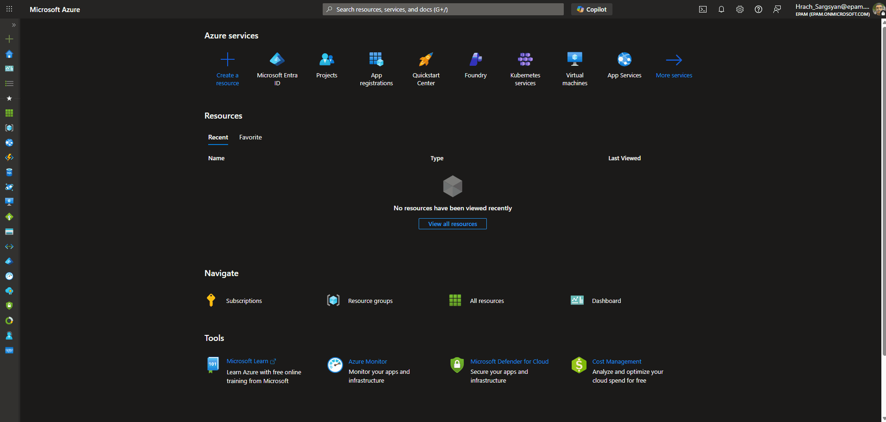

4.  **Configure App Registration Details:** On the "Register an application" page, provide the following information:
    *   **Name:** Enter a meaningful and descriptive name for your application registration, for example "ELITEA Teams Integration" or "ELITEA Agent Access to Teams".
    *   **Supported account types:** Select the appropriate account type based on your organization's requirements. In most cases, **"Accounts in this organizational directory only (\[Your Organization Name] only - Single tenant)"** is the recommended option for internal organizational use.
    *   **Redirect URI:** Since Teams only supports Delegated (User OAuth) access, a redirect URI must always be configured:
          1. In the **"Select a platform"** dropdown, select **"Web"**.
          2. In the URI field, enter the ELITEA callback URL for your instance. The correct value depends on your deployment — refer to the info callout below.
5.  **Register Application:** Click the **"Register"** button at the bottom of the page to create the app registration.

     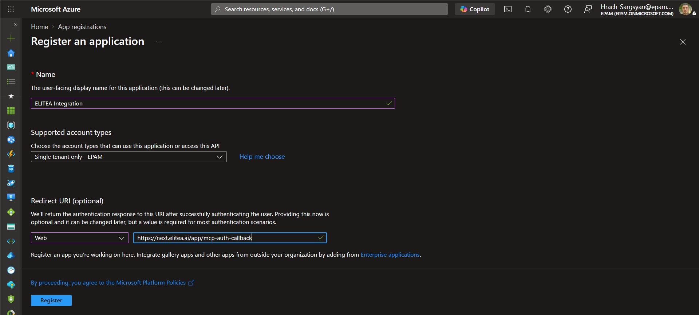

<Info>
**ELITEA OAuth Redirect URI**

The redirect URI to register in Azure AD depends on your ELITEA deployment:

| Deployment Type | Redirect URI |
|----------------|--------------|
| **ELITEA Cloud** | **Pattern:** `https://<your-elitea-instance-domain>/app/mcp-auth-callback` <br /> **Example:** `https://next.elitea.ai/app/mcp-auth-callback` |
| **Self-hosted / standard path** | `https://<your-domain>/mcp-auth-callback` |
| **Self-hosted / sub-path (e.g., `/app`)** | `https://<your-domain>/app/mcp-auth-callback` |
</Info>

<Info>
**URL is not shown in the UI**

ELITEA does not display the redirect URI anywhere in its interface. The URL is automatically derived from the domain your ELITEA instance is deployed on. If you are unsure which value applies, contact your ELITEA administrator.
</Info>

### Application Credentials

Once the app registration is created successfully, you will be redirected to the application's **Overview** page. Note down the following, as you will need them to configure the Teams credential in ELITEA:

*   **Application (client) ID** — Copy and store this value securely.
*   **Directory (tenant) ID** — Copy and store this value securely.

     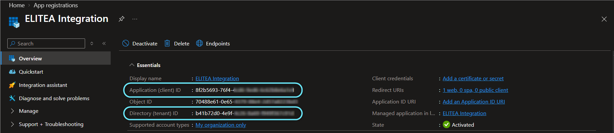

### Configure API Permissions for the Registered App

To allow ELITEA to act on a signed-in user's teams, channels and chats, configure **delegated** Microsoft Graph permissions for your registered application.

1.  **Navigate to API Permissions:** In your registered app within the Azure portal, navigate to the left-hand menu and click **"API permissions"**.
2.  **Add Permissions:** On the "API permissions" page, click **"+ Add a permission"**.

     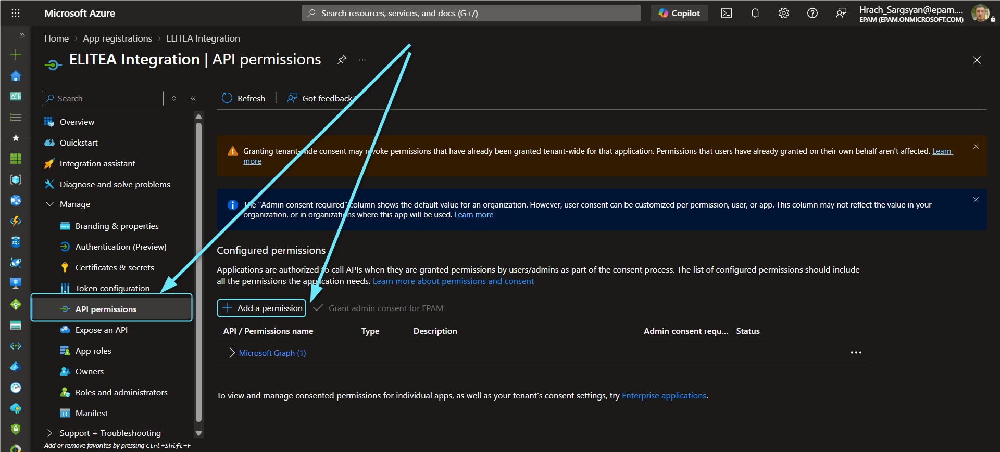

3.  **Select API Type - Microsoft Graph:** In the "Request API permissions" panel, select the **"Microsoft Graph"** API tile.

     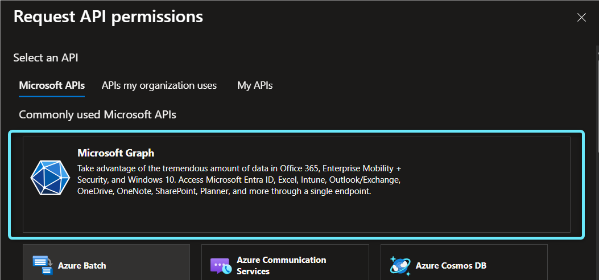

4.  **Select Permission Type - Delegated permissions:** Choose **"Delegated permissions"** — the Teams toolkit always acts on behalf of the signed-in user, never as the application itself.

     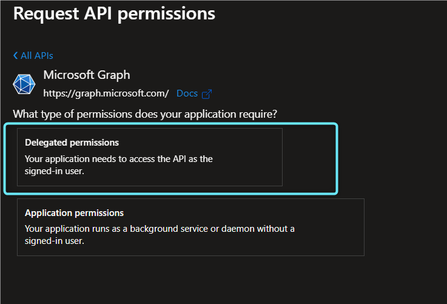

5.  **Add Microsoft Graph Teams Scopes:** Search for and select the scopes your Agents require, for example:

    | **Scope** | **Description** | **When to Grant** |
    |-----------|-----------------|-------------------|
    | `User.Read` / `User.ReadBasic.All` | Resolve people (recipients, mentions, senders) by email | Needed by every tool that accepts an email address (`find_chat_messages`, `send_chat_message`, `send_channel_message`, `search_teams_messages`) |
    | `Team.ReadBasic.All` | List the teams the signed-in user is a member of | Needed for `list_teams` |
    | `Channel.ReadBasic.All` | List the channels of a team | Needed for `list_channels` |
    | `Chat.Read` (or `Chat.ReadWrite`) | Read chats and chat messages | Needed for `list_chats`, `find_chat_messages`, `search_teams_messages` |
    | `Chat.Create` | Create a new 1:1 or group chat when one doesn't already exist | Needed for `send_chat_message` when messaging people instead of an existing chat |
    | `ChatMessage.Send` | Send a chat message | Needed for `send_chat_message` |
    | `ChannelMessage.Send` | Post or reply in a channel | Needed for `send_channel_message` |

    <Tip>
    The exact scope names are entered into the **Scopes** field of the ELITEA credential — see [Step 1](#step-1-create-teams-credentials) below. Grant only the scopes needed for the tools you plan to enable.
    </Tip>

    <Info>
    **Reading channel messages is not supported**

    There is intentionally no scope listed above for reading channel messages. That capability requires `ChannelMessage.Read.All`, an **application permission** that needs tenant admin consent, and is out of scope for this toolkit.
    </Info>

6.  **Add Permissions:** Click **"Add permissions"** at the bottom of the panel to add the selected scopes to your application registration.

     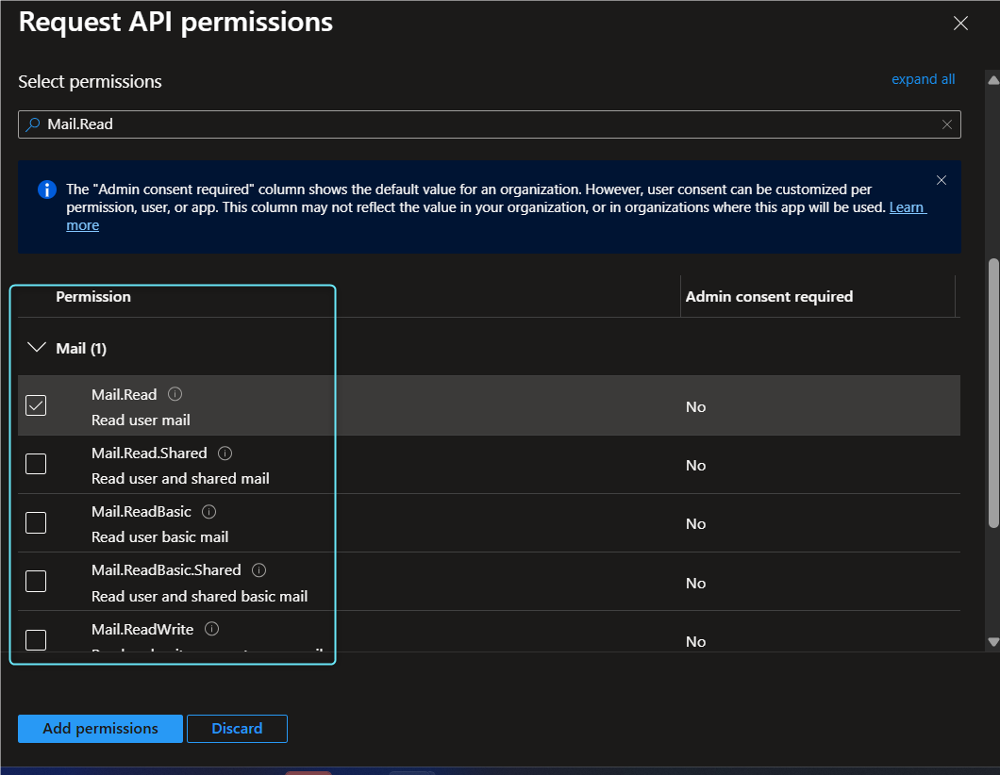

7.  **Grant Admin Consent (if required by your tenant):** On the "API permissions" page, click **"Grant admin consent for \[Your Organization Name]"** and then **"Yes"** if your organization requires admin consent for delegated permissions before users can authorize the app.

### Configure the Client Secret

To securely authenticate your ELITEA Teams credential, create a Client Secret for your registered application.

1.  **Navigate to Certificates & secrets:** In your registered app within the Azure portal, click **"Certificates & secrets"**.
2.  **Create New Client Secret:** On the "Certificates & secrets" page, select the **"Client secrets"** tab and click **"+ New client secret"**.

     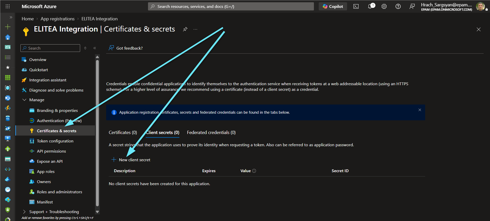

3.  **Configure Client Secret Details:** In the "Add a client secret" panel, enter a **Description** and choose an appropriate **Expiration** period.

     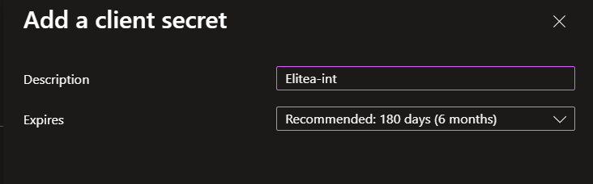

4.  **Add Client Secret:** Click **"Add"** to create the client secret.
5.  **Securely Copy and Store the Client Secret Value:** **Immediately copy the generated Client Secret Value** displayed in the **"Value"** column. **This is the only time you will see the full value.** Store it securely, preferably in ELITEA's **[Secrets](../../menus/settings/secrets)** feature.

     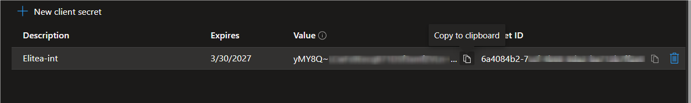

<Warning title="Important">
Copy the **"Value"** column — not the **"Secret ID"** column. The Value is the actual credential used for authentication.
</Warning>

---

## System Integration with ELITEA

To integrate Teams with ELITEA, you need to follow a three-step process: **Create Credentials → Create Toolkit → Use in Agents**. This workflow ensures secure authentication and proper configuration.

### Step 1: Create Teams Credentials

Before creating a toolkit, you must first create Teams credentials in ELITEA. The Teams credential supports a single authentication mode — **Delegated (User OAuth)**.

1. **Navigate to Credentials Menu:** Open the sidebar and select **[Credentials](../../menus/credentials)**.
2. **Create New Credential:** Click the **`+ Credential`** button.
3. **Select Teams:** Choose **Teams** as the credential type.

     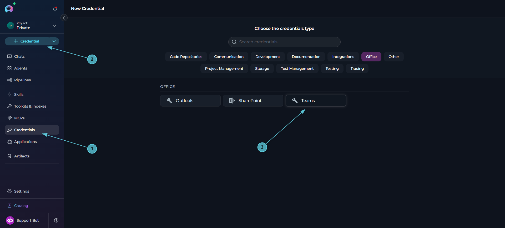

4. **Configure Credential Details:**

   | Field | Required | Description |
   |-------|----------|-------------|
   | **Display Name** | Required | Descriptive name for this credential (e.g., *"Teams - Support Account"*) |
   | **ID** | Required | Unique identifier for the credential. Auto-populated from the Display Name |
   | **Client ID** | Required | Azure AD Application (client) ID from your app registration |
   | **Client Secret** | Required | Azure AD Client Secret value generated in your app registration |
   | **Auto Refresh Token** | Optional (default: enabled) | Automatically refresh the access token using the `offline_access` scope |
   | **OAuth Discovery Endpoint** | Optional | OAuth discovery endpoint, in the format `https://login.microsoftonline.com/{tenant_id}`, where `{tenant_id}` is the **Directory (tenant) ID** from your app registration |
   | **Scopes** | Optional | OAuth scopes to request (e.g., `User.Read`, `Chat.Read`, `ChatMessage.Send`, `Chat.Create`, `Team.ReadBasic.All`, `Channel.ReadBasic.All`, `ChannelMessage.Send`) |

5. **Log in:** Once the **OAuth Discovery Endpoint** field is filled in, a **Login** button appears next to the **Test Connection** button. Click **Login** to initiate the OAuth authorization flow — ELITEA calls the Teams check-connection endpoint, which redirects to Azure AD for user sign-in. After you authorize the application, the token is stored and the connection is verified against Microsoft Graph.
      * **Test Connection:** Click **Test Connection** to verify that your credentials are valid and ELITEA can successfully connect to Microsoft Teams. This performs a health check against `GET /me/joinedTeams` on Microsoft Graph.
7. **Save Credential:** Click **Save** to create the credential. It will be added to the credentials dashboard and available to use in toolkit configurations.

     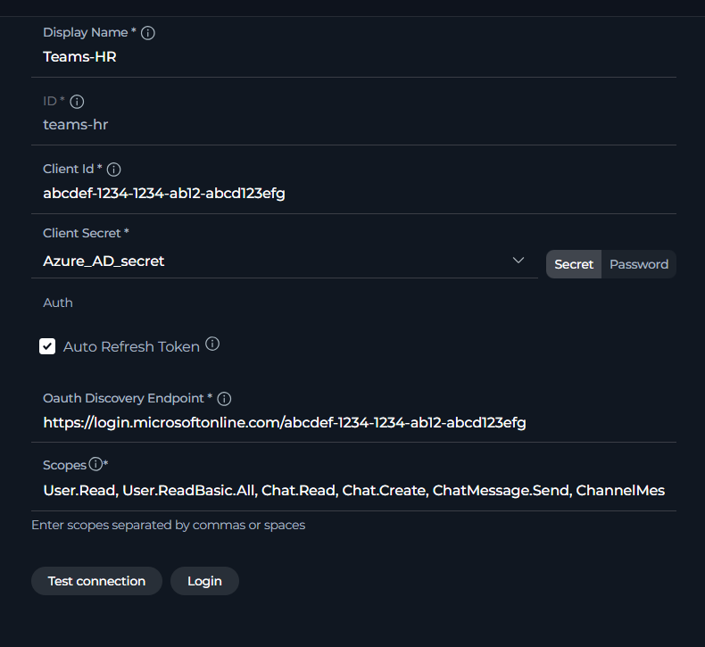

<Tip title="Security Recommendation">
It's highly recommended to use **[Secrets](../../menus/settings/secrets)** for the Client Secret instead of entering it directly. Create a secret first, then reference it in your credential configuration.
</Tip>

<Warning title="Re-login required after scope changes">
If you add, remove, or modify the **Scopes** field after the initial login, the existing token will not automatically include the new scopes. Click **Login** again to complete a new OAuth authorization flow and obtain a fresh token that reflects the updated scope list.
</Warning>

### Step 2: Create Teams Toolkit

Once your credentials are configured, create the Teams toolkit:

1. **Navigate to Toolkits Menu:** Open the sidebar and select **[Toolkits & Indexes](../../menus/toolkits)**.
2. **Create New Toolkit:** Click the **`+ Toolkit`** button.
3. **Select Teams:** Choose **Teams** from the list of available toolkit types.

     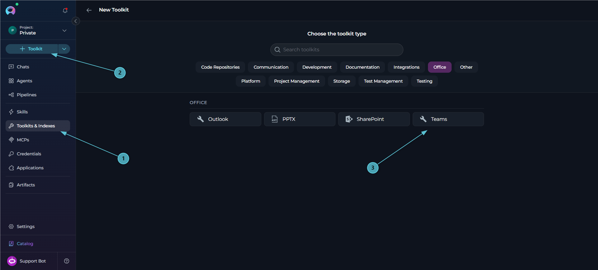

4. **Configure Toolkit Details:**

   | Field | Required | Description |
   |-------|----------|-------------|
   | **Toolkit Name** | Required | Descriptive name for the toolkit (e.g., *"Teams - Support Account"*) |
   | **Description** | Optional | Brief description of the toolkit's purpose |
   | **Credential** | Required | Select the Teams credential created in Step 1 |

5. **Enable Desired Tools:** In the **"Tools"** section, select the checkboxes next to the specific Teams tools you want to enable. **Enable only the tools your agents will actually use** to follow the principle of least privilege.
       * **Enable MCP access for selected tools** — (optional) exposes the tools selected in this toolkit through the platform MCP server, so external MCP clients can call them.
6. **Save Toolkit:** Click **Save** to create the toolkit.

     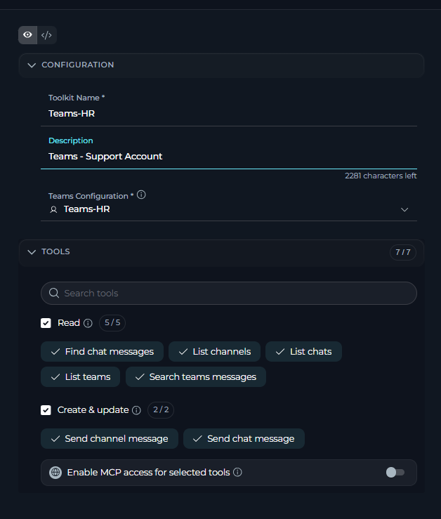

#### Available Tools:

The Teams toolkit provides 7 tools for discovering teams, channels and chats, reading and searching messages, and sending chat or channel messages. In the toolkit configuration form, tools are grouped by the effect they have on your Teams account:

| **Category** | **Tool Name** | **Description** |
|---|---|---|
| **Read** | **Find chat messages** | Read messages of one Teams chat (by chat ID, group chat topic, or a person's email for the 1:1 chat), optionally only from given people or containing text. Returns messages oldest first with `is_new` and `matched_by`, plus a watermark / `latest_message_id` to pass as `since` / `after_message_id` next time |
| | **List channels** | List the channels of a team (id, displayName, membershipType). Returns 50 by default; use `name_contains` and `limit` to narrow |
| | **List chats** | List the signed-in user's Teams chats (1:1, group and meeting chats), most recently active first, with member count, a short members list, last message preview and unread status. Filter by type, topic or member |
| | **List teams** | List Microsoft Teams teams the signed-in user is a member of (id, displayName) |
| | **Search teams messages** | Search Teams messages across all of the signed-in user's chats and channels using KQL, optionally only from given people and after a date. Returns `chatId` (read with Find chat messages) or `teamId` / `channelId` per hit |
| **Create & update** | **Send channel message** | Post a message to a Teams channel, or reply to a post with `reply_to_message_id`. Returns `message_id` and `thread_id`. Write `@[email]` inside `message` to place a real @mention where it should appear; `mentions` tags people at the start instead |
| | **Send chat message** | Send a Teams chat message to an existing chat, or to people by email: one person uses the 1:1 chat, several people use the group chat with exactly those members (created if needed). Returns `message_id` and `chat_id`. Same `@[email]` inline-mention syntax as **Send channel message** |

<Tip title="Tool Groups">
In the **Tools** section of the toolkit form, each group (**Read**, **Create & update**) has its own select-all checkbox and a count badge, and the search box filters across both groups at once. **Read** tools only retrieve data; **Create & update** tools send messages. The Teams toolkit defines no **Delete** or **Execute** tools.
</Tip>

<Note>
**Channel messages can be sent and replied to, but not read**

**Send channel message** can post to and reply within a channel, but there is no tool to read existing channel messages — only **Search teams messages** can surface a channel message, as a search hit. This mirrors the Microsoft Graph permission model: reading channel content directly requires an admin-consented application permission that this toolkit does not request.
</Note>

<Tip title="Mentions and Importance">
**Mentioning people:** write `@[email]` directly inside `message` to place a real, notifying @mention exactly where it should appear — e.g. `message="Thanks @[anna@contoso.com], please review by 3pm"` posts "Thanks **@Anna Kowalski**, please review by 3pm". A plain `@name` (no brackets) is just text and notifies no one. People listed in `mentions` but not placed inline are tagged at the start of the message instead; nobody is tagged twice if they appear both inline and in `mentions`. For **Send chat message**, `recipients` only chooses which chat the message goes to — it does not @mention anyone by itself.

**Message importance:** the optional `importance` parameter (`normal` / `high` / `urgent`) controls the priority label. `high` adds a red "Important" label. `urgent` additionally re-notifies each chat recipient every 2 minutes for 20 minutes (a chat-specific behavior; channel posts may not re-notify the same way). Use `high`/`urgent` only when the content is genuinely time-critical.
</Tip>

<Tip title="KQL Search Syntax">
**Search teams messages** uses Microsoft's KQL (Keyword Query Language), e.g. `release AND deploy`, `IsMentioned:true`, `hasAttachment:true`. KQL date granularity (`since`) is a day; results are additionally filtered to the exact time you passed.
</Tip>

#### Testing Toolkit Tools

After configuring your Teams toolkit, you can test individual tools directly from the Toolkit detailed page using the **Test Settings** panel. This allows you to verify that your credentials are working correctly and validate tool functionality before adding the toolkit to your workflows.

**General Testing Steps:**

1. **Select LLM Model:** Choose a Large Language Model from the model dropdown in the Test Settings panel
2. **Configure Model Settings:** Adjust model parameters like Creativity, Max Completion Tokens, and other settings as needed
3. **Select a Tool:** Choose the specific Teams tool you want to test from the available tools
4. **Provide Input:** Enter any required parameters or test queries for the selected tool
5. **Run the Test:** Execute the tool and wait for the response
6. **Review the Response:** Analyze the output to verify the tool is working correctly and returning expected results

<Tip title="Key benefits of testing toolkit tools:">
* Verify that Teams credentials and connection are configured correctly
* Test tool parameters and see actual responses from your teams, channels and chats
* Debug tool behavior and understand output formats
* Optimize tool settings before integrating with agents or pipelines
> For detailed instructions on how to use the Test Settings panel, see **[How to Test Toolkit Tools](../../how-tos/credentials-toolkits/how-to-test-toolkit-tools)**.
</Tip>

---

### Step 3: Add Teams Toolkit to Your Workflows

Now you can add the configured Teams toolkit to your agents, pipelines, or use it directly in chat:

---
#### In Agents:

1. **Navigate to Agents:** Open the sidebar and select **[Agents](../../menus/agents)**.
2. **Create or Edit Agent:** Either create a new agent or select an existing agent to edit.
3. **Add Teams Toolkit:**
     * In the **"TOOLS"** section of the agent configuration, click the **"+Toolkit"** icon
     * Select your configured Teams toolkit from the dropdown list
     * The toolkit will be added to your agent with the previously configured tools enabled

     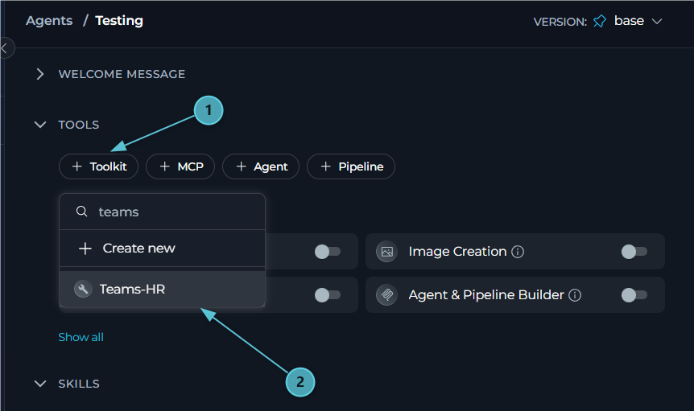

Your agent can now interact with the connected Teams account using the configured toolkit.

---
#### In Pipelines:

1. **Navigate to Pipelines:** Open the sidebar and select **[Pipelines](../../menus/pipelines)**.
2. **Create or Edit Pipeline:** Either create a new pipeline or select an existing pipeline to edit.
3. **Add Teams Toolkit:**
     * In the **"TOOLS"** section of the pipeline configuration, click the **"+Toolkit"** icon
     * Select your configured Teams toolkit from the dropdown list
     * The toolkit will be added to your pipeline with the previously configured tools enabled

     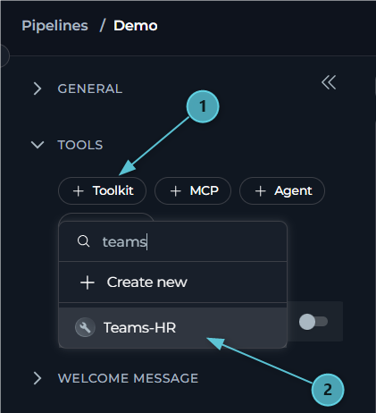

---
#### In Chat:

1. **Navigate to Chat:** Open the sidebar and select **[Chat](../../menus/chat)**.
2. **Start New Conversation:** Click **+ Conversation** or open an existing conversation.
3. **Add Teams Toolkit to Conversation:**
   - Click the **`+`** icon in the chat input toolbar (tooltip: *Add files, agents, toolkits and more…*)
   - Hover over **Toolkits** in the popup menu
   - Search for your Teams toolkit by name
   - Enable the toolkit to add it to your conversation
4. **Verify Toolkit Added:** The Teams toolkit appears in the **PARTICIPANTS** panel on the right side under the **Toolkits** section.
5. **Use Toolkit in Chat:** You can now directly interact with your teams, channels and chats by asking questions or requesting actions that will trigger the Teams toolkit tools.

     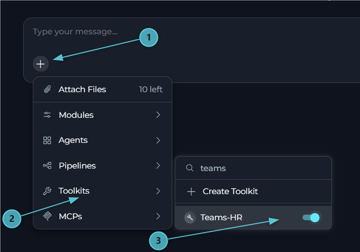

<Tip>
You can also add the toolkit by typing **`#`** in the chat input box and searching for your Teams toolkit.
</Tip>

<Info title="Authorizing the toolkit from Chat">
If no valid OAuth token is available when a Teams tool is called, ELITEA raises an authorization request for the toolkit. When this happens:

- A prompt appears asking: *"Authorization is required for toolkit "\<toolkit name>". Authorize now or skip it for this run?"*
- Selecting **Authorize** opens an OAuth dialog (titled **"Configuration OAuth"**) with **Cancel** and **Authorize** buttons.
- Completing the sign-in shows a **"Successful authentication!"** confirmation and the message **"✓ Authorization successful! Your credentials and session have been saved. Please send your message again to use the authorized MCP server."**
- Send your message again to continue with the now-authorized toolkit.
</Info>

<Info title="Example Chat Usage:">
- "List the teams I'm a member of."
- "Show me my most recent chats with unread messages."
- "Send a message to john@example.com asking if the deployment is ready."
- "Post an update in the Engineering channel of the Platform team and mention Sarah."
- "Search my Teams messages for anything about the Q3 release."
</Info>

## Instructions and Prompts for Using the Teams Toolkit

To effectively instruct your ELITEA Agent to use the Teams toolkit, you need to provide clear and precise instructions within the Agent's "Instructions" field. These instructions are crucial for guiding the Agent on *when* and *how* to utilize the available Teams tools to achieve your desired automation goals.

### Instruction Creation for OpenAI Agents

When crafting instructions for the Teams toolkit, especially for OpenAI-based Agents, clarity and precision are paramount. Break down complex tasks into a sequence of simple, actionable steps. Explicitly define all parameters required for each tool and guide the Agent on how to obtain or determine the values for these parameters. OpenAI Agents respond best to instructions that are:

*   **Direct and Action-Oriented:** Employ strong action verbs and clear commands to initiate actions. For example, "Use the 'list_chats' tool...", "Send a message to...", "Post an update in the channel...".

*   **Parameter-Centric:** Clearly enumerate each parameter required by the tool. For each parameter, specify:
    *   Its name (exactly as expected by the tool)
    *   The format or type of value expected
    *   How the Agent should obtain the value – whether from user input, derived from previous steps in the conversation, retrieved from an external source, or a predefined static value

*   **Contextually Rich:** Provide sufficient context so the Agent understands the overarching objective and the specific scenario in which each Teams tool should be applied within the broader workflow. Explain the desired outcome or goal for each tool invocation.

*   **Step-by-Step Structure:** Organize instructions into a numbered or bulleted list of steps for complex workflows. This helps the Agent follow a logical sequence of actions.

*   **Add Conversation Starters:** Include example conversation starters that users can use to trigger this functionality. For example, "Conversation Starters: 'Show me my recent Teams chats', 'Message the on-call engineer about the outage', 'Post the release notes in the Engineering channel'"

When instructing your Agent to use a Teams toolkit tool, adhere to this structured pattern:

1. **State the Goal:** Begin by clearly stating the objective you want to achieve with this step. For example, "Goal: To notify the project team of a status update in their group chat."

2. **Specify the Tool:** Clearly indicate the specific Teams tool to be used for this step. For example, "Tool: Use the 'send_chat_message' tool."

3. **Define Parameters:** Provide a detailed list of all parameters required by the selected tool. For each parameter:
   - **Parameter Name:** `<Parameter Name as defined in tool documentation>`
   - **Value or Source:** `<Specify the value or how to obtain the value. Examples: "user input", "from previous step", "hardcoded value 'General'", "value of variable X">`

4. **Describe Expected Outcome (Optional but Recommended):** Briefly describe the expected result or outcome after the tool is successfully executed. For example, "Outcome: The Agent will confirm the message was sent and report the message_id and chat_id."

5. **Add Conversation Starters:** Include example conversation starters that users can use to trigger this functionality.

<Info title="Example Agent Instructions">
**Chat and Channel Collaboration Pattern:**

```markdown
You are a Teams collaboration assistant. Help the user keep track of chats and post updates on their behalf.

## Checking Recent Chats
- **Tool**: list_chats
- **Parameters**:
    - unread_only: true if the user only wants chats with unread messages
    - chat_type: "oneOnOne", "group" or "meeting" if the user specifies a type
    - limit: 50 (default, unless the user asks for more/fewer)
- **Process**:
    1. Call the tool and summarize each chat's topic/members, last message preview, and unread status
    2. Offer to open any chat in full with find_chat_messages

## Reading a Specific Chat
- **Tool**: find_chat_messages
- **Parameters**:
    - chat: chat ID, group chat topic, or the other person's email (for a 1:1 chat)
    - since / after_message_id: the watermark returned by the previous call, if any (omit on the first call)
    - senders: (optional) only messages from specific people
- **Process**:
    1. Report has_new / new_count and the messages, oldest first
    2. Store the returned watermark / latest_message_id for the next check

## Messaging People or a Chat
- **Tool**: send_chat_message
- **Parameters**:
    - chat or recipients: existing chat ID/topic, or the email(s) of the people to message
    - message: the text to send (confirm with the user before sending); write @[email] inside it to place an inline @mention where it belongs, e.g. "Thanks @[anna@contoso.com], please review"
    - mentions: (optional) people to @mention at the start of the message, for anyone not already placed inline
    - importance: (optional) 'high' or 'urgent' only when the user asks for it or the message is time-critical
- **Process**:
    1. Confirm the drafted message with the user before sending
    2. Send and report back the new message_id and chat_id (and whether a new chat was created)

## Posting to a Channel
- **Tool**: send_channel_message
- **Parameters**:
    - team: team ID or display name (from list_teams)
    - channel: channel ID or display name (from list_channels)
    - message: the text to post; same @[email] inline-mention syntax as send_chat_message
    - reply_to_message_id: (optional) set only when replying to an existing post
    - mentions: (optional) people to @mention at the start, for anyone not already placed inline
    - importance: (optional) 'high' only when the content is genuinely important
- **Process**:
    1. Confirm the drafted post with the user before sending
    2. Send and report back the new message_id and thread_id

## Conversation Starters
- "Do I have any unread Teams chats?"
- "Message Sarah to ask if the report is ready"
- "Post the sprint summary in the Engineering channel of the Platform team"
- "Search my Teams messages for anything about the outage"
```
</Info>

### Chat Usage Examples by Tool Category

The following examples demonstrate how to interact with the Teams toolkit in ELITEA Chat, grouped by functional area. Each example shows the user request and the expected agent behavior.

<Accordion title="Discovery - List Teams and Channels">
**Chat Example:**
```
User: "What teams am I a member of, and what channels does the Platform team have?"

Agent Response: [Agent uses list_teams tool, then list_channels tool with team="Platform"]

👥 **Your Teams (3)**:
1. **Platform**
2. **Marketing**
3. **Customer Success**

📁 **Channels in "Platform" (4)**:
1. **General**
2. **Engineering**
3. **Incidents**
4. **Releases**
```
</Accordion>

<Accordion title="Discovery - List Chats">
**Chat Example:**
```
User: "Show me my chats with unread messages."

Agent Response: [Agent uses list_chats tool with unread_only=true]

💬 **Unread Chats (2)**:

1. **Sarah Connor** (1:1) — last message: "Can you review the PR?" — 10 min ago
2. **"Release Planning"** (group, 5 members) — last message: "Pushed the new build" — 1 hour ago
```
</Accordion>

<Accordion title="Reading & Searching - Find Chat Messages">
**Chat Example:**
```
User: "What did Sarah say in our chat since yesterday?"

Agent Response: [Agent uses find_chat_messages tool with chat="sarah@partner.com", since=<yesterday's timestamp>]

🧵 **Chat with Sarah Connor (2 new messages)**:

1. Sarah: "Can you review the PR when you get a chance?" (2026-10-01 15:02)
2. Sarah: "No rush, early next week is fine." (2026-10-01 15:03)

I've updated the watermark so the next check only shows messages after these.
```
</Accordion>

<Accordion title="Reading & Searching - Search Teams Messages">
**Chat Example:**
```
User: "Search my Teams messages for anything about the outage."

Agent Response: [Agent uses search_teams_messages tool with query="outage"]

🔍 **Search Results for "outage" (3 matches)**:

1. Chat with On-Call Engineer — "Investigating the outage now" (2026-10-01)
2. Platform / Incidents channel — "Outage postmortem scheduled for Friday" (2026-09-30)
3. "Release Planning" group chat — "Rollback avoided the outage" (2026-09-29)

Would you like me to open the full thread for any of these? Channel hits can be read in full with search; chat hits can be opened with find_chat_messages.
```
</Accordion>

<Accordion title="Sending - Send Chat Message">
**Chat Example:**
```
User: "Message john@example.com and ask if the deployment is ready."

Agent Response: [Agent uses send_chat_message tool with recipients=["john@example.com"]]

✅ **Message Sent!**

- **To**: john@example.com
- **Message**: "Is the deployment ready?"
- **Message ID**: 1696262400000
- **Chat ID**: 19:abcdef...@unq.gbl.spaces
- **Chat Created**: false (existing 1:1 chat was used)
```
</Accordion>

<Accordion title="Sending - Send Channel Message">
**Chat Example:**
```
User: "Post the sprint summary in the Engineering channel of the Platform team, and mention Sarah."

Agent Response: [Agent uses send_channel_message tool with team="Platform", channel="Engineering", message="Sprint summary attached.", mentions=["sarah@partner.com"]]

✅ **Posted to Channel!**

- **Team**: Platform
- **Channel**: Engineering
- **Posted**: "@Sarah Connor Sprint summary attached."
- **Message ID**: 1696262400000
- **Thread ID**: 1696262400000
```
</Accordion>

<Accordion title="Sending - Inline Mention and Importance">
**Chat Example:**
```
User: "Tell Anna in our chat that the build is green and mark it urgent."

Agent Response: [Agent uses send_chat_message tool with chat="anna@contoso.com", message="Thanks @[anna@contoso.com], the build is green.", importance="urgent"]

✅ **Message Sent!**

- **Posted**: "Thanks @Anna Kowalski, the build is green."
- **Importance**: urgent (Anna will be re-notified every 2 minutes for 20 minutes)
- **Message ID**: 1696262400001
- **Chat ID**: 19:abcdef...@unq.gbl.spaces
```
</Accordion>

---

## <Icon icon="triangle-exclamation" size={24} /> Troubleshooting

<Accordion title="Credential Not Appearing in Toolkit Configuration">
**Problem:** When creating a toolkit, your Teams credential doesn't appear in the credentials dropdown.

**Troubleshooting Steps:**

1. **Check Credential Scope:** Ensure you're working in the same workspace/project where the credential was created. Private credentials are only visible in your Private workspace, while project credentials are visible within the specific team project.
2. **Verify Credential Creation:** Go to the Credentials menu and confirm that your Teams credential was successfully saved.
3. **Credential Type Match:** Ensure you selected **"Teams"** as the credential type when creating the credential.
</Accordion>

<Accordion title="OAuth Login Fails with 'No Reply Address Is Registered' Error">
**Problem:** When clicking **Login** during credential setup, the OAuth flow fails with an error such as:
> *AADSTS500113: No reply address is registered for the application.*

**Cause:** This error occurs when no Redirect URI has been registered in your Azure AD App Registration. Azure AD requires the redirect URI to be explicitly registered before it will send the authorization response back to ELITEA.

**Troubleshooting Steps:**

1. **Open your App Registration:** In the [Azure Portal](https://portal.azure.com), go to **Microsoft Entra ID → App registrations** and select your app.
2. **Navigate to Authentication:** In the left menu, click **"Authentication"**.
3. **Add a Redirect URI:** If no Web platform exists, click **"+ Add a platform"** → **"Web"**. If Web is already listed, click the **Edit** pencil next to it.
4. **Enter the ELITEA callback URL:** In the **"Redirect URIs"** field, enter the value matching your deployment (see the [redirect URI table](#registering-an-app-in-azure-active-directory-azure-ad) above).
5. **Save:** Click **"Configure"** (or **"Save"** if editing), then click **"Save"** at the top of the page.
6. **Retry:** Return to your ELITEA Teams credential and click **Login** again.
</Accordion>

<Accordion title="Connection Test Fails or Tools Return Re-authorization Errors">
**Problem:** **Test Connection** fails, or Teams tools stop working after previously working.

**Cause:** The Teams toolkit performs its connection health check by calling `GET /me/joinedTeams` on Microsoft Graph. A `401` response from this call means the access token is missing, expired, or invalid — ELITEA will raise a fresh authorization request rather than a plain error, prompting you to log in again.

**Troubleshooting Steps:**

1. **Re-authenticate:** In the credential form, click **Logout** then **Login** again to obtain a fresh token.
2. **Check Auto Refresh Token:** Ensure **Auto Refresh Token** is enabled so the toolkit can silently refresh the token using the `offline_access` scope instead of requiring a manual re-login for every expiry.
3. **Verify Client Secret Validity:** Confirm the Client Secret in Azure AD has not expired. If it has, generate a new one and update your ELITEA credential.
</Accordion>

<Accordion title="'Access Forbidden' Errors">
**Problem:** The connection test reports: *"Access forbidden - token lacks required Microsoft Graph Teams permissions (Team.ReadBasic.All)"*, or a tool call fails with an HTTP 403.

**Cause:** This is a `403` response from Microsoft Graph — the token was issued successfully, but it does not carry the delegated scope(s) required for the operation.

**Troubleshooting Steps:**

1. **Review Granted Scopes:** In Azure AD, go to **API permissions** on your app registration and confirm the required scopes (`Team.ReadBasic.All`, `Channel.ReadBasic.All`, `Chat.Read`, `ChatMessage.Send`, `Chat.Create`, `ChannelMessage.Send`, etc.) are listed as **Delegated permissions**.
2. **Grant Admin Consent (if required):** If your tenant requires admin consent for delegated permissions, ensure it has been granted.
3. **Update the Scopes Field and Re-login:** Update the **Scopes** field in your ELITEA credential to include the missing scope(s), then click **Logout** and **Login** again — an existing token does not automatically pick up newly added scopes.
</Accordion>

<Accordion title="A Team, Channel or Chat 'Not Found' Error">
**Problem:** A tool call fails with an error such as *"Team 'Platform' not found."* or *"Chat 'Release Planning' not found."*, sometimes with a "Did you mean...?" suggestion.

**Cause:** Team, channel and chat names must match **exactly** (case-insensitive) when passed as a display name rather than an ID. The signed-in user must also actually be a member of that team/channel/chat for Graph to return it.

**Troubleshooting Steps:**

1. **Use the Exact Name:** Check the exact spelling via `list_teams` / `list_channels` / `list_chats`, and use that exact name, or pass the ID instead.
2. **Confirm Membership:** Confirm the signed-in user (the one who completed the OAuth login) is actually a member of that team, channel, or chat.
3. **For 1:1 Chats:** Pass the other person's email directly as the `chat` parameter rather than a topic — 1:1 chats generally don't have a topic set.
</Accordion>

<Accordion title="Toolkit Configuration Issues">
**Problem:** The toolkit fails to load or shows configuration errors after creation.

**Troubleshooting Steps:**

1. **Credential Selection:** Ensure you have selected the correct Teams credential from the dropdown in the toolkit configuration.
2. **Re-check Required Credential Fields:** Confirm **Client ID** and **Client Secret** are both set on the linked credential — these are required regardless of whether OAuth login has been completed.
</Accordion>

### <Icon icon="envelope" size={24} /> Support Contact

If you encounter issues not covered here or need additional assistance with Teams integration, please refer to **[Contact Support](../../support/contact-support)** for detailed information on how to reach the ELITEA Support Team.

---

## <Icon icon="circle-question" size={24} /> FAQ

<Accordion title="Does the Teams toolkit support App-Only (application-only) authentication?">
**No.** The Teams toolkit's credential schema only defines a single authentication mode — **Delegated (User OAuth)**. There is no App-Only / client-credentials equivalent, unlike the SharePoint toolkit. Every Teams credential must be authorized by a signed-in user via the **Login** button on the credential form.
</Accordion>

<Accordion title="Can the Teams toolkit read channel messages?">
**No, by design.** Reading channel messages via Microsoft Graph requires the `ChannelMessage.Read.All` **application** permission, which needs tenant admin consent and is intentionally out of scope for this toolkit. The toolkit can still **post** to a channel or **reply** to a channel post (`send_channel_message`), and channel content can surface indirectly as a search hit via `search_teams_messages` — but there is no tool dedicated to reading a channel's message history.
</Accordion>

<Accordion title="Can the Teams toolkit edit or delete messages that were already sent?">
**No.** The toolkit only exposes tools to send new chat messages, send/reply to channel posts, and read/search existing messages. There is no edit or delete capability for previously sent messages.
</Accordion>

<Accordion title="What are the required credential fields for the Teams toolkit?">
**Always required:**

* **Client ID** — Azure AD Application (client) ID.
* **Client Secret** — Azure AD Client Secret value.

**Required to complete the OAuth login (and therefore to actually call any tool):**

* **OAuth Discovery Endpoint** — `https://login.microsoftonline.com/{tenant_id}`.
* **Scopes** — the Microsoft Graph scopes your Agents need (e.g., `Chat.Read`, `ChatMessage.Send`, `Chat.Create`).

**Optional:**

* **Auto Refresh Token** — enabled by default; automatically refreshes the token using `offline_access`.
</Accordion>

<Accordion title="Is the offline_access scope something I need to add myself?">
**No.** When ELITEA builds the OAuth authorization request, it automatically inserts the `offline_access` scope alongside whatever you list in the **Scopes** field, so refresh tokens are issued without any extra configuration on your part.
</Accordion>

<Accordion title="Do I need to register a Redirect URI for the Teams credential?">
**Yes, always.** Since the Teams toolkit only supports Delegated (User OAuth) access, a redirect URI must be registered in your Azure AD App Registration under **Authentication → Redirect URIs**. Without it, Azure AD will reject the authorization request with `AADSTS500113: No reply address is registered`.
</Accordion>

<Accordion title="How do I find my Directory (Tenant) ID?">
The **Directory (tenant) ID** is needed for the **OAuth Discovery Endpoint** field. You can find it in two places:

**Option 1 — Microsoft Entra ID Overview:**
1. In the **[Azure Portal](https://portal.azure.com)**, search for **"Microsoft Entra ID"** and select it.
2. On the **Overview** page, copy the **"Tenant ID"** value.

**Option 2 — App Registration Overview:**
1. In the Azure Portal, go to **Microsoft Entra ID → App registrations** and select your app.
2. On the **Overview** page, copy the **"Directory (tenant) ID"** value.

Use the Tenant ID in the **OAuth Discovery Endpoint** field as:
```
https://login.microsoftonline.com/{tenant_id}
```
</Accordion>

<Accordion title="Can I use the same Teams credential across multiple toolkits and agents?">
Yes! Once you create a Teams credential, you can reuse it across multiple Teams toolkits, and each toolkit can be used by multiple agents, pipelines, and chat sessions. This promotes better credential management and reduces duplication.
</Accordion>

<Accordion title="How do I send a message to multiple people, or start a group chat?">
Use **send_chat_message** with the `recipients` parameter set to a list of email addresses instead of `chat`. If you provide exactly one recipient, ELITEA uses (or creates) your 1:1 chat with that person. If you provide more than one, ELITEA finds an existing group chat with exactly those members, or creates a new one — set `topic` to name the new group chat. Note that `recipients` only chooses which chat the message goes to; it does not @mention anyone by itself.
</Accordion>

<Accordion title="How do I @mention someone in the middle of a message instead of at the start?">
Write `@[email]` directly inside the `message` text of **send_chat_message** / **send_channel_message**, at the exact spot the mention should appear — e.g. `message="Thanks @[anna@contoso.com], please review by 3pm"` posts as "Thanks **@Anna Kowalski**, please review by 3pm". People you list in `mentions` but don't place inline are instead tagged at the start of the message. The same person is never tagged twice even if listed in both. A plain `@name` without brackets is just literal text — it does **not** notify anyone.
</Accordion>

<Accordion title="What does the importance parameter actually do?">
`importance` (on **send_chat_message** / **send_channel_message**) accepts `normal` (default), `high`, or `urgent`. `high` adds a red "Important" label to the message. `urgent` additionally re-notifies each chat recipient every 2 minutes for 20 minutes until they read it — this re-notification behavior is specific to chats; channel posts may not repeat the same way. Use `high`/`urgent` sparingly, only when the user asks for it or the content is genuinely time-critical.
</Accordion>

<Accordion title="How does the toolkit distinguish new messages from ones I've already seen?">
`find_chat_messages` returns a watermark value (`watermark` / `latest_message_id`). Pass that value back in on the next call as `since` or `after_message_id` to only surface messages created after the previous check. If neither is provided, "new" falls back to messages created after your last-read time in that chat (i.e., unread).
</Accordion>

<Accordion title="What are some best practices for using the Teams toolkit effectively?">
**Test Integration Thoroughly:**

- After setting up the Teams toolkit and incorporating it into your Agents, thoroughly test each tool you intend to use to ensure seamless connectivity, correct authentication, and accurate execution of chat and channel actions.

**Follow Security Best Practices:**

- Store the Client Secret using ELITEA's Secrets Management feature rather than entering it directly.
- Grant only the minimum necessary Microsoft Graph scopes (principle of least privilege).

**Use Watermarks for Recurring Checks:**

- When an Agent or pipeline checks a chat repeatedly (e.g., on a schedule), always persist and reuse the watermark returned by `find_chat_messages` so it doesn't re-report the same messages.

**Confirm Before Sending:**

- Have Agents draft the body of `send_chat_message` or `send_channel_message` and confirm it with the user before actually sending, especially for Delegated credentials acting under a real person's identity.

**Provide Clear Instructions:**

- Craft clear and unambiguous instructions within your ELITEA Agents to guide them in using the Teams toolkit effectively. Use the prompt examples provided in this documentation as a starting point.
</Accordion>


<Note title="Microsoft documentation">
- **[Azure Portal](https://portal.azure.com)** - *Manage your Azure AD App Registrations, API permissions, and Client Secrets.*
- **[Microsoft Graph Teams API Overview](https://learn.microsoft.com/en-us/graph/api/resources/teams-api-overview)** - *Official documentation for the Microsoft Graph Teams/chat API used by this toolkit.*
- **[Microsoft Graph Permissions Reference](https://learn.microsoft.com/en-us/graph/permissions-reference)** - *Detailed reference for Microsoft Graph API permission scopes, including Chat.Read, ChatMessage.Send, and Chat.Create.*
- **[KQL Query Syntax Reference](https://learn.microsoft.com/en-us/microsoft-365/enterprise/keyword-queries-and-search-conditions)** - *Reference for the Keyword Query Language (KQL) syntax used by the search_teams_messages tool.*
</Note>
