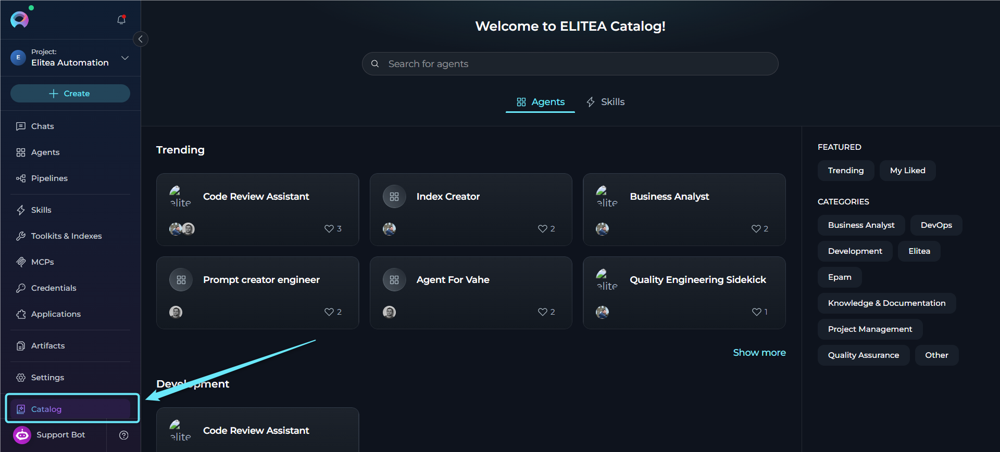
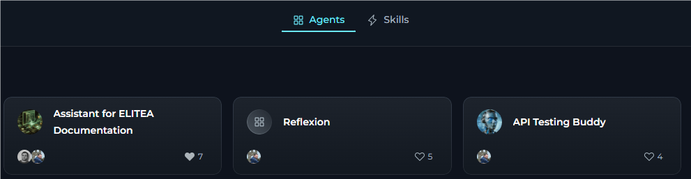
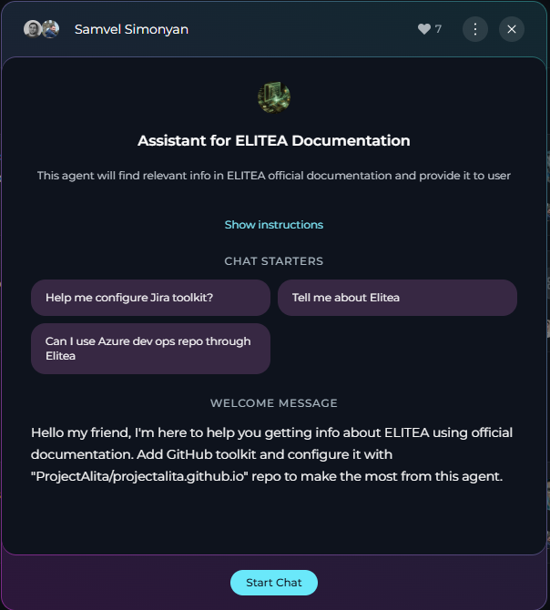
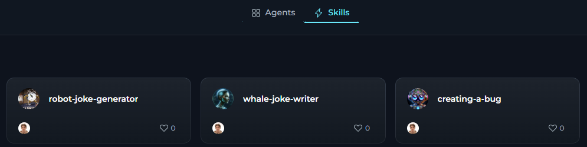
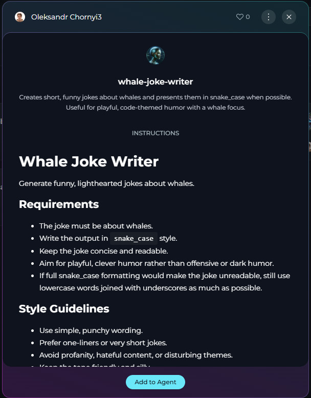
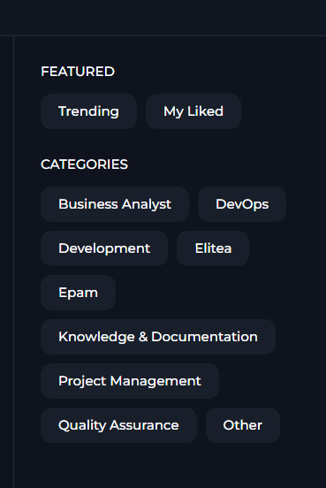

## Overview

Catalog is a shared library that includes published agents and skills from the ELITEA community. Agents are pre-configured AI assistants designed for specific tasks, while Skills are reusable instruction sets that can be attached to agents and reused across workflows.

<Note title="Important Note">
Catalog is available across all projects and provides a centralized view of all published agents and skills, regardless of which project you are currently viewing.
</Note>

<CardGroup cols={3}>
  <Card title="Instant access" icon="bolt">
    Browse and use community-published agents and skills without building everything from scratch.
  </Card>
  <Card title="Driven by community" icon="users">
    Leverage expertise from the ELITEA community — agents and skills are created and shared by real users.
  </Card>
  <Card title="Quality is assured" icon="shield-check">
    Published catalog items undergo moderation review before appearing in Catalog.
  </Card>
  <Card title="Quick discovery" icon="magnifying-glass">
    Find agents and skills through real-time search, category filters, and trending sections.
  </Card>
  <Card title="Seamless integration" icon="plug">
    Add agents directly to conversations and discover reusable skills from one shared catalog surface.
  </Card>
  <Card title="Workflow enhancement" icon="rocket">
    Integrate specialized agents into daily workflows for code review, documentation, testing, and more.
  </Card>
</CardGroup>

**Catalog vs. Agents**

The following table compares the Catalog and Agents menus.

| Feature | Catalog | Agents |
|---------|--------------|-------------|
| **Purpose** | Discover and use community agents and skills | Manage your personal agents |
| **Content** | Published agents and skills from all users | Only agents you have created |
| **Access level** | Read-only with temporary modifications | Full edit capabilities |

---

## Open ELITEA Catalog

Catalog is located in the ELITEA sidebar:

1. Open ELITEA and ensure you are logged in.
2. In the sidebar, locate *Catalog*.
3. Select *Catalog* to open it.

---

## Catalog Tabs

Catalog includes two tabs:

- **Agents** — community-published agents that you can inspect and start in chat.
- **Skills** — community-published reusable skills that can be discovered from the same shared library surface.

---

## Agents in Catalog

Published agents are displayed as cards in a responsive grid layout, grouped by their assigned categories. Each card provides key agent information:

- Agent display name.
- Profile image of the agent creator.
- Number of likes the agent has received.

From the agent card, you can:

- Select the card to open the agent full information.
- Like or unlike the agent.

---

### View Agent Details

When you select any agent card, a **dialog** opens that displays all the information about the agent:

- **Creator:** Details about who created the agent.
- **Name:** Full name of the agent.
- **Description:** Detailed explanation of the agent purpose and capabilities.
- **Show instructions:** Select to open a read-only dialog displaying the agent full instructions and configuration details. You can read and copy the instructions but cannot modify them.
- **Conversation starters:** Pre-defined prompts to help users get started.
- **Welcome message:** The greeting users see when starting a conversation.
- **Start chat:** Primary action to begin using the agent.

---

### Start a Conversation with an Agent

You can start a conversation with an agent in two ways:

1. Select **Start chat** to create a new conversation and display conversation starters.
2. Select a **Conversation Starter** to create a new conversation and pre-fill the starter text in the chat input field.

After you start a conversation:

1. You are automatically redirected to the Chat menu.
2. A new conversation is created for this agent.
3. The agent is added to the Participants list.
4. The agent is set as the active participant.
5. Pre-defined prompts appear to guide your interaction (or if you selected a starter, it is pre-filled in the input field).
6. You can immediately start sending messages.

<video src="../img/menus/catalog/catalog-agent-run.mp4" controls alt="Video demonstrating how to start a conversation with a catalog agent."></video>

Once the conversation is created, you can:

- **Use conversation starters:** Select any starter to send that prompt immediately.
- **Enter a custom message:** Enter your own message in the input box.
- **Modify the model settings:** Adjust the LLM model and model parameters.

---

## Skills in Catalog

Published skills are available in Catalog through the **Skills** tab.

Use the **Skills** tab to:

- Search for published skills using the **Search for skills** field.
- Browse reusable skills from the ELITEA community.
- Open skill details from the catalog surface.

Skills are catalog items intended for reuse in agent configurations rather than direct standalone chat execution.

### View Skill Details

When you select a skill card, a details view opens from the Catalog surface.

The skill details view can include:

- **Creator:** Details about who created the skill.
- **Name:** Full name of the skill.
- **Description:** Explanation of the skill purpose and intended usage.
- **Instructions / Content:** Read-only view of the skill content so you can review what it provides before using it.

Use this view to inspect whether the skill matches your use case before attaching it to an agent.

### Attach a Skill to an Agent

Skills from Catalog are intended to be reused in agent configurations.

To attach a published skill to an agent:

1. Open the skill in the **Skills** tab and review its details.
2. In the skill details view, select **Add to Agent**.
3. Select one or more of your agents from the list.
4. Choose one of the available actions:
   - **Add & Test** — attaches the skill to the selected agent and redirects you to the **Chat** menu with a conversation opened for that agent.
   - **Add** — attaches the skill to the selected agent without opening Chat.

<video src="../img/menus/catalog/catalog-skill-add.mp4" controls alt="Video demonstrating how to attach a skill from Catalog to an agent."></video>

After attaching the skill, the selected agent uses that skill according to its configured behavior and version.

---

## Browse & Search Catalog Items

Catalog provides a **Search** field at the top of the page for both tabs.

You can search by the item **name** and **description**. The search results update in real time as you enter text. Clear the search field to reset the search.

**Filter by Category**

Category filters are available for both **Agents** and **Skills** and are located in the right panel of Catalog.

These filters help you browse catalog items by their assigned categories. The following table describes each category.

| Category | Description |
|----------|-------------|
| **Trending** | Agents with the most likes from the community |
| **My liked** | Agents you have personally liked |
| **Business analyst** | Agents designed for business analysis tasks |
| **DevOps** | Agents designed for DevOps tasks |
| **Development** | Agents focused on software development and coding |
| **Elitea** | Platform-specific agents for ELITEA workflows |
| **Epam** | Agents designed for EPAM workflows |
| **Knowledge & documentation** | Agents specialized in creating and managing documentation and knowledge bases |
| **Project management** | Agents for project planning, execution, and management |
| **Quality assurance** | Agents for test planning, execution, and quality assurance |
| **Other** | Miscellaneous agents that do not fit in specific categories |

To filter catalog items by category:

1. Select the category button. You can apply multiple filters simultaneously.
2. The active category is highlighted.
3. The visible cards update automatically based on the selected filters.

---

## Modification Restrictions

Catalog items are **read-only**. This applies to both published agents and published skills.

- A published **agent** remains read-only, but certain conversation-level overrides are allowed for your current session when you start a chat with it.
- A published **skill** is a snapshot of the skill at the time it was published. You can review its details and attach it to one or more of your agents, but you cannot edit the published skill directly from Catalog.

**What You Can Modify**

For published agents used in chat, you can modify:

- **Variable values:** Provide or modify values for variables defined in the agent.
- **LLM model:** Change which AI model the agent uses. Icons near the model name indicate its supported capabilities:

  | Capability | What it means |
  |------------|---------------|
  | **Image analysis** | The model can analyze and interpret images alongside text input |
  | **Reasoning** | The model uses extended reasoning steps; exposes **Reasoning Effort** in Model settings instead of **Creativity** |

- **Model settings:**

  | Parameter | Shown when | Description |
  |-----------|------------|-------------|
  | **Creativity** | Standard models | A 5-level discrete slider (Low → Mid-Low → Medium → Mid-High → High) controlling response randomness. Lower values produce focused, deterministic outputs; higher values produce more diverse, creative responses. |
  | **Reasoning Effort** | Reasoning-capable models (replaces Creativity) | A 3-level slider: **Low** (fast, surface-level), **Medium** (balanced), **High** (deep step-by-step analysis, slower). |
  | **Max completion tokens** | Always | Limits the maximum length of AI responses. Toggle between **Auto** (model-managed) and **Custom** (enter a specific token count, default 4096). |
  | **Steps limit** | Always (in conversation context) | Maximum number of tool-call steps before the execution loop ends (default 25). |

**How to Modify Agent Conversation Overrides**

1. With the agent active in a conversation, select the *Settings* icon at the bottom of the chat.
2. The **Model settings** dialog opens — adjust the parameters as needed.
3. Select **Apply** to save your changes, or **Cancel** to discard them.
4. Use **Reset to defaults** in the dialog to restore the published agent original conversation settings.
5. Changes apply only to this conversation — they do not affect the published agent.

**What You Cannot Modify**

These published catalog properties are **read-only** to preserve the original design and functionality.

For published agents:

- Agent name.
- Instructions (core behavior and task guidelines are locked).
- Welcome message.
- Conversation starters.
- Toolkits (toolkits are locked as part of the published agent).
- Variable definitions (you cannot add or remove variables, but you can modify their values).

For published skills:

- Skill name.
- Description.
- Instructions / content.
- Published version content shown in Catalog.

<Warning title="Important">
Any modifications you make to a published agent conversation settings (LLM model, settings, variable values) apply **only to your current conversation**. They do not affect the original published catalog item or how other users experience it. To get a fully editable version, create your own agent or skill in the corresponding menu.
</Warning>

<Info title="Restrictions for Published Skills">
For skills in Catalog:

- You can **view** the published skill details.
- You can **attach** the skill to one or more of your agents.
- You cannot edit the published skill name, description, or instructions from Catalog.
- To get a modified version, create or edit your own skill in the **Skills** menu instead of changing the published catalog entry.
</Info>

<Tip title="Alternative Methods">
You can also add published agents directly from the Chat interface. For detailed instructions on using the # search or the Participants panel to add agents, see **[How to Use Public Agents from Chat](../how-tos/chat-conversations/use-public-items-from-chat)**.
</Tip>

---

## Agent Powers & Limitations

When using published agents from Catalog, keep the following considerations in mind.

<Tabs>
  <Tab title="Powers">
    <CardGroup cols={2}>
      <Card title="Immediate execution" icon="bolt">
        Published agents work instantly in conversations — no setup required.
      </Card>
      <Card title="Specialized expertise" icon="brain">
        Agents are designed for specific tasks and domains, delivering focused results.
      </Card>
      <Card title="Conversation starters" icon="comments">
        Pre-written prompts help you get started quickly without crafting your own input.
      </Card>
      <Card title="Optimized settings" icon="sliders">
        Agents come with tested configurations tuned for their intended use case.
      </Card>
      <Card title="Community support" icon="users">
        Popular agents have been used and validated by the broader ELITEA community.
      </Card>
    </CardGroup>
  </Tab>

  <Tab title="Limitations">
    <CardGroup cols={2}>
      <Card title="Read-only core configurations" icon="lock">
        You cannot modify instructions or core settings of the published agent.
      </Card>
      <Card title="Toolkit dependencies" icon="toolbox">
        Some agents may require specific toolkits you must configure before running the agent.
      </Card>
      <Card title="Model restrictions" icon="robot">
        The agent may be optimized for specific models; switching models may affect quality.
      </Card>
      <Card title="No versioning access" icon="code-branch">
        You always see the current published version — you have no access to version history.
      </Card>
      <Card title="Creator control" icon="user-pen">
        The original creator controls when and how the published version is updated.
      </Card>
    </CardGroup>
  </Tab>

  <Tab title="Access & Security">
    <CardGroup cols={2}>
      <Card title="All users" icon="globe">
        Any ELITEA user can browse, search, and use published catalog items that are available to them.
      </Card>
      <Card title="No publishing from Catalog" icon="ban">
        You cannot publish agents or skills directly from Catalog.
      </Card>
      <Card title="Conversation privacy" icon="eye-slash">
        Your conversations with published agents are private. Other users cannot access them.
      </Card>
      <Card title="Data handling" icon="database">
        Published agents follow ELITEA data privacy policies.
      </Card>
      <Card title="No sensitive data" icon="key">
        Published agents must not contain credentials or sensitive information.
      </Card>
    </CardGroup>
  </Tab>
</Tabs>

---

## Troubleshooting

<AccordionGroup>
  <Accordion title="Agent does not appear in Catalog">
    **Problem:** Expected agent does not show up in Catalog.

    | Cause | Solution |
    |-------|----------|
    | **Not published yet** | Only approved agents appear in Catalog — ask the creator if they have published the agent |
    | **Pending moderation** | Agent may still be under review — wait for moderator approval (creators receive notifications) |
    | **Rejected** | Only approved agents appear in Catalog |
    | **Search/filter issue** | Agent may be filtered out — clear search and reset category filters to view all agents |
  </Accordion>

  <Accordion title="Skill does not appear in Catalog">
    **Problem:** Expected skill does not show up in the Skills tab.

    | Cause | Solution |
    |-------|----------|
    | **Not published yet** | Only published skills appear in the Skills tab |
    | **Wrong tab** | Switch from **Agents** to **Skills** in Catalog |
    | **Search issue** | Clear the search field and try broader keywords |
  </Accordion>

  <Accordion title="Cannot start conversation with the agent">
    **Problem:** Selecting the *Start Conversation* button does not work or produces an error.

    | Cause | Solution |
    |-------|----------|
    | **Connection issue** | Check the Internet connection and refresh the page |
    | **Session expired** | Refresh the page and log in if prompted |
    | **Browser cache** | Clear browser cache or try incognito/private browsing mode |
    | **Permissions issue** | Contact your administrator to verify your Chat access permissions |
  </Accordion>

  <Accordion title="Agent behavior is different from expected">
    **Problem:** Published agent does not perform as described.

    | Cause | Solution |
    |-------|----------|
    | **Missing variable values** | Check if the agent uses variables and provide required values when prompted |
    | **Model compatibility** | Try different LLM models |
    | **Incomplete data** | Provide more detailed input or use conversation starters as guidance |
    | **Version issue** | Check if the creator has published a newer version, or contact the creator |
  </Accordion>

  <Accordion title="Search does not find agents">
    **Problem:** Search returns no results even when agents exist.

    | Cause | Solution |
    |-------|----------|
    | **Spelling** | Try alternative spellings or broader keywords; search by description keywords or browse categories |
    | **Special characters** | Remove special characters and use simple keywords |
  </Accordion>
</AccordionGroup>

---

## Best Practices

<AccordionGroup>
  <Accordion title="Find the right agent">
    1. **Start with Trending:** Browse trending agents to find proven, popular solutions.
    2. **Use specific keywords:** Search with task-specific terms (for example, "code review," "documentation").
    3. **Check descriptions:** Read full descriptions to understand capabilities and limitations.
    4. **Review conversation starters:** Starters often reveal the agent core functionality.
    5. **Test multiple agents:** Try different agents for the same task to compare approaches.
  </Accordion>

  <Accordion title="Use agents effectively">
    1. **Use conversation starters:** Start with provided prompts to understand agent capabilities.
    2. **Provide context:** Give agents sufficient context in your messages.
    3. **Configure required toolkits:** Set up necessary credentials for toolkit-dependent agents.
    4. **Adjust model settings:** Experiment with different models if results are not optimal.
    5. **Read welcome messages:** Welcome messages often contain important usage instructions.
  </Accordion>

  <Accordion title="Build on published agents">
    1. **Study instructions:** Learn how successful agents structure their behavior guidelines.
    2. **Analyze conversation starters:** See how effective prompts are crafted.
    3. **Create your own:** Use insights to build your custom agents.
    4. **Share back:** Once you have created valuable agents, consider publishing them.
  </Accordion>
</AccordionGroup>

---

## Guides & References

<Info title="Related Documentation">

- For information on creating and managing your personal agents, see **[Agents Menu](./agents)**.
- For a complete guide to the chat interface and conversations, see **[Chat Menu](./chat)**.
- For detailed instructions on using published agents in conversations, see **[How to Use Public Agents from Chat](../how-tos/chat-conversations/use-public-items-from-chat)**.
- For visual agent creation guidance, see **[How to Create and Edit Agents from Canvas](../how-tos/chat-conversations/how-to-create-and-edit-agents-from-canvas)**.
- For information on agent versions and publishing, see **[Agent Versioning](../how-tos/agents-pipelines/entity-versioning)**.
</Info>

---
