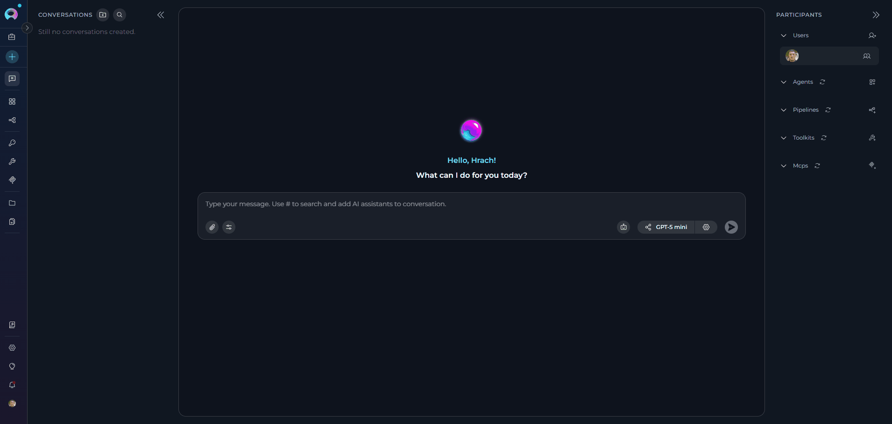
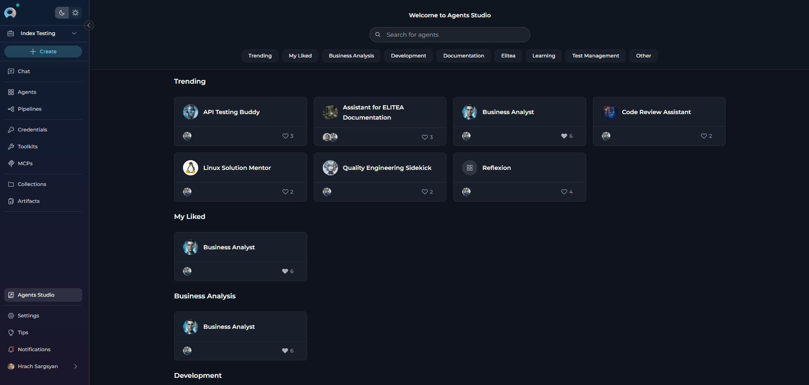
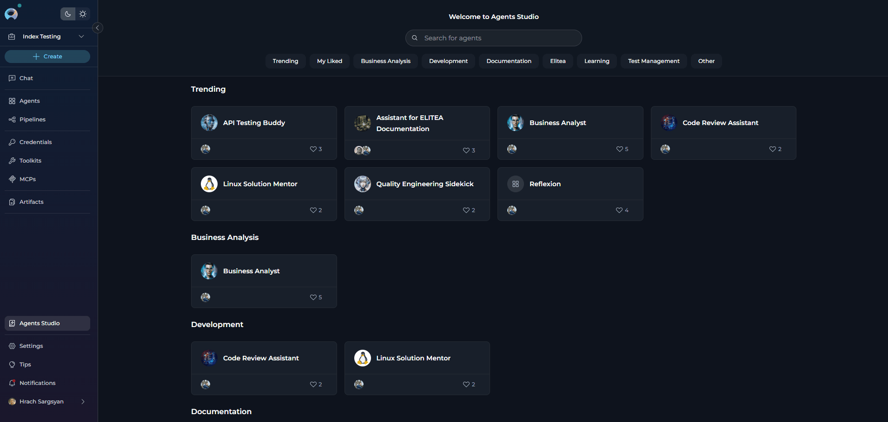
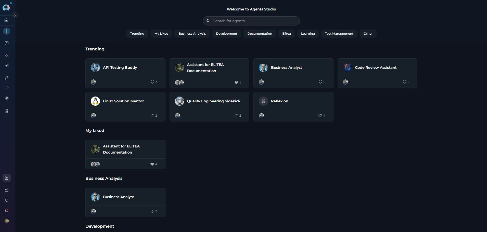
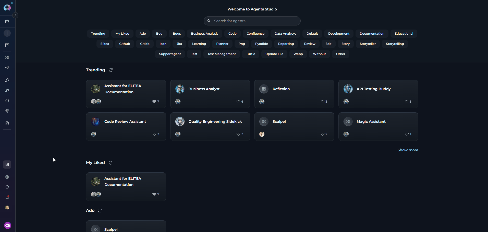

## Overview

Agents Studio is a shared library menu that showcases all published agents from the ELITEA community. Each agent is a pre-configured AI assistant designed for specific tasks, complete with custom instructions, conversation starters, and optimized settings.

<Note title="Important Note">
Agents Studio is available across all projects and provides a centralized view of all published agents, regardless of which project you're currently viewing.
</Note>

<CardGroup cols={3}>
  <Card title="Instant Access" icon="bolt">
    Browse and use community-published agents without building anything from scratch.
  </Card>
  <Card title="Community-Driven" icon="users">
    Leverage expertise from the ELITEA community — agents are created and shared by real users.
  </Card>
  <Card title="Quality Assured" icon="shield-check">
    All agents undergo moderation review before appearing in Studio.
  </Card>
  <Card title="Quick Discovery" icon="magnifying-glass">
    Find agents through real-time search, category filters, and trending sections.
  </Card>
  <Card title="Seamless Integration" icon="plug">
    Add agents directly to any conversation with one click — no extra configuration needed.
  </Card>
  <Card title="Workflow Enhancement" icon="rocket">
    Integrate specialized agents into daily workflows for code review, documentation, testing, and more.
  </Card>
</CardGroup>

**How Agents Studio Differs from the Agents Menu**

| Feature | Agents Studio | Agents Menu |
|---------|--------------|-------------|
| **Purpose** | Discover and use community agents | Manage your personal agents |
| **Content** | Published agents from all users | Only your created agents |
| **Access Level** | Read-only with temporary modifications | Full edit capabilities |

---

## Accessing Agents Studio

The **Studio** menu icon is located in the main navigation sidebar.

**To Access:**

1. Open ELITEA and ensure you're logged in
2. Look for the **Studio** icon in the left sidebar navigation
3. Click the **Studio** icon to open the Agents Studio view

---

## Agent Card Display

Published agents are displayed as cards in a responsive grid layout, grouped by their assigned categories. Each card provides key information at a glance:

**Card Elements:**

* **Agent Name:** The agent's display name
* **Creator Avatar:** Profile image of the agent's creator
* **Like Count:** Number of likes the agent has received

**Available Actions:**

* **Click Card:** Opens the agent detail modal with full information
* **Like Agent:** Click the heart icon to like/unlike the agent

---

## Browsing and Searching Agents

At the top of the Agents Studio view, you'll find a **Search field** that allows real-time search across published agents.

**Search Capabilities:**

* **Agent Name:** Search by the agent's title
* **Description:** Find agents based on their description content
* **Real-time Results:** Search results update as you type

**How to Search:**

1. Click in the search field at the top of Studio view
2. Type keywords related to the agent you're looking for
3. Results filter automatically as you type
4. Clear the input field to reset the search

**Category Filters**

Below the search field, you'll find **Category filters** that help you browse agents by popularity and recency.

**Available Categories:**

| Category | Description |
|----------|-------------|
| **Trending** | Agents with the most likes from the community |
| **My Liked** | Agents you have personally liked |
| **Business Analysis** | Agents designed for business analysis tasks |
| **Development** | Agents focused on software development and coding |
| **Documentation** | Agents specialized in creating and managing documentation |
| **Elitea** | Platform-specific agents for ELITEA workflows |
| **Learning** | Educational and training-focused agents |
| **Test Management** | Agents for test planning, execution, and quality assurance |
| **Other** | Miscellaneous agents that don't fit specific categories |

**How to Use Categories:**

1. Click on a category button to filter agents
2. Multiple filters can be applied simultaneously
3. Active category is highlighted
4. Agent cards update automatically based on selected filters

---

## Viewing Agent Details

Clicking on any agent card opens a **pop-up modal** that displays comprehensive information about the agent.

**Modal Contents:**

* **Creator Information:** Details about who created the agent
* **Like Button:** Option to like/unlike the agent
* **Agent Title:** Full name of the agent
* **Description:** Detailed explanation of the agent's purpose and capabilities
* **Show Context Button:** Click to open a read-only modal displaying the agent's full instructions and configuration details. You can read and copy the instructions but cannot modify them
* **Conversation Starters:** Pre-defined prompts to help users get started
* **Welcome Message:** The greeting users see when starting a conversation
* **Start Conversation Button:** Primary action to begin using the agent

---

## Starting a Conversation with an Agent

**Start Conversation Flow**

You can start a conversation with an agent in two ways:

1. **Click "Start Conversation" Button:** Creates a new conversation and displays conversation starters
2. **Click a Conversation Starter:** Creates a new conversation and pre-fills the starter text in the chat input field

**What Happens:**

1. **Navigation to Chat:** You're automatically redirected to the Chat menu
2. **New Conversation Created:** A fresh conversation is created specifically for this agent
3. **Agent Added as Participant:** The agent is added to the Participants list
4. **Agent Activated:** The agent is set as the active participant
5. **Conversation Starters Displayed:** Pre-defined prompts appear to guide your interaction (or if you clicked a starter, it's pre-filled in the input field)
6. **Ready to Chat:** You can immediately start sending messages

Once the conversation is created, you can:

* **Use Conversation Starters:** Click any starter to send that prompt immediately
* **Type Custom Message:** Enter your own message in the input box
* **Modify Model Settings:** Adjust LLM model and model parameters (see Modification Restrictions below)

---

## Modification Restrictions

 **What You Can Modify**

When using a published agent in a conversation, you have **limited modification capabilities** to maintain the integrity of the published agent:

**Allowed Modifications (Conversation-Specific):**

* **Variable Values:** Provide or modify values for variables defined in the agent
* **LLM Model Selection:** Change which AI model the agent uses. When browsing the model list, capability indicators appear next to model names to show what each model supports:

  | Capability | What it means |
  |------------|---------------|
  | **Image analysis** | The model can analyze and interpret images alongside text input |
  | **Reasoning** | The model uses extended reasoning steps; exposes **Reasoning Effort** in Model settings instead of **Creativity** |

* **Model Settings:** The **Model settings** dialog exposes the following parameters:

  | Parameter | Shown when | Description |
  |-----------|------------|-------------|
  | **Creativity** | Standard models | A 5-level discrete slider (Low → Mid-Low → Medium → Mid-High → High) controlling response randomness. Lower values produce focused, deterministic outputs; higher values produce more diverse, creative responses. |
  | **Reasoning Effort** | Reasoning-capable models (replaces Creativity) | A 3-level slider: **Low** (fast, surface-level), **Medium** (balanced), **High** (deep step-by-step analysis, slower). |
  | **Max Completion Tokens** | Always | Limits the maximum length of AI responses. Toggle between **Auto** (model-managed) and **Custom** (enter a specific token count, default 4096). |
  | **Steps Limit** | Always (in conversation context) | Maximum number of tool-call steps before the execution loop ends (default 25). |

**How to Modify:**

1. With the agent active in a conversation, click the gear (**Settings**) icon in the model selector bar at the bottom of the chat
2. The **Model settings** dialog opens — adjust the parameters as needed
3. Click **Apply** to save your changes, or **Cancel** to discard. Use **Reset to defaults** to restore the agent's original settings
4. Changes apply only to this conversation — they do not affect the published agent

**What You Cannot Modify**

The following agent properties are **read-only** to preserve the published agent's design and functionality:

**Read-Only Properties:**

* **Agent Name:** Cannot be renamed
* **Instructions:** Core behavior and task guidelines are locked
* **Welcome Message:** Cannot be edited
* **Conversation Starters:** Cannot add, remove, or modify starters
* **Toolkits:** Cannot remove ar add toolkits that are part of the published agent
* **Variable Definitions:** Cannot add or remove variables (but can modify their values)

<Warning title="Important">
All modifications you make (LLM model, settings, variable values) apply **only to your current conversation**. They do not affect the original published agent or how other users experience it. If you want to create your own version with full editing capabilities, you'll need to create a new agent in the Agents menu.
</Warning>

<Tip title="Alternative Methods">
You can also add published agents directly from the Chat interface. See **[How to Use Public Agents from Chat](../how-tos/chat-conversations/use-public-items-from-chat)** for detailed instructions on using the # search or the Participants panel to add agents.
</Tip>

---

## Agent Capabilities and Limitations

When using published agents from Studio, keep these considerations in mind:

<Tabs>
  <Tab title="Capabilities">
    <CardGroup cols={2}>
      <Card title="Immediate Execution" icon="bolt">
        Published agents work instantly in conversations — no setup required.
      </Card>
      <Card title="Specialized Expertise" icon="brain">
        Agents are designed for specific tasks and domains, delivering focused results.
      </Card>
      <Card title="Conversation Starters" icon="comments">
        Pre-written prompts help you get started quickly without crafting your own input.
      </Card>
      <Card title="Optimized Settings" icon="sliders">
        Agents come with tested configurations tuned for their intended use case.
      </Card>
      <Card title="Community Support" icon="users">
        Popular agents have been used and validated by the broader ELITEA community.
      </Card>
    </CardGroup>
  </Tab>

  <Tab title="Limitations">
    <CardGroup cols={2}>
      <Card title="Read-Only Core Config" icon="lock">
        Cannot modify instructions or core settings of the published agent.
      </Card>
      <Card title="Toolkit Dependencies" icon="toolbox">
        Some agents may require specific toolkits to be configured before they work correctly.
      </Card>
      <Card title="Model Restrictions" icon="robot">
        A published agent may be optimized for specific models; switching models may affect quality.
      </Card>
      <Card title="No Versioning Access" icon="code-branch">
        You always see the current published version — version history is not accessible.
      </Card>
      <Card title="Creator Control" icon="user-pen">
        The original creator controls when and how the published version is updated.
      </Card>
    </CardGroup>
  </Tab>

  <Tab title="Access & Security">
    <CardGroup cols={2}>
      <Card title="All Users" icon="globe">
        Any ELITEA user can browse, search, and use all published agents.
      </Card>
      <Card title="No Publishing from Studio" icon="ban">
        You cannot publish agents directly from Studio — use the Agents menu instead.
      </Card>
      <Card title="Conversation Privacy" icon="eye-slash">
        Your conversations with published agents are private to you.
      </Card>
      <Card title="Data Handling" icon="database">
        Published agents follow ELITEA's data privacy policies.
      </Card>
      <Card title="Moderation Reviewed" icon="shield-check">
        All published agents undergo moderator approval before appearing in Studio.
      </Card>
      <Card title="No Sensitive Data" icon="key">
        Published agents should not contain credentials or sensitive information.
      </Card>
    </CardGroup>
  </Tab>
</Tabs>

---

## <Icon icon="triangle-exclamation" size={26} /> Troubleshooting

<AccordionGroup>
  <Accordion title="Agent Not Appearing in Studio">
    **Problem:** Expected agent doesn't show up in Agents Studio.

    | Cause | Solution |
    |-------|----------|
    | **Not Yet Published** | Only approved agents appear in Studio — ask the creator if they've published the agent |
    | **Moderation Pending** | Agent may still be under review — wait for moderator approval (creators receive notifications) |
    | **Rejected** | Only approved agents appear in Studio |
    | **Search/Filter Issue** | Agent may be filtered out — clear search and reset category filters to view all agents |
  </Accordion>

  <Accordion title="Cannot Start Conversation with Agent">
    **Problem:** Clicking "Start Conversation" doesn't work or produces an error.

    | Cause | Solution |
    |-------|----------|
    | **Connection Issue** | Check internet connection and refresh the page |
    | **Session Expired** | Refresh the page and log in again if prompted |
    | **Browser Cache** | Clear browser cache or try incognito/private browsing mode |
    | **Permissions Issue** | Contact your administrator to verify Chat access permissions |
  </Accordion>

  <Accordion title="Agent Behavior Different from Expected">
    **Problem:** Published agent doesn't perform as described.

    | Cause | Solution |
    |-------|----------|
    | **Missing Variable Values** | Check if the agent uses variables and provide required values when prompted |
    | **Model Compatibility** | Try different LLM models in Model Settings |
    | **Incomplete Information** | Provide more detailed input or use conversation starters as guidance |
    | **Version Issue** | Check if the creator has published a newer version, or contact the creator |
  </Accordion>

  <Accordion title="Search Not Finding Agents">
    **Problem:** Search returns no results even when agents exist.

    | Cause | Solution |
    |-------|----------|
    | **Spelling** | Try alternative spellings or broader keywords; search by description keywords or browse categories |
    | **Special Characters** | Remove special characters and use simple keywords |
  </Accordion>
</AccordionGroup>

---

## <Icon icon="circle-check" size={26} /> Best Practices

<AccordionGroup>
  <Accordion title="Finding the Right Agent">
    1. **Start with Trending:** Browse trending agents to find proven, popular solutions
    2. **Use Specific Keywords:** Search with task-specific terms (e.g., "code review," "documentation")
    3. **Check Descriptions:** Read full descriptions to understand capabilities and limitations
    4. **Review Conversation Starters:** Starters often reveal the agent's core functionality
    5. **Test Multiple Agents:** Try different agents for the same task to compare approaches
  </Accordion>

  <Accordion title="Using Agents Effectively">
    1. **Use Conversation Starters:** Start with provided prompts to understand agent capabilities
    2. **Provide Context:** Give agents sufficient context in your messages
    3. **Configure Required Toolkits:** Set up necessary credentials for toolkit-dependent agents
    4. **Adjust Model Settings:** Experiment with different models if results aren't optimal
    5. **Read Welcome Messages:** Welcome messages often contain important usage instructions
  </Accordion>

  <Accordion title="Building on Published Agents">
    1. **Study Instructions:** Learn how successful agents structure their behavior guidelines
    2. **Analyze Conversation Starters:** See how effective prompts are crafted
    3. **Create Your Own:** Use insights to build custom agents in the Agents menu
    4. **Share Back:** Once you've created valuable agents, consider publishing them
  </Accordion>
</AccordionGroup>

---

<Info title="Related Documentation">
For more information on related features and workflows, refer to these guides:

* **[Agents Menu](./agents)** - Create and manage your personal agents
* **[Chat Menu](./chat)** - Complete guide to chat interface and conversations
* **[How to Use Public Agents from Chat](../how-tos/chat-conversations/use-public-items-from-chat)** - Detailed guide on using published agents in conversations
* **[How to Create and Edit Agents from Canvas](../how-tos/chat-conversations/how-to-create-and-edit-agents-from-canvas)** - Visual agent creation guide
* **[Agent Versioning](../how-tos/agents-pipelines/entity-versioning)** - Understanding agent versions and publishing
</Info>

---
