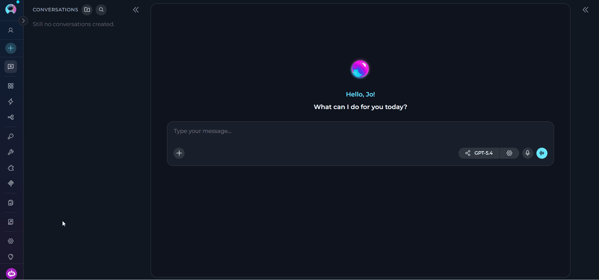
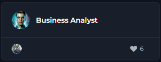
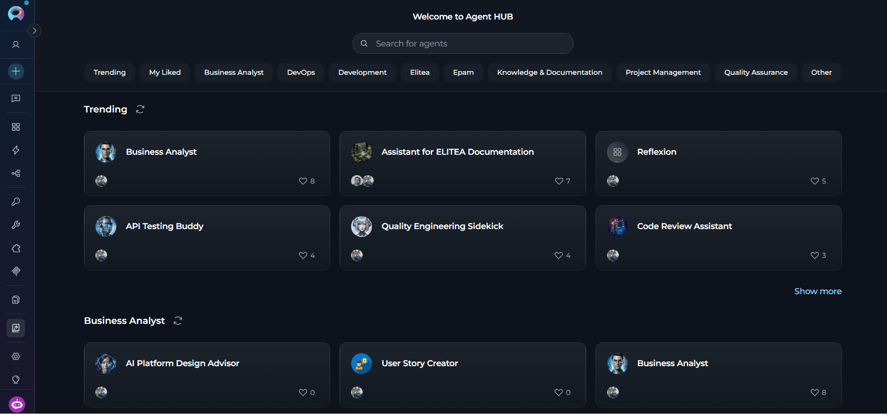
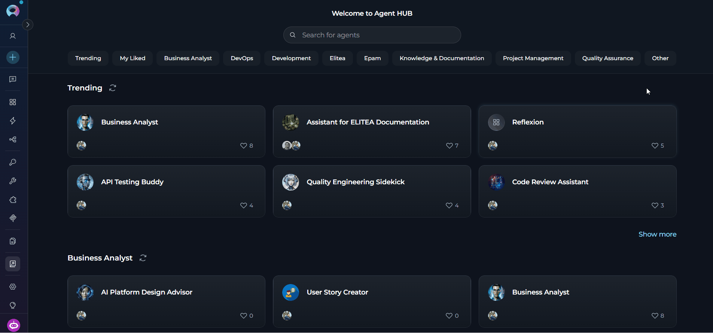
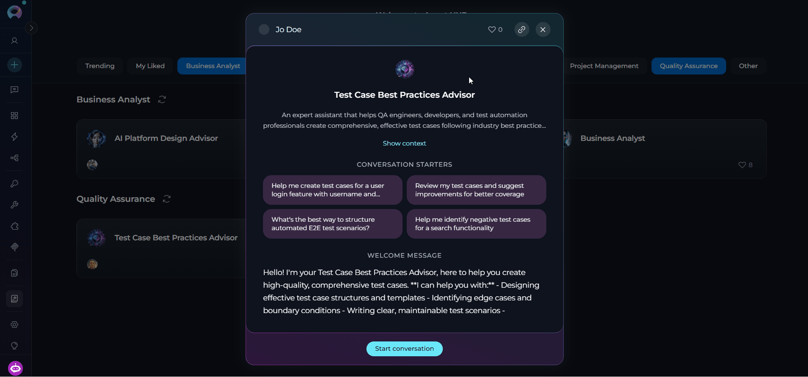
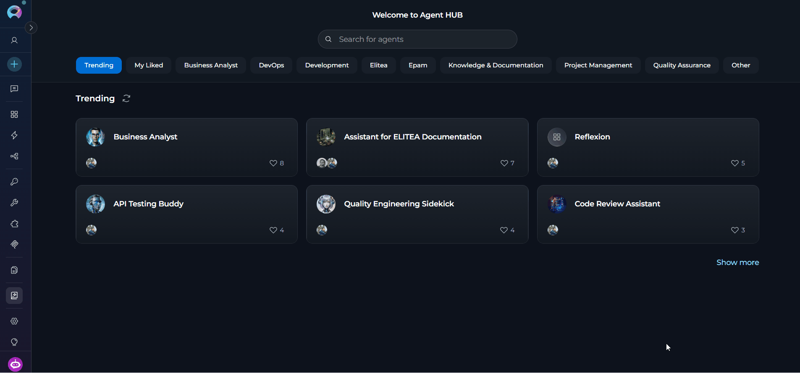
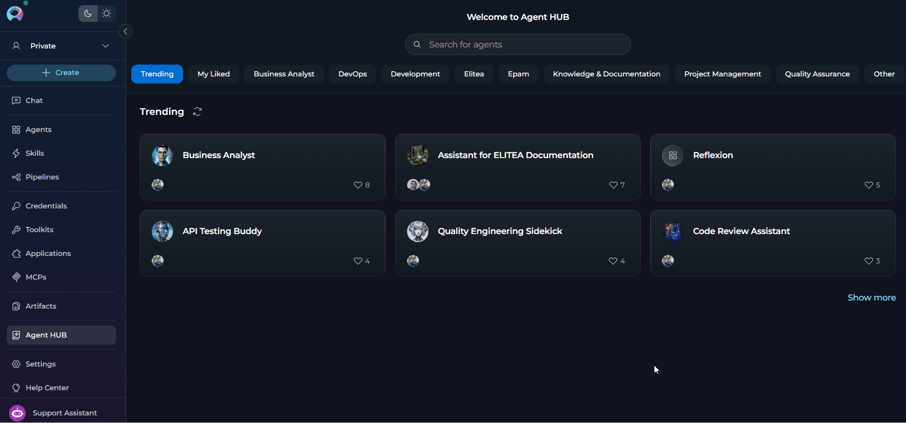

## Overview

Agent HUB is a shared library that includes all published agents from the ELITEA community. Each agent is a pre-configured AI assistant designed for specific tasks, complete with custom instructions, conversation starters, and optimized settings.

<Note title="Important Note">
Agent HUB is available across all projects and provides a centralized view of all published agents, regardless of which project you're currently viewing.
</Note>

<CardGroup cols={3}>
  <Card title="Instant access" icon="bolt">
    Browse and use community-published agents without building anything from scratch.
  </Card>
  <Card title="Driven by community" icon="users">
    Leverage expertise from the ELITEA community — agents are created and shared by real users.
  </Card>
  <Card title="Quality is assured" icon="shield-check">
    All agents undergo moderation review before getting to Agent HUB.
  </Card>
  <Card title="Quick discovery" icon="magnifying-glass">
    Find agents through real-time search, category filters, and trending sections.
  </Card>
  <Card title="Seamless integration" icon="plug">
    Add agents directly to any conversation with one click — no extra configuration needed.
  </Card>
  <Card title="Workflow enhancement" icon="rocket">
    Integrate specialized agents into daily workflows for code review, documentation, testing, and more.
  </Card>
</CardGroup>

**Agent HUB vs. Agents**

| Feature | Agent HUB | Agents |
|---------|--------------|-------------|
| **Purpose** | Discover and use community agents | Manage your personal agents |
| **Content** | Published agents from all users | Only agents you have created |
| **Access Level** | Read-only with temporary modifications | Full edit capabilities |

---

## How to Get to Agent HUB

Agent HUB is located in the ELITEA sidebar:

1. Open ELITEA and ensure you're logged in
2. Look for *Agent HUB* in the sidebar
3. Click it to open Agent HUB

---

## Agents in Agent HUB

Published agents are displayed as cards in a responsive grid layout, grouped by their assigned categories. Each card provides key agent information:

* agent's display name
* profile image of the agent's creator
* number of likes the agent has received

In the agent card, you can

* Click the card to open the agent's full information
* Like (or unlike) the agent

---

## How to Browse and Search Agents

At the top of Agent HUB, you'll find a **Search field** that allows searching across published agents.

You can search by the agent's **name** and **description**. The search results update in real-time as you type. You can clear the search field to reset the search.

**Search by Name**

To search for an agent by name:

1. Click in the search field at the top of Agent HUB
2. Type keywords related to the agent you're looking for

Results will filter automatically as you type.

**Filter by Category**

Below the search field, there are **category filters** that help you browse agents by their assigned categories:

| Category | Description |
|----------|-------------|
| **Trending** | Agents with the most likes from the community |
| **My Liked** | Agents you have personally liked |
| **Business Analyst** | Agents designed for business analysis tasks |
| **DevOps** | Agents designed for DevOps tasks |
| **Development** | Agents focused on software development and coding |
| **Elitea** | Platform-specific agents for ELITEA workflows |
| **Epam** | Agents designed for EPAM workflows |
| **Knowledge & Documentation** | Agents specialized in creating and managing documentation and knowledge bases |
| **Project Management** | Agents for project planning, execution, and management |
| **Quality Assurance** | Agents for test planning, execution, and quality assurance |
| **Other** | Miscellaneous agents that don't fit in specific categories |

To filter agents by category, 

1. Click the category button (multiple filters can be applied simultaneously)
2. Active category is highlighted
3. Agent cards update automatically based on selected filters

---

## How to View Agent Details

When you click on any agent card, a **pop-up modal** opens that displays all the information about the agent:

* **Creator:** Details about who created the agent
* **Like button:** Option to like/unlike the agent
* **Copy link to clipboard button:** Option to copy the agent's link to the clipboard
* **Name:** Full name of the agent
* **Description:** Detailed explanation of the agent's purpose and capabilities
* **Show context button:** Click to open a read-only modal displaying the agent's full instructions and configuration details. You can read and copy the instructions but cannot modify them
* **Conversation starters:** Pre-defined prompts to help users get started
* **Welcome message:** The greeting users see when starting a conversation
* **Start conversation button:** Primary action to begin using the agent

---

## How to Start a Conversation with an Agent

You can start a conversation with an agent in two ways:

1. With the **Start Conversation** button: Creates a new conversation and displays conversation starters
2. With a **Conversation Starter**: Creates a new conversation and pre-fills the starter text in the chat input field

After you start a conversation:

1. You're automatically redirected to the Chat menu
2. A fresh conversation is created specifically for this agent
3. The agent is added to the Participants list
4. The agent is set as the active participant
5. Pre-defined prompts appear to guide your interaction (or if you clicked a starter, it's pre-filled in the input field)
6. You can immediately start sending messages

Once the conversation is created, you can:

* **Use conversation starters:** Click any starter to send that prompt immediately
* **Type a custom message:** Enter your own message in the input box
* **Modify the model settings:** Adjust LLM model and model parameters

---

## Modification Restrictions

When using a published agent in a conversation, you have **limited modification capabilities** to maintain the integrity of the published agent:

**What You Can Modify**

* **Variable values:** Provide or modify values for variables defined in the agent
* **LLM Model:** Change which AI model the agent uses. Icons near the model name indicate its supported capabilities:

  | Capability | What it means |
  |------------|---------------|
  | **Image analysis** | The model can analyze and interpret images alongside text input |
  | **Reasoning** | The model uses extended reasoning steps; exposes **Reasoning Effort** in Model settings instead of **Creativity** |

* **Model settings:**

  | Parameter | Shown when | Description |
  |-----------|------------|-------------|
  | **Creativity** | Standard models | A 5-level discrete slider (Low → Mid-Low → Medium → Mid-High → High) controlling response randomness. Lower values produce focused, deterministic outputs; higher values produce more diverse, creative responses. |
  | **Reasoning Effort** | Reasoning-capable models (replaces Creativity) | A 3-level slider: **Low** (fast, surface-level), **Medium** (balanced), **High** (deep step-by-step analysis, slower). |
  | **Max Completion Tokens** | Always | Limits the maximum length of AI responses. Toggle between **Auto** (model-managed) and **Custom** (enter a specific token count, default 4096). |
  | **Steps Limit** | Always (in conversation context) | Maximum number of tool-call steps before the execution loop ends (default 25). |

**How to Modify**

1. With the agent active in a conversation, click the *Settings* icon at the bottom of the chat
2. The **Model settings** dialog opens — adjust the parameters as needed
3. Click **Apply** to save your changes, or **Cancel** to discard. Use **Reset to defaults** to restore the agent's original settings
4. Changes apply only to this conversation — they do not affect the published agent

**What You Cannot Modify**

These agent properties are **read-only** to preserve the published agent's design and functionality:

* Agent name
* Instructions (core behavior and task guidelines are locked)
* Welcome message
* Conversation starters
* Toolkits  (toolkits are locked as a part of the published agent)
* Variable definitions (cannot add or remove variables but can modify their values)

<Warning title="Important">
All modifications you make (LLM model, settings, variable values) apply **only to your current conversation**. They do not affect the original published agent or how other users experience it. If you want to create your own version with full editing capabilities, you'll need to create a new agent.
</Warning>

<Tip title="Alternative Methods">
You can also add published agents directly from the Chat interface. See **[How to Use Public Agents from Chat](../how-tos/chat-conversations/use-public-items-from-chat)** for detailed instructions on using the # search or the Participants panel to add agents.
</Tip>

---

## Agent Powers and Limitations

When using published agents from Agent HUB, keep these considerations in mind:

<Tabs>
  <Tab title="Powers">
    <CardGroup cols={2}>
      <Card title="Immediate execution" icon="bolt">
        Published agents work instantly in conversations — no setup required.
      </Card>
      <Card title="Specialized expertise" icon="brain">
        Agents are designed for specific tasks and domains, delivering focused results.
      </Card>
      <Card title="Conversation starters" icon="comments">
        Pre-written prompts help you get started quickly without crafting your own input.
      </Card>
      <Card title="Optimized settings" icon="sliders">
        Agents come with tested configurations tuned for their intended use case.
      </Card>
      <Card title="Community support" icon="users">
        Popular agents have been used and validated by the broader ELITEA community.
      </Card>
    </CardGroup>
  </Tab>

  <Tab title="Limitations">
    <CardGroup cols={2}>
      <Card title="Read-only core configurations" icon="lock">
        You cannot modify instructions or core settings of the published agent.
      </Card>
      <Card title="Toolkit dependencies" icon="toolbox">
        Some agents may require specific toolkits you need to configure before running the agent.
      </Card>
      <Card title="Model restrictions" icon="robot">
        The agent may be optimized for specific models; switching models may affect quality.
      </Card>
      <Card title="No versioning access" icon="code-branch">
        You always see the current published version — you have no access to version history.
      </Card>
      <Card title="Creator control" icon="user-pen">
        The original creator controls when and how the published version is updated.
      </Card>
    </CardGroup>
  </Tab>

  <Tab title="Access & security">
    <CardGroup cols={2}>
      <Card title="All users" icon="globe">
        Any ELITEA user can browse, search, and use all published agents.
      </Card>
      <Card title="No publishing from Agent HUB" icon="ban">
        You cannot publish agents directly from Agent HUB.
      </Card>
      <Card title="Conversation privacy" icon="eye-slash">
        Your conversations with published agents are private. Other users cannot access them.
      </Card>
      <Card title="Data handling" icon="database">
        Published agents follow ELITEA's data privacy policies.
      </Card>
      <Card title="No sensitive data" icon="key">
        Published agents should not contain credentials or sensitive information.
      </Card>
    </CardGroup>
  </Tab>
</Tabs>

---

## Troubleshooting

<AccordionGroup>
  <Accordion title="Agent does not appear in Agent HUB">
    **Problem:** Expected agent doesn't show up in Agent HUB.

    | Cause | Solution |
    |-------|----------|
    | **Not published yet** | Only approved agents appear in Agent HUB — ask the creator if they've published the agent |
    | **Pending moderation** | Agent may still be under review — wait for moderator approval (creators receive notifications) |
    | **Rejected** | Only approved agents appear in Agent HUB |
    | **Search/filter issue** | Agent may be filtered out — clear search and reset category filters to view all agents |
  </Accordion>

  <Accordion title="Cannot start conversation with the agent">
    **Problem:** Clicking the *Start Conversation* button doesn't work or produces an error.

    | Cause | Solution |
    |-------|----------|
    | **Connection issue** | Check the Internet connection and refresh the page |
    | **Session expired** | Refresh the page and log in if prompted |
    | **Browser cache** | Clear browser cache or try incognito/private browsing mode |
    | **Permissions issue** | Contact your administrator to verify your Chat access permissions |
  </Accordion>

  <Accordion title="Agent behavior is different from expected">
    **Problem:** Published agent doesn't perform as described.

    | Cause | Solution |
    |-------|----------|
    | **Missing variable values** | Check if the agent uses variables and provide required values when prompted |
    | **Model compatibility** | Try different LLM models |
    | **Incomplete data** | Provide more detailed input or use conversation starters as guidance |
    | **Version issue** | Check if the creator has published a newer version, or contact the creator |
  </Accordion>

  <Accordion title="Search does not find agents">
    **Problem:** Search returns no results even when agents exist.

    | Cause | Solution |
    |-------|----------|
    | **Spelling** | Try alternative spellings or broader keywords; search by description keywords or browse categories |
    | **Special characters** | Remove special characters and use simple keywords |
  </Accordion>
</AccordionGroup>

---

## Best Practices

<AccordionGroup>
  <Accordion title="Finding the right agent">
    1. **Start with Trending:** Browse trending agents to find proven, popular solutions
    2. **Use specific keywords:** Search with task-specific terms (e.g., "code review," "documentation")
    3. **Check descriptions:** Read full descriptions to understand capabilities and limitations
    4. **Review conversation starters:** Starters often reveal the agent's core functionality
    5. **Test multiple agents:** Try different agents for the same task to compare approaches
  </Accordion>

  <Accordion title="Using agents effectively">
    1. **Use conversation starters:** Start with provided prompts to understand agent capabilities
    2. **Provide context:** Give agents sufficient context in your messages
    3. **Configure required toolkits:** Set up necessary credentials for toolkit-dependent agents
    4. **Adjust model settings:** Experiment with different models if results are not optimal
    5. **Read welcome messages:** Welcome messages often contain important usage instructions
  </Accordion>

  <Accordion title="Building on published agents">
    1. **Study instructions:** Learn how successful agents structure their behavior guidelines
    2. **Analyze conversation starters:** See how effective prompts are crafted
    3. **Create your own:** Use insights to build your custom agents
    4. **Share back:** Once you've created valuable agents, consider publishing them
  </Accordion>
</AccordionGroup>

---

## Guides and References

<Info title="Related Documentation">

* **[Agents Menu](./agents)** - Create and manage your personal agents
* **[Chat Menu](./chat)** - Complete guide to chat interface and conversations
* **[How to Use Public Agents from Chat](../how-tos/chat-conversations/use-public-items-from-chat)** - Detailed guide on using published agents in conversations
* **[How to Create and Edit Agents from Canvas](../how-tos/chat-conversations/how-to-create-and-edit-agents-from-canvas)** - Visual agent creation guide
* **[Agent Versioning](../how-tos/agents-pipelines/entity-versioning)** - Understanding agent versions and publishing
</Info>

---
