## Overview

ELITEA Agents are customizable AI-powered virtual assistants that automate tasks and streamline workflows within the ELITEA platform. Each agent is purpose-built to handle specific tasks or workflows based on custom instructions, integrated toolkits, and AI model capabilities you configure. Agents can interact with external services, make intelligent decisions, and perform complex actions—from creating Jira tickets and managing GitHub repositories to analyzing data and generating documentation.

**Why Use Agents?**

<CardGroup cols={3}>
  <Card title="Task Automation" icon="gear">
    Automate repetitive and complex multi-step workflows without constant human intervention.
  </Card>
  <Card title="Increased Productivity" icon="bolt">
    Reduce manual effort by delegating routine tasks to intelligent agents.
  </Card>
  <Card title="Consistency" icon="shield-check">
    Ensure standardized processes and outputs across your team.
  </Card>
  <Card title="Integration" icon="plug">
    Seamlessly connect multiple tools and services to create powerful automated workflows.
  </Card>
  <Card title="Scalability" icon="arrow-up-right-dots">
    Deploy agents across different domains and scale operations as your needs grow.
  </Card>
</CardGroup>

**How Agents Work**

Creating an agent involves three key components:

1. **Instructions**: Define the agent's behavior, goals, and decision-making logic through custom instructions.
2. **Toolkits & Integrations**: Connect external services (GitHub, Jira, Slack, etc.) and modules (Attachments, Image creation, Data Analysis, Planner, Python sandbox, Swarm Mode, Smart Tools Selection) to extend capabilities.
3. **AI Model Configuration**: Select and configure the appropriate language model (GPT-4o, GPT-5.1, etc.) with optimal settings for your use case.

Once configured, the agent uses advanced natural language processing to interpret instructions, interact with connected tools, and autonomously execute tasks while adapting to changing conditions.

**Key Capabilities**

- **Autonomous Operation**: Independently executes tasks and makes decisions based on predefined instructions and goals.
- **Proactive Problem-Solving**: Determines optimal next steps to achieve objectives, even without explicit guidance.
- **Multi-Service Integration**: Combines external toolkits (project management, version control, testing tools) with internal capabilities.
- **Flexible Customization**: Tailor instructions, tools, and model settings to match specific requirements and workflows.
- **Version Management**: Create, manage, and publish different versions of agents for various use cases.
- **Context Awareness**: Maintain conversation context and manage token budgets for efficient, focused interactions.

## Navigate the Agents Menu

Select **Agents** in the main sidebar to open the Agents dashboard—a list of all agents in the current project. The dashboard supports card and table views, search by name or keyword, tag-based filtering, pinning agents to the top of the list, and organizing agents into folders.

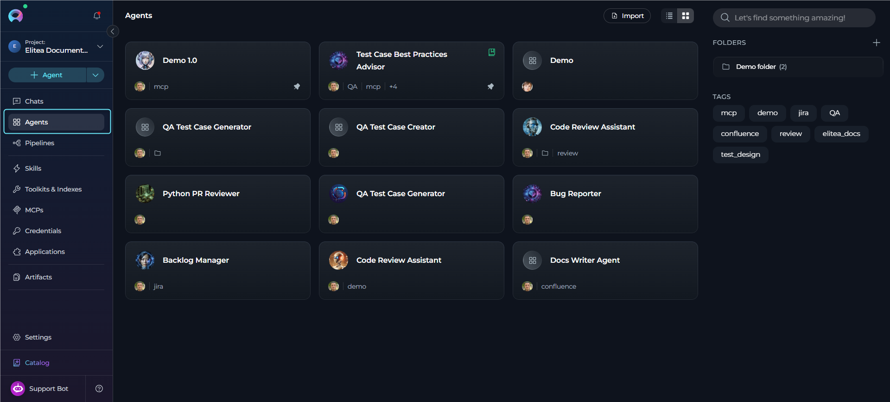

---

## Organize Agents into Folders

Folders help you organize agents into logical groups for better navigation and management. You can create folders, move agents between folders, and control folder access within team projects.

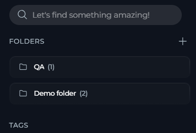

**Create a Folder:**

1. In the **Agents** dashboard right panel, locate the **Folders** section.
2. Select **+ Create Folder**.
3. Enter a folder name (up to 128 characters).
4. Select **Save**.

     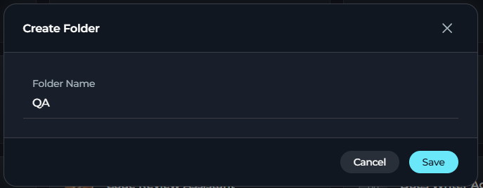

**Move an Agent to a Folder:**

1. **Hover over an Agent card:** A "Move to folder" icon (folder with arrow) appears on the card
2. **Click the folder icon:** Opens a menu with folder options
3. **Select a folder from the list:** The menu displays:
   - **+ Create Folder** option at the top
   - A scrollable list of existing folders
   - Pinned folders are marked with a pin icon
   - The current folder (if any) is highlighted and marked with a checkmark
4. The Agent is moved to the selected folder

    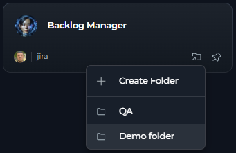

**View Folder Contents:**

Click any folder in the Folders panel to filter the agent list to show only agents in that folder. The folder name appears in the header, and the agent count updates to reflect the filtered view. Click **X** to close the folder view and return to the full list.

    

**Manage Folders:**

Each folder card in the right panel has a three-dot menu (⋮) with the following options:
    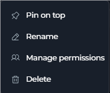
| Action | Description |
| --- | --- |
| **Rename** | Change the folder name |
| **Pin to top** | Pin the folder to the top of the folders list |
| **Delete** | Permanently remove the folder (agents inside are moved back to the main list, not deleted) |
| **Manage Access** *(Team projects only)* | Control which team members can view the folder |

**Remove an Agent from a Folder:**

1. Open the agent card's three-dot menu (⋮).
2. Select **Remove from Folder**.
3. The agent returns to the main agents list and the folder icon is removed from its card.

<Note>
Folders are available in team and personal projects. In team projects, folder access can be restricted to specific users. The Public project does not support folders.
</Note>

### Folder Permission Management

In team projects, you can control which users can view and modify specific folders by setting permission exceptions. By default, users retain the permissions granted by their project roles. Permission exceptions can only restrict access.

**Access Folder Permissions:**

1. In the **Agents** dashboard right panel, locate the folder in the **Folders** list.
2. Select the folder's three-dot menu (⋮).
3. Select **Manage Access**.
4. The Manage Permissions dialog opens.
    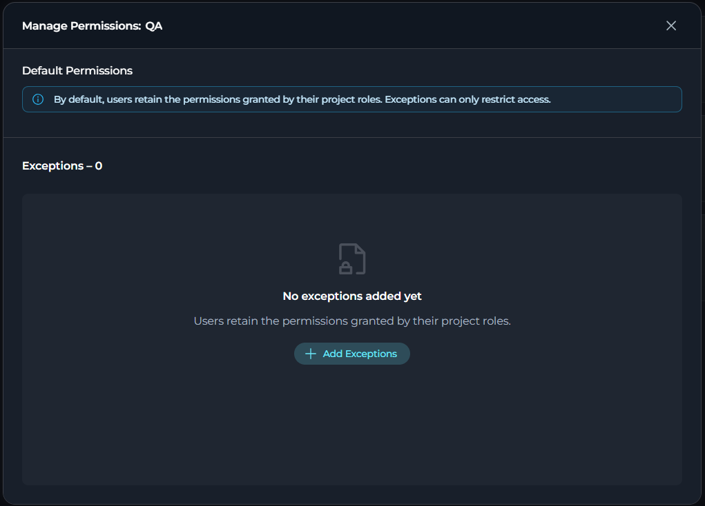

**Add Permission Exceptions:**

1. In the Manage Permissions dialog, select **+ Add Exception**.
2. Search for and select one or more users from the project.
3. Choose a permission level: **Read-only** or **No access**.
4. Select **Add**. The selected users are added to the permissions table.

    

**Permission Levels:**

| Permission Level | Description |
| --- | --- |
| **Read/write (default)** | User can view folder contents and modify folder settings |
| **Read-only** | User can view folder contents but cannot modify folder settings or move agents |
| **No access** | User cannot see the folder or its contents |

**Edit Permission Exceptions:**

- To modify an existing exception, locate the user in the permissions table and select the **Edit** (pencil) icon in the Actions column. Change the permission level to your desired setting and select **Save**. 
- To remove an exception and return the user to default permissions, change the permission level to **Read/write (default)**. When saved, the user is removed from the exceptions table and inherits permissions based on their project role.

<Note>
Permission exceptions apply only to the folder itself. Users with no access to a folder cannot see it in their folders list or view its contents.
</Note>

---

## Create an Agent

### Create Agent from Chat

You can create agents directly from your chat conversation using the **Agent & Pipeline Builder** module. When enabled, simply ask the AI to create an agent with specific capabilities, and it will guide you through the configuration process within the chat interface.

**How it works:**

1. Enable the **Agent & Pipeline Builder** module in your project settings or chat modules.
2. In your chat, describe the agent you want to create (e.g., "Create a code review agent that checks for security issues").
3. The AI will create the agent based on your description and add it to the Participants panel.
4. The newly created agent is automatically activated and ready to use in your conversation.

**Example prompts:**
- "Create an agent that reviews Python code for best practices"
- "Build a Jira ticket creation agent with my Jira toolkit"
- "Make an agent that summarizes meeting notes"

<Note>
The Agent & Pipeline Builder module must be enabled in your project settings to create agents from chat. Created agents appear in the Participants panel and can be edited anytime through the agent configuration interface. For more details, see [Agent & Pipeline Builder](/how-tos/chat-conversations/agents-&-pipeline-builder).
</Note>

### Create Agent from Sidebar

To set up a new agent from the sidebar:

1. Select the **+ Agent** button at the top of the main sidebar.

    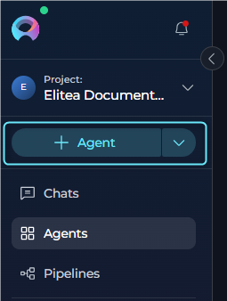

2. Complete the agent configuration fields:

   | Section | Field | Required | Example |
   |---|---|---|---|
   | **General** | Name | Yes | `Code Review Assistant` |
   | **General** | Description | Yes | `Reviews pull requests for bugs, security issues, and style violations` |
   | **General** | Tags | No | `code-review`, `github`, `quality` |
   | **Instructions** | Instructions | Yes | `You are a code review expert. Analyze the provided diff for bugs, security vulnerabilities, and style issues. Return findings as a numbered list.` |
   | **Welcome Message** | Welcome Message | No | `Hello! Paste a PR link or diff and I'll review it for you.` |
   | **Conversation Starters** | Conversation Starters | No | `Review this PR for security issues`, `Check code style compliance` |
   | **Advanced** | Step Limit | No | `50` |
   | **Advanced** | Ignore Project Context | No | Turn on when the agent should focus solely on its own instructions, ignoring project-wide context. |
   | **Editor Notes** | Notes | No | `Internal note: Use this version for PR review experiments only.` |

3. Select **Save**.

    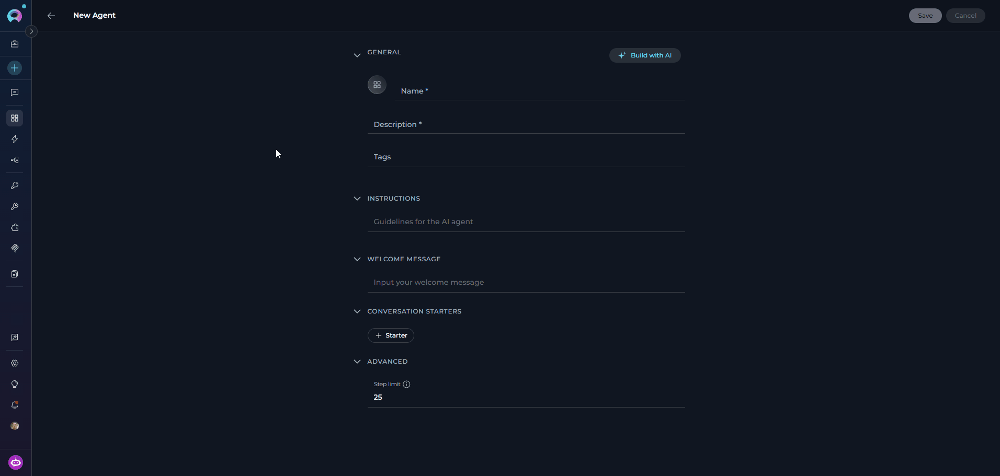

After selecting **Save**, the agent configuration page opens. The page uses a two-column layout:

- **Left panel**—the configuration form with all settings sections (General, Instructions, Variables, Welcome Message, Toolkits, Skills, Conversation Starters, Advanced, Editor Notes, Information).
- **Right panel**—an embedded live chat panel for interactively testing the agent without leaving the configuration view.

From this page you can:

- **Add Toolkits**, agents, MCPs (Model Context Protocol servers), and pipelines.
- **Attach Skills**.
- **Select AI Model** and configure model settings.
- **Turn on Modules**.
- **Set Variable Values**.
- **Test Interactively** using the embedded chat panel.
- **View Run History**.

Your newly created agent will appear on the **Agents** page for your project.

### Build Agent with AI

Instead of completing the form manually, use **Build with AI** to generate a complete agent draft from a plain-language description.

1. Open the agent creation form (**+ Create** > select **Agent**, or **Agents** > **+ Create**).
2. In the **General** section header, select the **Build with AI** button (✨ sparkle icon).
3. In the dialog, describe what the agent should do—its goal, tasks, and preferred tone.
   ```
   An agent that monitors Jira sprints, identifies blockers, and posts a
   daily summary to the team Slack channel. Professional tone.
   ```
4. Select **Generate**. ELITEA drafts a **Name**, **Description**, **Instructions**, **Welcome Message**, and **Conversation Starters** for you.
5. Review and edit each field. Select any suggested toolkits or child agents to attach.
6. Select **Create Agent** to save.

<Tip>
All generated fields are fully editable before creation. Select **Back to prompt** on the review step to refine your description and regenerate without losing the draft.
</Tip>

     

<Info>
For the full Build with AI workflow—including how suggested resources work and how to use it from Chat—see the [**Build Agent with AI guide**](../how-tos/agents-pipelines/build-agent-with-ai).
</Info>

### Edit Agent with AI

After an agent has been created and saved, use **Edit with AI** to propose targeted updates to the existing configuration instead of editing every field manually.

1. Open an existing saved agent.
2. In the **General** section header, select **Edit with AI**
3. In the dialog, describe the changes you want to make. For example:
     ```
     Update this agent to focus on security-first pull request reviews,
     tighten the instructions, add a stronger welcome message, and suggest
     any missing GitHub or Jira resources.
     ```
4. Select **Generate Draft**. ELITEA analyzes the current agent and produces a proposed draft update.
5. Review the generated draft step by step. Depending on what changed, ELITEA shows review steps for:
    - **General** fields such as **Name** and **Description**.
    - **Instructions**.
    - **User interaction** fields such as **Welcome Message** and **Conversation Starters**.
    - **Tools & Skills** suggestions, including toolkits, MCPs, agents, pipelines, and Skills to add, keep, or remove.
    - A final **Summary** step before applying changes.
6. Choose which changes to keep. You can selectively apply or skip individual field updates before saving.
7. Finish by selecting either:
    - **Save** to apply the selected changes to the current version.
    - **Save as Version** to create a new version with the selected AI-generated changes.

    <video controls>
      <source src="../img/menus/agents/edit-agent-with-ai.mp4" type="video/mp4"/>
      Your browser does not support the video tag.
    </video>

<Tip>
Use **Refine Prompt** in the wizard footer to go back, adjust your request, and regenerate the draft without leaving the Edit with AI flow.
</Tip>

<Note>
**Edit with AI** is available only for existing saved agents. It is shown in the **General** section of the agent editor and is not available while creating a brand-new unsaved agent.
</Note>

<Info>
When you save AI-generated edits, ELITEA can update both content fields and attached resources. Suggested toolkits, MCPs, agents, pipelines, and Skills can be reviewed before they are added or removed.
</Info>

---

<Tip>
  When configuring Agents, you can personalize their profiles by adding a custom image along with the **Name** and **Description**. This feature lets you create a unique, visually distinct identity for each Agent, making them easier to recognize and manage.

  To add an image:

  1. Select the **Pen Icon** next to the image placeholder to open the image upload interface.
  2. Select the **Upload a Custom Image** icon to upload a custom image from your local system.
  3. Select **Use Default Images** to choose from a set of default images provided by the platform.

  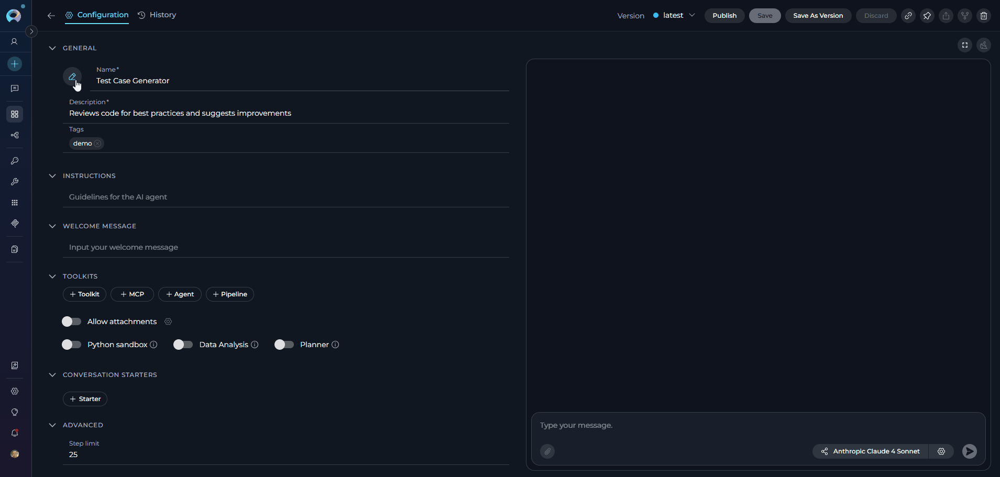
</Tip>

### Select & Configure Toolkits

Toolkits are integrations with external or ELITEA internal services that enhance your agent's capabilities by allowing it to interact with various resources and perform specific tasks. In addition to toolkits, you can also add other Agents, MCPs (Model Context Protocol servers), and Pipelines to extend your agent's functionality. You can add these resources to your agent during the creation process or edit them later.

**Add Resources to Your Agent:**

1. In the agent creation or editing interface, go to the **TOOLS** section.
2. Use the dedicated add buttons to attach resources. Each button opens its own searchable dropdown:
   - **+Toolkit**: Browse and select from available toolkits, or select **"Create new"** to create a new toolkit. See [**Toolkits**](./toolkits).
   - **+MCP**: Browse and select Model Context Protocol servers, or select **"Create new"** to create a new MCP. See [**MCPs**](./mcps).
   - **+Agent**: Browse and select classic agents in the project to add as nested agents.
   - **+Pipeline**: Browse and select pipelines in the project. See [**Pipelines**](./pipelines).
3. Each dropdown supports inline search and paginated scrolling to locate resources quickly.

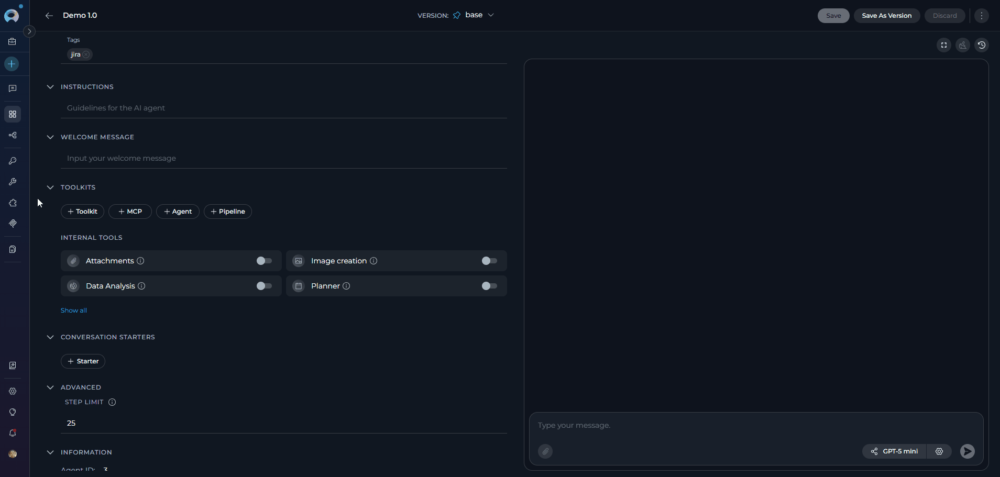

<Note title="Note">
Your changes are saved automatically when you add or remove resources.
</Note>

<Frame caption="If a toolkit added to your agent uses shared credentials that require each user to supply their own private copy, a **Credential setup required** warning banner appears on the tool card. Select the **Create a credential** link in the banner to create a matching private credential in your Personal workspace. See [Shared Toolkit Credentials](./toolkits#shared-toolkit-credentials) for details.">
  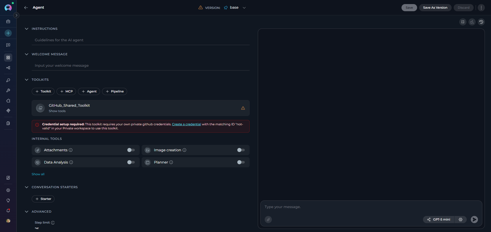
</Frame>

### Skills

Skills are reusable, Markdown-based instruction sets that you attach to an agent version to give it named, on-demand capabilities—without duplicating instructions across multiple agents.

<Info>
A maximum of five Skills can be attached to a single agent version. The counter in the Skills section shows how many are currently attached (for example, `2/5 skills added`). The **Skills** section is only available in team and personal projects—it is hidden when the Public project is selected.
</Info>

**Attach a Skill:**

1. In the agent configuration form, scroll to the **Skills** accordion section.
2. Select the **`+ Skill`** button to open the skill picker.
   - The button is inactive if the agent has not been saved yet (tooltip: *"Save the agent first, then add skills"*) or if the five-skill limit has been reached.
3. Search for the Skill by name, then select it to attach. It attaches using the Skill `base` version by default.

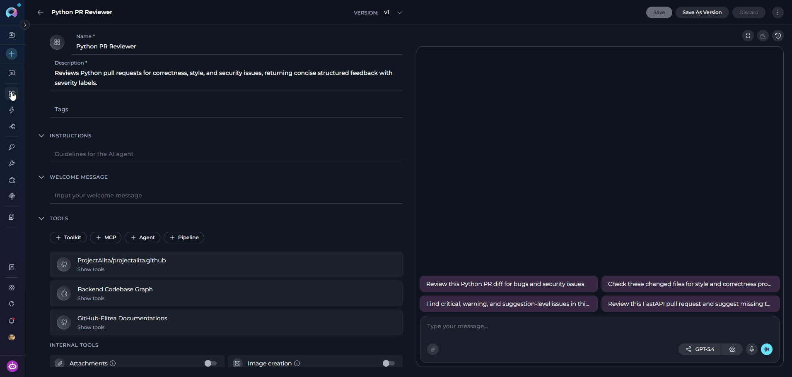

**Change the Attached Version:**

Each attached Skill card shows the active version name. Select the version name to open a **Versions** dropdown and select a different version. The attachment updates automatically.

**Remove a Skill:**

Hover over the Skill card and select the **Remove skill** (trash) icon. Confirm in the dialog.

<Info>
For full details on creating, versioning, and invoking Skills, see the [**Skills**](./skills) documentation.
</Info>

---

### Modules

ELITEA provides built-in modules that extend your agent's capabilities without requiring external integrations. These modules let your agents perform specialized tasks directly within the platform.

**Available Modules:**

| Module | Description |
| --- | --- |
| [**Attachments**](../how-tos/chat-conversations/attach-files) | Allow the agent to use uploaded files and images as context during conversations. Turns on document upload, indexing, and search operations. Available for agents only. |
| [**Image Creation**](../how-tos/chat-conversations/image-generation) | Generate images from the chat using AI-powered text-to-image capabilities. Requires an image generation toolkit (`ImageGenServiceProvider`) configured in your project. |
| [**Data Analysis**](../how-tos/chat-conversations/data-analysis-internal-tool) | Perform Pandas-based data analysis on uploaded files. Your agent can process CSV files, Excel spreadsheets, perform statistical analysis, and generate visualizations using natural language queries. |
| [**Agent & Pipeline Builder**](../how-tos/chat-conversations/agents-&-pipeline-builder) | Create and edit agents and pipelines from the chat. Exposes ELITEA platform capabilities as MCP tools, allowing the agent to interact with ELITEA resources directly during execution. |
| [**Skill Builder**](../how-tos/modules/skill-builder) | Create and edit skills from the chat. Allows agents to modify skill instructions and configurations without leaving the conversation. |
| [**Project Context Builder**](../how-tos/modules/project-context-builder) | Create and edit your project context from the chat. Enables agents to update project-wide context that applies to all agents in the project. |
| [**Ask User**](../how-tos/modules/ask-user) | Allow agents to ask you clarifying questions instead of guessing. When the agent needs additional information or faces ambiguous requirements, it can prompt for user input mid-execution. |
| [**Planner**](../how-tos/chat-conversations/planner-internal-tool) | Create, manage, and track tasks and action items from the chat. Provides structured planning and task breakdown capabilities, helping your agent organize complex workflows into manageable steps. |
| [**Python Sandbox**](../how-tos/chat-conversations/python-sandbox-internal-tool) | Execute Python code in a secure sandbox using Pyodide. Your agent can run Python code, perform calculations, analyze data, and use compatible Python packages like numpy, pandas, and matplotlib. |
| [**Swarm Mode**](../how-tos/chat-conversations/swarm-mode-internal-tool) | Enable multi-agent collaboration by sharing the full conversation history and control between agents. All child agents can hand off control to each other, ideal for complex workflows requiring multiple specialized agents working as a team. |
| [**Smart Tools Selection**](../how-tos/chat-conversations/smart-tools-selection-internal-tool) | Reduce token usage when working with many toolkits by using meta-tools instead of binding all tools directly. Recommended when using many toolkits to optimize context window usage. |

**Turn On Modules:**

1. In the **TOOLS** section, scroll to the bottom to find the **MODULES** subsection.
2. Each module has its own toggle switch. If not all modules are visible, select **Show all** to expand the full list.
3. Turn on the modules you need:

    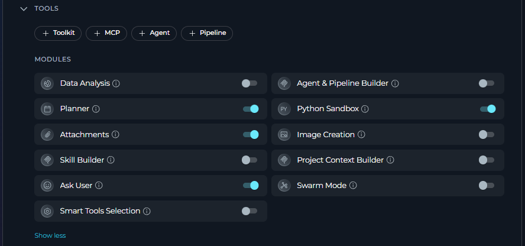

### Create Instructions

The **Instructions** section is the core component where you define how your agent should behave and what tasks it should perform. This field serves as the foundational knowledge base that guides the AI model in understanding and processing your specific requests.

**How to Input Instructions:**

- **Identify Key Information**: Before entering data into the Instructions field, identify the essential details or instructions that the model must know to fulfill your request effectively. This includes the topic, specific terms, relevant background information, or the scope of the task.
- **Enter the Details**: In the Instructions field, clearly and concisely input the identified information. Ensure that the information is directly relevant to the task to maintain the agent's focus and efficiency.
  
  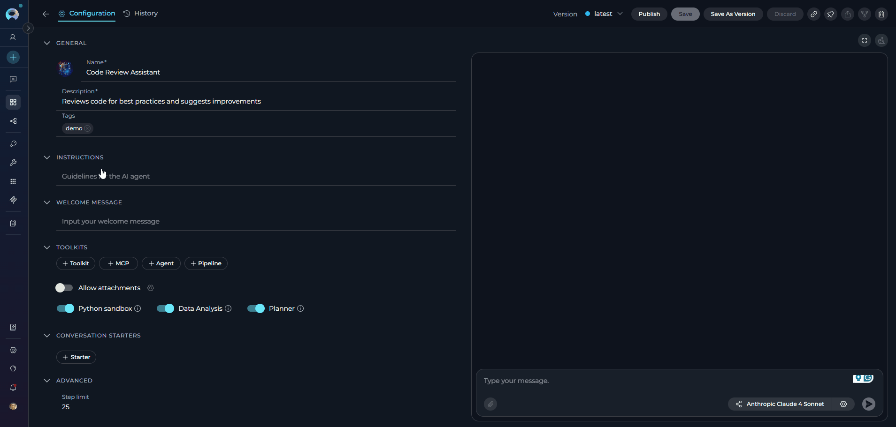

#### Mentions in Instructions

The Instructions field supports `/` mentions to reference tools and `~` mentions to reference Skills added to the agent directly in the instruction text. Inserted mentions are highlighted in the field so you can see at a glance which resources are referenced.

<Note>
Mentions are supported in both the standard Instructions field and the full-screen editor. Inserted mentions are highlighted in both views.
</Note>

**How to use mentions:**

1. Type `/` anywhere in the Instructions field to open the suggestion dropdown for toolkits, MCPs, agents, and pipelines.
2. Type `~` to open the suggestion dropdown for Skills attached to the agent.
3. Start typing after `/` or `~` to filter the list by name.
4. Use the arrow keys to navigate the list and **Enter** to select, or select an item directly.
5. For toolkits and MCPs, selecting an item opens a second phase to optionally pick a specific tool within that toolkit. Type to filter tools and select one, or press **Enter** or select the toolkit name without a tool to mention the whole toolkit.
6. Press **Escape** at any point to dismiss the dropdown without inserting a mention.

   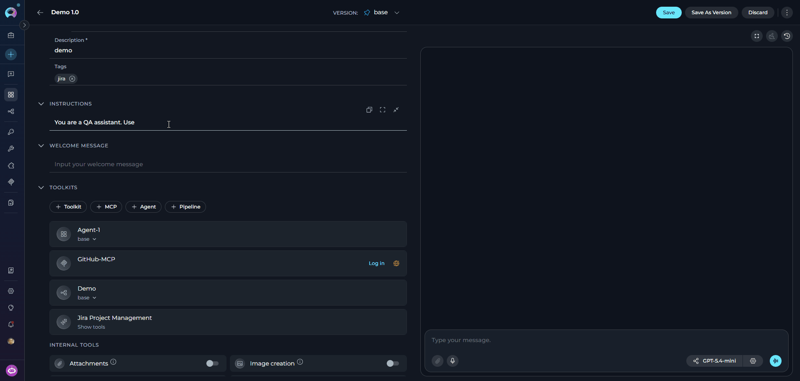

**Mention format inserted into the instructions text:**

| What you mention | Mention inserted |
|---|---|
| Agent or pipeline | `/Name ` |
| Whole toolkit or MCP | `/Name ` |
| Specific tool within a toolkit | `/Name/ToolName ` |
| Skill | `~SkillName ` |

<Warning>
Only tools and Skills already added to the agent (via the **Toolkits** or **Skills** sections) and free of validation errors appear in the suggestion list. Add a toolkit or attach a Skill to the agent first before mentioning it in instructions.
</Warning>

#### Variables

The **Variables** section appears automatically in the left configuration panel when your agent's instructions contain one or more template placeholders in the `{{variable_name}}` syntax.

Each placeholder is extracted and displayed as a separate input field, allowing you to define reusable values without hardcoding them directly in instructions.

**How Variables Work:**

1. In the **Instructions** field, include placeholders using double curly braces: for example, `{{project_name}}`, `{{jira_ticket_id}}`.
2. After saving, the **Variables** accordion appears below Instructions with an input field for each detected placeholder.
3. Enter the default or current value for each variable.
4. During execution, the placeholders are substituted with the provided values before the instructions are sent to the model.
   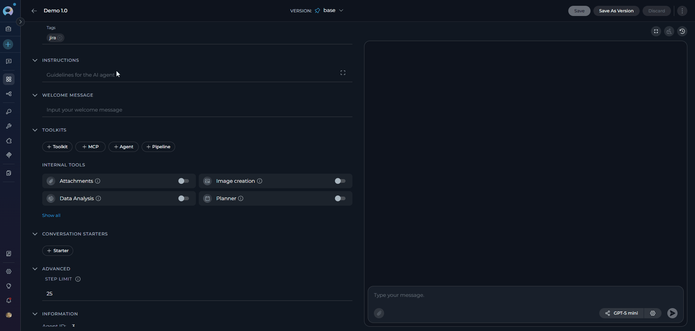

<Info>
The Variables section is only visible when instructions contain at least one `{{variable}}` placeholder. It does not appear for agents without template variables.
</Info>

### Editor Notes

The **Editor Notes** section is a separate accordion in the left configuration panel. It is intended for internal documentation about the current agent version.Use this field to record implementation notes, review comments, rollout reminders, or other editor-facing context that should stay with the agent configuration.
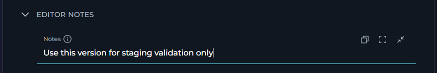

<Note>
The content is **not sent to the LLM**, **not included in chat or execution**, and **not used in monitoring**.
</Note>


**Example uses:**

- `Use this version for staging validation only.`
- `Pending toolkit credential rotation before production rollout.`
- `Draft variant created for testing alternative instructions.`

### Welcome Message

The **Welcome Message** feature lets you provide additional context and instructions that appear when users interact with your agent in the chat interface. This message helps set expectations and guide users on how to use the agent.

**Add the Welcome Message:**

1. In the agent creation or configuration interface, go to the **Welcome Message** section.
2. In the input field, enter the welcome message text.
3. Select **Save** to save the configuration. This makes the configured welcome message available to users in the **Chat** section.

**Use the Welcome Message:**

When users go to the **Chat** section of the agent, they see the configured **Welcome Message**. It provides helpful context and instructions to guide their interaction with the agent.

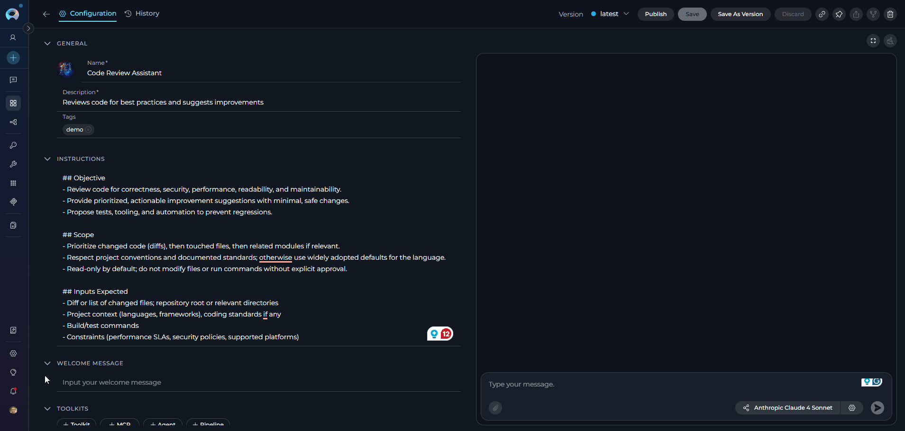

<Info>
  - "Use this agent for generating manual test cases"
  - "Do not forget to double-check the generated test cases"
  - "I can help you analyze code, write documentation, and review pull requests"
</Info>

### Chat Starters

The **Chat Starter** feature lets you configure predefined prompts that help users quickly initiate specific types of interactions with your agent. These starters appear as selectable options in the chat interface, making it easy for users to get started.

**Add a Chat Starter:**

1. Go to the **Chat Starter** section in the agent creation or editing interface.
2. Select the `+` icon to open the text input field and enter the text you want to use as a chat starter.
3. Select **Save** to save the configuration. This makes the configured chat starter available for use.

**Use a Chat Starter:**

Go to the **Chat** section of the agent. The saved chat starters appear as selectable options. Select the desired starter to automatically populate the chat input and execute the agent.

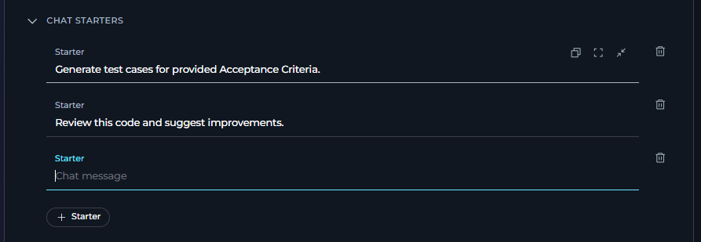

<Info>
  - "Generate test cases for provided Acceptance Criteria."
  - "Generate automatic test cases for selected \[Test\_Case\_ID\]."
  - "Review this code and suggest improvements."
  - "Help me write documentation for this feature."
</Info>

By setting up conversation starters, you streamline the process of initiating specific tasks or queries, making your interactions with the agent more efficient and standardized.

### Information

The **Information** section is an accordion at the bottom of the left configuration panel. It provides read-only metadata about the current agent and version.

| Field | Description |
| --- | --- |
| **Agent ID** | The unique identifier for this agent. Select the copy icon to copy it to the clipboard. Useful for API integrations and support requests. |
| **Version ID** | The unique identifier for the currently selected version. Select the copy icon to copy it. Useful for version-specific API calls. |
| **Forked from** | Visible only if this agent was forked. Displays the name of the original agent with a selectable link. The link is inactive if you do not have permission to view the source project. |

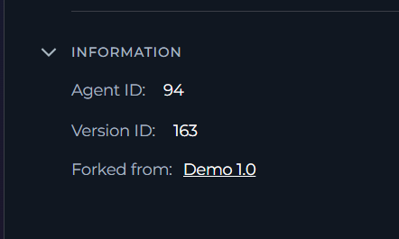

### Chat Panel

The right panel of the agent page contains a live chat panel that lets you test the agent without navigating away.

**Controls in the top bar of the chat panel:**

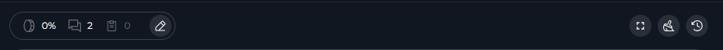

| Control | Description |
| --- | --- |
| **Full-screen toggle** (⛶) | Expands the chat panel to fill the full width of the page, hiding the left configuration panel. Select again to return to the two-column view. |
| **Clear chat** | Erases the current test conversation. |
| **View run history** (🕐) | Opens the Run History panel. See [View Agent History](#viewing-agent-history). |

**Context Budget widget** (if context management is turned on): Appears above the chat panel after the first message. See [Manage Context Budget](#managing-context-budget) for details.

## Execute an Agent

To execute the agent and get the output:

1. **Configure the Agent**: Ensure your agent is properly configured with clear instructions and any necessary toolkits.
2. **Go to Chat**: Go to the agent's chat interface by selecting the agent from your agents list.

### Select & Configure the AI Model

Before sending a message, you can choose which AI model processes the agent and optionally adjust its parameters.

1. Select the **model chip** in the chat input bar to open the model selector dropdown.
2. Choose the desired model from the list (for example, `gpt-4o`, `gpt-5.1`).
3. Select the **Model Settings** icon (⚙️) next to the model chip to adjust generation parameters.

   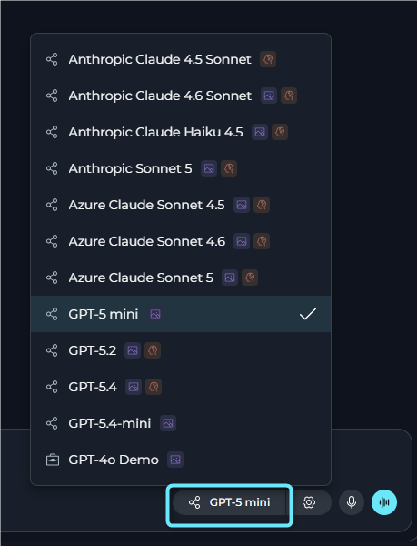

<Tabs>
  <Tab title="Reasoning Models (e.g. GPT-5.1)">
    | Parameter | Description |
    |-----------|-------------|
    | **Reasoning** | Controls the depth of logical thinking and problem-solving. |

    | Level | Behavior |
    |-------|----------|
    | **Low** | Fast, surface-level reasoning with concise answers and minimal steps |
    | **Medium** | Balanced reasoning with clear explanations and moderate multi-step thinking *(default)* |
    | **High** | Deep, thorough reasoning with detailed step-by-step analysis (may be slower) |

    
  </Tab>
  <Tab title="Standard Models (e.g. GPT-4o)">
    | Parameter | Description |
    |-----------|-------------|
    | **Creativity** | Controls response randomness. Lower values produce focused, deterministic outputs; higher values produce more varied and creative responses. |

    | Level | Behavior |
    |-------|----------|
    | **1** | Highly focused and deterministic outputs |
    | **2** | Mostly focused with slight variation |
    | **3** | Balanced between focus and creativity *(default)* |
    | **4** | More varied and creative responses |
    | **5** | Maximum creativity and diversity |

    
  </Tab>
</Tabs>

**Max Completion Tokens** *(All Models)*

| Option | Description |
|--------|-------------|
| **Auto** | System sets the token limit automatically *(default)* |
| **Custom** | Manually enter a specific token limit for responses |

### Manage Context Budget

When the `context_manager` secret is turned on at the project level, the **Context Budget** widget appears above the chat interface to help you manage conversation token usage effectively.

<Info>
For detailed information about context management configuration and best practices, see the [**Context Management guide**](../how-tos/chat-conversations/context-management).
</Info>

**What is Context Management?**

Context Management provides intelligent control over conversation token usage through automated message pruning and summarization. It helps maintain conversation continuity while staying within model token limits by automatically managing message history, generating summaries of older conversations, and preserving important messages.

**Access the Context Budget Widget:**

1. Ensure the `context_manager` secret is set to `true` in your project settings (**Settings** > **Secrets**).
2. Send the first message to start the agent conversation.
3. The **Context Budget** widget appears above the chat panel after the first message.
4. Monitor real-time token usage and management status.
5. Select the widget to expand and view detailed metrics.

**Widget Views:**

- **Collapsed View**: Shows essential token usage status with a color-coded indicator (green: normal, orange: high usage).
- **Compact View**: Displays pruning strategy, message count, and summaries count.
- **Expanded View**: Provides comprehensive configuration options including:
  - Context Strategy & Token Management (pruning strategy, max tokens, preserve recent messages).
  - Summarization settings (turn on or off, summary parameters).
  - System Messages management.

**Key Features:**

- **Real-time tracking**: Monitor token consumption as your agent processes requests.
- **Automatic pruning**: System removes older messages when context limit is reached.
- **Summarization**: Generate summaries of conversation history to preserve context.
- **Message preservation**: Configure how many recent messages to always keep.
  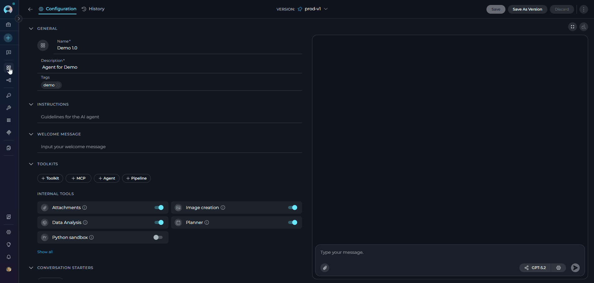

### Start & Interact with Your Agent

**Start Interaction**: Begin your conversation by:

- Selecting a **Conversation Starter** (if configured) to use a predefined prompt.
- Entering your question or command directly into the chat input field.
- Using simple commands like "Go", "Start Generating", "Execute", or "Run it" followed by selecting the **Send** button.

**Additional Interaction Features:**

- **Full Screen Mode**: Expand the output window for better visibility and focus.
- **Continue the Dialogue**: Enter your next question or command in the chat box and select the **Send** icon.
- **Copy the Output**: Select the **Copy to Clipboard** icon to copy the generated text for use elsewhere.
- **Regenerate Response**: If the output is not satisfactory, select the **Regenerate** icon to prompt the AI to produce a new response.
- **Delete Output**: To remove the current output from the chat, select the **Delete** icon.
- **Clear the Chat**: To start fresh or clear sensitive data, select the **Clean** icon to erase the chat history.
- **Like or Dislike the Output**:
  - Select the **Like** icon if the output meets your expectations.
  - Select the **Dislike** icon if the output is not satisfactory. You will have the option to leave a comment explaining why the output did not meet your expectations. This feedback helps improve the system performance and relevance.

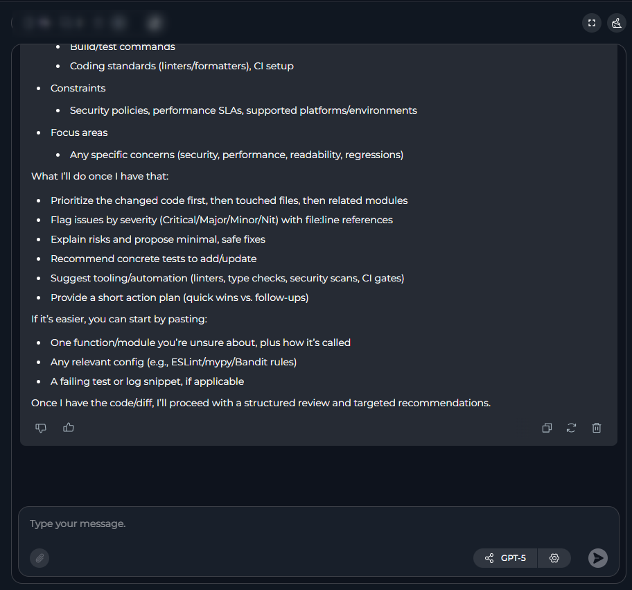

### Mid-Turn Input (Beta)

**Mid-Turn Input** lets you send a message to an agent while it is still working, allowing you to steer the rest of the run without waiting for completion or starting over.

**Availability:**

Mid-Turn Input must be enabled at both the platform level and the project level:

1. Platform administrators control which projects have access to this feature through a project allowlist.
2. Project administrators or editors can turn on Mid-Turn Input in **Settings** > **[Project General](../menus/settings/general)** > **Mid-turn Input (Beta)** toggle.

**How to Use Mid-Turn Input:**

1. Start an agent interaction that produces a multi-step or long-running response.
2. While the agent is still generating its response, the message input field remains active.
3. Enter a new instruction or correction in the input field (for example, "Focus on security aspects only" or "Skip the implementation details").
4. Select **Send**. Your mid-turn message is injected into the agent's current execution context.
5. The agent adjusts its response based on your new input without restarting from the beginning.

<Tip>
**When to Use Mid-Turn Input:**

- Redirect the agent when it begins exploring an unintended direction.
- Add constraints or clarifications mid-execution (for example, "Make it shorter" or "Add code examples").
- Skip unnecessary steps when you realize they are not needed (for example, "Skip the background section").
- Provide additional context that becomes relevant during execution.
</Tip>

<Note>
Mid-Turn Input is a Beta feature. If the toggle is not visible in your project settings, contact your platform administrator to request access.
</Note>

## Voice Capabilities

The agent chat interface supports voice input and voice output, letting you dictate prompts and have agent responses read back to you.

<CardGroup cols={3}>
  <Card title="Voice Input" icon="microphone">
    Dictate prompts into the chat input field. Transcribed text is inserted at the cursor position in real time.
  </Card>
  <Card title="Text-to-Speech" icon="volume-high">
    Have agent responses read aloud. Pause and resume playback from a mini-player pill in the input area.
  </Card>
  <Card title="Speaking Mode" icon="waveform-lines">
    Hands-free voice loop. ELITEA records, sends, speaks the agent's response, and listens again—automatically.
  </Card>
</CardGroup>

---

### Voice Input

**Voice Input** lets you dictate prompts directly into the agent chat input field. The transcribed text is inserted at the cursor position, so you can combine typed and spoken content in the same message.

**How to use Voice Input:**

1. Select the **microphone** icon in the message input toolbar to start recording.
2. Speak your prompt. A live transcript appears in the input field as you talk—interim results update in real time.
3. Select the **Stop** (■) button to finish recording. The final transcript is committed and focus returns to the input field.

   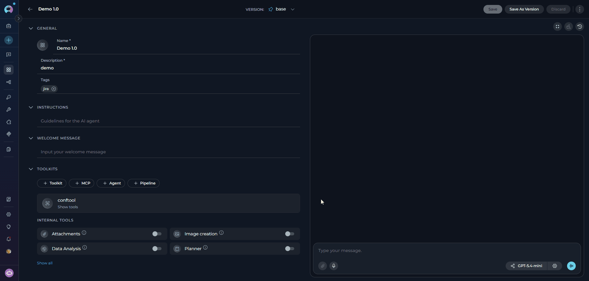

<Note>
Voice Input uses a server-side ASR (automatic speech recognition) model if configured in **Settings** > **AI Configuration**, or falls back to the browser's built-in Web Speech API. If neither is available, the microphone icon is hidden.
</Note>

---

### Text-to-Speech

**Text-to-Speech** reads agent responses aloud. A **Read out** button (megaphone icon) appears in the action bar below each agent response when the message contains speakable text.

**How to use Text-to-Speech:**

1. Select the **Read out** (megaphone) button below an agent response to start playback.
2. The text is highlighted as it is read aloud.
3. A playback pill appears in the input area with **Pause** and **Resume** controls.
4. Select **Pause** to stop playback mid-sentence; select **Resume** to continue from where it left off.

   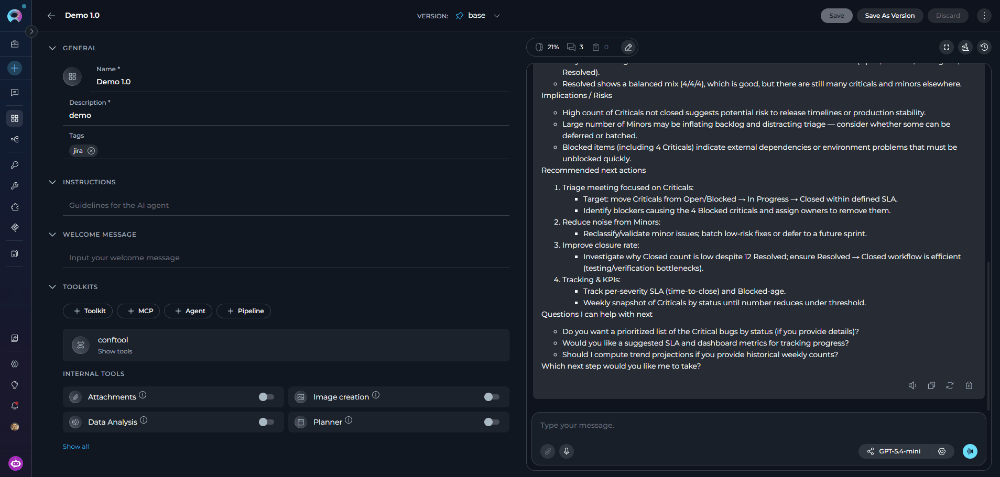

<Note>
When a TTS model is configured in **Settings** > **AI Configuration**, ELITEA uses that model for audio generation. If no TTS model is configured, playback falls back to the browser's built-in SpeechSynthesis API.
</Note>

---

### Speaking Mode

**Speaking Mode** is a continuous, hands-free voice loop. Once activated, ELITEA automatically records your speech, sends your prompt after a pause, plays back the agent's response, and then starts listening again—without any manual interaction between turns.

**How to activate Speaking Mode:**

1. Leave the message input field empty.
2. Select the **voicewave** icon (shown in place of the Send button when the input is empty) to enter Speaking Mode.
3. A voicewave pill with an **Exit** (✕) button replaces the send button, indicating Speaking Mode is active.
4. Speak your prompt. After three seconds of silence, your message is automatically sent.
5. The agent response streams in and is read aloud via Text-to-Speech.
6. Once the response finishes playing, recording starts again for the next turn.
7. Select the **✕** button in the voicewave pill to exit Speaking Mode at any time.

   

<Note>
Speaking Mode requires a voice recognition source (server ASR model or browser Web Speech API) for input and uses Text-to-Speech for output. If you start manual voice input while Speaking Mode is active, Speaking Mode is automatically deactivated.
</Note>

---

## Agent Evaluation

Agent Evaluation provides a comprehensive framework for measuring and improving agent performance through dimensions, test cases, and automated scoring. You can create evaluation suites that test your agent against predefined criteria and receive actionable feedback on how to improve instructions and behavior.

**Access Agent Evaluation:**

1. Open any saved agent.
2. Select the **three-dot menu (⋮)** in the agent tab bar.
3. Select **Evaluate (Beta)**.
4. The Agent Evaluation page opens with tabs for Suites, Dimensions, Datasets, and History.

     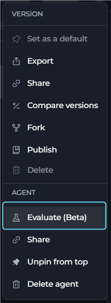

**Key Capabilities:**

- **Dimensions**: Define scoring criteria (for example, relevance, tone, accuracy) that can be scored by AI, humans, or custom code validation scripts.
- **Datasets**: Create collections of test cases with inputs and expected outputs to run against your agent.
- **Suites**: Combine dimensions and datasets into evaluation suites that score agent responses across multiple criteria.
- **Runs**: Execute evaluation suites to generate scored results and identify areas for improvement.
- **Enhance with AI**: Analyze failed checks and generate suggested fixes for your agent instructions or evaluation criteria.

<Info>
For complete details on creating dimensions, datasets, suites, running evaluations, and using AI-powered enhancement features, see [**Agent Evaluation**](../how-tos/agents-pipelines/agent-evaluation) and [**Agent Evaluation FAQ**](../how-tos/agents-pipelines/agent-evaluation-faq).
</Info>

---

## Create & Manage Versions

To manage your agent, you must understand how to save and create versions. Follow these guidelines to save your agent, create versions, and manage them.

**Save an Agent:**

- To save your work on an agent for the first time, select the **Save** button. This creates the "**base**" version of your agent.
- You can continue to modify your agent and save the changes to the "**base**" version at any time by selecting the **Save** button again. To discard any changes made, select the **Discard** button before saving.

The "**base**" version represents the initial version you create. You can keep updating this version with your changes by saving them, without creating additional versions for your agent.

### Create New Versions

For instances where you must create and manage different iterations of your agent:

1. **Start a New Version**: Select the **Save As Version** button.
2. **Name Your Version**: Provide a version name that clearly identifies the iteration or changes made. Select **Save** to confirm your entry.
    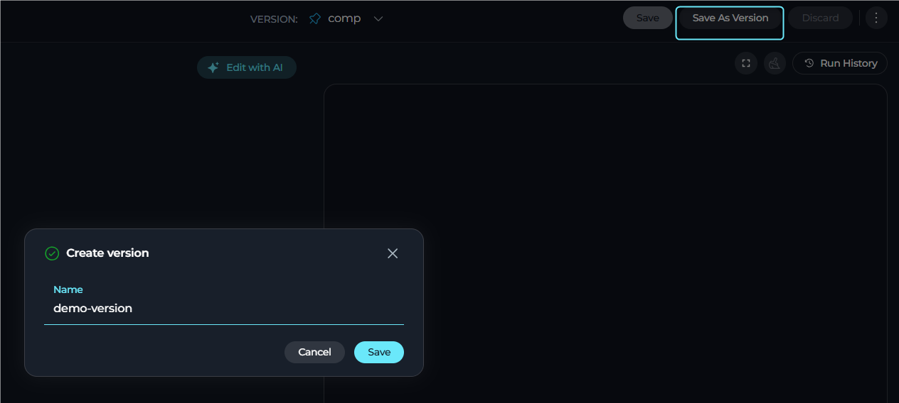

**Navigate Between Versions:**

Use the **Version** dropdown selector in the agent tab bar to switch between different versions. The version selector displays:

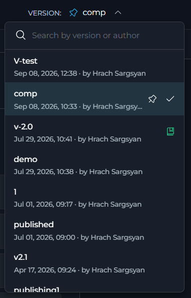

- **Version Name**: The name you assigned when creating the version.
- **Creation Metadata**: Date, time, and author information (format: Month DD, YYYY, HH:MM · by Author Name).
- **Status Indicators**:
  - **Pin icon**: Marks the default version (the version that opens when you first access the agent).
  - **Published icon**: Shows versions that have been published to Agents HUB.
- **Sorting**: Versions are sorted newest first by creation date. The "base" version always appears at the bottom of the list.

You can search within the version dropdown by typing the version name, author name, or author email to quickly locate specific versions.

<Info>
For detailed information on version management, naming conventions, and best practices, see the [**Entity Versioning guide**](../how-tos/agents-pipelines/entity-versioning).
</Info>

### Compare Versions

The **Compare Versions** feature lets you view side-by-side differences between two agent versions and selectively adopt changes from one version to the other without manual retyping.

**Access Compare Versions:**

1. Open any saved agent with at least two versions.
2. Select the **three-dot menu (⋮)** in the agent tab bar.
3. Select **Compare Versions**.
    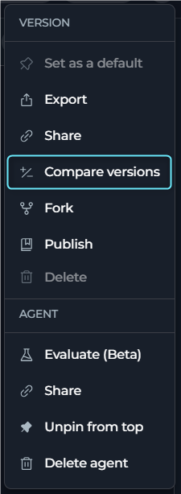
4. The Compare Versions dialog opens with the current version pre-selected under the **Base version**.
5. From the **Compare with** dropdown, select the version you want to compare against.
6. Select **Compare** to load both versions and enter the comparison wizard.
    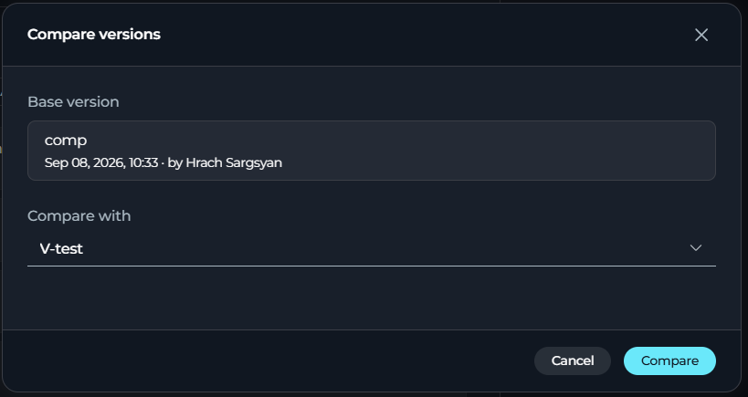

**How Compare Versions Works:**

The wizard presents a step-by-step comparison across different configuration areas:

1. **Comparison Steps**:
   - **Instructions**: View a diff of the instructions field showing added, removed, and unchanged text.
   - **User Interaction**: Compare Welcome Message and Conversation Starters side-by-side.
   - **Tools & Skills**: See which toolkits, MCPs, agents, pipelines, and skills were added, removed, or kept the same between versions.
2. **Make Changes**: For each comparison step, you can selectively adopt changes from either version or keep both versions unchanged. Each editable section (Instructions, Welcome Message, Conversation Starters) has its own **Save** button to apply changes immediately.

    

<Note>
Compare Versions is read-only until you actively choose to adopt changes. Closing the dialog without saving discards all pending adoptions.
</Note>

<Tip>
Use Compare Versions when you have made parallel changes in different versions and want to merge specific improvements without overwriting entire configurations.
</Tip>

### Publish an Agent Version

The **Publish** functionality lets you make a specific `Draft` version of your agent available in [Agents HUB](./agents-studio)—a shared library accessible to all users in your ELITEA installation. Publishing uses a guided three-step wizard with AI-powered automated validation that checks your agent before it can be submitted.

**Publish an Agent Version:**

1. Open the agent and select the **Draft** version you want to publish using the version selector.
2. Select the **three-dot menu (⋮)** in the agent tab bar and select **Publish**.
3. In the **Preparation** step, enter a version name and accept the Publishing Terms, then select **Continue**.
4. The **AI Validation** step runs automatically—review the result (PASS, WARN, or FAIL). Address any critical issues if needed.
5. Select **Publish** to submit. On success, the version is immediately live in Agents HUB.

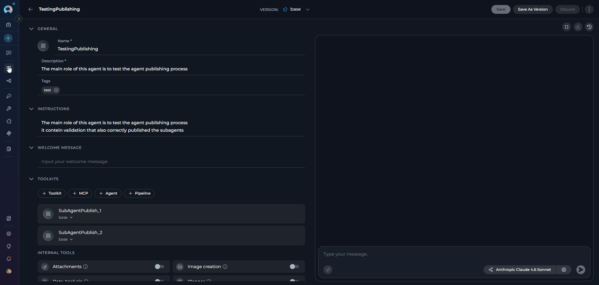

**What happens after publishing:**

- The version status updates to `Published` and appears in your **Published** tab.
- Community users can find and use the agent in Agents HUB without needing project access.
- You can unpublish at any time using the **Unpublish** option in the three-dot menu.

<Info>
For the complete publishing flow—including validation details, token expiry, sub-agent handling, and troubleshooting—see the [**Agent Publishing guide**](../how-tos/agents-pipelines/agent-publishing).
</Info>

### Export & Import Agents

ELITEA lets you export the currently selected version of an agent as a file and import it into another project, making it easy to back up, share, and migrate your work. Export and import are always version-specific—there is no option to export the entire agent with all its versions at once.

**Export an Agent Version:**

1. Open the agent and select the **version** you want to export using the version selector.
2. Select the **three-dot menu (⋮)** in the toolbar.
3. Select **Export**. The file downloads automatically to your device.
   - If the selected version has no nested dependencies, a single **`.md`** file is downloaded.
   - If the selected version references other agents as toolkits, the export is a **`.zip`** file containing all dependencies.

**Import an Agent:**

1. In the **Agents** dashboard, select the **Import** button in the toolbar.
2. Upload the `.md` or `.zip` file previously exported from ELITEA.
3. The Import Wizard displays entity cards for the main agent and any nested dependencies. Review the configuration before confirming.
4. Select **Import** to complete. The agent appears in the current project.

<Info>
After import, toolkits requiring authentication will need their credentials reconfigured manually.
</Info>

<Info>
For complete details on file formats, nested dependencies, and advanced options, see the [**Import/Export Agents and Pipelines guide**](../how-tos/agents-pipelines/import-export).
</Info>

---

### Fork Agents

Forking copies the currently selected version of an agent from one project to another within the same ELITEA environment—no file download required. Only one version is forked at a time; there is no option to fork the entire agent with all its versions.

**Fork an Agent Version:**

1. Open the agent and select the **version** you want to fork using the version selector.
2. Select the **three-dot menu (⋮)** in the toolbar and select **Fork**.
3. In the **Fork parameters** wizard, choose a **target project** from the dropdown. No project is pre-selected; you must pick one manually.
4. Review the entity cards—the main agent card and any nested agent dependencies that will be forked automatically.
5. Select **Fork**. When complete, select **Got it** to go directly to the forked agent in the target project.

<Info>
  - Only the currently selected version is forked.
  - If the agent uses other agents as toolkits (nested dependencies), those are automatically included.
  - Model settings are preserved if the model is available in the target project; otherwise the first available model is used.
  - Credentials for toolkits must be reconfigured manually after forking.
</Info>

<Info>
For complete details and pipeline forking, see the [**Fork Agents and Pipelines guide**](../how-tos/agents-pipelines/forking).
</Info>

---

## View Agent History

The **Run History** panel provides a complete audit trail of all past executions of your agent.

<Note>
In team projects, regular users can view only their own runs in the **Run History** panel. Only administrators can see runs created by other users.
</Note>

**Access Run History:**

1. Open any saved agent.
2. In the right panel (embedded chat area), select the **clock icon** (🕐) in the top bar. The tooltip reads *"View run history"*.
3. The agent page is replaced by the two-panel Run History display. Select the **✕ (Close)** button in the top-left to return.

**What Run History shows:**

- **Review past conversations**: View complete chat histories from previous agent runs.
- **Track performance**: Monitor execution duration across different versions.
- **Debug issues**: Replay conversations to identify where problems occurred.
- **Compare versions**: See how different agent versions performed with the same inputs.
- **Audit trail**: Maintain records of all agent interactions for compliance purposes.

**Run History layout:**

The Run History panel uses a two-panel layout:

- **Left panel**—sortable list of all past runs. Select any column header to sort by that column:
  | Column | Description |
  | --- | --- |
  | **Date** | Timestamp of the run in `dd-MM-yyyy, hh:mm a` format |
  | **Version** | Agent version used for the run |
  | **Duration** | Total execution time of the run |
  Select a row to load the conversation replay in the right panel.
  Each row also has a **three-dot menu (⋮)** with the following actions:
  | Action | Description |
  | --- | --- |
  | **Share link** | Copies a direct URL to this run to the clipboard |
  | **Delete** | Permanently removes this run record (with confirmation prompt) |
  | **Restore conversation** | Pre-populates the embedded test chat with the selected run's message history. Note: restores chat history only—agent configuration, instructions, and tool settings are **not** reverted. |
  The list supports infinite scroll—additional runs load automatically as you scroll down.
- **Right panel**—full conversation replay of the selected run.

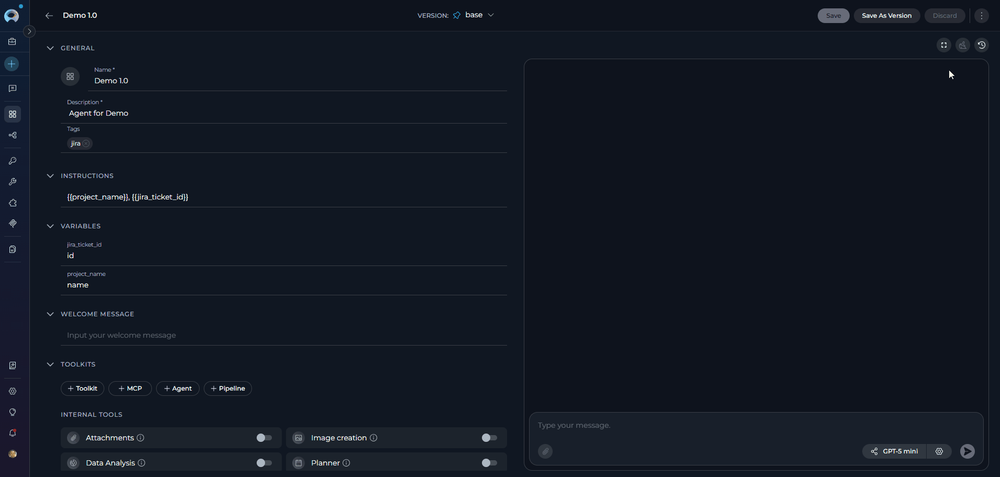

<Info>
For detailed instructions on using the History panel, see the [**Agents and Pipelines History guide**](../how-tos/agents-pipelines/agents-pipelines-history).
</Info>

## Best Practices

<Accordion title="Write Clear Instructions">
  Provide specific, actionable instructions that clearly define your agent's behavior and goals. Use examples and step-by-step guidance.
</Accordion>

<Accordion title="Test Your Agent Thoroughly">
  Test your agent with various inputs before deploying it. Use conversation starters to verify expected behavior.
</Accordion>

<Accordion title="Use Version Management">
  Create named versions for significant changes. This lets you roll back if needed and compare different iterations.
</Accordion>

<Accordion title="Monitor Agent Performance">
  Regularly review agent history to identify issues, track performance, and understand how users interact with your agent.
</Accordion>

<Accordion title="Keep Toolkits Updated">
  Ensure connected toolkits have valid credentials and up-to-date configurations. Test toolkit integrations regularly.
</Accordion>

<Accordion title="Turn On Context Management">
  For long conversations, turn on context management to optimize token usage and maintain conversation quality.
</Accordion>

---

## Troubleshooting

<Accordion title="Agent Not Responding or Slow">
  Check your AI model selection and settings. High reasoning levels or large token limits may slow responses. Verify toolkit connections are working.
</Accordion>

<Accordion title="Unexpected or Incorrect Outputs">
  Review agent instructions for clarity. Ensure toolkits are properly configured. Check conversation history to understand context issues.
</Accordion>

<Accordion title="Toolkit Integration Failures">
  Verify credentials are valid and not expired. Test the toolkit independently using the Test Settings panel. Check network connectivity and permissions.
</Accordion>

<Accordion title="Cannot Publish Agent">
  Ensure you have publishing permissions. Check that all required fields are completed. Review moderation guidelines if submission was rejected.
</Accordion>

<Accordion title="Version Not Available">
  Verify the version was saved successfully. Check permissions if trying to access another user's version. Refresh the page and try again.
</Accordion>

<Accordion title="Agent Not Appearing in List">
  Clear search filters and check status filters. Verify you are in the correct project. Refresh the agents dashboard.
</Accordion>

You can find answers to common questions or solutions to known issues in the broader ELITEA documentation. For further assistance, contact your platform administrator.

### Support

If you encounter issues not covered in this guide or need additional assistance with agent management, see [**Contact Support**](../support/contact-support) for detailed information on how to reach the ELITEA Support Team.

---

<Info>
  For more detailed information on related topics, see the following documentation:

  - [**Sensitive Action Authorization Guardrail**](../how-tos/chat-conversations/sensitive-action-authorization-guardrail) - Learn how the guardrail intercepts sensitive tool calls mid-execution and requires human approval before proceeding.
  - [**Skills**](./skills) - Create and manage reusable instruction sets to attach to agents.
  - [**Build Agent with AI**](../how-tos/agents-pipelines/build-agent-with-ai) - Generate a complete agent draft from a plain-language description.
  - [**Project Context**](./settings/project-context) - Define shared background context injected into every AI interaction in the project.
  - [**Credentials**](./credentials) - Learn how to create and manage credentials for toolkit integrations.
  - [**Glossary**](../home/glossary) - Definitions of key terms and concepts used in the ELITEA platform.
  - [**How to Create and Edit Agents from Canvas**](../how-tos/chat-conversations/how-to-create-and-edit-agents-from-canvas) - Create and configure agents directly from chat interface.
  - [**How to Create and Edit Toolkits from Canvas**](../how-tos/chat-conversations/how-to-create-and-edit-toolkits-from-canvas) - Set up toolkit integrations from conversations.
  - [**How to Create and Edit Pipelines from Canvas**](../how-tos/chat-conversations/how-to-create-and-edit-pipelines-from-canvas) - Design multi-step workflows from chat.
  - [**How to Create and Edit MCPs from Canvas**](../how-tos/chat-conversations/how-to-create-and-edit-mcps-from-canvas) - Configure Model Context Protocol servers from chat.
</Info>
