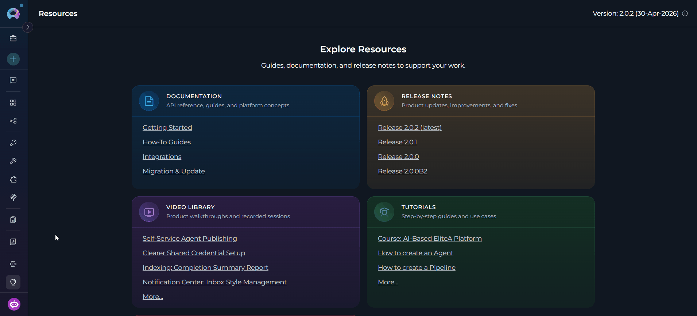
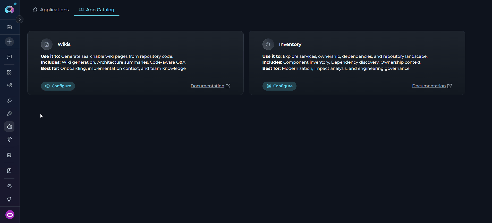
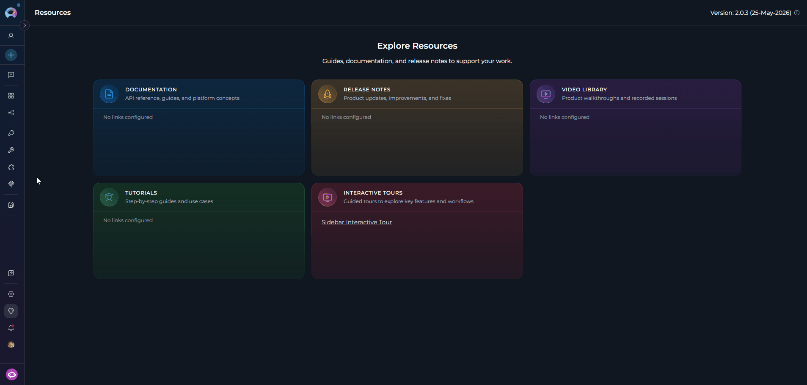

## Overview

The ELITEA Applications menu provides access to purpose-built integrations that extend the platform with specialized, application-level capabilities. Unlike general-purpose toolkits, Applications are complete, deployable solutions—each one covering a focused domain such as documentation generation or codebase exploration—and they expose their own interface directly inside ELITEA.

**Why Use Applications?**

Applications let teams activate powerful, ready-made workflows without building them from scratch:

<CardGroup cols={2}>
  <Card title="Focused Functionality" icon="bullseye">
    Each application addresses a specific engineering problem—generating wikis, mapping code ownership, or exploring dependencies—rather than providing generic AI assistance.
  </Card>
  <Card title="Integrated Experience" icon="plug">
    Applications open their own interface inside the platform, so there is no need to leave ELITEA or switch context to a separate tool.
  </Card>
  <Card title="Access Control" icon="lock">
    Administrators control which applications are available to each project. If an application is not yet enabled, any team member can submit a request for access.
  </Card>
  <Card title="Quick Deployment" icon="rocket">
    Once access is granted, configuring an application takes only a few minutes—connect a repository toolkit, select an AI model, and the application is ready to use.
  </Card>
</CardGroup>

**Available Applications**

ELITEA ships with the following applications:

<CardGroup cols={2}>
  <Card title="Wikis" icon="book">
    Turns a code repository into navigable documentation with architecture summaries, source-linked explanations, and project Q&A support.
  </Card>
  <Card title="Inventory" icon="layer-group">
    Helps teams inspect the code estate, map key components, and understand service relationships and ownership before planning changes.
  </Card>
</CardGroup>

## Navigating the Applications Menu

The Applications menu is accessible from the main platform navigation sidebar. The section is divided into two tabs: **Applications** and **App Catalog**.

If no applications have been configured yet in your project, the menu opens on the **App Catalog** tab automatically.

---

### Applications Tab

The **Applications** tab lists all application instances that have been configured for the current project. Each configured application appears as a card showing the application name, description, and status.

**View Options**

- **Card View** — Visual cards displaying the application name, description, and key metadata. Ideal for browsing configured applications at a glance.
- **Table View** — Organized list format with columns for detailed information. Better for projects with many configured applications.

Switch between views using the view toggle button in the top area of the dashboard.

**Filtering by Type**

A **Types** panel on the right side lists all application types in the project. Click a type to filter the list; click multiple types to combine filters; click again or use **Clear** to reset. Active filters are reflected in the URL.

**Pinning Applications**

Pin frequently used applications to keep them at the top of the list for quick access. Click the pin icon on an application card or table row to pin it; click again to unpin.

**Accessing a Configured Application**

Click on any application card (or table row) to open its detail view.

---

### App Catalog Tab

The **App Catalog** tab shows all applications available on the platform. Each catalog entry provides a summary of what the application does, what it includes, and who it is best suited for.

**Catalog Card Details**

Each application card in the catalog displays:

- **Use it to** — a concise statement of the application's primary purpose
- **Includes** — a list of the capabilities bundled with the application
- **Best for** — the scenarios or team roles the application targets
- **Status tag** — one of three states:
  - **Available** — your project has access and the application can be configured
  - **Configured** — at least one instance of this application has already been set up in your project
  - **By request** — your project does not yet have access; submit a request to enable it

**Catalog Actions**

Depending on your project's access level, each card shows one of the following primary actions:

| Action | When shown | What it does |
|---|---|---|
| **Configure** | Access is granted (`Available` or `Configured`) | Opens the application configuration form |
| **Request Access** | Access is not yet granted (`By request`) | Opens the request modal to submit an access request |
| **Pending approval** | A request has been submitted and is awaiting review | Indicates the request is in review; no further action needed |

Every card also includes a **Documentation** link that opens the application's external reference documentation in a new tab.

---

## Configuring an Application

To set up a new application instance, start from the **App Catalog** tab:

1. Open the **Applications** menu and switch to the **App Catalog** tab.
2. Locate the application you want to configure (e.g., **Wikis** or **Inventory**).
3. Click the **Configure** button on the application card.

   <Note>
   The **Configure** button is only shown when your project has been granted access to that application. If you see **Request Access** instead, submit a request first and wait for approval before proceeding.
   </Note>

4. The configuration form opens. Fill in the required fields (see the application-specific sections below for details).
5. Click **Save** to create the application instance.

After saving, the new instance appears on the **Applications** tab. Click on it to open the application interface.

<Tip>
  You can also reach the configuration form by clicking the **+ Create** button in the top of the main sidebar while the **Applications** tab is active. This navigates directly to the App Catalog.
</Tip>

---

### Wikis

<Info>
  For full usage details, see the [**Wikis documentation**](../integrations/apps/wikis).
</Info>

The **Wikis** application (powered by DeepWiki) generates searchable, AI-authored wiki pages from a connected code repository. It produces architecture summaries, source-linked documentation, and supports natural language Q&A about the codebase.

**Best for**: Onboarding new team members, capturing implementation context, and building a shared knowledge base.

**Configuration Fields**

| Field | Required | Description |
|---|---|---|
| **Code Toolkit** | Yes | The repository integration (GitHub, GitLab, Bitbucket, or Azure DevOps Repos) that Wikis will index |
| **LLM Model** | Yes | The language model used to generate wiki content |
| **Max Tokens** | Yes | Maximum token budget for LLM responses (default: 64,000) |
| **Embedding Model** | Yes | The embedding model used for semantic search and Q&A within the wiki |

Once configured, the Wikis application opens its own embedded interface where you can browse generated wiki pages, explore architecture diagrams, and ask questions about the connected repository.

---

### Inventory

<Info>
  For full usage details, see the [**Inventory documentation**](../integrations/apps/inventory).
</Info>

The **Inventory** application builds and queries a knowledge graph of your codebase. It maps services, components, dependencies, and ownership relationships so teams can understand the code estate before planning migrations, refactors, or modernization efforts.

**Best for**: Modernization projects, impact analysis, and engineering governance.

**Configuration Fields**

Inventory uses the standard toolkit configuration form. Connect it to one or more repository toolkits and configure the AI model settings to enable graph construction and retrieval.

Once configured, the Inventory application provides tools for:

- Searching entities by name, type, layer, or source
- Inspecting individual components with their properties and relationships
- Mapping dependencies across services and modules

---

## Requesting Access

If an application shows **By request** status, your project has not been granted access to configure it. To request access:

1. Click the **Request Access** button on the application catalog card.
2. In the modal that appears, enter a **Reason** describing your project details and use case.
3. Click **Submit** to send the request.

After submitting, the card shows **Pending approval** with a clock icon. Requests are reviewed by an ELITEA administrator. You will be notified when the request is approved or rejected.

<Note>
If you have questions about the access request process or need assistance, contact the ELITEA support team at **SupportAlita@epam.com**.
</Note>

---

