## Introduction

The Artifacts menu provides a dedicated interface for managing artifact buckets and the files they contain. Use it to store, retrieve, and process files as part of automated agent workflows. This section describes the available features and how to use them.

## Navigate the Artifacts Menu

The Artifacts menu is accessible from the main platform navigation. Upon entering the Artifacts section, you see a dashboard displaying artifact buckets and their contained files.

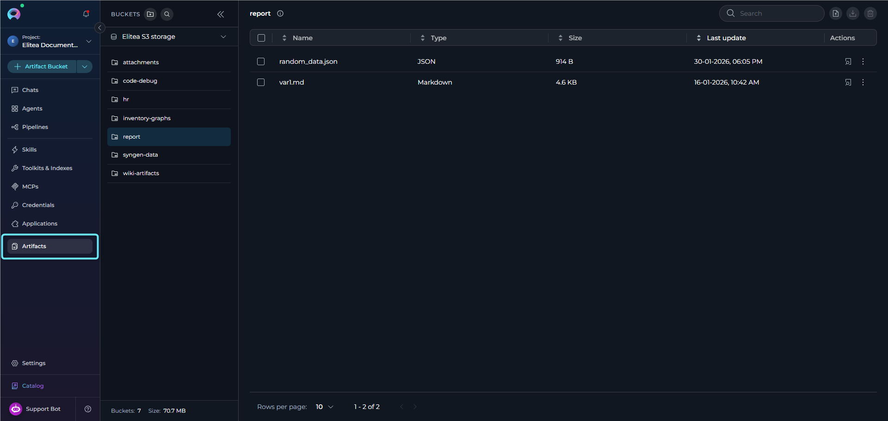

### Main Elements

* **Buckets Sidebar:**
    * A collapsible sidebar on the left displays all artifact buckets for the project.
    * Shows a hierarchical tree structure with expandable buckets.
    * Each bucket can be expanded to show its folder and file structure in a nested tree view.
    * Includes bucket search functionality and a storage selector at the top.
    * Displays bucket count and total size statistics at the bottom.
* **Bucket Header:**
    * Located at the top of the sidebar.
    * Contains the "Buckets" title.
    * **Create Bucket button**—Initiates the bucket creation process.
    * **Search icon**—Activates bucket search functionality.
    * **Collapse/Expand icon**—Toggles sidebar visibility.
* **Storage Settings Selector:**
    * Located below the bucket header in the sidebar.
    * Displays the current storage configuration name and type.
    * Select to open a dropdown menu showing all available storage configurations.
    * Shows the storage type (for example, "S3 STORAGE") for each option.
* **Bucket Footer:**
    * Located at the bottom of the sidebar.
    * Displays "Buckets:" count showing the total number of buckets.
    * Displays "Size:" showing the total storage used across all buckets.
* **File Table:**
    * Located to the right of the bucket sidebar.
    * Displays files and folders for the selected bucket or folder.
    * Shows breadcrumb navigation at the top when navigating into folders.
    * File table columns: Name, Type, Size, Last update, Actions.
    * Supports drag-and-drop file upload directly into the table area.
    * Includes a search bar, upload button, download button, and delete button in the toolbar.
    * Bucket info tooltip shows the retention policy and file count.

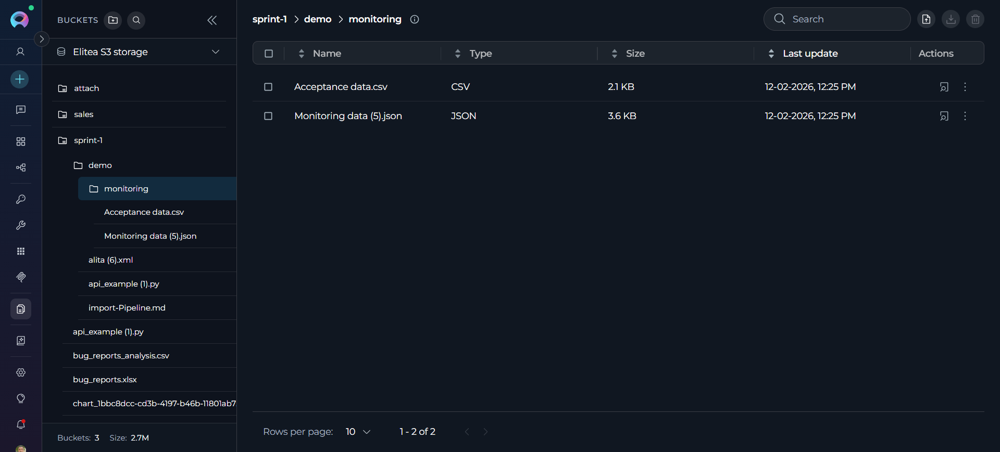

## Artifact Functionality

**Buckets Sidebar & Tree Structure**

* **Sidebar:** The sidebar on the left lists all artifact buckets for the project. The sidebar is collapsible, allowing users to show or hide it as needed for a more flexible workspace.
* **Tree Structure:** Buckets are displayed in a hierarchical tree view:
    * Select a bucket to view its contents in the file table.
    * Select a bucket again (when already selected) to expand or collapse its tree view.
    * Expanded buckets show their folder and file structure in a nested tree directly in the sidebar.
    * Folders are indicated with folder icons and can be expanded to show nested contents.
    * Files are displayed with their names and can be selected to preview.
* **Auto-expansion:** When a bucket is selected, it automatically expands to show its file tree structure in the sidebar.
* **Auto-selection:** When no bucket is selected, the system automatically selects the most recently active bucket based on file activity.
* **Bucket Sorting:** Pinned buckets always appear at the top of the sidebar list, above all other buckets. Below pinned buckets, the remaining buckets are sorted by recent activity, with the most recently used appearing first.

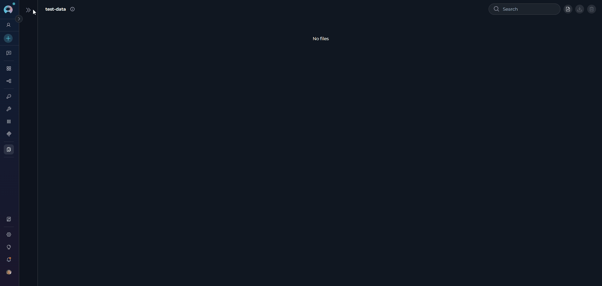

### Create a Bucket

1. **Initiate bucket creation:** Select the **+ Create Bucket** button located at the top of the sidebar.

2. **Bucket form:** A bucket creation form appears with the following fields:

    * **Name (Required):** Enter a unique name for the bucket.
        * Must start with a letter.
        * Can contain only letters, numbers, and hyphens.
        * Maximum length: 56 characters.
        * Default placeholder: "new-bucket".

    * **Retention Policy (Required):** Configure how long files are retained.
        * **Period Type:** Select from the dropdown (Days, Weeks, Months, Years).
        * **Value:** Enter a number (minimum: 1).

        <Warning title="Default Retention Policy">
            The default retention policy is set to one year. After the retention period expires, files in the bucket are automatically deleted and cannot be recovered. Set an appropriate retention period based on your data storage needs.
        </Warning>

3. **Save or cancel:**
    * Select **Save** to create the bucket with the specified configuration.
    * Select **Cancel** to discard and return to the bucket list.
    * The **Save** button is disabled if the name is invalid or missing.

4. **After creation:** The bucket appears in the bucket list.

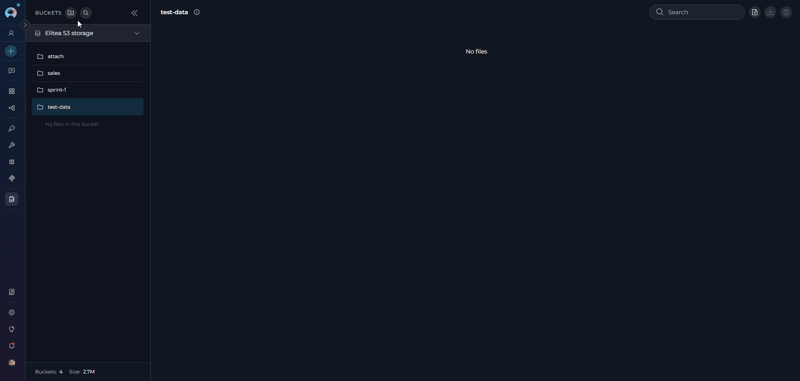

<Info title="Bucket Name Uniqueness">
If a bucket with the same name already exists in the selected storage, an error message appears: `Bucket with name [bucket-name] already exists`. Choose a different name to create a bucket.
</Info>

### Storage Settings

* **Storage Selector:** Located below the bucket header in the sidebar.
* **Current Storage Display:** Shows the selected storage configuration:
    * Storage configuration name or label.
    * Storage type in uppercase format (for example, "S3 STORAGE").
    * Select anywhere on the selector to open the storage menu.
* **Storage Selection Menu:** When opened, displays all available storage configurations:
    * Each storage option shows:
        * Storage configuration name or label.
        * Storage type (for example, "S3 STORAGE").
        * Checkmark icon next to the selected storage.
    * Select any storage option to switch to that configuration.
    * The menu automatically closes after selection.
* **Switching Storage:** When you switch storage configurations:
    * The bucket list updates to show buckets from the storage.
    * Any file selection is cleared.
    * The selection history for the previous storage is cleared.

### Search & Filter Buckets

* **Search Icon:** Located in the bucket header at the top of the sidebar.
* **Search Activation:**
    * Select the search icon to activate search mode.
    * If the sidebar is collapsed, selecting the search icon automatically expands the sidebar first.
    * Once activated, a search input field appears to enter search terms.
* **Bucket Search:**
    * Search buckets by name.
    * Results filter instantly as you enter text.
    * Shows "No buckets found" when the search returns no results, with the suggestion to "Try adjusting your search terms."
    * Clear the search to return to the full bucket list.
* **Storage Filter:** Use the storage selector dropdown to switch between different storage configurations if multiple are available.

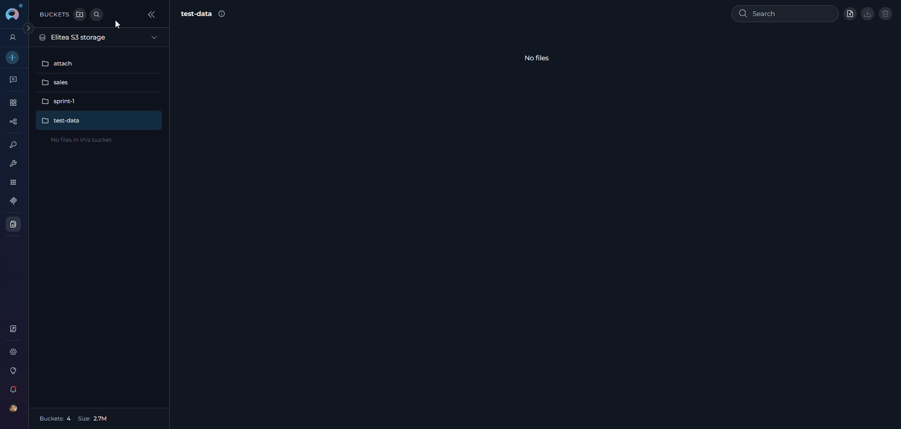

### Edit & Delete Buckets

**Pin a Bucket:**

1. **Pin to top:** Hover over a bucket in the sidebar to reveal the pin icon, then select it to pin the bucket. Pinned buckets move to the top of the sidebar list, above all activity-sorted buckets.
2. **Unpin:** Select the filled pin icon visible on any pinned bucket to unpin it. The bucket returns to its position in the activity-sorted list.
3. **Via context menu:** Select the three dots icon next to any bucket and select **Pin to top** or **Unpin from top** from the menu. Pinning does not require any special permissions.

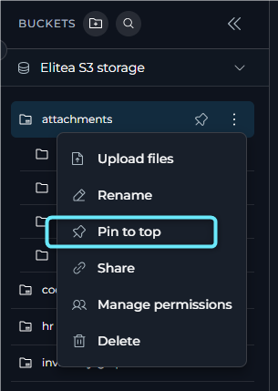

**Edit a Bucket:**

1. **Access edit mode:** In the bucket list, select the three dots icon next to the bucket you want to modify. A context menu with an **Edit** icon appears. Select **Edit**.
2. **Modify retention policy:** The **Edit Bucket** dialog opens, displaying the current retention policy. Modify the **Period Type** and **Value** as needed to set a retention period. Note that you cannot change the bucket name in edit mode.
3. **Permission-based access:** Edit functionality is available based on user permissions (bucket owner, or users with the `artifacts.buckets.update` permission).
4. **Save or discard changes:**
    * Select **Save** to apply the retention policy to the bucket.
    * Select **Cancel** to discard the changes and revert to the original retention policy.

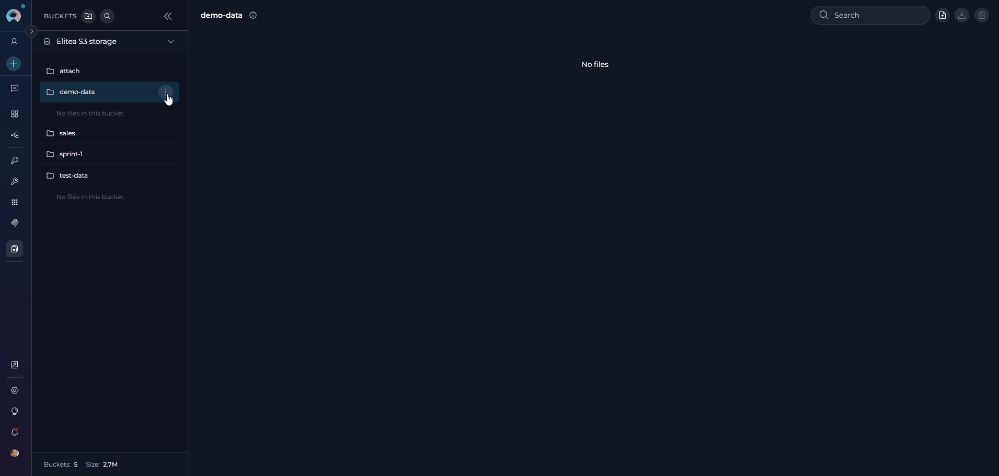

**Delete a Bucket:**

1. **Access delete mode:** In the bucket list, select the three dots icon next to the bucket you want to delete. A context menu with a **Delete** icon appears. Select **Delete**.
2. **Confirmation dialog:** A confirmation dialog appears, prompting you to confirm the bucket deletion.
3. **Delete bucket:** Select **Delete** in the confirmation dialog to permanently delete the bucket and all files it contains.

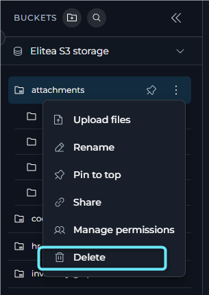

<Warning title="Warning">
Deleting a bucket is a permanent action. All files and folders within the bucket are deleted and cannot be recovered.

**Permission-based Access:** Delete functionality is available based on user permissions (bucket owner, or users with the `artifacts.buckets.delete` permission).

**Auto-selection After Deletion:** When a bucket is deleted, if it was the selected bucket, the system automatically selects the next available bucket to maintain workflow continuity.
</Warning>

### Manage Bucket Access

ELITEA includes a dedicated bucket access exceptions interface for managing per-user access to individual artifact buckets. This feature is available in team and public projects. It is not available in personal or private projects.

**Available access levels:**

| Access level | Behavior |
|---|---|
| **Read/write (default)** | The user inherits normal write access for the bucket. In the access-management UI, selecting this option removes the bucket-specific exception and returns the user to default access. |
| **Read-only** | The user can access the bucket in read-only mode. |
| **No access** | The user is explicitly blocked from accessing the bucket. |

**Add access exceptions:**

1. In the bucket list, open the bucket action menu and select **Manage permissions**.
2. The **Manage Permissions** dialog opens.
3. Review the **Exceptions** section:
    * If no exceptions exist, the dialog shows an empty state with the message **No exceptions added yet** and the note **All users have read/write permissions by default.**
    * If exceptions exist, the dialog shows the exceptions table together with a search field, an **Add exception** button, and an **Edit selected** action.
4. Select **Add exception**. The **Add exceptions** dialog opens.
5. In the **Add exceptions** dialog:
    * Use the **Users** picker to select one or more users.
    * Use the **Permissions** dropdown to choose one of the available exception values:
      * **Read-only**
      * **No access**
6. Select **Save** to create the exception entries for the selected users.

<video controls>
  <source src="../img/menus/artifacts/bucket-access-management.mp4" type="video/mp4"/>
  Your browser does not support the video tag.
</video>

<Info>
Only users who do not already have an exception for that bucket are shown in the add-user dialog.
</Info>

**Edit existing exceptions:**

* Use the edit action on a single row to change one user's bucket exception.
* Select multiple rows and apply a bulk edit to update several users at once.
* The edit dialog supports these values:
    * **Read/write (default)**
    * **Read-only**
    * **No access**

When **Read/write (default)** is selected during edit, ELITEA removes the bucket-specific exception for that user and restores default access behavior.

<Info title="How Bucket Exceptions Are Stored">
Bucket access exceptions are stored as per-bucket permission mappings. `Read-only` maps to `read`, `Read/write` maps to `read` + `write`, and `No access` stores an explicit empty permission list for that bucket.
</Info>

## Upload Files to a Bucket

There are three ways to upload files to a bucket:

1. **Drag and drop:** Drag files from your computer's file explorer and drop them directly into the file table area. A bucket or folder must be selected first.

     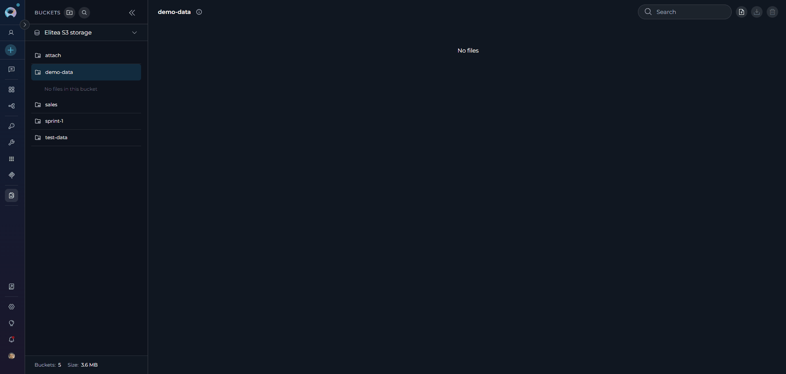

2. **Upload button:** Select the cloud upload icon in the file table toolbar to open a file browser and select files to upload. A bucket or folder must be selected.

     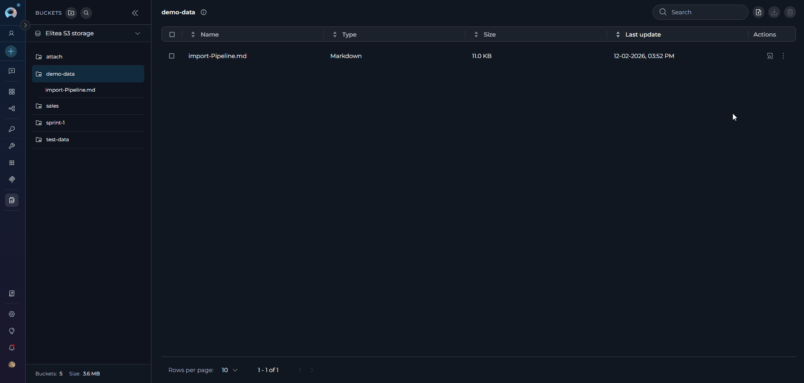

3. **Bucket action menu:** Select the three dots icon next to any bucket in the sidebar and select **Upload files** from the context menu to upload directly to that bucket.

<Info title="Multiple File Selection">
You can select multiple files at once from your computer's file browser. All selected files are uploaded together.
</Info>

### Upload Path Dialog

For all three upload methods, after you select files from your computer's file browser, the **Upload Path Dialog** opens to let you specify the upload destination:

* **Purpose:** Allows you to specify a folder path (new or existing) where the selected files are uploaded.
* **Current Location:** Shows the selected bucket name and current folder path if applicable.
* **Folder Path Input:**
    * Enter a folder path to organize files (for example, "data/reports" or "images/icons").
    * Use "/" to create nested folders.
    * Leave empty to upload to the bucket root or current folder if already inside a folder.
    <Warning title="Path validation">
        * Cannot start with "/".
        * Cannot contain consecutive slashes "//".
        * Folder names must contain only letters, numbers, dots, hyphens, and underscores.
        * The bucket name path cannot be deleted or edited.
    </Warning>
* **Folder Depth Limit:** Maximum folder depth is 10 levels.
    * The dialog shows the current folder depth and prevents exceeding the limit.
    * If already at maximum depth, the folder path input is disabled.
* **Actions:**
    * Select **Cancel** to abort the upload.
    * Select **Upload** to confirm and upload the selected files to the specified path.

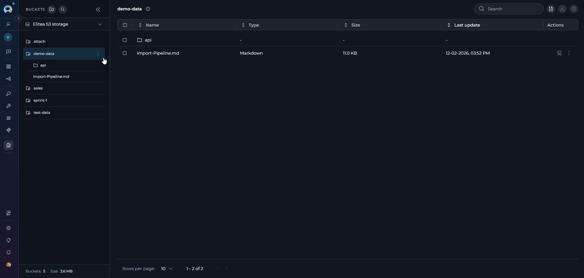

<Info title="Duplicate File Handling">
If files with the same name already exist in the bucket, a confirmation dialog appears:

* Lists all duplicate filenames.
* Warns that uploading overrides existing files.
* Provides options to proceed or cancel.
* Once confirmed, files are overwritten without additional prompts.

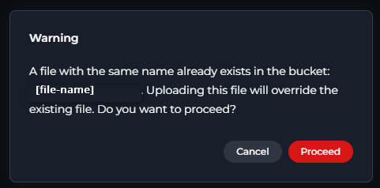
</Info>

**Supported File Types:**

All file types are accepted. Multiple files can be uploaded simultaneously.

| Category | File Types |
|----------|------------|
| **Programming Languages** | Python, JavaScript, TypeScript, Java, C++, C#, Go, Rust, PHP, Ruby, Perl, Lua, Dart, Kotlin, Swift, Scala, R |
| **Data Formats** | JSON, CSV, TSV, SQL, YAML, XML, JSONL, NDJSON |
| **Documents** | Markdown, MDX, Text, PDF, Word (DOC, DOCX), Excel (XLS, XLSX), PowerPoint (PPT, PPTX) |
| **Configuration Files** | .env, .config, .properties, YAML, TOML, INI, .gitignore, .editorconfig, .eslintrc, .prettierrc |
| **Web Technologies** | HTML, CSS, SCSS, Sass, Less, SVG |
| **Images** | JPEG, PNG, GIF, BMP, WebP, ICO |
| **Archives** | ZIP, TAR, GZ, RAR, 7Z |
| **Shell Scripts** | Bash, Zsh, PowerShell |
| **Build Files** | Dockerfile, Makefile, Gradle, Maven POM, CMake |
| **Other** | Log files, Patch files, Feature files, LaTeX, reStructuredText |

---

## View & Manage Files in a Bucket

The following features are available when you select a bucket and view its files in the file table.

* **Select a bucket:** Select a bucket in the sidebar to view its files in the file table.
* **File Table:** The table displays files and folders with the following columns:
    * **Name**—File or folder name (folders always appear first, sorted separately from files).
    * **Type**—File type.
    * **Size**—File size.
    * **Last update**—Last modification date and time in format "dd-MM-yyyy, hh:mm a".
    * **Actions**—View/Edit file, Download, Delete buttons for files.
* **Folder Navigation:**
    * **Breadcrumb Navigation:** When inside a folder, breadcrumbs appear at the top of the file table showing the current path.
        * Format: `[bucket name] > [folder1] > [folder2]` (with arrow separators).
        * Select any breadcrumb segment to navigate back to that level.
    * **Navigate into Folders:** Select a folder row in the table to navigate into it.
    * **Tree View Navigation:** In the sidebar tree, select folders to expand or collapse them, or select to navigate.
* **File List Features:**
    * **Pagination:** Pagination controls appear below the file list (default: 50 files per page).
    * **Items Per Page:** Use the "items per page" selector to choose: 10, 25, 50, or 100 files per page.
    * **Sorting:** Select column headers ("Name," "Type," "Size," "Last update") to sort in ascending or descending order.
    * **Search:** Use the search bar in the toolbar to filter files by name.
    * **Selection:** Checkboxes allow selecting multiple files for batch operations (download or delete).

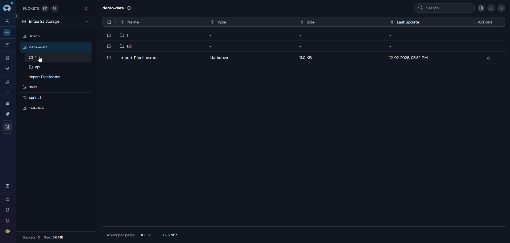

### Preview a File

To preview a file, you can:

* **Select a file in the bucket tree:** Select any file in the expanded bucket tree structure in the sidebar.
* **Select the View/Edit File icon:** In the file table, select the View/Edit icon (eye symbol) on the right side of the file entry.

Files must be under the size limit for preview (varies by file type, with flexible limits based on file content). The file opens in Canvas Mode, providing a full-featured preview experience without leaving the Artifacts page.

**Preview Features:**

* **Canvas-like interface:** Files open in a dedicated preview panel with header controls and a content area.
* **Language detection and selection:** Automatic programming language detection with manual override option via dropdown selector.
* **Multiple view modes:** Support for different rendering modes depending on file type:
  * **Text and code files:** Displayed with syntax highlighting, line numbers, and proper formatting for 50+ supported programming languages and file types.
  * **Markdown files:** Toggle between **Code** (source code with syntax highlighting) and **Rendered** (formatted output) modes.
    * **MDX files (.mdx):** Toggle between **Raw** and **Preview** modes. Preview mode evaluates MDX content and renders supported components such as headings, links, tables, alerts, callouts, cards, badges, and dividers.
  * **CSV/TSV files:** Toggle between **Code** (text view) and **Rendered** (formatted table) modes for better data visualization.
  * **Image files:** Direct image preview with proper scaling and centering.
  * **Mermaid Diagram files (.mermaid, .mmd):** Toggle between **Code** (source) and **Rendered** (visual diagram) modes to view both the code and the visual diagram.
  * **DOCX files (.docx):** Open directly in a full WYSIWYG document editor with a formatting toolbar, ruler, and zoom control. Edit content in-place and save changes back to the bucket.
* **Supported file types:** Includes text, Markdown, CSV, TSV, Mermaid, DOCX, image, and code files with various programming language extensions.

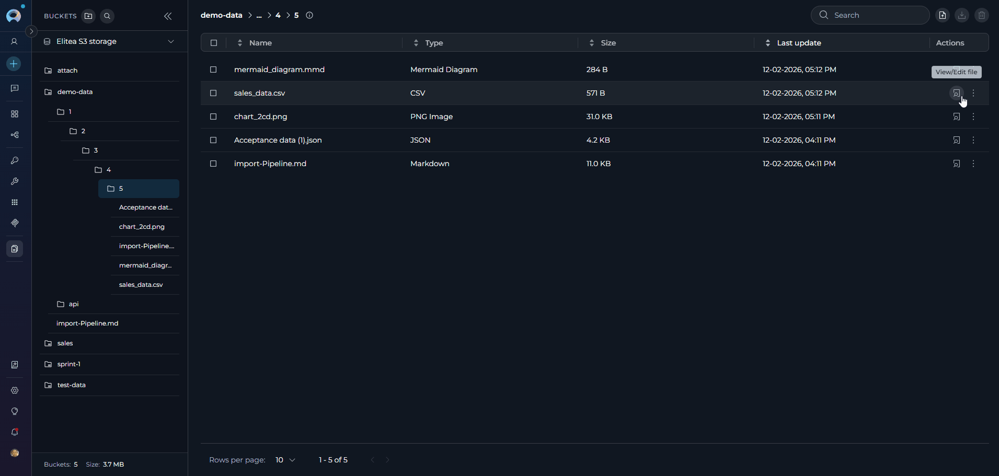

**Preview Controls:**

* **Copy functionality:** Copy the entire file content or selected portions using the **Copy** button in the preview toolbar.
* **Language override:** Manually select the syntax highlighting language from an extensive list of supported programming languages.
* **Close/Navigation:** Select the close button to return to the file list.
* **Auto-detection:** Supports a wide range of file types including programming languages, configuration files, documentation formats, data files, and more.

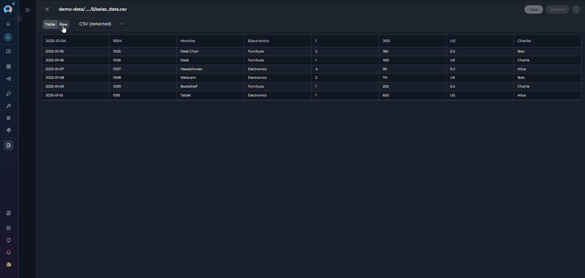

<Info title="File Preview Requirements">
**File type requirements:**

Preview is available only for supported file types including programming languages (Python, JavaScript, Java, C++, etc.), data formats (JSON, CSV, YAML, XML), configuration files, web technologies (HTML, CSS), Markdown and MDX files, images (JPEG, PNG, GIF, SVG), Word documents (DOCX), and special files (Dockerfile, Makefile, .gitignore). Binary files and unsupported formats cannot be previewed.

**File size limit:**

Preview is available for files under 2&nbsp;MB. Files exceeding this limit show a "File too large to preview" message with a download option.

This feature supports comprehensive inspection of file contents directly within the Artifacts interface, streamlining workflow and reducing context switching.
</Info>

### Edit Files in Artifacts

Canvas file editing allows you to edit files directly within the Artifacts interface without using external tools. You can work with code files, text documents, data files (CSV/TSV), Word documents (DOCX), and special formats like Markdown and Mermaid diagrams.

**How to edit files:**

1. **Open the file:** Select a file in the bucket tree structure or select the **View/Edit File icon** (eye symbol) in the file table.
2. **Edit in Canvas Mode:** The file opens in a dedicated preview panel with editing capabilities:
    * **Code Editor:** Syntax highlighting, language dropdown, Find/Replace, code folding, Copy functionality, Undo/Redo.
    * **Table Editor:** Toggle **Raw/Table** modes, edit cells, add or remove rows and columns, sort, filter, export to XLSX.
    * **Markdown Editor:** Toggle **Raw/Preview** modes, edit Markdown source, view rendered output.
    * **Mermaid Diagram Editor:** Edit diagram code in Raw mode, toggle to **Diagram** mode for visual diagram preview, export PNG, JPG, or SVG.
    * **DOCX Editor:** Full WYSIWYG editor for `.docx` files—formatting toolbar (bold, italic, alignment, fonts, lists, tables, etc.), ruler, and zoom control. Edits are made directly in the rendered document view, with no Raw mode toggle. Save overwrites the original `.docx` file in the bucket. See [The DOCX Editor](../how-tos/chat-conversations/how-to-canvas#the-docx-editor) for a full walkthrough.
    * **Image Preview:** View-only for JPG, PNG, GIF, BMP, WebP, SVG, TIFF.
3. **Save or discard changes:**
    * **Save button:** Select to save changes and overwrite the original file in the bucket.
    * **Discard button:** Select to discard all unsaved changes.
    * **Close (X icon):** If unsaved changes exist, an alert dialog appears asking you to confirm closure.
    * The **Save** and **Discard** buttons are only active when you have unsaved changes.

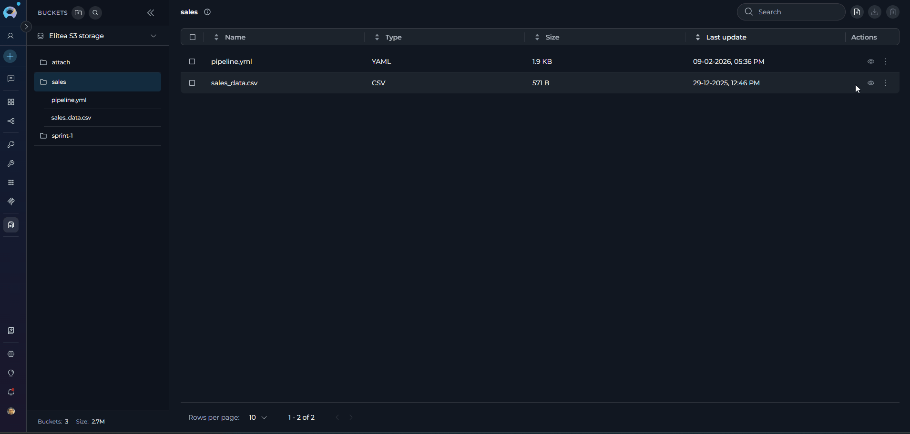

<Info title="Editing Limitations">
* **CSV/TSV files** can only be edited in **Raw mode**. Switch to Raw mode to make changes, then toggle back to Rendered mode to view the table.
* **Markdown files** can only be edited in **Raw mode**. Switch to Raw mode to edit the Markdown source, then toggle to Preview mode to see the rendered output.
* **MDX files** can only be edited in **Raw mode**. Switch to Raw mode to edit the MDX source, then toggle to Preview mode to evaluate and render the result.
* **Mermaid diagrams** can only be edited in **Raw mode**. Edit the diagram code in Raw mode, then toggle to Rendered mode to see the visual diagram.
* **DOCX files** are always opened in the WYSIWYG editor—there is no Raw mode for DOCX. The language dropdown selector is not available for DOCX files.
* **Image files** are view-only and cannot be edited.
* Files must be under 2&nbsp;MB for editing.
* The file overwrites the original in the bucket with the same filename and location.
* Other users with bucket access see the updated version.
</Info>

<Warning title="Single-User Editing">
Artifact file editing is single-user (last save wins). If multiple users edit the same file simultaneously, the last person to save overwrites previous changes. Coordinate with team members to avoid conflicts.
</Warning>

For detailed information about file editing features, controls, and workflows, see **[File Editing in Canvas](../how-tos/chat-conversations/file-editing-canvas)**.

### Download Files from a Bucket

* **Download progress:** The system provides feedback during the download process.
* **Single file download:** Go to the file list and locate the **Download** icon (download arrow icon) on the right side of the file entry. Select this icon to download the file to your local computer.
* **Multiple file download:** Select multiple files using the checkboxes, then select the **Download files** button in the toolbar to download all selected files as a ZIP archive.

<Info title="Multiple File Downloads">
When downloading multiple files, all selected files are automatically packaged into a single ZIP file for convenient download.
</Info>

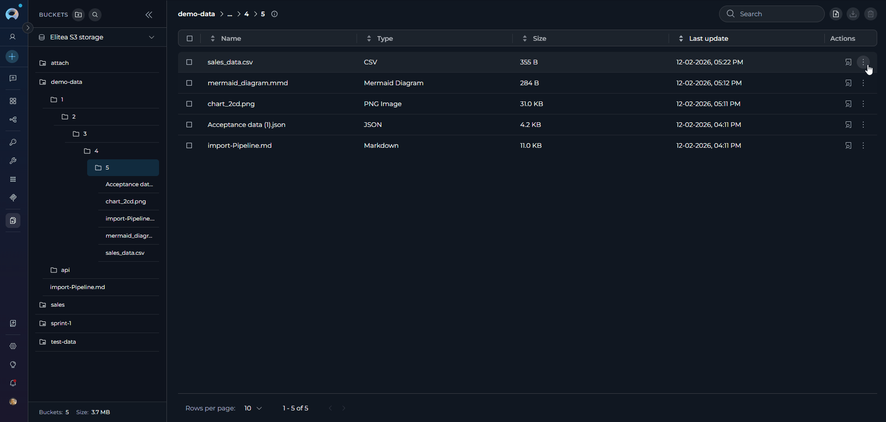

### Delete Files from a Bucket

* **Access file list:** Go to the file list of the bucket containing the files you want to delete.
* **Single file deletion:** Select the **Delete** icon (trash can) on the right side of the file entry to delete individual files.
* **Multiple file deletion:** To delete multiple files at once:
    * Select the checkboxes next to each file you want to delete in the file list.
    * Once one or more files are selected, a **Delete** icon becomes active in the toolbar above the file list. Select this icon to delete all selected files.
* **Permission requirements:** Delete functionality requires appropriate permissions (`artifacts.delete` or bucket ownership).
* **Confirmation:** You may be prompted to confirm the file deletion before it is permanently removed.

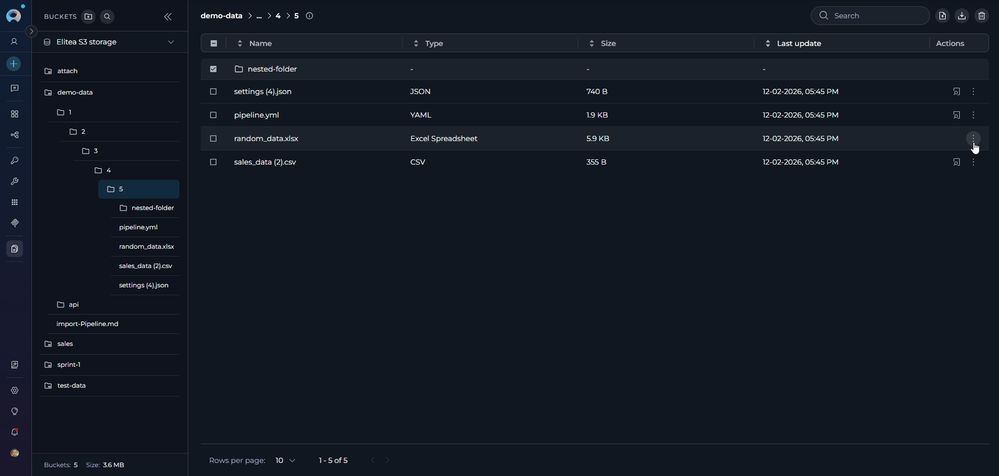

<Info title="Folder Deletion Behavior">
When you delete all files from a folder, the folder is automatically deleted. Empty folders are not supported in the Artifacts system.
</Info>

## Troubleshooting

You can find answers to common questions or solutions to known issues in the broader ELITEA documentation.

<Accordion title="Cannot upload files to bucket">
**Possible causes:**

* No bucket is selected—Select a bucket from the sidebar before uploading.
* Insufficient permissions—Ensure you have the `artifacts.create` or `artifacts.buckets.create` permission.
* Storage quota exceeded—Check storage usage in the storage settings menu.
* Network connectivity issues—Verify your internet connection and try again.
</Accordion>

<Accordion title="File preview not available">
**Possible causes:**

* File type not supported—Preview works only with supported file types (programming languages, data formats, configuration files, images, etc.).
* File size exceeds 2&nbsp;MB limit—Files larger than 2&nbsp;MB cannot be previewed. Download the file to view it locally.
* File is corrupted—Try re-uploading the file.
* Binary file format—Binary files cannot be previewed in the browser.
</Accordion>

<Accordion title="Bucket creation fails">
**Possible causes:**

* Bucket name already exists—Choose a different unique name for the bucket.
* Invalid bucket name format—The name must start with a letter and contain only letters, numbers, and hyphens (max 56 characters).
* Insufficient permissions—Ensure you have the `artifacts.buckets.create` permission.
* Invalid retention policy—Ensure the retention value is a positive integer and a period type is selected.
</Accordion>

<Accordion title="Cannot delete files or buckets">
**Possible causes:**

* Insufficient permissions—Ensure you have the `artifacts.delete` permission or are the bucket owner.
* Files are in use—Wait for any ongoing operations to complete.
* Network issues—Check your connection and try again.
</Accordion>

<Accordion title="Upload shows duplicate file warning">
**Expected behavior:**

* This is a confirmation dialog, not an error—The system detects files with matching names in the bucket.
* Select **Proceed** to overwrite existing files or **Cancel** to abort the upload.
* Once confirmed, duplicate files are replaced without additional prompts.
</Accordion>

<Accordion title="Cannot navigate into folders or breadcrumbs not working">
**Possible causes:**

* Select directly on the folder row in the table to navigate into it.
* Use breadcrumb segments at the top of the file table to navigate back up the folder hierarchy.
* In the sidebar tree, select folders to expand or collapse them.
* Ensure the bucket is selected and expanded in the sidebar.
</Accordion>

<Accordion title="Upload path dialog shows 'Maximum folder depth reached'">
**Expected behavior:**

* The maximum folder nesting depth is 10 levels.
* The dialog shows your current folder depth.
* If already at level 10, you cannot create deeper nested folders.
* Upload files to the current location or go to a shallower folder level.
</Accordion>

<Accordion title="Bucket tree not showing files or folders">
**Possible causes:**

* Bucket may be empty—Check the "No files in this bucket" message.
* Bucket may not be expanded—Select the bucket to expand its tree view.
* Network issues—Wait a moment and try expanding the bucket again.
* Check for "Loading files..." or "Failed to load files" messages in the tree.
</Accordion>

<Accordion title="Storage settings show 'Loading usage...'">
**Possible causes:**

* Storage data is being retrieved—Wait a few seconds for the information to load.
* Network latency—Check your internet connection.
* Storage configuration issues—Contact your administrator if the issue persists.
</Accordion>

<Accordion title="Files disappear from bucket">
**Possible causes:**

* Retention policy expired—Files are automatically deleted when the retention period ends.
* Manual deletion—Another user with appropriate permissions may have deleted the files.
* Agent actions—Agents with access to the Artifact Toolkit may have deleted files during workflow execution.
* Check retention policy settings and project activity logs for more information.
</Accordion>

### Support Contact

If you encounter issues not covered in this guide or need additional assistance with artifact management, see **[Contact Support](../support/contact-support)** for detailed information on how to reach the ELITEA Support Team.

## FAQ

<Accordion title="What types of files can I upload?">
All file types are supported for upload. For optimal agent workflow integration, plain text files are recommended. The preview feature supports 50+ file types including programming languages, configuration files, documentation formats, data files (CSV/TSV), images, and Mermaid diagrams. See the [Artifact Toolkit Guide](../integrations/toolkits/artifact_toolkit) for agent-specific usage details.
</Accordion>

<Accordion title="How can I preview files?">
Select a file and select the preview icon (eye symbol) to open it in Canvas Mode. The preview supports multiple view modes: code with syntax highlighting, rendered Markdown, table view for CSV/TSV files, rendered diagrams for Mermaid files, and WYSIWYG editing for DOCX files. You can copy content, switch languages, and toggle between raw and rendered views (except for DOCX and image files, which use dedicated viewers).
</Accordion>

<Accordion title="Who can access artifact files?">
Access is controlled by project membership and specific permissions. Users need appropriate permissions for different actions: `artifacts.create` for uploading, `artifacts.buckets.update` for editing buckets, `artifacts.delete` for deleting files, etc. Bucket owners have full control over their buckets.
</Accordion>

<Accordion title="Can I use multiple storage configurations?">
Yes, if your project has access to multiple storage integrations (personal and shared), you can switch between them using the storage settings menu. Each storage configuration maintains its own set of buckets and quota limits.
</Accordion>

<Accordion title="How does the file size limit work for previews?">
Preview is available for files under 2&nbsp;MB. Files exceeding this limit show a "File too large to preview" message with the file size details and a download option.
</Accordion>

<Accordion title="What happens to my bucket selection when I switch projects?">
Bucket selections are isolated by project context. Each project maintains its own selection state, and switching projects does not affect your bucket selections in other projects.
</Accordion>

<Accordion title="How do I navigate into folders within buckets?">
There are two ways to navigate folders:

1. **Sidebar Tree View:** Select a bucket to expand it, then select folders to expand and see nested contents. Select any file or folder to select it.
2. **File Table:** Select any folder row in the file table to navigate into that folder. Use breadcrumb navigation at the top to move back up the folder hierarchy.
</Accordion>

<Accordion title="Why does the bucket automatically expand when I select it?">
This is expected behavior. When you select a bucket, it automatically expands in the sidebar to show its folder and file tree structure, making it easy to browse and select files without additional selections.
</Accordion>

<Accordion title="Why do I get an error when creating a bucket?">
Check that the retention policy is valid, the name follows naming conventions (starts with a letter, only letters, numbers, and hyphens, max 56 characters), and you have the necessary permissions.
</Accordion>

<Accordion title="Why are buckets displayed in a specific order?">
Buckets are automatically sorted by recent activity. The most recently used buckets (based on file activity) appear at the top of the list for easier access.
</Accordion>

<Accordion title="Why is the 'Save' button disabled?">
The bucket name may be invalid or not unique, the retention value is not a valid integer, or you do not have the necessary permissions to create or modify buckets.
</Accordion>

<Accordion title="Why are files missing from my bucket?">
Files may be deleted due to retention policy expiration, manual deletion by users with appropriate permissions, or agent actions. Check the retention policy settings and project activity logs if available. Files are permanently deleted when buckets are removed.
</Accordion>

<Info>
**Additional Resources**

* **[Artifact Toolkit Guide](../integrations/toolkits/artifact_toolkit)**—Learn how to use artifacts with ELITEA Agents.
* **[Attach Images & Files in Chat](../how-tos/chat-conversations/attach-files)**—Upload and share files in chat conversations.
* **[Data Analysis](../how-tos/chat-conversations/data-analysis-internal-tool)**—Analyze data files using the internal data analysis tool.
</Info>
