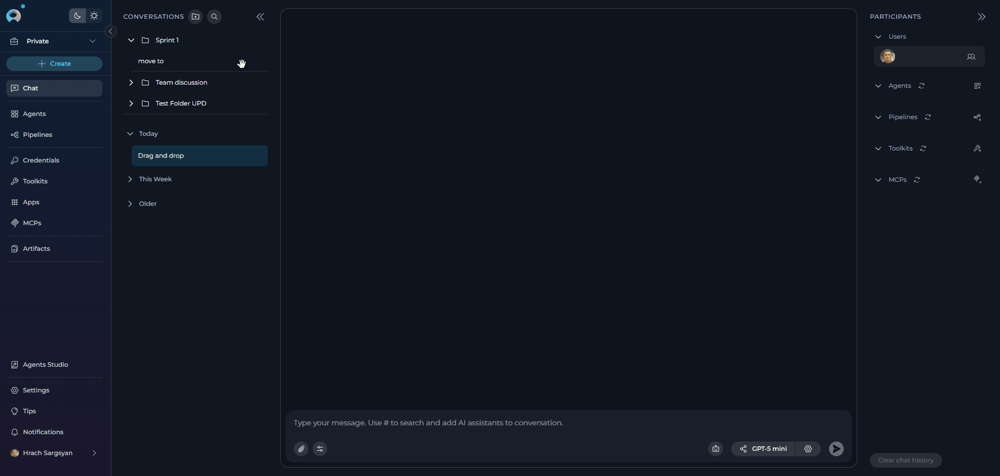
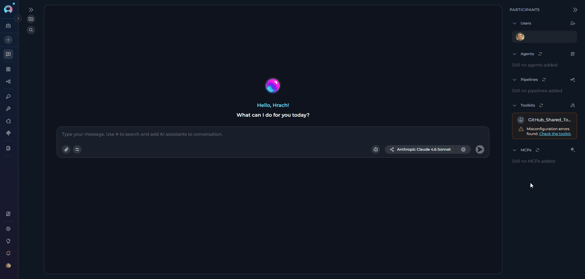
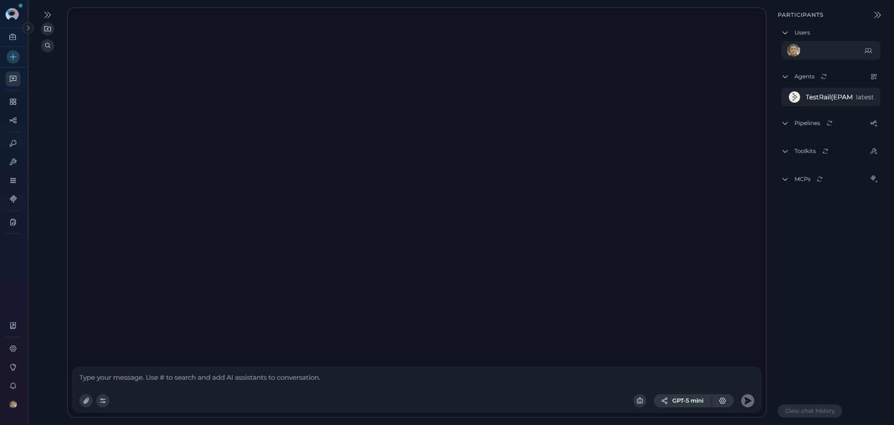
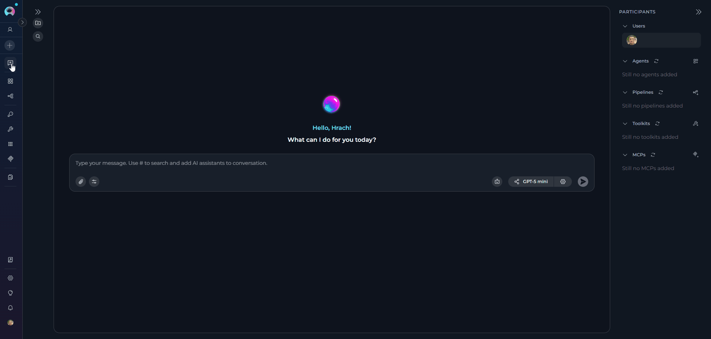
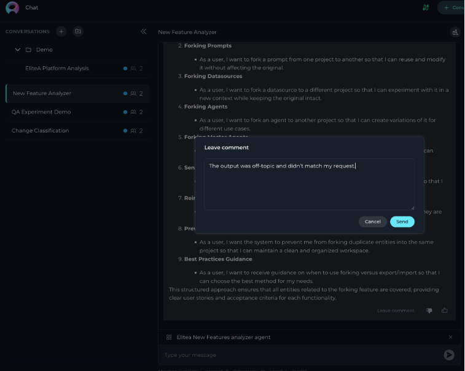
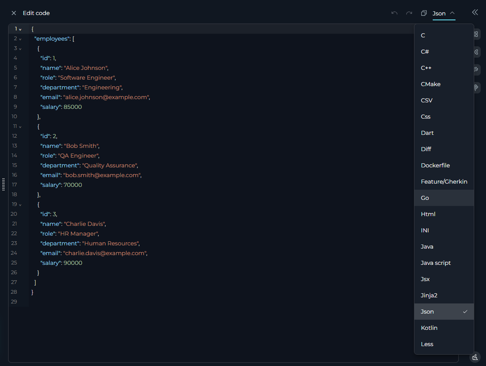
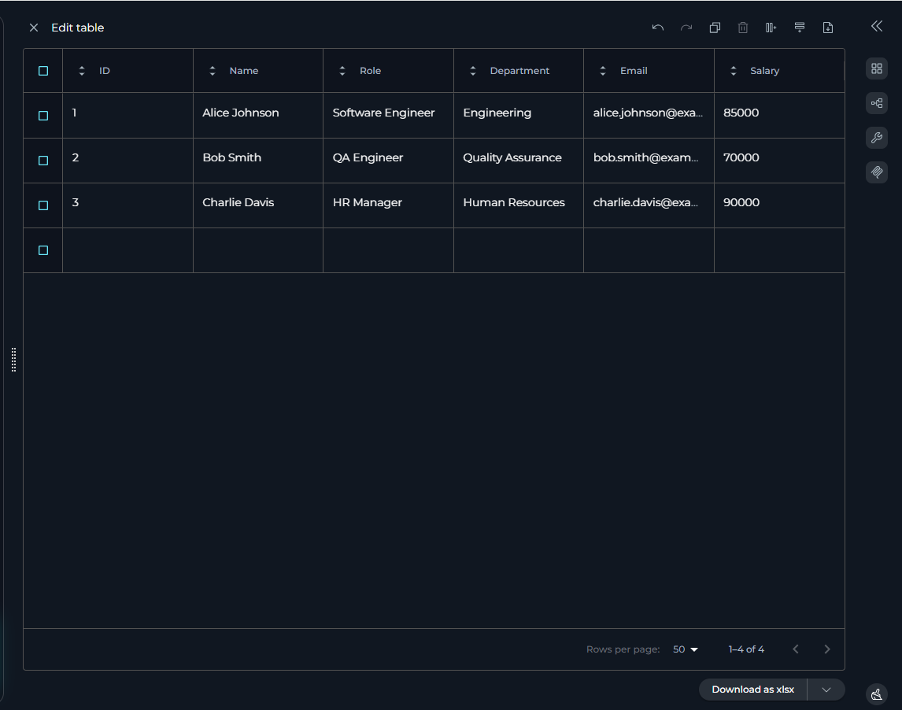
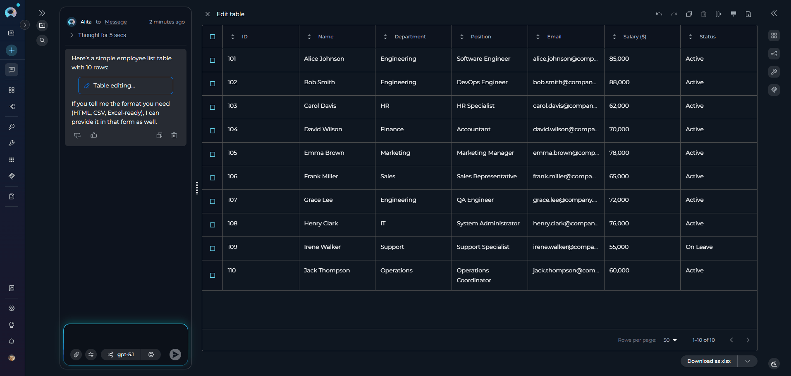
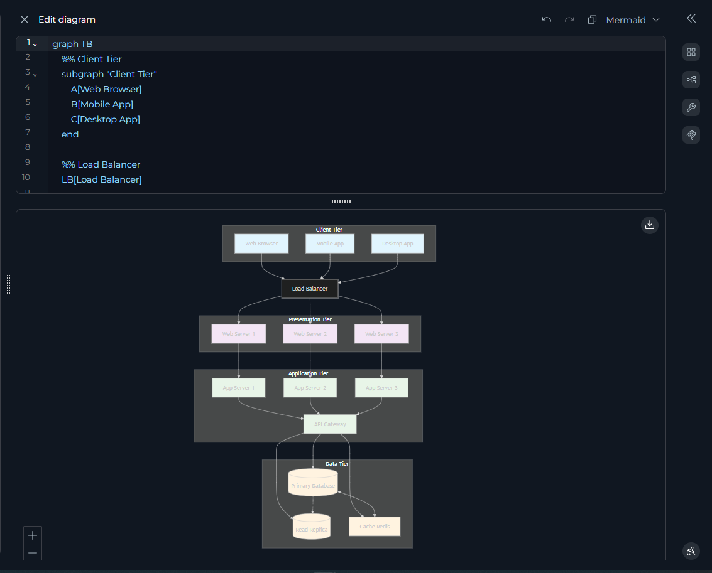
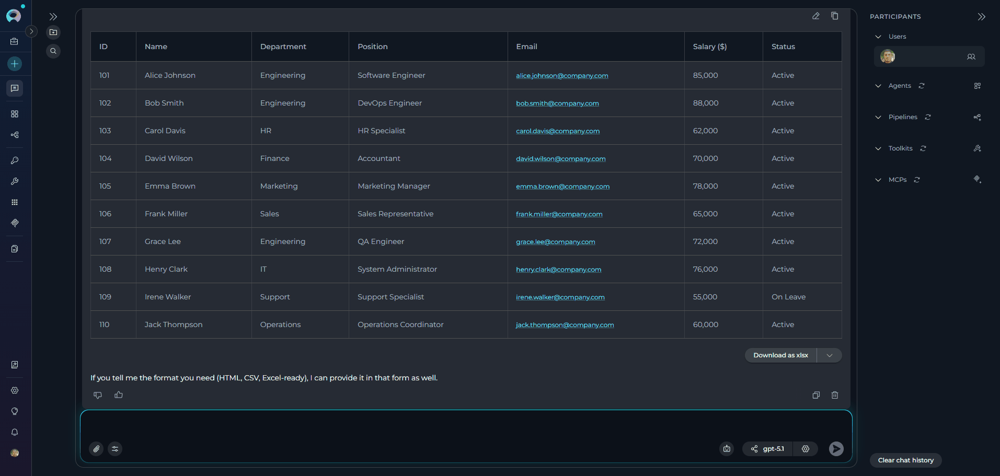

## Introduction

**ELITEA Chat** is the central hub where all platform capabilities come together. It provides a conversational interface where you can interact with AI models, agents, pipelines, toolkits, and MCP servers — all in one place, using natural language.

Each conversation is an independent dialogue session. You can reference earlier messages within the same conversation, but context is not shared between separate conversations. All conversations are securely stored on the ELITEA server and accessible from any device via the **Chat** menu.

Conversations support the following functionality:

<CardGroup cols={3}>
  <Card title="Project and Private Conversations" icon="users">
    Share your conversation with other users from your project, involve them in the same conversation, or keep it private and visible only to you.
  </Card>
  <Card title="Participants" icon="user-group">
    Add various participants to the conversation, including other users in public conversations, agents, pipelines, toolkits, MCPs, and language models.
  </Card>
  <Card title="Create and Edit Entities" icon="pen-to-square">
    Create and edit entities directly from the conversation (Agents, Pipelines, Toolkits, MCPs) without leaving the chat interface.
  </Card>
  <Card title="Canvas Mode" icon="diagram-project">
    Visualize and interact with conversation flows using a graphical canvas interface.
  </Card>
  <Card title="Interactions" icon="comments">
    Interact with added participants, copy generated responses, and more.
  </Card>
  <Card title="Managing Conversations" icon="sliders">
    Save conversations, pin the most important ones, make private conversations public, delete, clean content, and export the context.
  </Card>
  <Card title="Folders" icon="folder">
    Organize your conversations into folders for better management. Create folders, move conversations, edit folder names, or delete folders.
  </Card>
  <Card title="Playback" icon="circle-play">
    Move backward and forward through the playback process or stop the conversation by simulating the current conversation without any engagement with models.
  </Card>
</CardGroup>

For more details see [Chat Usage](../how-tos/chat-conversations/how-to-use-chat-functionality).

## Creating a Conversation

1. Go to the **Chat** section in the left sidebar.
2. Click the **+ Create** button at the top.
3. The chat input field appears and is highlighted to focus your attention.
4. Type your first message in the input field.
5. Press **Send** (or press Enter).
6. The new conversation is created and appears in the **CONVERSATIONS** sidebar.
7. The conversation name is automatically generated based on your message content. During name generation (1-2 seconds), you'll see a loader icon with "Naming" text next to the conversation item.

<Tip title="Quick Start">
You can optionally add participants (agents, pipelines, or models) before sending your first message by typing **#** followed by the participant name, or by using the participant panel on the right.
</Tip>

**Conversation Sorting and Organization**

Conversations in the **CONVERSATIONS** sidebar are automatically organized by time periods for better navigation:

| Period | Description |
|--------|-------------|
| **Today** | Conversations created or active today appear at the top. |
| **Yesterday** | Conversations from the previous day are grouped together. |
| **This Week** | Conversations from the current week are grouped together. |
| **Older** | All conversations older than this week are grouped under this section. |

This automatic time-based sorting helps you quickly locate recent conversations and maintain an organized conversation history. Pinned conversations will always appear at the very top, regardless of their creation date.

## Creating a Folder

<Note title="Private, Team, and Public Conversations/Folders">
**Private:** In a private project, you can add all participant types except users. Folders and their contents are only accessible to you.

**Team Project:** You can view all folders within the project, but can only see conversations inside folders if you are a member. Members can move conversations into or out of folders; you cannot delete folders created by others. Public folders within a team project are visible to all members and cannot be converted back to private.
</Note>

1. Click the **+ Folder** button located at the top of the **CONVERSATIONS** sidebar.
2. Provide a **Name** for the folder.
3. Click **Save** to create the folder. The new folder will appear in the **CONVERSATIONS** sidebar.

<Tabs>
  <Tab title="Move Conversations to a Folder">
    1. Right-click on the conversation you want to move.
    2. Select **Move to** from the contextual menu.
    3. Choose the target folder from the list. If no folder exists, you can create one by clicking **+ New Folder**.

    <Tip title="Quick Organization">
    Alternatively, you can drag and drop conversations directly into folders in the sidebar for quick organization.
    </Tip>

    
  </Tab>
  <Tab title="Move Conversations Back to the Main List">
    To move conversations from folders back to the main **CONVERSATIONS** list:

    1. Navigate to the folder containing the conversation you want to move.
    2. Right-click on the conversation inside the folder.
    3. Select **Back to the list** from the contextual menu.
    4. The conversation will be moved from the folder back to the main **CONVERSATIONS** list.

    

    <Tip title="Quick Organization">
    Alternatively, you can drag and drop conversations directly into folders in the sidebar for quick organization.
    </Tip>
  </Tab>
</Tabs>

## Participants

Participants are additional resources that can be added to a conversation to extend its capabilities. The following types of participants are available:

<CardGroup cols={2}>
  <Card title="Models" icon="microchip-ai">
    LLM models added to the conversation to interact with Gen AI and get responses from the selected model.
  </Card>
  <Card title="Agents / Pipelines" icon="robot">
    Agents or pipelines—created within the project or available as public resources—that can be executed to receive AI-driven responses.
  </Card>
  <Card title="Toolkits & MCPs" icon="toolbox">
    Toolkits provide integrations with external services (e.g., Jira, GitHub, databases), while MCPs expose tools via Model Context Protocol servers — including EPAM pre-built and custom remote connections.
  </Card>
  <Card title="Users" icon="user">
    In team projects, other project members can be added to public conversations to collaborate, mention teammates with **@username**, or follow the conversation thread.
  </Card>
</CardGroup>

<Info title="Note">
Users cannot be added to private project conversations.
</Info>

### How to Add Users to a Conversation
1. In the **PARTICIPANTS** panel, click the users icon next to your avatar.
2. Select **Add users** from the dropdown menu.
3. The **Add users** modal will appear with a search bar.
4. Use the search bar to find teammates by name.
5. Select one or more users from the list by clicking on them.
6. Click **Add** to confirm. The selected users will be added as participants to your chat.
7. Added users will appear in the **PARTICIPANTS** section.  Hover over user avatars in the participant list or type **@username** in the chat input to mention and notify teammates in the conversation. To mention everyone in the conversation, select the **All Users** option.
           

<Info title="Note">
* Users can be removed by hovering over their name in the participants list and clicking the remove icon.
  * Users will receive notifications when they are added as participants in a conversation.
</Info>

### Adding Participants (Agents, Pipelines, Toolkits, MCPs)

You can add various AI participants to enhance your conversations:

**Method 1: Using the Participants Panel**

1. In the **PARTICIPANTS** section on the right side of the screen, you'll see collapsible sections for:  <Badge icon="robot">agents</Badge> <Badge icon="diagram-project">pipelines</Badge> <Badge icon="wrench">toolkits</Badge> <Badge icon="server">MCPs</Badge>
2. Click the **+** icon next to any section title to add participants of that type.
3. Select the desired participant from the list (e.g., an Agent, Pipeline, Toolkit, or MCP).
4. The selected participant will appear in the **PARTICIPANTS** panel.
5. Click on a participant in the list to activate and interact with it.

**Method 2: Using the # Symbol (Quick Access)**

1. In the chat input box, type `#` to open a **Search results** dropdown of available participants.
2. Continue typing to filter by name (e.g., `#Jira` will show all Jira-related participants).
3. Select a participant from the filtered list — the dropdown searches across **Agents**, **Pipelines**, **Toolkits**, and **MCPs**.
4. The selected participant will appear as a chip above the input box and in the **PARTICIPANTS** panel.

### Mention Toolkit and Tool

You can direct the AI to use a specific tool from an already-added toolkit by typing `/` in the chat input. This is a two-phase selection:

**Select a Toolkit:**

1. In the chat input box, type `/` to open the **Mention toolkit** dropdown.
2. The dropdown lists all toolkits that are already added as participants in the current conversation.
3. Continue typing to filter by toolkit name (e.g., `/Jira` filters to Jira-related toolkits).
4. Click a toolkit name from the dropdown, or type the full name and press `/` again to confirm it.
5. The input updates to `/{ToolkitName}/` and the dropdown switches to show the toolkit's available tools.

**Select a Tool:**

6. The dropdown now shows **"{ToolkitName} available tools"** with all tools exposed by that toolkit.
7. Continue typing after the second `/` to filter tools by name (e.g., `/Jira/create` shows create-related tools).
8. Each tool shows its name and a short description.
9. Click the desired tool to confirm the selection.
10. The mention is committed to the input as `/{ToolkitName}/{ToolName}` with a cyan highlight and a trailing space so you can continue typing your message.

<Note>
The `/` mention works with both **Toolkits** and **MCP** participants that are already added to the conversation. If a toolkit or MCP does not appear in the dropdown, add it first via the **PARTICIPANTS** panel or by typing `#` to add it. Toolkits and MCPs with misconfiguration errors are excluded from the dropdown until the configuration issue is resolved.
</Note>

You can include multiple toolkit tool mentions in a single message, and they can be placed anywhere within the message. For example: `Please use /Jira/createIssue to create a new issue and then /GitHub/createPR to create a pull request.`

Each mention is highlighted independently and sent to the AI as separate tool directives.

**Creating New Participants:**

You can also create new participants directly from the chat interface:

* **Agents**: Click **Create new agent** in the agents section to open the Agent Canvas
* **Pipelines**: Click **Create new pipeline** in the pipelines section to open the Pipeline Canvas
* **Toolkits**: Click **+ Create new Toolkit** in the toolkits section to configure integrations
* **MCPs**: Click **Create new MCP** in the MCPs section to connect Model Context Protocol servers

**Managing Participants:**

* To remove a participant, hover over their card in the **PARTICIPANTS** list and click the remove icon.
* All participants appear in the right sidebar for easy switching between them.

<Frame caption="If a toolkit in your Chat uses shared credentials that are not yet configured in your Personal workspace, a **Misconfiguration errors found. Check the toolkit.** message appears on the toolkit card. Clicking **Check the toolkit** opens the toolkit in the Canvas editor, where the **Credential setup required** warning banner is displayed. Click the **Create a credential** link to create the matching credential. See [Shared Toolkit Credentials](./toolkits#shared-toolkit-credentials) for details.">
  
</Frame>

## Display Configured Conversation Starter

When you add a participant to a conversation, the configured conversation starter for that participant will automatically display in the chat. This feature improves usability and ensures a smooth start to conversations by providing immediate context and guidance on how to interact with each participant.

## Internal Tools

Internal tools provide built-in capabilities that enhance your conversations without requiring external integrations. These tools can be enabled directly from the chat interface or configured as part of an agent's default setup.

**Available Internal Tools:**

<CardGroup cols={2}>
  <Card title="Python Sandbox" type="note" icon="python" href="../how-tos/chat-conversations/python-sandbox-internal-tool">
    Execute Python code securely in conversations using Pyodide (Python compiled to WebAssembly). Useful for calculations, data processing, testing algorithms, and generating visualizations.
  </Card>
  <Card title="Data Analysis" type="note" icon="chart-bar" href="../how-tos/chat-conversations/data-analysis-internal-tool">
    Perform Pandas-based data analysis on uploaded files (CSV, Excel, etc.) using natural language queries. Automatically processes data and generates charts with downloadable results.
  </Card>
  <Card title="Planner" type="note" icon="list-check" href="../how-tos/chat-conversations/planner-internal-tool">
    Create, manage, and track tasks and action items directly within conversations. Set priorities, due dates, and monitor task progress without switching to external task management tools.
  </Card>
  <Card title="Image Creation" type="note" icon="image" href="../how-tos/chat-conversations/image-generation">
    Generate AI-powered images from text prompts directly within conversations. Requires an image generation model configured in your project.
  </Card>
  <Card title="Attachments" type="note" icon="paperclip" href="../how-tos/chat-conversations/attach-files">
    Attach files and images to conversations for AI-powered analysis. Files are automatically stored in the default `attachments` artifact bucket.
  </Card>
  <Card title="Smart Tools Selection" type="note" icon="bolt" href="../how-tos/chat-conversations/smart-tools-selection-internal-tool">
    Optimizes token usage when working with many toolkits by dynamically loading tool schemas on demand instead of binding all tools upfront. Recommended when your conversation uses 5 or more toolkits.
  </Card>
  <Card title="Swarm Mode" type="note" icon="network-wired" href="../how-tos/chat-conversations/swarm-mode-internal-tool">
    Enables multi-agent collaboration by allowing all child agents to share the full conversation history and hand off control to each other. Ideal for complex workflows requiring multiple specialized agents working as a team.
  </Card>
</CardGroup>

**Enabling Internal Tools:**

1. Navigate to your conversation
2. Locate the **Internal Tools** icon (value icon) in the chat input toolbar at the bottom of the screen, next to the attachment button
3. Click the Internal Tools icon to open the configuration popup
4. Find the tool you want to enable in the list
5. Click the toggle switch next to the tool name to enable it
6. A success notification will appear: "Internal tools configuration updated"
7. Click anywhere outside the popup to close it

     

Once enabled, the AI assistant can automatically use these tools during conversations when appropriate.

<Tip title="Agent Configuration">
You can also enable internal tools as part of an agent's default configuration in the **TOOLKITS** section. This makes the tools available in all new conversations using that agent.
</Tip>

### Attachments in Conversations

Attach files and images directly to chat conversations for AI-powered analysis. This feature enables multimodal interactions where AI can process visual content, documents, and data files alongside text-based queries.

**Key Capabilities:**

* **Image Analysis**: Upload images for visual analysis, OCR, content extraction, and AI-powered interpretation
* **Document Processing**: Attach documents for content indexing, semantic search, and information retrieval
* **Data Files**: Upload CSV, JSON, and other data formats for analysis and processing
* **Multiple Upload Methods**: Click to browse, drag-and-drop, or paste from clipboard
* **Centralized Storage**: All attachments automatically stored in the default `attachments` Artifact bucket — no manual configuration required

**How Attachments Work:**

Every file you attach is automatically uploaded to the default `attachments` bucket — no manual Artifact Toolkit configuration is required. Files are accessible from the **Artifacts** section and subject to the bucket's retention policy (30-day default).

* **Images** are sent directly to the LLM for real-time vision analysis
* **Non-image files** (documents, code, data) are indexed into a vector database and retrieved via semantic search

**Enabling Attachments:**

* **Direct LLM chat**: The paperclip icon is always available — click it to attach files immediately
* **Agent-based conversations**: An agent must have the **Allow attachments** toggle enabled (in the INTERNAL TOOLS section of the Agent Configuration tab). Once enabled, the paperclip becomes active in all conversations using that agent
* **Conversation-level**: Click the paperclip icon in the message input area to attach files directly without modifying agent settings

     

Once attachments are available, upload files by clicking the paperclip icon, dragging and dropping into the chat, or pasting from clipboard.

For detailed information about attachments, including agent configuration and file management, see [Attach Files](../how-tos/chat-conversations/attach-files).

## Selecting LLM Models

**Model Selection**

1. Click the **model selector dropdown** at the bottom of the chat.
2. Select a desired LLM model from the available options (e.g., gpt-4o, gpt-5.1, Claude).
3. The selected model name is displayed on the button. Models that support **image analysis** or **reasoning** show small capability icons next to their name in the dropdown.

     

**Model Settings**

Click the **Settings** (⚙️) icon next to the model selector to fine-tune response generation. Settings vary by model type:

<Tabs>
  <Tab title="Reasoning Models (e.g. GPT-5.1)">
    | Parameter | Description |
    |-----------|-------------|
    | **Reasoning** | Controls the depth of logical thinking and problem-solving. |

    | Level | Behavior |
    |-------|----------|
    | **Low** | Fast, surface-level reasoning with concise answers and minimal steps |
    | **Medium** | Balanced reasoning with clear explanations and moderate multi-step thinking *(default)* |
    | **High** | Deep, thorough reasoning with detailed step-by-step analysis (may be slower) |

    
  </Tab>
  <Tab title="Standard Models (e.g. GPT-4o)">
    | Parameter | Description |
    |-----------|-------------|
    | **Creativity** | Controls response randomness. Lower values produce focused, deterministic outputs; higher values produce more varied and creative responses. |

    | Level | Behavior |
    |-------|----------|
    | **1** | Highly focused and deterministic outputs |
    | **2** | Mostly focused with slight variation |
    | **3** | Balanced between focus and creativity *(default)* |
    | **4** | More varied and creative responses |
    | **5** | Maximum creativity and diversity |

    
  </Tab>
</Tabs>

**Capabilities** *(shown when supported by the selected model)*

| Badge | Meaning |
|-------|---------|
|  | The model accepts image inputs alongside text |
|  | The model uses extended chain-of-thought reasoning |

<Note>
Capability badges appear automatically at the bottom of the settings panel based on the selected model. If neither capability is supported, the Capabilities row is hidden.
</Note>

**Max Completion Tokens** *(All Models)*

| Option | Description |
|--------|-------------|
| **Auto** | System sets the token limit to 4096 tokens *(default)* |
| **Custom** | Manually enter a specific token limit. An error is shown if the value exceeds the model's maximum output tokens. |

**Steps Limit** *(Conversations only)*

Controls the maximum number of execution steps (tool calls) the AI can take before the loop is forcefully stopped. This prevents runaway agent executions that could consume excessive resources.

| Parameter | Value |
|-----------|-------|
| **Default** | 25 steps |
| **Range** | 0 – 999 |

- Each time the AI invokes a tool or performs an internal reasoning step, the counter increments by one. When the limit is reached, the execution loop ends and the AI returns whatever results it has collected so far.
- The Steps Limit field is shown in the model settings panel only in **Conversations** (chat). It is not available on the Agents or Pipelines pages, where step limits are configured at the agent/pipeline level.
- The value is passed as a top-level `step_limit` field in the conversation payload — it is separate from the `llm_settings` block.

<Tip title="Choosing a Steps Limit">
- Set a **lower value** (e.g. 5–10) for simple question-answering tasks where you want fast, predictable responses.
- Set a **higher value** (e.g. 50–100) for complex, multi-step research or automation tasks that require chaining many tool calls.
- If a conversation ends abruptly with incomplete results, check whether the steps limit was reached and increase it accordingly.
</Tip>

<Warning title="Step Limit Reached">
When the steps limit is exceeded, the AI stops executing further tool calls and returns partial results. No error is displayed to the user by default — the response simply stops at the last completed step.
</Warning>

## Context Budget

The **Context Budget** widget provides intelligent control over conversation token usage through automated message management. When enabled, it displays real-time token usage metrics and allows you to configure how the system manages conversation context as it approaches model token limits.

**Widget Location**

The Context Budget widget appears in the bottom-left area of the **PARTICIPANTS** panel on the right side of the chat interface after you send the first message in a conversation.

**Widget Views**

The widget has three views that provide progressively more detailed information:

* **Collapsed View**: Shows a simple line indicator of token usage status (green for normal, orange for high usage)
* **Compact View**: Displays pruning strategy, message count, summaries count, and an expand button
* **Expanded View**: Provides comprehensive configuration options organized in collapsible sections

**Key Features**

* **Real-time Token Tracking**: Monitor token consumption as you add messages to the conversation
* **Automatic Context Management**: System automatically prunes old messages or generates summaries when approaching token limits
* **Manual Optimization**: Manually trigger context optimization when usage exceeds 100%
* **Configurable Strategies**: Choose between different pruning strategies (oldest_first, importance_based)
* **Message Preservation**: Configure how many recent messages are always protected from pruning
* **Summarization**: Enable automatic summarization of older messages to reduce token usage while preserving conversation context

**Configuration Parameters**

When you expand the Context Budget widget, you can configure:

* **Context Strategy & Token Management**: Set max context tokens, preserve recent messages count, and pruning strategy
* **Summarization**: Enable/disable automatic summarization, configure summary instructions and trigger ratio
* **System Messages**: Manage system-level instructions and preservation settings

For detailed information about Context Budget configuration and usage, see [Context Management Guide](../how-tos/chat-conversations/context-management).

## Actions for Conversation

The following actions are available for created conversations from **CONVERSATIONS** sidebar:

* **Delete**: To delete a single conversation, on the left panel, in the conversation contextual menu, select **Delete** and confirm your action.
* **Edit**: To rename a conversation, on the left panel, in the conversation contextual menu, select **Edit** and confirm your action.
* **Move To**: To move a conversation to a folder, on the left panel, in the conversation contextual menu, select **Move To** and choose the desired folder. If no folder exists, you can create one by clicking **+ New Folder**.
* **Export**: To export a single conversation, on the left panel, in the conversation contextual menu, point to Export. `(Not applicable now.)`
* **Make Public**: To make a private conversation public, on the left panel, in the conversation contextual menu, click the **Make Public** icon. Note: You will not be able to convert it back to Private.
* **Share**: To share a conversation with team members, select **Share** from the conversation contextual menu. This action copies a direct link to the conversation to your clipboard. Team members can use this link to access and view the conversation. (`available for team project`) 
* **Playback**: The **Playback** mode can be used to simulate the current conversation without any engagement with models. This mode accurately reproduces the conversation like a recording and includes forward/backward navigation controls. It's well designed for demo purposes and allows you to step through conversations turn by turn. During playback, you can use keyboard arrows (left/right) or the on-screen controls to navigate through the conversation history.
* **Pin**: To pin a single conversation, on the left panel, in the conversation contextual menu, select **Pin**. Your conversation will be pinned at the top of your conversation's list. 

### Sharing Conversations

The conversation sharing feature allows you to share conversations with team members by providing them with a direct link. This is particularly useful for collaboration, code reviews, troubleshooting, and knowledge sharing within your team.

<Warning title="Important Permissions">
* **Team Projects Only**: Conversation sharing is only available for conversations in team projects. You cannot share conversations from personal projects.
* **Team Members**: Only team members who have access to the project can view shared conversations.
* **Access Level**: Recipients must have appropriate permissions within the project to access the shared content.
</Warning>

**How Conversation Sharing Works**

When you share a conversation, ELITEA generates a unique URL that includes the conversation ID, name, and a special parameter that identifies it as a shared conversation. Team members who receive this link can access and view the complete conversation history in their browser.

**How to Share a Conversation**

1. Navigate to the **CONVERSATIONS** sidebar in the **Chat** section.
2. Locate the conversation you want to share.
3. Hover over the conversation to reveal the contextual menu.
4. Select **Share** from the menu options.
5. The conversation link is automatically copied to your clipboard.
6. You will see a notification: "The link has been copied to the clipboard."
7. Paste the link in your communication channel (email, Slack, Teams, etc.) to share it with team members.

**Use Cases for Sharing Conversations**

* **Collaboration**: Share conversations to involve team members in ongoing discussions or problem-solving sessions
* **Code Reviews**: Share conversations containing code generation or refactoring for peer review
* **Troubleshooting**: Share error discussions with technical support or senior team members
* **Knowledge Transfer**: Share valuable conversations as learning resources for team members
* **Documentation**: Share conversations that demonstrate best practices or solutions to common problems
* **Demos and Presentations**: Share conversations to demonstrate ELITEA capabilities or AI-assisted workflows

<Tip title="Sharing vs Making Public">
The **Share** action is different from **Make Public**. Sharing creates a link for easy access while maintaining existing permissions, whereas making a conversation public changes its visibility settings permanently and cannot be reversed.
</Tip>

**Accessing Shared Conversations**

When a team member clicks on a shared conversation link:

1. The link opens in their browser
2. ELITEA automatically navigates to the specified conversation
3. The conversation opens with the complete history visible
4. The recipient can read the entire conversation thread
5. Depending on their permissions, they may be able to interact with or continue the conversation

<Info title="Access Permissions">
If a user doesn't have access or permissions to the shared conversation (i.e., the conversation is not public and the user is not added as a participant), clicking the shared link will navigate them to the chat interface, but they will not be able to view the conversation content. This is the expected behavior to maintain conversation privacy and security.
</Info>

## Actions for Folders

The following actions are available for managing folders in the **CONVERSATIONS** sidebar:

* **Edit Folder**: Select **Edit** in the folder contextual menu, update the folder name and click the **✔** button to save your changes.
* **Delete Folder**: Select **Delete** in the folder contextual menu and confirm the deletion. **Note**: Deleting a folder will not delete the conversations inside it; they will be moved back to the main **CONVERSATIONS** list.
* **Export**: To export a single folder, on the left panel, in the folder contextual menu, point to Export.  

    !!! info "Note"
        To be available in future updates.

## Like/Dislike, Comment, and Regenerate Outputs

To engage with the generated outputs in conversations, utilize the **Like/Dislike** actions, add comments, or use the **Regenerate** option for refinement or feedback.

**How to Like/Dislike and Comment an Output**

1. After generating an output in the conversation, **Thumbs Up** and **Thumbs Down** buttons displayed alongside the output.
2. Click the **Thumbs Up** icon to like the output or the **Thumbs Down** icon to dislike it.
3. After clicking the **Thumbs Down** icon, a **Leave comment** field will appear. Click on it, type your feedback in the input box, and press **Send** to save it.

**How to Regenerate the Last Output**

The **Regenerate Last Output** option becomes available only after initiating a conversation. This feature allows you to refine or correct the last generated output.

1. After generating an output in the conversation, click the **Regenerate** icon 🔄 . 
2. The system will regenerate the output based on the same input, providing a refined or corrected response.

## Sensitive Action Authorization

When an agent or pipeline attempts to call a **sensitive tool** (such as deleting a repository, running a shell command, or dropping a database table), the conversation automatically pauses and displays an authorization card before anything is executed.

<Warning title="Administrator-configured feature">
The Sensitive Action Authorization Guardrail is configured at the **server/infrastructure level** by your ELITEA administrator. It applies automatically to all conversations once active — individual users cannot enable or disable it.
</Warning>

**Authorization Dialog Elements:**

| Element | Description |
|---------|-------------|
| **Header** | ⚠️ Sensitive Action Authorization Required — amber-highlighted panel |
| **Action label** | The specific action the agent plans to run (e.g., `github.delete_repo`) |
| **Parameters** | The exact arguments the tool will be called with. Security-sensitive fields (`password`, `token`, `api_key`, `secret`, etc.) are automatically masked as `***` |
| **Policy message** | Your organization's custom message explaining why the action requires approval |

**Actions:**

* **Authorize** — Approves the tool call. Execution resumes and the tool runs as planned.
* **Block** — Rejects the tool call. The tool is skipped entirely; the agent receives a cancellation message and continues or stops based on its logic.

<Tip title="Auto-approve within a batch">
If an agent calls the same sensitive tool multiple times in one execution cycle (e.g., deleting multiple branches in a loop), only the **first call** raises the interrupt. Subsequent calls to the same tool in the same execution batch are auto-approved — avoiding repeated dialogs for the same action.
</Tip>

For full details on how the guardrail works, configuration options, and pipeline behavior, see [Sensitive Action Authorization Guardrail](../how-tos/chat-conversations/sensitive-action-authorization-guardrail).

## Real-time Collaboration in Canvas

**Editing Generated Content with Canvas**

The Canvas feature allows you to directly edit code, tables, and Mermaid diagrams generated during a conversation. This powerful tool enhances your ability to refine and customize outputs without leaving the chat interface.

Canvas becomes automatically available when a generated response is:

* Code
* A Table
* A Mermaid Diagram
* DOCX document 

When available, a **Pencil** icon ✏️ will appear alongside the generated output. Clicking this icon opens the Canvas editor for that specific content type.

The Canvas feature is supported when interacting with the following participants:
* Agents
* Pipelines
* LLM Models (direct interaction)

   

Canvas supports real-time collaborative editing where multiple users can work on the same content simultaneously:

* **Multi-user Editing**: Multiple team members can edit the same canvas content at the same time
* **User Indicators**: See who else is currently editing the content with user avatars and names
* **Live Updates**: Changes made by other users appear in real-time
* **Edit Conflicts**: The system manages edit conflicts automatically to ensure data integrity

<Tabs>
  <Tab title="Editing Code">
    1. Click the **Pencil** icon ✏️ next to a code block to open the Canvas Code Editor.
    2. The editor will display the code, and the currently selected code language will be shown.
    3. You can directly edit the code within this view.
    4. Use the following actions:
        * **Copy to clipboard**: Click the copy icon to copy the entire code block.
        * **Undo/Redo**: Click the respective icons to revert or reapply changes.
        * **Save**: Click the **X** icon to save your changes and close the Canvas editor.

    
  </Tab>
  <Tab title="Editing Tables">
    1. Click the **Pencil** icon ✏️ next to a table to open the Canvas Table Editor. Tables are presented in Markdown format within the editor but rendered as interactive tables.
    2. You can directly edit the table content and structure.
    3. Use the following actions:
        * **Manual Editing**: Modify text directly in table cells and column headings.
        * **Delete Rows**: Select the checkbox(es) next to the rows you wish to remove, then click the delete row icon.
        * **Add Columns/Rows**: Click the **Add column** or **Add row** icons to expand the table.
        * **Copy to clipboard**: Click the copy icon to copy the table data.
        * **Import CSV**: Click the **Import table** icon to upload data from a CSV file.
        * **Download as XLSX**: Click the **Download as xlsx** button to save the table data as an Excel file.
        * **Undo/Redo**: Click the respective icons to revert or reapply changes.
        * **Save**: Click the **X** icon to save your changes and close the Canvas editor.

    

    **Table Manipulations:**

    * **Sorting**: Click the sorting icons (e.g., ▲▼) next to each column heading to sort the data in ascending or descending order for that column.
    * **Filtering**: Click the **...** (ellipsis) icon next to a column heading and select the **Filter** option to apply filters to the data in that column.
    * **Hiding Columns**: Click the **...** (ellipsis) icon next to a column heading and select the **Hide column** option to remove the column from view.
    * **Column Resizing**: Drag the column borders to resize columns to your preferred width.
    * **Cell Editing**: Double-click any cell to edit its content directly within the table interface.

    
  </Tab>
  <Tab title="Editing Mermaid Diagrams">
    1. Click the **Pencil** icon ✏️ next to a Mermaid diagram to open the Canvas Mermaid Diagram Editor.
    2. You can directly edit the Mermaid diagram code in the editor view.
    3. A live **Preview** of the diagram will be displayed below the editor, updating as you make changes to the code.
    4. Use the following actions:
        * **Copy to clipboard**: Click the copy icon to copy the Mermaid diagram code.
        * **Download**: Download the rendered diagram in JPG, PNG, or SVG formats using the respective download button.
        * **Undo/Redo**: Click the respective icons to revert or reapply changes.
        * **Save**: Click the **X** icon to save your changes and close the Canvas editor.

    
  </Tab>
  <Tab title="Editing DOCX">
    The DOCX Editor provides a full WYSIWYG editing experience for `.docx` files stored in Artifacts or attached to chat conversations.

    <Info title="How to Open the DOCX Editor">
    The Canvas pencil icon (✏️) does **not** appear for DOCX files in chat. Open DOCX files via the **View/Edit file icon** in Artifacts or chat attachments instead.
    </Info>

    **Key Features:**

    * **WYSIWYG Editing**: See your document as it will appear — formatted text, headings, lists, and tables rendered in real time.
    * **Formatting Toolbar**: Apply bold, italic, underline, heading styles, lists, and other rich-text formatting.
    * **Ruler**: Adjust indentation and paragraph layout using the document ruler.
    * **Zoom Control**: Zoom in or out to inspect document details or get a full-page view.
    * **Save as DOCX**: Saving overwrites the original `.docx` file, preserving the Word format.
    * **Discard Changes**: Reset the editor to the last saved state at any time.

    **How to edit a DOCX file:**

    1. Navigate to the **Artifacts** bucket (or open an attachment) containing your `.docx` file.
    2. Click the **View/Edit file icon** to open the file in the Canvas DOCX Editor.
    3. Edit the document content directly using the WYSIWYG editor and formatting toolbar.
    4. Use the **Zoom Control** to review the full-page layout before saving.
    5. Click **Save** — the updated file overwrites the original `.docx` in the bucket.

    <Info title="DOCX Editor Limitations">
    - DOCX files are always edited in **WYSIWYG mode**. There is no Raw mode or language dropdown.
    - The DOCX Editor is only available for `.docx` files. Legacy `.doc` files are not editable.
    </Info>

  </Tab>
</Tabs>

---

## Clear Chat History

The **Clear Chat History** feature allows you to remove all messages and content from the current conversation while keeping the conversation itself and its participants intact. This is useful when you want to start fresh with the same setup or clean up a conversation that has become too long.

1. In the **PARTICIPANTS** panel on the right side of the chat interface, locate the **Clear chat history** button at the bottom.
2. Click the **Clear chat history** button.
3. A confirmation dialog will appear asking you to confirm the action.
4. Click **Confirm** to proceed with clearing the chat history.

      

<Info title="Note">
* This action will permanently remove all messages, responses, and generated content from the conversation. The conversation itself, its name, participants, and settings will remain unchanged.
   * This action cannot be undone. Make sure to export or save any important content before clearing the chat history.
</Info>

---

## Troubleshooting

<Accordion title="Conversation Not Loading">
Check your network connection and refresh the page. If the issue persists, verify you have access permissions to the conversation.
</Accordion>

<Accordion title="Cannot Add Participants">
Ensure you have the necessary permissions. For team projects, verify that the participant (agent, pipeline, toolkit, or MCP) exists and is accessible to you.
</Accordion>

<Accordion title="Attachments Not Working">
Verify that attachments are enabled for the conversation and linked to an Artifact Toolkit. Check that your file format is supported and within size limits.
</Accordion>

<Accordion title="Internal Tools Not Appearing">
Ensure internal tools are enabled via the Internal Tools icon in the chat input toolbar. For agents, verify the tools are configured in the agent's TOOLKITS section.
</Accordion>

<Accordion title="Model Not Responding">
Check that you have selected a valid LLM model and that your project has access to it. Verify token limits and model settings are correctly configured.
</Accordion>

<Accordion title="Context Budget Issues">
Ensure the `context_manager` secret is set to `true` in Settings → Secrets. Check that you've sent at least one message for the widget to appear.
</Accordion>

<Accordion title="Canvas Editor Not Opening">
Verify that the generated content is in a supported format (code, table, or Mermaid diagram). Check that you're interacting with a compatible participant (agent, pipeline, or LLM model).
</Accordion>

<Accordion title="Shared Conversation Link Not Working">
Ensure the recipient has access to the team project and appropriate permissions. Verify the conversation hasn't been deleted or made private.
</Accordion>

For further assistance, contact your platform administrator.

### Support Contact

If you encounter issues not covered in this guide or need additional assistance with chat conversations, please refer to **[Contact Support](../support/contact-support)** for detailed information on how to reach the ELITEA Support Team.

---

<Info title="Additional Resources">
Explore these comprehensive guides to master ELITEA Chat features:

* [Sensitive Action Authorization Guardrail](../how-tos/chat-conversations/sensitive-action-authorization-guardrail) — Understand how the guardrail pauses conversations for human approval before sensitive tool actions are executed.
* [How to Create and Edit Agents from Canvas](../how-tos/chat-conversations/how-to-create-and-edit-agents-from-canvas)
* [How to Create and Edit Pipelines from Canvas](../how-tos/chat-conversations/how-to-create-and-edit-pipelines-from-canvas)
* [How to Create and Edit Toolkits from Canvas](../how-tos/chat-conversations/how-to-create-and-edit-toolkits-from-canvas)
* [How to Create and Edit MCPs from Canvas](../how-tos/chat-conversations/how-to-create-and-edit-mcps-from-canvas)
* [How to Use Canvas](../how-tos/chat-conversations/how-to-canvas)
* [Use Public Items from Chat](../how-tos/chat-conversations/use-public-items-from-chat)
</Info>
