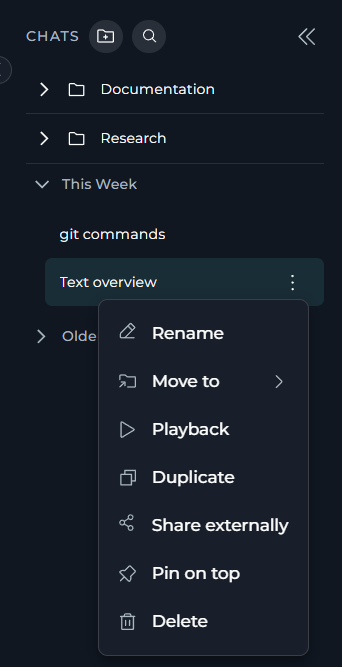
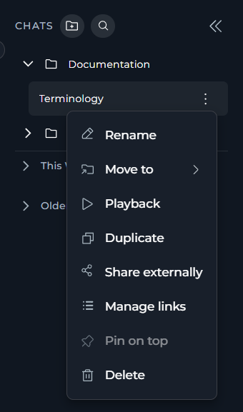
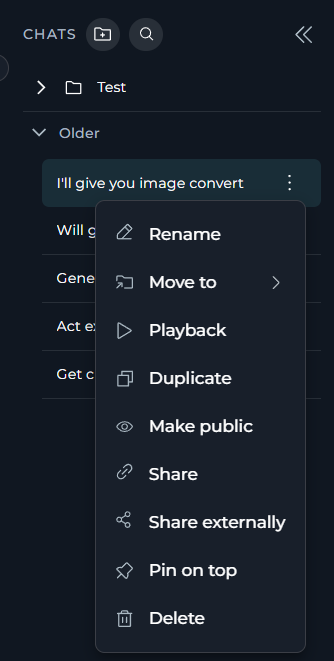
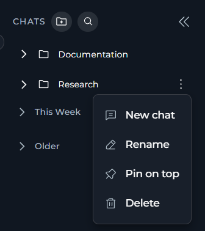

**Chat** is the central hub where all ELITEA capabilities come together. It provides a conversational interface where you can interact with AI models, agents, pipelines, skills, modules, toolkits and MCP servers — all in one place, using natural language.

Each conversation is an independent dialogue session. You can refer to earlier messages within the same conversation, but context is not shared between separate conversations. All conversations are securely stored on the ELITEA server and are accessible from any device via the **Chat** menu.

<CardGroup cols={3}>
  <Card title="Private and Shared Chats" icon="users">
    Keep your conversations private, add team members, or share them with non-ELITEA users.
  </Card>
  <Card title="Enhanced Interactions" icon="comments">
    Expand chat functionality by modules and interact with added participants — users, agents, pipelines, toolkits and MCPs.
  </Card>
  <Card title="Create and Edit Entities" icon="pen-to-square">
    Create and edit entities — agents, pipelines, skills and project contexts — directly from the chat.
  </Card>
  <Card title="Canvas Mode" icon="diagram-project">
    Preview generated files and run embedded JavaScript.
  </Card>
  <Card title="Clarifying Questions and Follow-up Suggestions" icon="wand-magic-sparkles">
    Get clarifying questions and follow-up suggestions from the assistant.
  </Card>
  <Card title="Voice Capabilities" icon="microphone">
    Communicate with LLMs using voice input, text-to-speech, and hands-free speaking mode.
  </Card>
  <Card title="Managing Conversations" icon="sliders">
    Save, pin and organize your conversations into folders.
  </Card>
  <Card title="Context Budget" icon="gauge">
    Track token usage as the conversation grows.
  </Card>
  <Card title="Playback" icon="circle-play">
    Playback or stop the conversation by simulating it without any engagement with models.
  </Card>
</CardGroup>

## Creating Chats

There are three ways to create a new chat:

* [By the **Create** button in the left sidebar](../how-tos/chat-conversations/how-to-use-chat-functionality#create-sidebar) — the quickest way to start a new conversation.
* [From a folder](../how-tos/chat-conversations/how-to-use-chat-functionality#create-folder) — create a chat directly inside a folder.
* [By duplicating a conversation](../how-tos/chat-conversations/how-to-use-chat-functionality#create-duplicate) — reuse an existing conversation's participants and settings.

## Chat Structure

In ELITEA, all conversations are located in the dedicated **Chat** page that includes the **CHATS** sidebar on the left, the **PARTICIPANTS** panel and **Context Budget** widget on the right, and the main chat area in the center.

|Element | Description |
|---|---|
| **CHATS** sidebar | Lists your conversations, organized by time period or in folders. |
| Main chat area | Displays the conversation header, message history, and message input toolbar for the active conversation. |
| **PARTICIPANTS** panel | Shows the participants added to the current conversation — agents, pipelines, toolkits, MCPs and users. |
| **Context Budget** widget | Tracks token usage as the conversation grows. |

### Main Chat Area

The chat area contains the conversation header, message history, and message input toolbar.

The message input toolbar is located at the bottom of the chat area. It includes the input field and associated controls:

<table>
  <colgroup>
    <col style={{ width: "6%" }} />
    <col style={{ width: "24%" }} />
    <col style={{ width: "70%" }} />
  </colgroup>
  <thead>
    <tr><th>No.</th><th>Element</th><th>Description</th></tr>
  </thead>
  <tbody>
    <tr><td>1</td><td><strong>Input field</strong></td><td>Enter your message here.</td></tr>
    <tr><td>2</td><td><strong><code>+</code></strong></td><td>Attach files, turn on modules, add participants (agents, pipelines, toolkits, MCPs, users) or invite users.</td></tr>
    <tr><td>3</td><td><strong>Model selector</strong></td><td>Choose which LLM model responds in this conversation.</td></tr>
    <tr><td>4</td><td><strong>Model settings</strong></td><td>Configure the parameters of the selected model.</td></tr>
    <tr><td>5</td><td><strong>Voice input</strong></td><td>Dictate your message using the microphone.</td></tr>
    <tr><td>6</td><td><strong>Speaking mode</strong></td><td>Turn on hands-free Speaking Mode for a fully spoken conversation.</td></tr>
  </tbody>
</table>

#### Models & Model Settings

In chat, you select the LLM model that responds to your messages using the **model selector dropdown** at the bottom of the chat.

The dropdown lists all LLM models available in your project.

Each model in the list can carry a small capability label — an icon shown next to its name indicating that it supports **image analysis** or **reasoning**:

| Label | Meaning |
|-------|---------|
| Image analysis | The model accepts image inputs alongside text |
| Reasoning | The model uses extended chain-of-thought reasoning |

Once you select a model, its name is displayed on the selector button.

**Model Settings**

Next to the model selector, you can see the **Settings** (⚙️) icon where you can fine-tune the response generation. Settings vary by model type:

<Tabs>
  <Tab title="Reasoning Models">
    Reasoning controls the depth of logical thinking and problem-solving.

    | Level | Behavior |
    |-------|----------|
    | **Low** | Fast, surface-level reasoning with concise answers and minimal steps |
    | **Medium** | Balanced reasoning with clear explanations and moderate multi-step thinking *(default)* |
    | **High** | Deep, thorough reasoning with detailed step-by-step analysis (may be slower) |

    
  </Tab>
  <Tab title="Standard Models">
    Creativity controls the randomness of the responses.
    Lower values produce focused, deterministic outputs; higher values produce more varied and creative responses.

    | Level | Behavior |
    |-------|----------|
    | **1** | Highly focused and deterministic outputs |
    | **2** | Mostly focused with slight variation |
    | **3** | Balanced between focus and creativity *(default)* |
    | **4** | More varied and creative responses |
    | **5** | Maximum creativity and diversity |

    
  </Tab>
</Tabs>

**Max Completion Tokens** *(All Models)*

Limits the maximum length of AI responses measured in tokens. A token is roughly 4 characters of text.

|  |  |
|--------|-------------|
| **Default** | No limits are imposed by ELITEA. Native model and provider limits apply. |
| **Custom** | You can set the token limit manually. An error is shown if the value exceeds the model's maximum output tokens. |

**Steps Limit** *(Conversations only)*

Controls the maximum number of execution steps (tool calls) the AI can take before the loop is forcefully stopped. This prevents runaway agent executions that could consume excessive resources.

* **Default**: 25 steps
* **Range**: 0 – 999

<Note>
**Steps Limit** is shown in model settings only in chat. It is not available on the **Agents** or **Pipelines** pages, where step limits are configured at the agent/pipeline level.
</Note>

Every time the AI invokes a tool or performs an internal reasoning step, the counter increments by one. The value is passed as a top-level `step_limit` field in the conversation payload — it is separate from the `llm_settings` block.

When the limit is reached, the execution loop ends and the AI returns whatever results it has collected so far.

When the steps limit is exceeded, the AI stops executing further tool calls and returns partial results. No error is displayed to the user by default — the response simply stops at the last completed step.

<Callout icon="lightbulb" color="#a855f7" title="Choosing a Steps Limit">
**Tips for working with step limits:**

- Set a **lower value** (e.g. 5–10) for simple question-answering tasks where you want fast, predictable responses.
- Set a **higher value** (e.g. 50–100) for complex, multi-step research or automation tasks that require chaining many tool calls.
- If a conversation ends abruptly with incomplete results, check whether the steps limit was reached and increase it accordingly.
</Callout>

#### Attachments

You can attach files and images directly to chats for AI-powered analysis. This enables multimodal interactions where AI can process visual content, documents, and data files alongside text-based queries.

<CardGroup cols={3}>
  <Card title="Image analysis" icon="image">
    Upload images for visual analysis, OCR, content extraction, and AI-powered interpretation.
  </Card>
  <Card title="Document processing" icon="file-lines">
    Attach documents for content indexing, semantic search, and information retrieval.
  </Card>
  <Card title="Data files" icon="table">
    Upload CSV, JSON, and other data formats for dataprocessing.
  </Card>
</CardGroup>

You can attach files to a conversation by clicking the **`+`** icon in the chat input toolbar and selecting **Attach Files**. You can also drag-and-drop files directly onto the chat input area or paste files from your clipboard.

You can also enable attachments for [agents](./agents) and [pipelines](./pipelines).

**How Attachments Work**

Every file you attach is automatically uploaded to the default `attachments` bucket in *Artifacts* — no manual configuration is required.

* **Images** are sent directly to the LLM for real-time vision analysis.
* **Non-image files** (documents, code, data) are indexed into a vector database and retrieved via semantic search.

**Attachment Limits**

| Limit | Value |
|-------|-------|
| Max files per message | 10 |
| Max total size | 150 MB |
| Max size per file | 150 MB |
| Max image attachments | 10 |

**Attachments in Different Chats**

| Chat Type | Attachment availability |
|---------|------------------------|
| **Direct LLM / model chat** | Always enabled — the **Attach Files** item is active whenever no agent or pipeline is selected. |
| **Agent-based chat** | Only enabled if the agent has **Allow Attachments** toggled on in **Modules**. If not enabled, **Attach Files** is grayed out with the tooltip: *"Attachments aren't available for the selected agent or pipeline."* |
| **Pipeline-based chat** | Same rule as agents — requires `attachments` in the pipeline's **Modules**. |

<Info>
For detailed information about attachments, including agent configuration and file management, see [Attach Files](../how-tos/chat-conversations/attach-files).
</Info>

#### Modules

Modules enhance your chats without requiring external integrations. 

| Module | Description |
|---|---|
| [Image Creation](../how-tos/chat-conversations/image-generation) | Generate images from the chat. Requires an image generation model configured in your project. |
| [Data Analysis](../how-tos/chat-conversations/data-analysis-internal-tool) | Perform Pandas-based data analysis on uploaded files (CSV, Excel, etc.) using natural language queries. Automatically processes data and generates charts with downloadable results. |
| [Agent & Pipeline Builder](../how-tos/chat-conversations/agents-&-pipeline-builder) | Create and edit agents and pipelines directly from the chat. |
| **Skill Builder** | Create and edit skills directly from the chat. |
| **Project Context Builder** | Create and edit your project context directly from the chat. |
| **Ask User** | Allow agents to pause and ask you clarifying questions instead of guessing. |
| [Planner](../how-tos/chat-conversations/planner-internal-tool) | Create, manage, and track tasks and action items directly within chats. Set priorities, due dates, and monitor task progress without switching to external task management tools. |
| [Python Sandbox](../how-tos/chat-conversations/python-sandbox-internal-tool) | Execute Python code in a secure sandbox using Pyodide (Python compiled to WebAssembly). Useful for calculations, data processing, testing algorithms, and generating visualizations. |
| [Swarm Mode](../how-tos/chat-conversations/swarm-mode-internal-tool) | Enable multi-agent collaboration by sharing the full conversation history and control between agents. |
| [Smart Tools Selection](../how-tos/chat-conversations/smart-tools-selection-internal-tool) | Reduce token usage when working with many toolkits by using meta-tools instead of binding all tools directly. Recommended when your conversation uses 5 or more toolkits. |

Default modules are configured by project administarators [General Settings → Default Modules](./settings/general#default-modules).

All team members can turn a module on or off for their own chats or agents at any time, regardless of the project default.

#### Voice Capabilities

ELITEA lets you interact with chat using your voice instead of (or alongside) typing:

- **Voice Input** — dictate your messages using the microphone; the transcript is inserted directly into the chat input.
- **Text-to-Speech** — have the AI's responses read aloud, with playback controls and voice settings you can customize.
- **Speaking Mode** — hold a fully hands-free, spoken conversation: ELITEA listens, sends, plays back the reply, and listens again automatically.

Voice capabilities rely on speech recognition (ASR) and text-to-speech (TTS) models configured for your project, falling back to your browser's built-in voice support when none is set up.

<Info>
For detailed information about voice capabilities, see [Voice Capabilities](../how-tos/chat-conversations/how-to-use-chat-functionality#voice-capabilities), including [Voice Input](../how-tos/chat-conversations/how-to-use-chat-functionality#voice-input), [Text-to-Speech](../how-tos/chat-conversations/how-to-use-chat-functionality#text-to-speech), and [Speaking Mode](../how-tos/chat-conversations/how-to-use-chat-functionality#speaking-mode).
</Info>

### CHATS Sidebar

In the CHATS sidebar, you can view all your conversations, organized by time period or in folders. You can also create new conversations, rename or delete existing ones, and manage folders.

#### Conversations and Folders Organization

By default, conversations are organized by time period:

| Period | Description |
|--------|-------------|
| **Today** | Conversations created or active today appear at the top. |
| **Yesterday** | Conversations from the previous day are grouped together. |
| **This Week** | Conversations from the current week are grouped together. |
| **Older** | All conversations older than this week are grouped under this section. |

This automatic time-based sorting helps you quickly locate recent conversations. 

**Pinned conversations** will always appear at the very top, regardless of their creation date.

**Folders** allow you to organize conversations into custom groups. You can create folders, rename them, and move conversations into them for better organization:

* Folders are displayed in the CHATS sidebar above the time-based sections.
* Within a folder, conversations are sorted by their creation date.
* You cannot pin conversations inside a folder but you can pin the folder itself.
* You can move conversations between folders or back to the main list at any time.
* You can [move a conversation to a folder](../how-tos/chat-conversations/how-to-use-chat-functionality#move-chats-to-folders) from its overflow menu or by simply dragging and dropping it into the desired folder.

#### Conversations and Folders Actions

In the **CHATS** sidebar, you can perform these actions from the conversation's overflow menu:

* **Rename**: Change the conversation's name. Available only to the conversation's creator.
* **Move To**: Move the conversation into a folder, or back to the main list. If no folder exists, you can create one by clicking **+ New Folder**. Not available while the conversation is pinned.
* **Playback**: Simulate the conversation without any engagement with models — a read-only replay with forward/backward navigation. Well suited for demos and for stepping through a conversation turn by turn using the on-screen controls or the keyboard arrows (left/right).
* **[Duplicate](../how-tos/chat-conversations/how-to-use-chat-functionality#create-duplicate)**: Create a new conversation with the same privacy setting and participants as the original (participants added automatically by an agent are not copied). Messages and history are not copied.
* **Make Public** *(Team projects only)*: Turn a private conversation into a public one, visible and interactable by all project members.
* **Share** *(Team projects only)*: Copy a link to the conversation for other project members who already have access.
* **[Share Externally](../how-tos/chat-conversations/how-to-use-chat-functionality#share-conversations-with-external-users)**: Generate a secure, read-only link so people outside ELITEA can view the conversation.
* **Manage Links**: View, copy or revoke existing external share links. Shown only once at least one link has been created for the conversation.
* **Pin/Unpin**: Pin the conversation to the top of the list, or unpin it. Available to anyone who can see the conversation; a conversation already inside a folder cannot be pinned.
* **Delete**: Permanently remove the conversation. Available only to the conversation's creator.

  
  
  

Unlike conversation actions, all of **folder actions are restricted to the folder's creator** and, in team projects, also require the corresponding folder permission:

* **Rename**: Select **Rename** in the folder contextual menu, update the folder name and click the **✔** button to save your changes.
* **Pin/Unpin**: Select **Pin on top** in the folder contextual menu to keep the folder at the top of the **CHATS** sidebar for quicker access. Select **Unpin** to remove it from the top.
* **Delete Folder**: Permanently remove the folder. Deleting a folder will not delete the conversations inside it — they will be moved back to the main **CHATS** list.

### PARTICIPANTS Panel

#### Participants

Participants are additional resources you can add to a conversation to extend its capabilities:

<CardGroup cols={3}>
  <Card title="Agents" icon="robot">
    Pre-configured automated workflows or specialized bots designed for specific tasks.
  </Card>
  <Card title="Pipelines" icon="diagram-project">
    Multi-step automated processes that orchestrate agents and toolkits.
  </Card>
  <Card title="Toolkits" icon="toolbox">
    Collections of tools and integrations (e.g., GitHub, Jira, Confluence) that extend chat capabilities.
  </Card>
  <Card title="MCPs" icon="server">
    Pre-built or custom remote Model Context Protocol servers that expose additional tools to the conversation (e.g., Playwright, Figma).
  </Card>
</CardGroup>

You can add any combination of agents, pipelines, toolkits and MCPs to a conversation. ELITEA supports these actions on participants:

* **Add**: Add a participant using the **`+`** button in the message input toolbar or the `#` mention in the chat input field.
* **Edit or view settings**: Hover over a participant's card and select **Edit** on a toolkit's, pipeline's or agent's card to open it in the editor, or to view its settings if you do not have edit permission.
* **Log out**: For a connected remote MCP participant, select the log-out icon on its card to disconnect your account.
* **Remove**: Hover over a participant's card and select the remove icon to remove it from the conversation.

You can also collapse the panel to an icon-only view using the arrow button in the panel header.

<Info>
For detailed information about working with participants, see [Working with Participants](../how-tos/chat-conversations/how-to-use-chat-functionality#working-with-participants).
</Info>

## Context Budget

The **Context Budget** widget provides intelligent control over conversation token usage through automated message management. When enabled, it displays real-time token usage metrics and allows you to configure how the system manages conversation context as it approaches model token limits.

**Widget Location**

The Context Budget widget appears in the bottom-left area of the **PARTICIPANTS** panel on the right side of the chat interface after you send the first message in a conversation.

**Widget Views**

The widget has three views that provide progressively more detailed information:

* **Collapsed View**: Shows a simple line indicator of token usage status (green for normal, orange for high usage)
* **Compact View**: Displays pruning strategy, message count, summaries count, and an expand button
* **Expanded View**: Provides comprehensive configuration options organized in collapsible sections

**Key Features**

* **Real-time Token Tracking**: Monitor token consumption as you add messages to the conversation
* **Automatic Context Management**: System automatically prunes old messages or generates summaries when approaching token limits
* **Manual Optimization**: Manually trigger context optimization when usage exceeds 100%
* **Configurable Strategies**: Choose between different pruning strategies (oldest_first, importance_based)
* **Message Preservation**: Configure how many recent messages are always protected from pruning
* **Summarization**: Enable automatic summarization of older messages to reduce token usage while preserving conversation context

**Configuration Parameters**

When you expand the Context Budget widget, you can configure:

* **Context Strategy & Token Management**: Set max context tokens, preserve recent messages count, and pruning strategy
* **Summarization**: Enable/disable automatic summarization, configure summary instructions and trigger ratio
* **System Messages**: Manage system-level instructions and preservation settings

For detailed information about Context Budget configuration and usage, see [Context Management Guide](../how-tos/chat-conversations/context-management).

## Conversation & Folder Visibility

Visibility and access rules for conversations and folders depend on what type of your project  — private or team.

**Private Project**

In a private project, only you can see, access and manage any conversations and folders:
* **Visibility**: Only you (the creator) can see and access any conversations and folders.
* **Participants**: You can add agents, pipelines, toolkits and MCPs as AI assistants.
* **Users**: You cannot add other users as participants.

**Team Project**

Team projects support shared collaboration with configurable visibility per conversation and folder.

* **Folders**: All folders in the project are visible to all team members.
* **Conversations**: Conversations are only visible to you if you are added to it as a participant (= conversation member).
* **Public Conversations**: Conversations can be marked as public — visible and interactable by all project members.
* **Moving Conversations**: Members can use **Move To** or **Back to the list** to organize conversations across folders.
* **Folder Permissions**: You cannot delete folders created by other users.
* **Public Folders**: Public folders and their contents are visible to all project members.

<Warning>
Making a conversation or folder **public is irreversible** — it cannot be converted back to private.
</Warning>

In both private and team projects, you can [share a conversation with users outside ELITEA](../how-tos/chat-conversations/how-to-use-chat-functionality#share-conversations-with-external-users) through a secure, read-only link.

## Chat Responses and Outputs

### Clarifying questions

### Follow-up suggestions

### Conversation Starters

When you add a participant to a conversation, the configured conversation starter for that participant will be automatically displayed in the chat. This will provide you the immediate context and guide you on how to interact with each participant.

### Sensitive Action Authorization

When an agent or pipeline attempts to call a **sensitive tool** (such as deleting a repository, running a shell command, or dropping a database table), the conversation automatically pauses and displays an authorization card before anything is executed.

Each sensitive tool invocation is reviewed independently. Authorizing one call does **not** auto-approve subsequent calls to the same tool — every invocation requires a separate user decision.

<Info>
For detailed information about how the guardrail works, configuration options, and pipeline behavior, see [Sensitive Action Authorization Guardrail](../how-tos/chat-conversations/sensitive-action-authorization-guardrail).
</Info>

## Troubleshooting

<Accordion title="Conversation Not Loading">
Check your network connection and refresh the page. If the issue persists, verify you have access permissions to the conversation.
</Accordion>

<Accordion title="Cannot Add Participants">
Ensure you have the necessary permissions. For team projects, verify that the participant (agent, pipeline, toolkit, or MCP) exists and is accessible to you.
</Accordion>

<Accordion title="Attachments Not Working">
Verify that attachments are enabled for the conversation and linked to an Artifact Toolkit. Check that your file format is supported and within size limits.
</Accordion>

<Accordion title="Modules Not Appearing">
Ensure modules are enabled in the chat toolbar. For agents, verify the tools are configured in the agent's TOOLS section.
</Accordion>

<Accordion title="Model Not Responding">
Check that you have selected a valid LLM model and that your project has access to it. Verify token limits and model settings are correctly configured.
</Accordion>

<Accordion title="Context Budget Issues">
Ensure the `context_manager` secret is set to `true` in Settings → Secrets. Check that you've sent at least one message for the widget to appear.
</Accordion>

<Accordion title="Canvas Editor Not Opening">
Verify that the generated content is in a supported format (code, table, or Mermaid diagram). Check that you're interacting with a compatible participant (agent, pipeline, or LLM model).
</Accordion>

<Accordion title="Shared Conversation Link Not Working">
Ensure the recipient has access to the team project and appropriate permissions. Verify the conversation hasn't been deleted or made private.
</Accordion>

<Accordion title="Voice Input Not Working">
- **Microphone icon is hidden**: No server-side ASR model is configured and your browser does not support the Web Speech API. Check your browser compatibility or ask your administrator to configure an ASR model in **Settings → AI Configuration**.
- *"Microphone access denied."*: Allow microphone access in your browser settings and reload the page.
- *"No microphone found."*: Connect a microphone and try again.
- *"Voice input requires an internet connection."*: A network error occurred during server-side transcription. Check your connection and try again.
</Accordion>

For further assistance, contact your platform administrator.

<Info title="Additional Resources">
Explore these comprehensive guides to master ELITEA Chat features:

* [Sensitive Action Authorization Guardrail](../how-tos/chat-conversations/sensitive-action-authorization-guardrail) — Understand how the guardrail pauses conversations for human approval before sensitive tool actions are executed.
* [How to Create and Edit Agents from Canvas](../how-tos/chat-conversations/how-to-create-and-edit-agents-from-canvas)
* [How to Create and Edit Pipelines from Canvas](../how-tos/chat-conversations/how-to-create-and-edit-pipelines-from-canvas)
* [How to Create and Edit Toolkits from Canvas](../how-tos/chat-conversations/how-to-create-and-edit-toolkits-from-canvas)
* [How to Create and Edit MCPs from Canvas](../how-tos/chat-conversations/how-to-create-and-edit-mcps-from-canvas)
* [How to Use Canvas](../how-tos/chat-conversations/how-to-canvas)
* [Use Public Items from Chat](../how-tos/chat-conversations/use-public-items-from-chat)
</Info>
