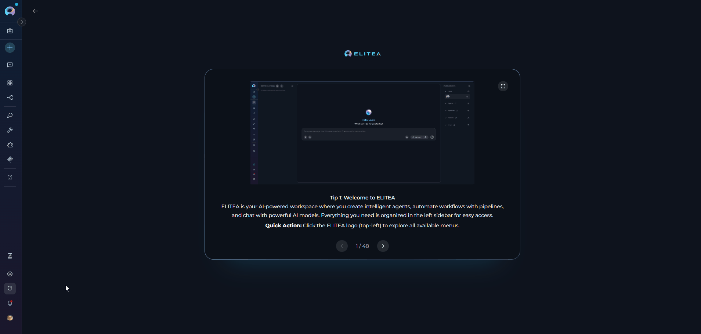

## Introduction

The Notification Center supports:

- **Real-time delivery** — Notifications arrive instantly via a live socket connection; a dot indicator on the sidebar button signals new unread items
- **Quick panel access** — A popover panel lets you review new notifications without leaving your current page
- **Full table view** — The dedicated Notification Center page lists all notifications with search, sorting, and bulk management tools
- **Actionable links** — Notification messages include direct links to the relevant entity (agent version, index, bucket, conversation, Settings page, etc.)
- **Read/unread tracking** — Each notification carries a read state that is visually reflected and can be changed individually or in bulk
- **Bulk operations** — Select multiple entries to mark them as read, mark them as unread, or delete them in a single action

---

## Accessing Notifications

Click the **Notifications** button in the left sidebar to open the quick notification panel. A colored dot on the button signals unread notifications are waiting.

The panel shows only **unread** notifications; scrolling loads more. Each entry displays an icon, message text, and a relative timestamp (e.g., *"5 minutes ago"*). Clicking an embedded link navigates to the relevant page. When empty, the panel shows **"No notifications right now"**.

Click **View all** at the bottom to open the full Notification Center page. To close the panel, click the close button or anywhere outside it.

---

## Notification Center Page

The Notification Center page provides a full table view of all your notifications — read and unread — together with search, sorting, and bulk-action controls.

**Step 1: Open the Notification Center**

1. Click the **Notifications** button in the left sidebar
2. At the bottom of the quick panel, click **View all**

   The page loads with the heading **"Notifications Center"** displayed in the toolbar.

   

**Step 2: Search Notifications**

Use the **Search** bar in the top-right area of the toolbar to filter the list:

- Filtering activates after at least **2 characters** are entered; the list updates automatically after a short delay
- The search matches against the notification event type and its associated metadata content
- Clear the field to return to the full, unfiltered list
- Entering a new search term resets the table to the first page

**Step 3: Sort Notifications**

The table contains two columns:

| Column | Description | Sortable |
|---|---|---|
| **Notification** | Icon, message text, and embedded links for the event | No |
| **Date & Time** | Timestamp formatted as `dd-MMM-yyyy, HH:mm` | Yes |

Click the **Date & Time** column header to toggle between ascending and descending sort order. Sorting resets the table to the first page.

**Step 4: Select Notifications**

- Use the **checkbox** on the left of each row to select individual entries
- Use the **checkbox in the column header** to select or deselect all entries on the current page
  - The header checkbox shows an indeterminate state when only some rows on the current page are selected
- Unread notifications are visually distinguished from read ones

**Step 5: Bulk Actions**

With one or more notifications selected, two action buttons in the toolbar become active:

- **Mark selected as read / Mark selected as unread** — Toggles the read state for all selected notifications. The tooltip reads *"Mark selected as read"* when the selection contains at least one unread entry, and *"Mark selected as unread"* otherwise. A success toast confirms the operation.
- **Delete selected notifications** — Permanently removes all selected notifications. A success toast confirms: *"Notifications deleted successfully"*. This action cannot be undone.

Both buttons are **disabled** when no notifications are selected.

**Step 6: Pagination**

Use the controls at the bottom of the table to navigate between pages:

- Available page sizes: **5**, **10**, **50**, **100** — default is **50**
- The current range is shown (e.g., *1–50 of 134*)
- Use the **Previous** and **Next** buttons to move between pages
- Changing the page size resets to the first page

---

## Notification Types

Each notification is identified by its event type and carries an icon indicating its category.

| Event | Icon | Message displayed in the UI |
|---|---|---|
| **Moderator approved version** | Green checkmark | *[Entity name] is published.* |
| **Moderator rejected version** | Red × | *[Entity name] is rejected.* |
| **Author approval** | Green checkmark | *[Entity name] is approved by [moderator] for publishing.* |
| **Author reject** | Red × | *[Entity name] is rejected by [moderator].* |
| **Agent unpublished** | Red × | *Unpublished agent version id: [version id] from project id: [project id]. [Reason if provided]* |
| **User added to conversation** | Green checkmark | *[username] added [other user] to [conversation name].* |
| **Project created** | Green checkmark | *Project was successfully created* |
| **Index data changed (success)** | Green checkmark | *Index [name] is successfully created/reindexed.* |
| **Index data changed (failed)** | Red error | *Index [name] is failed.* |
| **Bucket expiration warning** | Yellow warning | *Bucket [name] will start deleting files in 24 hours according to its retention policy (files are removed based on each file's creation date; the bucket itself will remain).* |
| **Personal access token expiring** | Yellow warning | *Your personal access token [name] will expire in 24 hours. After expiration, it will no longer work. You can delete and recreate a new token if needed.* |

### Embedded Navigation Links

Several notification types include a clickable link that takes you directly to the relevant area of ELITEA:

| Event | Link destination |
|---|---|
| **Personal access token expiring** | Settings → Tokens tab (new tab) |
| **User added to conversation** | Chat (current tab, opens the specific conversation) |
| **Index data changed** | Toolkit detail → Indexes tab (current tab or new tab) |
| **Bucket expiration warning** | Artifacts page, filtered to the specific bucket (new tab) |

<Info title="Read State Behavior">
The quick notification panel shows only **unread** notifications and does not automatically mark them as read when the panel is opened. Navigating to the full Notification Center page marks all currently visible notifications as read. Use **Mark selected as unread** to restore the unread state on any entry.
</Info>

---

## Best Practices

<Accordion title="Keeping the Notification List Manageable">
- Periodically review notifications and delete entries that are no longer relevant.
- Use the **Select all** header checkbox followed by **Delete selected notifications** to clear an entire page at once.
- Use the **Search** bar to locate a specific event type or entity by keyword before performing bulk actions.
</Accordion>

<Accordion title="Acting on Personal Access Token Warnings">
- A **Personal access token expiring** notification means the token will stop working within 24 hours. Delete and recreate the token from the Settings → Tokens page before it expires.
</Accordion>

<Accordion title="Acting on Index and Bucket Notifications">
- An **Index data changed** notification with a red error icon indicates the indexing operation failed. Click the index name link in the notification to open the index detail page and investigate.
- A **Bucket expiration warning** means file deletion begins within 24 hours. Click the bucket link to review and back up any files you need to retain.
</Accordion>

<Accordion title="Managing Read and Unread State">
- The dot on the **Notifications** sidebar button disappears once there are no remaining unread notifications.
- To mark a batch of notifications as read without deleting them, select them and click the **Mark selected as read** button.
- To re-flag a notification for follow-up, select it and click **Mark selected as unread** to restore the unread indicator.
</Accordion>
