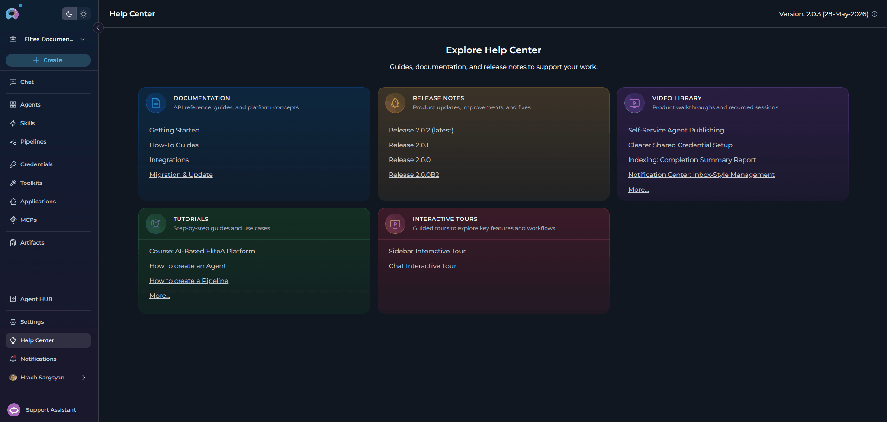

## Main Interface

**Sections:**

1. **Sidebar**: The sidebar drawer allows users to switch among different menus such as Chat, Agents, Skills, Pipelines, Credentials, Toolkits, Applications, MCPs, and Artifacts.
2. **Socket Connection Indicator**: A visual indicator displayed as a colored dot on the ELITEA logo showing the real-time connection status - green for connected, red for disconnected.
3. **Theme Toggle**: A dark/light mode switcher located in the sidebar that allows users to switch between dark and light themes for optimal viewing experience.
4. **Project Selector**: A dropdown tool for quickly switching among available projects.
5. **\+Create button**: A quick button that allows for the rapid creation of a new conversation, agent, pipeline, toolkit, credential, or bucket.
6. **Chat**: Menu, allowing access to all your private and public conversations, allowing for seamless communication and collaboration.
7. **Agents**: Menu, allowing you to view and manage all the agents you have created, each designed to perform specific tasks using external tools.
8. **Skills**: Menu, allowing you to create and manage reusable, named instruction sets that can be attached to agents and invoked on demand. Available in team and personal projects only — hidden when the Public project is selected.
9. **Pipelines**: Menu, allowing you to access and manage all the pipelines you have created, design and automate workflows by connecting various nodes, such as conditions, decisions, loops, and tool integrations.
10. **Credentials**: Menu, allowing you to manage authentication credentials for external services and integrations used by your agents and pipelines.
11. **Toolkits**: Menu, allowing you to create and manage custom toolkits that can be used across different agents and pipelines to extend functionality.
12. **MCPs**: Menu, allowing you to manage external Model Context Protocol (MCP) servers connected via the Elitea MCP Client. Create MCP entries, view their Connected/Disconnected state, enable specific tools, and use them with agents, pipelines, and conversations.
13. **Artifacts**: Menu, allowing you to utilize the Artifacts feature to create Buckets in ELITEA for saving, updating (appending), reading, and deleting files. Artifacts serve as a temporary file storage solution, enhancing your project's data management capabilities.
14. **Applications**: Menu, providing access to purpose-built application integrations such as Wikis and Inventory. Configure and manage deployable solutions that extend ELITEA with specialized, domain-focused capabilities.
15. **Agent HUB**: Special button located in the bottom section of the sidebar, providing quick access to the centralized shared library for discovering and using community-published agents. Browse by categories, search by keywords, and instantly start conversations with pre-built AI assistants.
16. **Settings**: Menu, here, you can configure various project and user-specific settings.
17. **Help Center**: Special button located in the bottom section of the sidebar, providing access to platform documentation, release notes, video walkthroughs, tutorials, and interactive tours.
18. **Notifications**: Notification bell allowing users to get notified about various events such as agent publishing status within ELITEA.
19. **User Profile**: User account section displaying the current user's name and avatar, accessible at the bottom of the sidebar for account management.
20. **Status**: Status indicators and filters showing the current state of agents and other entities (e.g., "All", "Draft", "Published" states).
21. **View Modes**: Cards are displayed in responsive grid layouts that automatically adjust based on screen size and content.
22. **Search**: A Search box available to find agents, pipelines, toolkits, and credentials by their names and descriptions.
    !!! info "Scope" The **Search** functionality operates within the selected menu and is not universal across the entire platform.
23. **Tags**: This section displays the tags (categories) associated with the content being viewed. The tags vary depending on the selected menu.
24. **Teammates**: Shows team members and collaborators who are working on the current project.
25. **Feedback**: Icon located in the bottom left of the screen, allowing users to rate and provide feedback about the ELITEA platform.

## Menus

ELITEA platform consists of the following main menus:

- [**Chat**](./chat)
- [**Agents**](./agents)
- [**Skills**](./skills)
- [**Pipelines**](./pipelines)
- [**Credentials**](./credentials)
- [**Toolkits**](./toolkits)
- [**MCPs**](./mcps)
- [**Artifacts**](./artifacts)
- [**Applications**](./applications)
- [**Agent HUB**](./agents-studio)
- [**Help Center**](./resources)

**Navigation**:

1. To navigate among the menus, click the **ELITEA** icon on the top left.
2. The **Sidebar** drawer is opened.
3. Click on the menu name to navigate to the desired menu.

### General Navigation and Management Across the Platform

This section provides an overview of the common functionalities and actions available across various menus and pages within the platform. The aim is to ensure a consistent and efficient user experience by maintaining uniformity in navigation and management features across **Private** and **Team** projects.

#### **Private** and **Team** projects navigation

In **Private** and **Team** projects you work with the same core menus listed below. In a **Private** project the content is visible only to you. In a **Team** project the entities (conversations, agents, pipelines, etc.) are shared and collaboratively manageable by the team members according to their permissions. The functional menus are:

- **Chat** menu: Access all your private and public conversations, allowing for seamless communication and collaboration.
- **Agents** menu: View and manage all the agents you have created, each designed to perform specific tasks using external tools.
- **Skills** menu: Create and manage reusable, named instruction sets that can be attached to agents and invoked on demand during conversations. Available in team and personal projects only.
- **Pipelines** menu: Access and manage all the pipelines you have created, design and automate workflows by connecting various nodes, such as conditions, decisions, loops, and tool integrations.
- **Credentials** menu: Manage authentication credentials for external services and integrations used by your agents and pipelines.
- **Toolkits** menu: Create and manage custom toolkits that can be used across different agents and pipelines to extend functionality.
- **MCPs** menu: Manage external MCP servers connected to your project via the Elitea MCP Client. Create MCP entries, monitor their Connected/Disconnected state, enable the tools you need, and use them across agents, pipelines, and conversations.
- **Artifacts** menu: Utilize the Artifacts feature to create Buckets in ELITEA for saving, updating (appending), reading, and deleting files. Artifacts serve as a temporary file storage solution, enhancing your project's data management capabilities.
- **Applications** menu: Access purpose-built application integrations such as Wikis and Inventory. Configure deployable solutions that extend ELITEA with specialized, domain-focused capabilities.

### Common Viewing Options

- **Card grid view**: Offers a responsive card-format display of items like agents, pipelines, and toolkits. The layout automatically adjusts the number of columns based on screen size, making it easy to visually scan through content.
- **Table view**: Provides an in-depth look at individual items, presenting extensive details for a comprehensive analysis.

### Search and Filtering Functionality

- **Search**: Seamlessly locate specific items by their name or description using the search feature, which operates within the menu you are currently exploring. This tool is invaluable for quickly finding relevant content across agents, pipelines, toolkits, and credentials.
- **Filtering**: Streamline your search by filtering items using specific tags. This feature is especially useful for discovering content related to particular subjects or themes.

### Sorting Options (Detailed View Only)

- **Name & Description**: Alphabetically organize items by their names, providing an effortless method to find specific titles.
- **Created**: Sort items by their creation date to monitor the chronological development of content or pinpoint the newest additions.
- **Type**: Order items by their defined type (applicable for **Credentials** and **Toolkits** to distinguish categories or implementation kinds).
- **Authors**: Sort items by the author's name.

These standardized functionalities across different menus and pages are designed to simplify navigation and enhance the content management process within the platform, promoting a coherent and user-friendly environment.

---

<Info>
  For detailed definitions of terms and concepts used throughout the ELITEA platform, please refer to the [ELITEA Glossary](../home/glossary).
</Info>