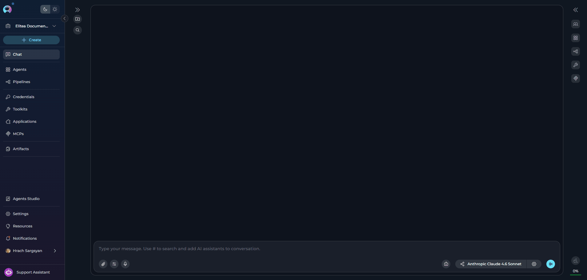
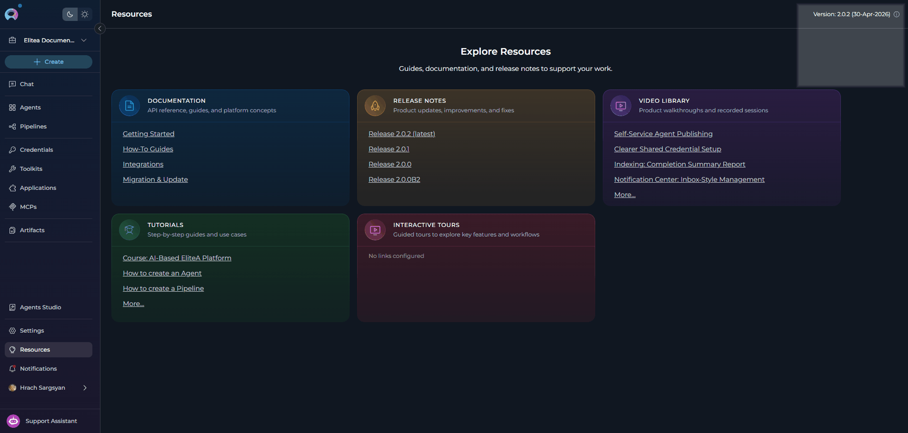

## Introduction
<Note title="Replaces Tips">
The Resources page replaces the previous **Tips** menu.
</Note>

The **Resources** page provides a single location for all learning and reference materials relevant to your ELITEA environment. When you open it, you see a grid of resource cards — each representing a category of content configured by your platform administrator.

<CardGroup cols={2}>
  <Card title="Documentation" icon="file-lines">
    Access API references, guides, and platform concepts for your version of ELITEA.
  </Card>
  <Card title="Release Notes" icon="rocket">
    Stay up to date with product updates, improvements, and bug fixes.
  </Card>
  <Card title="Video Library" icon="square-youtube">
    Watch product walkthroughs and recorded sessions at your own pace.
  </Card>
  <Card title="Tutorials" icon="graduation-cap">
    Follow step-by-step guides and use-case walkthroughs to learn core workflows.
  </Card>
  <Card title="Interactive Tours" icon="file-video">
    Explore key features and workflows through guided, in-product tours.
  </Card>
</CardGroup>

<Note title="Administrator-Configured Content">
All resource cards, their titles, descriptions, and links are configured by your platform administrator. Cards that have not been enabled by your administrator will not appear on the page. If the Resources page appears empty, contact your administrator to configure the available content.
</Note>

## Opening the Resources Page

Click the **Resources** button in the navigation sidebar to navigate to the Resources page.

- When the sidebar is **expanded**, the entry shows the **Resources** label.
- When the sidebar is **collapsed**, only the icon is shown. Hover over it to see the **"Resources"** tooltip.

## Resource Cards

The page displays a grid of up to five resource card types. Each visible card contains a title, a short description, and a list of links that open in a new browser tab.

| Card | Default Title | Default Description |
|------|--------------|---------------------|
| **Documentation** | Documentation | API reference, guides, and platform concepts |
| **Release Notes** | Release Notes | Product updates, improvements, and fixes |
| **Video Library** | Video Library | Product walkthroughs and recorded sessions |
| **Tutorials** | Tutorials | Step-by-step guides and use cases |
| **Interactive Tours** | Interactive Tours | Guided tours to explore key features and workflows |

Your administrator can customize the title and description for each card and provide the specific links that appear inside it. If a card has no links configured, it displays **"No links configured"**.

## Version and System Information

When enabled by your administrator, the **Resources** page header displays the current platform version and its upgrade date. Hovering over the **info icon** next to the version label reveals a tooltip listing all installed plugins and their individual versions.

<Info title="Version Info Availability">
The version label and plugins tooltip are only shown when your administrator has enabled the information display and provided version data. If no version information appears in the header, the feature is not configured in your environment.
</Info>

---

<Info title="Additional Resources">
* [Settings → AI Configuration](./settings/ai-configuration) — Configure AI models used across the platform.
* [Support Assistant](./support-assistant) — Get in-context help from the AI-powered support widget.
* [Contact Support](../support/contact-support) — Reach the ELITEA Support Team for issues not covered in this guide.
</Info>
