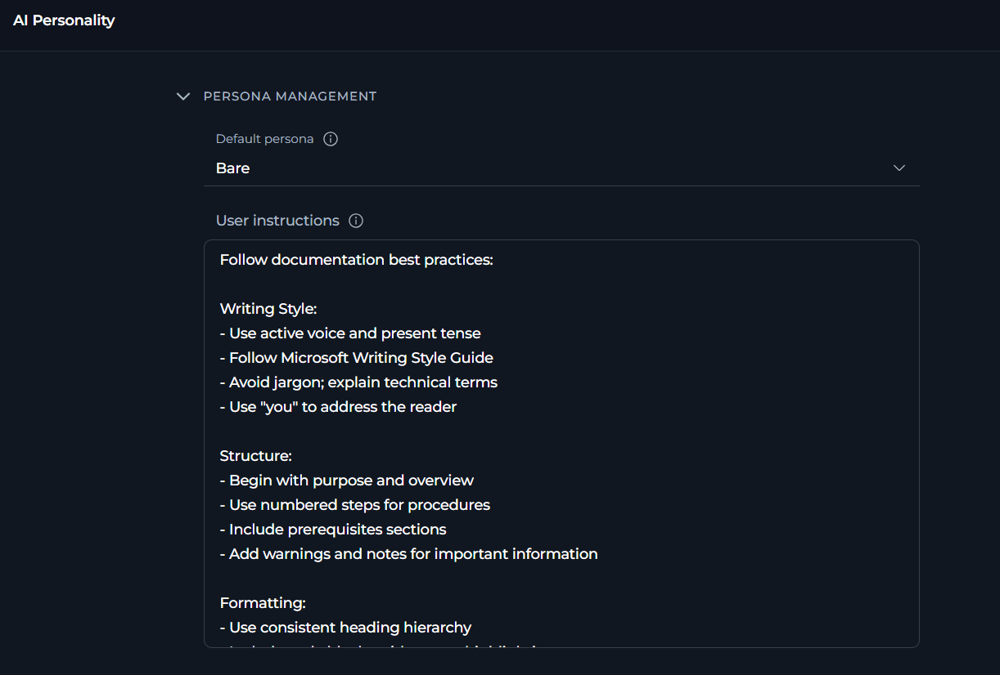
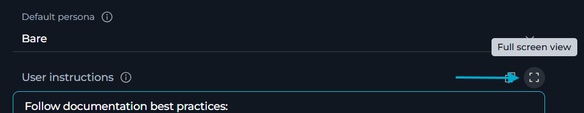
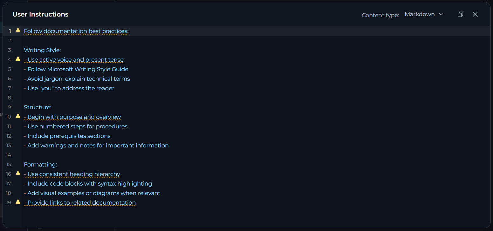

In **AI Personality**, you can select the default persona and provide your default user instructions.

To open **AI Personality**, in **Settings**, select **AI Personality**.



### Default Personality

**Default Personality** sets the communication style and approach that the AI assistant will use by default in all new chats and sessions.

**Available Default Personas**

| Persona | Communication Style | Best For |
|-------------|---------------------|----------|
| **Generic** | Balanced, professional assistant | General-purpose tasks, standard workflows, versatile applications |
| **QA** | Precise, technical, testing-focused | Quality assurance tasks, testing workflows, technical validation |
| **Nerdy** | Technical deep-dives, detailed explanations | Complex technical topics, learning new concepts, in-depth analysis |
| **Quirky** | Creative, playful, thinking outside the box | Brainstorming sessions, creative problem-solving, innovative approaches |
| **Cynical** | Skeptical, challenges assumptions | Critical analysis, risk assessment, design reviews |
| **None** | No personality overlay applied to the default ELITEA-authored system persona | When you prefer the default ELITEA behavior without additional personality customizations |
| **Bare** (default) | No ELITEA identity — only your instructions and tool-required instructions| When you want AI to operate strictly based on your instructions |

To change the default persona, select the desired option from the dropdown.

<Tip title="Choosing the Right Persona">
Consider your primary use cases when selecting a persona:

* **Development teams**: *QA* or *Nerdy* for technical precision
* **Creative projects**: *Quirky* for innovative thinking
* **Business analysis**: *Cynical* for critical evaluation
* **General use**: *Generic* for balanced, versatile assistance
* **No preference**: *None* to use the default ELITEA behavior
</Tip>


### User Instructions

**User Instructions** provide custom guidelines that automatically apply to all new conversations. Here you can define specific requirements, preferences, or constraints that your AI assistants should follow in every interaction.

<Tip title="What you can specify">
* **Communication preferences**: Response format, level of detail, tone
* **Technical requirements**: Programming languages, frameworks, coding standards
* **Workflow guidelines**: Step-by-step approaches, validation requirements
* **Domain knowledge**: Industry-specific terminology, company standards
* **Output format**: How results should be presented or structured
</Tip>

To change the default user instructions, select **Full Screen View**:



In the opened, editor, enter and format your instructions. To save your changes, leave the full screen view. ELITEA automatically saves your instructions as you type.

You can select different content types, including Markdown.



**Example Instructions by Role**

<Accordion title="Software Developer">
```
Follow these guidelines in all responses:

Code Standards:
- Use TypeScript with strict mode enabled
- Follow functional programming principles
- Include JSDoc comments for all functions
- Add error handling with typed error objects

Testing:
- Suggest unit tests using Jest
- Include edge case scenarios
- Provide test data examples

Best Practices:
- Consider performance implications
- Suggest async/await over callbacks
- Recommend clean code patterns
- Flag potential security issues
```
</Accordion>

<Accordion title="QA Engineer">
```
Apply testing best practices to all responses:

Test Coverage:
- Identify positive and negative test cases
- Consider edge cases and boundary conditions
- Include security testing considerations

Documentation:
- Provide clear, reproducible test steps
- Include expected vs actual results format
- Reference relevant testing standards (ISO 29119)

Test Design:
- Use BDD format (Given-When-Then) for test cases
- Organize tests by priority (critical, high, medium, low)
- Consider automation potential
```
</Accordion>

<Accordion title="Technical Writer">
```
Follow documentation best practices:

Writing Style:
- Use active voice and present tense
- Follow Microsoft Writing Style Guide
- Avoid jargon; explain technical terms
- Use "you" to address the reader

Structure:
- Begin with purpose and overview
- Use numbered steps for procedures
- Include prerequisites sections
- Add warnings and notes for important information

Formatting:
- Use consistent heading hierarchy
- Include code blocks with syntax highlighting
- Add visual examples or diagrams when relevant
- Provide links to related documentation
```
</Accordion>

## How Settings Apply

All settings automatically apply to every **new** conversation you create in Chat, Agents, and Pipelines. Settings persist across sessions and devices.

**Limitations:**

* **Only affects new conversations**: Existing conversations retain their original settings
* **Personal settings**: Does not apply to conversations created by other users or shared conversations
* **Agent/Pipeline configs**: Agent and Pipeline definitions have their own independent settings

## Best Practices

**General Approach**

<Accordion title="Start with defaults, then customize">
1. Test default settings first: Generic persona, no custom instructions
2. Monitor conversation quality: Are responses in the style you need?
3. Adjust one at a time: Change persona or add instructions first
4. Document what works: 
   - Keep notes on effective configurations
   - Track which settings work for which types of tasks
</Accordion>

<Accordion title="Balance quality, cost, and performance">
Quality-focused configuration
- Persona: Match your work style
- Instructions: Detailed, specific requirements

Cost-focused configuration
- Persona: Generic (works for most cases)
- Instructions: Brief, essential points only

Balanced configuration (recommended)
- Persona: Choose based on primary use case
- Instructions: 3-7 key requirements
</Accordion>

**Choosing Default Persona**

<Accordion title="Align with your primary use cases">
* **Single role**: Choose the persona that best matches your main work function
* **Multiple roles**: Select the persona you use most frequently
* **Team accounts**: If shared, choose **Generic** for balanced, versatile interactions
* **No preference**: Use **None** to keep the AI's raw default behavior without any style overlay
* **Experimentation**: Try different personas over a few days to find what works best
</Accordion>

<Accordion title="Consider your team's communication style">
* **Formal environments**: **Generic** or **QA** for professional, technical communication
* **Creative teams**: **Quirky** for innovative, out-of-the-box thinking
* **Technical teams**: **Nerdy** for deep, detailed technical discussions
* **Critical review**: **Cynical** for thorough, skeptical analysis
</Accordion>

<Accordion title="Override persona, where needed">
* Personalization sets the default for all new conversations
* Individual conversations can have different settings if needed
* No need to frequently change your default unless your work focus shifts
</Accordion>

**Writing Effective Default Instructions**

<Accordion title="Be specific and actionable">
**Good examples:**

* ✔️ "Always include code examples in Python with type hints"
* ✔️ "Structure responses with a summary paragraph first, then details"
* ✔️ "Check for security vulnerabilities in all code suggestions"

**Avoid vague instructions:**

* ✘ "Be helpful" (too generic, no clear action)
* ✘ "Give good answers" (subjective, no specific guidance)
* ✘ "Make things clear" (ambiguous, means different things to different people)
</Accordion>

<Accordion title="Keep instructions focused">
* **Prioritize**: Include only the most important requirements
* **Length**: Aim for 3-7 key points (typically 100-300 words)
* **Clarity**: Use clear, direct language without ambiguity
* **Relevance**: Focus on instructions that apply broadly to your work

**Too many instructions can:**
* Confuse the AI with conflicting requirements
* Reduce response quality due to complexity
* Make it harder to maintain and update over time
</Accordion>

<Accordion title="Use consistent terminology">
* **Standards**: Reference specific frameworks, style guides, or methodologies
  * Example: "Follow PEP 8 for Python code" instead of "use good Python style"
* **Technical Terms**: Use precise technical vocabulary
  * Example: "Use async/await pattern" instead of "make it asynchronous"
* **Format**: Specify exact formats
  * Example: "Use ISO 8601 date format (YYYY-MM-DD)" instead of "use standard dates"
* **Examples**: Include brief examples for complex requirements
</Accordion>

<Accordion title="Structure your instructions logically">
Organize instructions by category for better clarity:

```
Communication Style:
- Use clear, concise language
- Include executive summaries for complex topics

Technical Requirements:
- Follow PEP 8 for Python code
- Include unit test examples

Output Format:
- Structure responses with numbered steps
- Use markdown formatting for code blocks
```
</Accordion>

<Accordion title="Review and update regularly">
* **Monthly review**: Check if instructions still match your current needs
* **Project changes**: Update when starting new types of projects or roles
* **Team feedback**: Adjust based on conversation quality and outcomes
* **Refinement**: Simplify or clarify instructions that aren't working well
* **Version control**: Keep notes on what changes you make and why
</Accordion>

**Testing Your Settings**

<Accordion title="Test incrementally">
* **Start simple**: Begin with selecting a persona, no custom instructions
* **Add instructions gradually**: Add one instruction at a time
* **Evaluate each**: Use the new settings in several conversations before adding more
* **Document**: Keep notes on what works well and what doesn't
* **Iterate**: Refine based on actual conversation outcomes
</Accordion>

<Accordion title="Create test conversations">
* **Test persona**: Create a new conversation and ask open-ended questions to see the persona in action
* **Test instructions**: Ask the AI to perform tasks that should trigger your custom instructions
* **Compare responses**: Try same question with different personality settings to see differences
* **Edge cases**: Test with requests that might conflict with your instructions
</Accordion>

---

## Troubleshooting

<Accordion title="Settings do not apply to new conversations">
**Symptoms:**

* New conversations don't reflect configured persona
* Default instructions not being followed in new conversations
* AI behavior seems unchanged after making changes

**How Saving Works:**

Settings auto-save — there is no **Save** button to click. Each change type saves differently:

* **Persona dropdown**: saves immediately when you select a new option
* **Instructions**: save when you tab out of the field

Watch for the **"Settings saved successfully"** toast notification to confirm each save occurred.

**Diagnosis:**

1. Check whether a **"Settings saved successfully"** toast appeared after each change — if not, the save may not have triggered
2. Check whether a **"Failed to save settings"** error appeared — indicates a network or server issue
3. Verify you are testing in a **brand new** conversation — existing conversations retain their original settings
4. For numeric fields, verify the values are within the allowed ranges (see Configuration Parameters tables)
5. Confirm settings are visible when reopening the Personalization page after the save notification appeared

**Solution:**

1. Re-enter any field value and click outside to trigger auto-save again
2. Refresh the page and re-apply any changes that weren't confirmed with a toast
3. Create a brand new conversation (do not continue an existing one) to test the new settings
4. Clear browser cache if the page is loading stale data: Ctrl+Shift+Delete (Windows) or Cmd+Shift+Delete (Mac)
</Accordion>

<Accordion title="AI does not follow the default instructions">
**Symptoms:**

* AI responses don't follow specified guidelines
* Instructions appear to be partially followed or ignored
* Inconsistent behavior across different conversations

**Possible Causes:**

1. **Instructions are too complex**: Conflicting or contradictory requirements
2. **Instructions are too vague**: Ambiguous guidelines that AI can't interpret clearly
3. **Model limitations**: Some instructions may be beyond model's current capabilities
4. **User messages override**: Your questions contradict default instructions

**Solution:**

1. **Simplify instructions**:
   - Reduce to 3-5 key points
   - Make each instruction specific and actionable
   - Remove any conflicting requirements
   - Test with minimal instructions first, then add complexity

2. **Clarify requirements**:
   - Replace vague terms ("good", "clear", "helpful") with specific examples
   - Use concrete technical terminology
   - Provide examples of desired behavior in the instructions themselves

3. **Check for conflicts**:
   - Review instructions for contradictions
   - Ensure persona choice aligns with instruction style
   - Test with **Generic** to isolate instruction issues

4. **Test incrementally**:
   - Start with one instruction, verify it works in a new conversation
   - Add instructions one at a time
   - Identify which instruction causes problems
   - Refine problematic instruction before adding more
</Accordion>

<Accordion title="The change of persona has no effect on the new responses">
**Symptoms:**

* All personas seem to behave the same way
* Communication style doesn't match selected persona
* Can't tell the difference between Generic and other personas

**Explanation:**

* Personality differences are subtle and contextual
* Some tasks (e.g., simple data retrieval, calculations) don't show personality variation
* Personality affects tone, approach, and detail level, not factual accuracy

**Understanding:**

* **Persona affects**: Tone of voice, level of technical detail, approach to problem-solving, communication style, enthusiasm level
* **Persona doesn't affect**: Factual accuracy, basic task completion, data retrieval, calculations
* **Most visible in**: Complex explanations, recommendations, creative tasks, problem-solving approaches, code reviews

**To See Personality Differences:**

1. **Ask open-ended questions**: "How should I approach optimizing this code?" or "What are the trade-offs?"
2. **Request analysis**: "Analyze this architecture" or "Review this design"
3. **Compare side-by-side**: Create conversations with different personalities, ask the same complex question
4. **Use creative tasks**: Brainstorming, problem-solving, or design discussions show personality most clearly
</Accordion>

<Accordion title="I get an error *Failed to save settings*">
**Symptoms:**

* A red **"Failed to save settings"** toast notification appears after making a change
* The change was made successfully in the UI but was not persisted

**Possible Causes:**

1. Network connectivity issues
2. Session timeout (logged out)
3. Server error or maintenance
4. Browser issues or extensions blocking the request

**Solution:**

1. **Check network**: Ensure stable internet connection
2. **Refresh page**: Reload page and re-apply the change (Ctrl+R or Cmd+R)
3. **Check login**: Verify you're still logged in — re-authenticate if needed
4. **Try different browser**: Test in incognito/private mode or different browser
5. **Clear cache**: Clear browser cache and cookies
6. **Check console**: Open browser developer tools (F12) → Console tab to see any error messages
7. **Contact support**: If the issue persists, contact your administrator with error details from the console
</Accordion>