**Analytics** provides detailed, real-time visibility into how your team uses the platform.

Analytics data is always **scoped to the currently selected project** and is refreshed from the API with results cached for up to 5 minutes.

<Info title="Project Member Requirement">
**Analytics** is available to **all project members** — no special permissions are required beyond membership in the project. You must be added as a member of the project to view its analytics data.
</Info>

To access **Analytics** settings, select **Settings** > **Analytics**.

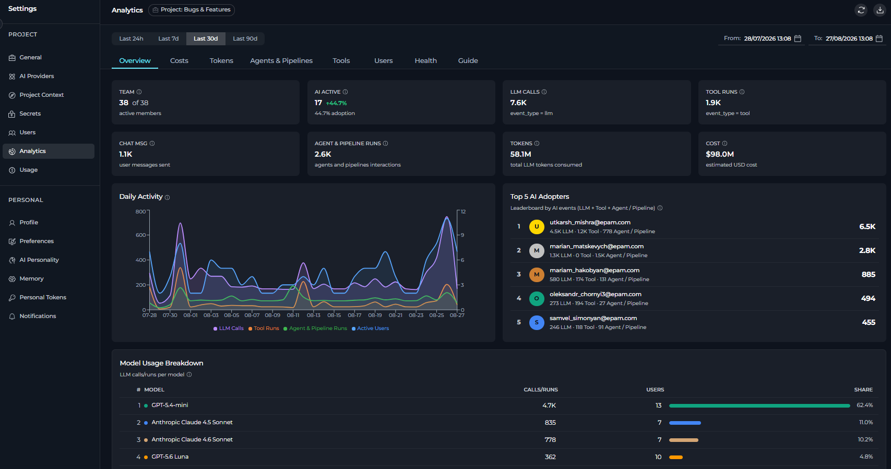

**Analytics** includes these elements:

- **Page header** displays the name of the current project, along with **Refresh** and **Export to Excel** buttons on the right.
- **Refresh button** manually refreshes analytics data, updating the currently active tab with the latest data from the API.
- **Export to Excel button** downloads a comprehensive Excel workbook containing all analytics data (Overview, Costs, Tokens, Agents & Pipelines, Tools, Users, and Health) for the selected date range. The export includes metadata about the project, date range, and timezone.
- **Date filter bar** contains the four quick-preset buttons (**Last 24h**, **Last 7d**, **Last 30d**, **Last 90d**) on the left and the **From / To** datetime pickers on the right.
- **Tabs**: Eight tabs to switch between different analytics views (Overview, Costs, Tokens, Agents & Pipelines, Tools, Users, Health, and Guide).
- **Content area**: The main scrollable panel that renders KPI cards, charts, and tables for the active tab.

<Info title="Project Scope">
All metrics and charts show data only for the **currently selected project**. To view analytics for a different project, switch projects using the project switcher before opening Analytics.
</Info>

In **Analytics**, you can see eight tabs:

<CardGroup cols={3}>
	<Card title="Overview" icon="chart-line" href="#overview">
		Project-wide KPI cards, activity trends, top adopters, and model usage.
	</Card>
	<Card title="Costs" icon="coins" href="#costs">
		Estimated LLM spend and cost breakdowns by model, user, and agent.
	</Card>
	<Card title="Tokens" icon="coins" href="#tokens">
		Token usage breakdown including cache tokens, by model, user, and agent.
	</Card>
	<Card title="Agents & Pipelines" icon="diagram-project" href="#agents--pipelines">
		Usage, latency, errors, and activity trends for agents and pipelines.
	</Card>
	<Card title="Tools" icon="toolbox" href="#tools">
		Tool popularity, reliability, latency, and detailed usage by user and agent.
	</Card>
	<Card title="Users" icon="users" href="#users">
		Per-user activity, AI adoption, model usage, tool usage, and agent usage.
	</Card>
	<Card title="Health" icon="heart-pulse" href="#health">
		Request volume, error rates, and latency by event type.
	</Card>
	<Card title="Guide" icon="book-open" href="#guide">
		Guides to metrics, charts, calculations, and data sources.
	</Card>
</CardGroup>

## Date Range Controls

You can control the time window applied to all tabs using the filter bar at the top of the page.

**Quick Presets**

Use four preset buttons to set the date range with a single click:

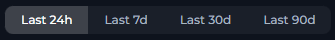

| Preset | Date Range |
|--------|-----------|
| **Last 24h** | Previous 24 hours |
| **Last 7d** | Previous 7 days (default on page load) |
| **Last 30d** | Previous 30 days |
| **Last 90d** | Previous 90 days |

**Custom Date/Time Pickers**

Use the **From** and **To** datetime pickers for precise time windows:

- **From** sets the start of the analysis period. Cannot be set later than **To**.
- **To** sets the end of the analysis period. Cannot be set earlier than **From**.

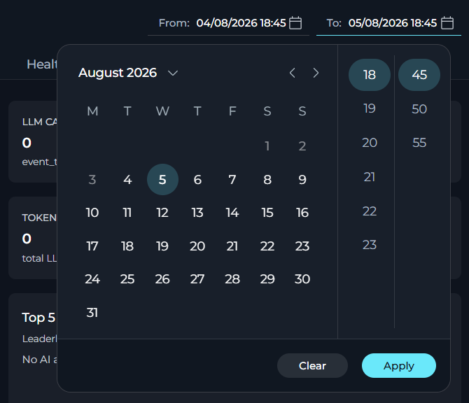

Both pickers support entering a specific date and time (24-hour format). The pickers include **Clear** and **Ok** action buttons. After adjusting the custom pickers, the active preset button is automatically deselected.

<Info title="Default Range">
The page loads with **Last 7d** pre-selected. Re-selecting a preset button instantly refreshes all tab data for that window without any additional action.
</Info>

## Overview

**Overview** displays project-wide KPI cards and summary charts for the selected date range.

### KPI Cards

KPI cards show the most important metrics for the selected date range.

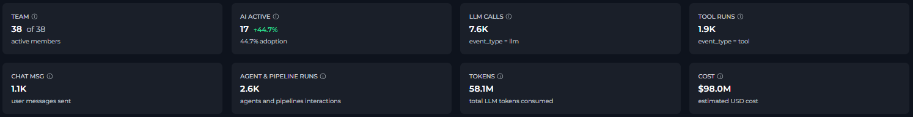

| KPI | Description | Calculation |
| --- | --- | --- |
| **TEAM** | Active members (X) out of all users ever seen in the project (Y). | X = distinct users with ≥ 1 event in range; Y = distinct users all-time. |
| **AI ACTIVE** | Users with at least one LLM, tool, or agent event in the period. Includes an **adoption rate badge** (e.g. `↑ 72%`) = `AI ACTIVE / TEAM × 100%`. | Distinct users where `event_type` in (`llm`, `tool`) or `entity_type` = `application`. |
| **LLM CALLS** | Total number of Large Language Model invocations (prompts sent to AI models). | Count of events where `event_type = "llm"`. |
| **TOOL RUNS** | Total number of tool executions triggered by agents or users. | Count of events where `event_type = "tool"`. |
| **CHAT MSG** | Total user messages sent in the chat interface. | Count of events where `action = "SIO chat_predict"`. |
| **AGENT & PIPELINE RUNS** | Total interactions with agents and pipelines. | Count of events where `entity_type = "application"`. |
| **TOKENS** | Total LLM tokens consumed in the selected date range. | Sum of `input_tokens + output_tokens`. |
| **LLM COST** | Estimated total LLM cost for the selected date range. | Sum of `llm_cost` across LLM events. |

### Daily Activity

A multi-series area chart showing AI usage trends over time:

- **LLM Calls** (purple): AI model invocations per day.
- **Tool Runs** (orange): Tool executions per day.
- **Agent & Pipeline Runs** (green): Agent and pipeline interactions per day.
- **Active Users** (blue, Team Projects only): unique active users per day.

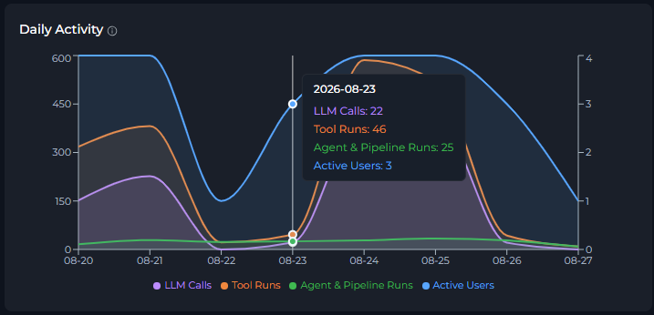

Use this chart to spot usage spikes, identify quiet periods, or track adoption trends over time. For Personal Projects, the Active Users series is not displayed.

### Top 5 AI Adopters

A leaderboard table that shows five users with the most combined AI events (LLM + Tool + Agent). Each row displays:

- Rank and color-coded avatar (gold/silver/bronze for top 3).
- User email.
- Per-type breakdown: `N LLM · N Tool · N Agent`.
- Total AI events score.

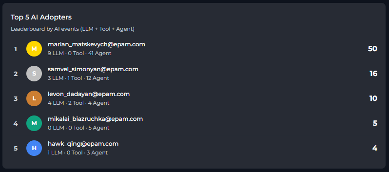

Clicking a row navigates you directly to the user's detail view in **Users**.

## Costs

**Costs** shows estimated LLM spend for the selected date range.

<Info title="Estimated Costs">
ELITEA calculates cost values from a local model-price table. Actual provider invoices may differ.
</Info>

### KPI Cards

Five KPI cards appear at the top of the Costs tab:

| KPI | Description |
| --- | --- |
| **TOTAL COST** | Estimated total LLM cost for the selected date range, including input, output, cache read, and cache write costs |
| **TOTAL TOKENS** | Total input and output tokens combined |
| **INPUT TOKENS** | Total prompt tokens |
| **OUTPUT TOKENS** | Total completion tokens |

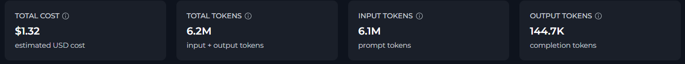

### Daily Cost Trend

Shows estimated daily cost as a bar chart.

- The X axis shows the date.
- The Y axis shows estimated cost.

If no daily cost data is available for the selected date range, ELITEA shows **No data**.

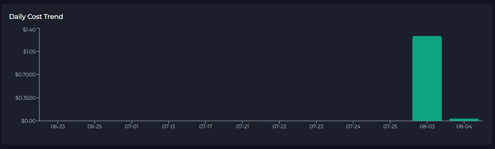

### Cost by User

Ranks users by estimated total cost.

| Column | Description |
| --- | --- |
| **User** | User email |
| **Cost** | Estimated total cost attributed to that user |
| **Share** | Percentage of the total user cost represented by that user |

If no user cost data is available for the selected date range, ELITEA shows an empty-state message.

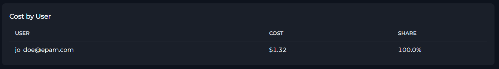

### Cost by Model

Ranks models by estimated total cost.

| Column | Description |
| --- | --- |
| **Model** | Model display name or model identifier |
| **Cost** | Estimated total cost for that model |
| **Calls** | Number of LLM calls made with that model |
| **Avg Cost / Call** | Estimated average cost per call for that model |
| **Share** | Percentage of the total model cost represented by that model |

If no model cost data is available for the selected date range, ELITEA shows an empty-state message.

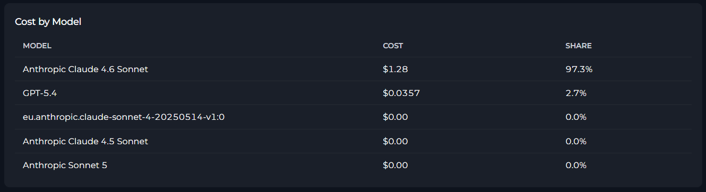

### Cost by Agent & Pipeline

Ranks agents and pipelines by estimated total cost.

| Column | Description |
| --- | --- |
| **Agent / Pipeline** | Agent or pipeline name |
| **Cost** | Estimated total cost attributed to that agent or pipeline |
| **Calls** | Number of LLM calls attributed to that agent or pipeline |
| **Avg Cost / Call** | Estimated average cost per call |
| **Share** | Percentage of the total agent and pipeline cost represented by that row |

If no agent or pipeline cost data is available for the selected date range, ELITEA shows an empty-state message.

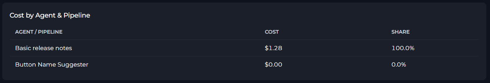

## Tokens

**Tokens** provides detailed token usage analytics for the selected date range, including cache token tracking.

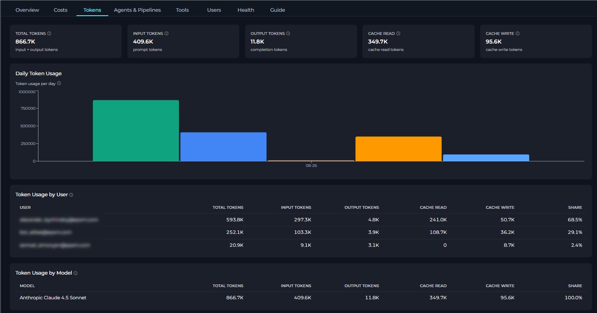

<Info title="Cache Tokens">
Cache read and cache write tokens are tracked separately for models that support prompt caching (e.g., Claude models). Cache tokens help reduce costs by reusing previously processed prompts.
</Info>

### KPI Cards

Five KPI cards appear at the top of the Tokens tab:

| KPI | Description |
| --- | --- |
| **TOTAL TOKENS** | Sum of all token types consumed during the selected date range. This includes input tokens (prompts), output tokens (responses), cache read tokens (reused from cache), and cache write tokens (stored to cache). Use this metric to track overall token consumption trends and compare usage across different time periods. |
| **INPUT TOKENS** | Tokens sent to AI models as part of your requests, including system prompts, user messages, instructions, conversation history, and any context provided. Reducing input tokens through prompt optimization or conversation pruning directly lowers costs. |
| **OUTPUT TOKENS** | Tokens generated by AI models in their responses to your prompts. Higher output token counts may indicate verbose responses. You can reduce output tokens by setting max_tokens limits or instructing models to provide more concise answers. |
| **CACHE READ** | Tokens served from the provider's prompt cache instead of being processed fresh. Cache hits can reduce costs by 50-90% for supported models (e.g., Claude with prompt caching). A high cache read count indicates effective prompt reuse and cost optimization. Only available for models that support prompt caching. |
| **CACHE WRITE** | Tokens written to the provider's prompt cache for potential reuse in future requests. These tokens are stored once and can then be read multiple times at a reduced cost. High cache write values indicate new or frequently changing prompts. Structure prompts with static content at the beginning to maximize cache effectiveness. |

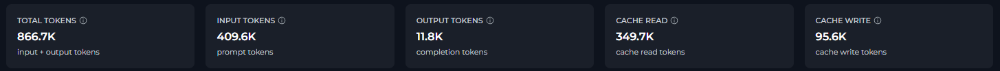

### Daily Token Usage

A multi-bar chart showing  daily total, input, and output token usage for LLM requests in the selected date range:

- **Total Tokens** (primary bar): combined token usage per day
- **Input Tokens** (second bar): prompt tokens per day
- **Output Tokens** (third bar): completion tokens per day
- **Cache Read Tokens** (fourth bar): cached tokens read per day
- **Cache Write Tokens** (fifth bar): tokens written to cache per day

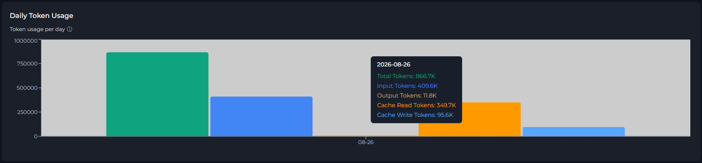

If no token data is available for the selected date range, ELITEA shows **No token usage is available for the selected date range.**

### Token Usage by User

Shows token usage attributed to each project user during the selected date range.

| Column | Description |
| --- | --- |
| **USER** | User email or identifier |
| **TOTAL TOKENS** | Combined input, output, cache read, and cache write tokens |
| **INPUT TOKENS** | Prompt tokens attributed to that user |
| **OUTPUT TOKENS** | Completion tokens attributed to that user |
| **CACHE READ** | Cache read tokens attributed to that user |
| **CACHE WRITE** | Cache write tokens attributed to that user |
| **SHARE** | Percentage of the total project token usage represented by that user |

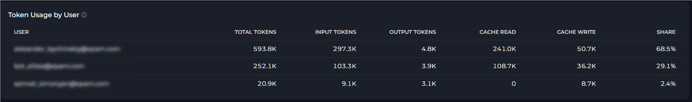

If no user token data is available for the selected date range, ELITEA shows an empty-state message.

### Token Usage by Model

Shows token usage for each AI model used in the selected date range.

| Column | Description |
| --- | --- |
| **MODEL** | Model display name or model identifier |
| **TOTAL TOKENS** | Combined tokens for that model |
| **INPUT TOKENS** | Prompt tokens for that model |
| **OUTPUT TOKENS** | Completion tokens for that model |
| **CACHE READ** | Cache read tokens for that model |
| **CACHE WRITE** | Cache write tokens for that model |
| **SHARE** | Percentage of the total project token usage represented by that model |

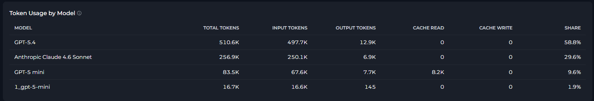

If no model token data is available for the selected date range, ELITEA shows an empty-state message.

### Token Usage by Agent & Pipeline

Shows token usage attributed to Agents and Pipelines during the selected date range.

| Column | Description |
| --- | --- |
| **AGENT / PIPELINE** | Agent or pipeline name |
| **TOTAL TOKENS** | Combined tokens attributed to that agent or pipeline |
| **INPUT TOKENS** | Prompt tokens attributed to that agent or pipeline |
| **OUTPUT TOKENS** | Completion tokens attributed to that agent or pipeline |
| **CACHE READ** | Cache read tokens attributed to that agent or pipeline |
| **CACHE WRITE** | Cache write tokens attributed to that agent or pipeline |
| **SHARE** | Percentage of the total project token usage represented by that row |

If no agent or pipeline token data is available for the selected date range, ELITEA shows an empty-state message.

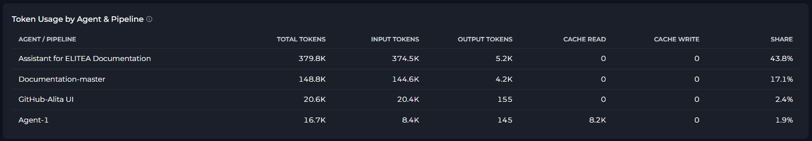

## Agents & Pipelines

**Agents & Pipelines** show how individual agents (applications) are used within the project.

<video src="../../img/menus/settings/project/analytics/analytics-agent-tab.mp4" controls></video>

### Most Active Agents

A bar chart showing the **top 20 agents** ranked by total event count. Each bar is color-coded and labeled with the agent name.

     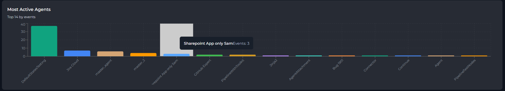

### Chat Messages

An area chart showing the number of user messages (`SIO chat_predict` events) sent per day. Useful for tracking chat engagement trends independent of agent-specific metrics.

     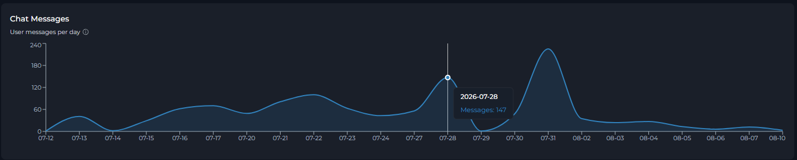

### Agent Activity

A paginated, searchable table listing all agents and pipelines in the project:

     | Column | Description |
     |--------|-------------|
	| **Agent / Pipeline** | Agent or pipeline name (clickable to open **Agent Detail View**) |
     | **Runs** | Total runs for this agent or pipeline |
     | **Cost** | Estimated LLM cost attributed to this agent or pipeline |
     | **Total Tokens** | Total input and output tokens combined |
     | **Input Tokens** | Total input tokens attributed to this agent or pipeline |
	| **Output Tokens** | Total output tokens attributed to this agent or pipeline |
     | **Avg Latency** | Mean execution time (displayed as `Xms` or `X.Xs`) |
     | **Errors** | Error count (highlighted in red when > 0) |	

Use the search box (top-right of the table) to filter agents and pipelines by name. Page size can be set to 10, 20, or 50 rows per page.

### Agent Details

Click any agent row to open a drill-down view showing:

- **Header**: Agent name with a back arrow to return to the full list.
- **KPI Cards**: Total Events, Unique Users, Avg Latency, Errors, Error Rate, Total Tokens, Input Tokens, Output Tokens, Total Cost, and Avg Cost / Call.
- **Runs by Day**: Area chart showing events and errors per day for this agent.
- **Users**: Lists each user who interacted with the agent or pipeline, with per-user events, average latency, and errors.
- **Tools**: Lists each tool called by this agent or pipeline, with call count.

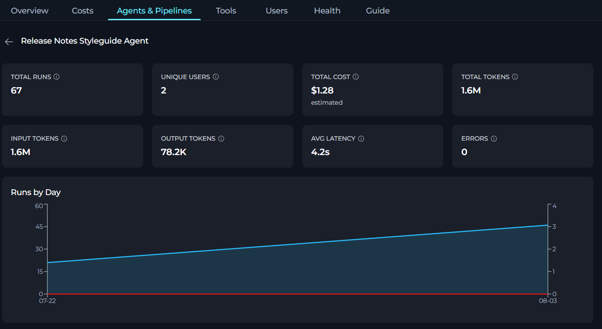

To return to the Agents list, click the **back arrow** in the header.

## Tools

**Tools** show usage patterns for individual tools executed by agents or users.

<video src="../../img/menus/settings/project/analytics/analytics-tools-tab.mp4" controls></video>

### Most Popular Tools

A bar chart showing the **top 20 tools** ranked by number of calls. Tool names on the X axis, call count on the Y axis.

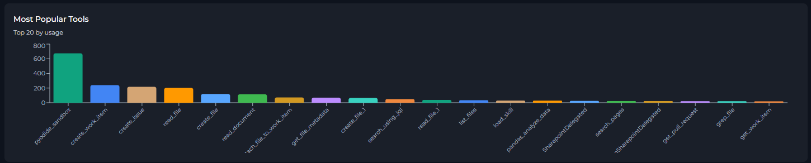

### Tool Details

A paginated, searchable table listing all tools used in the project:

| Column | Description |
|--------|-------------|
| **Tool** | Tool name (clickable to open Tool Detail View) |
| **Calls** | Total number of times the tool was called |
| **Users** | Distinct users who triggered this tool |
| **Avg Latency** | Mean execution time |
| **Errors** | Error count (highlighted in red when > 0) |

Use the search box to filter tools by name. Page size options: 10, 20, or 50.

### Tool Details View

Click any tool row to open a drill-down view:

- **KPI Cards**: Total Calls, Unique Users, Avg Latency, Errors, Error Rate.
- **Daily Usage Chart**: Area chart showing calls and errors per day for this tool.
- **Users table**: Users who called this tool, with per-user calls, average latency, and errors.
- **Agents table**: Agents that used this tool, with call count (resolved by correlating trace IDs).

     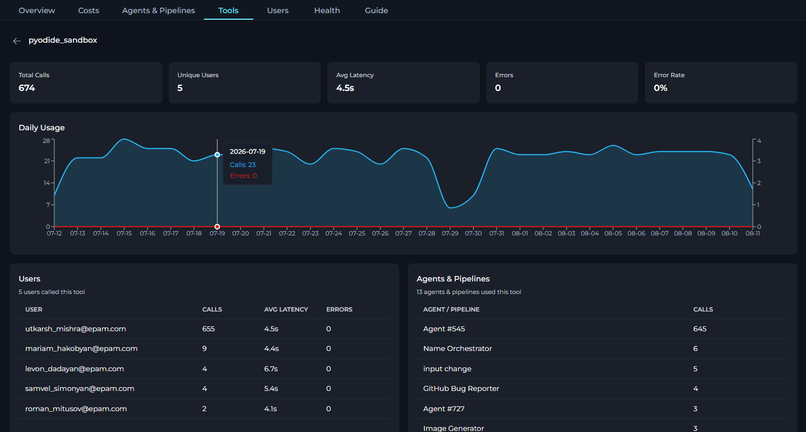

To return to the Tools list, click the **back arrow**.

## Users

**Users** provides per-person analysis of platform activity.

### User Activity

A paginated, searchable table listing all users active in the project during the selected period:

| Column | Description |
|--------|-------------|
| **User** | User email (or `User <ID>` if email is unavailable; clickable) |
| **Active Days** | Number of distinct calendar days the user was active |
| **LLM Calls** | LLM call count |
| **Tool Calls** | Tool execution count |
| **Agent / Pipeline Runs** | Agent and pipeline interaction count |
| **Chat Msg** | Chat message count |
| **Errors** | Error count (red when > 0) |
| **Total Tokens** | Total input and output tokens combined |
| **Total Cost** | Estimated LLM cost attributed to that user |

Use the search box to filter by email address. Page size options: 10, 20, or 50.

### User Details

Click any user row to open a drill-down view:

- **Header**: User email with a back arrow.
- **KPI Cards**: Active Days, LLM Calls, Tool Calls, Agent & Pipeline Runs, Chat Msg, Errors, Total Tokens, Input Tokens, Output Tokens, and Total Cost.
- **Daily Activity Chart**: Area chart with four series — LLM, Tool, Chat Msg, and Agent — showing how this user's activity is distributed over time.
- **Models Used** list: AI models this user queried, with call counts.
- **Tools Used** list: Tools this user triggered, with call counts.
- **Agents & Pipelines Used** list: Agents and pipelines this user interacted with, with run counts.

<Tip title="Cross-Tab Navigation">
Clicking a user in the **Top 5 AI Adopters** leaderboard on the Overview tab navigates directly to that user's detail view in the Users tab. A back arrow returns you to the Overview.
</Tip>

## Health

**Health** provides system reliability metrics, helping you identify error patterns and latency issues.

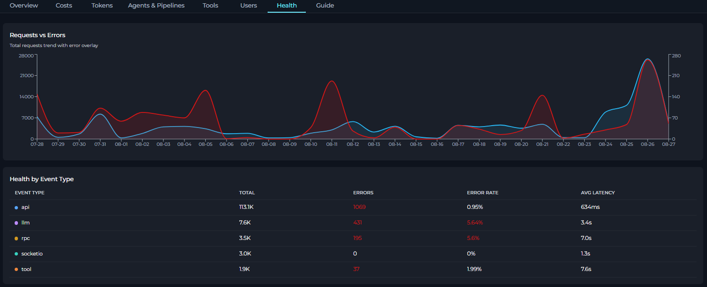

### Requests vs Errors

A dual-series area chart showing:

- **Total Requests** (blue): all events per day.
- **Errors** (red): events that resulted in an error per day.

Spikes in the red area indicate periods with elevated error rates.

### Health by Event Type

A breakdown table showing reliability per event type:

| Column | Description |
|--------|-------------|
| **Event Type** | Category of platform event (color-coded dot) |
| **Total** | Total events of this type |
| **Errors** | Error count (red when > 0) |
| **Error Rate** | `Errors / Total × 100%` (red when > 5%) |
| **Avg Latency** | Mean duration in ms or seconds |

**Event types tracked:**

| Event Type | Color | Meaning |
|------------|-------|---------|
| `api` | Blue | HTTP REST API calls (UI actions, data fetches) |
| `socketio` | Teal | WebSocket events (chat, real-time features) |
| `llm` | Purple | AI model calls (Claude, GPT, Gemini, etc.) |
| `tool` | Orange | Tool executions (Jira, Slack, web search, etc.) |
| `agent` | Green | Agent workflow invocations |
| `rpc` | Yellow | Internal service-to-service calls |

<Info title="Expected Latency">
High latency on `llm` events is normal (model inference takes time). Elevated latency on `api` or `rpc` calls may indicate infrastructure or configuration issues worth investigating.
</Info>

## Guide

**Guide** is a built-in metric glossary embedded directly in **Analytics**.

It explains every KPI, chart, and table column with:
- **Description**: What the metric represents in plain language.
- **Calculation**: The exact formula used to compute the value.
- **Data source**: Which event types or platform actions contribute to the metric.

**Guide** covers all seven tabs in *Analytics*: Study all metric definitions in **Guide** before drawing conclusions from the data.

## Limitations

| Limitation | Details |
|------------|---------|
| **Data freshness** | API responses are cached for **5 minutes**. Switching tabs or adjusting the date range within that window may serve cached data. |
| **Overview and Health data shared** | **Overview** and **Health** use the same underlying API call. Switching between them does not trigger a new request while cached data is still fresh. |
| **Agent / Tool / User tabs are independent** | Each tab fetches data separately with server-side pagination. Navigation within a tab (pagination, search) triggers new API requests. |
| **Top charts limited to 20 items** | **Most Active Agents** and **Most Popular Tools** charts always show the top 20 items only. Use the paginated table below each chart to browse additional entries. |
| **Trace-ID correlation** | Tool-to-agent associations (in detail views) are resolved by matching `trace_id` values. This is only available when trace IDs are correctly propagated by the SDK. |
| **Project-only scope** | There is no cross-project or portfolio-level view within Analytics. For cross-project analysis, use the **Monitoring** section in Settings. |
| **Costs are estimates** | **Costs** and **Tokens** use a local model-price table, so provider invoices may differ. |
| **Costs and Tokens use separate requests** | **Costs** and **Tokens** load data from a dedicated cost analytics endpoint. |
| **Cache token support** | Cache read and cache write tokens are only available for models that support prompt caching (e.g., Claude models with Anthropic's prompt caching feature). |

## Practical Examples

<Accordion title="Measuring AI Adoption Across Your Team">
1. Open **Settings** → **Analytics**.
2. Select the **Last 30d** preset.
3. On the **Overview** tab, read the **TEAM** and **AI ACTIVE** KPI cards.
4. The **Adoption Rate** badge (e.g., `↑ 72%`) tells you what proportion of your registered team members actively used AI features in the past 30 days.
5. Scroll to the **Top 5 AI Adopters** leaderboard to identify your most active members — click any name to drill into their individual activity in the Users tab.
</Accordion>

<Accordion title="Identifying Underused or Overloaded Agents">
1. Open the **Agents** tab.
2. Use the **Most Active Agents** bar chart to quickly see which agents receive the most traffic.
3. In the **Agent Activity** table, sort mentally by the **Events** column (highest first by default) to find heavily used agents.
4. Click any agent to open its detail view and check **Avg Latency** and **Error Rate**. A high error rate (> 5%) highlights agents that may need debugging or configuration review.
5. Agents with zero events in the selected period may be deprecated or not yet discovered by your team.
</Accordion>

<Accordion title="Auditing Tool Usage and Reliability">
1. Open the **Tools** tab.
2. The **Most Popular Tools** chart gives an at-a-glance view of which integrations are relied upon most.
3. In the **Tool Details** table, look for tools with a non-zero **Errors** count (displayed in red).
4. Click a tool with errors to open its detail view: the **Daily Usage** chart reveals when errors spiked, and the **Users** sub-table shows which users encountered them.
5. Cross-reference with the **Health** tab to check the system-wide error rate for the `tool` event type during the same period.
</Accordion>

<Accordion title="Reviewing an Individual User's Activity">
1. Open the **Users** tab.
2. Use the search box to filter by the user's email address.
3. Click the user's row to open their detail view.
4. Review the **Daily Activity** area chart to see on which days they were most active and which event types dominate.
5. The **Models Used**, **Tools Used**, and **Agents Used** lists show exactly which platform resources this user engaged with — useful for onboarding support or license reviews.
</Accordion>

<Accordion title="Investigating an Error Spike">
1. Open the **Health** tab.
2. In the **Requests vs Errors** chart, identify the date range of the error spike.
3. In the **Health by Event Type** table, find the row with the highest **Error Rate** (values > 5% are highlighted in red).
4. Note the event type (e.g., `llm` or `tool`) and navigate to the corresponding tab (**Agents** or **Tools**) to identify which specific agent or tool was responsible.
5. Narrow the date range using the **From/To** pickers to focus on the spike period, then re-examine the relevant tab.
</Accordion>

<Accordion title="Monitoring Token Usage and Optimizing Costs">
1. Open the **Tokens** tab to get a complete view of token consumption.
2. Review the **Daily Token Usage** chart to identify days with unusually high token consumption.
3. Check the **Token Usage by Model** table to see which AI models are consuming the most tokens. Models with high output tokens may indicate verbose responses that could be optimized.
4. In the **Token Usage by Agent & Pipeline** table, identify agents with disproportionately high token usage relative to their value.
5. Look at **CACHE READ** and **CACHE WRITE** KPI cards — high cache read percentages indicate good prompt caching efficiency, which reduces costs for supported models (e.g., Claude).
6. Cross-reference with the **Costs** tab to understand the financial impact of token usage patterns.
</Accordion>

<Accordion title="Evaluating Prompt Caching Effectiveness">
1. Open the **Tokens** tab and note the **CACHE READ** and **CACHE WRITE** values.
2. Calculate cache hit ratio: divide **CACHE READ** tokens by (**CACHE READ** + **INPUT** tokens) × 100%.
3. Review **Token Usage by Agent & Pipeline** to identify which agents benefit most from caching.
4. Agents with high cache read tokens are efficiently reusing prompts, reducing costs by up to 90% for cached portions.
5. Agents with low or zero cache tokens may benefit from prompt restructuring to enable caching — place static instructions at the beginning of prompts.
6. Use **Daily Token Usage** to track how caching efficiency changes over time after prompt optimizations.
</Accordion>

## Best Practices

<Accordion title="Start with a Meaningful Date Range">
Before reading any metrics, set the date range that matches your analysis goal. Use **Last 7d** for recent activity reviews, **Last 30d** for monthly reporting, and custom pickers for audit periods tied to specific events or releases.
</Accordion>

<Accordion title="Use the Guide Tab Before Drawing Conclusions">
Open the **Guide** tab to review exact metric definitions and calculation formulas. Metrics like **TEAM** (active users vs. total ever seen) and **AI ACTIVE** (LLM/Tool/Agent users only) have specific scopes that affect interpretation.
</Accordion>

<Accordion title="Combine Overview and Users Tabs for Adoption Analysis">
Use the **Overview** tab to get the aggregate adoption picture, then drill down via the **Top 5 AI Adopters** leaderboard or the **Users** tab to identify specific individuals for coaching or recognition.
</Accordion>

<Accordion title="Monitor Health Regularly">
Review the **Health** tab after deployments or integrations changes. A sudden increase in `llm` or `tool` error rates often signals a misconfigured AI model or a broken external service credential.
</Accordion>

<Accordion title="Cross-Reference Agents and Tools Tabs">
When an agent shows high errors in the **Agents** tab, open its detail view and check the **Tools** sub-table. Then visit the **Tools** tab, click the problematic tool, and check which other agents also rely on it — helping you assess the blast radius of a broken integration.
</Accordion>

<Accordion title="Leverage Cross-Tab Navigation">
You can navigate directly from the **Overview** leaderboard to a specific user's detail view without going through the Users tab manually. Similarly, using the back arrow in any detail view returns you smoothly to the list without losing your sort or search state.
</Accordion>

<Accordion title="Use Tokens Tab to Optimize AI Costs">
The **Tokens** tab is your primary tool for cost optimization. Start by identifying the biggest token consumers in the **Token Usage by Model** and **Token Usage by Agent & Pipeline** tables. Focus optimization efforts on the top 20% of consumers, which typically account for 80% of total usage. For models supporting prompt caching (like Claude), monitor cache read tokens — a healthy cache hit rate can reduce costs by 50-90% on repeated prompts. If cache tokens are low, restructure prompts to place static instructions at the beginning, enabling the provider's caching system to work effectively.
</Accordion>

<Accordion title="Track Token Trends After Prompt Changes">
Whenever you modify agent prompts or system instructions, use the **Tokens** tab to measure the impact. Set a custom date range spanning one week before and one week after the change. Compare **Daily Token Usage** patterns to see if input tokens decreased (more concise prompts) or if output tokens changed (different response length). Review **Token Usage by Agent & Pipeline** to isolate the impact to specific agents. This data-driven approach helps validate that prompt engineering efforts are actually reducing token consumption and costs.
</Accordion>

<Accordion title="Monitor Per-User Token Consumption for Fair Usage Policies">
If your organization has fair usage policies or user quotas, use the **Token Usage by User** table in the **Tokens** tab to monitor individual consumption. Sort by **TOTAL TOKENS** to identify outliers. Click through to the **Users** tab for detailed daily activity patterns. High token users may be running inefficient workflows, testing extensively, or legitimately processing large volumes. Combine token data with the **Costs** tab to understand the financial impact per user, helping inform capacity planning and budget allocation decisions.
</Accordion>
