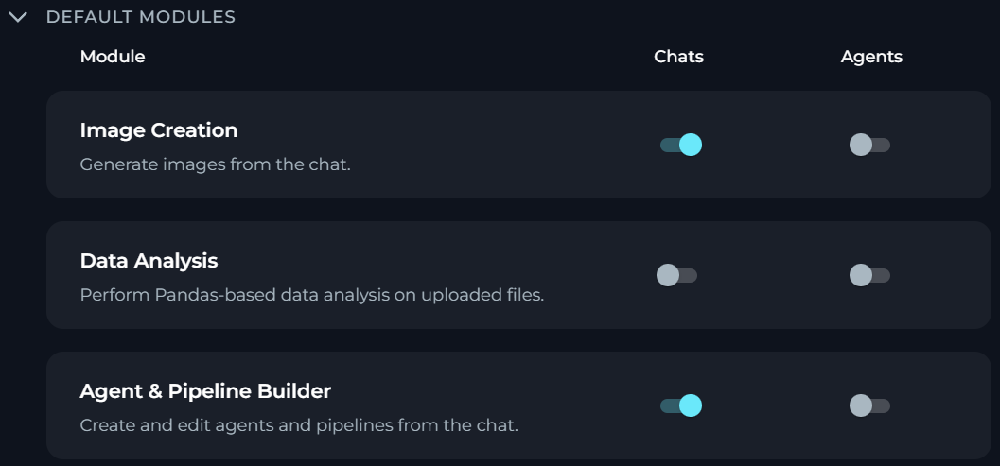
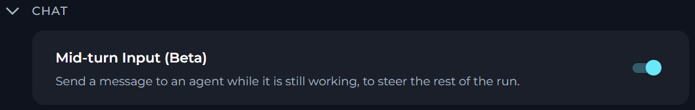
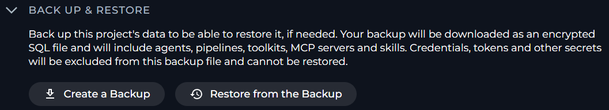

In **General** settings, you can review project-level information, copy connection details for AI integrations, specify default chat settings, select default modules for chats and agents and back up or restore the project data.

To access **General** settings, select **Settings** > **General**.

In **General**, you can see five sections:

<CardGroup cols={3}>
	<Card title="General" icon="briefcase">
		Review the project icon, project name and teammate count.
	</Card>
	<Card title="AI Configurations" icon="sliders">
		Copy project connection values and open the OpenAI template view.
	</Card>
	<Card title="Default Modules" icon="grid-2">
		Select what modules will be turned on for chats and agents by default.
	</Card>
	<Card title="Chat" icon="comments">
		Specify default chat settings.
	</Card>
	<Card title="Back Up & Restore" icon="box-archive">
		Back up or restore the project data.
	</Card>
</CardGroup>

<Note>
Your rights to view and edit **General** settings depend on your role and permissions.

- **General** is a part of the project settings section.
- **Default Modules** are shown only to users who can view project context settings. 
- To edit the project icon and select default modules, you need permissions for editing the project context settings.
- **Chat** is shown only if the mid-turn input is turned on for the project and you have permission to view project context settings.
- **Back Up & Restore** is shown only to users who have permission to download or restore project backups.
</Note>

## Project Details

In **General**, you can see current project identity details.

- Project icon
- Project name
- Number of teammates in the project

<Note>For the public project, ELITEA hides the teammate count.</Note>

If you have permission to edit project context settings, you can set the project icon.

To change the project icon:

1. In **General**, select the edit icon on the project avatar.
2. In the icon dialog, choose one of these options:
	- Select a default icon.
	- Select an uploaded icon.
	- Upload a new image.
3. Wait for ELITEA to save the change.

For custom icons, ELITEA accepts these file types: `bmp`, `gif`, `ico`, `jpeg`, `jpg`, `png`, `tiff` and `webp`.

**The image must be smaller than 500 KB.**

If you reset the icon to the default one, ELITEA removes your custom project icon.

## AI Configurations

In **AI Configurations**, you can view and copy project connection details to use them for connecting external OpenAI-compatible clients or SDKs to this project.

It has two tabs, **Basic** and **OpenAI Template**.

### Basic

The **Basic** tab shows the current project configuration values for OpenAI-compatible services.

| Value | Description |
| --- | --- |
| `OpenAI-BaseURL` | The API endpoint URL for OpenAI-compatible services (formatted as `{server_url}/llm/v1`) |
| `Server URL` | The base server URL for the current instance |
| `OpenAI-Project` | The project identifier used in the OpenAI-compatible configurations when a model project is available |
| `Project ID` | The unique identifier of the current project |

To copy the displayed configuration details to the clipboard, select **Copy**:

### OpenAI Template

The **OpenAI Template** tab shows a code example that uses the current project model configuration.

In this tab, you can:
    
- Select a model configuration
- Switch the example language
- Copy the generated code example
- Download the generated code example

The template uses a placeholder personal token value instead of a real token.

## Default Modules

**Default Modules** controls which modules will be turned on by default for team members in chats and agents. Each module has a separate **Chats** toggle and **Agents** toggle.

<Note title="Default Modules">
**Default Modules** settings apply to the whole project. Team members cannot change these defaults, but they can turn a module on or off for their own chats or agents.
</Note>

<Note>If you do not have permission to edit project context settings, ELITEA shows **Default Modules** as read-only.</Note>

**Default Modules** lists these modules:

| Module | Purpose |
| --- | --- |
| Image Creation | Generate images from the chat. |
| Data Analysis | Perform Pandas-based data analysis on uploaded files. |
| Agent & Pipeline Builder | Create and edit agents and pipelines from the chat. |
| Skill Builder | Create and edit skills from the chat. |
| Project Context Builder | Create and edit your project context from the chat. |
| Ask User | Allow agents to ask you clarifying questions instead of guessing. |
| Planner | Create, manage and track tasks and action items from the chat. |
| Python Sandbox | Execute Python code securely in a secure sandbox. |
| Swarm Mode | Enable multi-agent collaboration by sharing the full conversation history and control between agents. |
| Smart Tools Selection | Reduce token usage when working with many toolkits by using meta-tools instead of binding all tools directly. |

To change a module setting for chats or agents, select or clear its corresponding toggle.

## Chat

In **Chat**, you can specify default chat settings.

<Note>If you do not have permission to edit project context settings, ELITEA shows **Chat** as read-only.</Note>

With **Mid-turn Input (Beta)** turned on, you can send a message to an agent while it is still working, to steer the rest of the run.

## Back Up & Restore

In **Back Up & Restore**, you can download your project data as an encrypted SQL file or restore them from this backup file, if needed.

<Callout icon="lightbulb" color="#a855f7" title="When to Back Up Your Project">
Consider creating a backup before making large changes to your project.
</Callout>

It has two actions, **Create a Backup** and **Restore from the Backup**.

<Note>If you do not have permission to download or restore project backups, ELITEA hides **Back Up & Restore**.</Note>

Your backup will include agents, pipelines, toolkits, MCP servers and skills. ELITEA excludes credentials, tokens and other secrets from the backup file, so they will not be restored with other project data.

<CardGroup cols={2}>
	<Card title="Included in the backup file" icon="check" color="#22c55e">
		- Agents
		- Skills
		- Pipelines
		- Toolkits
		- MCP servers
	</Card>
	<Card title="Excluded from the backup file" icon="circle-exclamation" color="#ef4444">
		- Credentials
		- Tokens
	</Card>
</CardGroup>

<Info title="See Also">
See also:
- [Project Context](./project-context.mdx)
- [AI Configuration](./ai-configuration.mdx)
- [Chat](../chat.mdx)
</Info>
