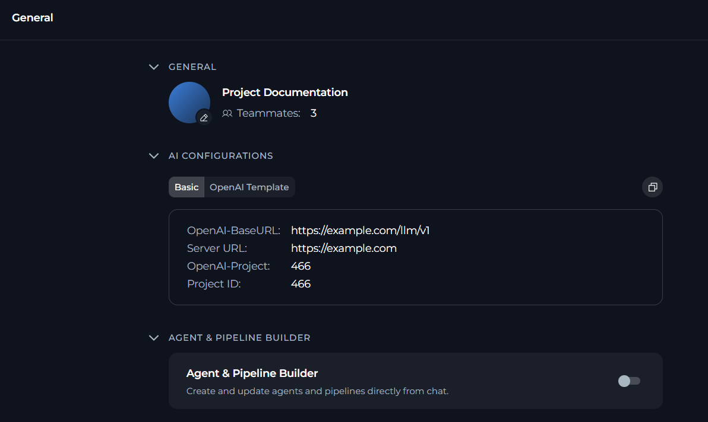
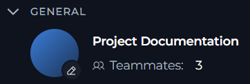
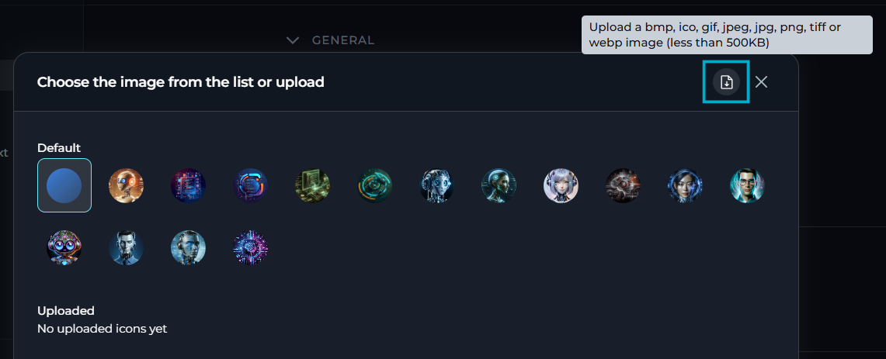
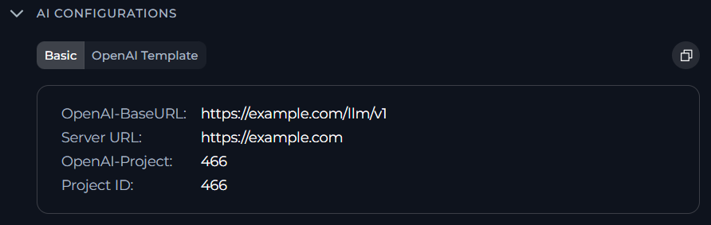
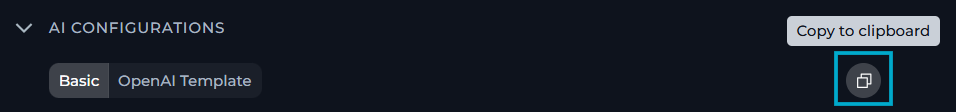
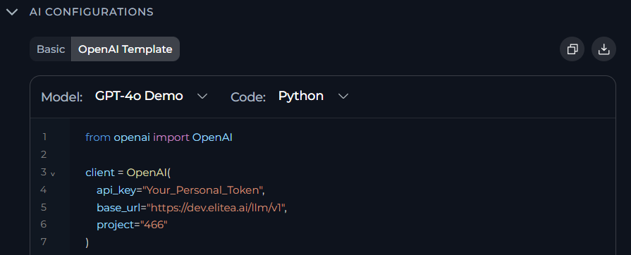
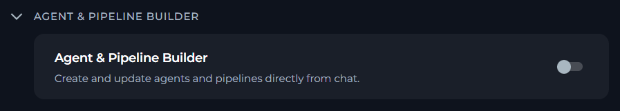

In **General** settings, you can review project-level information, copy connection details for AI integrations and control whether users can build agents and pipelines from the chat.

To access **General** settings, select **Settings** > **General**.

In **General**, you can see three sections:

<CardGroup cols={3}>
	<Card title="General" icon="briefcase">
		Review the project icon, project name and teammate count.
	</Card>
	<Card title="AI Configurations" icon="sliders">
		Copy project connection values and open the OpenAI template view.
	</Card>
	<Card title="Agent & Pipeline Builder" icon="diagram-project">
		Control whether users can create and update agents and pipelines from chat.
	</Card>
</CardGroup>

<Note>
Your rights to view and edit **General** settings depend on your role and permissions.

- **General** is a part of the project settings section.
- To edit the project icon, you need permissions for editing project context settings.
- **Agent & Pipeline Builder** is shown only to users who can view project context settings.
</Note>

## Project Details

In **General**, you can see current project identity details.

- Project icon
- Project name
- Number of teammates in the project

<Note>For the public project, ELITEA hides the teammate count.</Note>

If you have permission to edit project context settings, you can set the project icon.

To change the project icon:

1. In **General**, select the edit icon on the project avatar.
2. In the icon dialog, choose one of these options:
	- Select a default icon.
	- Select an uploaded icon.
	- Upload a new image.
3. Wait for ELITEA to save the change.

For custom icons, ELITEA accepts these file types: `bmp`, `gif`, `ico`, `jpeg`, `jpg`, `png`, `tiff` and `webp`.

**The image must be smaller than 500 KB.**

If you reset the icon to the default one, ELITEA removes your custom project icon.

## AI Configurations

In **AI Configurations**, you can view and copy project connection details for external AI clients and SDK usage.

It has two tabs, **Basic** and **OpenAI Template**.

### Basic

The **Basic** tab shows the current project configuration values for OpenAI-compatible services.

| Value | Description |
| --- | --- |
| `OpenAI-BaseURL` | The API endpoint URL for OpenAI-compatible services (formatted as `{server_url}/llm/v2`) |
| `Server URL` | The base server URL for the current instance |
| `OpenAI-Project` | The project identifier used in the OpenAI-compatible configurations when a model project is available |
| `Project ID` | The unique identifier of the current project |

To copy the displayed configuration details to the clipboard, select **Copy**:

### OpenAI Template

The **OpenAI Template** tab shows a code example that uses the current project model configuration.

In this tab, you can:
    
- Select a model configuration
- Switch the example language
- Copy the generated code example
- Download the generated code example

The template uses a placeholder personal token value instead of a real token.

## Agent & Pipeline Builder

**Agent & Pipeline Builder** controls whether users can create and update agents and pipelines directly from chat.

To change this setting, toggle the switch on or off.

When the setting is on, ELITEA allows creating agents and pipelines from chat. When the setting is off, ELITEA disables that project-level capability.

If you do not have permission to edit project context settings, ELITEA shows the section as read-only.

<Info title="See Also">
- [Project Context](./project-context.mdx)
- [AI Configuration](./ai-configuration.mdx)
</Info>

