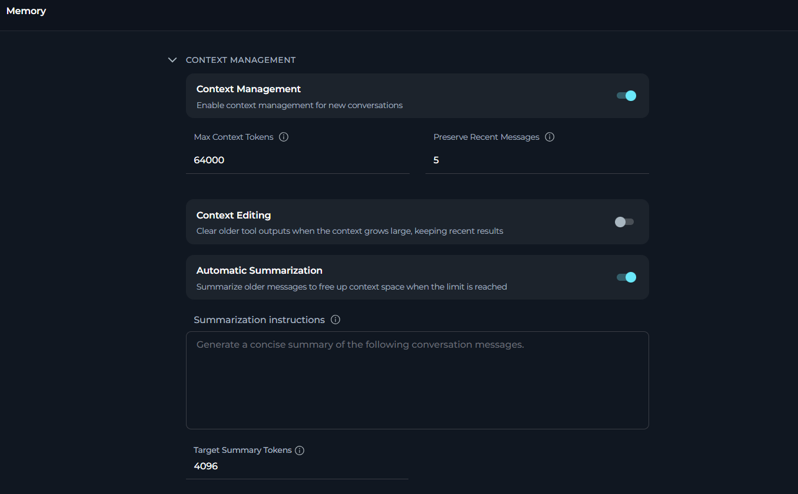
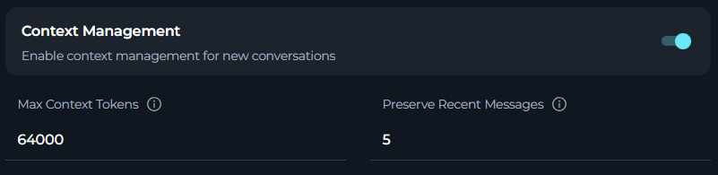
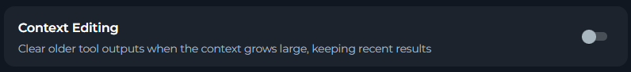
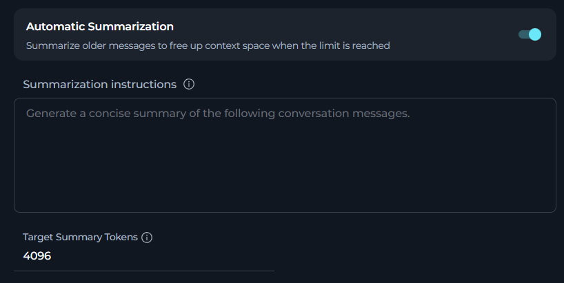
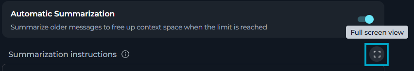

In **Memory**, you can configure how ELITEA manages conversation context, context editing, and automatic summarization for new conversations.

To open **Memory**, in **Settings**, select **Memory**.



In **Memory**, you can see three sections:

<CardGroup cols={3}>
  <Card title="Context Management" icon="brain" href="#default-context-management">
    Control context limits and preserved recent messages for new conversations.
  </Card>
  <Card title="Context Editing" icon="pen-to-square" href="#context-editing">
    Control whether ELITEA clears older tool outputs while keeping recent results.
	</Card>
	<Card title="Automatic Summarization" icon="file-lines" href="#enable-automatic-summarization">
		Control whether and how ELITEA summarizes older messages.
	</Card>
</CardGroup>

## Context Management

In **Context Management**, you can set how conversation history is managed in all new conversations.



<Info title="What Is Context Management?">
Context management determines how much conversation history is retained and passed to the AI model in each request. Managing context effectively balances:

* **Quality**: More context helps AI provide relevant, coherent responses
* **Cost**: Token usage directly affects API costs
* **Performance**: Excessive context can slow response times
* **Limits**: AI models have maximum token limits (context windows)
</Info>

**Configuration Parameters**

| Parameter | Type | Default | Range | Description |
|-----------|------|---------|-------|-------------|
| **Enable context management for new conversations** | Toggle | ON | ON/OFF | Activates automatic context management |
| **Max Context Tokens** | Number | 64000 | 1000 - 10000000 | Maximum tokens allocated for conversation history |
| **Preserve Recent Messages** | Number | 5 | 1 - 99 | Minimum recent messages always retained in context |

### Enable Context Management

Toggle to enable or disable automatic context management for new conversations.

**When enabled:**

* Context is automatically managed based on **Max Context Tokens**
* System preserves recent messages as specified
* Older messages are automatically summarized or removed when token limit is approached
* Conversation continuity is maintained efficiently

**When disabled:**

* All conversation history is sent with each request (until model limit reached)
* No automatic context optimization occurs
* May hit model token limits in longer conversations
* Higher token costs and potential performance issues

<Tip title="Recommendation">
Keep context management **enabled** (default) for optimal performance and cost efficiency, especially for longer conversations.
</Tip>

### Max Context Tokens

Specifies the maximum number of tokens to use for conversation context in each AI request.

<Info title="What is a token?">
* Basic unit of text that AI models process
* Approximately: 1 token ≈ 4 characters or ≈ 0.75 words in English
* Example: "Hello, how are you?" ≈ 5-6 tokens
* Both input (context) and output (response) count toward model limits
</Info>

**To choose the correct value**

<Accordion title="Consider your model">
Different AI models have different context windows:

* **GPT-4.1**: 128,000 tokens
* **GPT-4**: 8,192 tokens (standard) or 32,768 tokens (32k version)
* **GPT-3.5 Turbo**: 16,385 tokens

Set *Max Context Tokens* to **50-75% of your model's limit** to leave room for:

* System instructions and prompts (your default instructions count here)
* AI response generation
* Safety margins to prevent hitting hard limits
</Accordion>

<Accordion title="Balance quality vs cost">
* **Higher values (100,000+)**: 
    * ✔️ Better context retention for very long conversations
    * ✔️ AI can refer to the information from much earlier in conversation
    * ✘ Higher token costs per request
    * ✘ Slower response times

* **Medium values (10,000-64,000)**:
    * ✔️ Good balance of quality and cost (recommended)
    * ✔️ Suitable for most use cases
    * ✔️ Efficient performance

* **Lower values (1,000-10,000)**:
    * ✔️ Minimal token costs
    * ✔️ Faster responses
    * ✘ May lose context in longer conversations
    * ✘ AI may "forget" earlier discussion points
</Accordion>

<Accordion title="Adjust to your use cases">
* **Short Q&A sessions**: 10,000-20,000 tokens (quick questions, brief interactions)
* **Standard development**: 30,000-64,000 tokens (typical coding, documentation tasks)
* **Long technical discussions**: 64,000-128,000 tokens (complex debugging, architecture reviews)
* **Extensive analysis**: 100,000+ tokens (large codebase reviews, comprehensive research)
</Accordion>

### Preserve Recent Messages

Specifies the minimum number of recent conversation messages to always keep in context, regardless of token limits.

<Info title="How it works">
1. **Priority protection**: These messages are never removed or summarized, even if total tokens exceed Max Context Tokens
2. **Recent context**: Ensures AI always has immediate conversation context
3. **Continuity**: Maintains coherent responses even when older context is summarized
4. **Count method**: Each user message and corresponding AI response counts as 2 messages
</Info>

**To choose the correct value**

<Accordion title="Consider your conversation style">
* **Quick Q&A (1-3 messages)**: 
    * Each question is independent
    * Minimal context dependency
    * Lower value sufficient

* **Iterative development (5-10 messages)**:
    * Building on previous responses
    * Code refinements and iterations
    * Medium value recommended (default 5 works well)

* **Complex problem-solving (10-20 messages)**:
    * Multi-step troubleshooting
    * Extended debugging sessions
    * Higher value ensures continuity
</Accordion>

<Accordion title="Balance with your token limits">
* Recent messages are **always** kept, even if they exceed **Max Context Tokens**
* If 5 recent messages contain 70,000 tokens but Max Context Tokens = 64,000:
    * All 5 recent messages are still preserved
    * Only older messages beyond these 5 are subject to token limits
* Set this value carefully to avoid unintentionally high token usage
</Accordion>

<Accordion title="Test and monitor">
* **Start with default (5)** and monitor conversation quality
* **Increase if** AI loses track of recent discussion points
* **Decrease if** token costs are too high and conversations are short
* **Monitor**: Check how often you need to re-explain recent context
</Accordion>

## Context Editing

In **Context Editing**, you can control whether ELITEA clears older tool outputs when the conversation context grows large, while keeping recent results.

<Note>
**Context Editing** is available only when **Context Management** is enabled.
</Note>



## Automatic Summarization

In **Automatic Summarization**, you can configure how ELITEA performs automatic summarization for conversations. When enabled, ELITEA will automatically condense long conversations to maintain context while reducing token usage.

<Warning title="Dependency on Context Management">
Summarization is only active when **Context Management is enabled**. If the **Enable context management for new conversations** toggle is off, summarization settings are inactive even if the summarization toggle is on. To use summarization, make sure context management is enabled first.
</Warning>



As conversations grow longer, they consume more tokens and approach model limits. Automatic summarization:

* **Detects** when the conversation length reaches a threshold
* **Generates** a concise summary of older messages
* **Replaces** older messages with the summary
* **Preserves** recent messages (as specified in Context Management)
* **Maintains** conversation continuity while reducing tokens

**Configuration Parameters**

| Parameter | Type | Default | Range/Options | Description |
|-----------|------|---------|---------------|-------------|
| **Enable automatic summarization** | Toggle | ON | ON/OFF | Activates automatic conversation summarization |
| **Summarization instructions** | Multiline text | "Generate a concise summary of the following conversation messages." | - | Custom instructions for summary generation |
| **Target Summary Tokens** | Number | 4,096 | 100 - 4,096 | Target token count for generated summaries |

### Enable Automatic Summarization

Toggle to enable or disable automatic summarization for conversations.

**When enabled:**

* System monitors conversation length continuously
* Automatically triggers summarization when threshold is reached
* Older messages are condensed into a summary
* Recent messages remain untouched
* Token usage is optimized for long conversations

**When disabled:**

* No automatic summarization occurs
* Full conversation history is maintained (subject to **Context Management** limits)
* May hit token limits faster in extended conversations
* Manual context management may be required

<Tip title="Recommendation">
Keep summarization **enabled** (default) for conversations that may become lengthy, especially for:

* Extended debugging or troubleshooting sessions
* Iterative development work
* Multi-topic discussions
* Long-running analysis or research tasks
</Tip>

### Summarization Instructions

Custom instructions that guide how conversation summaries are generated.

**What You Can Specify**
* **Summary style**: Bullet points vs paragraphs, technical vs conversational
* **Focus areas**: What information to prioritize in summaries
* **Format requirements**: Structure, length constraints, organization
* **Preservation rules**: Critical information that must never be omitted
* **Context needs**: How much detail to retain for continuity

To change the summarization instructions, select **Full Screen View**:



In the opened, editor, enter and format your instructions. To save your changes, leave the full screen view. ELITEA automatically saves your instructions as you type.

**Example Custom Instructions**

<Accordion title="Technical discussions">
```
Create a structured summary of the conversation:

Format:
- Use bullet points for key discussion topics
- Preserve all code snippets and technical commands
- Include decisions made and their rationale
- List any unresolved questions or action items

Content:
- Focus on technical details, not social pleasantries
- Maintain exact terminology and technical terms
- Preserve version numbers, file paths, and configurations
```
</Accordion>

<Accordion title="Problem-solving sessions">
```
Summarize the troubleshooting conversation:

1. Problem Statement: Brief description of the original issue
2. Steps Attempted: List of solutions tried and their outcomes
3. Current Status: Where we are now in the debugging process
4. Next Actions: What to try next

Keep all error messages and diagnostic output verbatim.
```
</Accordion>

### Target Summary Tokens

Specifies the target length (in tokens) for generated conversation summaries.

Here are some token references:

* **256 tokens**: ~192 words - short paragraph summary
* **1024 tokens**: ~768 words - moderate detail summary
* **4096 tokens (default)**: ~3072 words - comprehensive summary

<Info title="How it works">
**Original conversation:**

  - Messages 1-20: 45,000 tokens
  
**After summarization:**

  - Summary of messages 1-15: ~4,096 tokens (Target Summary Tokens)
  - Original messages 16-20: 15,000 tokens (preserved recent messages)
  
**Result:**

  - Total Context: ~19,096 tokens (reduced from 45,000)
</Info>

**To choose the correct value**

<Accordion title="Brief summaries (100-512 tokens)">
**When to Use:**

* Conversations are highly repetitive
* Maximum token savings needed
* Simple Q&A that doesn't require much context

**Effects:**

* ✔️ Maximum token reduction
* ✔️ Lowest summarization costs
* ✔️ Fastest summary generation
* ✘ May lose important details
* ✘ AI may need clarification more often
</Accordion>

<Accordion title="Moderate summaries (512-2048 tokens)">
**When to Use:**

* Balance detail retention with token savings
* Standard technical discussions
* General-purpose conversations

**Effects:**

* ✔️ Good balance of detail and conciseness
* ✔️ Preserves key points and decisions
* ✔️ Reasonable token costs
* ✔️ Suitable for most use cases
</Accordion>

<Accordion title="Comprehensive summaries (2048-4096 tokens - default)">
**When to Use:**

* Complex technical discussions
* Multi-topic conversations
* Conversations with critical context that must be preserved
* Detailed problem-solving sessions

**Effects:**

* ✔️ Maximum details are preserved (default)
* ✔️ Rich context for AI to reference
* ✔️ Better continuity across long conversations
* ✘ Higher summarization costs
* ✘ Summaries themselves consume significant tokens
</Accordion>


## How Settings Work Together

<Info title="Example">
Example scenario: Long development session

1. **CONTEXT MANAGEMENT** (Efficiency):
     - Max Context Tokens: 64,000
     - Preserve Recent Messages: 5
     - Result: AI can reference extensive history (up to 64K tokens) while always keeping last 5 exchanges

2. **AUTOMATIC SUMMARIZATION** (Optimization):
     - Enabled: Yes
     - Target Tokens: 4,096
     - Result: When the context approaches the token limit, older messages are automatically condensed into a 4K token summary

**Combined effect**:

* Conversation can continue indefinitely without hitting token limits (Context Management + Summarization)
* Recent context always available for coherent responses (Preserve Recent Messages)
* Token costs optimized by automatic summarization of older content
</Info>

## How Settings Apply

All settings automatically apply to every **new** conversation you create in Chat, Agents, and Pipelines. Settings persist across sessions and devices.

**Limitations:**

* **Only affects new conversations**: Existing conversations retain their original settings
* **Personal settings**: Does not apply to conversations created by other users or shared conversations
* **Agent/Pipeline configs**: Agent and Pipeline definitions have their own independent settings

## Best Practices

**General Approach**

<Accordion title="Start with defaults, then customize">
1. **Test Default Settings First**:
   - Context Management: Enabled, 64,000 tokens, 5 preserved messages
   - Summarization: Enabled, 4,096 target tokens

2. **Monitor Conversation Quality**:
   - Do you hit token limits?
   - Does summarization maintain enough detail?

3. **Adjust One Section at a Time**:
   - Adjust context limits if needed
   - Fine-tune summarization last

4. **Document What Works**:
   - Keep notes on effective configurations
   - Track which settings work for which types of tasks
</Accordion>

<Accordion title="Understand section dependencies">
The sections interact with each other:

* **Disabling Context Management** also disables  **Max Context Tokens** and **Preserve Recent Messages** inputs — they are hidden
* **Summarization is only active when Context Management is enabled** — if you disable context management, summarization settings are also inactive even if the toggle is on

Therefore, if you want summarization, you must keep **CContext Management** enabled.
</Accordion>

<Accordion title="Consider your conversation patterns">
**For short conversations (< 20 messages):**

* Context Management: Lower token limits (20,000-30,000) to save costs
* Summarization: Can disable or leave at defaults for short conversations

**For medium conversations (20-50 messages):**

* Context Management: Standard limits (40,000-64,000)
* Summarization: Default settings work well

**For long conversations (50+ messages):**

* Context Management: Higher limits (64,000-128,000)
* Summarization: Critical for cost control
</Accordion>

<Accordion title="Balance quality, cost, and performance">
**Quality-Focused Configuration**

```
Context Management:
  - Max Tokens: 100,000+ (high limit)
  - Preserve Messages: 10-15 (more recent context)

Summarization:
  - Target Tokens: 4,096 (comprehensive summaries)

Result: Maximum context retention, best AI responses, higher costs
```

**Cost-Focused Configuration**

```
Context Management:
  - Max Tokens: 20,000 (lower limit)
  - Preserve Messages: 3-5 (minimal recent context)

Summarization:
  - Target Tokens: 1,024 (concise summaries)

Result: Minimal token usage, lower costs, may need more clarifications
```

**Balanced Configuration (Recommended)**

```
Context Management:
  - Max Tokens: 64,000 (default)
  - Preserve Messages: 5 (default)

Summarization:
  - Target Tokens: 4,096 (default)

Result: Good quality, reasonable costs, works for most scenarios
```
</Accordion>

## Troubleshooting

<Accordion title="Settings do not apply to new conversations">
**Symptoms:**

* AI behavior seems unchanged after making changes

**How Saving Works:**

Settings auto-save — there is no Save button to click. Each change type saves differently:

* **Text fields**: save when you click/tab out of the field
* **Numeric fields**: save on blur, but only if the entered value is within the valid range
* **Toggles**: save immediately on toggle

Watch for the **"Settings saved successfully"** toast notification to confirm each save occurred.

**Diagnosis:**

1. Check whether a **"Settings saved successfully"** toast appeared after each change — if not, the save may not have triggered
2. Check whether a **"Failed to save settings"** error appeared — indicates a network or server issue
3. Verify you are testing in a **brand new** conversation — existing conversations retain their original settings
4. For numeric fields, verify the values are within the allowed ranges
5. Confirm settings are visible when reopening **Memory** after the save notification appeared

**Resolution:**

1. Re-enter any field value and click outside to trigger auto-save again
2. Refresh the page and re-apply any changes that weren't confirmed with a toast
3. Create a brand new conversation (do not continue an existing one) to test the new settings
4. Clear browser cache if the page is loading stale data: Ctrl+Shift+Delete (Windows) or Cmd+Shift+Delete (Mac)
</Accordion>

<Accordion title="Numeric fields are not saved (silent failure)">
**Symptoms:**

* You type a new value for **Max Context Tokens**, **Preserve Recent Messages**, or **Target Summary Tokens**
* No *Settings saved successfully* toast appears after clicking away
* The field may show a red validation error message

**Cause:**

Auto-save is blocked when a field value fails validation. The form will not save until all fields contain valid values.

**Valid Ranges:**

| Field | Min | Max |
|-------|-----|-----|
| Max Context Tokens | 1,000 | 10,000,000 |
| Preserve Recent Messages | 1 | 99 |
| Target Summary Tokens | 100 | 4,096 |

**Resolution:**

1. Look for a red error message directly below the field
2. Correct the value to be within the valid range
3. Click outside the field — the save will trigger automatically once the value is valid
4. Wait for the *Settings saved successfully* confirmation toast
</Accordion>

<Accordion title="I get an error *Failed to save settings*">
**Symptoms:**

* A red **"Failed to save settings"** toast notification appears after making a change
* The change was made successfully in the UI but was not persisted

**Possible Causes:**

1. Network connectivity issues
2. Session timeout (logged out)
3. Server error or maintenance
4. Browser issues or extensions blocking the request

**Resolution:**

1. **Check Network**: Ensure stable internet connection
2. **Refresh Page**: Reload page and re-apply the change (Ctrl+R or Cmd+R)
3. **Check Login**: Verify you're still logged in — re-authenticate if needed
4. **Try Different Browser**: Test in incognito/private mode or different browser
5. **Clear Cache**: Clear browser cache and cookies
6. **Check Console**: Open browser developer tools (F12) → Console tab to see any error messages
7. **Contact Support**: If the issue persists, contact your administrator with error details from the console
</Accordion>