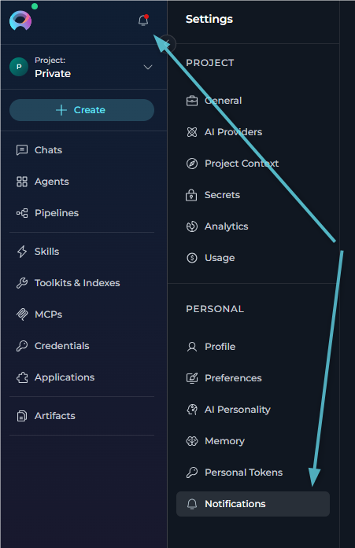
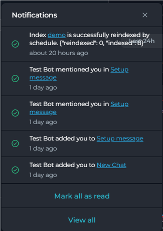
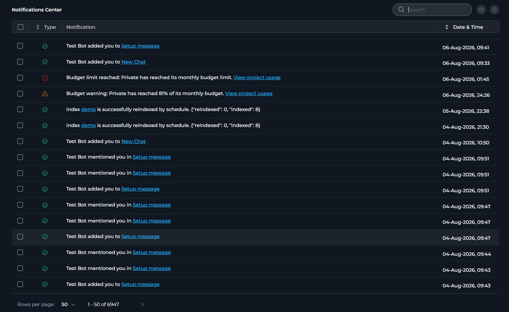

ELITEA delivers real-time notifications to keep you informed about platform events:

<CardGroup cols={3}>
	<Card title="Real-time delivery" icon="bolt">
		Notifications arrive instantly through a live socket connection, and the sidebar button shows a dot when unread items are waiting.
	</Card>
	<Card title="Quick panel access" icon="bell">
		Open the **Notifications** sidebar button to review up to 5 unread notifications without leaving the current page.
	</Card>
	<Card title="Full table view" icon="table-list">
		Use **Notifications Center** to browse all notifications with search, sorting, pagination, and bulk actions.
	</Card>
	<Card title="Actionable links" icon="arrow-up-right-from-square">
		Notification messages can link directly to the related conversation, message, index, bucket, agent version, or Settings page.
	</Card>
	<Card title="Read and unread state" icon="envelope-open-text">
		Each notification keeps its own read state, which is reflected visually and can be updated individually or in bulk.
	</Card>
	<Card title="Bulk operations" icon="list-check">
		Select multiple notifications to mark them as read, mark them as unread, or delete them in one action.
	</Card>
</CardGroup>

You can access notifications in two places:

- **Quick notifications popover** — Opened from the **Notifications** button in the left sidebar. This view shows unread notifications only.
- **Notifications Center** — Opened from **Settings** → **Notifications** or by clicking **View all** in the popover. This view shows both read and unread notifications.

     

## Quick Notifications Popover

The quick popover is designed for fast triage without leaving the current page.

- **Location** — Click the **Notifications** bell button in the left sidebar.
- **Content** — The popover shows unread notifications only.
- **Visible item count** — Up to 5 unread notifications are shown at a time.
- **Header** — The popover header is labeled **Notifications** and includes a close button.
- **Per-item action** — Hover a notification to reveal **Mark as read** or **Mark as unread**.
- **Footer actions** — If unread notifications are present, the popover shows **Mark all as read** and **View all**.
- **Empty state** — If there are no unread notifications, the popover displays **No new notifications right now**.

     

## Notifications Center

The full page is labeled **Notifications Center** in the toolbar and supports:

- **Search** — Use the **Search** field to filter notifications by message text. Search is performed server-side.
- **Sort** — Sort by **Type** or **Date & Time**. Clicking a sortable column toggles ascending and descending order.
- **Columns** — The table includes **Type**, **Notification**, and **Date & Time** columns.
- **Bulk actions** — Select one or more rows using the checkboxes, then use the toolbar buttons to **Mark selected as read**, **Mark selected as unread**, or **Delete selected notifications**. The header checkbox selects all entries on the current page.
- **Pagination** — The page supports 5, 10, 50, and 100 rows per page.
- **Empty state** — If no notifications match the current view, the table displays **No notifications**.

     

## Notification Types

Each notification is identified by its event type and carries an icon indicating its category.

| Event | Icon | Message displayed in the UI |
|---|---|---|
| **Moderator approved version** | Green checkmark | *[Entity name] is published.* |
| **Moderator rejected version** | Red × | *[Entity name] is rejected.* |
| **Author approval** | Green checkmark | *[Entity name] is approved by [moderator] for publishing.* |
| **Author reject** | Red × | *[Entity name] is rejected by [moderator].* |
| **Agent unpublished** | Red × | *Unpublished agent version id: [version id] from project id: [project id]. [Reason if provided]* |
| **User added to conversation** | Green checkmark | *[username] added you to [conversation name]* or *You were added to [conversation name]* |
| **User mentioned in conversation** | Green checkmark | *[username] mentioned you in [conversation name]* or *You were mentioned in [conversation name]* |
| **Project created** | Green checkmark | *Project was successfully created* |
| **Index data changed (success)** | Green checkmark | *Index [name] is successfully created* or *Index [name] is successfully reindexed* |
| **Index data changed (failed)** | Red error | *Index [name] is failed.* |
| **Bucket expiration warning** | Yellow warning | *Bucket [name] will start deleting files in 24 hours according to its retention policy (files are removed based on each file's creation date; the bucket itself will remain).* |
| **Personal access token expiring** | Yellow warning | *Your personal access token [name] will expire in 24 hours. After expiration, it will no longer work. You can delete and recreate a new token if needed. Manage Personal Access Tokens* |
| **Project budget threshold reached** | Yellow warning | *Budget warning: [project name] has reached its monthly budget threshold. View project usage* |
| **Project budget limit reached** | Informational attention | *Budget limit reached: [project name] has reached its monthly budget limit. View project usage* |
| **Member budget threshold reached** | Yellow warning | *Budget warning: You have reached your monthly budget threshold in [project name]. View my usage* |
| **Member budget limit reached** | Informational attention | *Budget limit reached: You have reached your monthly budget limit in [project name]. View my usage* |

## Embedded Navigation Links

Several notification types include a clickable link that takes you directly to the relevant area of ELITEA:

| Event | Link destination |
|---|---|
| **Personal access token expiring** | Settings → Personal Tokens (new tab) |
| **User added to conversation** | Chat, opening the specific conversation |
| **User mentioned in conversation** | Chat, opening the specific conversation and, when available, the specific message |
| **Index data changed** | Toolkit → Indexes, opening the specific toolkit and index |
| **Bucket expiration warning** | Artifacts page, filtered to the specific bucket (new tab) |
| **Agent unpublished** | Agent version details page for the unpublished version |
| **Project budget threshold reached** | Settings → Usage for the affected project |
| **Project budget limit reached** | Settings → Usage for the affected project |
| **Member budget threshold reached** | Settings → Usage with the personal usage scope selected |
| **Member budget limit reached** | Settings → Usage with the personal usage scope selected |

<Info title="Read State Behavior">
The quick notifications popover shows only **unread** notifications and does not automatically mark them as read when the popover is opened. Opening a notification link also does not automatically change its read state. Use the hover action **Mark as read**, the popover action **Mark all as read**, or the table actions in **Notifications Center** to change read state.
</Info>

## Best Practices

<Accordion title="Keeping the Notification List Manageable">
- Periodically review notifications and delete entries that are no longer relevant.
- Use the **Select all** header checkbox followed by **Delete selected notifications** to clear the current page at once.
- Use the **Search** bar to locate a specific event type or entity by keyword before performing bulk actions.
</Accordion>

<Accordion title="Acting on Personal Access Token Warnings">
- A **Personal access token expiring** notification means the token will stop working within 24 hours. Open the link in the notification to go directly to **Settings** → **Tokens**, then delete and recreate the token before it expires.
</Accordion>

<Accordion title="Acting on Index and Bucket Notifications">
- An **Index data changed** notification with a red error icon indicates the indexing operation failed. Click the index name link in the notification to open the index detail page and investigate.
- A successful **Index data changed** notification can indicate either index creation or reindexing.
- A **Bucket expiration warning** means file deletion begins within 24 hours. Click the bucket link to open **Artifacts** filtered to that bucket, then review and back up any files you need to retain.
</Accordion>

<Accordion title="Acting on Budget Threshold and Limit Notifications">
- A **Project budget threshold reached** notification warns that the selected project's monthly shared-model budget is close to its limit. Use **View project usage** to open **Settings** → **Usage** for that project.
- A **Project budget limit reached** notification means the project's monthly shared-model budget has been exhausted. Review the project usage page and wait for the billing period reset or increase the budget if your role allows it.
- A **Member budget threshold reached** notification warns that your own monthly usage in the selected project is close to its limit. Use **View my usage** to open the personal usage scope directly.
- A **Member budget limit reached** notification means your own monthly usage limit in that project has been reached. Open **View my usage** to review your consumption and current budget state.
</Accordion>

<Accordion title="Managing Read and Unread State">
- The dot on the **Notifications** sidebar button disappears once there are no remaining unread notifications.
- In the quick popover, hover an item to use **Mark as read** or **Mark as unread** for that single notification.
- In the quick popover, use **Mark all as read** to clear all unread notifications for your account.
- In **Notifications Center**, select notifications and click **Mark selected as read** or **Mark selected as unread** to update them in bulk.
</Accordion>
