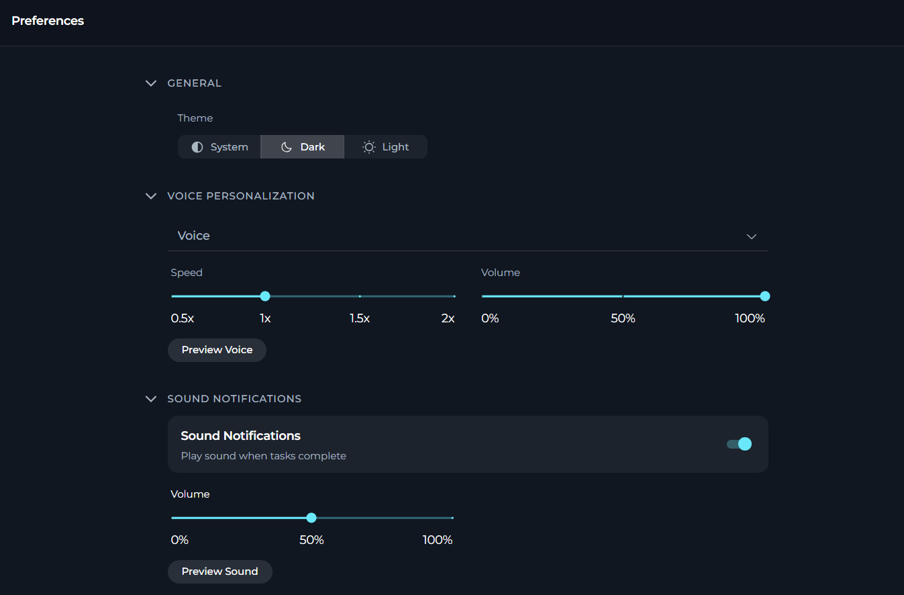
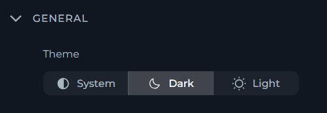
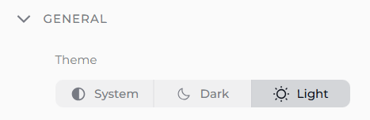
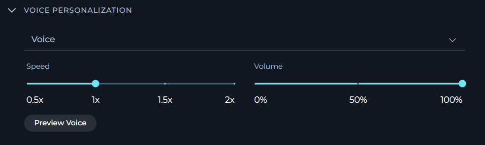
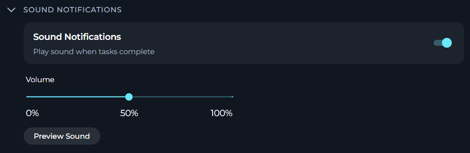

In **Preferences**, you can set your personal preferences for the ELITEA application, including theme, voice personalisation and sound notifications.

To open **Preferences**, in **Settings**, select **Preferences**.

In **Preferences**, you can see three sections:

<CardGroup cols={3}>
	<Card title="General" icon="palette">
		Review the general preferences like user theme.
	</Card>
	<Card title="Voice Personalisation" icon="microphone">
		Set your default text-to-speech playback preferences.
	</Card>
	<Card title="Sound Notifications" icon="bell">
		Control whether ELITEA plays a completion sound when tasks finish.
	</Card>
</CardGroup>

## General

In **General**, you can see the settings that control your personal preferences for the ELITEA's look and feel.

Currently, you can set your preferred theme for the ELITEA application here. You can choose between three themes:
- **Dark** (default): ELITEA will use a dark theme.
- **System**: ELITEA will follow your operating system's theme settings.
- **Light**: ELITEA will use a light theme.

To switch between themes, select the desired option.

<Frame>

</Frame>

## Voice Personalization

In **Voice Personalization**, you can define your default text-to-speech playback preferences. These settings are stored in your browser and are used whenever ELITEA reads responses aloud.

<Info title="How Voice Selection Works">
* If a server-side TTS model is configured, the **Voice** dropdown shows the voices provided by that model.
* If no server-side TTS model is available, ELITEA falls back to browser voices.
* Browser voices that are not local are marked as **online** in the dropdown.
</Info>

**Configuration Parameters**

| Parameter | Type | Default | Range / Options | Description |
|-----------|------|---------|-----------------|-------------|
| **Voice** | Dropdown | Default voice | Model-provided voices or browser voices | Selects the default voice used for text-to-speech playback |
| **Speed** | Slider | 1.0× | 0.5× - 2.0× | Controls playback rate |
| **Volume** | Slider | 100% | 0% - 100% | Controls playback loudness |
| **Preview Voice** | Button | — | — | Plays a short sample sentence using the current settings |

<Tip title="Preview Before You Commit">
Use **Preview Voice** to test the selected voice, speed, and volume combination before relying on it in chats.
</Tip>

## Sound Notifications

In **Sound Notifications**, you can control whether ELITEA plays a completion sound when tasks finish, along with the default notification volume.

**Configuration Parameters**

| Parameter | Type | Default | Range / Options | Description |
|-----------|------|---------|-----------------|-------------|
| **Play sound when tasks complete** | Toggle | ON | ON / OFF | Enables or disables completion sounds |
| **Volume** | Slider | 50% | 0% - 100% | Controls notification sound volume |
| **Preview Sound** | Button | — | — | Plays the current completion sound using the selected volume |

<Note>
The **Volume** slider and **Preview Sound** button are shown only when **Play sound when tasks complete** is enabled.
</Note>
