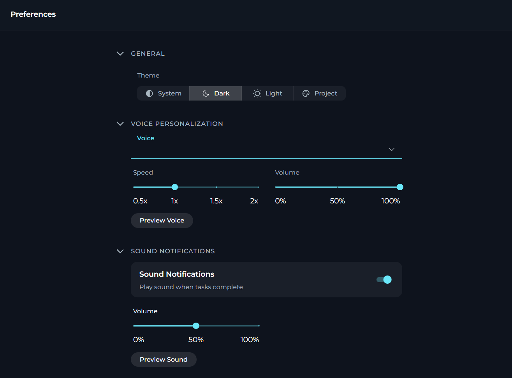
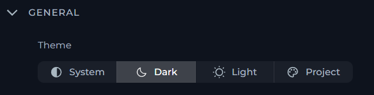
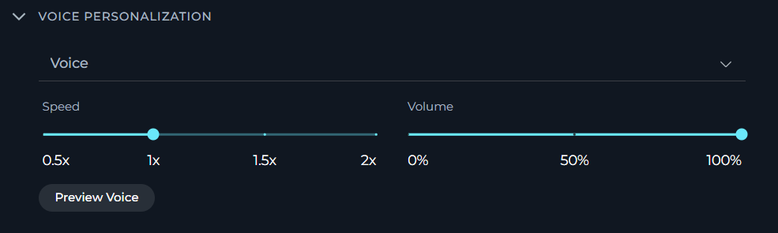
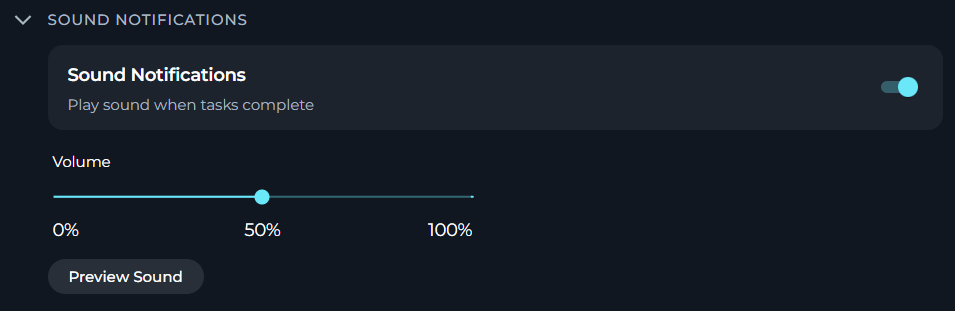

In **Preferences**, you can set your personal preferences for the ELITEA application, including theme, voice personalisation and sound notifications.

To open **Preferences**, in **Settings**, select **Preferences**.

In **Preferences**, you can see three sections:

<CardGroup cols={3}>
	<Card title="General" icon="palette">
		Review the general preferences like user theme.
	</Card>
	<Card title="Voice Personalisation" icon="microphone">
		Set your default text-to-speech playback preferences.
	</Card>
	<Card title="Sound Notifications" icon="bell">
		Control whether ELITEA plays a completion sound when tasks finish.
	</Card>
</CardGroup>

## General

In **General**, you can see the settings that control your personal preferences for the ELITEA's look and feel.

Currently, you can set your preferred theme for the ELITEA application here. You can choose between these themes:
- **Dark** (default)
- **System**: ELITEA follows your operating system's theme settings
- **Light**
- **Project**: ELITEA uses the custom theme configured by your project administrator. Shown only if your project has a custom theme configured.

To switch between themes, select the desired option.

<video src="../../img/menus/settings/personal/preferences/theme.mp4" controls alt="Video demonstrating how to switch between ELITEA themes."></video>

## Voice Personalization

In **Voice Personalization**, you can define your default text-to-speech playback preferences.

These settings are stored in your browser and are used whenever ELITEA reads responses aloud:

* If a server-side TTS model is configured and reachable, the **Voice** dropdown shows the voices provided by that model.
* If no server-side TTS model is configured or reachable, ELITEA falls back to browser voices.
* Browser voices that are not local are marked as **online** in the dropdown.
* If a server-side TTS model is configured but returns no voices, the **Voice** dropdown is hidden instead of falling back to browser voices.

**Configuration Parameters**

<AccordionGroup>
  <Accordion title="Voice">
    * **Type**: Dropdown
    * **Default**: Default voice
    * **Range / Options**: Model-provided voices or browser voices
    * **Description**: Selects the default voice used for text-to-speech playback
  </Accordion>

  <Accordion title="Speed">
    * **Type**: Slider
    * **Default**: 1.0×
    * **Range / Options**: 0.5× - 2.0×
    * **Description**: Controls playback rate
  </Accordion>

  <Accordion title="Volume">
    * **Type**: Slider
    * **Default**: 100%
    * **Range / Options**: 0% - 100%
    * **Description**: Controls playback loudness
  </Accordion>

  <Accordion title="Preview Voice">
    * **Type**: Button
    * **Description**: Plays a short sample sentence using the current settings

	<Tip title="Preview Before You Commit">
Use **Preview Voice** to test the selected voice, speed, and volume combination before relying on it in chats.
</Tip>
  </Accordion>
</AccordionGroup>

## Sound Notifications

In **Sound Notifications**, you can control whether ELITEA plays a sound when a task finishes or fails, along with the default notification volume.

<Note>
ELITEA plays these sounds automatically only while the browser tab is inactive or unfocused — switch back to the tab and you won't hear them. **Preview Sound** always plays, regardless of tab focus.
</Note>

**Configuration Parameters**

<AccordionGroup>
  <Accordion title="Play sound when tasks complete">
    * **Type**: Toggle
    * **Default**: ON
    * **Range / Options**: ON / OFF
    * **Description**: Enables or disables both completion and failure sounds
  </Accordion>

  <Accordion title="Volume">
    * **Type**: Slider
    * **Default**: 50%
    * **Range / Options**: 0% - 100%
    * **Description**: Controls notification sound volume
  </Accordion>

  <Accordion title="Preview Sound">
    * **Type**: Button
    * **Description**: Plays the current completion sound using the selected volume
  </Accordion>
</AccordionGroup>

<Note>
The **Volume** slider and **Preview Sound** button are shown only when **Play sound when tasks complete** is enabled.
</Note>
