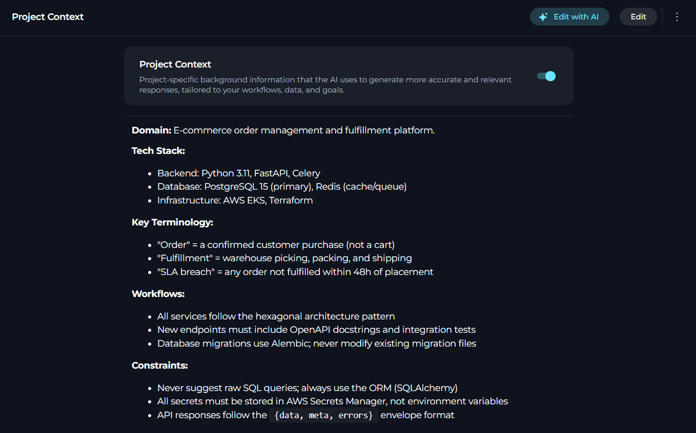
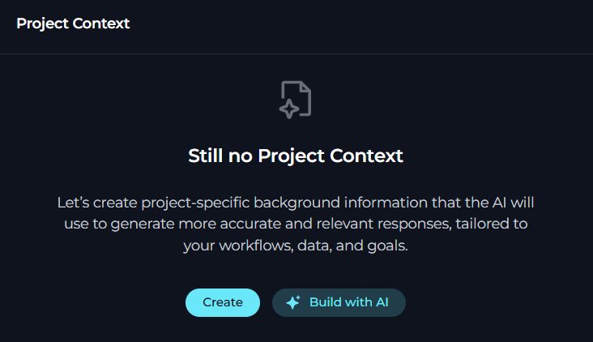
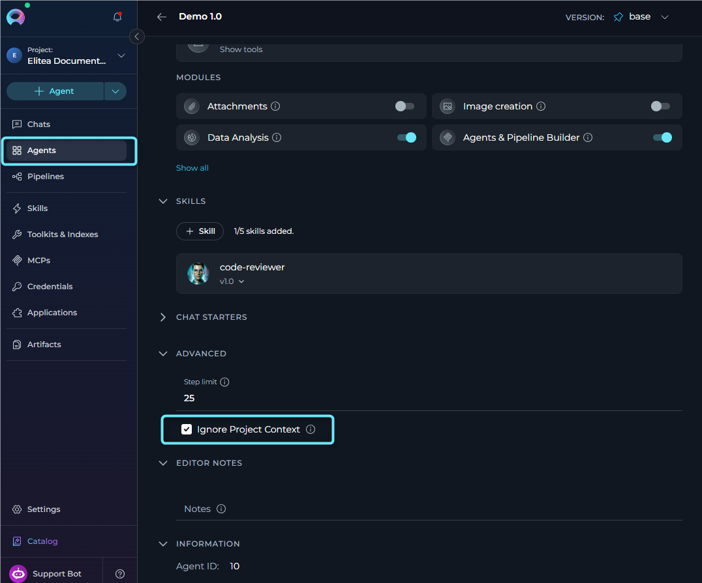

**Project Context** is a project-level background document that the AI silently references when generating responses and running agents. It acts as a persistent system briefing — you write it once, and every AI interaction in the project automatically benefits from it.



Use Project Context to describe things the AI would otherwise not know: the domain your team operates in, how your systems are named, the workflows you follow, the terminology specific to your organization, and any constraints or policies that should always apply.

<CardGroup cols={2}>
  <Card title="Consistent AI Behavior" icon="arrows-spin">
    Define once, applied everywhere. Every agent in the project automatically uses the same background context.
  </Card>
  <Card title="Domain-Aware Responses" icon="book-open">
    Give the AI your terminology, workflows, and constraints so it speaks your language and avoids generic or incorrect answers.
  </Card>
  <Card title="AI-Powered Editing" icon="wand-magic-sparkles">
    Use **Edit with AI** to describe changes in plain language and review a side-by-side diff before saving — no manual rewriting required.
  </Card>
  <Card title="Per-Agent Override" icon="toggle-off">
    Agents can individually opt out of the Project Context when their task requires a neutral, context-free perspective.
  </Card>
</CardGroup>

To open **Project Context**, in **Settings**, select **Project Context**.

<Warning title="Permissions Required">
You need the **`models.project_context.view`** permission to see this page. Editing requires **`models.project_context.edit`**. Users with Viewer or Monitor roles typically have view-only access. Contact your project administrator if the page is missing from your Settings menu.
</Warning>

The main area shows the Project Background content if it exists, or an empty state with options to create it. From there you can turn on or turn off the context, edit it manually, or use AI-powered tools to generate and refine it.


## Define Project Context

When no Project Context exists, the page opens in an **empty state** with two actions:

- **Create** — opens the **Create** editor view so you can write the Project Background manually.
- **Build with AI** — opens the same **Create** editor view and immediately launches the AI generation dialog.

Both options lead to the **Project Background** editor, which is a full Markdown editor with real-time character counting, **Edit** and **Preview** modes.




<Note>
Turning off Project Context does **not** delete the saved content. The content is preserved and can be turned back on at any time. A banner is shown below the toggle when the context is turned off but content exists: *"Project Context is turned off. The project background is not applied to AI responses or workflows."*
</Note>

### Create

Use **Create** when you want to write the Project Background manually from scratch.

1. On the empty state page, select **Create**.
2. Enter the Project Background directly in **Edit** mode.
3. Switch to **Preview** mode to review the rendered Markdown if needed.
4. Use the toolbar actions as needed:
     - **Copy to clipboard** to copy the current draft.
     - **Build with AI** if you want AI to generate an initial draft while the editor is still empty.
5. Select **Save** to create the Project Context, or **Cancel** to return to the empty state without saving.


   <video src="../../img/menus/settings/project/project-context/project-context-create.mp4" controls />

**Recommended Content**

The following table describes the recommended categories of content to include in the Project Background.

| Category | What to include | Example |
|----------|-----------------|---------|
| **Domain & purpose** | What the project or team does | *"This project supports the QA automation team at Acme Corp. Our primary function is test planning, defect tracking, and release validation."* |
| **Terminology & naming** | Internal names, acronyms, system names | *"Our CI system is called 'RocketCI'. Environments: DEV, STAGING, PROD. 'Ticket' always refers to a Jira issue."* |
| **Key workflows** | How work gets done | *"All code changes go through a PR review with at least two approvals. Hotfixes bypass staging and go directly to PROD after QA sign-off."* |
| **Constraints & policies** | Rules the AI should always respect | *"Never suggest storing credentials in code. Always recommend secrets vault usage. All API responses must be paginated."* |
| **Tech stack** | Languages, frameworks, platforms in use | *"Backend: Python 3.11 + FastAPI. Frontend: React 18 + TypeScript. Database: PostgreSQL 15. Deployed on AWS EKS."* |
| **Team context** | Roles, responsibilities, conventions | *"The on-call engineer handles P1/P2 incidents. Bug severity: P1 (outage) → P4 (cosmetic). Sprint duration: two weeks."* |

<Note title="Character Limit">
The editor enforces a maximum of **2,500 characters**. A counter below the editor shows how many characters remain. When the limit is reached, the Save button is turned off and a warning message appears.
</Note>

### Build with AI

The **Build with AI** button generates a first draft of the Project Background from a plain-language description of your project. It is available when the editor content is empty (no existing context) and requires edit permission.

You can also launch it from the **empty state** by selecting the **Build with AI** button, which opens the editor and starts the dialog automatically.

To generate Project Context using AI:

1. Select **Build with AI** from the empty state page or from the editor toolbar while the content is empty.
2. In the prompt field, describe your project: architecture, design decisions, workflows, terminology, constraints, coding standards, deployment process, or other important information.
3. Select **Generate**.
4. Review and edit the generated **Project Background** if needed.
5. Select **Apply** to insert it into the editor, or **Back to prompt** to refine your description.
6. Select **Save** in the page header to create the Project Context.

   <video src="../../img/menus/settings/project/project-context/project-context-build-ai.mp4" controls />

<Note>
Selecting **Apply** does not automatically save the Project Context. The content is placed into the editor as an unsaved draft. You must select **Save** to persist the changes.
</Note>

---

### Edit with AI

The **Edit with AI** button refines your existing Project Background using AI. It appears in two locations when content is present and you have edit permission:

- In the **saved view** header, next to the **Edit** button.
- In the **editor toolbar**, replacing **Build with AI** once content is entered.

Unlike **Build with AI** (which generates from scratch), **Edit with AI** takes your current content, applies the changes you describe, and presents a side-by-side diff for review. Confirming the diff saves immediately — no separate Save step is required.

To edit Project Context using AI:

1. Select the **Edit with AI** button.
2. In the text field, describe the changes you want to make — for example, *"Add a section describing our release validation workflow and exit criteria"* or *"Update the terminology section to explain how we use defect severity levels in QA."*
3. Select **Generate Draft** (or press **Enter**).
4. Review and edit the suggested content if needed.
5. Select **Apply & Save** to save the updated content immediately, or **Refine Prompt** to go back and describe different changes.

   <video src="../../img/menus/settings/project/project-context/project-context-edit-ai.mp4" controls />

<Note>
**Apply & Save** in the Edit with AI dialog saves the content directly — no additional Save step is required. You are returned to the saved view with the updated Project Background.
</Note>

### Import Content

Select the **Import** button in the editor toolbar to upload a Markdown file from your local machine. Only `.md` files are supported. The file content replaces the current editor content.

<video src="../../img/menus/settings/project/project-context/project-context-import.mp4" controls />

<Warning>
Files exceeding 2,500 characters are rejected with an error. Trim the file or paste a condensed version directly into the editor if needed.
</Warning>

---

### Example Project Context

```markdown
## Project: ACME Platform — Backend Team

**Domain:** E-commerce order management and fulfillment platform.

**Tech Stack:**
- Backend: Python 3.11, FastAPI, Celery
- Database: PostgreSQL 15 (primary), Redis (cache/queue)
- Infrastructure: AWS EKS, Terraform

**Key Terminology:**
- "Order" = a confirmed customer purchase (not a cart)
- "Fulfillment" = warehouse picking, packing, and shipping
- "SLA breach" = any order not fulfilled within 48h of placement

**Workflows:**
- All services follow the hexagonal architecture pattern
- New endpoints must include OpenAPI docstrings and integration tests
- Database migrations use Alembic; never modify existing migration files

**Constraints:**
- Never suggest raw SQL queries; always use the ORM (SQLAlchemy)
- All secrets must be stored in AWS Secrets Manager, not environment variables
- API responses follow the `{data, meta, errors}` envelope format
```

<Tip>
Keep the Project Context focused on **stable facts** — things that rarely change. Avoid adding dynamic information (for example, current sprint goals or who is on-call this week), since outdated context can mislead the AI.
</Tip>

---

## Per-Agent Override: Ignore Project Context

By default, every agent in the project receives the Project Context. If a specific agent should operate without it — for example, a general-purpose assistant whose responses should not be shaped by your domain terminology, or a utility agent that works across multiple projects — you can turn off the context for that agent individually using the **Ignore Project Context** option.

The **Ignore Project Context** option is available both when **creating** a new agent and when **editing** an existing one. In both cases it is located in the **ADVANCED** section of the agent configuration form.

To turn on the override:

1. Open the agent configuration — either select **Create New Agent** from the `+` menu in the chat toolbar, or open an existing agent for editing.
2. Expand the **ADVANCED** section.
3. Select **Ignore Project Context**.

     


> *"When turned on, this agent will not use the project background context in its responses."*

<Note>
The **Ignore Project Context** checkbox only appears in the agent ADVANCED section when the feature is turned on by the platform. It has no effect if Project Context is already turned off at the project level.
</Note>

---

## Troubleshooting

<AccordionGroup>
  <Accordion title="'Project Context' tab is not visible in Settings">
    - Confirm you have the `models.project_context.view` permission. Ask your project administrator to check your role.
  </Accordion>
  <Accordion title="Save button stays turned off after editing">
    - Check the character counter below the editor. If the content exceeds **2,500 characters**, the Save button is turned off until you reduce the length.
    - If the character count is within the limit, verify that you have made a change — the Save button is only turned on when unsaved changes exist.
  </Accordion>
  <Accordion title="Imported file was rejected">
    - Only `.md` (Markdown) files are accepted by the Import button.
    - The file content must not exceed **2,500 characters**. If the file is larger, trim it before importing or paste a condensed version directly into the editor.
  </Accordion>
  <Accordion title="Project Context is saved but AI responses have not changed">
    - Confirm the turn-on toggle is **on**. If it is turned off, the context is not applied even though content is saved.
    - Verify the agent being used does not have **Ignore Project Context** selected in its ADVANCED settings.
    - Start a new conversation — existing conversations may not retroactively pick up context changes mid-session.
  </Accordion>
  <Accordion title="Ignore Project Context checkbox is missing in agent Advanced settings">
    - The checkbox is only shown when the feature is turned on at the platform level. Contact your platform administrator if it is expected to appear but is missing.
    - Also verify you are editing a **draft** version of the agent — published versions are read-only.
  </Accordion>
  <Accordion title="Edit with AI button is not visible">
    - The **Edit with AI** button only appears when content already exists. If the editor or saved view is empty, **Build with AI** is shown instead.
    - Confirm you have the `models.project_context.edit` permission. The button is hidden for view-only users.
    - If the Project Context is turned off (toggle off), the **Edit with AI** and **Edit** buttons in the saved view are turned off. Turn on Project Context first.
  </Accordion>
  <Accordion title="Edit with AI generates unexpected or irrelevant changes">
    - Be specific in your description — include the section name and the exact change you want (for example, "Add a section describing our defect triage workflow and severity definitions").
    - If the suggestion is partially correct, edit the right panel of the diff view directly before selecting Apply & Save.
    - Select **Refine Prompt** to go back and rewrite your description with more context.
  </Accordion>
</AccordionGroup>

---

<Info title="Related Documentation">

- **[Settings Overview](./settings-overview)** — All available Settings sections and navigation
- **[AI Configuration](./ai-configuration)** — Configure LLM models and AI configurations for the project
- **[Create & Edit Agents from Canvas](../../how-tos/chat-conversations/how-to-create-and-edit-agents-from-canvas.mdx)** — Agent configuration including the Ignore Project Context option
</Info>
