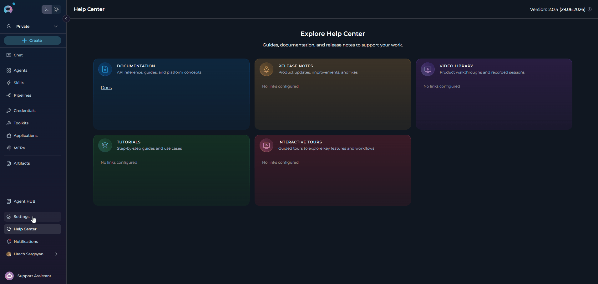
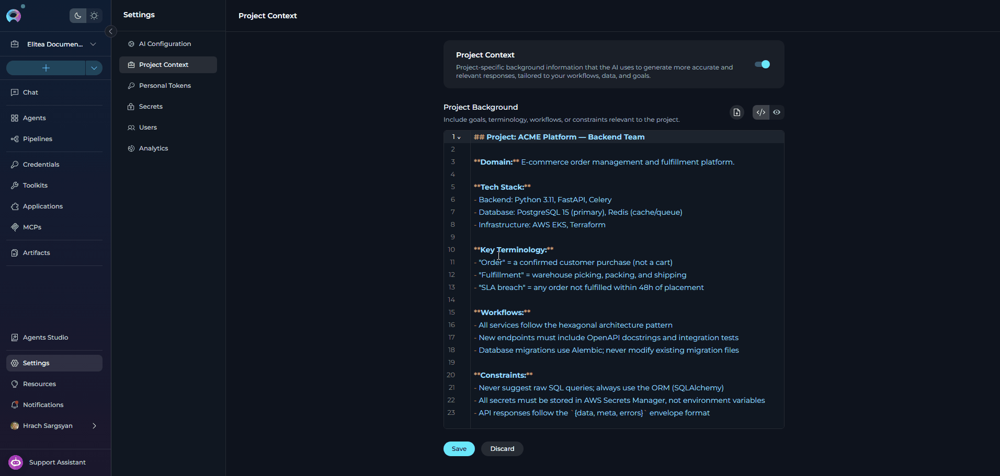
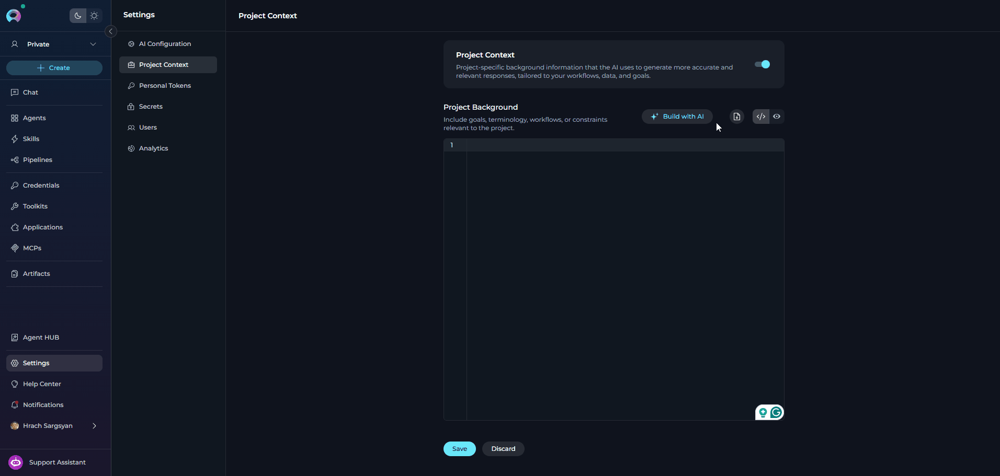

## Overview

**Project Context** is a project-level background document that the AI silently references when generating responses, running agents, and executing pipelines. It acts as a persistent system briefing — you write it once, and every AI interaction in the project automatically benefits from it.

Use Project Context to describe things the AI would otherwise not know: the domain your team operates in, how your systems are named, the workflows you follow, the terminology that is specific to your organization, and any constraints or policies that should always apply.

<Info title="Team Projects Only">
Project Context is only available in team (non-public) projects. It does not appear in the global project or personal project workspaces.
</Info>

<CardGroup cols={3}>
  <Card title="Consistent AI Behavior" icon="arrows-spin">
    Define once, applied everywhere. Every agent, pipeline, and chat conversation in the project automatically uses the same background context.
  </Card>
  <Card title="Domain-Aware Responses" icon="book-open">
    Give the AI your terminology, workflows, and constraints so it speaks your language and avoids generic or incorrect answers.
  </Card>
  <Card title="Per-Agent Override" icon="toggle-off">
    Agents can individually opt out of the Project Context when their task requires a neutral, context-free perspective.
  </Card>
</CardGroup>

---

## Accessing Project Context

<Warning title="Permissions Required">
You need the **`models.project_context.view`** permission to see this page. Editing requires **`models.project_context.edit`**. Users with Viewer or Monitor roles typically have view-only access. Contact your project administrator if the page is missing from your Settings menu.
</Warning>

To access Project Context:

1. Click the **Settings** icon in the main navigation sidebar.
2. Select **Project Context** from the vertical settings drawer on the left.

The Project Context editor opens in the main content area, with two main components: the **enable toggle card** at the top, and the **Project Background editor** below it.




## Project Background Editor

The **Project Background** editor is where you write and manage the context document for your project. It is a full Markdown editor with real-time character counting, an import tool for loading content from a file, and a preview mode so you can verify formatting before saving. Content entered here is silently provided to the AI on every request made within the project.

The editor is only visible when Project Context is enabled, or when content already exists (so it remains accessible for editing even while the feature is temporarily disabled).


<Note>
Disabling Project Context does **not** delete the saved content. The content is preserved and can be re-enabled at any time. A banner is shown below the toggle when the context is disabled but content exists: *"Project Context is turned off. The project background is not applied to AI responses or workflows."*
</Note>

### What to Write in Project Context

Project Context is written in **Markdown** and read by the AI as background information before processing any request. The content should be factual, concise, and focused on information that applies broadly across the project — not instructions specific to a single task.

- Use the **Edit mode** (<Icon icon="code" />) to write and update content directly in the editor. 
- Switch to **Preview mode** (<Icon icon="eye" />) at any time to see the rendered Markdown before saving. Toggle between them using the buttons in the top-right corner of the editor.




**Recommended Content**

| Category | What to Include | Example |
|----------|-----------------|---------|
| **Domain & purpose** | What the project or team does | *"This project supports the QA automation team at Acme Corp. Our primary function is test planning, defect tracking, and release validation."* |
| **Terminology & naming** | Internal names, acronyms, system names | *"Our CI system is called 'RocketCI'. Environments: DEV, STAGING, PROD. 'Ticket' always refers to a Jira issue."* |
| **Key workflows** | How work gets done | *"All code changes go through a PR review with at least 2 approvals. Hotfixes bypass staging and go directly to PROD after QA sign-off."* |
| **Constraints & policies** | Rules the AI should always respect | *"Never suggest storing credentials in code. Always recommend secrets vault usage. All API responses must be paginated."* |
| **Tech stack** | Languages, frameworks, platforms in use | *"Backend: Python 3.11 + FastAPI. Frontend: React 18 + TypeScript. Database: PostgreSQL 15. Deployed on AWS EKS."* |
| **Team context** | Roles, responsibilities, conventions | *"The on-call engineer handles P1/P2 incidents. Bug severity: P1 (outage) → P4 (cosmetic). Sprint duration: 2 weeks."* |

<Note title="Character Limit">
The editor enforces a maximum of **2,500 characters**. A counter below the editor shows how many characters remain. When the limit is reached, the Save button is disabled and a warning message appears.
</Note>


### <Icon icon="file-arrow-down" size="28" /> Importing Content

Click the **Import** button in the editor toolbar to upload a `.md` (Markdown) file from your local machine. The file content replaces the current editor content.

 


<Warning>
Files exceeding 2,500 characters are rejected with an error. Trim the file or paste a condensed version directly into the editor if needed.
</Warning>

---

### Example Project Context

```markdown
## Project: ACME Platform — Backend Team

**Domain:** E-commerce order management and fulfillment platform.

**Tech Stack:**
- Backend: Python 3.11, FastAPI, Celery
- Database: PostgreSQL 15 (primary), Redis (cache/queue)
- Infrastructure: AWS EKS, Terraform

**Key Terminology:**
- "Order" = a confirmed customer purchase (not a cart)
- "Fulfillment" = warehouse picking, packing, and shipping
- "SLA breach" = any order not fulfilled within 48h of placement

**Workflows:**
- All services follow the hexagonal architecture pattern
- New endpoints must include OpenAPI docstrings and integration tests
- Database migrations use Alembic; never modify existing migration files

**Constraints:**
- Never suggest raw SQL queries; always use the ORM (SQLAlchemy)
- All secrets must be stored in AWS Secrets Manager, not environment variables
- API responses follow the `{data, meta, errors}` envelope format
```

<Tip>
Keep the Project Context focused on **stable facts** — things that rarely change. Avoid adding dynamic information (e.g., current sprint goals or who is on-call this week), since outdated context can mislead the AI.
</Tip>

---

## Per-Agent Override: Ignore Project Context

By default, every agent in the project receives the Project Context. If a specific agent should operate without it — for example, a general-purpose assistant whose responses should not be shaped by your domain terminology, or a utility agent that works across multiple projects — you can disable the context for that agent individually using the **Ignore Project Context** option.

The **Ignore Project Context** option is available both when **creating** a new agent and when **editing** an existing one. In both cases it is located in the **ADVANCED** section of the agent configuration form.

**To enable the override:**

1. Open the agent configuration — either click **Create New Agent** from the `+` menu in the chat toolbar, or open an existing agent for editing.
2. Expand the **ADVANCED** section.
3. Check **Ignore Project Context**.

     


> *"When enabled, this agent will not use the project background context in its responses."*

<Note>
The **Ignore Project Context** checkbox only appears in the agent's ADVANCED section when the feature is enabled by the platform. It has no effect if Project Context is already disabled at the project level.
</Note>

---

## Troubleshooting

<AccordionGroup>
  <Accordion title="'Project Context' tab is not visible in Settings">
    - Confirm you have the `models.project_context.view` permission. Ask your project administrator to check your role.
  </Accordion>
  <Accordion title="Save button stays disabled after editing">
    - Check the character counter below the editor. If the content exceeds **2,500 characters**, the Save button is disabled until you reduce the length.
    - If the character count is within the limit, verify that you have actually made a change — the Save button is only enabled when unsaved changes exist.
  </Accordion>
  <Accordion title="Imported file was rejected">
    - Only `.md` (Markdown) files are accepted by the Import button.
    - The file content must not exceed **2,500 characters**. If the file is larger, trim it before importing or paste a condensed version directly into the editor.
  </Accordion>
  <Accordion title="Project Context is saved but AI responses haven't changed">
    - Confirm the enable toggle is **on**. If it is disabled, the context is not applied even though content is saved.
    - Verify the agent being used does not have **Ignore Project Context** checked in its ADVANCED settings.
    - Start a new conversation — existing conversations may not retroactively pick up context changes mid-session.
  </Accordion>
  <Accordion title="'Ignore Project Context' checkbox is missing in agent Advanced settings">
    - The checkbox is only shown when the feature is enabled at the platform level. Contact your platform administrator if it is expected to appear but is missing.
    - Also verify you are editing a **draft** version of the agent — published versions are read-only.
  </Accordion>
</AccordionGroup>

---

<Info title="Related Documentation">

- **[Settings Overview](./settings-overview)** — All available Settings sections and navigation
- **[AI Configuration](./ai-configuration)** — Configure LLM models and AI integrations for the project
- **[How to Create and Edit Agents from Canvas](../../how-tos/chat-conversations/how-to-create-and-edit-agents-from-canvas.mdx)** — Agent configuration including the Ignore Project Context option
</Info>
