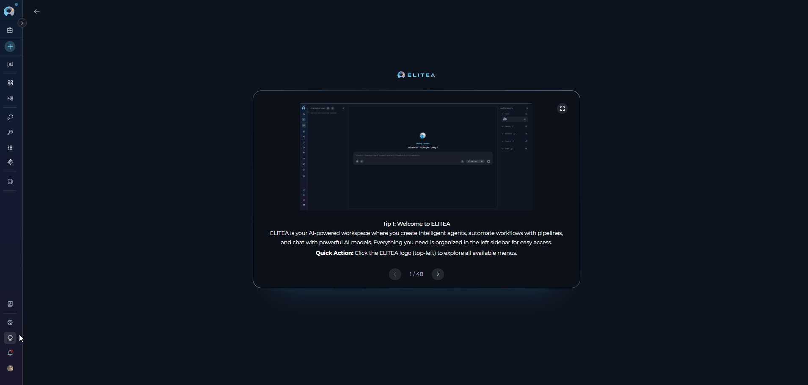

**Navigation**:

To navigate through the **Settings** sections, follow these steps:

1. Click on the **Settings** icon in the main navigation sidebar or access it through your user menu.
2. Use the vertical navigation drawer on the left to select the desired section by clicking on its name.

   

The **Settings** consists of several sections organized in a vertical navigation drawer, each dedicated to specific functionalities:

* [**AI Configuration**](./ai-configuration): Manage AI model configurations, including LLM models, embedding models, vector storage, and image generation settings. Configure default models for different tiers and manage OpenAI templates.
* [**Personal Tokens**](./personal-tokens): Create and manage personal access tokens for API access and IDE integrations.
* [**Secrets**](./secrets): Securely store and manage API keys, passwords, and other authentication credentials used across your projects.
* [**Users**](./users): Manage users within a project, including inviting new users, editing user roles, and viewing user activity. This section requires appropriate permissions.
* [**Analytics**](./analytics): Explore detailed, project-scoped analytics covering AI adoption, agent and tool usage, per-user activity breakdowns, and system health metrics.

