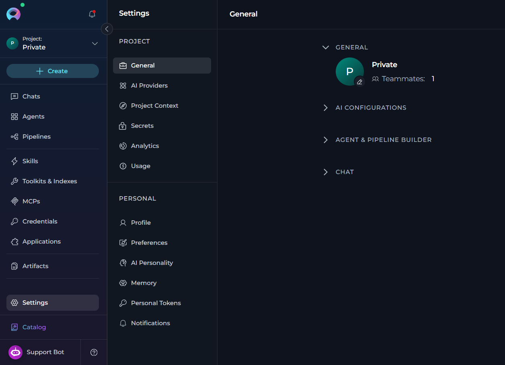

In **Settings Overview**, you can manage ELITEA behavior at project and personal levels.

To open **Settings**, select the **Settings** icon in the main sidebar.

## Project Settings

In **Project** settings, you can manage project-wide configuration, access, analytics, and usage.

<CardGroup cols={3}>
   <Card title="General" icon="briefcase" href="./general">
      Review project information, AI configuration details, and agent and pipeline builder settings.
   </Card>
   <Card title="AI Providers" icon="sliders" href="./ai-providers">
      Manage project AI providers, model configurations, defaults, and AI credentials.
   </Card>
   <Card title="Project Context" icon="folder-open" href="./project-context">
      Define project-wide background information that ELITEA uses across conversations and workflows.
   </Card>
   <Card title="Secrets" icon="lock" href="./secrets">
      Store and manage project secrets used by integrations and configurations.
   </Card>
   <Card title="Users" icon="users" href="./users">
      Review project members, roles, and access-related information.
   </Card>
   <Card title="Analytics" icon="chart-line" href="./analytics">
      Review project analytics, adoption, usage trends, and health metrics.
   </Card>
   <Card title="Usage" icon="coins" href="./usage">
      Review project and personal usage of platform-shared models and budget consumption.
   </Card>
</CardGroup>

## Personal Settings

In **Personal** settings, you can manage your own profile, preferences, tokens, memory, and notifications.

<CardGroup cols={3}>
   <Card title="Profile" icon="user" href="./user-profile">
      Review your account information and sign out of ELITEA.
   </Card>
   <Card title="Preferences" icon="palette" href="./preferences">
      Set your personal application preferences, including theme, voice, and sound settings.
   </Card>
   <Card title="AI Personality" icon="sparkles" href="./ai-personality">
      Configure how ELITEA interacts with you in new conversations.
   </Card>
   <Card title="Memory" icon="brain" href="./memory">
      Configure context management, context editing, and automatic summarization for new conversations.
   </Card>
   <Card title="Personal Tokens" icon="key" href="./personal-tokens">
      Create and manage personal access tokens for API access and external tools.
   </Card>
   <Card title="Notifications" icon="bell" href="./notifications">
      Review and manage your notification settings and notification list.
   </Card>
</CardGroup>

