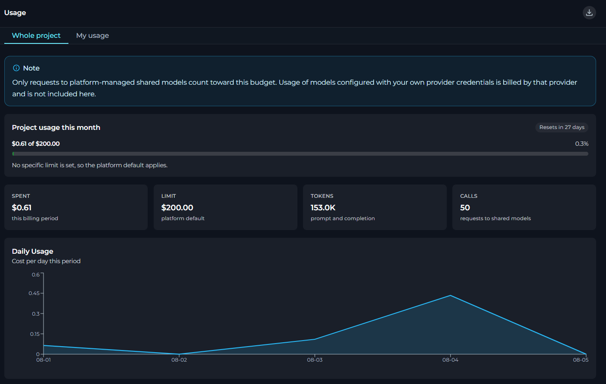
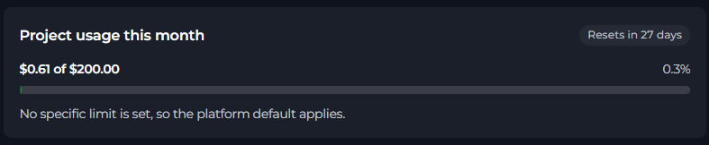
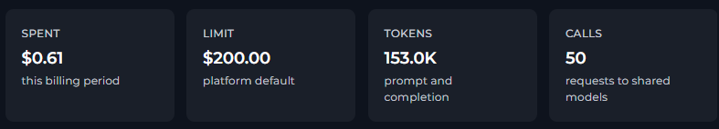
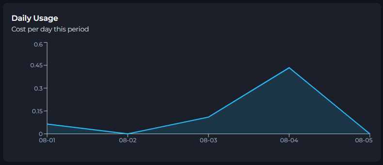
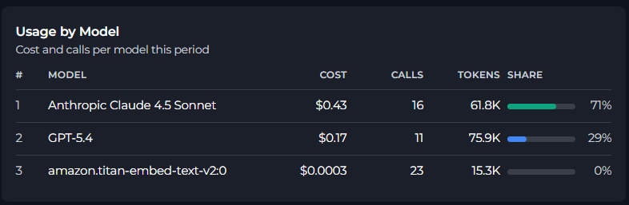
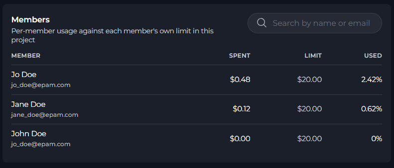
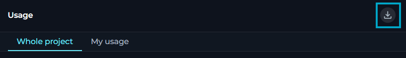

In **Usage**, you can review the current month's usage of platform-shared models, track budget consumption, and export usage data.

To open **Usage**, in **Settings**, select **Usage**.

## Usage Tabs

In **Usage**, you work with two tabs:

<CardGroup cols={2}>
	<Card title="Whole project" icon="briefcase">
		Review project-wide usage, budget state, model usage, and member usage.
	</Card>
	<Card title="My usage" icon="user">
		Review your own usage and budget state in the selected project.
	</Card>
</CardGroup>

<Info title="Tab switcher visibility">
In a personal project, ELITEA treats the project budget as your own budget (so you see no switcher). In a team project, you can switch between the whole-project view and your personal usage view.
</Info>

In both **Whole project** and **My usage**, you can review usage data, including:
- Usage meter for the current billing period
- Summary KPI cards
- Daily usage
- Usage by model

**Whole project** also includes a **Members** section that shows per-member usage against each member's own limit in the current project.

**Information banners**

At the top of the page, ELITEA shows an information banner.

- In a personal project, the banner explains that requests made without selecting a team project are charged to the private project.
- In all scopes, the banner explains that only requests to platform-managed shared models count toward this budget.

If usage figures are still being collected for the current period, ELITEA shows an informational message that usage may lag live activity.

## Usage Panels

In **Usage**, you can view these panels, each displaying data for the current billing period:

| Panel | Description |
| --- | --- |
| **Usage Summary** | Current budget state and usage meter. |
| **KPI Cards** | Summary usage metrics for the current billing period. |
| **Daily Usage** | Daily usage for the current billing period. |
| **Usage by Model** | Usage by model for the current billing period. |
| **Members** | Per-member usage against each member's own limit in the current project.

### Usage Summary

Usage summary shows the current month's usage against the applicable budget.

It includes:

- A title that changes by scope - **Project usage this month** or **My usage this month**
- A reset label that shows when the current monthly period resets
- A primary usage label
- A percentage label when a limit exists
- A hint that explains whether the current limit is explicit, inherited from a default, or unlimited

If the budget is near its limit, ELITEA shows a warning message. If the budget is exceeded, ELITEA shows an error message and explains that requests to platform-shared models are unavailable until the limit is increased or the current budget period resets.

### KPI Cards

Depending on your permissions, the page can show these KPI cards:

| KPI | Description |
| --- | --- |
| **SPENT** | Amount spent in the current billing period |
| **LIMIT** | Effective limit for the current scope |
| **TOKENS** | Total prompt and completion tokens |
| **CALLS** | Requests to shared models |

If you cannot see cost amounts, ELITEA hides the **SPENT** card and shows a simplified **LIMIT** value.

## Daily Usage

In **Daily Usage**, you can review usage for each day in the current billing period.

The chart title and subtitle stay the same, but the panel changes depending on whether you can see cost amounts:

- If you can see amounts, the chart shows *Cost per day this period*.
- If you cannot see amounts, the chart shows *Calls per day this period*.

If no usage is recorded for the current period, ELITEA shows *No usage recorded for this period yet*.

## Usage by Model

In **Usage by Model**, you can review usage grouped by model for the current billing period.

The table shows:

| Column | Description |
| --- | --- |
| **Model** | Model display name or resolved model name |
| **Cost** | Cost for that model, when amount visibility is enabled |
| **Calls** | Number of requests made with the model |
| **Tokens** | Total tokens used by the model |
| **Share** | Share of total usage for the model |

If you can see amounts, the subtitle is *Cost and calls per model this period* and the share is based on cost.

If you cannot see amounts, the subtitle is *Calls and tokens per model this period* and the share is based on request count.

If no model usage is recorded for the current period, ELITEA shows *No model usage recorded for this period yet*.

## Members

In **Members**, authorized users can review per-member usage against each member's own limit in the current project.

| Column | Description |
| --- | --- |
| **Member** | Member name or email |
| **Spent** | Amount spent by that member |
| **Limit** | Effective limit for that member |
| **Used** | Percentage of the member's limit that has been used |

The **Used** value is highlighted when the member is near or over the warning threshold.

<Note>
**Members** are shown only when all of these conditions are true:
- The selected project is not a personal project.
- The current tab is **Whole project**.
- Member rows are available for the project.
</Note>

**Members** includes a search field that filters members by name or email.

If the search returns no matches, ELITEA shows *No members found*.

## Export Usage Data

You can export usage data to an Excel file.

To export usage data:

1. In **Settings** > **Usage**, select the export button in the page header.
2. Wait for ELITEA to prepare the export.

ELITEA disables export while usage data is still loading. In team projects, ELITEA also waits for the member usage data before exporting.

If export fails, ELITEA returns the message, *Unable to export usage data. Please try again*.

## Limitations

- Usage is reported for the current monthly billing period.
- Only requests to platform-managed shared models are included.
- Models configured with your own provider credentials are billed by that provider and are not included here.

<Info title="See Also">
- [Analytics](./analytics.mdx)
</Info>