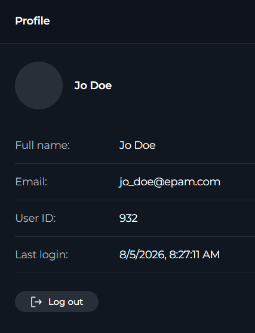

In **Profile**, you can review your account information and sign out of ELITEA.

To open **Profile**, in **Settings**, select **Profile**.

## Profile Information

The page shows your avatar and your name and follow them with this data:

| Field | Description |
| --- | --- |
| **Full name** | Your current display name |
| **Email** | The email address associated with your account |
| **User ID** | Your internal ELITEA user identifier |
| **Last login** | The date and time of your most recent login |

Each field is shown in a copyable format.

<Info title="Last Login Format">
ELITEA displays **Last login** using your browser's local date and time format.
</Info>

## Log-out

In **Profile**, you can log out of ELITEA:

1. In **Settings** > **Profile**, select **Log out**.
2. Wait for ELITEA to redirect you to the logout flow.

When you log out, ELITEA clears your current session state and redirects you to the platform logout endpoint.

<Note>
Logging out clears the current session in the application. You must sign in again to continue using ELITEA.
</Note>
