## Overview

A **Skill** is a focused, reusable instruction set that gives an agent a named capability — written once in Markdown and shared across as many agents as you need. Instead of duplicating instructions or hardwiring behavior into every agent separately, you define the logic in a Skill, attach it where needed, and invoke it on demand during any conversation.

<CardGroup cols={3}>
  <Card title="Reusable" icon="arrow-rotate-right">
    Write once, attach to many agents. Updates to a Skill apply everywhere it is used.
  </Card>
  <Card title="On-Demand" icon="bolt">
    Invoke any attached Skill mid-conversation by typing `~skill-name` in the chat composer.
  </Card>
  <Card title="Versioned" icon="code-branch">
    Maintain multiple named versions alongside the always-present `base`, so you can iterate without breaking existing agents.
  </Card>
</CardGroup>

**Typical use cases**

| Use case | Example |
|---|---|
| Shared reasoning templates | A "write unit tests" or "summarize findings" instruction used by multiple agents |
| Persona or tone guidance | A "formal-communication" Skill injected when the agent sends external messages |
| Domain-specific procedures | A step-by-step QA checklist or release-note writing guide |
| Modular agent construction | Build a large agent from small, independently tested Skills |

---

## Access Skills

<Warning>
**Project Scope**

Skills are only available inside **team (non-public) projects**. The **Skills** menu item is hidden when the Public project is selected. Switch to a team or personal project to see it.
</Warning>

To open the Skills area:

1. Select the correct project from the **project switcher** at the top of the left sidebar.
2. Select **Skills** in the main navigation sidebar.
The **Skills** page opens, showing the **Skills** tab — a scrollable list (or card grid) of all Skills in the current project.

    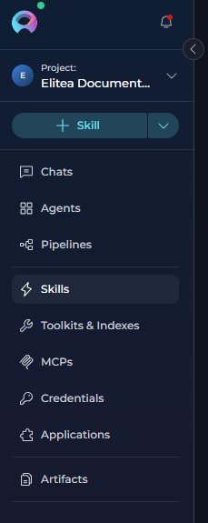

---

## Organize Skills into Folders

Folders help you organize Skills into logical groups for better navigation and management. You can create folders, move Skills between folders, and control folder access within team projects.

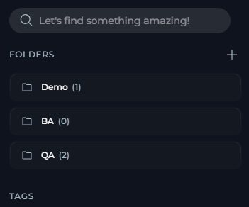

**Create a Folder:**

1. In the **Skills** dashboard right panel, locate the **Folders** section.
2. Select **+ Create Folder**.
3. Enter a folder name (up to 128 characters).
4. Select **Save**.

     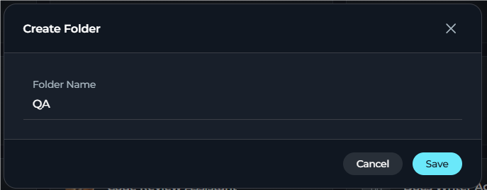

**Move a Skill to a Folder:**

1. **Hover over a Skill card:** A "Move to folder" icon (folder with arrow) appears on the card.
2. **Click the folder icon:** Opens a menu with folder options.
3. **Select a folder from the list:** The menu displays:
   - **+ Create Folder** option at the top
   - A scrollable list of existing folders
   - Pinned folders are marked with a pin icon
   - The current folder (if any) is highlighted and marked with a checkmark
4. The Skill is moved to the selected folder.

    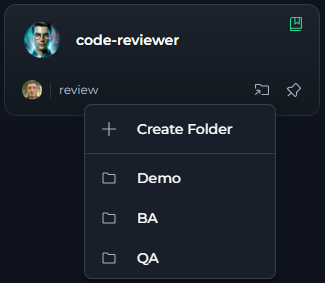

**View Folder Contents:**

Click any folder in the Folders panel to filter the Skills list to show only Skills in that folder. The folder name appears in the header, and the Skills count updates to reflect the filtered view. Click **X** to close the folder view and return to the full list.

    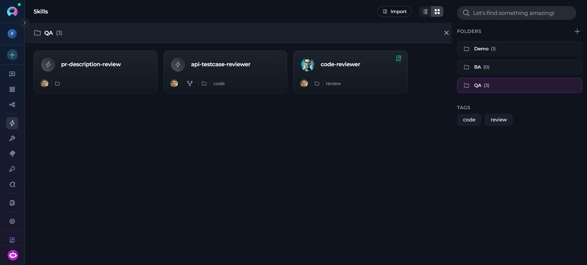

**Manage Folders:**

Each folder card in the right panel has a three-dot menu (⋮) with the following options:
    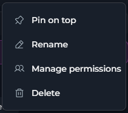
| Action | Description |
| --- | --- |
| **Rename** | Change the folder name |
| **Pin to top** | Pin the folder to the top of the folders list |
| **Delete** | Permanently remove the folder (Skills inside are moved back to the main list, not deleted) |
| **Manage Access** *(Team projects only)* | Control which team members can view the folder |

**Remove a Skill from a Folder:**

1. Open the Skill card's three-dot menu (⋮).
2. Select **Remove from Folder**.
3. The Skill returns to the main Skills list and the folder icon is removed from its card.

<Note>
Folders are available in team and personal projects. In team projects, folder access can be restricted to specific users. The Public project does not support folders.
</Note>

### Folder Permission Management

In team projects, you can control which users can view and modify specific folders by setting permission exceptions. By default, users retain the permissions granted by their project roles. Permission exceptions can only restrict access.

**Access Folder Permissions:**

1. In the **Skills** dashboard right panel, locate the folder in the **Folders** list.
2. Select the folder's three-dot menu (⋮).
3. Select **Manage Access**.
4. The Manage Permissions dialog opens.
    

**Add Permission Exceptions:**

1. In the Manage Permissions dialog, select **+ Add Exception**.
2. Search for and select one or more users from the project.
3. Choose a permission level: **Read-only** or **No access**.
4. Select **Add**. The selected users are added to the permissions table.

    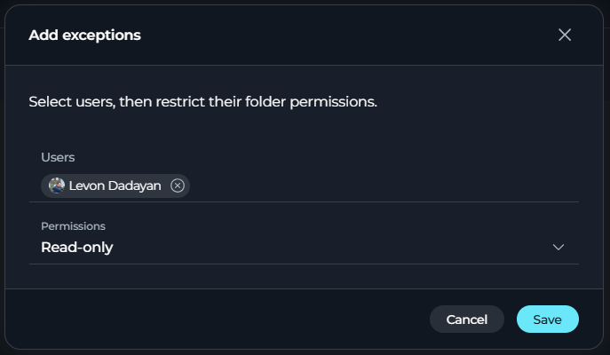

**Permission Levels:**

| Permission Level | Description |
| --- | --- |
| **Read/write (default)** | User can view folder contents and modify folder settings |
| **Read-only** | User can view folder contents but cannot modify folder settings or move Skills |
| **No access** | User cannot see the folder or its contents |

**Edit Permission Exceptions:**

- To modify an existing exception, locate the user in the permissions table and select the **Edit** (pencil) icon in the Actions column. Change the permission level to your desired setting and select **Save**. 
- To remove an exception and return the user to default permissions, change the permission level to **Read/write (default)**. When saved, the user is removed from the exceptions table and inherits permissions based on their project role.

<Note>
Permission exceptions apply only to the folder itself. Users with no access to a folder cannot see it in their folders list or view its contents.
</Note>

---

## Create a Skill

You can create a Skill from the Skills page, directly from the agent editor, or from chat using the Skill Builder module.

<Tip>
**Create from Chat:**

You can also create and update Skills directly from chat using the **Skill Builder** module. When enabled, you can describe your skill requirements in natural language, and the conversation will create or update the Skill for you. The created skill automatically opens in Canvas mode for review and is added to your project. See [Skill Builder](../how-tos/modules/skill-builder) for details.
</Tip>

### From the Skills Page

1. Select the **`+` (Create)** button in the top section of the left sidebar, or go to the Skills page and select **Create** in the empty state if no Skills exist yet.
  - Alternatively, use the global **`+` Create** button in the sidebar and select **Skill** from the dropdown.
  The **New Skill** form opens with two accordion sections: **General** and **Instructions**.

       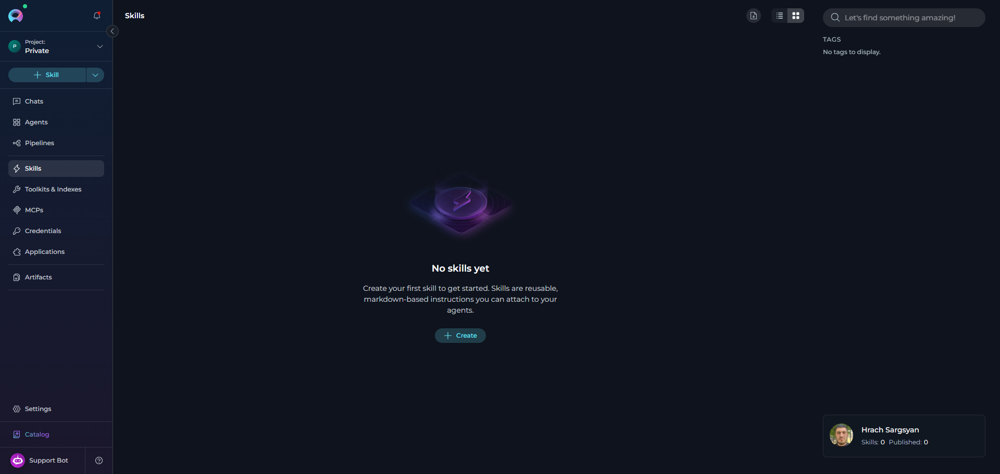
2. In the **General** section, complete the following fields. Then, in the **Instructions** section, enter your skill instructions in the Markdown or CodeMirror editor.

   | Field | Required | Example |
   |---|---|---|
   | **Name** | Yes | `code-reviewer`|
   | **Description** | Yes | `Reviews code for quality issues and suggests improvements.` |
   | **Tags** | No | `qa`, `review` |

  <Note>
  **Name rules**

  Name must use lowercase letters, digits, and hyphens only. It must not start or end with a hyphen. The maximum length is 64 characters. It must not contain `claude` or `anthropic`.
  </Note>

  In the **Instructions** section:
  - Use the toggle button group in the section header to switch between **Edit mode** and **Preview mode**.
  - A character counter at the bottom of the editor shows the remaining characters. The maximum is **5000 characters**.
   
     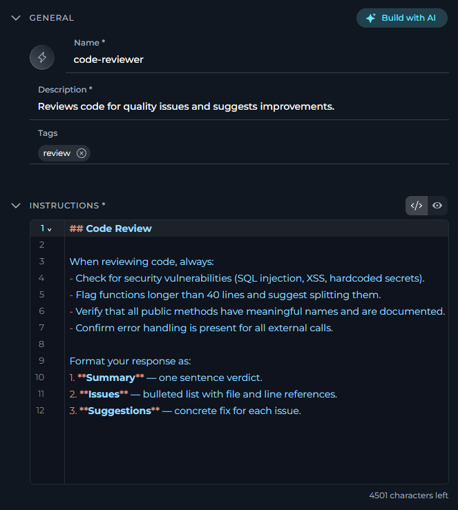

   **Example instructions:**
   ```
   ## Code Review

   When reviewing code, always:
   - Check for security vulnerabilities (SQL injection, XSS, hardcoded secrets).
   - Flag functions longer than 40 lines and suggest splitting them.
   - Verify that all public methods have meaningful names and are documented.
   - Confirm error handling is present for all external calls.

   Format your response as:
   1. **Summary** — one sentence verdict.
   2. **Issues** — bulleted list with file and line references.
   3. **Suggestions** — concrete fix for each issue.
   ```
3. Select **Save** in the tab bar at the top of the page.

After you select **Save**, the Skill configuration page opens. It shows the Skill name in the tab bar and the **General** and **Instructions \*** sections in the left panel. The right panel contains a test chat panel where you can interact with the Skill directly to verify its behavior.

<video controls width="100%" aria-label="Full skill creation flow from form to saved Skill.">
  <source src="../img/menus/skills/skill-create-full.mp4" type="video/mp4" />
</video>

### Upload a Skill Icon

In the **General** section, the Skill icon is editable when your role includes the upload icon permission.

1. Open the Skill editor.
2. In **General**, select the Skill icon.
3. Upload a new icon or select an existing icon from the icon gallery.
4. Select **Save**.

The selected icon is stored in the Skill version metadata and is shown in Skill lists, attached Skill cards, and mention lists.

If needed, you can also remove an uploaded icon from the icon gallery.

   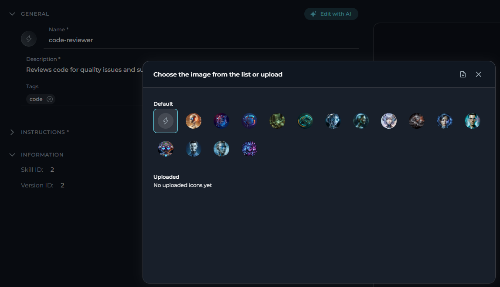

### Generate a Skill with AI

Instead of filling in the form manually, select **Generate with AI** in the **General** section header to open the **Generate skill** dialog.

1. Describe what you want the Skill to do in the input field.

   **Example prompt:**
   ```
   Create a skill that reviews pull request descriptions. It should check that the PR
   has a clear summary, lists affected components, includes test coverage notes,
   and flags any missing ticket references.
   ```

2. ELITEA drafts a **Name**, **Description**, and **Instructions** for you.
3. Review and edit the draft in the dialog.
4. Select **Approve** to apply it to the form, then select **Save**.

 <video controls width="100%" aria-label="Full skill creation flow from form to saved Skill.">
  <source src="../img/menus/skills/skills-build-ai.mp4" type="video/mp4" />
</video>

### Edit a Skill with AI

You can also refine an existing Skill with **Edit with AI**.

1. Open an existing Skill.
2. Select **Edit with AI**.
3. Describe the changes you want.
4. Select **Generate Draft**.
5. Review the generated draft step by step.
6. Select **Save** or **Save as Version**.

   <video controls width="100%" aria-label="Edit a Skill with AI.">
     <source src="../img/menus/skills/skill-edit-withai.mp4" type="video/mp4" />
   </video>

---

## Test a Skill

After you save a Skill, the right panel of the Skill editor contains a test chat panel. This stateless, ephemeral chat lets you interact with the Skill directly without creating a saved conversation. Use it to verify instructions before you attach the Skill to any agent.

<Note>
**Test conversations**

Test conversations are ephemeral. They are not saved and disappear when you leave the page or clear the chat.
</Note>

### Select the LLM Model & Settings

Before sending a message, you can choose which AI model processes the Skill and optionally fine-tune its parameters.

1. Select the **model chip** in the chat input bar to open the model selector dropdown.
2. Choose the model from the list, for example `gpt-4o` or `gpt-5.1`.
3. Select the **Model Settings** icon next to the model chip to adjust generation parameters.

   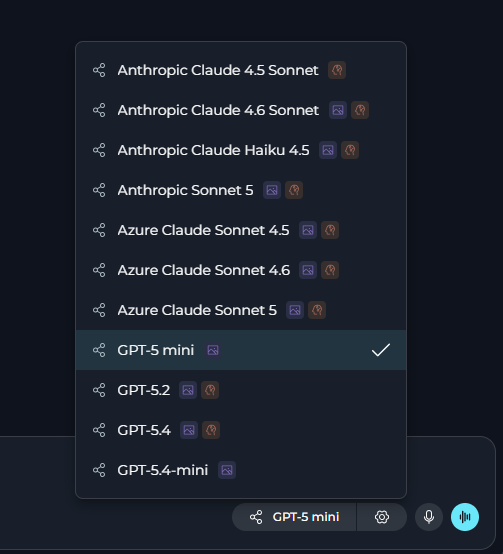
<Tabs>
  <Tab title="Reasoning Models (e.g. GPT-5.1)">
    | Parameter | Description |
    |-----------|-------------|
    | **Reasoning** | Controls the depth of logical thinking and problem-solving. |

    | Level | Behavior |
    |-------|----------|
    | **Low** | Fast, surface-level reasoning with concise answers and minimal steps |
    | **Medium** | Balanced reasoning with clear explanations and moderate multi-step thinking *(default)* |
    | **High** | Deep, thorough reasoning with detailed step-by-step analysis (may be slower) |
    
  </Tab>
  <Tab title="Standard Models (e.g. GPT-4o)">
    | Parameter | Description |
    |-----------|-------------|
    | **Creativity** | Controls response randomness. Lower values produce focused, deterministic outputs; higher values produce more varied and creative responses. |

    | Level | Behavior |
    |-------|----------|
    | **1** | Highly focused and deterministic outputs |
    | **2** | Mostly focused with slight variation |
    | **3** | Balanced between focus and creativity *(default)* |
    | **4** | More varied and creative responses |
    | **5** | Maximum creativity and diversity |
    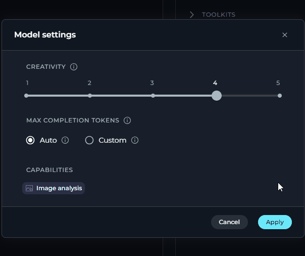
  </Tab>
</Tabs>

**Max Completion Tokens** *(All Models)*

| Option | Description |
|--------|-------------|
| **Auto** | System sets the token limit automatically *(default)* |
| **Custom** | Manually enter a specific token limit for responses |

### Use Voice Capabilities

The Skill test chat panel supports the same voice features as the agent chat interface.

<CardGroup cols={3}>
  <Card title="Voice Input" icon="microphone">
    Dictate prompts into the chat input field. Transcribed text is inserted at the cursor in real time.
  </Card>
  <Card title="Text-to-Speech" icon="volume-high">
    Have Skill responses read aloud. Pause and resume playback from a mini-player pill in the input area.
  </Card>
  <Card title="Speaking Mode" icon="waveform-lines">
    Hands-free voice loop. ELITEA records, sends, speaks the response, and listens again — automatically.
  </Card>
</CardGroup>

**Voice Input**

Select the **microphone** icon in the message input toolbar to start recording. Speak your prompt. A live transcript appears in the input field as you talk. Select **Stop** to finish. The final transcript is committed to the input field.

<Note>
**Voice input**

Voice Input uses a server-side automatic speech recognition (ASR) model if it is configured in **Settings** > **AI Configuration**. Otherwise, it falls back to the browser Web Speech API. If neither is available, the microphone icon is hidden.
</Note>

**Text-to-Speech**

A **Read out** button appears in the action bar below each Skill response. Select it to start playback. The text is highlighted as it is read. A playback pill in the input area provides **Pause** and **Resume** controls.

<Note>
**Text-to-speech**

When a text-to-speech (TTS) model is configured in **Settings** > **AI Configuration**, ELITEA uses it for audio generation. Otherwise, playback falls back to the browser SpeechSynthesis API.
</Note>

**Speaking Mode**

**Speaking Mode** is a continuous, hands-free voice loop. Leave the input field empty, then select the **voicewave** icon shown in place of the Send button to activate it. ELITEA records your speech, sends your prompt after three seconds of silence, plays back the response, and then starts listening again. Select **✕** in the voicewave pill to exit.

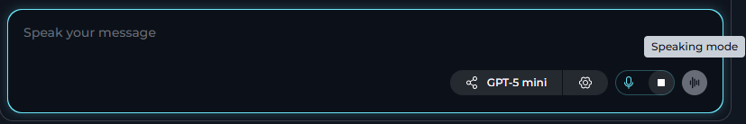
---


## Create & Manage Versions

Skills support **versioning**, allowing you to maintain multiple iterations of a Skill without breaking existing agents that depend on it. Every Skill has a `base` version, and you can create additional named versions to test changes, iterate on improvements, or maintain different variants for different use cases.

**Key Version Concepts:**

- **base version**: The always-present initial version of every Skill. Cannot be deleted.
- **Default version**: The version agents use when a Skill is attached without specifying a particular version. Can be changed to any version except those currently attached to agents.
- **Named versions**: Additional versions you create (e.g., "v2", "updated-for-api-v3"). Each must have a unique name within the Skill.
- **Version selector**: Dropdown in the Skill editor tab bar that shows all versions, their creators, and creation dates.

**Common Version Operations:**

| Operation | How to Access | Description |
|-----------|---------------|-------------|
| **Create version** | **Save As Version** button in tab bar | Save current changes as a new named version |
| **Switch versions** | Version selector dropdown in tab bar | Navigate between existing versions to view or edit |
| **Set default** | **⋮** menu > **Set as a default** | Make a version the default for agent attachments |
| **Compare versions** | **⋮** menu > **Compare Versions** | View side-by-side differences and selectively merge changes |
| **Delete version** | **⋮** menu > **Delete** | Remove a version (not available for base or default versions) |

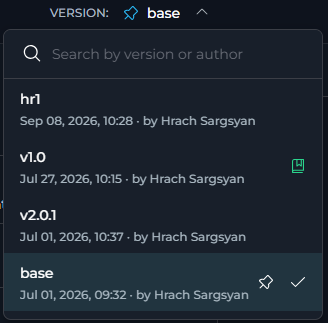


<Note>
For detailed information about version management patterns, best practices, naming conventions, and the complete Compare Versions workflow, see [Entity Versioning](../how-tos/agents-pipelines/entity-versioning). The reference documentation describes agent versioning, but skill versioning works the same way.
</Note>


### Export a Skill

1. Open the Skill and go to the version you want to export.
2. Select the **⋮** overflow menu in the tab bar.
3. Under the **VERSION** section, select **Export**.
4. A `.md` file for the current version is downloaded to your machine.

    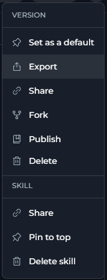

### Import a Skill

1. On the **Skills** page, select the **Import** icon button in the top toolbar.
2. A file picker opens. Select the `.md` export file from your machine.
3. The **Import parameters** dialog appears, showing:
   - **PROJECT** — a project selector (defaults to the currently selected project). Change it to import the Skill into a different project.
   - **MAIN ENTITY** — a preview card showing the Skill name, type, description, and instructions from the file.
4. Select **Import** to create the Skill, or select **Cancel** to abort.

    <video controls width="100%" aria-label="Import a Skill.">
      <source src="../img/menus/skills/skills-import.mp4" type="video/mp4" />
    </video>

<Note>
**Imported version**

Imported Skills are always created with the `base` version, regardless of the version stored in the export file.
</Note>

### Fork a Skill

You can fork a Skill version from the Skill editor or from ELITEA Catalog.

1. Open the Skill version you want to reuse.
2. Open the **⋮** overflow menu.
3. Select **Fork**.
4. Complete the import flow.

   <video controls width="100%" aria-label="Fork a Skill.">
     <source src="../img/menus/skills/skill-fork.mp4" type="video/mp4" />
   </video>

The fork action uses the Skill fork export payload and creates a copy in your selected project.

---

## Publish a Skill

Skills can be published to **ELITEA Catalog** and later unpublished.

1. Open the Skill version you want to publish.
2. Open the **⋮** overflow menu.
3. Select **Publish**.
4. Complete the publish flow.

The publish flow validates the Skill version, then publishes it to ELITEA Catalog. Published Skills can be listed in the public catalog and reused in other projects.

   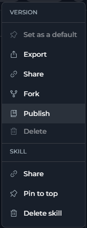

To remove a published Skill, open the same menu and select **Unpublish**.

For the full flow, see [Skill Publishing](../how-tos/agents-pipelines/skill-publishing).

---

## Use Skills from ELITEA Catalog

Published Skills are available in **ELITEA Catalog**.

From the catalog, you can:

- Browse published Skills by category
- Open Skill details
- Export a published Skill
- Fork a published Skill into your project
- Attach a public Skill to one or more agents in the current project

The catalog also tracks public Skill counts and refreshes when a Skill is published or unpublished.

   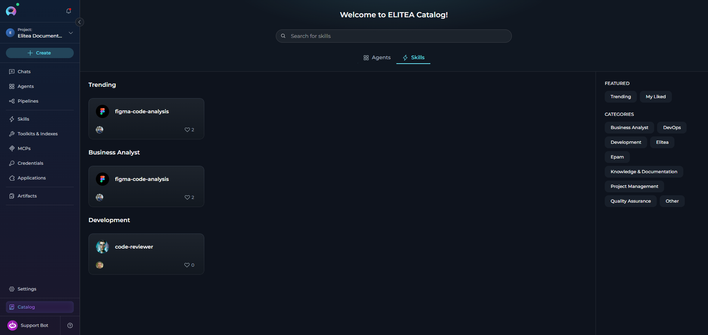

When you attach a public Skill from ELITEA Catalog, the system sends the selected public Skill version to one or more agent versions in the current project.

For the full flow, see **[ELITEA Catalog](./agents-studio)**

---

## Attach a Skill to an Agent

Skills are attached at the **agent version** level, not to the agent as a whole. You must save the agent before Skills can be attached.

<Info>
**Skill limit**

A maximum of **5 Skills** can be attached to a single agent version. The counter in the Skills section shows how many are currently attached (e.g., `2/5 skills added`).
</Info>

1. In **Agents**, open the agent you want to configure.
2. In the agent configuration form, scroll to the **Skills** accordion section (below the Instructions and Toolkits sections).
3. Select the **`+ Skill`** button to open the skill picker dropdown.
   - The button is disabled and shows a tooltip if the agent has not been saved yet (`Save the agent first, then add skills`) or if the 5-Skill limit has been reached (`Maximum number of skills reached`).
4. Search for the Skill by name in the **Search skills…** field, or browse the list.
5. Click a Skill to attach it. It attaches immediately using the Skill's `base` version.
   - Skills already attached to the agent version are excluded from the list to prevent duplicates.

   <video controls width="100%" aria-label="Attach a Skill to an Agent.">
     <source src="../img/menus/skills/skills-add-agent.mp4" type="video/mp4" />
   </video>   

To create a new Skill from the agent editor:

1. Select **`+ Skill`** in the Skills accordion.
2. Select **Create new** at the bottom of the picker dropdown.
3. You are taken to the Skill creation form.

If the selected attached version is later deleted, the Skill card shows this warning banner:

> *The attached skill version no longer exists. Select a valid version or remove this skill.*

If no Skills are attached to the agent, the mention list in chat shows:

> *No skills attached to this agent*

---

### Change the Attached Version

Each attached Skill card shows the currently active version name below the Skill's name. To change which version the agent uses:

1. On the Skill card inside the agent **Skills** section, select the version name, for example `base`.
2. A **Versions** dropdown appears, listing all available versions.
3. Select the version you want. The attachment is updated automatically. The old version is detached and the new version is attached.
4. The selected version is highlighted with a check mark.

    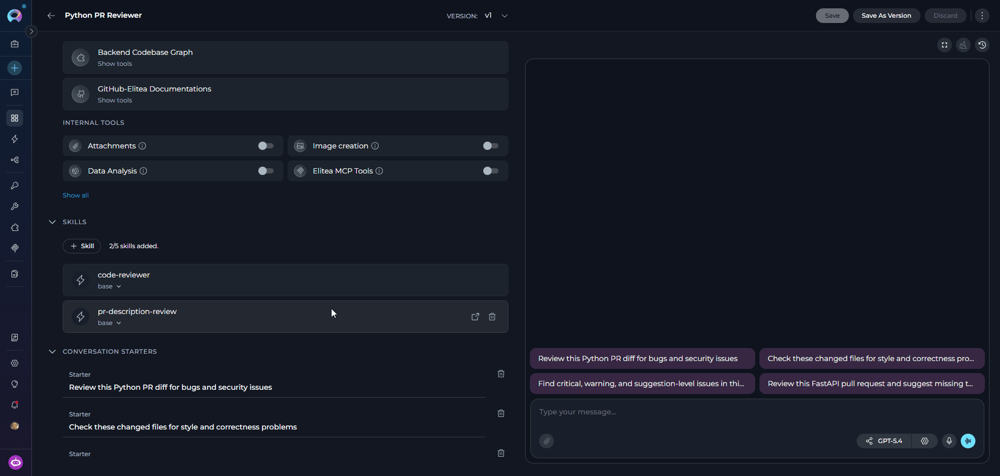

---


## Use Skills in Chat

When an agent has one or more Skills attached, users can invoke a Skill explicitly during a chat conversation by typing `~` (tilde) followed by the Skill name in the chat composer.

1. In a chat conversation with an agent that has Skills attached, type `~` in the message input.
2. A **Mention skill** dropdown appears above the input, listing all Skills attached to that agent.
   - If no Skills are attached, the dropdown shows: *"No skills attached to this agent"*.
3. Type additional characters to filter the list, or use the arrow keys to highlight a Skill.
4. Press **Enter** or select the Skill name to insert it as a mention token in your message.
5. Send the message. The agent receives and executes that Skill's instructions for this turn.

   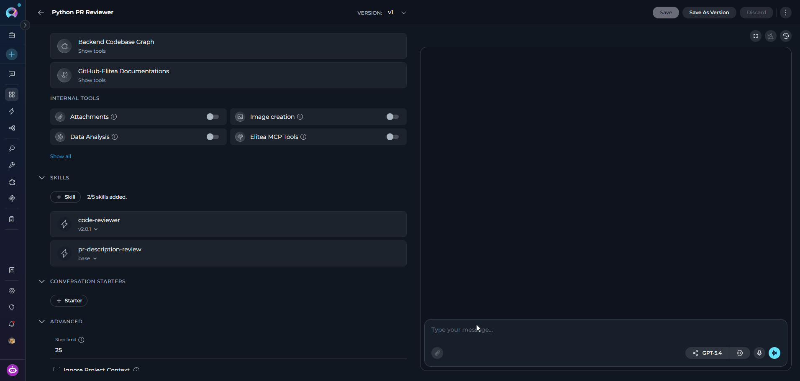

---

## Delete a Skill

<Warning>
**Delete warning**

Deleting a Skill removes it from all agents it is attached to. This action cannot be undone.
</Warning>

1. Open the **⋮ menu** in the editor tab bar.
2. Under the **SKILL** section, select **Delete skill**.
3. Enter the Skill name to confirm, then select **Delete**.

   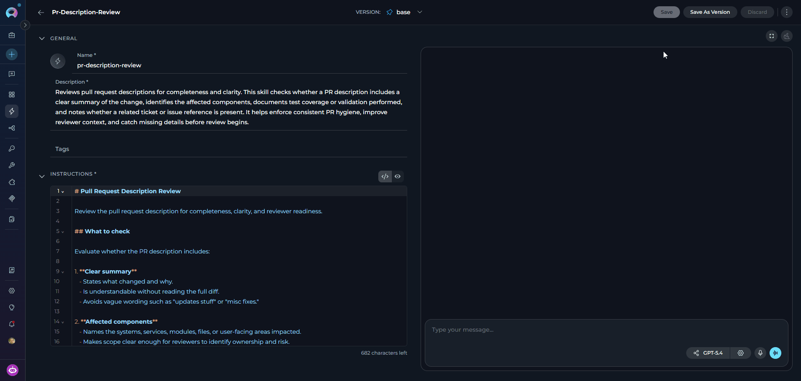

---

## Troubleshooting

<AccordionGroup>
  <Accordion title="The Skills Menu Item Is Missing from the Sidebar">
    The Skills menu item is hidden when the **Public project** is selected. Open the project switcher at the top of the sidebar and select a team or personal project. If the item is still missing, contact your platform administrator to verify you have the required permissions.
  </Accordion>

  <Accordion title="The Save Button Is Disabled on the Skill Creation or Edit Form">
    The **Save** button requires all of the following:
    - **Name** is non-empty and matches the allowed pattern (lowercase letters, digits, hyphens; no leading/trailing hyphens; no `claude` or `anthropic`).
    - **Description** is non-empty.
    - **Instructions** are non-empty.
    - At least one field has been changed since the last save.
    - None of the three fields exceed their character limits.

    Check the character counters next to each field and the validation error messages below the inputs.
  </Accordion>

  <Accordion title="The + Skill Button in the Agent Editor Is Disabled">
    Two conditions disable the button:
    - **Agent not yet saved** — save the agent first. The tooltip reads *"Save the agent first, then add skills"*.
    - **Limit reached** — the agent version already has 5 Skills attached. Remove one before adding another. The tooltip reads *"Maximum number of skills reached"*.
  </Accordion>

  <Accordion title="A Skill Card Shows a Warning Banner">
    The banner *"The attached skill version no longer exists. Select a valid version or remove this skill."* means the specific named version attached to this agent has been deleted from the Skill. Either select a different version from the version dropdown on the card, or remove the Skill and re-attach it.
  </Accordion>

  <Accordion title="The Mention Skill Dropdown Does Not Appear When I Type ~ in Chat">
    The `~` trigger only shows the dropdown if the agent in the current conversation has at least one Skill attached. Check the agent's **Skills** section in the agent editor. If no Skills are listed, attach one and save the agent, then start a new conversation.
  </Accordion>

  <Accordion title="Save As Version Fails with 'A Version with That Name Already Exists'">
    Each version name within a Skill must be unique. Choose a different name. Also note that the name `base` is reserved and cannot be used as a custom version name.
  </Accordion>

  <Accordion title="Import Fails or Does Not Create the Skill">
    - Only `.md` files exported from Elitea are accepted.
    - Ensure the target project is selected correctly in the **Import parameters** dialog.
    - If the Skill name in the file contains uppercase letters, spaces, or invalid characters, the import will be rejected. Edit the file or re-export from a corrected Skill.
  </Accordion>
</AccordionGroup>

---

<Info>
**Guides & References**

- **[Skill Builder](../how-tos/modules/skill-builder)** — Create and update Skills directly from chat
- **[Agents](./agents)** — Configure agents and attach Skills, Toolkits, and MCPs
- **[Project Context](./settings/project-context)** — Define shared background context injected into every AI interaction
- **[Entity Versioning](../how-tos/agents-pipelines/entity-versioning)** — Version management patterns for agents, pipelines, and Skills
- **[Export and Import](../how-tos/agents-pipelines/import-export)** — Exporting and importing Elitea entities
</Info>