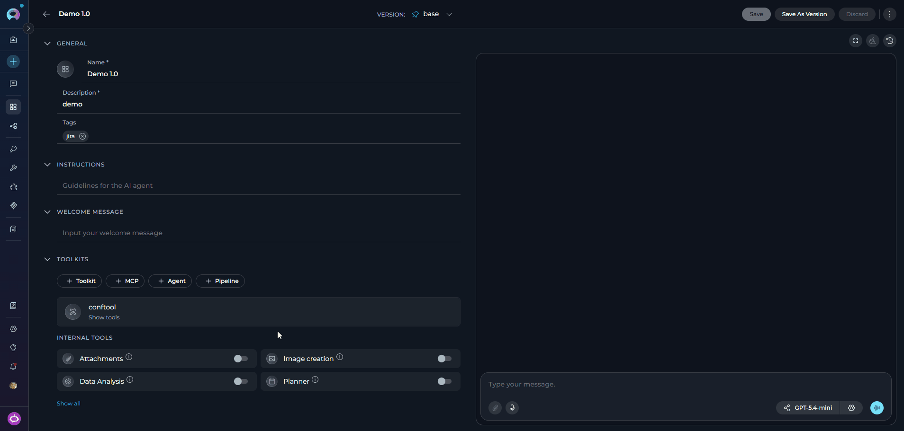
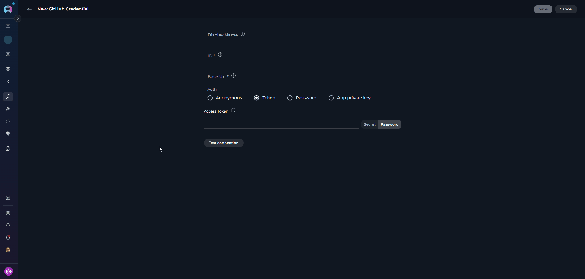
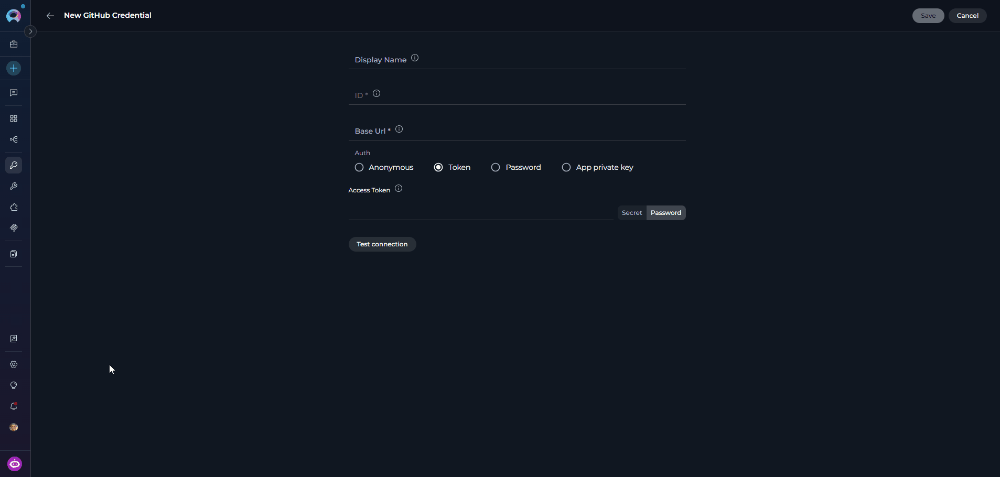

## Introduction

The **Support Assistant** is a floating chat widget available across the ELITEA platform. When enabled by your administrator, it provides an AI-powered support channel that you can open from anywhere in the UI to ask questions, get guidance, or resolve issues — all without navigating away from your current work.

The assistant is aware of your current context: it knows which project you are in, which page you are viewing, and which entity (agent, pipeline, toolkit, MCP, conversation, or credential) you have open. This awareness allows it to provide more relevant and specific assistance.

<CardGroup cols={2}>
  <Card title="Context-Aware Assistance" icon="location-dot">
    The assistant automatically tracks your current project, page, and open entity — so you can ask questions about exactly what you are working on.
  </Card>
  <Card title="File Attachments" icon="paperclip">
    Attach files to your messages by clicking the attachment icon, dragging and dropping, or pasting images directly from your clipboard.
  </Card>
  <Card title="Conversation History" icon="clock-rotate-left">
    All your past conversations are saved and accessible from the history panel in the assistant header.
  </Card>
  <Card title="Markdown Responses" icon="markdown">
    Assistant responses render with full Markdown formatting — including code blocks, tables, lists, and inline styling.
  </Card>
  <Card title="Fullscreen Mode" icon="expand">
    Expand the assistant to a fullscreen overlay for a more focused interaction when you need more space.
  </Card>
  <Card title="Theme-Aware Interface" icon="palette">
    The widget automatically matches the active light or dark theme of the ELITEA UI.
  </Card>
</CardGroup>

<Note title="Availability">
The Support Assistant is an optional feature. It is only visible when your platform administrator has enabled it. If you do not see the **Support Assistant** entry in the sidebar, the feature is not active in your environment.
</Note>

<Warning title="Personal Token Required">
The Support Assistant authenticates all communication — both API requests and the real-time message stream — using your **Personal Access Token**. If your token has expired or has not been created yet, the assistant will fail to load or send messages.

To resolve this, go to **Settings → Personal Tokens** and create or renew your token. See [Personal Tokens](/menus/settings/personal-tokens) for instructions.
</Warning>

## Opening the Support Assistant

When the Support Assistant is enabled, a **Support Assistant** entry appears at the bottom of the main navigation sidebar.

- When the sidebar is **expanded**, the entry shows the **Support Assistant** label.
- When the sidebar is **collapsed**, only the icon is shown. Hover over it to see the **"Support Assistant"** tooltip.

Click the entry to toggle the assistant panel open or closed.

<Tip title="Automatic Opening">
The Support Assistant may open automatically in certain situations — for example, when a toolkit requires a private credential that has not been set up yet. In this case, the assistant appears proactively to guide you through the resolution steps.
</Tip>

## Sending a Message

1. Click **Support Assistant** in the sidebar to open the chat panel.
2. Type your question or issue in the input field at the bottom.
3. Press **Enter** to send, or **Shift + Enter** to add a new line without sending.
4. The assistant streams its response in real time. A typing indicator (three animated dots) appears while the response is being generated.

## Attaching Files

You can attach files to provide additional context alongside your message.

**To attach a file:**

- Click the **paperclip icon** in the input area to open the file picker, or
- **Drag and drop** files directly onto the input area, or
- **Paste** an image from your clipboard directly into the text field — screenshots are automatically renamed with a timestamp.

**Supported file types:**

| Category | Extensions |
|----------|------------|
| **Images** | `.png`, `.jpg`, `.jpeg`, `.gif`, `.webp`, `.bmp`, `.svg` |
| **Documents** | `.pdf`, `.docx`, `.doc`, `.txt`, `.md`, `.csv`, `.xlsx`, `.xls`, `.ppt`, `.pptx`, `.json`, `.jsonl`, `.html`, `.htm`, `.xml`, `.yml`, `.yaml` |
| **Code files** | `.py`, `.js`, `.ts`, `.jsx`, `.tsx`, `.java`, `.cpp`, `.c`, `.cs`, `.go`, `.rb`, `.php`, `.sql`, and many more |

**Limits:**

- Up to **10 attachments** per message
- **Images**: max 3 MB each
- **Other files**: max 150 MB each
- **Total upload size**: max 150 MB per message

After selecting files, each one appears as a chip above the input field showing its upload progress. You can remove any attachment before sending by clicking the **×** on its chip. The **Send** button remains disabled until all uploads complete.

## Conversation History

The assistant saves all your previous conversations. To revisit a past conversation:

1. Click the **history icon** in the assistant header.
2. A dropdown list of your past conversations appears.
3. Click any conversation to load it and continue where you left off.

## Context Passed to the Assistant

The assistant receives the following context from your current session, which informs the responses it provides:

- **Project** — the currently selected project ID and name
- **Current page** — the URL of the page you are viewing
- **Browser info** — user agent string

Depending on the page you are on, additional context is included:

| Page Type | Additional Context |
|-----------|-------------------|
| **Agent detail** | Agent ID, name, selected model, selected provider, current tab, version ID |
| **Pipeline detail** | Pipeline ID, name, selected model, selected provider, current tab, version ID |
| **Toolkit detail** | Toolkit ID, current tab |
| **MCP detail** | MCP ID, current tab |
| **Application detail** | Application ID, current tab |
| **Credential detail** | Credential UID, current tab |
| **Chat conversation** | Conversation ID, conversation name, selected model, model provider |

<Info title="Context Is Read-Only">
The assistant reads your context to provide more relevant answers. It does not perform actions in ELITEA on your behalf unless the backing agent has been configured with tools to do so by your administrator.
</Info>

## Troubleshooting

<Accordion title="Support Assistant Entry Not Visible in the Sidebar">
The Support Assistant entry only appears when the feature is enabled by your administrator. If you do not see it, the feature is not currently active in your environment. Contact your platform administrator to request that it be enabled.
</Accordion>

<Accordion title="Assistant Panel Opens but Receives No Response">
The assistant is backed by an ELITEA agent. If responses are not returned, the backing agent may be misconfigured, offline, or lacking the necessary credentials. Contact your platform administrator to verify the agent and its configuration.
</Accordion>

<Accordion title="File Attachment Fails or Shows an Error">
Check that your file meets the supported type and size requirements: images must be under 3 MB, all other files under 150 MB, and no more than 10 attachments per message. Unsupported file types will show an error on the chip immediately after selection.
</Accordion>

<Accordion title="History Icon Is Greyed Out">
The history dropdown is only active when at least one previous conversation exists. If this is your first interaction with the Support Assistant, no history is available yet.
</Accordion>

<Accordion title="Context Does Not Seem Relevant to My Current Page">
Context is captured at the moment you open the assistant. If you navigated to a different page after opening the panel, the context may not reflect your current location. Close and reopen the assistant to refresh the context.
</Accordion>

---

<Info title="Additional Resources">
* [Agents](./agents) — Learn how ELITEA Agents work, including how an agent can be designated as the Support Assistant.
* [Settings → AI Configuration](./settings/ai-configuration) — Configure AI models used across the platform.
* [Contact Support](../support/contact-support) — Reach the ELITEA Support Team for issues not covered in this guide.
</Info>
