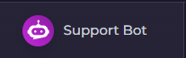
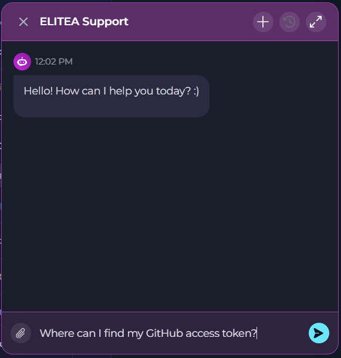
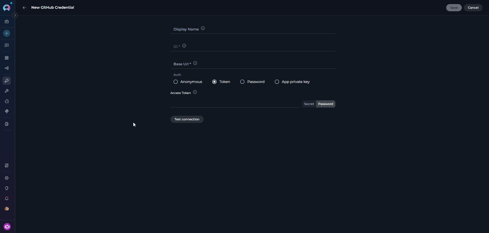
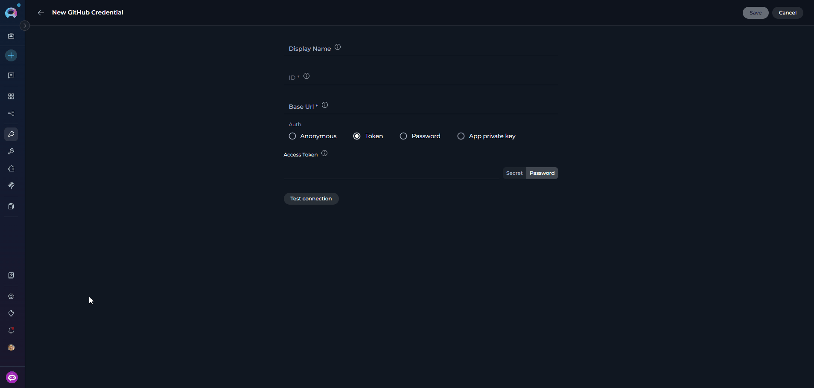

## Introduction

<Note>
**Availability**

The Support Bot is an optional feature, turned on at the deployment level. If you do not see the entry in the sidebar, the feature is not active in your environment.
</Note>

The **Support Bot** is a floating chat widget available across the ELITEA platform. When enabled by your administrator, it provides an AI-powered support channel that you can open from anywhere in the UI to ask questions, get guidance, or resolve issues, all without navigating away from your current work.

The Support Bot is aware of your current context: it knows which project you are in, which page you are viewing, and which entity (agent, pipeline, toolkit, MCP, conversation, or credential) you have open. This awareness lets it provide more relevant and specific assistance.

<CardGroup cols={2}>
  <Card title="Context-Aware Assistance" icon="location-dot">
    The Support Bot automatically tracks your current project, page, and open entity, so you can ask questions about exactly what you are working on.
  </Card>
  <Card title="File Attachments" icon="paperclip">
    Attach files to your messages by clicking the paperclip icon, dragging and dropping, or pasting images directly from your clipboard.
  </Card>
  <Card title="Conversation History" icon="clock-rotate-left">
    All your past conversations are saved and accessible from the history panel in the Support Bot header.
  </Card>
  <Card title="Markdown Responses" icon="markdown">
    Responses render with full Markdown formatting, including code blocks, tables, lists, and inline styling.
  </Card>
  <Card title="Mermaid & Image Rendering" icon="diagram-project">
    Mermaid code blocks render as visual diagrams, and inline images or GIFs render directly in the conversation with click-to-expand preview.
  </Card>
  <Card title="Fullscreen Mode" icon="expand">
    Expand the Support Bot to a fullscreen overlay for a more focused interaction when you need more space.
  </Card>
  <Card title="Theme-Aware Interface" icon="palette">
    The widget automatically matches the active light or dark theme of the ELITEA UI.
  </Card>
</CardGroup>


<Info>
**Authentication Is Automatic**

The Support Bot authenticates using your platform session, so there is nothing to set up. If you do not have a personal access token of your own, ELITEA automatically falls back to a platform-managed token for you. Visit **Settings → [Personal Tokens](/menus/settings/personal-tokens)** only if you want a personal token for other purposes, for example direct API access.
</Info>

## Open the Support Bot

When enabled, the **Support Bot** entry appears at the bottom of the main navigation sidebar.

- When the sidebar is **expanded**, the entry shows the icon with the **Support Bot** label.
- When the sidebar is **collapsed**, only the icon is shown.



Click the entry to toggle the chat panel open or closed.

<Tip>
**Proactive Popup**

In certain situations, for example when a toolkit requires a private credential that has not been set up yet, a small popup bubble ("Hi! Need help? Ask me!") appears next to the Support Bot entry to prompt you toward it. The popup fades away on its own after about 12 seconds. It does not open the chat panel itself, so click the entry to start the conversation.
</Tip>

## Send a Message

1. Click **Support Bot** in the sidebar to open the chat panel.
2. Type your question or issue in the input field at the bottom.
3. Press **Enter** to send, or **Shift + Enter** to add a new line without sending.
4. The Support Bot streams its response in real time. A typing indicator (three animated dots) appears while the response is being generated.



<Info>
**Stopping a Response**

While the Support Bot is generating a response, a **Stop** button appears in place of **Send**. Selecting it interrupts generation immediately. Any partial output already produced remains visible in the conversation, followed by a message confirming that generation was stopped.
</Info>

## Response Rendering

The Support Bot uses the same rich message rendering approach as the main ELITEA Chat experience for common response content.


**Rendering parity includes:**

- **Mermaid diagrams**: fenced code blocks marked as `mermaid` render as visual diagrams instead of raw code.
- **Inline images and GIFs**: both Markdown image syntax and inline HTML `` tags render directly in the conversation.
- **Expanded image preview**: selecting an inline image opens a larger preview overlay for easier inspection.
- **Markdown formatting**: tables, lists, headings, inline code, and standard fenced code blocks render in formatted form.

<Info title="Mermaid and HTML Image Support">
Support Bot responses support Mermaid diagram rendering and inline image rendering through the same Markdown pipeline used by the Support Bot widget, including GitHub-flavored Markdown and embedded raw HTML image tags.
</Info>

## Attach Files

You can attach files to provide additional context alongside your message.

**To attach a file:**

- Click the paperclip icon in the input area to open the file picker.
- **Drag and drop** files directly onto the input area.
- **Paste** an image from your clipboard directly into the text field. Screenshots are automatically renamed with a timestamp.



**Supported file types:**

| Category | Extensions |
|----------|------------|
| **Images** | `.png`, `.jpg`, `.jpeg`, `.gif`, `.webp`, `.bmp`, `.svg` |
| **Documents** | `.pdf`, `.docx`, `.doc`, `.txt`, `.md`, `.csv`, `.xlsx`, `.xls`, `.ppt`, `.pptx`, `.json`, `.jsonl`, `.html`, `.htm`, `.xml`, `.yml`, `.yaml` |
| **Code files** | `.py`, `.js`, `.ts`, `.jsx`, `.tsx`, `.java`, `.cpp`, `.c`, `.cs`, `.go`, `.rb`, `.php`, `.sql`, and many more |

**Limits:**

- Up to **10 attachments** per message
- **Images**: max 3 MB each
- **Other files**: max 150 MB each
- **Total upload size**: max 150 MB per message

After selecting files, each one appears as a chip above the input field showing its upload progress. You can remove any attachment before sending by clicking the **×** on its chip. The **Send** button remains disabled until all uploads complete.

## Conversation History

The Support Bot saves all your previous conversations. To revisit a past conversation:

1. Click the history icon in the Support Bot header.
2. A dropdown list of your past conversations appears.
3. Click any conversation to load it and continue where you left off.




## Context Passed to the Support Bot

The Support Bot receives the following context from your current session, which informs the responses it provides:

- **Project**: the currently selected project ID and name
- **Current page**: the URL of the page you are viewing
- **Browser info**: user agent string

Depending on the page you are on, additional context is included:

| Page Type | Additional Context |
|-----------|-------------------|
| **Agent detail** | Agent ID, name, selected model, selected provider, current tab, version ID |
| **Pipeline detail** | Pipeline ID, name, selected model, selected provider, current tab, version ID |
| **Toolkit detail** | Toolkit ID, current tab |
| **MCP detail** | MCP ID, current tab |
| **Application detail** | Application ID, current tab |
| **Credential detail** | Credential UID, current tab |
| **Chat conversation** | Conversation ID, conversation name, selected model, model provider |

<Info title="Context Is Read-Only">
The Support Bot reads your context to provide more relevant answers. It does not perform actions in ELITEA on your behalf unless your administrator has configured the backing agent with tools to do so.
</Info>

## Troubleshooting

<Accordion title="Support Bot Entry Not Visible in the Sidebar">
The Support Bot entry only appears when the feature is enabled by your administrator. If you do not see it, the feature is not currently active in your environment. Contact your platform administrator to request that it be enabled.
</Accordion>

<Accordion title="Support Bot Panel Opens but Receives No Response">
An ELITEA agent backs the Support Bot. If responses are not returned, the backing agent may be misconfigured, offline, or missing the necessary credentials. Contact your platform administrator to verify the agent and its configuration.
</Accordion>

<Accordion title="File Attachment Fails or Shows an Error">
Check that your file meets the supported type and size requirements: images must be under 3 MB, all other files under 150 MB, and no more than 10 attachments per message. Unsupported file types will show an error on the chip immediately after selection.
</Accordion>

<Accordion title="History Icon Is Grayed Out">
The history dropdown is only active when at least one previous conversation exists. If this is your first interaction with the Support Bot, no history is available yet.
</Accordion>

<Accordion title="Context Does Not Seem Relevant to My Current Page">
The Support Bot captures context at the moment you open it. If you navigated to a different page after opening the panel, the context may not reflect your current location. Close and reopen the Support Bot to refresh the context.
</Accordion>

<Accordion title="Mermaid Diagram or Inline Image Does Not Render Correctly">
The Support Bot renders Mermaid diagrams and inline images directly in the conversation. If rendering fails:

- Verify the Mermaid block uses valid fenced syntax such as ` ```mermaid `.
- Check that inline HTML image tags use a valid `src` value.
- If a Mermaid diagram contains invalid syntax, the Support Bot may fall back to showing the raw Mermaid code block.
- Reload the page and reopen the Support Bot if the message was streamed while the widget was still initializing.
</Accordion>

---

<Info title="Additional Resources">
* [Contact Support](../support/contact-support): reach the ELITEA Support Team for issues not covered in this guide.
</Info>
