## Introduction to Toolkits

**Toolkits** in ELITEA are modular integrations that connect your agents to external platforms and internal services. Each toolkit provides an interface for configuring connection parameters (such as API keys, URLs, or credentials) and setting options specific to the target service. Once configured, toolkits can be assigned to agents, empowering them to automate tasks across different systems and domains.

---

## Navigate the Toolkits & Indexes Menu

The **Toolkits & Indexes** menu is accessible from the main platform navigation. Upon entering this section, you will see a dashboard listing all available toolkits along with their configuration status.

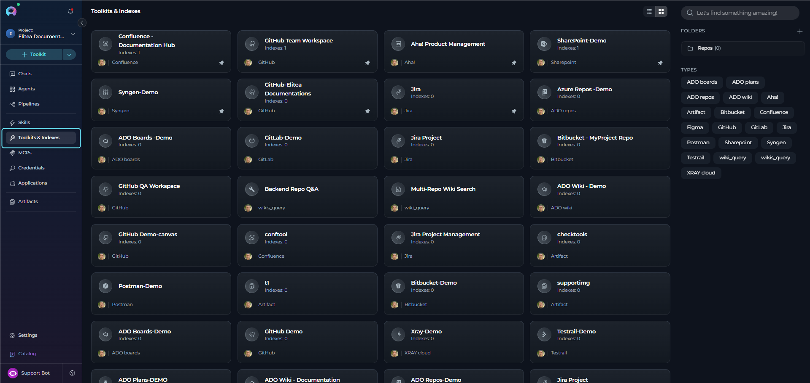

**Main elements:**

- **Toolkit cards:** Each card provides a brief description, current status, and toolkit type.
- **Search and filter:** Locate a toolkit using the search bar or filter by type.
- **Create Toolkit button:** Use the **+ Toolkit** button to add a new integration or configure an existing one.
- **View toggle:** Switch between **Card List View** and **Table View** using the toggle in the top-right corner.
- **Folders panel (right side):** Organize your toolkits into folders for better organization (see [Organize Toolkits with Folders](#organize-toolkits-with-folders) below)
- **Types filter panel:** Filter toolkits by their type/category tags
- **Pinning:** Pin frequently used toolkits to keep them at the top of the list

---

## Organize Toolkits with Folders

The **Folders** feature helps you organize toolkits into custom categories for easier navigation and management. Folders appear in a dedicated panel on the right side of the Toolkits & Indexes page.
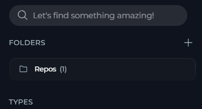

### Create a Folder

1. **Locate the Folders panel:** On the right side of the Toolkits & Indexes page
2. **Click the + Folder button:** Opens the Create Folder dialog
3. **Enter Folder name:** A descriptive name for your folder (e.g., "Production Toolkits", "Testing Tools")
4. **Click Create:** The new folder appears in the Folders panel
     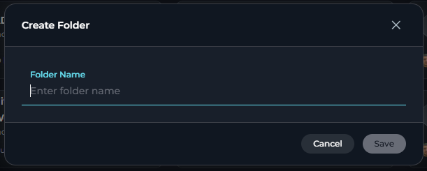

### Add Toolkits to a Folder

1. **Hover over a toolkit card:** A "Move to folder" icon (folder with arrow) appears on the card
2. **Click the folder icon:** Opens a menu with folder options
3. **Select a folder from the list:** The menu displays:
   - **+ Create Folder** option at the top
   - A scrollable list of existing folders
   - Pinned folders are marked with a pin icon
   - The current folder (if any) is highlighted and marked with a checkmark
4. The toolkit is moved to the selected folder
    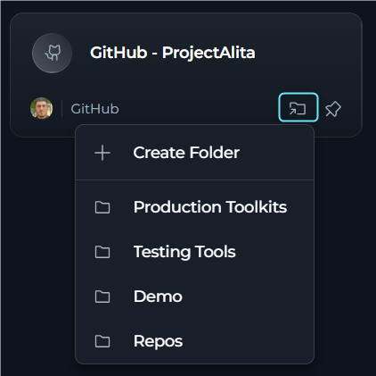

### Move or Remove Toolkits from Folders

**Move to another folder:**

1. **Hover over the toolkit card**
2. **Click the folder icon**
3. **Select a different folder** from the menu
   - The current folder is marked with a checkmark
   - Click any other folder to move the toolkit there
4. The toolkit is moved from the current folder to the selected folder

**Remove from a folder:**

1. **Hover over the toolkit card** that is in a folder
2. **Click the folder icon** (Move to folder button)
3. **Click "Remove from folder"** at the bottom of the menu (shown with an ungroup icon)
   - This option only appears when the toolkit is currently in a folder
4. The toolkit is removed from the folder and returns to the main toolkit list

**Create a folder while moving:**

1. Open the folder menu from any toolkit card (hover and click the folder icon)
2. Click **"Create Folder"** at the top of the menu 
3. Enter the folder name in the dialog and click Create
4. The new folder appears in the list and the toolkit is automatically moved to it

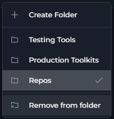

<Info title="Note">
Removing a toolkit from a folder does not delete the toolkit itself — it only removes the folder association. The toolkit remains available in the main toolkit list.
</Info>

### Manage Folders

Each folder in the Folders panel includes a **three-dot menu (⋮)** with the following options:

- **Pin folder:** Pinned folders appear at the top of the list for quick access
- **Rename:** Change the folder name and description
- **Delete:** Remove the folder (toolkits inside are not deleted, only removed from the folder)

      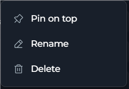

### View Folder Contents

Click any folder in the Folders panel to filter the toolkit list to show only toolkits in that folder. The folder name appears in the header, and the toolkit count updates to reflect the filtered view. Click **X** to close the folder view and return to the full list.

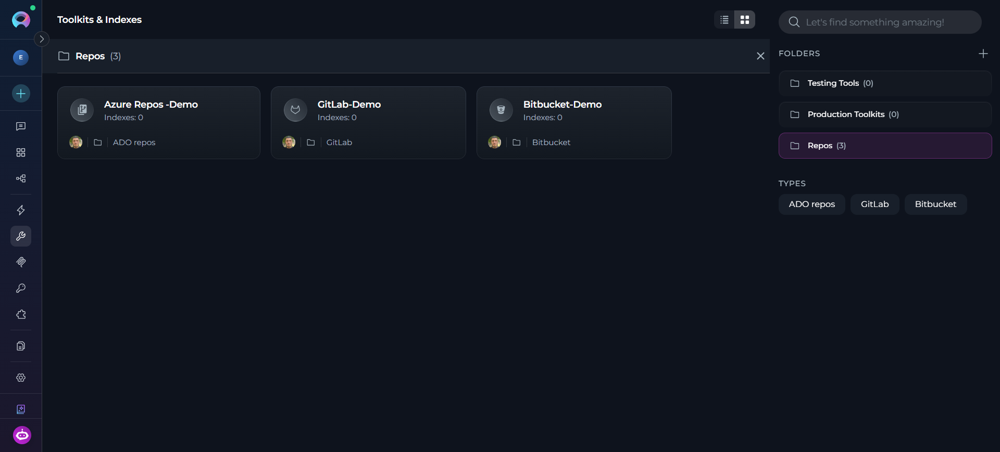

<Tip>
**Folder organization tips**

- **Group by purpose:** Create folders like "Production", "Development", "Testing"
- **Group by team:** Organize toolkits by team or project ownership
- **Group by integration type:** Separate code repositories, test management, documentation, etc.
- **Use pinning:** Pin your most frequently accessed folders for quick access
</Tip>

---

## Create a New Toolkit

Add new integrations to the platform by creating a new toolkit through the Toolkits menu.

### Start Toolkit Creation

- **From the Toolkits & Indexes page:** Select the **+ Toolkit** button at the top of the page.
- **From any page:** Open the global **Create** dropdown in the navigation bar and select **Toolkit**.

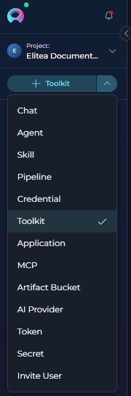

<Info title="Note">
Only users with the necessary permissions can create or configure toolkits. If the **+ Create** button is disabled, contact your platform administrator.
</Info>

### Select a Toolkit Type

Choose the desired toolkit type from the categorized list. Toolkit types are organized by category to help you find the integration you need. Use the search bar to locate a specific toolkit type by name.

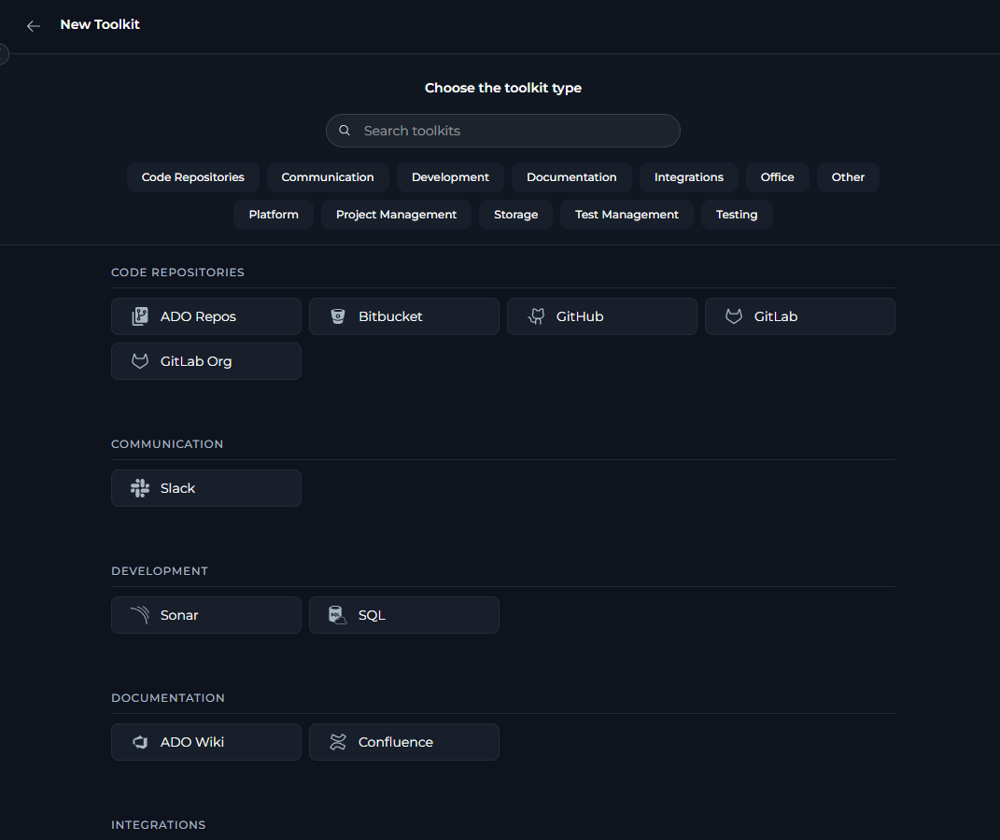

### Configure Toolkit Details

Once you have selected a toolkit type, configure the following fields:

**Main configuration fields:**

| Field | Description |
|---|---|
| **Toolkit Name** | A clear, descriptive name for your toolkit. |
| **Description** | A brief description to clarify the toolkit's purpose and usage. |
| **Credentials Configuration** | Varies by toolkit type. Select or create credentials for the integration. For toolkits that require credentials, such as Jira or GitHub, open the **Credentials** dropdown and either create new credentials or select an existing one. For toolkits without credential requirements, such as Artifact, configuration fields are shown directly on the create toolkit page. |
| **PgVector Configuration** | Select or configure a PgVector connection to turn on vector storage capabilities for document indexing and similarity search. |
| **Embedding Model** | Select an appropriate embedding model configuration to turn on text processing and semantic search features. |
| **Parameters** | Varies by toolkit type. Additional integration-specific parameters can include URLs and endpoints, project identifiers, and custom configuration options. |
| **Tools** | Select which specific tools and actions to turn on for this toolkit. Tools are organized into 4 groups: **Read**, **Create & update**, **Delete**, and **Execute**. Each group has a select-all checkbox and shows a count badge (selected/total). Use the search box to filter tools by name. Review available tools carefully and turn on only those needed for your use case. Turning on only necessary tools improves security and optimizes performance. **[Make Tools Available by MCP](../integrations/mcp/make-tools-available-by-mcp)** is an optional checkbox at the bottom of the Tools section that makes the selected tools accessible through external MCP clients. |

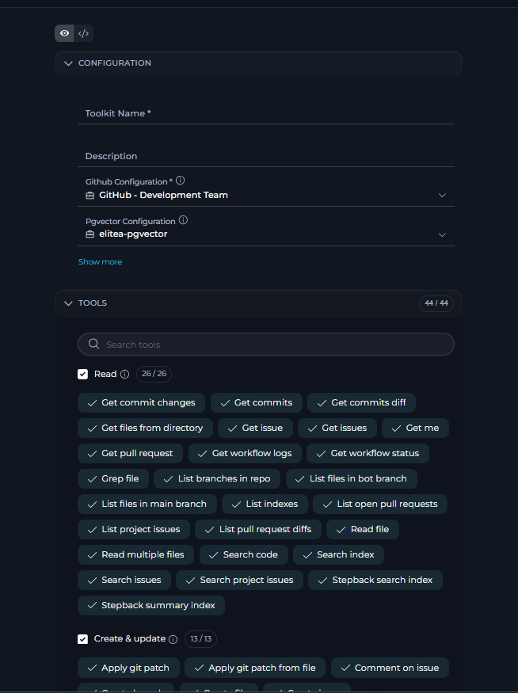

<Info title="Raw JSON editing">
Advanced users can switch to **Raw JSON** mode to directly edit the toolkit configuration as JSON. This provides more flexibility for complex configurations and bulk data entry. Toggle between the form view and **Raw JSON** view using the interface switch.

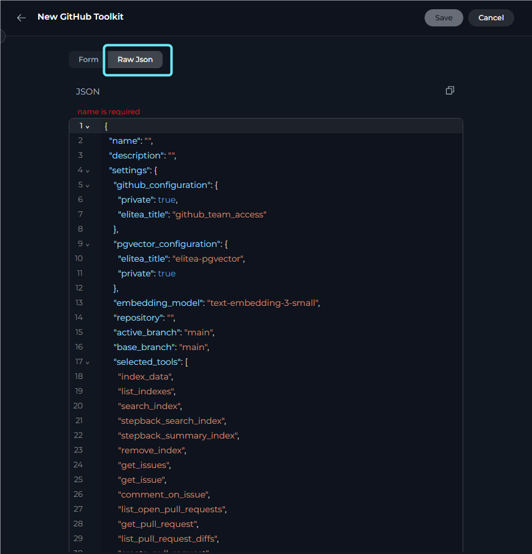
</Info>

<Tip title="Vector search tools">
The tools **Index data**, **List indexes**, **Remove index**, **Search index**, **Stepback search index**, and **Stepback summary index** require PgVector configuration and an embedding model. These turn on advanced semantic search capabilities across your indexed content. For setup instructions, see [AI Configuration](./settings/ai-configuration).
</Tip>

### Save Your Toolkit

Select **Save** (top right) to create the toolkit. It will appear in your toolkits dashboard, where you can access its detailed configuration page to modify settings or adjust tool selection as needed.

<video src="../img/menus/toolkits/toolkit-create-full.mp4" alt="Full toolkit creation walkthrough." width="650" controls />

<Tip title="Tool selection">
Modify tool selection at any time by visiting the toolkit's detailed configuration page. This allows you to add or remove tools as your requirements evolve.
</Tip>

---

## Toolkit Categories & Descriptions

The platform supports a wide range of toolkits, organized by category. This table lists the available categories and toolkit types.

| Category | Toolkit Type | Description |
|---|---|---|
| **Code Repositories** | [ADO Repos](../integrations/toolkits/ado_repos_toolkit) | Azure DevOps repositories |
| | [Bitbucket](../integrations/toolkits/bitbucket_toolkit) | Bitbucket code repositories |
| | [GitHub](../integrations/toolkits/github_toolkit) | GitHub code repositories |
| | [GitLab](../integrations/toolkits/gitlab_toolkit) | GitLab code repositories |
| | [GitLab Org](../integrations/toolkits/gitlab_org_toolkit) | GitLab organization-level integration |
| **Communication** | [Slack](../integrations/toolkits/slack_toolkit) | Slack team messaging and collaboration |
| **Development** | [Sonar](../integrations/toolkits/sonar_toolkit) | SonarQube code quality and security analysis |
| | [SQL](../integrations/toolkits/sql_toolkit) | SQL database integration and querying |
| **Documentation** | [ADO Wiki](../integrations/toolkits/ado_wiki_toolkit) | Azure DevOps wiki and documentation |
| | [Confluence](../integrations/toolkits/confluence_toolkit) | Confluence wiki and knowledge management |
| **Integrations** | [OpenAPI](../integrations/toolkits/openapi_toolkit) | OpenAPI specification integration |
| **Office** | [PPTX](../integrations/toolkits/powerpoint_toolkit) | PowerPoint presentation creation and editing |
| | [SharePoint](../integrations/toolkits/sharepoint_toolkit) | SharePoint document management and collaboration |
| **Other** | [Artifact](../integrations/toolkits/artifact_toolkit) | Artifact file storage and management |
| | [Custom](../integrations/toolkits/custom_toolkit) | Custom toolkit integration |
| | [Figma](../integrations/toolkits/figma_toolkit) | Figma design collaboration and prototyping |
| | [Google Places](../integrations/toolkits/google_places_toolkit) | Google Places location services and information |
| | [Memory](../integrations/toolkits/memory_toolkit) | Memory storage and retrieval capabilities |
| | [Postman](../integrations/toolkits/postman_toolkit) | Postman API development and testing |
| | [Salesforce](../integrations/toolkits/salesforce_toolkit) | Salesforce CRM integration |
| | [ServiceNow](../integrations/toolkits/servicenow_toolkit) | ServiceNow IT service management |
| **Project Management** | [Aha!](../integrations/toolkits/aha_toolkit) | Aha! product management and roadmap planning |
| | [ADO Boards](../integrations/toolkits/ado_boards_toolkit) | Azure DevOps project boards and work items |
| | [Jira](../integrations/toolkits/jira_toolkit) | Jira issue and project tracking |
| | [Rally](../integrations/toolkits/rally_toolkit) | Rally agile project management |
| **Test Management** | [ADO Plans](../integrations/toolkits/ado_plans_toolkit) | Azure DevOps test plans and test management |
| | [QTest](../integrations/toolkits/qtest_toolkit) | QTest test case management |
| | [TestRail](../integrations/toolkits/testrail_toolkit) | TestRail test case and test run management |
| | [XRAY Cloud](../integrations/toolkits/xray_toolkit) | Xray test management for Jira Cloud |
| | [Zephyr Enterprise](../integrations/toolkits/zephyr_enterprise_toolkit) | Zephyr test management, enterprise edition |
| | Zephyr Essential | Zephyr test management, essential edition |
| | [Zephyr Scale](../integrations/toolkits/zephyr_scale_toolkit) | Zephyr Scale test management for Jira Cloud |
| | Zephyr Squad | Zephyr Squad test management for Jira Server |
| **Testing** | Carrier | Carrier performance testing platform |
| | [Report Portal](../integrations/toolkits/reportportal_toolkit) | Test reporting, analytics, and dashboards |
| | [TestIO](../integrations/toolkits/testIO_toolkit) | TestIO crowdsourced testing services |

<Info title="Note">
Toolkit availability may change. Refer to the platform UI for the most current list.
</Info>

---

## Manage Toolkit Configuration

The toolkit detail page provides a comprehensive interface for configuring, testing, and monitoring your toolkits. Access it by selecting any toolkit from the Toolkits dashboard.

### Configure a Toolkit

The toolkit detail page is the primary interface for configuring toolkit settings and managing tool selection. The page header includes a **Back** button, the toolkit name, and a controls dropdown in the top-right area. The layout is split into two main panels:

- **Left panel** — the configuration form, including toolkit settings, tool selection, and a **Run History** button above the form
- **Right panel** — the **Indexes** section when indexing is supported for the toolkit

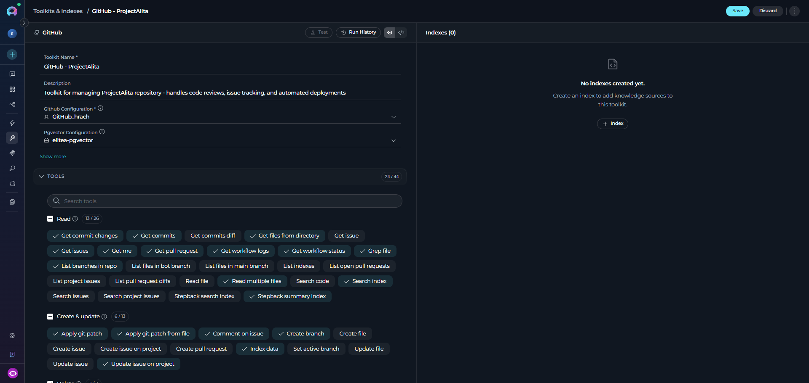

On the toolkit detail page, you can:

- **Edit toolkit details:** Edit the name, description, credentials, and other toolkit-specific settings in the left panel.
- **Select tools:** In the **Tools** section, turn on only the tools your agent needs. Tools are organized into groups (**Read**, **Create & update**, **Delete**, **Execute**). Use the group-level checkboxes to select/deselect all tools in a group at once, or use the search box to filter tools by name.
- **Update advanced settings:** Update PgVector configuration or embedding model as your indexing needs change.
- **Save or discard:** **Save** becomes active once you make changes. Changing the embedding model while indexes exist triggers a warning first, since it can make those indexes non-operational.
- **View run history:** Select the **Run History** button above the form to view past test runs.
- **Test toolkit:** Select the **Test** button in the page header to open the dedicated [Test page](#test-a-toolkit) where you can test individual toolkit tools.
- **Use the controls menu:** Use the **three-dot menu (⋮)** for **Copy Link**, **Pin/Unpin**, and **Delete**. **Export** and **Fork** are listed but currently unavailable.
- **View authors:** Shown in the header when viewing a public toolkit.
- **Edit Raw JSON:** Supported toolkits let you switch the form to **Raw JSON** editing via the view toggle in the left panel.
- **Manage indexes:** In the right panel, the **Indexes** section shows all indexes for this toolkit with options to create, reindex, or delete indexes (see [Indexes Section](#indexes-section) below).

<Tip title="Tool selection best practices">
Use the tool groups (**Read**, **Create & update**, **Delete**, **Execute**) to quickly select related tools. Turn on only the tools your use case requires, use the search box to find specific tools quickly, test each one in the **Test Settings** panel, and revisit the toolkit configuration when credentials, tool access, or capabilities need to change.
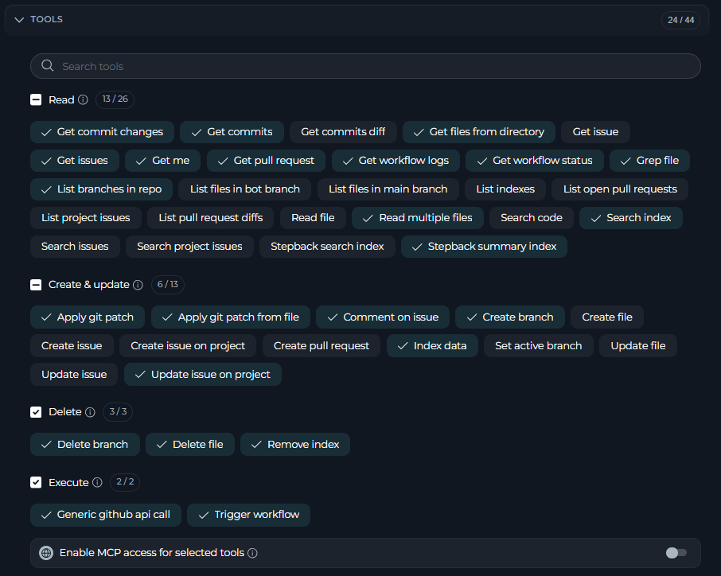
</Tip>

### Make Tools Available by MCP

  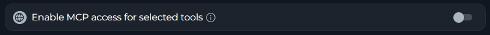

When configuring toolkit tools, you may see a checkbox labeled **[Make Tools Available by MCP](../integrations/mcp/make-tools-available-by-mcp)** in the **Tools** section. This option controls whether the selected tools can be accessed through the Model Context Protocol (MCP) interface.

- **Purpose:** Turns on toolkit tools to be exposed and accessible via MCP servers.
- **Location:** Appears in the **Tools** configuration section when selecting toolkit tools.
- **When to turn on:**
  - You plan to use this toolkit's tools through an MCP server.
  - You want to make these tools available to external MCP clients.
  - You are building MCP-based integrations that need access to these tools.

### Test a Toolkit

The **Test page** provides a dedicated full-screen interface for testing individual toolkit tools. Access it by selecting the **Test** button in the toolkit detail page header.

For comprehensive testing instructions and best practices, see [How to Test Toolkit Tools](../how-tos/credentials-toolkits/how-to-test-toolkit-tools).

**Steps to test a toolkit:**

1. **Access the Test page:** From the toolkit detail page, select the **Test** button in the page header. This opens the dedicated Test page.

2. **Select a tool:** Use the **Tool** dropdown to choose which toolkit action you want to test. Type in the search box to filter available tools and select from the options.

3. **Select a model and adjust settings** (optional): Choose the LLM model from the model dropdown (for example, `GPT-5.4`). To fine-tune the response, select the **Model Settings** icon (⚙️) next to the model selector. The available settings vary by model:

     <Tabs>
          <Tab title="Reasoning Models (e.g. GPT-5.1)">
               | Setting | Option | Description |
               |---|---|---|
               | **Reasoning** | Low | Fast, surface-level reasoning with concise answers and minimal steps |
               | | Medium *(default)* | Balanced reasoning with clear explanations and moderate multi-step thinking |
               | | High | Deep, thorough reasoning with detailed step-by-step analysis (may be slower) |
               | **Max Completion Tokens** | Auto *(default)* | System automatically sets the token limit to 4096 tokens |
               | | Custom | Manually set a specific token limit; interface shows remaining tokens available. An error is shown if the value exceeds the model's maximum output tokens |
          </Tab>
          <Tab title="Standard Models (e.g. GPT-4o)">
               | Setting | Option | Description |
               |---|---|---|
               | **Creativity** | 1 | Highly focused and deterministic outputs |
               | | 2 | Mostly focused with slight variation |
               | | 3 *(default)* | Balanced between focus and creativity |
               | | 4 | More varied and creative responses |
               | | 5 | Maximum creativity and diversity |
               | **Max Completion Tokens** | Auto *(default)* | System automatically sets the token limit to 4096 tokens |
               | | Custom | Manually set a specific token limit; interface shows remaining tokens available. An error is shown if the value exceeds the model's maximum output tokens |
          </Tab>
     </Tabs>

4. **Provide required parameters (if prompted):** Enter any inputs required by the selected tool. The form dynamically displays fields based on the tool's requirements.

5. **Run the tool:** Select the **Run Test** button. The results appear in the right panel, showing the tool execution output and LLM response. You can run multiple tests in sequence, and each result is added to the conversation history in the Results panel.

6. **Return to configuration:** Use the breadcrumb navigation or back button to return to the toolkit detail page.

     <video controls>
          <source src="../img/menus/toolkits/toolkit-test-tools.mp4" type="video/mp4"/>
          Your browser does not support the video tag.
     </video>

---

### Shared Toolkit Credentials

Shared toolkits in team projects can show warnings when each user must provide a matching private credential, or when a credential change may affect other team members.

<Card icon="circle-exclamation" color="#ef4444" horizontal>
 <strong>  Credential setup required: </strong> This toolkit requires your own private *[credential type]* credentials. Create a credential with the matching ID *"[credential ID]"* in your Private workspace to use this toolkit.
</Card>

<Card title="Credential Configuration Change" icon="circle-exclamation" color="#ef4444">
  Changing the credential may make this toolkit non-operational for other team members who do not have a matching private credential. Make this decision considering the potential impact on your team.
</Card>

---

### Indexes Section

Toolkits with indexing tools display an **Indexes** panel in the right side of the toolkit detail page. Indexing ingests documents into a vector store for semantic search and retrieval.

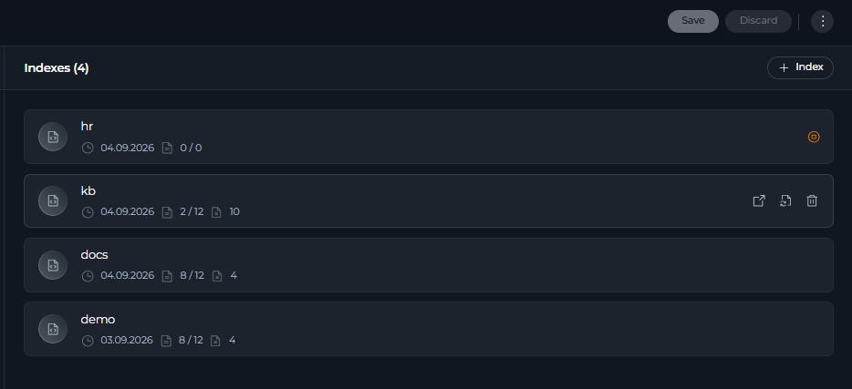

**Panel Overview:**

The panel header shows "Indexes" with a count (e.g., "Indexes (3)") and a **+ Index** button to create new indexes. Each index card displays collection name, document counts, status, and last run date.

**Index Actions** :
- **Open** — View the Index Details page with Configuration and Activity tabs
- **Reindex** — Rebuild the index (requires confirmation)
- **Delete** — Remove the index (requires confirmation)
- **Open in new tab** — Open index details in a separate tab

**Create an Index:**

Select **+ Index** to open the Create Index page and configure name, source filters, and chunking settings. For detailed instructions, see [How to Create and Use Indexes](../how-tos/indexing/using-indexes-tab-interface).

<Note>
**Indexing Status Banners**

If a banner appears instead of index cards, indexing is not ready:

- *"Turn on the 'Index data' tool..."* — The `index_data` tool is not selected, or PgVector/Embedding Model are not configured (see [AI Configuration](./settings/ai-configuration))
- *"Create your first index..."* — Indexing is active but no indexes exist yet
</Note>

---

### View Toolkit Run History

The **Run History** page provides a complete audit trail of all past test executions performed in the toolkit's **Test Settings** panel.

**How to access Run History:**

1. Open any saved toolkit.
2. Go to the toolkit's detail page and select the **View run history** button. This opens the dedicated Run History page for that toolkit.
3. Use the back navigation (breadcrumb or back button) to return to the toolkit's configuration tab.

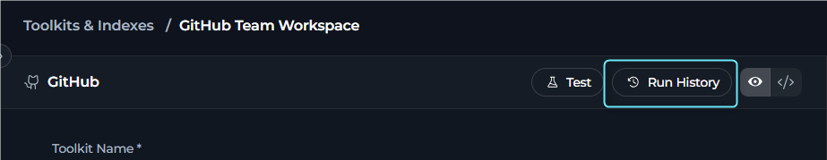

**Run History layout:**

The Run History page uses the shared `RunHistoryContainer` layout:

- **Left panel** — sortable list of all past test runs. Select any column header to sort:

     | Column | Description |
     |---|---|
     | **Date** | Timestamp of the run in `dd-MM-yyyy, hh:mm a` format |
     | **Version** | Toolkit version used for the run |
     | **Duration** | Total execution time of the run |

     Select a row to load the conversation replay in the right panel. Each row also has a **three-dot menu (⋮)** with **Share link** and **Delete**.

- **Right panel** — full conversation replay of the selected test run.

   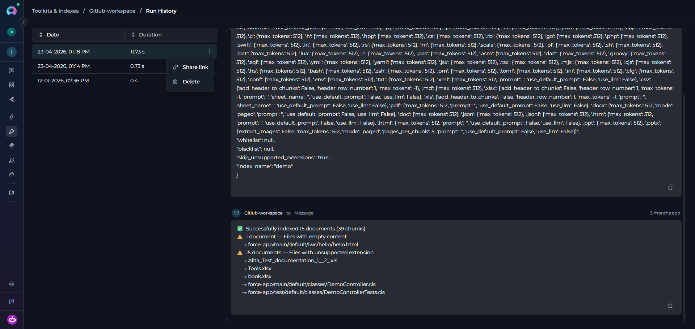

<Info title="Learn more about history">
For detailed instructions on using the Toolkit History panel, see [Toolkit History Tab Guide](../how-tos/credentials-toolkits/toolkit_history_tab).
</Info>

---

## Use Toolkits in Your Workflows

Once a toolkit is configured, use it across different areas of the platform to enhance your workflows.

**In Agents**

1. Go to the **[Agents](./agents)** menu.
2. Select or create an agent.
3. In the agent's configuration, add the desired toolkit from the list of available toolkits.
4. Configure any agent-specific toolkit options, if prompted.
5. Select **Save**.

      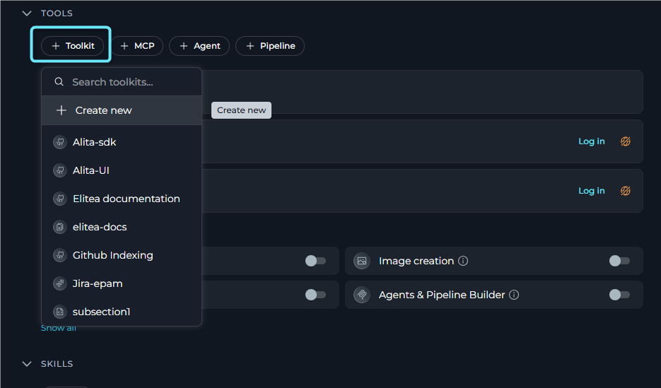

**In Pipelines**

1. Go to the **[Pipelines](./pipelines)** menu.
2. Select or create a pipeline.
3. In the pipeline configuration, add the desired toolkit to turn on automated workflow steps.
4. Configure pipeline-specific toolkit parameters as needed.
5. Select **Save**.

      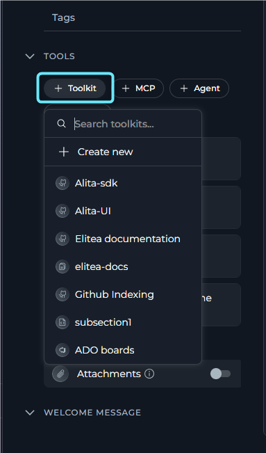

**In Chat**

1. Open a **[Chat](./chat)** session.
2. Access the toolkit selector within the chat interface.
3. Select one or more toolkits to make their capabilities available during the conversation.
4. Use natural language to interact with the toolkit's features.
    
      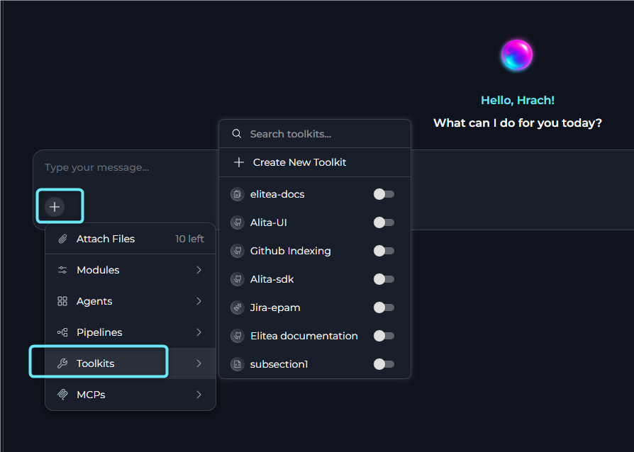

<Info title="Tip">
Use multiple toolkits simultaneously in agents, pipelines, and chat sessions to create powerful, integrated workflows that span multiple services and platforms.
</Info>

---

## Best Practices

<Accordion title="Secure Your Credentials">
Use dedicated credentials for each integration, store them only in the platform credential manager, and avoid sharing private credentials across users or workspaces.
</Accordion>

<Accordion title="Test Before Use">
Test each turned-on tool in the **Test Settings** panel before assigning the toolkit to agents, pipelines, or chat workflows.
</Accordion>

<Accordion title="Keep Toolkits Updated">
Review toolkit settings whenever credentials rotate, service URLs change, available tools change, or indexing configuration is updated.
</Accordion>

<Accordion title="Minimal Permissions">
Turn on only the tools and external-service permissions required for the intended workflow.
</Accordion>

---

## Troubleshooting

<Accordion title="Failed Connection">
Verify the selected credential, confirm any required URLs or project identifiers, and check that the target service is reachable from your environment.
</Accordion>

<Accordion title="Toolkit Not Appearing">
Refresh the Toolkits page, clear active filters or search terms, and verify that you have permission to view or create that toolkit type.
</Accordion>

<Accordion title="Agent Cannot Use Toolkit">
Confirm the toolkit is saved, properly configured, and explicitly attached to the agent, pipeline, or chat session where you expect to use it.
</Accordion>

<Accordion title="Indexes Section Not Available">
If the **Indexes** section does not appear or cannot be used in your toolkit:

1. **Verify indexing tools are turned on** — Confirm the **Index data** tool is selected in the toolkit's **Tools** section.
2. **Check AI configuration** — Confirm that PgVector and an Embedding Model are configured in [AI Configuration](./settings/ai-configuration).
3. **Save and refresh** — Save the toolkit after making changes, then refresh the page so the **Indexes** accordion can load with the updated configuration.
</Accordion>

For further assistance, contact your platform administrator.

### Support Contact

If you encounter issues not covered in this guide or need additional assistance with toolkit management, see [Contact Support](../support/contact-support) for detailed information on how to reach the ELITEA Support Team.

---

<Info title="Additional resources">
Explore these related guides to maximize your toolkit usage:

- **[Sensitive Action Authorization Guardrail](../how-tos/chat-conversations/sensitive-action-authorization-guardrail)** — Learn how to protect sensitive toolkit actions by requiring human approval before they are executed.
- **[Glossary](../home/glossary)** — Definitions of common terms used across the platform.
- **[Credentials](./credentials)** — Learn how to create and manage credentials used by toolkits.
- **[AI Configuration](./settings/ai-configuration)** — Set up embedding models and vector configurations.
- **[Secrets Management](./settings/secrets)** — Secure credential storage best practices.
</Info>
