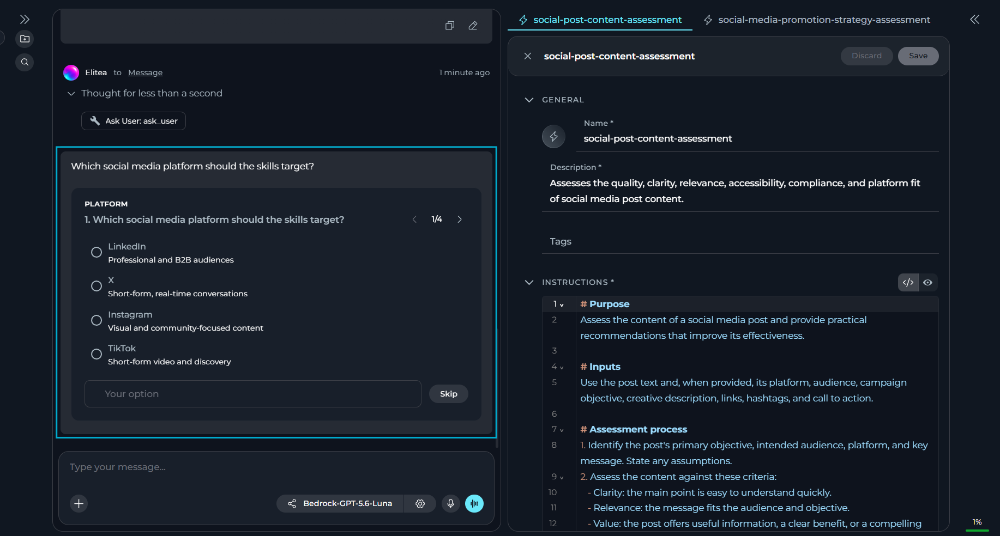
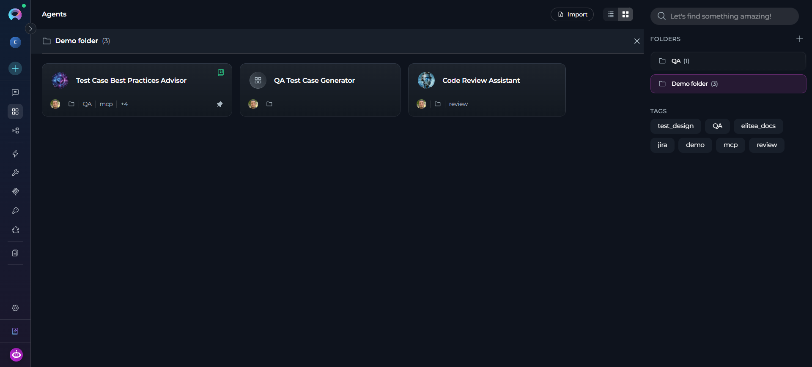
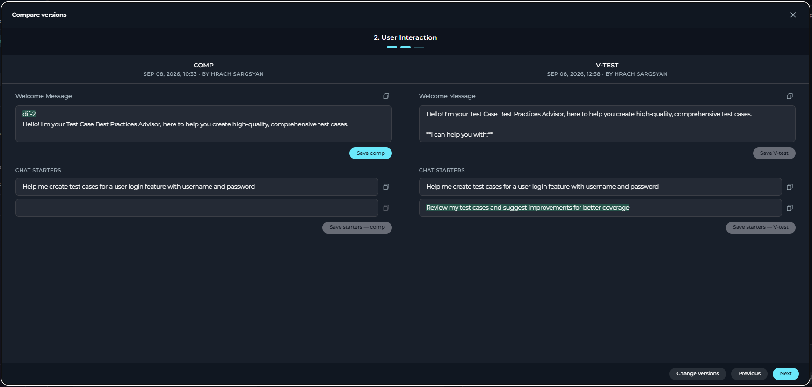
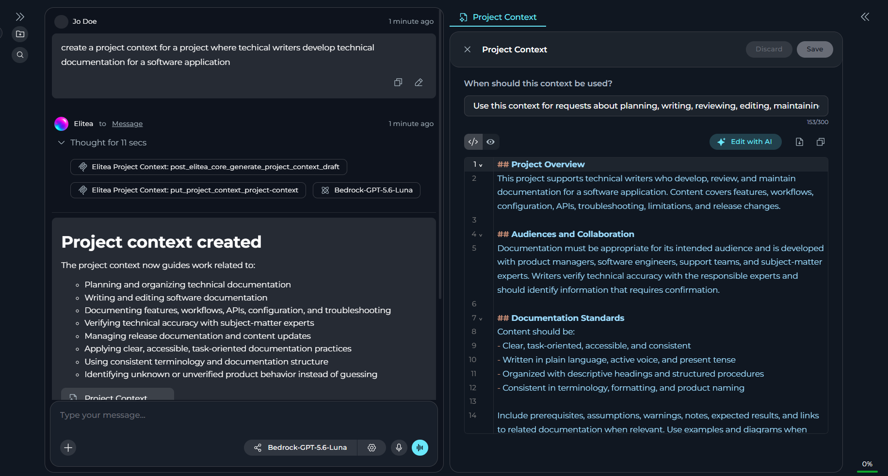
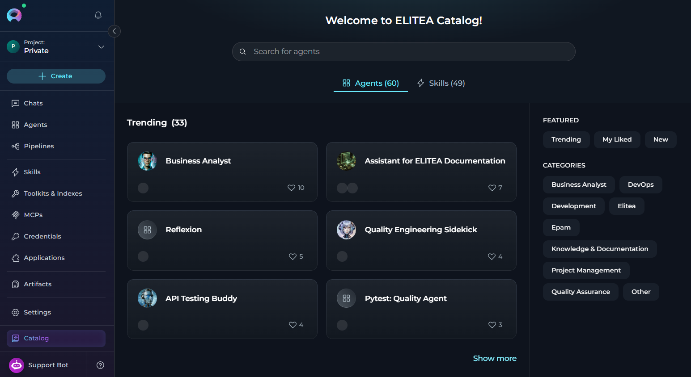

ELITEA 2.0.6 focuses on organizing, protecting and sharing your work. This release introduces agent evaluation, project backup and restore, chat-built Skills and Project Context with a new Ask User tool, external conversation sharing, AI follow-up suggestions and side-by-side version comparison. It also redesigns the indexing, toolkit and testing experience, and improves navigation, version selection, Canvas and catalog discoverability.

* **Release version**: 2.0.6
* **Released on**: September 13, 2026
* **Access**: [ELITEA Platform](https://next.elitea.ai)

## New Features

### Agent Evaluation (Beta)

You can now evaluate chat and task-automation agents from a new **Evaluation** tab on the agent editor, scoring runs against configurable dimensions and comparing results across datasets and runs.

<Note>
Agent Evaluation is a Beta feature. Supported engines and metrics may change.
</Note>

* Define evaluation dimensions using an AI-judge, Human or Code engine, each with its own evidence scope, weight, target and polarity.
* Group dimensions and code validations into a suite bound to a specific agent version.
* Run a suite as an offline batch over a dataset or on demand against a single conversation.
* Review the results with native and normalized scores, and add inline human scores that trigger automatic re-aggregation.
* Rely on an append-only human-score audit trail and role-gated access.

**Benefits:** Repeatable, measurable agent testing that surfaces regressions and quality issues before they reach users.

Details: [Agent Evaluation](../how-tos/agents-pipelines/agent-evaluation), [Agent Evaluation FAQs](../how-tos/agents-pipelines/agent-evaluation-faq).

<video src="../img/how-tos/agents-pipelines/agent-evaluation/run-evaluation.mp4" controls alt="Video demonstrating running an agent evaluation suite."></video>

### Project Back Up & Restore

You can now back up your project's data and restore them for both team and private projects.

* Create an encrypted backup file covering agents, pipelines, toolkits, MCP servers and skills to restore them, if needed. Credentials, tokens and other secrets are excluded from the backup.
* Preview a restore with a dry run before applying it.
* Choose whether the restored entities replace the existing project data or merge with them.
* Platform Admins can take a full, raw database-level backup or restore of a project from the Admin panel.

**Benefits:** Faster recovery of the project data without compromising its security.

Details: [Back Up & Restore Project Data](../how-tos/entity-management/backup.mdx), [General Settings](../menus/settings/general#back-up-%26-restore).

### Clarifying Questions & Follow-up Suggestions in Chat

You can now communicate with chat more effectively and get more correct responses with a new chat module and additional clickable AI-generated follow-up suggestions.

* Enable the **Ask User** module so the assistant can pause mid-run and ask structured clarifying questions instead of guessing.
* Answer clarifying questions one at a time.
* Rely on **Ask User** failing safely in headless or API-only runs, returning a default answer instead of hanging.
* Select a suggestion chip to insert it into the chat input as editable text or skip the suggestion.
* Keep suggestions private and non-persistent.

**Benefits:** Fewer wrong assumptions from agents when requirements are unclear, faster follow-up messages with less typing.

Details: [Chat](../menus/chat#clarifying-questions), [Ask User](../how-tos/modules/ask-user).

### Skill & Project Context Builders

You can now build skills and project context directly from the chat, using two new chat modules.

* Turn on the new **Skills Builder** or **Project Context Builder** modules — each toggled independently.
* Open a generated skill or project context from a chip/link in the chat response.
* Keep the creation of skills and project contexts scoped to the current project, even when you have access to other projects.

**Benefits:** Faster and easier creation of AI assets.

Details: [Skill Builder](../how-tos/modules/skill-builder), [Project Context Builder](../how-tos/modules/project-context-builder).

### Folders for Project Entities

You can now group Agents, Pipelines, Toolkits & Indexes, MCPs and Credentials into folders.

* Create a folder from the **Folders** panel, from a card, or directly while moving an entity into a new folder.
* Move entities to or between folders without affecting their configurations, versions or permissions — folder organization is never a mechanism for granting access or changing the entity.
* Rename or delete folders at any time — deleting a folder leaves its entities untouched.
* Keep search global across all folders and unfiled entities.

**Benefits:** Easier organization and navigation.

Details: [Agents](../menus/agents#organize-agents-into-folders), [Pipelines](../menus/pipelines#organize-pipelines-into-folders), [Toolkits](../menus/toolkits#organize-toolkits-with-folders), [MCPs](../menus/mcps#organize-mcps-with-folders), [Credentials](../menus/credentials#organize-credentials-with-folders).

### Folder-Level Permissions for Project Entities

You can now control who can view or modify content in team folders with agents, pipelines, toolkits and indexes, MCPs and credentials.

* Manage access per folder by assigning clear folder permission levels.
* Apply a folder exception to every entity currently inside it, including indexes.
* Add, search, edit and remove exceptions for one or multiple users at once, with a clear **Exceptions** count.
* Restore a user to normal role-based access at any time.
* Enforce restrictions consistently across the UI, REST and RPC paths, including list, search, move, copy, fork and export operations, so direct API access cannot bypass a folder restriction.

**Benefits:** Better control over sensitive entities without changing project-wide roles.

Details: [Agents](../menus/agents#folder-permission-management), [Pipelines](../menus/pipelines#folder-permission-management), [Toolkits](../menus/toolkits#folder-permission-management), [Credentials](../menus/credentials#folder-permission-management).

### Sharing Conversations with External Users

You can now share chat conversations with people outside ELITEA through a secure, read-only public link.

* Use a secure, read-only public link to share your conversation.
* Choose what to share before generating the link.
* Set the expiration period and (optional) protect the link with a password.
* Share the link with recipients even without an ELITEA account — they can only view the shared content, not modify it or reply.

**Benefits:** A simple, controlled way to share your conversations with people outside your organization.

Details: [Use Chat](../how-tos/chat-conversations/how-to-use-chat-functionality#share-conversations-with-external-users).

<video controls width="100%" aria-label="Share conversation externally.">
  <source src="../../img/how-tos/chat-conversations/share-external.mp4" type="video/mp4" />
</video>

### Creating New Chats Inside a Folder

You can now start new conversations directly in the chat folder instead of creating it elsewhere and moving it to the folder manually.

**Benefits:** Faster chat organization.

Details: [Use Chat](../how-tos/chat-conversations/how-to-use-chat-functionality#create-folder).

### Default Modules for Chats & Agents

You can now configure default modules for chats and agents in the project settings.

* Specify what modules are turned on by default for your project by a set of separate toggles. All toggles are disabled by default for new projects.
* Apply project-level defaults only to newly created chats and agents.
* Turn on or off modules when using chats and agents (if you have the necessary permission).

**Benefits:** Consistent, predictable default behavior for new chats and agents.

Details: [General Settings](../menus/settings/general#default-modules).

### Comparing Agent & Skill Versions

You can now compare two saved versions of an agent or skill in a dedicated comparison modal.

<Note>
Version editing is available only to users with edit permissions and only when at least two versions exist.
</Note>

* Use a side-by-side comparison modal with highlighted differences and available per-field copy actions.
* See all the differences, including unsaved edits made during the comparison.
* Edit and save versions independently. Saving overwrites the existing version without creating a new one.

**Benefits:** Faster, more accurate version review for agents and skills.

Details: [Agents](../menus/agents#compare-versions), [Skills](../menus/skills).

### JavaScript Execution in HTML Preview

You can now run JavaScript in the HTML preview frame, in both Artifacts and Chat.

* Execute JS code embedded in `.html` files when rendered in the **Preview** mode, in both the Artifacts canvas and Chat.
* Build more dynamic, interactive HTML content instead of static markup only.
* Rely on the existing sandboxed preview isolation that keeps rendered content from accessing ELITEA session data, cookies, local storage, or the parent page.

**Benefits:** Richer, more interactive HTML previews without leaving Artifacts or Chat.

Details: [Artifacts](../menus/artifacts#preview-a-file).

## Changed Features

### Redesigned Indexing & Reindexing

You can now create, configure, monitor and search indexes through fully redesigned Index pages.

* Work with completely reworked **New Index**, **Index details** and **Search** pages.
* See enabled/total tool and index counts and warning/error status icons.
* Keep an existing index searchable throughout a reindex — a failed manual or scheduled reindex no longer breaks or empties the active index.
* When saving configuration changes, select whether ELITEA must trigger a reindex.
* Read source-specific indexing and reindexing summaries.
* Get consistent and shareable run history across toolkits and indexes.

**Benefits:** Clearer indexing status, safer reindexing, consistent run history.

Details: [Indexing Overview](../how-tos/indexing/indexing-overview), [Create & Use Indexes](../how-tos/indexing/using-indexes-tab-interface.mdx).

### Redesigned Toolkit Tools

You can now configure tools of your toolkits through a redesigned **Tools** section.

* Browse tools grouped by operation type — **Read**, **Create & update**, **Delete** and **Execute**.
* Search tools by display name or technical name without changing your current selections.
* Select or deselect all tools in a group from the group header.
* Review currently unavailable, but previously selected tools in a separate list.

**Benefits:** Faster tool configuration, better visibility of tools.

Details: [Toolkits](../menus/toolkits#configure-a-toolkit).

### Tool Testing

You can now test any tools of your toolkit in a dedicated **Test** page.

* Start the tool testing from the action bar and navigate back to the details page in the breadcrumb trail.
* Use a dedicated **Test Settings** panel to search and select tools and configure their parameters.
* Review test execution results, including existing copy actions, errors and loading states.

**Benefits:** Easier and more comprehensive testing of toolkit and tools.

Details: [Toolkits](../menus/toolkits#test-a-toolkit).

<video src="../img/menus/toolkits/toolkit-test-tools.mp4" controls alt="Video demonstrating how to test toolkit tools from the dedicated Test page."></video>

### UI Enhancements for Agents, Pipelines & Skills

You can now navigate and manage versions on Agent, Pipeline and Skill details pages more clearly, with breadcrumb navigation and a redesigned version selector.

* Navigate with breadcrumbs instead of a back button.
* Search the version dropdown by version name or creator.
* Distinguish visually between the currently loaded and default versions.
* Keep versions sorted by creation date regardless of search or selected version.

**Benefits:** Faster navigation, clearer version identification.

Details: [Agents](../menus/agents), [Pipelines](../menus/pipelines), [Skills](../menus/skills).

### Canvas Mode for Chat-Generated Entities

You can now review and edit chat-generated agents, pipelines, skills or project context in Canvas, without leaving the conversation.

* Open a newly generated agent, pipeline, skill or project context automatically in Canvas, alongside with Chat.
* See multiple items generated in the same response open as separate Canvas tabs.
* Reopen a generated entity in Canvas from its chip/link in the chat response.
* Save or discard changes and close a Canvas using the entity editor controls.
* Keep generated entities out of the chat's participant list by default.

**Benefits:** Faster review and editing of chat-generated entities.

Details: [Chat](../menus/chat#chat-generated-entities).

### Enhanced Catalog

You can now see how many agents and skills are available in the ELITEA catalog and spot recently added items without scanning the whole list.

* See a total count of agents and skills in the catalog header or section title.
* See a **New** badge on any agent or skill catalog card added within the recency window.
* Use the catalog filter to show only recently added items.

**Benefits:** Better navigation.

Details: [Catalog](../menus/agents-studio.mdx).

## Fixed Issues

* [#6532](https://github.com/EliteaAI/elitea_issues/issues/6532) GitLab toolkit `get_issues` returns properly formatted, indented, consistent JSON.
* [#6523](https://github.com/EliteaAI/elitea_issues/issues/6523) A conversation no longer becomes inaccessible when a participant's stored settings are missing an expected field.
* [#6476](https://github.com/EliteaAI/elitea_issues/issues/6476) Jira `update_issue` no longer crashes with an unhandled error when `description` contains a nested/ADF object.
* [#6431](https://github.com/EliteaAI/elitea_issues/issues/6431) GPT thinking models can continue a conversation after an image has been generated in chat.
* [#6390](https://github.com/EliteaAI/elitea_issues/issues/6390) Pipeline thinking steps and tool calls display in their correct chronological order relative to a Human In The Loop node's input.
* [#6387](https://github.com/EliteaAI/elitea_issues/issues/6387) First-time login to a team project opens or selects a chat instead of showing a persistent loading icon.
* [#6379](https://github.com/EliteaAI/elitea_issues/issues/6379) A Human In The Loop pipeline node no longer repeats its question indefinitely when invoked via Chat or a parent agent.
* [#6345](https://github.com/EliteaAI/elitea_issues/issues/6345) Toolkit, MCP and index Run History preserve thinking steps and invoked tool details, consistent with Agent Run History.
* [#6296](https://github.com/EliteaAI/elitea_issues/issues/6296) Scheduled indexing times display in the viewer's own timezone instead of the creator's.
* [#6295](https://github.com/EliteaAI/elitea_issues/issues/6295) Thinking-model agents no longer hang without a response or **Continue** button when the token limit is exceeded during thinking.
* [#6294](https://github.com/EliteaAI/elitea_issues/issues/6294) Agents deliver partial output up to the configured max completion tokens instead of failing immediately with none.
* [#6274](https://github.com/EliteaAI/elitea_issues/issues/6274) MCP tool schemas sanitize property names such as `fname[]`, preventing Claude Code from rejecting them with a 400 error.
* [#6273](https://github.com/EliteaAI/elitea_issues/issues/6273) Connected toolkits appear in the cloud MCP tools list, not only agents tagged for MCP.
* [#6262](https://github.com/EliteaAI/elitea_issues/issues/6262) Prompt validation blocks agent publishing on critical issues instead of only showing warnings.
* [#6076](https://github.com/EliteaAI/elitea_issues/issues/6076) Slack toolkit `read_messages` returns the message `ts` timestamp field.
* [#6051](https://github.com/EliteaAI/elitea_issues/issues/6051) SharePoint `read_file_from_sharing_link` no longer crashes on large files exceeding the LLM message length limit.
* [#5872](https://github.com/EliteaAI/elitea_issues/issues/5872) Scheduled reindexing executes for team projects, not only private ones.
* [#5255](https://github.com/EliteaAI/elitea_issues/issues/5255) OAuth-authenticated MCP toolkits no longer loop re-authorization when an agent is launched from the Agent page.
* [#5241](https://github.com/EliteaAI/elitea_issues/issues/5241) Pipeline LLM nodes with multiple toolkits keep access to duplicate-named tools instead of losing them to the first toolkit.
* [#3562](https://github.com/EliteaAI/elitea_issues/issues/3562) Clicking **Continue** after hitting the token limit resumes pipeline or agent execution instead of restarting from the beginning.

## Known Issues

* [#3151](https://github.com/EliteaAI/elitea_issues/issues/3151) PPT Files Fail to Read or Index from Artifacts or SharePoint.
* [#2719](https://github.com/EliteaAI/elitea_issues/issues/2719) MCP client disconnects on macOS despite tray showing "connected".
* [#1567](https://github.com/EliteaAI/elitea_issues/issues/1567) MCP-tagged resources execute the latest version only.
* [#6538](https://github.com/EliteaAI/elitea_issues/issues/6538) Total Cost on the Costs section does not always match the sum of its individual cost components.
* [#6467](https://github.com/EliteaAI/elitea_issues/issues/6467) First click of the **Stop** button during queued-message processing shows an agent configuration error and removes the **Stop** control while queued messages keep processing.
* [#6457](https://github.com/EliteaAI/elitea_issues/issues/6457) New user messages can be processed ahead of previously queued messages, returning responses out of order or duplicated.
* [#6354](https://github.com/EliteaAI/elitea_issues/issues/6354) Tracing plugin's cost-estimation cache seed fails and retries on every lookup on the indexer, which has no database access.
* [#5915](https://github.com/EliteaAI/elitea_issues/issues/5915) A single turn's tool calls can collectively exceed the model's context window without summarization ever being triggered.

