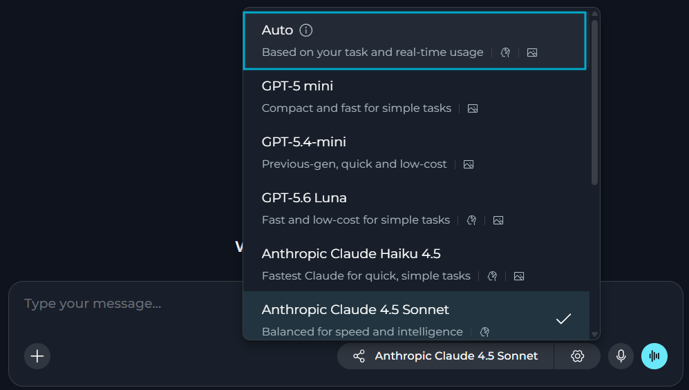
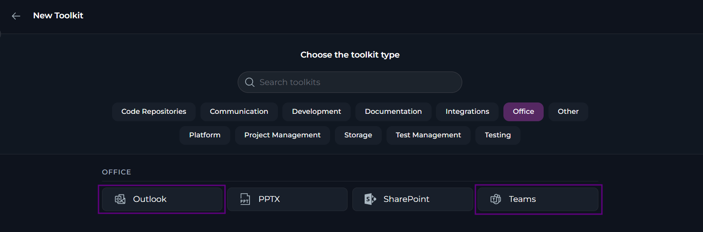

ELITEA 2.0.7 helps you get more done with less setup. This release introduces the Auto model selection, chat templates and AI-assisted fixes for evaluation results. It also gives you Outlook and Microsoft Teams toolkits, cost and usage analytics for individual runs and more control over who can access your conversations.

* **Release version**: 2.0.7
* **Released on**: October 11, 2026
* **Access**: [ELITEA Platform](https://next.elitea.ai)

## New Features

### Auto Model Selection

You can now let ELITEA choose the model and reasoning effort for each request by selecting **Auto** in the model selector dropdown of Chats and Agents.

* ELITEA will match a model (among those available in your project) and effort to the task, with cost taken into account.
* Keep the same model and effort throughout a run, including tool calls and resumed runs. Each new message can be routed again.
* Use **Auto** in Agents that call other Agents. Each Agent set to **Auto** is routed on its own.
* **Auto** is off by default. Platform administrators turn it on for the platform and set a project default, and projects can only narrow it.
* You must still select models yourself for Pipelines and Pipeline LLM nodes.

**Benefits:** Lower cost per completed task.

Details: [General Settings](../menus/settings/general#chat-configuration), [Select a Model](../how-tos/chat/config-mnmt#select-a-model), [Auto](../how-tos/chat/config-mnmt#auto-settings).

### Chat Templates

You can now save up to five chat templates in **Settings → General → Chat Configuration**, so that new chats are created with the participants you need.

* Create, rename and delete up to five templates per project.
* Add Agents, Pipelines, Toolkits, MCPs and, in team projects, Users as participants of a template.
* The template marked as default is applied to every new chat in the project.
* Participants that are no longer available are flagged in the template and are skipped when a chat is created.
* You can delete or change templates, when necessary. To delete the default template, first set another one as default.

**Benefits:** Less manual work when creating new chats.

Details: [General Settings](../menus/settings/general#chat-configuration), [Work with Chat Templates](../how-tos/chat/config-mnmt#work-with-chat-templates).

 General > Chat Configuration." />

### Outlook and Microsoft Teams Toolkits

You can now connect Agents and Pipelines to your Outlook mailbox and Microsoft Teams with two new toolkits that sign in with your Microsoft account.

**Outlook toolkit**
* List, get and search messages, folders and threads, and find new or unread messages.
* Send mail, reply to messages and mark them as read or unread.
* Move and delete messages.

**Microsoft Teams toolkit**
* List teams, channels and chats, and read chat messages.
* Search across chats and channels.
* Send chat messages. A 1:1 or group chat is created automatically if it doesn't exist.
* Send channel posts and replies, including @mentions.

<Note>
You can't edit a sent message in Outlook, or edit or delete a sent message in Teams. Reading channel messages in Teams is not supported because it needs tenant admin consent.
</Note>

**Benefits:** Agent and Pipeline access to email and Teams conversations, scoped to the signed-in user's permissions.

Details: [Outlook Toolkit](../integrations/toolkits/outlook_toolkit), [Microsoft Teams Toolkit](../integrations/toolkits/teams_toolkit).

### Project Theme

You can now select the project theme that matches your organization's branding.

* Project theme is configured by your platform administrators, including fonts, colors and logos. Platform administrators can also save customizations as presets, export them to JSON files and import them for reusing in other environments.
* Select the project theme in your preferences and see it applied across ELITEA.
* Get a warning when a text and background color combination is hard to read.

**Benefits:** Branded look for ELITEA.

Details: [Preferences](../menus/settings/preferences#general).

### Multiple Repositories in ADO Repos Toolkit

The Azure DevOps (ADO) Repos toolkit can now work across multiple repositories.

* Add zero, one or several repositories in the toolkit configuration.
* With one repository, tools use it automatically, as before.
* With none or several, specify the necessary repository in each tool call so the Agent targets the right one.
* Keep using existing toolkits without any changes.

**Benefits:** One toolkit for many repositories instead of one toolkit per repository.

Details: [Azure Repos Toolkit](../integrations/toolkits/ado_repos_toolkit).

### Personal Secrets in Code Nodes

You can now let a Code node in a shared project read the secrets of the user who runs the pipeline, so that everyone uses their own credentials.

* Use the new `get_private_project_secret(secret_name)` function.
* Get the secret from the personal project of the person running the pipeline.
* Secrets are not shared by default: allow external access for a secret in your private project to make it available to Code nodes in other projects.
* Users with the *viewer* role can run shared Agents and Pipelines with their own credentials.
* You will get an error if you have no personal project or the secret is not shared or does not exist. The function never falls back to a shared secret with the same name.

**Benefits:** Secure per-user credentials in shared pipelines.

Details: [Private Project Secrets](../how-tos/pipelines/nodes/execution-nodes#private-project-secrets).

### Enhance with AI for Evaluation Runs

You can now fix your agent evaluation runs with the new **Enhance with AI** feature.

* With **Enhance with AI**, ELITEA will analyze the evaluation results right away, with no prompt to write.
* Review the diagnosis and the improvement suggestions, with current and suggested instructions presented side by side. Coverage gaps are shown as notes pointing to the dataset editor.
* Select **Save as Version** to create a new version and leave the evaluated one as is. Fixes to dimensions and datasets are saved immediately and are not versioned.
* ELITEA will not suggest changes that cannot be applied and will show a clear message when nothing is suggested or generation fails.

**Benefits:** A faster path from a missed target to a fix, based on the evidence from your run.

Details: [Enhance with AI](../how-tos/agents-pipelines/agent-evaluation#enhance-with-ai), [Agent Evaluation FAQs](../how-tos/agents-pipelines/agent-evaluation-faq).

### Restrict Access to Public Chats

You can now restrict access to public chats.

* Only the chat's creator can restrict access to a public chat.
* Select what users and AI participants keep access to the chat. Project members whom you do not list will lose access.
* Restricting access does not revoke external share links.

**Benefits:** Quick recovery from accidental or temporary public sharing.

Details: [Restrict Access to Chats](../how-tos/chat/config-mnmt#restrict-access-to-chats).

## Changed Features

### Usage & Analytics Enhancements

You can now see analytics for individual runs and get earlier budget warnings.

* Get budget warnings at 80%, 90% and 95%.
* ELITEA will send a budget message in Chat when a project budget blocks a request. It stays in the conversation after a refresh.
* You can see the analytics, including costs, tokens, tools and health, for individual Agent runs (including agent evaluations) and Pipeline runs.
* Filter active users by role and see active and AI-active user counts per week for a date range.
* Update the usage data with the new **Refresh data** icon, without losing your tab, filters or pagination.

**Benefits:** Clearer budget alerts and better run cost visibility.

Details: [Usage](../menus/settings/usage), [Analytics](../menus/settings/analytics), [Budget Management](../how-tos/chat/ctxt-bdgt#budget-management), [Run Analytics (Agents & Pipelines)](../how-tos/agents-pipelines/agents-pipelines-history#run-analytics), [Run Analytics (Evaluations)](../how-tos/agents-pipelines/agent-evaluation#run-analytics).

### Agent Evaluation Enhancements

You can now set up evaluation suites and dimensions more easily and move between suites faster.

* Create a suite in a short dialog that asks only for a name and description, then proceed to the edit form. Nothing is autosaved before the suite exists.
* Select the dimensions to create from **Create Dimension with AI** using checkboxes or **Select all**, with the total count shown.
* Recognize each generated dimension by its evaluator, target and importance tags.
* Get generated dimensions with valid values, including standard scale, importance and target values. All generated dimensions can be edited manually.

**Benefits:** Faster evaluation setup with ready-to-use AI-generated dimensions.

Details: [Suites](../how-tos/agents-pipelines/agent-evaluation#suites), [Agent Evaluation](../how-tos/agents-pipelines/agent-evaluation), [Agent Evaluation FAQs](../how-tos/agents-pipelines/agent-evaluation-faq).

### Indexing Reporting and Scheduling Improvements

ELITEA provides new reporting and scheduling features for indexes.

* Keep a run going when one document fails: ELITEA will skip the document and record it in the report, and the run is labeled as **Partially indexed**. Only a run where nothing was indexed is reported as failed.
* ELITEA shows the indexing progress and flags stalled runs.
* ELITEA marks scheduled indexes with a specific icon.
* Current credentials of the toolkit are pre-selected when you schedule an index.
* Manage the index and pipeline schedules in one place, **Configuration → Runtime** in the Admin portal. **System → Schedules** shows them as locked with a link, and invalid schedules are rejected.

**Benefits:** Clearer index statuses and one place to manage schedules.

Details: [Create a New Index](../how-tos/indexing/using-indexes-tab-interface#create-a-new-index), [Configure Cron Expression](../how-tos/indexing/schedule-indexing#configure-cron-expression), [Schedule Card](../how-tos/indexing/schedule-indexing#schedule-card).

## Fixed Issues

* [#6702](https://github.com/EliteaAI/elitea_issues/issues/6702) The Agent page no longer crashes when the creator's account is deleted.
* [#6697](https://github.com/EliteaAI/elitea_issues/issues/6697) The context budget shows token counts for the history, system prompt and tools, and explains why summarization isn't triggered.
* [#6688](https://github.com/EliteaAI/elitea_issues/issues/6688) Remote MCP toolkits connect to servers with legacy SSE endpoints and redirects, with clearer errors for retired endpoints.
* [#6654](https://github.com/EliteaAI/elitea_issues/issues/6654) Refreshing the page while a chat response is being generated no longer causes an error.
* [#6637](https://github.com/EliteaAI/elitea_issues/issues/6637) SharePoint toolkit credentials can be saved after logging in with a delegated credential, without a page refresh.
* [#6636](https://github.com/EliteaAI/elitea_issues/issues/6636) Pipelines ask for SharePoint authentication instead of running a same-named tool from another toolkit.
* [#6627](https://github.com/EliteaAI/elitea_issues/issues/6627) The Agent header icon updates immediately after you select a new icon.
* [#6620](https://github.com/EliteaAI/elitea_issues/issues/6620) A successful reindexing no longer shows the previous failed status after a page refresh.
* [#6538](https://github.com/EliteaAI/elitea_issues/issues/6538) Total Cost on the Costs section matches the sum of its individual cost components.
* [#6406](https://github.com/EliteaAI/elitea_issues/issues/6406) The Remote MCP authorization popup shows the toolkit name instead of the server URL.
* [#6354](https://github.com/EliteaAI/elitea_issues/issues/6354) Cost estimation works correctly on the indexer, which has no database access.
* [#6274](https://github.com/EliteaAI/elitea_issues/issues/6274) MCP tool parameter names such as `fname[]` are sanitized, so Claude Code no longer fails with a 400 error.
* [#6273](https://github.com/EliteaAI/elitea_issues/issues/6273) Connected toolkits appear in the cloud MCP tools list, not only Agents tagged for MCP.
* [#5915](https://github.com/EliteaAI/elitea_issues/issues/5915) Summarization is triggered when tool calls in a single turn exceed the model's context window.

## Known Issues

* [#3151](https://github.com/EliteaAI/elitea_issues/issues/3151) PPT files fail to be read or indexed from Artifacts or SharePoint.
* [#2719](https://github.com/EliteaAI/elitea_issues/issues/2719) The MCP client disconnects on macOS even though the tray shows "connected".
* [#1567](https://github.com/EliteaAI/elitea_issues/issues/1567) MCP-tagged resources run the latest version only.
* [#6467](https://github.com/EliteaAI/elitea_issues/issues/6467) The first click on **Stop** while messages are queued shows an Agent configuration error and hides the **Stop** button, and queued messages keep running.
* [#6457](https://github.com/EliteaAI/elitea_issues/issues/6457) New messages can be processed before earlier queued messages, so responses may come back out of order or duplicated.